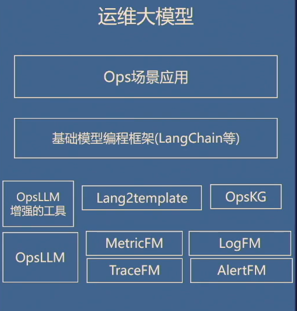

形而不错，未来可期。在智能运维领域运维大模型正逐渐成为热点话题，大模型时代的智能运维在学术研究和产业应用领域的表现如何，未来又将如何发展？带着以上问题，有请清华大学裴丹教授为我们解惑，带来运维大模型的前沿思考，有请裴教授。

大家好。

我是清华大学裴丹，然后大家知道在 chatGPT问世之后，引发了全民的关注和讨论，我们所处的运维行业也不例外，大家可能会有很多疑问，特别是我们所处的智能运维这个行业，我罗列一下**大家可能会关注的问题**，在大模型时代，那么我们运维有没有大模型，它的概念是什么？跟引发广泛讨论和巨大应用场景的大语言模型是什么关系？与我们 AIOps的关系是什么？如果他们有融合的话，如何融合对接？有没有一些运维专属的大模型？比如说我们经常会用到的指标，有没有他的大模型，有没有日志的大模型，如何解决大模型私有部署的问题，它的算力问题，它的语料问题，它的数据问题，面对百花齐放日新月异的开源大模型，如何搭建具体的运维的大模型的应用，短期内有哪些可以落地的这些具体的应用场景，中长期的愿景是什么？

我相信在座的各位跟我一样，针对这些问题都会有一些思考，有一些考虑，也有很多疑问，所以今天我就在这块跟大家分享一些到此时此刻为止，我的一些初步的偏主观一点的这些看法。抛砖引玉，我预测三个月之内关于这些问题的看法，可能我们整个社区会有更新的看法。

那么针对刚才那些问题，如果每个问题都打开仔细去探讨，会花很多的时间，我几个小时也讨论不完，那么咱们今天的时间有限，我就直接给出一些这些观点，可能没有时间论证，也没有时间去甚至去举例，直接给出一个**运维大模型的这样的一个框架**。

关于回答前面的一些问题的个人的主观看法，我们右下角（上面）的那幅图就给出了大致的框架，基本上它会有右下角的这边一个大语言模型，这个大语言模型不是通用的大语言模型，而是运维的大语言模型，然后同时还有一些针对我们运维的多模态数据的这样的一些**基础模型**，

然后还有我们运维的领域知识，还有基于大语言运维大语言模型的，它把我们传统的一些运维工具进行增强，然后基于这个基础模型编程框架，像langchain这样的编程框架，把这些模型穿在一起，然后支撑上面的运维的场景应用。所以基本上你可以认为是一个**融合的这样的一个模型**，不是说把运维的相关的语料都堆在一起，然后就训练一下练出一个统一的模型，这可能跟不少人的看法会有不同。我们说刚才说的运维大语言模型，运维专属大语言模型是一个什么概念？**首先它是基于最上面的开源的大语言模型的底座，有很多开源的这样的模型，然后（开源的大预言模型）基于公域的运维的语料数据，然后对它进行微调训练、提示引导**。

上面开源的大语言模型它是通用的，是开源的，可能它不是chatgpt可能是别的什么，但是基本上你可以认为是一个接受了这种通识教育的，接受了一个通识教育的大学本科生，他毕业了，他能够用自然语言交互，他能够有基本的理解能力工程能力，但是现在入职到了一家单位，他要接受关于运维的知识的培训，我们要给他进行运维语料的这种微调训练，对他提示引导，然后给他培养成就私域的运维语料的微调训练，然后培养成下面的运维的大语言模型，然后进行公域的训练之后，它具备了公域的基本的这种知识，但是到一家单位之后，**他要具备这家他私域的能力和知识，这样训练出来能够进行私有的部署**。

所以其实不是我们运维领域独有的，很多领域其实都是有，所以这边我简单引用一些在网上的一些文字不多阐述，“特定领域的模型对一家机构来说可能比chatGPT更有用，因为他们拥有更多的行业术语和专业知识，通过使用较小的预训练模型，而不是在 Open AI拥有的整个数据及知识之之上进行构建，花费会更少，这样大语言模型在针对具体的应用进行微调，到那个时候它会变得更小，甚至可以嵌到手机上”，准确度咱们不去探讨，因为它的技术是在日新月异，今天我们觉得不可行的，两周之后它就可能变成可行了，这是这样的一个基本的观点，运维大语言模型。然后基于这些我们可以为运维人员有若干应用，它可以做一些简单的应用，为运维人员提供这种公域私域的运维知识与运维人员，以符合人类习惯的方式，比如说问答进行交互，具备一定的自我学习、自我演化的能力。

**基于这些它跟这种传统的运维工具，包括经典的 AIOps的工具都可以自行交互，对它的交互进行增强，提供意图识别和总结的能力。简单的在已有的工具之外，包一层运维大语言模型的这样的一个外壳。**

你比如说我们有这样一个所谓的*智能事件管理平台*，这样的一个运维工具，智能运维的工具，下面是各种数据源，经过处理之后，经过各种多模态多种类型的异常检测之后，然后进行事件的这种简单的分析，给出初步的这种判断，能够对事件进行预警管理排查，有早、准、易、快、全的能力。但是要想跟它交互，如果把它配以在像上面这样的一个基于大语言模型的这样一个接口之后，可以针对这些它分析出来的结果进行结果的这种总结和交互，就像 chatGPT，你给他一段文字，他能够进行非常好的这种总结，这样一个**原来用起来有一定的技术门槛的工具的输出，能够辅以运维大语言模型的它这样的一个接口进行增强**，这只是举其中的一个例子。

再举另外一个例子就是*从运维语料中抽取结构化的运维知识*，刚才我们提到的是什么？是**大运维大语言模型在经过训练之后给已有的工具进行简单的输入输出增强**。那么其实还有很多工具，比如说我们基于运维知识图谱的工具，它的图谱的知识的获取，其实是以往它的质量是不是那么完善，那么有了这样大语言的模型，**它能够自然的去分析一个像类似这样的一个工单的数据，然后从里边分析出主谓宾，分析出故障的这种传播关系，谁导致了谁**。下面这有个简单的一个demo，我们已经做出来的一个小demo，就是一个工单的数据，它自动分析出来这里边的因果关系，提供给我们的运维知识图谱作为输入，然后知识图谱当然还会在供其他的工具进行消费，这是我们说的提供结构化的运维知识。

所以其实我的这边的观点也比较清晰，不是说都是通过这样的一个人机交互对话式的方式跟机器跟大模型交互，而是说其实像说知识图谱这样的，我们其实可以拿这种大语言的工具给他进行帮助。

比如说基于大语言模型，我们可以试图做一些**端对端的应用**，但是这里边有一个前提，如果你的**语料足够丰富，如果你的算力足够强，如果你的对准确度的要求不是那么高**，可以尝试类似这样的工作，这些工作在学术界都有发表。

比如说微软它在它的公有云上面拿到了很多的这种工单数据，然后*它基于这些工单数据，它就可以在发生一个新的故障的时候，自动的根据现象分析出来它目前的根因是什么，它的止损方案是什么*？

仅仅依赖于目前已有的一些类似语料这样的数据，但这个其实是有我前面说的那三个前提的，当然还可以做，像这样的一个**告警的这种摘要报告**，来了一堆告警风暴，都是偏文字性的，然后大语言模型说给他写个总结，可以出来这样的一个当然要单独的训练。

还有比如说**相似故障的这种查找**，这些都是可以尝试的。基于这个语料数据的模型搭建这种简单的应用，其上面这些我是个人认为基于已有的工具，已有的技术其实是可以短期内可以得落地的，当然有刚才说的前提和期待。

那么下面这个实际上是基于需要做一些额外的这种开发，基于前面说的这种大语言的运维模型，运维大语言模型，做一些这种开发，中期中期时间相对来说可以落地，比如说我们做一个工作，就从自然语言转换成某种形式的模板，举个简单的例子，从自然语言这样的一个描述，然后把它转换成这种图的SQL的查询。

比如说在我们的运维领域，我们已经搭建了一个运维的知识图谱，把数据中心里边的几百个节点上千万条边都已经构建好了。我对它进行查询的时候，我可得用这种图的这种查询的语句才能够查得快查得准。

那么对这个图的查询，语句的sql的撰写，其实是有比较大的技术门槛了，专门去学，我们能不能通过自然语言的描述把它翻译成直接的sql，其实是在业界是有自然语言翻译成 sql的，那么*Lang2Gsql* 我们也搭建了一个demo，然后并且基于跟我们建行合作的这种运维知识图谱的数据，然后能够针对这样的突破数据，然后基于这样的一个开发的框架，然后进行这种快速的信息的这种查询，能够针对这样的全域数据进行快速的数据交互，是把这幅图里边的这些相关节点的相关数据都能够快速的查询出来，这只是举一个例子，那么还会有到SQL的转换，到日志的查询语言spl的转换，到各种自动化的脚本的转换，到各种配置文件的转换到各种API的调用。我为什么说这个不是说会那么快，因为本身它对转换的准确度是要求比较高的，你转换错了转换的偏一点的结果会差很多，跟上面的可能还不太一样，这个其实是需要一定的开发的。

然后下面就是说**基于像 langchain 这样的这种这种基础模型的这种开发框架，对经典的这种运维工具进行编排，完成更复杂的这种运维任务，将用户的这种自然语言的指令转换成这种提示的模板，通过 agent 的拆解提示模板并和各个工具进行交互，结果合并后返回给用户**，这也是一个类似的例子。

对，我前面也提到了，就是说运维的大模型里边，它其实因为运维的数据是**多模态**的，我们举大家最熟悉的指标数据。大家最熟悉的指标数据，我们还会有其他的这种数据，日志数据、 trics的数据、告警的数据等等，不一而足。那么其实对这些数据的处理、分析、建模，然后以及在上面搭建应用是非常符合这种大模型也好，还有**基础模型** foundation modeled 的这样一个定义的，对吧？就是基础模型。

那么其实我认为根据以往的经验，其实是需要把这些建成它基础的模型，因为它跟大家熟悉的自然语言数据还是不一样的，对它进行单独的这种建模，比如说我们在这样的指标数据形态多样，非常差异非常大的情况下，如何建立这种基础的模型，然后在它的基础上，对它的预测，对它的建模，然后我在它上面进行，比如说基线的生成，不管它的模式是什么样子，对它进行这种模式的识别，不管它现在是突降后保持还是没有异常，还是缓慢，还是突增还是缓慢下降，自动的识别出来它的模态。

基于这些还能继续搭建各种场景，以及比如说另外一个下游任务就是趋势的预测，不管它本身的形态是什么，我都能够基于蓝色的曲线去预测到黄色的曲线的值。对吧？其实大家可以看到就是说这些任务不一样，它都是基于下面的指标数据的这些指标数据有很多共性，对他进行这种基础模型的建立是非常有必要的。

同理，基于日志数据也是一样，时间关系，我们跳过。

这些基础的模型，每一个都需要专门的建设。之前，我们是在这种小模型上面做了不少尝试，但是基于这种基础模型进行建设，这是需要比较多的这种这个研究和落地工作，这需要一个一定的时间，所以我认为时间上大概是中期，当然还包括大家已经有一定熟悉程度的运维知识图谱，对吧？

最终支撑这种端对端的场景，**中期最终把这些放在一起，就构成了这幅、整个架构图**，整个的运维大模型它是一个融合的大模型，然后这些场景是基于一些基础的编程框架，把各种新的工具、老的工具、被增强过的经典工具，包括知识图谱，穿在一起，搭建我们的这样的一个运维大模型，然后解决我们运维里边的迄今为止还有很多挑战的问题。

那么具体面临的挑战还是非常的多的，比如说我们就说以基础模型如何获取足够多的数据模型的精度训练和推理的开销，对吧？比如说我们在这边的运维的大语言模型，如何选取刚才说的底座的大语言模型，能否支持底座模型的替换，对吧？

如何设计并且迭代这种微调的方案，训练的开销和资源是不是够，然后在上面去搭建应用的时候，意图识别和提示工程具体怎么做，所以大家看看起来其实还是有不少的挑战要解决的，这边时间关系也不能充分的去论述，基本上给一个例子，然后给一个初步的个人的判断，就是**开源的底座的大模型的底座的性能和微调的方法突飞猛进**，我们这边其实就是大致收集了一下在过去45天内新发布的一些结果就冲到了我们大模型的各种榜单上的头部，有些可能大家之前都没有听说过，他突然一发布就冲到前面去了，对吧？

就比如说中文性能已经接近GPT4了，可免费商用模型参数176b40b的它又冲到榜单上去了，然后这边比如说能够在一台的8卡的机器上，65b的模型上进行全参微调，然后内存使用量降低10%，单机能做训练，其实具体细节这些例子都不重要，我想表达的一层意思是我三个月之后你再看这个例子都会发生了新的变化，它是日新月异，所以我想表达的一层意思是什么呢？就是**相信社区开源协作的力量，目前的计算效率问题能力，具体相对于模型规模的能力问题都会被逐渐的解决掉**。因为全世界的做人工智能的人他们都被调动起来了，大家协作在一起，要有开源的这样的基础，把这些问题都会逐渐解决掉，计算效率的问题可能是相对比较快能解决的，因此这个领域大模型很多，它是伴生着必须要私有部署的，它的这种应用的障碍也会逐渐会被扫除。

当然了进行这些模型的开发，以及基于这些模型的应用开发，其实还是有一定的技术门槛，需要一定的训练，所以对的难度要有一定的预期，对他的期望要合理，对他整个事情做的难度要有一定的敬畏之心。

同时当看到这个日新月异的这样的进展之后，大家肯定会说这个的确是让人非常兴奋，但是我具体要现在开始做应用的时候，我心里就很慌了，我到底选哪个，今天选了三个月之后，最牛的又变了怎么办？

其实我们也不是说头一次面对这样的这个问题，其实很多时候我们想一想我们在敏捷开发的时候，其实也都是尽量**松耦合，尽量每一个模块都能够被替换**。

好在，在我们的大**模型机器学习的领域，其实已经有相应的流水线**，这个术语是叫 FMOps 或者 LLMOps ，这是大模型的整个流水线。它的运维，包括如何适配问题，包括它的监控、模型训练的监控，包括基础模型的编程框架，刚才我提到的langchain，它是全套的流水线，如果我们基于这些，我们是有希望在每一步都能够我们不被它具体的一个选型锁死，将来能够替换，这样的话你在进行开发的时候，能够不断融合日新月异的开源大模型和微调的方法。

所以这就是针对这个问题，面对日新月异的大模型相关技术，如何搭建具体的运维大模型应用，简单**总结**一下前面的简单的个人的一些主观看法。

运维大模型是面向运维场景应用的一个融合模型，它是运维的大语言模型，多模态的基础模型加运维知识图谱，加上基础模型的这种编程框架，加上我们经典的 AIOps的工具，自动化的工具，监控的工具，融合在一起的这样的一个融合模型。同时要相信开源协作的力量，目前的效率问题、能力问题都会被逐渐解决。然后采用在开发大模型的应用的时候，采用大模型原生的这种软件架构，采用这种基础模型开发运维一站式流水线，类比于软件开发的那种cscd的流水线，松耦合的底座微调方法工具，它**可替换**，持续演进。

大模型的技术发展日新月异，本报告的观点3~6个月之内可能会被大幅刷新，欢迎拍砖，然后运维大模型本身我对它的前景非常的看好，但是也是再提醒一下比尔盖茨的名言一遍遍的被验证，在我们经典的AIOps的领域也被验证了。“对一项技术它所能带来的变化人们总是高估。第二个它1~2年内在我们实际应用中能产生的变化，低估未来5~10年的变革”，就是核心的意思是短期内我们要脚踏实地，根据现在的技术的它的进展，我们实际的应用，做一些能够落地的这样的应用，参见我前面给的落地路线，但是在这个过程中，它会逐渐的把一些问题都解决掉，人工智能通用领域的也给我们提供不断更新的这种工具，那么在未来的5~10年内一定会产生这种天翻地覆的变化。

好的，我今天的分享就到此结束，谢谢大家。

感谢裴教授的精彩分享。