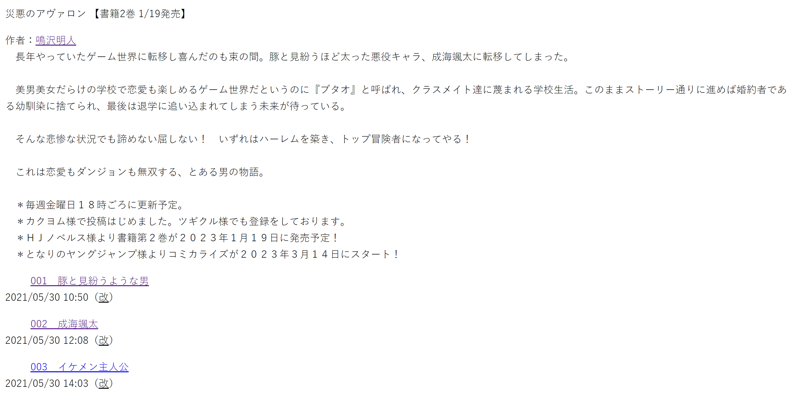
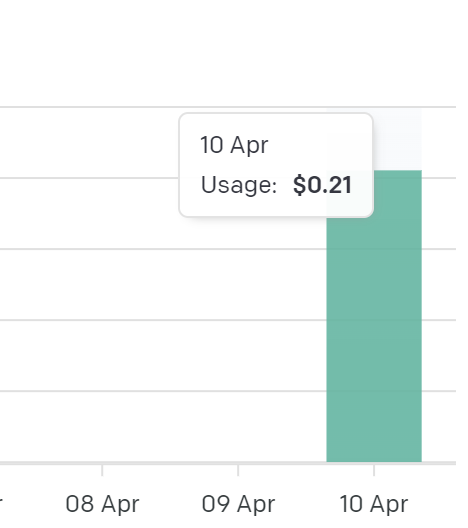

# Chatgpt 工程

## 23K的Python小白使用 Chatgpt 爬取小说并使用Chatgpt机翻

### 小说网站

[災悪のアヴァロン 【書籍2巻 1/19発売】](http://www.iot2ai.top/cgi-bin/intel/syosetu.html?nv=n3836gy/)



### 爬取小说过程

开始，我使用了简单的方法，直接告诉 Chatgpt 网址（下称为AI），并命令 AI 从网址下载所有链接的内容，并按顺序合并为一个txt文件，然后，下载了个寂寞。。。

接着，观察到所有章节都是 001 开头的，而且每个链接似乎都以 `http://www.iot2ai.top/cgi-bin/intel/syosetu.html?nv=n3836gy/*/` 形式存在，该处的“*”表示从1到118。故先尝试控制台爬取单个网址的内容并输出，直接告诉AI失败。

#### 第一次成功

由于之前接触SD是在Colab，而且某个开源的Chatgpt翻译项目也提供了Colab，就决定使用了（懒得配环境

然后，先尝试解析第一章的txt文件。下载第一章的网页，去除重复元素，并要求AI爬取：

```html
<!DOCTYPE html>
<html lang="ja">
	<head>
		<meta name="viewport" content="width=device-width, initial-scale=1.0">
		<meta charset="UTF-8">
		<title>001　豚と見紛うような男</title>
	</head>
	<body>
<div id="novel_color">


<div class="novel_bn">
<a href="?nv=n3836gy/2/">次へ&nbsp;&gt;&gt;</a>&nbsp;&nbsp;<a style="color:#ffa726" href="javascript:confirm('ダウンロード時間：2022/10/20 16:35。目次で内容が修正されているか、問題があるか確認してください。そうであれば、開いていくことができます')&&window.open('?nv=n3836gy/1/&fix=1','_self')">更新</a></div><!--novel_bn-->


<div id="novel_no">1/102</div>


<p class="novel_subtitle">001　豚と見紛うような男</p>


<div id="novel_honbun" class="novel_view">
<p id="L1">「――新入生の皆さん、入学おめでとう」</p>
<p id="L2"><br /></p>
<p id="L3">　やたら肩幅が広く目つきの鋭いオッサンが壇上でこちらを睨みながらマイク越しに話している。この学校の校長だというが、その雰囲気はスーツを着ていても明らかにカタギではない。</p>
<p id="L4"><br /></p>
<p id="L5">「我が国が誇る国立冒険者高等学校。ここには最新の知識と最高の環境がある」</p>
<p id="L6"><br /></p>
<p id="L7">　そう、ここは冒険者学校の入学式、らしい。らしいというのは――</p>
<p id="L8"><br /></p>
<p id="L9">「精進し、選び抜かれた諸君らの才能をさらに磨き上げ、国民の期待に応えていけるよう期待している」</p>
<p id="L10"><br /></p>
<p id="L11">　気づいたらこの席、扇状に席が並ぶ講堂にいたからだ。</p>
<p id="L12">　</p>
<p id="L13">　もしかして壮大なドッキリかと疑ってもみたが、小物かつ小市民である俺にそんなことしても大したリアクションなど取れるわけがなく、視聴率的にも意味がない。にしてもここは――</p>
<p id="L14"><br /></p>
<p id="L15">「冒険者大学進学、特殊任務部隊、高位冒険者が在籍する攻略クラン。それぞれ希望する進路や目標があると思うが、仲間達と切磋琢磨し」</p>
<p id="L16"><br /></p>
<p id="L17">　この巨大な講堂も、あの厳つい校長も見覚えがある。前の方にいる真っ赤な髪を刈り揃えた男子生徒に、軽いウェーブがかかった桃色のセミロングの女子生徒も知っている。</p>
<p id="L18">　</p>
<p id="L19">　周りには両刃の斧や槍のようなものを持ち込んで入学式に臨んでいる学生もチラホラ見える。中央の一番先頭には派手な色の着物を着た女の子が、その隣にフルプレートメイルも見える。</p>
<p id="L20"><br /></p>
<p id="L21">　間違いない。ここはあのゲームのオープニングの場面だ。</p>
<p id="L22"><br /></p>
<p id="L23">「貴重な学校生活を、悔いのない充実したものにできるよう過ごしてもらいたい」</p>
<p id="L24"><br /></p>
<p id="L25">　まさか。本当にゲーム内に来られるとは。</p>
<p id="L26"><br /></p>
<p id="L27"><br /></p>
<p id="L28"><br /></p>
<p id="L29">　*・・*・・*・・*・・*・・*</p>
<p id="L30"><br /></p>
<p id="L31"><br /></p>
<p id="L32"><br /></p>
<p id="L33">　より強力で珍しい武器と防具を探し集め、凶悪強大な敵との死闘を潜り抜けながらダンジョン深層を目指し攻略する本格派アクション、でもあり、幾人かの可愛い女の子達――後に実装されたＤＬＣ（※１）で女性プレイヤー向けのためにイケメンも複数人用意！――と恋愛が楽しめる恋愛学園アドベンチャーを織り交ぜた、ダンジョン恋愛ＶＲＭＭＯ、ダンジョンエクスプローラークロニクル。通称「ダンエク」。</p>
<p id="L34"><br /></p>
<p id="L35">　要するに「ドキドキの恋をしながらダンジョン潜らない？」ってゲームだ。</p>
<p id="L36"><br /></p>
<p id="L37">　プレイするにはＶＲ用のヘッドマウントディスプレイと手にはめるグローブ型のコントローラー、そしてモーションキャプチャーカメラが必要なため初期コストが高く、またゲームを作ったメーカーも無名。発売当初は全く売れず、知る人ぞ知るといったゲームだった。</p>
<p id="L38"><br /></p>
<p id="L39">　しかし美麗なグラフィックに完成度の高いアクション、奥深いゲームシステムがじわりじわりと口コミで噂になり、後に追加された攻略キャラやカスタマイズモード、ＰｖＰや数百人規模で参加できる戦争モードで人気に火が着き、ゲーマーなら誰もが知るほどのゲームとなるまで時間はそれほどかからなかった。</p>
<p id="L40"><br /></p>
<p id="L41">　俺は学生時代にハマってから、社会人になってもずっとこのゲームを続けていた。最初の頃は下手っぴだった操作も今ではボス攻略や対人戦を幾度も繰り返し、かなり上手くなったと自負している。まぁ上には上がいるもんだが。</p>
<p id="L42"><br /></p>
<p id="L43">　家に帰るとすぐにシャワーを浴びて、レンジで温めた冷凍食品を掻き込み、コントローラーのグローブを装着。腕を振り回すので、壁や物に当たらないようにポジション取りをしてゲームを起動する。</p>
<p id="L44">　</p>
<p id="L45">　掌で空中をなぞり、生体認証ログイン。メール着信のマークが付いている。ダンエク運営からだ。</p>
<p id="L46"><br /></p>
</div>


<div class="novel_bn">
<a href="?nv=n3836gy/2/">次へ&nbsp;&gt;&gt;</a><a href="?nv=n3836gy/">目次</a>&nbsp;&nbsp;<a style="color:#ffa726" href="javascript:confirm('ダウンロード時間：2022/10/20 16:35。目次で内容が修正されているか、問題があるか確認してください。そうであれば、開いていくことができます')&&window.open('?nv=n3836gy/1/&fix=1','_self')">更新</a></div>

</div>
	</body>
</html>
```


**如何使用colab爬取该小说网站中小说的内容？**

>   为了在Google Colab上爬取该小说网站的内容，您可以使用Python和一些库，如`requests`和`BeautifulSoup`。下面是一个简单的示例，说明如何在Google Colab上爬取并解析网页内容：
>
>   1.  首先，打开一个新的Google Colab笔记本。
>   2.  安装必要的库，如果您还没有安装它们的话：
>
>   ```python
>   !pip install requests
>   !pip install beautifulsoup4
>   ```
>
>   1.  在一个代码单元格中，编写一个简单的爬虫来抓取和解析小说内容：
>
>   ```python
>   import requests
>   from bs4 import BeautifulSoup
>   
>   # 设置要抓取的URL
>   url = 'https://ncode.syosetu.com/n3836gy/1/'
>   
>   # 发送请求并获取响应
>   response = requests.get(url)
>   
>   # 检查响应状态是否为200（成功）
>   if response.status_code == 200:
>       # 使用BeautifulSoup解析HTML内容
>       soup = BeautifulSoup(response.content, 'html.parser')
>       
>       # 提取小说内容
>       novel_content = soup.find('div', {'id': 'novel_honbun'}).find_all('p')
>       
>       # 遍历提取到的内容并输出
>       for p in novel_content:
>           print(p.text)
>   else:
>       print(f"请求失败，状态码：{response.status_code}")
>   ```
>
>   这个简单的示例将抓取页面内容并提取`<div id="novel_honbun">`标签中的所有`<p>`标签。然后，它将遍历这些段落并输出文本。
>
>   如果您希望抓取多个页面，只需创建一个循环并更改URL以匹配您要抓取的页面。
>
>   **注意**：在编写爬虫时，请务必遵守目标网站的“robots.txt”文件规定，并确保您的爬虫不会对网站服务器造成不必要的压力。根据网站的要求，您可能需要在请求中设置一些额外的头信息，比如设置User-Agent。

观察到输出成功！

#### 接连失败

但是，接下来问题就来了

**将上述代码改写为从`http://www.iot2ai.top/cgi-bin/intel/syosetu.html?nv=n3836gy/*/`下载并解析网页内容，然后按顺序合并成一个txt文件，该处的“*”表示从1到118，**

>   根据您的要求，我修改了代码以从"http://www.iot2ai.top/cgi-bin/intel/syosetu.html?nv=n3836gy/*/"下载并解析网页内容，并将其合并为一个txt文件。这里的“*”表示从1到118。请注意，爬取大量页面可能需要一些时间。
>
>   ```python
>   import requests
>   from bs4 import BeautifulSoup
>   
>   # 保存小说内容的文件
>   output_file = 'novel.txt'
>   
>   # 打开文件，准备写入内容
>   with open(output_file, 'w', encoding='utf-8') as f:
>       # 遍历页面编号，从1到118
>       for i in range(1, 119):
>           # 设置要抓取的URL
>           url = f'http://www.iot2ai.top/cgi-bin/intel/syosetu.html?nv=n3836gy/{i}/'
>   
>           # 发送请求并获取响应
>           response = requests.get(url)
>   
>           # 检查响应状态是否为200（成功）
>           if response.status_code == 200:
>               # 使用BeautifulSoup解析HTML内容
>               soup = BeautifulSoup(response.content, 'html.parser')
>   
>               # 提取小说内容
>               novel_content = soup.find('div', {'id': 'novel_honbun'}).find_all('p')
>   
>               # 遍历提取到的内容并写入文件
>               for p in novel_content:
>                   f.write(p.text + '\n')
>   
>               # 输出当前抓取的页面编号，以便查看进度
>               print(f'页面 {i} 已抓取')
>           else:
>               print(f"请求失败，状态码：{response.status_code}")
>   ```
>
>   这个代码将按顺序抓取页面内容，并将其合并为一个名为"novel.txt"的文本文件。爬取过程中，它还将输出当前抓取的页面编号，以便您查看进度。

输出报错

```
AttributeError                            Traceback (most recent call last)
<ipython-input-18-c3204d7fa470> in <cell line: 5>()
     16 
     17         # 提取小说内容
---> 18         novel_content = soup.find('div', {'id': 'novel_honbun'}).find_all('p')
     19 
     20         # 遍历提取到的内容并输出

AttributeError: 'NoneType' object has no attribute 'find_all'
```


>   对于您提到的错误，这表明某些页面可能没有`'div'`标签，其属性`id`为`'novel_honbun'`。为解决此问题，我们可以在尝试提取内容之前先检查是否找到了正确的标签。下面是更新后的代码：
>
>   ```
>   pythonCopy codeimport requests
>   from bs4 import BeautifulSoup
>   
>   # 保存小说内容的文件
>   output_file = 'novel.txt'
>   
>   # 打开文件，准备写入内容
>   with open(output_file, 'w', encoding='utf-8') as f:
>       # 遍历页面编号，从1到118
>       for i in range(1, 119):
>           # 设置要抓取的URL
>           url = f'http://www.iot2ai.top/cgi-bin/intel/syosetu.html?nv=n3836gy/{i}/'
>   
>           # 发送请求并获取响应
>           response = requests.get(url)
>   
>           # 检查响应状态是否为200（成功）
>           if response.status_code == 200:
>               # 使用BeautifulSoup解析HTML内容
>               soup = BeautifulSoup(response.content, 'html.parser')
>   
>               # 查找小说内容所在的标签
>               novel_content_tag = soup.find('div', {'id': 'novel_honbun'})
>   
>               # 检查是否找到正确的标签
>               if novel_content_tag:
>                   # 提取小说内容
>                   novel_content = novel_content_tag.find_all('p')
>   
>                   # 遍历提取到的内容并写入文件
>                   for p in novel_content:
>                       f.write(p.text + '\n')
>   
>                   # 输出当前抓取的页面编号，以便查看进度
>                   print(f'页面 {i} 已抓取')
>               else:
>                   print(f"页面 {i}：找不到 'div' 标签，其属性 'id' 为 'novel_honbun'")
>           else:
>               print(f"请求失败，状态码：{response.status_code}")
>   ```
>
>   这个修改后的代码将检查是否找到了正确的标签，如果没有找到，则输出相应的信息，以便您了解具体哪些页面可能存在问题。

报错

```
页面 2：找不到 'div' 标签，其属性 'id' 为 'novel_honbun'
从页面2之后输出类似以上错误
```

>   抱歉给您带来了困扰。我检查了您提到的页面，并发现这些页面的URL格式与第一页不同。从第2页开始，URL中的页面编号应该在`nv=n3836gy`之后，而不是在URL末尾。以下是修改后的代码，应该可以解决问题。
>
>   ```python
>   import requests
>   from bs4 import BeautifulSoup
>   
>   # 保存小说内容的文件
>   output_file = 'novel.txt'
>   
>   # 打开文件，准备写入内容
>   with open(output_file, 'w', encoding='utf-8') as f:
>       # 遍历页面编号，从1到118
>       for i in range(1, 119):
>           # 设置要抓取的URL
>           if i == 1:
>               url = f'http://www.iot2ai.top/cgi-bin/intel/syosetu.html?nv=n3836gy/{i}/'
>           else:
>               url = f'http://www.iot2ai.top/cgi-bin/intel/syosetu.html?nv=n3836gy/{i}/&fix=1'
>   
>           # 发送请求并获取响应
>           response = requests.get(url)
>   
>           # 检查响应状态是否为200（成功）
>           if response.status_code == 200:
>               # 使用BeautifulSoup解析HTML内容
>               soup = BeautifulSoup(response.content, 'html.parser')
>   
>               # 查找小说内容所在的标签
>               novel_content_tag = soup.find('div', {'id': 'novel_honbun'})
>   
>               # 检查是否找到正确的标签
>               if novel_content_tag:
>                   # 提取小说内容
>                   novel_content = novel_content_tag.find_all('p')
>   
>                   # 遍历提取到的内容并写入文件
>                   for p in novel_content:
>                       f.write(p.text + '\n')
>   
>                   # 输出当前抓取的页面编号，以便查看进度
>                   print(f'页面 {i} 已抓取')
>               else:
>                   print(f"页面 {i}：找不到 'div' 标签，其属性 'id' 为 'novel_honbun'")
>           else:
>               print(f"请求失败，状态码：{response.status_code}")
>   ```
>
>   这个修改后的代码应该可以正确抓取所有页面的内容。再次为之前的错误向您道歉。

#### 成功发现问题

仔细检查多遍，发现AI开始胡编了，因为我将第一个成功输出的代码中url的链接改写为2后，仍能正常输出。怀疑是反爬机制的问题，于是

```python
import requests
from bs4 import BeautifulSoup

# 设置要抓取的URL
url = 'http://www.iot2ai.top/cgi-bin/intel/syosetu.html?nv=n3836gy/1/'

# 发送请求并获取响应
response = requests.get(url)

# 检查响应状态是否为200（成功）
if response.status_code == 200:
    # 使用BeautifulSoup解析HTML内容
    soup = BeautifulSoup(response.content, 'html.parser')
    
    # 提取小说内容
    novel_content = soup.find('div', {'id': 'novel_honbun'}).find_all('p')
    
    # 遍历提取到的内容并输出
    for p in novel_content:
        print(p.text)
else:
    print(f"请求失败，状态码：{response.status_code}")
```

**将该代码的下载链接改写为"http://www.iot2ai.top/cgi-bin/intel/syosetu.html?nv=n3836gy/*/"该处的“*”表示从1到118，每次循环中加入10秒的停顿**

>   您可以使用`time.sleep()`方法在每次循环中添加10秒的暂停。首先，需要导入`time`模块。这是修改后的代码：
>
>   ```python
>   import requests
>   from bs4 import BeautifulSoup
>   import time
>   
>   # 遍历页面编号，从1到118
>   for i in range(1, 119):
>       # 设置要抓取的URL
>       url = f'http://www.iot2ai.top/cgi-bin/intel/syosetu.html?nv=n3836gy/{i}/'
>   
>       # 发送请求并获取响应
>       response = requests.get(url)
>   
>       # 检查响应状态是否为200（成功）
>       if response.status_code == 200:
>           # 使用BeautifulSoup解析HTML内容
>           soup = BeautifulSoup(response.content, 'html.parser')
>           
>           # 提取小说内容
>           novel_honbun = soup.find('div', {'id': 'novel_honbun'})
>   
>           # 检查是否找到了具有'id'属性为'novel_honbun'的'div'标签
>           if novel_honbun:
>               novel_content = novel_honbun.find_all('p')
>               
>               # 遍历提取到的内容并输出
>               for p in novel_content:
>                   print(p.text)
>           else:
>               print(f"在页面{i}上找不到'div'标签，其属性'id'为'novel_honbun'")
>       else:
>           print(f"请求失败，状态码：{response.status_code}")
>       
>       # 在每次循环中暂停10秒
>       time.sleep(10)
>   ```
>
>   现在，程序将在每次循环之间暂停10秒。这有助于避免过于频繁地发送请求给目标网站，从而减轻对其服务器的压力。

发现能成功处理 1~3 话！所以这个网站可能加入了反爬虫机制。如果第四个访问请求间隔的时间是一定的，那么就屏蔽掉？

#### 彻底解决问题

**还是太频繁了，“程序将在每次循环之间暂停10秒。”改为“程序将在每次循环之间随机暂停30~60秒”**

>   要在每次循环之间随机暂停30~60秒，您可以使用`random.randint()`函数。首先，需要导入`random`模块。这是修改后的代码：
>
>   ```python
>   import requests
>   from bs4 import BeautifulSoup
>   import time
>   import random
>   
>   # 遍历页面编号，从1到118
>   for i in range(1, 119):
>       # 设置要抓取的URL
>       url = f'http://www.iot2ai.top/cgi-bin/intel/syosetu.html?nv=n3836gy/{i}/'
>   
>       # 发送请求并获取响应
>       response = requests.get(url)
>   
>       # 检查响应状态是否为200（成功）
>       if response.status_code == 200:
>           # 使用BeautifulSoup解析HTML内容
>           soup = BeautifulSoup(response.content, 'html.parser')
>           
>           # 提取小说内容
>           novel_honbun = soup.find('div', {'id': 'novel_honbun'})
>   
>           # 检查是否找到了具有'id'属性为'novel_honbun'的'div'标签
>           if novel_honbun:
>               novel_content = novel_honbun.find_all('p')
>               
>               # 遍历提取到的内容并输出
>               for p in novel_content:
>                   print(p.text)
>           else:
>               print(f"在页面{i}上找不到'div'标签，其属性'id'为'novel_honbun'")
>       else:
>           print(f"请求失败，状态码：{response.status_code}")
>       
>       # 在每次循环中随机暂停30~60秒
>       time.sleep(random.randint(30, 60))
>   ```
>
>   现在，程序将在每次循环之间随机暂停30~60秒。这有助于避免过于频繁地发送请求给目标网站，从而减轻对其服务器的压力。

发现Colab控制台源源不断地输出了！

```
import requests
from bs4 import BeautifulSoup
import time
import random

# 打开文件，以便将小说内容逐步写入
with open("output.txt", "w", encoding='utf-8') as file:
    # 遍历页面编号，从1到118
    for i in range(1, 119):
        # 设置要抓取的URL
        url = f'http://www.iot2ai.top/cgi-bin/intel/syosetu.html?nv=n3836gy/{i}/'

        # 发送请求并获取响应
        response = requests.get(url)

        # 检查响应状态是否为200（成功）
        if response.status_code == 200:
            # 使用BeautifulSoup解析HTML内容
            soup = BeautifulSoup(response.content, 'html.parser')

            # 提取小说内容
            novel_honbun = soup.find('div', {'id': 'novel_honbun'})

            # 检查是否找到了具有'id'属性为'novel_honbun'的'div'标签
            if novel_honbun:
                novel_content = novel_honbun.find_all('p')

                # 遍历提取到的内容并写入文件
                for p in novel_content:
                    file.write(p.text + "\n")
            else:
                print(f"在页面{i}上找不到'div'标签，其属性'id'为'novel_honbun'")
        else:
            print(f"请求失败，状态码：{response.status_code}")

        # 在每次循环中随机暂停30~60秒
        time.sleep(random.randint(30, 60))

```

在上述代码中加入功能，每次下载完形如“http://www.iot2ai.top/cgi-bin/intel/syosetu.html?nv=n3836gy/{i}/”网站中小说的内容，在控制台打印该链接，并表示该链接中的小说已经被下载了

不足：不稳定，有时候会卡在` # 发送请求并获取响应`

1-112.txt

最后翻译到112话

### 机翻过程

#### API

[Raychanan/ChatGPT\-for\-Translation: Use Python and ChatGPT for translation\. 利用Python和ChatGPT完成翻译。](https://github.com/Raychanan/ChatGPT-for-Translation)

使用上述的 Colab 笔记，可能比较方便，但是我用着老出现 

```
Rate limit reached for default-gpt-3.5-turbo in organization org-baJjMb1mXw4lyBpF8YTpoOnG on requests per min. Limit: 20 / min. Please try again in 3s. Contact support@openai.com if you continue to have issues. Please add a payment method to your account to increase your rate limit. Visit https://platform.openai.com/account/billing to add a payment method.
Rate limit hit. Sleeping for 2 seconds.
```

所以翻译了几张就感觉时间好像要很久，然后就没翻译了



见文件夹中的 翻译by_api.txt

#### 官网对话

**在这个对话中，我让你来充当翻译家，你的目标是把任何语言翻译成中文，请翻译时不要带翻译腔，而是要翻译得自然、流畅和地道，使用优美和高雅的表达方式。下面我会逐渐输入日文小说，“{}”都是小说内容，请将小说翻译成中文，并去掉括号，明白了吗？**

参考了[🧠ChatGPT 中文调教指南 \| ChatGPT 中文调教指南](https://chatguide.plexpt.com/#%E5%85%85%E5%BD%93%E8%8B%B1%E8%AF%AD%E7%BF%BB%E8%AF%91%E5%92%8C%E6%94%B9%E8%BF%9B%E8%80%85)

在ai官网中，使用对话翻译，见

爬到112章.docx

AI老忘记自己是个翻译家。。。

#### API的资费问题

**已知api花费$0.002 / 1K tokens，帮我估计使用openai的chatgpt3的api接口翻译526175个日语字到中文花费**

>   假设您的526175个日语字是以纯文本格式存储的，您可以使用以下Python代码计算出令牌数并估算出使用OpenAI API进行翻译的费用：
>
>   ```python
>   import openai_secret_manager
>   import openai
>   import math
>   
>   # 获取OpenAI API的凭据
>   assert "openai" in openai_secret_manager.get_services()
>   secrets = openai_secret_manager.get_secret("openai")
>   
>   # 将文本分割成多个小块，每块不超过2048个字符
>   text = "YOUR JAPANESE TEXT HERE"
>   chunks = [text[i:i+2048] for i in range(0, len(text), 2048)]
>   
>   # 使用OpenAI API进行翻译
>   openai.api_key = secrets["api_key"]
>   model_engine = "text-davinci-002"
>   translations = []
>   for chunk in chunks:
>       response = openai.Completion.create(
>           engine=model_engine,
>           prompt=f"翻译日语到中文：\n{chunk}\n",
>           max_tokens=2048,
>           n=1,
>           stop=None,
>           temperature=0.5,
>       )
>       translation = response.choices[0].text.strip()
>       translations.append(translation)
>   
>   # 合并翻译结果并计算令牌数
>   translation = "".join(translations)
>   num_tokens = len(translation.split())
>   
>   # 计算费用
>   price_per_token = 0.002 / 1000
>   cost = math.ceil(num_tokens) * price_per_token
>   
>   print(f"翻译了 {num_tokens} 个令牌，预计费用为 ${cost:.2f}")
>   ```
>
>   在这个代码中，您需要将“YOUR JAPANESE TEXT HERE”替换为您要翻译的日语文本。代码将文本分割成多个小块，并使用OpenAI API进行翻译。最后，代码将翻译结果合并起来，并计算令牌数和估计的费用。需要注意的是，这里使用了最大令牌数为2048，这是因为ChatGPT-3的输入限制为2048个字符。如果您的文本更长，则需要将文本分成更多的块，或者使用不同的机器翻译服务。
>
>   根据上述计算公式，您需要翻译的526175个日语字大约会生成526175/3 ≈ 175391个令牌（这里假设平均每个日语字翻译成3个英文单词）。因此，根据每1000个令牌花费$0.002的价格，预计翻译的费用大约为$0.35（即175391/1000 * $0.002）。请注意，这个估计的费用仅供参考，实际的费用可能会因为OpenAI的定价策略变化等因素而有所不同。