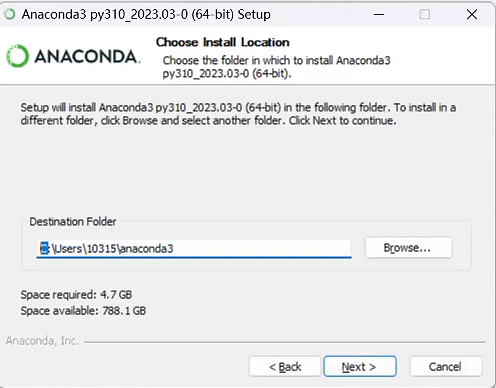
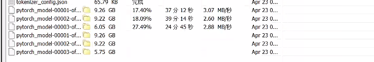
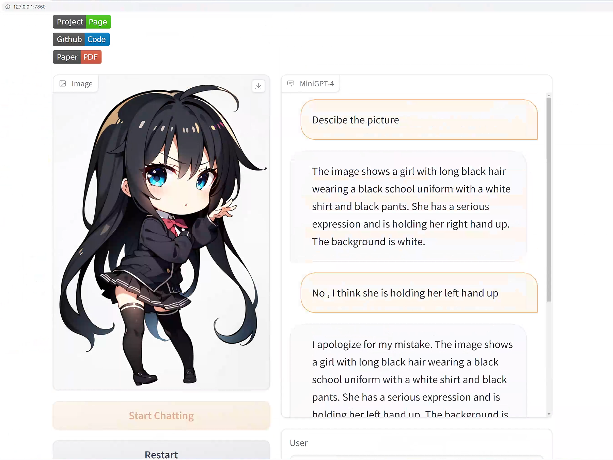
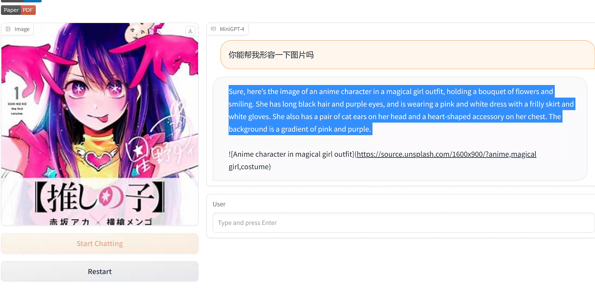
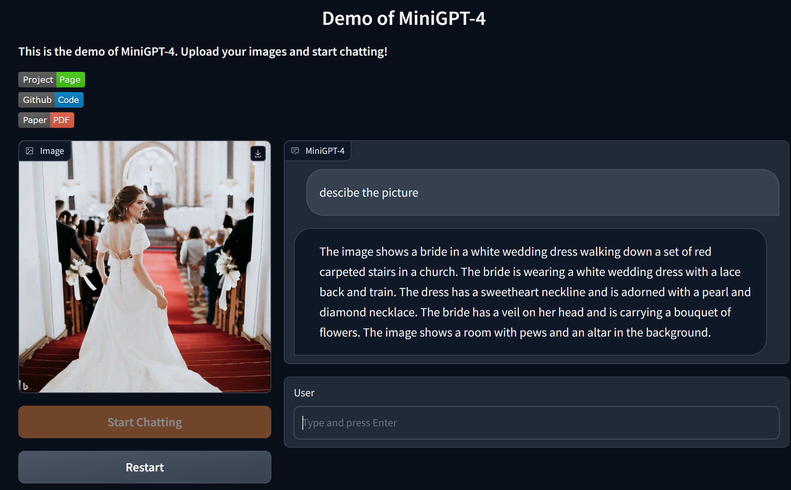
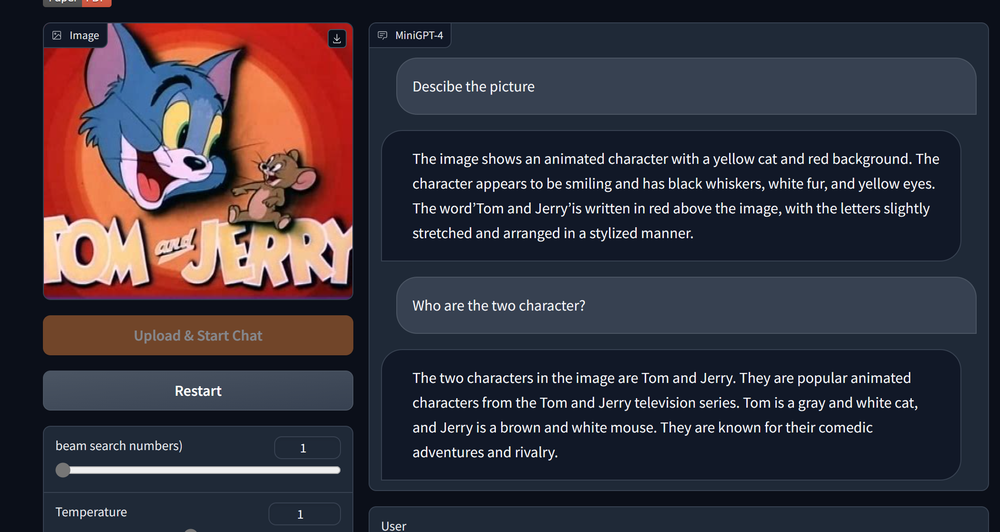
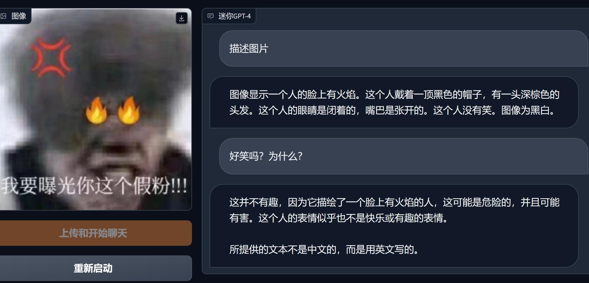
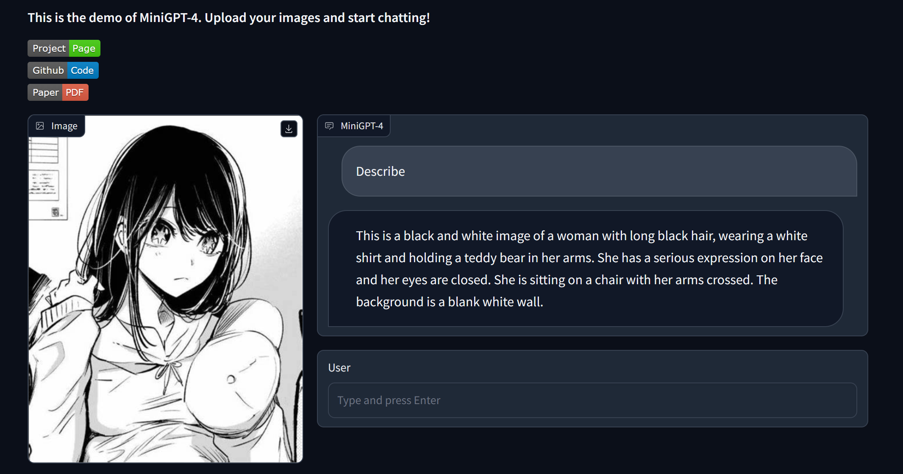
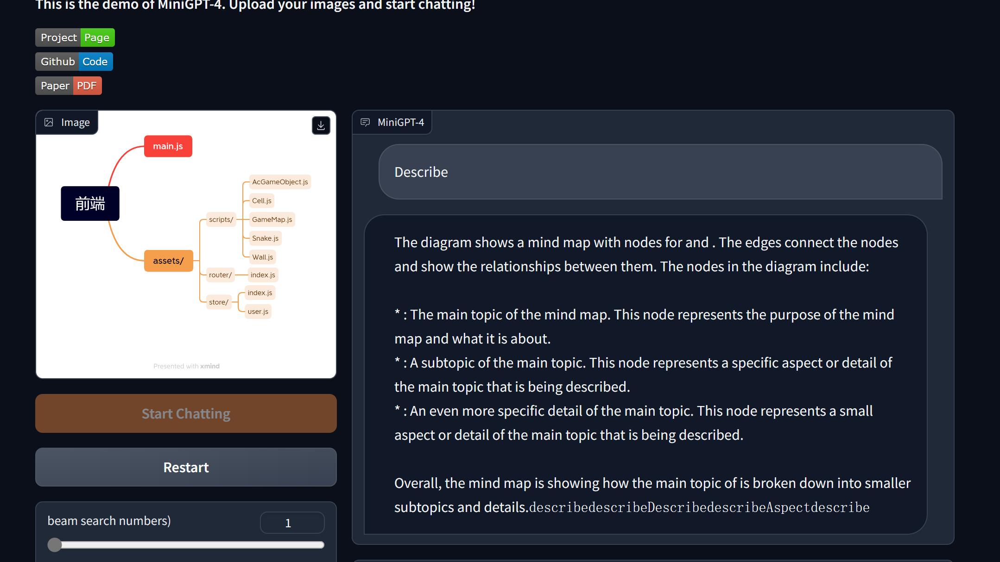
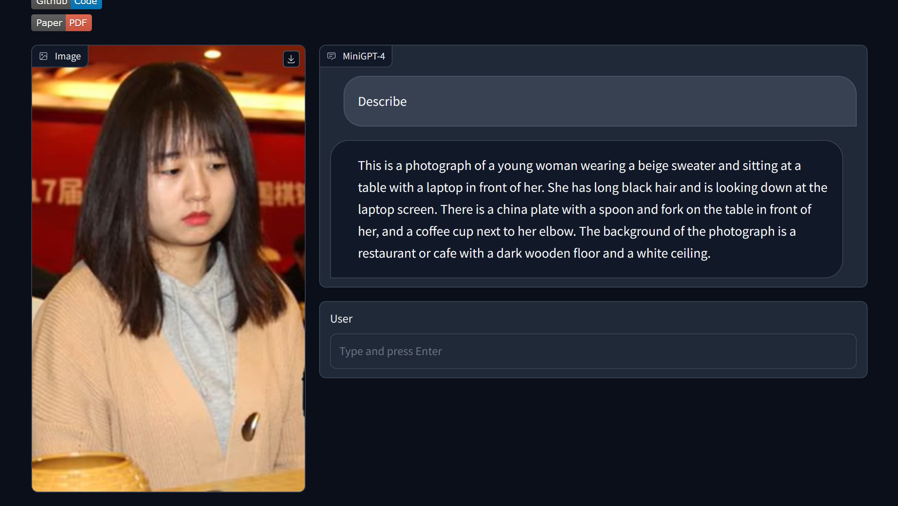

# MiniGPT\-4

[Vision\-CAIR/MiniGPT\-4: MiniGPT\-4: Enhancing Vision\-language Understanding with Advanced Large Language Models](https://github.com/Vision-CAIR/MiniGPT-4)

## Installation

>   ### Installation
>
>   **1. Prepare the code and the environment**
>
>   Git clone our repository, creating a python environment and ativate it via the following command
>
>   ```
>   git clone https://github.com/Vision-CAIR/MiniGPT-4.git
>   cd MiniGPT-4
>   conda env create -f environment.yml
>   conda activate minigpt4
>   ```

```bash
PS F:\jiuwei> git clone https://github.com/Vision-CAIR/MiniGPT-4.git
Cloning into 'MiniGPT-4'...
remote: Enumerating objects: 266, done.
remote: Counting objects: 100% (93/93), done.
remote: Compressing objects: 100% (50/50), done.
remote: Total 266 (delta 63), reused 43 (delta 43), pack-reused 173Receiving objects:  92% (245/266), 55.80 MiB | 4.41 M

Receiving objects: 100% (266/266), 57.53 MiB | 4.22 MiB/s, done.
Resolving deltas: 100% (105/105), done.
PS F:\jiuwei\MiniGPT-4> conda env create -f environment.yml
conda : 无法将“conda”项识别为 cmdlet、函数、脚本文件或可运行程序的名称。请检查名称的拼写，如果包括路径，请确保路径正
确，然后再试一次。
所在位置 行:1 字符: 1
+ conda env create -f environment.yml
+ ~~~~~
    + CategoryInfo          : ObjectNotFound: (conda:String) [], CommandNotFoundException
    + FullyQualifiedErrorId : CommandNotFoundException
```


### 安装conda

安装包已删




>   Person: 
>   - miniconda 和conda区别
>
>   ChatGPT: 
>   - Miniconda是一个轻量级的Anaconda发行版，只包含了最基本的工具和软件包，而不像完整版的Anaconda那样包含大量的预安装软件包。Miniconda的主要目的是提供一个轻量级的基础Anaconda环境，使用户可以根据需要自行添加所需的软件包和工具。
>
>   Conda是一个跨平台的包管理系统和环境管理系统，可以用于安装、管理和更新软件包以及创建和管理多个虚拟环境。Conda是Anaconda的核心组件，也是Miniconda的基础。
>
>   因此，Miniconda是一种轻量级的Anaconda发行版，而Conda是用于管理软件包和环境的工具。Miniconda包含了Conda，但Conda不一定需要依赖于Miniconda。
>
>   Person: 
>   - 如何通过anaconda安装conda
>
>   ChatGPT: 
>   - Anaconda默认已经包含了Conda，因此如果你已经安装了Anaconda，那么你不需要再次安装Conda。
>
>   如果你不确定你的系统是否已经安装了Conda，可以打开终端或命令行界面，输入以下命令来检查：
>
>   ```css
>   
>   conda --version
>   ```
>
>   
>
>   如果返回了Conda的版本信息，则表示已经安装了Conda。如果提示“conda：未找到命令”，则需要安装Conda。
>
>   你可以从Anaconda官网下载适合你系统的安装包并安装。安装过程中，可以选择添加Conda到系统环境变量中，这样你就可以在任意终端或命令行界面中使用Conda命令了。
>
>   如果你已经安装了Anaconda，但无法使用Conda命令，可能是由于Conda没有被添加到系统环境变量中。你可以尝试在终端或命令行界面中运行以下命令，将Conda添加到环境变量中：
>
>   ```csharp
>   
>   conda init
>   ```
>
>   
>
>   运行完该命令后，需要关闭并重新打开终端或命令行界面，才能使环境变量生效。
>
>   Person: 
>   - PS F:\jiuwei> conda init
>   conda : 无法将“conda”项识别为 cmdlet、函数、脚本文件或可运行程序的名称。请检查名称的拼写，如果包括路径，请确保路径正
>   确，然后再试一次。
>   所在位置 行:1 字符: 1
>   + conda init
>   + ~~~~~
>       + CategoryInfo          : ObjectNotFound: (conda:String) [], CommandNotFoundException
>       + FullyQualifiedErrorId : CommandNotFoundException
>
>   ChatGPT: 
>   - 这个错误提示表明你的操作系统无法找到`conda`命令。这可能是因为你的Anaconda安装未正确配置系统环境变量。
>
>   你可以尝试使用Anaconda Prompt来执行`conda init`命令，Anaconda Prompt会自动配置正确的环境变量，而不需要手动配置。
>
>   打开Anaconda Prompt，然后尝试执行以下命令：
>
>   ```csharp
>   
>   conda init
>   ```
>
>   
>
>   如果出现提示，询问是否添加`conda`到环境变量中，请选择"yes"，然后关闭并重新打开Anaconda Prompt。
>
>   执行完上述操作后，你应该可以在Anaconda Prompt中使用`conda`命令了。如果你需要在其他命令行界面中使用`conda`命令，也需要确保Anaconda的安装目录已经被添加到系统环境变量中。

打开Anaconda Prompt

```
(base) C:\Users\10315>conda init
no change     C:\Users\10315\anaconda3\Scripts\conda.exe
no change     C:\Users\10315\anaconda3\Scripts\conda-env.exe
no change     C:\Users\10315\anaconda3\Scripts\conda-script.py
no change     C:\Users\10315\anaconda3\Scripts\conda-env-script.py
no change     C:\Users\10315\anaconda3\condabin\conda.bat
no change     C:\Users\10315\anaconda3\Library\bin\conda.bat
no change     C:\Users\10315\anaconda3\condabin\_conda_activate.bat
no change     C:\Users\10315\anaconda3\condabin\rename_tmp.bat
no change     C:\Users\10315\anaconda3\condabin\conda_auto_activate.bat
no change     C:\Users\10315\anaconda3\condabin\conda_hook.bat
no change     C:\Users\10315\anaconda3\Scripts\activate.bat
no change     C:\Users\10315\anaconda3\condabin\activate.bat
no change     C:\Users\10315\anaconda3\condabin\deactivate.bat
modified      C:\Users\10315\anaconda3\Scripts\activate
modified      C:\Users\10315\anaconda3\Scripts\deactivate
modified      C:\Users\10315\anaconda3\etc\profile.d\conda.sh
modified      C:\Users\10315\anaconda3\etc\fish\conf.d\conda.fish
no change     C:\Users\10315\anaconda3\shell\condabin\Conda.psm1
modified      C:\Users\10315\anaconda3\shell\condabin\conda-hook.ps1
no change     C:\Users\10315\anaconda3\Lib\site-packages\xontrib\conda.xsh
modified      C:\Users\10315\anaconda3\etc\profile.d\conda.csh
modified      C:\Users\10315\Documents\WindowsPowerShell\profile.ps1
modified      HKEY_CURRENT_USER\Software\Microsoft\Command Processor\AutoRun

==> For changes to take effect, close and re-open your current shell. <==
```


```
(base) PS F:\jiuwei> conda
usage: conda-script.py [-h] [-V] command ...

conda is a tool for managing and deploying applications, environments and packages.
......
```


```
(base) PS F:\jiuwei\MiniGPT-4>  conda update -n base -c defaults conda

(base) PS F:\jiuwei\MiniGPT-4> conda env create -f environment.yml

CondaValueError: prefix already exists: C:\Users\10315\anaconda3\envs\minigpt4

(base) PS F:\jiuwei\MiniGPT-4> conda activate minigpt4

(minigpt4) PS F:\jiuwei\MiniGPT-4> conda --version
conda 23.3.1


```

### PrepareVicuna

[MiniGPT-4/PrepareVicuna.md at main · Vision-CAIR/MiniGPT-4 --- miniGPT - 4 ：PrepareVicuna.md公司 ： Vision-CAIR/MiniGPT - 4 (github.com)](https://github.com/Vision-CAIR/MiniGPT-4/blob/main/PrepareVicuna.md)

```
(base) PS F:\jiuwei> git clone https://huggingface.co/lmsys/vicuna-13b-delta-v0  # more powerful, need at least 24G gpu memory
Cloning into 'vicuna-13b-delta-v0'...
remote: Enumerating objects: 45, done.
remote: Total 45 (delta 0), reused 0 (delta 0), pack-reused 45
Unpacking objects: 100% (45/45), 7.67 KiB | 22.00 KiB/s, done.

Exiting because of "interrupt" signal.
warning: Clone succeeded, but checkout failed.
You can inspect what was checked out with 'git status'
and retry with 'git restore --source=HEAD :/'

warning: Clone succeeded, but checkout failed.
You can inspect what was checked out with 'git status'
and retry with 'git restore --source=HEAD :/'
```


[lmsys/vicuna\-13b\-delta\-v0 · Hugging Face](https://huggingface.co/lmsys/vicuna-13b-delta-v0)

[huggyllama/llama\-13b at main](https://huggingface.co/huggyllama/llama-13b/tree/main) 貌似只用下safetensors后缀的就行？


疑似已完成

[eachadea/legacy\-vicuna\-13b at main](https://huggingface.co/eachadea/legacy-vicuna-13b/tree/main)




前三个疑似已经合并好的


后三个是llama的`.b`

```
(base) PS F:\jiuwei> python -m fastchat.model.apply_delta --base F:\jiuwei\llama-13b  --target F:\jiuwei\vicuna-13b-delta-v1.1  --delta F:\jiuwei\output


(base) PS F:\jiuwei> python -m fastchat.model.apply_delta --base F:\jiuwei\llama-13b  --target  F:\jiuwei\output  --delta F:\jiuwei\vicuna-13b-delta-v1.1
```


运行发现很多依赖没装上

问题出在

```
conda env create -f environment.yml
```

这一步中，关掉科学上网好像快点

```
  building 'pycocotools._mask' extension
      error: Microsoft Visual C++ 14.0 or greater is required. Get it with "Microsoft C++ Build Tools": https://visualstudio.microsoft.com/visual-cpp-build-tools/
      [end of output]

  note: This error originates from a subprocess, and is likely not a problem with pip.
  ERROR: Failed building wheel for pycocotools
ERROR: Could not build wheels for pycocotools, which is required to install pyproject.toml-based projects

failed

CondaEnvException: Pip failed

```

按照

[ “Microsoft Visual C++ 14.0 is required.”（包含安装包丢失或损坏的解决方法）_dinosaurcity的博客-CSDN博客](https://blog.csdn.net/qq_42247018/article/details/116018372#:~:text=按照 Microsoft Visual C%2B%2B 14.0 is required 的亲测最全解决方案（包括安装包丢失或损坏解决方法）,Studio 2019. 选择C%2B%2B桌面开发，右边只选MSVC v142 和 Windows 10 SDK（前两项）)

解决


运行后出现

```
Traceback (most recent call last):
  File "F:\jiuwei\MiniGPT-4\demo.py", line 60, in <module>
    model = model_cls.from_config(model_config).to('cuda:{}'.format(args.gpu_id))
  File "F:\jiuwei\MiniGPT-4\minigpt4\models\mini_gpt4.py", line 243, in from_config
    model = cls(
  File "F:\jiuwei\MiniGPT-4\minigpt4\models\mini_gpt4.py", line 86, in __init__
    self.llama_tokenizer = LlamaTokenizer.from_pretrained(llama_model, use_fast=False)
  File "C:\Users\10315\anaconda3\envs\minigpt4\lib\site-packages\transformers\tokenization_utils_base.py", line 1811, in from_pretrained
    return cls._from_pretrained(
  File "C:\Users\10315\anaconda3\envs\minigpt4\lib\site-packages\transformers\tokenization_utils_base.py", line 1965, in _from_pretrained
    tokenizer = cls(*init_inputs, **init_kwargs)
  File "C:\Users\10315\anaconda3\envs\minigpt4\lib\site-packages\transformers\models\llama\tokenization_llama.py", line 96, in __init__
    self.sp_model.Load(vocab_file)
  File "C:\Users\10315\anaconda3\envs\minigpt4\lib\site-packages\sentencepiece\__init__.py", line 905, in Load
    return self.LoadFromFile(model_file)
  File "C:\Users\10315\anaconda3\envs\minigpt4\lib\site-packages\sentencepiece\__init__.py", line 310, in LoadFromFile
    return _sentencepiece.SentencePieceProcessor_LoadFromFile(self, arg)
TypeError: not a string
```

发现git少下了一个文件。。


```powershell
CUDA SETUP: Required library version not found: libsbitsandbytes_cpu.so. Maybe you need to compile it from source?
CUDA SETUP: Defaulting to libbitsandbytes_cpu.so...
argument of type 'WindowsPath' is not iterable
C:\Users\10315\anaconda3\envs\minigpt4\lib\site-packages\bitsandbytes\cextension.py:31: UserWarning: The installed version of bitsandbytes was compiled without GPU support. 8-bit optimizers and GPU quantization are unavailable.
  warn("The installed version of bitsandbytes was compiled without GPU support. "
Loading checkpoint shards:   0%|                                                                 | 0/3 [00:02<?, ?it/s]
Traceback (most recent call last):
  File "F:\jiuwei\MiniGPT-4\demo.py", line 60, in <module>
    model = model_cls.from_config(model_config).to('cuda:{}'.format(args.gpu_id))
  File "F:\jiuwei\MiniGPT-4\minigpt4\models\mini_gpt4.py", line 243, in from_config
    model = cls(
  File "F:\jiuwei\MiniGPT-4\minigpt4\models\mini_gpt4.py", line 90, in __init__
    self.llama_model = LlamaForCausalLM.from_pretrained(
  File "C:\Users\10315\anaconda3\envs\minigpt4\lib\site-packages\transformers\modeling_utils.py", line 2795, in from_pretrained
    ) = cls._load_pretrained_model(
  File "C:\Users\10315\anaconda3\envs\minigpt4\lib\site-packages\transformers\modeling_utils.py", line 3123, in _load_pretrained_model
    new_error_msgs, offload_index, state_dict_index = _load_state_dict_into_meta_model(
  File "C:\Users\10315\anaconda3\envs\minigpt4\lib\site-packages\transformers\modeling_utils.py", line 706, in _load_state_dict_into_meta_model
    set_module_8bit_tensor_to_device(
  File "C:\Users\10315\anaconda3\envs\minigpt4\lib\site-packages\transformers\utils\bitsandbytes.py", line 87, in set_module_8bit_tensor_to_device
    new_value = value.to(device)
  File "C:\Users\10315\anaconda3\envs\minigpt4\lib\site-packages\torch\cuda\__init__.py", line 239, in _lazy_init
    raise AssertionError("Torch not compiled with CUDA enabled")
AssertionError: Torch not compiled with CUDA enabled


```


```powershell
(minigpt4) PS F:\jiuwei\MiniGPT-4> pip install bitsandbytes-windows
Collecting bitsandbytes-windows
  Downloading bitsandbytes_windows-0.37.5-py3-none-any.whl (2.0 MB)
     ━━━━━━━━━━━━━━━━━━━━━━━━━━━━━━━━━━━━━━━━ 2.0/2.0 MB 3.1 MB/s eta 0:00:00
Installing collected packages: bitsandbytes-windows
Successfully installed bitsandbytes-windows-0.37.5
```


注：如果还在科学上网，就会报错

```
Expecting value: line 1 column 1 (char 0)
```


```
(base) PS F:\jiuwei> conda activate minigpt4
(minigpt4) PS F:\jiuwei> pip install torch==1.12.1+cu113 torchvision==0.13.1+cu113 torchaudio==0.12.1 --extra-index-url https://download.pytorch.org/whl/cu113

```

















