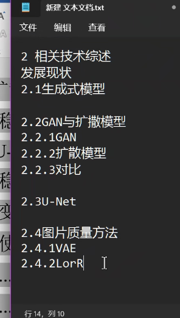
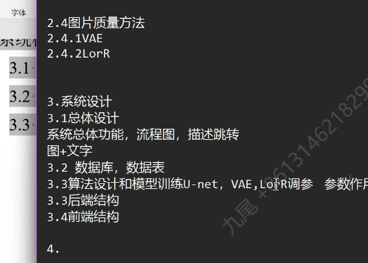
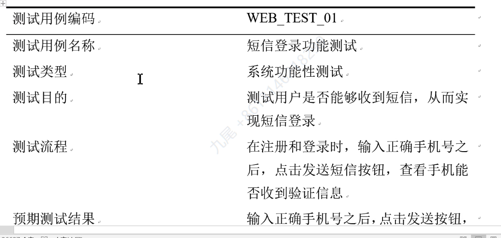
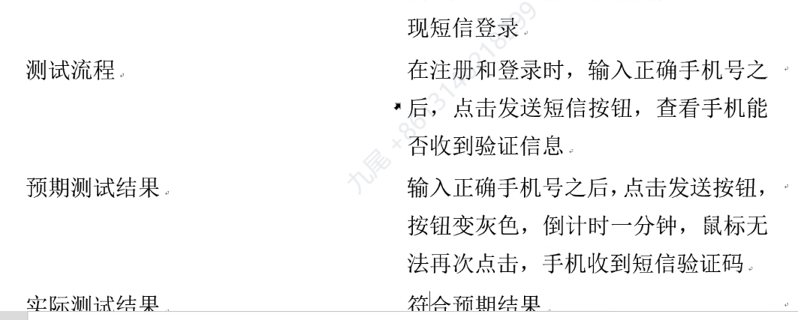
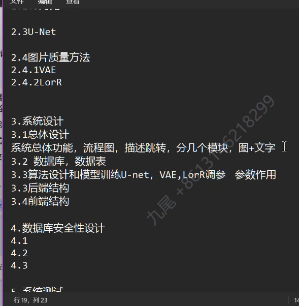
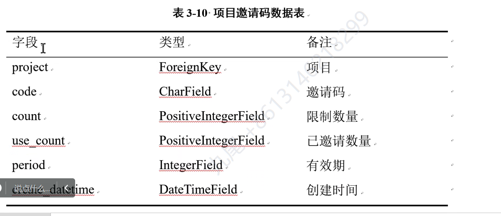

研究现状放到相关技术里

改成“文生图模型综述”，如果有自己用的部分摘出去

2.2.1


1.改成(1)

GAN的图片重画，图片中文

扩散模型与对抗网络分开

2 相关技术综述

发展现状

2.1 生成式模型

2.2 生成对抗网络模型 GAN 和扩散模型

2.2.1 GAN

2.2.2 扩散模型

2.2.3 对比

2.3 U-Net模型

2.4 图片质量方法



潜在扩散模型和稳定扩散模型都写在扩散模型里

“稳定扩散模型中潜在反向扩散的工作原理，如果用流程图”转为中文，图片

后端前端合到一块



Lora调参画表

系统测试：

-   功能性测试





系统测试

列总表：

注册、登录、添加Bot、前端输入字符串反馈给后端

安全性测试



三线表




公式也要有标注


4章系统设计加上截图


TODO部分是不知道要加哪的

最后需要加上所有图标题

```mermaid
flowchart TD
    subgraph 注册过程
        A[用户浏览器] -->|输入用户名,密码,确认密码| B(后端接口)
        B --> C{判断}
        C -- YES -->|用户名已存在|D[向用户显示 error_message]
        C -- NO -->|储存注册信息|E[请求token]
        E --> F[使用token,获取用户信息]
        F --> G[跳转至登录页面]
    end  
```

