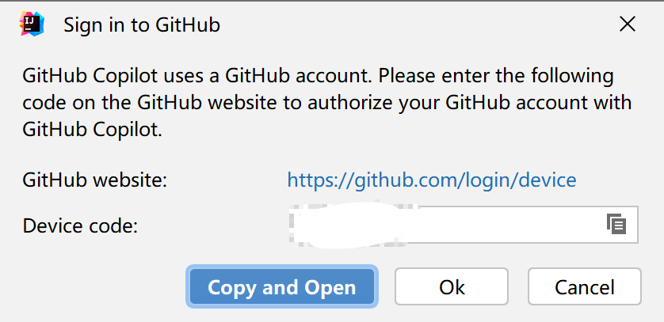

# Copilot

## 订阅

10$/month

可用paypal

## 安装插件

[Quickstart for GitHub Copilot \- GitHub Docs](https://docs.github.com/en/copilot/quickstart)

开启试用期后

[Signup to GitHub Copilot](https://github.com/github-copilot/signup/settings)

[GitHub Copilot \- GitHub Docs](https://docs.github.com/zh/copilot)

[Getting started with GitHub Copilot in a JetBrains IDE \- GitHub Docs](https://docs.github.com/zh/copilot/getting-started-with-github-copilot/getting-started-with-github-copilot-in-a-jetbrains-ide)

copy  and open

### Bug for login with a proxy

Github copilot solution (workaround) for "Failed to initiate the GitHub login process. Please try again.".

下一方法 2023-3-5 15:58:26 测试失效

[djoxy\-code/Github\-copilot\-Fix: Github copilot solution \(workaround\) for "Failed to initiate the GitHub login process\. Please try again\."\.](https://github.com/djoxy-code/Github-copilot-Fix)

[在複雜企業網路下，讓 intellij 順利連線至 GitHub Copilot \| 只是個打字的](https://blog.typeart.cc/signin-copilot-in-intellij-in-company-network/)

该方法成功：[Failed to initiate the GitHub login process. Please try again(1.1.28.1744)_江东周小川的博客-CSDN博客](https://blog.csdn.net/weixin_44224366/article/details/126137106)

>   关于在idea中安装github copilot插件后，需要登陆进行授权却报错了：
>   Failed to initiate the GitHub login process. Please try again。
>
>   这个坑太难受了，我也是找了很多地方才找到。
>
>   解决办法
>   打开idea界面，点击
>   help -> edit vm properties
>   在vm.properties文件中加一句：
>   -Dcopilot.agent.disabled=true
>   再重启一下idea就ok啦！
>   ————————————————
>   版权声明：本文为CSDN博主「江东周小川」的原创文章，遵循CC 4.0 BY-SA版权协议，转载请附上原文出处链接及本声明。
>   原文链接：https://blog.csdn.net/weixin_44224366/article/details/126137106