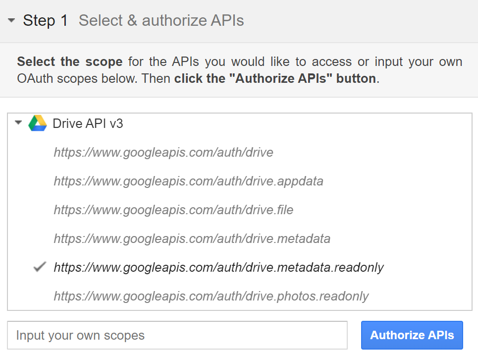
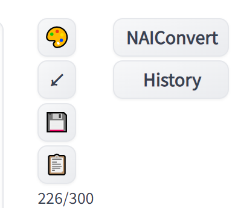
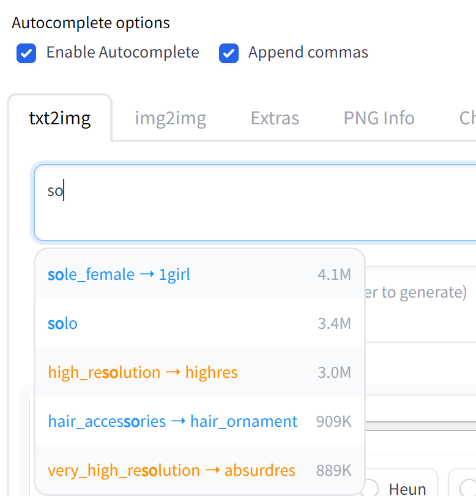
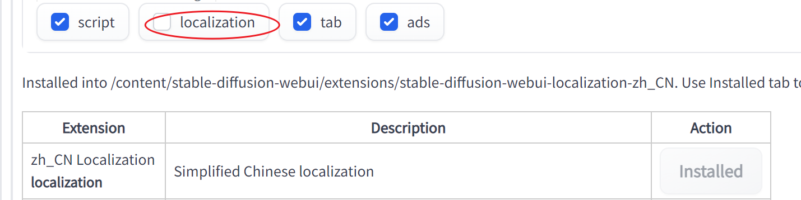

# Colab

[解决命令行下载Google Drive大文件出现的问题_XAL1的博客-CSDN博客](https://blog.csdn.net/weixin_45607635/article/details/122042220)



```python
!mkdir -p /content/stable-diffusion-webui/models/Stable-diffusion /content/stable-diffusion-webui/models/hypernetworks
%cd /content/stable-diffusion-webui/models/Stable-diffusion/

# 7G animefull-final-latest (may not work)
# !gdown 17WWd6KEsBj7D_0TyGp8aXHQDlchYVs1a -O /content/stable-diffusion-webui/models/Stable-diffusion/model.ckpt # This line is old
!gdown 1ozZVlCdik1N1IauvI8QZwO2uNoXpYDTZ -O /content/stable-diffusion-webui/models/Stable-diffusion/model.ckpt

# 4G animefull-final-pruned
# !gdown 1d3f2fvN2gLRocBahZrXe_v1EEHuqpUzT -O /content/stable-diffusion-webui/models/Stable-diffusion/model.ckpt

# 4G animefull-final-pruned (backup)# Remember to comment the following
#!curl -Lo model.ckpt https://cloudflare-ipfs.com/ipfs/bafybeicpamreyp2bsocyk3hpxr7ixb2g2rnrequub3j2ahrkdxbvfbvjc4/model.ckpt

# Install VAE Weights (optional)
!curl -Lo model.vae.pt https://cloudflare-ipfs.com/ipfs/bafybeiccldswdd3wvg57jhclcq53lvsc6gizasiblwayvhlv6eq4wow7wu/animevae.pt 

# Install hypernetwork （optional)
!curl -L https://cloudflare-ipfs.com/ipfs/bafybeiduanx2b3mcvxlwr66igcwnpfmk3nc3qgxlpwh6oq6m6pxii3f77e/_modules.tar | tar x -C /content/stable-diffusion-webui/models/hypernetworks

# Install custom embeddings (modified, optional)
# !curl -L https://cloudflare-ipfs.com/ipfs/bafybeie3hdjchxs5tz4n75bos53nhcklslguxchdurc2ynrzcfv2kwyklu/embeddings.tar | tar x -C /content/stable-diffusion-webui/embeddings
```

注意,7g模型先自己存在盘里,再生成分享链接.

```python
%cd /content/stable-diffusion-webui
!COMMANDLINE_ARGS="--share --gradio-debug --lowram" REQS_FILE="requirements.txt" python launch.py
```

另外这里命令行选项改成lowram，否则自动^C.

见[Run out of RAM when loading weights from a large model · Issue \#2366 · AUTOMATIC1111/stable\-diffusion\-webui](https://github.com/AUTOMATIC1111/stable-diffusion-webui/issues/2366)

## zh-cn extension version

[【线上免费Novel AI】Google colab教学 免费, 手机, 电脑通用 (Naifu, Webui(可输入中文tag))_哔哩哔哩_bilibili](https://www.bilibili.com/video/BV1YD4y1b72g/?spm_id_from=333.788.top_right_bar_window_custom_collection.content.click&vd_source=187217104dfd0bc027cc65f8420627b0)

[Google Colab 欢迎使用NovelAI一键云端施法这个NovelAI WebUI是我修改过的版本，部分界面汉化，并且支持直接中文施法](https://colab.research.google.com/drive/1Gbzf9TEjr7yQ26lkC9NMV3G5dlzp7ICp?usp=sharing#scrollTo=Qjy4K51Icigj)

[RyensX/stable\-diffusion\-webui\-zhCN: Stable Diffusion 中文WebUI，提供简体中文本地化和直接输入中文提示支持](https://github.com/RyensX/stable-diffusion-webui-zhCN)

[altryne/sd\-webui\-colab: A repo for the maintenance of the Colab version of stable\-diffusion\-webui repo](https://github.com/altryne/sd-webui-colab)

这个好慢。。看看还有没有办法

## extension

要在colab上接入，不改命令会报错

[AssertionError: extension access disabed because of commandline flags · Discussion \#4065 · AUTOMATIC1111/stable\-diffusion\-webui](https://github.com/AUTOMATIC1111/stable-diffusion-webui/discussions/4065)

>   I can't remember where I read it now, but i'm pretty sure there is another command line argument that can be passed to bypass this security check (only advisable if you know what you're doing and why)
>
>   **Edit:** Here:
>
>   -   [Add optional flag to enable access to extensions settings for non-local servers #4089 (comment)](https://github.com/AUTOMATIC1111/stable-diffusion-webui/pull/4089#issuecomment-1303075428)
>       -   `ccf1a15`
>           -   `--enable-insecure-extension-access`


在个人笔记本中改为

```python
!COMMANDLINE_ARGS="--share --gradio-debug --lowram --enable-insecure-extension-access" REQS_FILE="requirements.txt" python launch.py 
```

安装扩展后需要重启，若不行，可尝试Apply and restart Ul

>   |                                                              |                                                              |      |
>   | ------------------------------------------------------------ | ------------------------------------------------------------ | ---- |
>   | [Image browser](https://github.com/yfszzx/stable-diffusion-webui-images-browser) |                                                              |      |
>   | [Booru tag autocompletion](https://github.com/DominikDoom/a1111-sd-webui-tagcomplete) **script** | Displays autocompletion hints for tags from image booru boards such as Danbooru. Uses local tag CSV files and includes a config for customization. |      |
>   | [WD 1.4 Tagger](https://github.com/toriato/stable-diffusion-webui-wd14-tagger.git) | Uses a trained model file, produces WD 1.4 Tags. Model link - https://mega.nz/file/ptA2jSSB#G4INKHQG2x2pGAVQBn-yd_U5dMgevGF8YYM9CR_R1SY |      |
>   | [novelai-2-local-prompt](https://github.com/animerl/novelai-2-local-prompt) **script** | Add a button to convert the prompts used in NovelAI for use in the WebUI. In addition, add a button that allows you to recall a previously used prompt. |      |
>   | [zh_CN Localization](https://github.com/dtlnor/stable-diffusion-webui-localization-zh_CN)<br/>**localization** |                                                              |      |

若装了NAIConvert，就有这个





[WD 1.4 Tagger](https://github.com/toriato/stable-diffusion-webui-wd14-tagger.git)


### 汉化

在settings -> localization 中选择了再重启



## dark theme

>   A useful tip is you can append `/?__theme=dark` to your webui url to enable a built in *dark theme*
>   e.g. (`http://127.0.0.1:7860/?__theme=dark`)
>
>   Alternatively, you can add the `--theme=dark` to the `set COMMANDLINE_ARGS=` in `webui-user.bat`
>   e.g. `set COMMANDLINE_ARGS=--theme=dark`

## gdown

[Permission denied although I have set to "anyone with link" · Issue \#146 · wkentaro/gdown](https://github.com/wkentaro/gdown/issues/146)

> This works for me if I modify it slightly
>`curl -L -o 'FILENAME.h5' 'https://drive.google.com/u/0/uc?id=MY_ID_HERE&export=download&confirm=t'`
>(I also removed the -s to ensure it is downloading the correct file)

### 模型

如果不在设置中忽略vae，切换模型会导致失败


[\[分享\] sd\-webui Colab 谷歌网盘安装版。集成各种优化 NGA玩家社区](https://ngabbs.com/read.php?tid=33937133&rand=964)


## xformers安装

[How to install and run conda on Google Colab](https://www.linkedin.com/pulse/how-install-run-conda-google-colab-ambu-vijayan)

```python
!wget https://repo.anaconda.com/miniconda/Miniconda3-py37_4.12.0-Linux-x86_64.sh
!chmod +x Miniconda3-py37_4.12.0-Linux-x86_64.sh
!bash ./Miniconda3-py37_4.12.0-Linux-x86_64.sh -b -f -p /usr/local/
!conda --version

!conda env create -f environment-wsl2.yaml -p /content/automatic
!conda install xformers -c xformers/label/dev -p /content/automatic -y

%cd /content/stable-diffusion-webui

!COMMANDLINE_ARGS="--share --gradio-debug --xformers --enable-insecure-extension-access" REQS_FILE="requirements.txt" /content/automatic/bin/python launch.py 
```

## Linux相关

### linux命令行如何下载github仓库中的release文件


你可以使用 `curl` 或 `wget` 命令下载 GitHub 上的 release 文件。

首先，在 GitHub 上找到要下载的 release 文件，然后复制文件的 URL。

然后，使用 `curl` 命令下载文件，命令如下：

```
Copy code
curl -OL <URL>
```

例如：

```
Copy code
curl -OL https://github.com/user/repo/releases/download/v1.0/example.zip
```

如果你使用的是 `wget` 命令，命令如下：

```
Copy code
wget <URL>
```

例如：

```
Copy code
wget https://github.com/user/repo/releases/download/v1.0/example.zip
```

这两个命令都会将文件下载到当前工作目录。

注意：替换 `<URL>` 和 `user/repo` 中的内容为你要下载的 release 文件的 URL 和仓库的名称。


### linux 如何用zip命令将文件解压到指定目录


在 Linux 中，可以使用 `unzip` 命令来解压 `zip` 文件。

要将 `zip` 文件解压到指定目录，可以使用 `-d` 选项，并指定解压的目录。

例如，下面的命令将 `example.zip` 解压到 `/path/to/directory` 目录：

```
Copy code
unzip example.zip -d /path/to/directory
```

注意：在解压之前，你需要确保该目录已经存在，并且你有权限在该目录写入文件。

如果你想要覆盖已经存在的文件，可以使用 `-o` 选项。例如：

```
Copy code
unzip -o example.zip -d /path/to/directory
```

还有很多其他选项可以用来控制 `unzip` 命令的行为，例如：

-   `-j`：不保留文件的目录结构，而是将所有文件解压到同一目录。
-   `-q`：安静模式，不显示解压过程中的信息。
-   `-n`：不覆盖已经存在的文件。

更多选项和用法，可以使用 `man unzip` 查看。

## xformers

### No such file: cpp_lib.json

```python
# fix FileNotFoundError: [Errno 2] No such file or directory: '/content/automatic/lib/python3.10/site-packages/xformers/cpp_lib.json'

No module 'xformers'. Proceeding without it.
Cannot import xformers
Traceback (most recent call last):
  File "/content/stable-diffusion-webui/modules/sd_hijack_optimizations.py", line 20, in <module>
    import xformers.ops
  File "/content/automatic/lib/python3.10/site-packages/xformers/__init__.py", line 10, in <module>
    from . import _cpp_lib
  File "/content/automatic/lib/python3.10/site-packages/xformers/_cpp_lib.py", line 127, in <module>
    _build_metadata = _register_extensions()
  File "/content/automatic/lib/python3.10/site-packages/xformers/_cpp_lib.py", line 114, in _register_extensions
    with open(cpp_lib_json, "r") as fp:
FileNotFoundError: [Errno 2] No such file or directory: '/content/automatic/lib/python3.10/site-packages/xformers/cpp_lib.json'

```

[Error importing xformers after building from source · Issue \#641 · facebookresearch/xformers](https://github.com/facebookresearch/xformers/issues/641)

要把 `/content/automatic/xformers/cpp_lib.json` 里的拷过去

## python script

### `*.zip` zip in python

[linux \- Trying to unzip a file, 'Filename not matched' when the directory exists \- Super User](https://superuser.com/questions/563215/trying-to-unzip-a-file-filename-not-matched-when-the-directory-exists)
