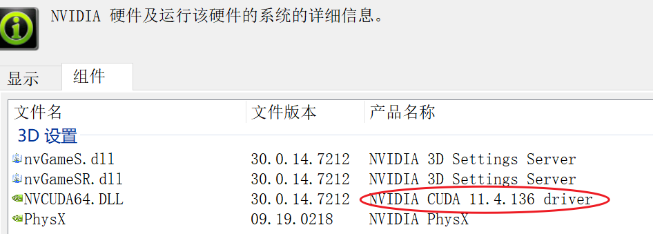
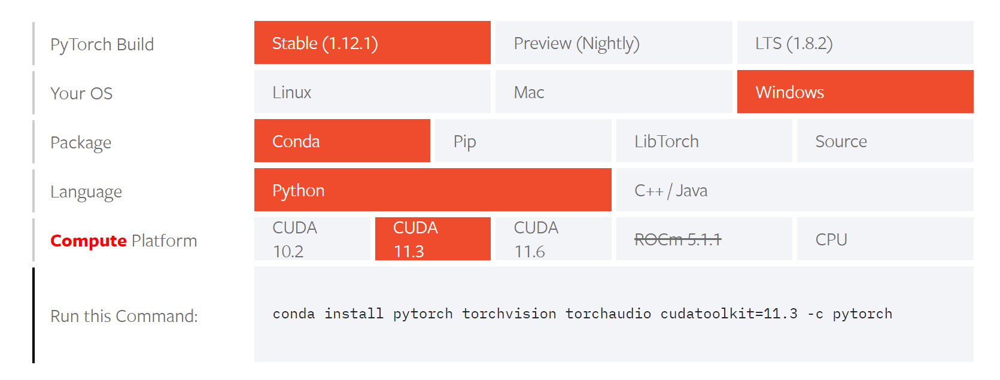
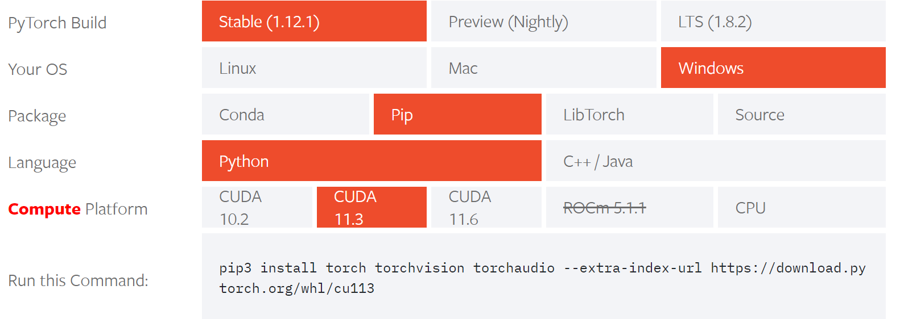
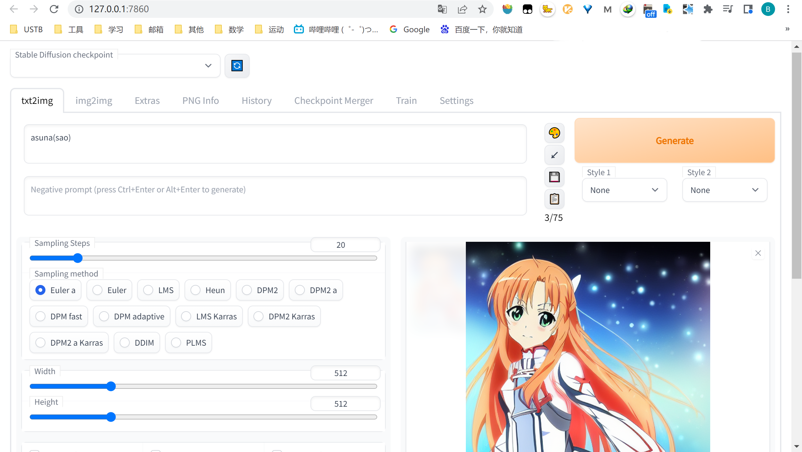

# 本地部署

[怎么看电脑的显存 - 知乎 (zhihu.com)](https://zhuanlan.zhihu.com/p/338650906)

[A卡和N卡的区别，原来还有这样的事儿！ \- 知乎](https://zhuanlan.zhihu.com/p/36145989)

NVIDIA GeForce MX350

[NovelAI本地安裝教學：快來生成自己的老婆 \- YouTube](https://www.youtube.com/watch?v=8iz598BXTlg&ab_channel=JingShing)

[Install and Run on NVidia GPUs · AUTOMATIC1111/stable\-diffusion\-webui Wiki](https://github.com/AUTOMATIC1111/stable-diffusion-webui/wiki/Install-and-Run-on-NVidia-GPUs#manual-installation)


```
venv "D:\stable-diffusion-webui-master\venv\Scripts\Python.exe"
Python 3.10.4 (tags/v3.10.4:9d38120, Mar 23 2022, 23:13:41) [MSC v.1929 64 bit (AMD64)]
Commit hash: <none>
Installing torch and torchvision
Traceback (most recent call last):
  File "D:\stable-diffusion-webui-master\launch.py", line 199, in <module>
    prepare_enviroment()
  File "D:\stable-diffusion-webui-master\launch.py", line 148, in prepare_enviroment
    run(f'"{python}" -m {torch_command}', "Installing torch and torchvision", "Couldn't install torch")
  File "D:\stable-diffusion-webui-master\launch.py", line 33, in run
    raise RuntimeError(message)
RuntimeError: Couldn't install torch.
Command: "D:\stable-diffusion-webui-master\venv\Scripts\python.exe" -m pip install torch==1.12.1+cu113 torchvision==0.13.1+cu113 --extra-index-url https://download.pytorch.org/whl/cu113
Error code: 1
stdout: Looking in indexes: https://pypi.org/simple, https://download.pytorch.org/whl/cu113
Could not fetch URL https://pypi.org/simple/torch/: There was a problem confirming the ssl certificate: HTTPSConnectionPool(host='pypi.org', port=443): Max retries exceeded with url: /simple/torch/ (Caused by SSLError(SSLEOFError(8, 'EOF occurred in violation of protocol (_ssl.c:997)'))) - skipping
Could not fetch URL https://download.pytorch.org/whl/cu113/torch/: There was a problem confirming the ssl certificate: HTTPSConnectionPool(host='download.pytorch.org', port=443): Max retries exceeded with url: /whl/cu113/torch/ (Caused by SSLError(SSLEOFError(8, 'EOF occurred in violation of protocol (_ssl.c:997)'))) - skipping
Could not fetch URL https://pypi.org/simple/pip/: There was a problem confirming the ssl certificate: HTTPSConnectionPool(host='pypi.org', port=443): Max retries exceeded with url: /simple/pip/ (Caused by SSLError(SSLEOFError(8, 'EOF occurred in violation of protocol (_ssl.c:997)'))) - skipping
Could not fetch URL https://download.pytorch.org/whl/cu113/pip/: There was a problem confirming the ssl certificate: HTTPSConnectionPool(host='download.pytorch.org', port=443): Max retries exceeded with url: /whl/cu113/pip/ (Caused by SSLError(SSLEOFError(8, 'EOF occurred in violation of protocol (_ssl.c:997)'))) - skipping

stderr: WARNING: Retrying (Retry(total=4, connect=None, read=None, redirect=None, status=None)) after connection broken by 'SSLError(SSLEOFError(8, 'EOF occurred in violation of protocol (_ssl.c:997)'))': /simple/torch/
WARNING: Retrying (Retry(total=3, connect=None, read=None, redirect=None, status=None)) after connection broken by 'SSLError(SSLEOFError(8, 'EOF occurred in violation of protocol (_ssl.c:997)'))': /simple/torch/
WARNING: Retrying (Retry(total=2, connect=None, read=None, redirect=None, status=None)) after connection broken by 'SSLError(SSLEOFError(8, 'EOF occurred in violation of protocol (_ssl.c:997)'))': /simple/torch/
WARNING: Retrying (Retry(total=1, connect=None, read=None, redirect=None, status=None)) after connection broken by 'SSLError(SSLEOFError(8, 'EOF occurred in violation of protocol (_ssl.c:997)'))': /simple/torch/
WARNING: Retrying (Retry(total=0, connect=None, read=None, redirect=None, status=None)) after connection broken by 'SSLError(SSLEOFError(8, 'EOF occurred in violation of protocol (_ssl.c:997)'))': /simple/torch/
WARNING: Retrying (Retry(total=4, connect=None, read=None, redirect=None, status=None)) after connection broken by 'SSLError(SSLEOFError(8, 'EOF occurred in violation of protocol (_ssl.c:997)'))': /whl/cu113/torch/
WARNING: Retrying (Retry(total=3, connect=None, read=None, redirect=None, status=None)) after connection broken by 'SSLError(SSLEOFError(8, 'EOF occurred in violation of protocol (_ssl.c:997)'))': /whl/cu113/torch/
WARNING: Retrying (Retry(total=2, connect=None, read=None, redirect=None, status=None)) after connection broken by 'SSLError(SSLEOFError(8, 'EOF occurred in violation of protocol (_ssl.c:997)'))': /whl/cu113/torch/
WARNING: Retrying (Retry(total=1, connect=None, read=None, redirect=None, status=None)) after connection broken by 'SSLError(SSLEOFError(8, 'EOF occurred in violation of protocol (_ssl.c:997)'))': /whl/cu113/torch/
WARNING: Retrying (Retry(total=0, connect=None, read=None, redirect=None, status=None)) after connection broken by 'SSLError(SSLEOFError(8, 'EOF occurred in violation of protocol (_ssl.c:997)'))': /whl/cu113/torch/
ERROR: Could not find a version that satisfies the requirement torch==1.12.1+cu113 (from versions: none)
ERROR: No matching distribution found for torch==1.12.1+cu113

```


[Not able to install torch through the script · Issue \#1610 · AUTOMATIC1111/stable\-diffusion\-webui](https://github.com/AUTOMATIC1111/stable-diffusion-webui/issues/1610)

关科学，根本不动。。

手动下载？

## torch

torch

>    With CUDA
>
>   To install PyTorch via Anaconda, and you do have a [CUDA-capable](https://developer.nvidia.com/cuda-zone) system, in the above selector, choose OS: Windows, Package: Conda and the CUDA version suited to your machine. Often, the latest CUDA version is better. Then, run the command that is presented to you.

### cuda

win10安装CUDA和cuDNN的正确姿势 - 西河沿的风的文章 - 知乎 https://zhuanlan.zhihu.com/p/94220564



最高11.4



```powershell
C:\Users\Administrator>nvcc -V
nvcc: NVIDIA (R) Cuda compiler driver
Copyright (c) 2005-2022 NVIDIA Corporation
Built on Wed_Sep_21_10:41:10_Pacific_Daylight_Time_2022
Cuda compilation tools, release 11.8, V11.8.89
Build cuda_11.8.r11.8/compiler.31833905_0
```

毛的，版本太高了，

回退

```
https://download.pytorch.org/whl/cu113
```

说明用的是11.3



[CUDA Toolkit Archive \| NVIDIA Developer](https://developer.nvidia.com/cuda-toolkit-archive)

### pip 报错

见python那边

#### 安装pytorch

```powershell
PS C:\Users\Administrator> pip3 install torch torchvision torchaudio --extra-index-url https://download.pytorch.org/whl/cu113
Looking in indexes: https://pypi.org/simple, https://download.pytorch.org/whl/cu113
Collecting torch
  Downloading https://download.pytorch.org/whl/cu113/torch-1.12.1%2Bcu113-cp310-cp310-win_amd64.whl (2143.8 MB)
     ━━━━━━━━━━━━━━━━━━━━━━━━━━━━━━━━━━━━━╸━━ 2.0/2.1 GB 1.4 MB/s eta 0:01:37
...
TimeoutError: The read operation timed out

```

[python 安装第三方库超时报错：The read operation timed out\_fjswcjswzy的博客\-CSDN博客\_the read operation timed out](https://blog.csdn.net/fjswcjswzy/article/details/105925418)

[错误处理： socket\.timeout: The read operation timed out\_UQI\-LIUWJ的博客\-CSDN博客](https://blog.csdn.net/qq_40206371/article/details/120581395)

### 验证

来自官网

[Start Locally \| PyTorch](https://pytorch.org/get-started/locally/#windows-verification)

```powershell
PS C:\Users\Administrator> pip3 --default-timeout=100000 install torch torchvision torchaudio --extra-index-url https://download.pytorch.org/whl/cu113
Looking in indexes: https://pypi.org/simple, https://download.pytorch.org/whl/cu113
Collecting torch
  Downloading https://download.pytorch.org/whl/cu113/torch-1.12.1%2Bcu113-cp310-cp310-win_amd64.whl (2143.8 MB)
     ━━━━━━━━━━━━━━━━━━━━━━━━━━━━━━━━━━━━━━━╸ 2.1/2.1 GB 80.1 kB/s eta 0:02:36
ERROR: Wheel 'torch' located at C:\Users\Public\Documents\Wondershare\CreatorTemp\pip-unpack-yw9h83ew\torch-1.12.1+cu113-cp310-cp310-win_amd64.whl is invalid.

PS C:\Users\Administrator> python
Python 3.10.7 (tags/v3.10.7:6cc6b13, Sep  5 2022, 14:08:36) [MSC v.1933 64 bit (AMD64)] on win32
Type "help", "copyright", "credits" or "license" for more information.
>>> import torch
Traceback (most recent call last):
  File "<stdin>", line 1, in <module>
ModuleNotFoundError: No module named 'torch'
>>> x = torch.rand(5, 3)
Traceback (most recent call last):
  File "<stdin>", line 1, in <module>
NameError: name 'torch' is not defined
>>> print(x)
```

>    I deleted the Appdata/Local/pip/Cache folder in a hurry and tried it and it was installed. Since the deleted folder is still in the Recycle Bin, I decided there would be no problem.
>
>   [pip \- ERROR: torch has an invalid wheel, \.dist\-info directory not found \- Stack Overflow](https://stackoverflow.com/questions/65191751/error-torch-has-an-invalid-wheel-dist-info-directory-not-found)

cache 在同目录的压缩包中 C:\Users\Administrator\AppData\Local\pip

```powershell
PS C:\Users\Administrator> pip3 install torch torchvision torchaudio --extra-index-url https://download.pytorch.org/whl/cu113
Looking in indexes: https://pypi.org/simple, https://download.pytorch.org/whl/cu113
Collecting torch
  Downloading https://download.pytorch.org/whl/cu113/torch-1.12.1%2Bcu113-cp310-cp310-win_amd64.whl (2143.8 MB)
     ━━━━━━━━━━━━━━━━━━━━━━━━━━━━━━━━━━━━━╸━━ 2.0/2.1 GB 1.4 MB/s eta 0:01:37
ERROR: Exception:
Traceback (most recent call last):
  File "D:\Python310\lib\site-packages\pip\_vendor\urllib3\response.py", line 437, in _error_catcher
    yield
  File "D:\Python310\lib\site-packages\pip\_vendor\urllib3\response.py", line 560, in read
    data = self._fp_read(amt) if not fp_closed else b""
  File "D:\Python310\lib\site-packages\pip\_vendor\urllib3\response.py", line 526, in _fp_read
    return self._fp.read(amt) if amt is not None else self._fp.read()
  File "D:\Python310\lib\site-packages\pip\_vendor\cachecontrol\filewrapper.py", line 90, in read
    data = self.__fp.read(amt)
  File "D:\Python310\lib\http\client.py", line 465, in read
    s = self.fp.read(amt)
  File "D:\Python310\lib\socket.py", line 705, in readinto
    return self._sock.recv_into(b)
  File "D:\Python310\lib\ssl.py", line 1274, in recv_into
    return self.read(nbytes, buffer)
  File "D:\Python310\lib\ssl.py", line 1130, in read
    return self._sslobj.read(len, buffer)
TimeoutError: The read operation timed out

During handling of the above exception, another exception occurred:

Traceback (most recent call last):
  File "D:\Python310\lib\site-packages\pip\_internal\cli\base_command.py", line 160, in exc_logging_wrapper
    status = run_func(*args)
  File "D:\Python310\lib\site-packages\pip\_internal\cli\req_command.py", line 247, in wrapper
    return func(self, options, args)
  File "D:\Python310\lib\site-packages\pip\_internal\commands\install.py", line 400, in run
    requirement_set = resolver.resolve(
  File "D:\Python310\lib\site-packages\pip\_internal\resolution\resolvelib\resolver.py", line 92, in resolve
    result = self._result = resolver.resolve(
  File "D:\Python310\lib\site-packages\pip\_vendor\resolvelib\resolvers.py", line 481, in resolve
    state = resolution.resolve(requirements, max_rounds=max_rounds)
  File "D:\Python310\lib\site-packages\pip\_vendor\resolvelib\resolvers.py", line 348, in resolve
    self._add_to_criteria(self.state.criteria, r, parent=None)
  File "D:\Python310\lib\site-packages\pip\_vendor\resolvelib\resolvers.py", line 172, in _add_to_criteria
    if not criterion.candidates:
  File "D:\Python310\lib\site-packages\pip\_vendor\resolvelib\structs.py", line 151, in __bool__
    return bool(self._sequence)
  File "D:\Python310\lib\site-packages\pip\_internal\resolution\resolvelib\found_candidates.py", line 155, in __bool__
    return any(self)
  File "D:\Python310\lib\site-packages\pip\_internal\resolution\resolvelib\found_candidates.py", line 143, in <genexpr>
    return (c for c in iterator if id(c) not in self._incompatible_ids)
    candidate = func()
  File "D:\Python310\lib\site-packages\pip\_internal\resolution\resolvelib\factory.py", line 206, in _make_candidate_from_link
    self._link_candidate_cache[link] = LinkCandidate(
  File "D:\Python310\lib\site-packages\pip\_internal\resolution\resolvelib\candidates.py", line 297, in __init__
    super().__init__(
  File "D:\Python310\lib\site-packages\pip\_internal\resolution\resolvelib\candidates.py", line 162, in __init__
  File "D:\Python310\lib\site-packages\pip\_internal\resolution\resolvelib\candidates.py", line 231, in _prepare
    dist = self._prepare_distribution()
  File "D:\Python310\lib\site-packages\pip\_internal\resolution\resolvelib\candidates.py", line 308, in _prepare_distribution
    return preparer.prepare_linked_requirement(self._ireq, parallel_builds=True)
  File "D:\Python310\lib\site-packages\pip\_internal\operations\prepare.py", line 491, in prepare_linked_requirement
    return self._prepare_linked_requirement(req, parallel_builds)
    local_file = unpack_url(
  File "D:\Python310\lib\site-packages\pip\_internal\operations\prepare.py", line 166, in unpack_url
    file = get_http_url(
  File "D:\Python310\lib\site-packages\pip\_internal\operations\prepare.py", line 107, in get_http_url
    from_path, content_type = download(link, temp_dir.path)
  File "D:\Python310\lib\site-packages\pip\_internal\network\download.py", line 147, in __call__
    for chunk in chunks:
  File "D:\Python310\lib\site-packages\pip\_internal\cli\progress_bars.py", line 53, in _rich_progress_bar
    for chunk in iterable:
  File "D:\Python310\lib\site-packages\pip\_internal\network\utils.py", line 63, in response_chunks
    for chunk in response.raw.stream(
  File "D:\Python310\lib\site-packages\pip\_vendor\urllib3\response.py", line 621, in stream
    data = self.read(amt=amt, decode_content=decode_content)
  File "D:\Python310\lib\site-packages\pip\_vendor\urllib3\response.py", line 559, in read
    with self._error_catcher():
  File "D:\Python310\lib\contextlib.py", line 153, in __exit__
    self.gen.throw(typ, value, traceback)
    raise ReadTimeoutError(self._pool, None, "Read timed out.")
pip._vendor.urllib3.exceptions.ReadTimeoutError: HTTPSConnectionPool(host='download.pytorch.org', port=443): Read timed out.
Looking in indexes: https://pypi.org/simple, https://download.pytorch.org/whl/cu113
Collecting torch
  Downloading https://download.pytorch.org/whl/cu113/torch-1.12.1%2Bcu113-cp310-cp310-win_amd64.whl (2143.8 MB)
     ━━━━━━╸━━━━━━━━━━━━━━━━━━━━━━━━━━━━━━━━━ 0.4/2.1 GB 3.4 MB/s eta 0:08:46
ERROR: Operation cancelled by user
PS C:\Users\Administrator> pip3 --default-timeout=100000 install torch torchvision torchaudio --extra-index-url https://download.pytorch.org/whl/cu113
Looking in indexes: https://pypi.org/simple, https://download.pytorch.org/whl/cu113
Collecting torch
  Downloading https://download.pytorch.org/whl/cu113/torch-1.12.1%2Bcu113-cp310-cp310-win_amd64.whl (2143.8 MB)
     ━━━━━━━━━━━━━━━━━━━━━━━━━━━━━━━━━━━━━━━╸ 2.1/2.1 GB 80.1 kB/s eta 0:02:36
ERROR: Wheel 'torch' located at C:\Users\Public\Documents\Wondershare\CreatorTemp\pip-unpack-yw9h83ew\torch-1.12.1+cu113-cp310-cp310-win_amd64.whl is invalid.
PS C:\Users\Administrator> python
Python 3.10.7 (tags/v3.10.7:6cc6b13, Sep  5 2022, 14:08:36) [MSC v.1933 64 bit (AMD64)] on win32
Type "help", "copyright", "credits" or "license" for more information.
>>> import torch
Traceback (most recent call last):
  File "<stdin>", line 1, in <module>
ModuleNotFoundError: No module named 'torch'
>>> x = torch.rand(5, 3)
Traceback (most recent call last):
  File "<stdin>", line 1, in <module>
NameError: name 'torch' is not defined
>>> print(x)
Traceback (most recent call last):
  File "<stdin>", line 1, in <module>
NameError: name 'x' is not defined
>>> ^Z

PS C:\Users\Administrator> pip3 --default-timeout=100000 install torch+cpu torchvision torchaudio --extra-index-url https://download.pytorch.org/whl/cu113
ERROR: Invalid requirement: 'torch+cpu'
PS C:\Users\Administrator> pip3 --default-timeout=100000 install torch torchvision torchaudio --extra-index-url https://download.pytorch.org/whl/cu113
Looking in indexes: https://pypi.org/simple, https://download.pytorch.org/whl/cu113
Collecting torch
  Downloading https://download.pytorch.org/whl/cu113/torch-1.12.1%2Bcu113-cp310-cp310-win_amd64.whl (2143.8 MB)
     ━━━━━━━━━━━━━━━━━━━━━━━━━━━━━━━━━━━━━━━╺ 2.1/2.1 GB 3.4 MB/s eta 0:00:14
ERROR: Exception:
Traceback (most recent call last):
  File "D:\Python310\lib\site-packages\pip\_vendor\urllib3\response.py", line 437, in _error_catcher
    yield
  File "D:\Python310\lib\site-packages\pip\_vendor\urllib3\response.py", line 560, in read
    data = self._fp_read(amt) if not fp_closed else b""
  File "D:\Python310\lib\site-packages\pip\_vendor\urllib3\response.py", line 526, in _fp_read
    return self._fp.read(amt) if amt is not None else self._fp.read()
  File "D:\Python310\lib\site-packages\pip\_vendor\cachecontrol\filewrapper.py", line 94, in read
    self.__buf.write(data)
  File "D:\Python310\lib\tempfile.py", line 483, in func_wrapper
    return func(*args, **kwargs)
OSError: [Errno 28] No space left on device

During handling of the above exception, another exception occurred:

Traceback (most recent call last):
  File "D:\Python310\lib\site-packages\pip\_internal\cli\base_command.py", line 160, in exc_logging_wrapper
    status = run_func(*args)
  File "D:\Python310\lib\site-packages\pip\_internal\cli\req_command.py", line 247, in wrapper
    return func(self, options, args)
  File "D:\Python310\lib\site-packages\pip\_internal\commands\install.py", line 400, in run
    requirement_set = resolver.resolve(
  File "D:\Python310\lib\site-packages\pip\_internal\resolution\resolvelib\resolver.py", line 92, in resolve
    result = self._result = resolver.resolve(
  File "D:\Python310\lib\site-packages\pip\_vendor\resolvelib\resolvers.py", line 481, in resolve
    state = resolution.resolve(requirements, max_rounds=max_rounds)
  File "D:\Python310\lib\site-packages\pip\_vendor\resolvelib\resolvers.py", line 348, in resolve
    self._add_to_criteria(self.state.criteria, r, parent=None)
  File "D:\Python310\lib\site-packages\pip\_vendor\resolvelib\resolvers.py", line 172, in _add_to_criteria
    if not criterion.candidates:
  File "D:\Python310\lib\site-packages\pip\_vendor\resolvelib\structs.py", line 151, in __bool__
    return bool(self._sequence)
  File "D:\Python310\lib\site-packages\pip\_internal\resolution\resolvelib\found_candidates.py", line 155, in __bool__
    return any(self)
  File "D:\Python310\lib\site-packages\pip\_internal\resolution\resolvelib\found_candidates.py", line 143, in <genexpr>
    return (c for c in iterator if id(c) not in self._incompatible_ids)
  File "D:\Python310\lib\site-packages\pip\_internal\resolution\resolvelib\found_candidates.py", line 47, in _iter_built
    candidate = func()
  File "D:\Python310\lib\site-packages\pip\_internal\resolution\resolvelib\factory.py", line 206, in _make_candidate_from_link
    self._link_candidate_cache[link] = LinkCandidate(
  File "D:\Python310\lib\site-packages\pip\_internal\resolution\resolvelib\candidates.py", line 297, in __init__
    super().__init__(
  File "D:\Python310\lib\site-packages\pip\_internal\resolution\resolvelib\candidates.py", line 162, in __init__
    self.dist = self._prepare()
  File "D:\Python310\lib\site-packages\pip\_internal\resolution\resolvelib\candidates.py", line 231, in _prepare
    dist = self._prepare_distribution()
  File "D:\Python310\lib\site-packages\pip\_internal\resolution\resolvelib\candidates.py", line 308, in _prepare_distribution
    return preparer.prepare_linked_requirement(self._ireq, parallel_builds=True)
  File "D:\Python310\lib\site-packages\pip\_internal\operations\prepare.py", line 491, in prepare_linked_requirement
    return self._prepare_linked_requirement(req, parallel_builds)
  File "D:\Python310\lib\site-packages\pip\_internal\operations\prepare.py", line 536, in _prepare_linked_requirement
    local_file = unpack_url(
  File "D:\Python310\lib\site-packages\pip\_internal\operations\prepare.py", line 166, in unpack_url
    file = get_http_url(
  File "D:\Python310\lib\site-packages\pip\_internal\operations\prepare.py", line 107, in get_http_url
    from_path, content_type = download(link, temp_dir.path)
  File "D:\Python310\lib\site-packages\pip\_internal\network\download.py", line 147, in __call__
    for chunk in chunks:
  File "D:\Python310\lib\site-packages\pip\_internal\cli\progress_bars.py", line 53, in _rich_progress_bar
    for chunk in iterable:
  File "D:\Python310\lib\site-packages\pip\_internal\network\utils.py", line 63, in response_chunks
    for chunk in response.raw.stream(
  File "D:\Python310\lib\site-packages\pip\_vendor\urllib3\response.py", line 621, in stream
    data = self.read(amt=amt, decode_content=decode_content)
  File "D:\Python310\lib\site-packages\pip\_vendor\urllib3\response.py", line 559, in read
    with self._error_catcher():
  File "D:\Python310\lib\contextlib.py", line 153, in __exit__
    self.gen.throw(typ, value, traceback)
  File "D:\Python310\lib\site-packages\pip\_vendor\urllib3\response.py", line 454, in _error_catcher
    raise ProtocolError("Connection broken: %r" % e, e)
pip._vendor.urllib3.exceptions.ProtocolError: ("Connection broken: OSError(28, 'No space left on device')", OSError(28, 'No space left on device'))
WARNING: There was an error checking the latest version of pip.
```

[python \- IOError: \Errno 28\ No space left on device while installing pytorch \- Stack Overflow](https://stackoverflow.com/questions/43585263/ioerror-errno-28-no-space-left-on-device-while-installing-pytorch)

删c盘

[C盘空间不足？大胆删除这4个英文文件夹，让电脑瞬间提速50% - 知乎 (zhihu.com)](https://zhuanlan.zhihu.com/p/345218054)

```powershell
PS C:\Users\Administrator> pip3 --default-timeout=100000 install torch torchvision torchaudio --extra-index-url https://download.pytorch.org/whl/cu113
Looking in indexes: https://pypi.org/simple, https://download.pytorch.org/whl/cu113
Collecting torch
  Downloading https://download.pytorch.org/whl/cu113/torch-1.12.1%2Bcu113-cp310-cp310-win_amd64.whl (2143.8 MB)
     ━━━━━━━━━━━━━━━━━━━━━━━━━━━━━━━━━━━━━━━━ 2.1/2.1 GB 1.9 MB/s eta 0:00:00
Collecting torchvision
  Downloading https://download.pytorch.org/whl/cu113/torchvision-0.13.1%2Bcu113-cp310-cp310-win_amd64.whl (4.7 MB)
     ━━━━━━━━━━━━━━━━━━━━━━━━━━━━━━━━━━━━━━━━ 4.7/4.7 MB 6.7 MB/s eta 0:00:00
Collecting torchaudio
  Downloading https://download.pytorch.org/whl/cu113/torchaudio-0.12.1%2Bcu113-cp310-cp310-win_amd64.whl (1.2 MB)
     ━━━━━━━━━━━━━━━━━━━━━━━━━━━━━━━━━━━━━━━━ 1.2/1.2 MB 1.2 MB/s eta 0:00:00
Collecting typing-extensions
  Downloading typing_extensions-4.4.0-py3-none-any.whl (26 kB)
Collecting numpy
  Downloading numpy-1.23.4-cp310-cp310-win_amd64.whl (14.6 MB)
     ━━━━━━━━━━━━━━━━━━━━━━━━━━━━━━━━━━━━━━━━ 14.6/14.6 MB 3.8 MB/s eta 0:00:00
Collecting pillow!=8.3.*,>=5.3.0
  Downloading Pillow-9.2.0-cp310-cp310-win_amd64.whl (3.3 MB)
     ━━━━━━━━━━━━━━━━━━━━━━━━━━━━━━━━━━━━━━━━ 3.3/3.3 MB 4.5 MB/s eta 0:00:00
Collecting requests
  Downloading requests-2.28.1-py3-none-any.whl (62 kB)
     ━━━━━━━━━━━━━━━━━━━━━━━━━━━━━━━━━━━━━━━━ 62.8/62.8 kB 3.3 MB/s eta 0:00:00
Collecting charset-normalizer<3,>=2
  Downloading charset_normalizer-2.1.1-py3-none-any.whl (39 kB)
Collecting idna<4,>=2.5
  Downloading idna-3.4-py3-none-any.whl (61 kB)
     ━━━━━━━━━━━━━━━━━━━━━━━━━━━━━━━━━━━━━━━━ 61.5/61.5 kB 3.2 MB/s eta 0:00:00
Collecting certifi>=2017.4.17
  Downloading certifi-2022.9.24-py3-none-any.whl (161 kB)
     ━━━━━━━━━━━━━━━━━━━━━━━━━━━━━━━━━━━━━━━━ 161.1/161.1 kB 9.4 MB/s eta 0:00:00
Collecting urllib3<1.27,>=1.21.1
  Downloading urllib3-1.26.12-py2.py3-none-any.whl (140 kB)
     ━━━━━━━━━━━━━━━━━━━━━━━━━━━━━━━━━━━━━━━━ 140.4/140.4 kB 8.7 MB/s eta 0:00:00
Installing collected packages: urllib3, typing-extensions, pillow, numpy, idna, charset-normalizer, certifi, torch, requests, torchvision, torchaudio
Successfully installed certifi-2022.9.24 charset-normalizer-2.1.1 idna-3.4 numpy-1.23.4 pillow-9.2.0 requests-2.28.1 torch-1.12.1+cu113 torchaudio-0.12.1+cu113 torchvision-0.13.1+cu113 typing-extensions-4.4.0 urllib3-1.26.12
```

```powershell
PS C:\Users\Administrator> python
Python 3.10.7 (tags/v3.10.7:6cc6b13, Sep  5 2022, 14:08:36) [MSC v.1933 64 bit (AMD64)] on win32
Type "help", "copyright", "credits" or "license" for more information.
>>> import torch
>>> x = torch.rand(5, 3)
>>> print(x)
tensor([[0.5199, 0.0491, 0.5031],
        [0.0201, 0.6252, 0.5321],
        [0.4703, 0.4245, 0.3525],
        [0.4199, 0.4454, 0.6523],
        [0.6435, 0.1707, 0.5074]])
```

.bat 卡在安装torch，我已经安装完了

通过[Install and Run on NVidia GPUs · AUTOMATIC1111/stable\-diffusion\-webui Wiki](https://github.com/AUTOMATIC1111/stable-diffusion-webui/wiki/Install-and-Run-on-NVidia-GPUs#manual-installation)命令行安装

```
PS C:\Users\Administrator> pip install -r requirements.txt  --prefer-binary
ERROR: Could not open requirements file: [Errno 2] No such file or directory: 'requirements.txt'
```

这里要在仓库目录中进行

一开始没注意，在用户-我-下直接git clone

安装到了repositories中，


```
cd stable-diffusion-webui
```

repositories 迁移到stable diffusion下

```
RuntimeError: CUDA out of memory. Tried to allocate 20.00 MiB (GPU 0; 2.00 GiB total capacity; 1.68 GiB already allocated; 0 bytes free; 1.72 GiB reserved in total by PyTorch) If reserved memory is >> allocated memory try setting max_split_size_mb to avoid fragmentation.  See documentation for Memory Management and PYTORCH_CUDA_ALLOC_CONF
```


[Runtime error CUDA while installation · Issue \#3102 · AUTOMATIC1111/stable\-diffusion\-webui](https://github.com/AUTOMATIC1111/stable-diffusion-webui/issues/3102)

>   You may have 8GB of System ram
>   But you only have 2GB of Video Ram
>
>   I do not think your GPU is even capable of running this.

```
适配器信息
芯片类型：
Intel(R)UHD Graphics Family
DAC类型：
Internal
B1OS信息：
Intel Video BIOS
适配器字符串：
Intel(R)UHD Graphics
总可用图形内存：
8235MB
专用视频内存：
128MB
系统视频内存：
0 MB
共享系统内存：
8107MB
```

寄了，vram不足

以后优先删除这个文件夹的,再删除pip install的,

可以用 -- lowvram 命令行选项，python 的

```
requests.exceptions.ProxyError: HTTPConnectionPool(host='127.0.0.1', port=4780): Max retries exceeded with url: http://127.0.0.1:7860/startup-events (Caused by ProxyError('Cannot connect to proxy.', RemoteDisconnected('Remote end closed connection without response')))
```

代理proxy，关科学

```
PS D:\stable-diffusion-webui-master> python webui.py --lowvram
Warning: k_diffusion not found at path D:\stable-diffusion-webui-master\repositories\k-diffusion\k_diffusion\sampling.py
LatentDiffusion: Running in eps-prediction mode
DiffusionWrapper has 859.52 M params.
making attention of type 'vanilla' with 512 in_channels
Working with z of shape (1, 4, 32, 32) = 4096 dimensions.
making attention of type 'vanilla' with 512 in_channels
NOTE: Redirects are currently not supported in Windows or MacOs.
Loading weights [925997e9] from D:\stable-diffusion-webui-master\models\Stable-diffusion\model.ckpt
Applying cross attention optimization (Doggettx).
Model loaded.
Loaded a total of 0 textual inversion embeddings.
Embeddings:
Running on local URL:  http://127.0.0.1:7860

To create a public link, set `share=True` in `launch()`.
```



芜湖


点txt2img 的 Interrogate clip 有用了 855m

尝试高级版,高级版7G，好像vram太小了，不推荐装

>   這個版本仍然需要 6g 以上的 vram
>
>   [NovelAI\-4chan\-lowvram\-ver/README\_TCH\.md at main · JingShing/NovelAI\-4chan\-lowvram\-ver](https://github.com/JingShing/NovelAI-4chan-lowvram-ver/blob/main/README_TCH.md)

买电脑的显卡那一栏看显存

[NovelAI Naifu 低顯存優化版教學：Naifu low vram ver \- YouTube](https://www.youtube.com/watch?v=T09tBeFzYwI&ab_channel=JingShing)

改回去之后又出事了...

[Error, no parenthesis on print · Issue \#71 · CompVis/latent\-diffusion](https://github.com/CompVis/latent-diffusion/issues/71)

[ImportError: cannot import name 'VectorQuantizer2' · Issue \#72 · CompVis/stable\-diffusion](https://github.com/CompVis/stable-diffusion/issues/72)

靠,其实不用改东西,直接覆盖即可,但是改了之后分辨率一大就会爆error.

[NovelAI模型在AutoDL平台多种显卡上图像生成的超级大评 - 哔哩哔哩 (bilibili.com)](https://www.bilibili.com/read/cv19264438)

超过150步

[Make it possible to use more more than 150 sampling steps · Issue \#1001 · AUTOMATIC1111/stable\-diffusion\-webui](https://github.com/AUTOMATIC1111/stable-diffusion-webui/issues/1001)
