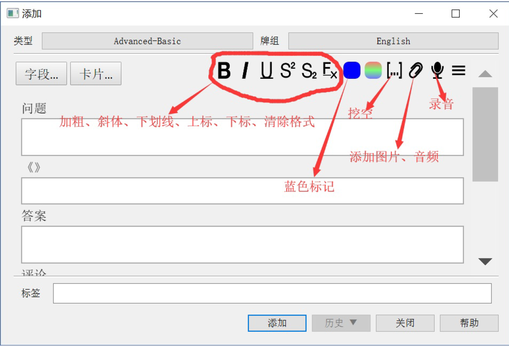
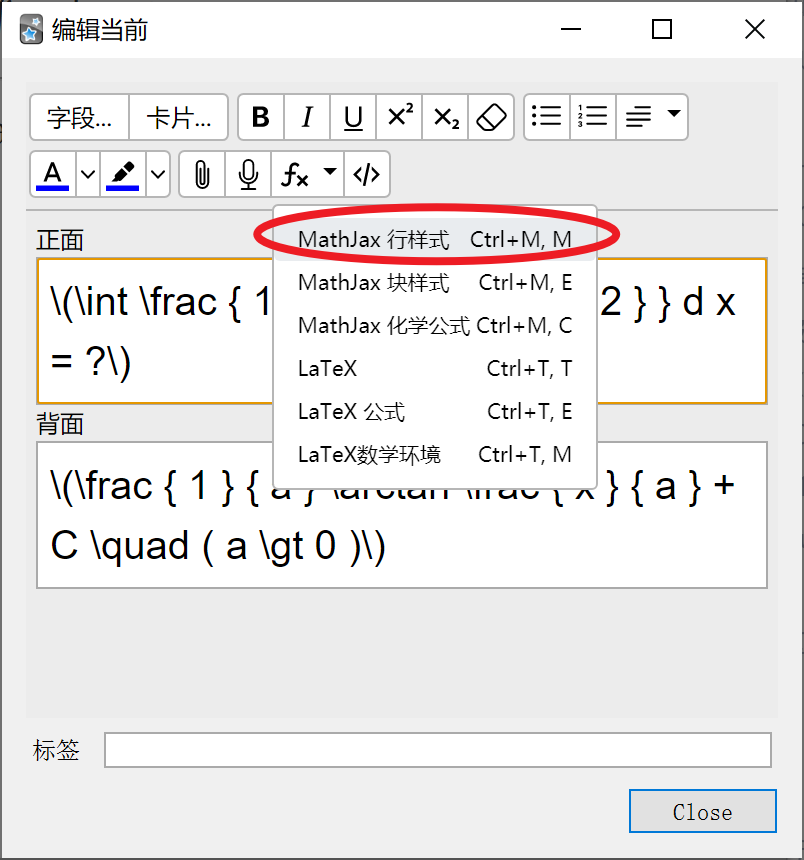
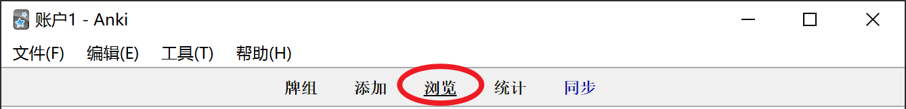
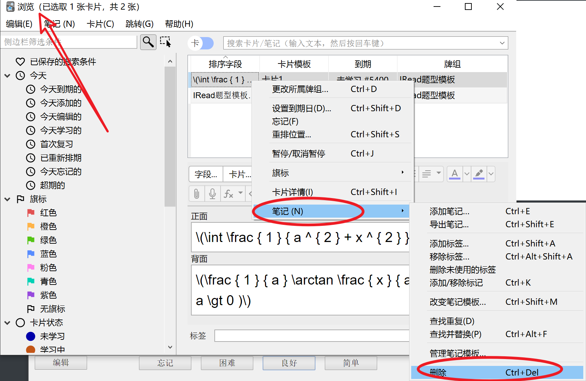

# Anki

## 主要文章

阿虚同学

[叶峻峣](https://www.zhihu.com/people/L.M.Sherlock)

[【专栏导航】Anki 教程(电子书)与 B 站 Ankidroid 教程(视频)快速通道 - 知乎 (zhihu.com)](https://zhuanlan.zhihu.com/p/61564332)

[高中生也能看懂的 Anki 教程 · 看云 (kancloud.cn)](https://www.kancloud.cn/ankigaokao/ankigaokao)

[「一周年」专栏整理 - 知乎 (zhihu.com)](https://zhuanlan.zhihu.com/p/57637220)

[→→→→→→Anki终极汇总——请先看我！←←←←←← \- 知乎](https://zhuanlan.zhihu.com/p/21328602)

## 周边工具

### 实物

[What！草稿还能这样“玩”？——「Anki」与草稿纸 - 知乎 (zhihu.com)](https://zhuanlan.zhihu.com/p/38982064)

### 浏览器插件

#### anki划词助手

[anki划词助手使用说明](chrome-extension://ajencmdaamfnkgilhpgkepfhfgjfplnn/bg/guide.html)

该作者的两个（在线词典助手）插件冲突，但是划词助手较实用

#### 在线词典助手

[我不是针对谁，我是说在座各位... - 知乎 (zhihu.com)](https://zhuanlan.zhihu.com/p/25866272)

[在线词典助手ODH\(划词助手在线版\) — 老黄老巢](https://www.laohuang.net/20180213/online-dictionary-helper/)

[扩展程序 \- 在线词典助手](chrome://extensions/?options=lppjdajkacanlmpbbcdkccjkdbpllajb)

[Anki制卡-在线词典助手，春节大更新 - 知乎 (zhihu.com)](https://zhuanlan.zhihu.com/p/56393716)

[Online Dictionary Helper \- Chrome Web Store](https://chrome.google.com/webstore/detail/online-dictionary-helper/lppjdajkacanlmpbbcdkccjkdbpllajb/related?hl=en)

[ODH/README\.zh\_CN\.md at master · ninja33/ODH](https://github.com/ninja33/ODH/blob/master/README.zh_CN.md)

[英文电子书划词+导入到anki+整理句素SOP - 知乎 (zhihu.com)](https://zhuanlan.zhihu.com/p/65851976)

浏览本地pdf

[工具篇——在PDF中取词（PDF.JS+划词助手） - 知乎 (zhihu.com)](https://zhuanlan.zhihu.com/p/23870485)

使用开源的pdf.js打开里面的网址后，再右上角打开pdf

##### 无法浏览本地文件解决办法

[工具篇——在PDF中取词（PDF.JS+划词助手） - 知乎 (zhihu.com)](https://zhuanlan.zhihu.com/p/23870485)

即扩展设置中允许访问文件网址

>   是用Chrome打开本地txt版电子书文件出现这个问题。
>   以下这段文字复制到本地txt文件，再用Chrome打开，划词就可以看见问题现象：
>   Chris and I are traveling to Montana with some friends riding up ahead, and maybe headed farther than that..Waiting for them to get going one morning in their kitchen I noticed the sink faucet was dripping and remembered that it was dripping the last time I was there before and that in fact it had been dripping as long as I could remember. I commented on it and John said he had tried to fix it with a new faucet washer but it hadn't worked. That was all he said. The presumption left was that that was the end of the matter. If you try to fix a faucet and your fixing doesn't work then it's just your lot to live with a dripping faucet.
>
>   划词‘end’,例句中提取的原句是“Chris and I are traveling to Montana with some fri**end**s riding up ahead, and maybe headed farther than that.” （注意单词变成friENDs,而不是end）
>
>   谢谢
>
>   ------
>
>   解决了：
>   先将txt转html文件，在用chrome打开，划词例句就正常了。
>   谢谢老黄
>
>   [在线词典助手ODH\(划词助手在线版\) — 老黄老巢](https://www.laohuang.net/20180213/online-dictionary-helper/#%E5%86%99%E5%9C%A8%E6%9C%80%E5%90%8E)

##### Pandoc转换为html

[Pandoc User’s Guide](file:///D:/Program%20Files/Pandoc/Pandoc%20User's%20Guide.html#general-options-1)

[Pandoc 安装与使用（转） \- 简书](https://www.jianshu.com/p/6ba04f669d0b)

pandoc可将epub转html，但是图片会丢失，参考[借助pandoc将Word文档成网页\_51CTO博客\_word文档层级](https://blog.51cto.com/3chou/2722626)。

已将pandoc安装目录设为path

```powershell
D:\Calibre house\J.K. Rowling\Harry Potter_ The Complete Collectio (5)>pandoc 1.epub -o Harry.html
```

PS：txt在chrome上打开卡的不行，不如pdf，但是pdf搜索速度较慢

若是中文书籍，会遇到乱码，另外，转为pdf需要联网

```powershell
E:\Study\考研\英语>pandoc 1.epub -o 100.html -V mainfont="SimSun"
```

### win

#### BookxNote

>    每一处标注的内容都会变成一张单独的卡片（类似MarginNote了）
>
>    支持划词翻译，目前支持谷歌翻译＆金山词霸
>
>    除了按树状大纲展示笔记、按笔记创建时间线性查看笔记，还可f
>
>    以一键将笔记生成脑图！
>
>    你可以把笔记导出为Anki格式、XMIND脑图文件、markdown格式等
>
>    支持markdown笔记
>
>    没错，你上图你可以看到你还可以把笔记导出为Anki格式、XMIND脑图文件、markdown格式等
>
>    （图略）
>
>    [免费PDF阅读器都是坑？这些开源神器我可是恨不得所有人都知道！ (qq.com)](https://mp.weixin.qq.com/s?__biz=MzA5NjEwNjE0OQ==&mid=2247501080&idx=1&sn=8d20773d8026edd5e5b25fa64abda351&chksm=90b7a6d2a7c02fc473c18d745b98589c7273dae3bfbb4645c5b520c33fd141f77268ce8af96f#rd)

#### subs2srs

里面找的，有时间试试TODO

>   它是一款配合Anki，输出材料的软件。只要放进视频+字幕，即可输出图片、视频、音频、字幕这么一堆按照字幕切割好的材料，然后自行导入到Anki即可。
>
>   [几个"北大"学生，是如何成为诈骗团体的。 \- 知乎](https://zhuanlan.zhihu.com/p/33425628)

#### ABOBOO

TODO

[工具篇——使用ABOBOO学美剧（强推） \- 知乎](https://zhuanlan.zhihu.com/p/21930503?refer=-anki)

#### 其他

[anki卡片编辑器，考试资料分享，anki卡牌分享](http://anki.ysepan.com/)收费，弃置

其中的anki编辑器和anki涂鸦，感觉和插件比起来还是插件较方便

#### 欧陆词典

[Anki高阶应用指南（二）：Anki \+ 词典 打造终极记单词利器 — Corkine's BlOG](https://blog.mazhangjing.com/2017/03/06/Anki-Advanced-Guide-2/)用的欧路词典

[【Anki\+欧路词典】这是我见过最高效的背单词工具组合 \- YouTube](https://www.youtube.com/watch?v=LG_S6uTAKPo&ab_channel=%E5%B0%8F%E8%93%9DLoMoyi)

### mac

#### Marginnote

[MarginNote&Anki天生CP，完美的学习闭环 - 知乎 (zhihu.com)](https://zhuanlan.zhihu.com/p/26651332)

[使用 MarginNote && Anki 学习 高等数学 - 知乎 (zhihu.com)](https://zhuanlan.zhihu.com/p/34512119)

[MarginNote3与anki的深度融合 - 知乎 (zhihu.com)](https://www.zhihu.com/zvideo/1208542433837211648)

## 制卡

### 如何制卡

[如何写出好卡片：利用间隔重复创造理解 - 知乎 (zhihu.com)](https://zhuanlan.zhihu.com/p/434074509)

[3.5 制卡心得 · 高中生也能看懂的 Anki 教程 · 看云 (kancloud.cn)](https://www.kancloud.cn/ankigaokao/ankigaokao/784670)



### 使用IOE制卡

Image Occlusion Enhanced简称 IOE

若在卡片浏览器中加入，以标签排序，并且生成遮挡卡后记得刷新浏览器当前组别，否则新卡暂时不显示。

### 更改卡片

#### 更改标签

可在浏览器中批量更改，注意，如果加了两个标签，其中有包含关系，a包含b，删除a会同时删除b。

#### 更改排序

ANKI卡组如何按照特定字段排序？ - 叶峻峣的回答 - 知乎 https://www.zhihu.com/question/506084169/answer/2273399390

#### 更改模板

anki如何更改已经编辑好的牌组的模版? - 叶峻峣的回答 - 知乎 https://www.zhihu.com/question/479300458/answer/2061757472

更改模板后，原模板的所有卡片都会被更改

### 搜索卡片

>   首先，你需要确认一下卡片的类型，然后在 编辑-[管理笔记](https://www.zhihu.com/search?q=管理笔记&search_source=Entity&hybrid_search_source=Entity&hybrid_search_extra={"sourceType"%3A"answer"%2C"sourceId"%3A"428215336"})类型-选中该类型-字段-补充-在浏览器中按照此字段排序 你就可以去[卡片浏览器](https://www.zhihu.com/search?q=卡片浏览器&search_source=Entity&hybrid_search_source=Entity&hybrid_search_extra={"sourceType"%3A"answer"%2C"sourceId"%3A"428215336"})中找到按照“补充”排序卡片啦！然后就可以去搜索了！
>
>   Anki如何按字段名搜索/筛选出卡片？ - 叶峻峣的回答 - 知乎 https://www.zhihu.com/question/68014510/answer/428215336

### IRead 题

在制作「卡片」方面，这是最简单的题型，只需要输入需要记忆的内容即可，复习也十分简便，只需要阅读「卡片」内容即可。当然，这也意味着 IRead 题型适用于不需要严格记忆的内容。

>   种植过大片草莓的农田，闲置数年后被柳等木本植物覆盖，成片的草莓不见了。请解释其中的原因。为什么草莓不能和柳等木本植物共同繁殖呢？
>
>   这是群落演替的结果。因为柳树较高大，占据更多的空间和阳光。与草莓相比，它具有生长的优势，所以柳树能迅速繁殖起来，而草莓得不到生长所需的阳光，难以成片生长。

这是道课后思考题，答案很长，如果要背诵答案，无疑会花费很多时间，并且这种长句也不适合「Anki」记忆。所以，利用 IRead 题型，我们在复习中直接看一遍这个问题和回答即可。这里我们还可以给一些比较重要的地方做好标记。

### 简答题

>   Anki 内置的基本题型之一，用途广泛，只要你能够以某个知识点为答案提出一个问题、或者记录一个问题及其答案，就可以用简答题。
>
>   比如：
>
>   Q：艾滋病是一种遗传病，可通过母婴遗传？
>   A：错误，艾滋病是一种传染病，不属于遗传病，可通过母婴传播
>   Q：呼吸作用和光合作用的还原氢是?
>   A：呼吸作用产生的还原氢，其实是NADH，而光合作用产生的还原氢是NADPH，两种物质不同，不能混用。

### 填空题

>   Anki 内置的基本题型之一，用它的原因很简单，一个句子里的信息量太大或者难以设问，索性就做成填空题吧！比如：
>
>   （2010·湖北高考） How does the man kill（{{c1::打发}}）time？
>   细胞融合技术突破了{{c1::有性杂交方法}}的局限，使{{c1::远缘杂交}}成为可能。
>   1932年，卢瑟福学生{{c1::查德威克}}于在{{c2::α粒子}}轰击{{c3::铍核}}时发现{{c4::中子}}，获得诺贝尔物理奖。
>   纷纷暮雪下{{c2::辕}}门，风{{c1::掣}}红旗冻不翻。

### 难度过高的卡片

未能理解

1.	搁置（今天不再出现，换日后自动取消搁置）电脑端快捷键 = 或者 -
2.	暂停（除非手动取消暂停，否则不再出现）电脑端快捷键 shift + 2

#### 解决

搜索：

 is:suspended 可以找到被暂停的卡片搜索 

is:buried 可以找到被搁置的卡片

## 复习卡片

## 复习卡片

## [Review Cards](https://docs.ankiweb.net/studying.html?highlight=Enter#review-cards)

When a card has been previously learnt and is ready to be reviewed again, there are four buttons to rate your answer:

**Again** marks your answer as incorrect and asks Anki to show the card more frequently in the future. The card is said to have 'lapsed'. Please see the [lapses](https://docs.ankiweb.net/deck-options.html#lapses) section for more information about how lapsed reviews are handled.

**Hard** by default, shows the card at a [slightly longer delay](https://docs.ankiweb.net/deck-options.html#hard-interval) than last time, and tells Anki to show the card more frequently in the future.

**Good** tells Anki that the last delay was about right, and the card easiness doesn’t need to be adjusted down or up. At the [default starting easiness](https://docs.ankiweb.net/deck-options.html#starting-ease), the card will be shown again approximately 2 1/2 times longer than the previous time, so if you had waited 10 days to see the card previously, the next delay would be about 25 days.

**Easy** tells Anki you found the delay too short. The card will be scheduled [further into the future than 'Good'](https://docs.ankiweb.net/deck-options.html#easy-bonus), and Anki will schedule the card less frequently in the future. Because 'Easy' rapidly increases the delay, it’s best used for only the easiest of cards. Usually you should find yourself answering 'Good' instead.

As with learning cards, you can use 1, 2, 3 and 4 on the keyboard to select an answer. Pressing the spacebar or Enter will select **Good**.

[Studying \- Anki Manual](https://docs.ankiweb.net/studying.html?highlight=Enter)

## 输入

### 公式

```anki
\int \frac { 1 } { a ^ { 2 } + x ^ { 2 } } d x = 执行 ⁨latex⁩ 错误。
生成文件: ⁨C:\Users\Public\Documents\Wondershare\CreatorTemp\anki_temp\tmp.tex⁩
您是否安装了 Latex 和dvipng/dvisvgm？
```

[Anki遇上LaTeX，让你的卡片优美了几分 - 知乎 (zhihu.com)](https://zhuanlan.zhihu.com/p/21362646)

[Index of /ctex/legacy/2.9/ (ustc.edu.cn)](http://mirrors.ustc.edu.cn/ctex/legacy/2.9/)

注意！一定要用 `\(` 和 `\)` 把 latex 公式套住，不要用 `$$` 或 `[$][/$]`。也可以用 MathJax 行样式



## 错题

>   5.3.2.2 怎样高效的复习错题
>   我介绍一下如何用 Anki 复习错题
>   有两种办法
>   一种呢，就是把题目和答案还有归纳录入到 Anki 里。不过费时费力，推荐有家长帮忙制卡的人试试。
>   另外一种我重点介绍一下
>   很简单，每天的学习快要结束时，把最近的错题的位置记录到 Anki 的卡片上，一题对应一张。比如：三年真题-2017-全国乙卷-26
>   再把这些错题归档到一个按时间顺序排序的文件夹里。
>   然后你就可以每天查看 Anki 了解需要复习的错题了。
>   具体如何归档这些学习材料，我下一篇会介绍。

>   **待完成**：顾名思义，老师或你自己计划要做的练习，但还没开始动笔；
>
>   **待批改**：准备交给老师或者自己批改；
>
>   **待订正**：批改完后还没有订正；
>
>   **待复盘**：复盘是围棋术语，在这里，我指的是对订正完毕的材料进行深入思考，找出自己出错的原因（这里要结合做作业时的状态），归纳反思这份材料给我们带来了哪些知识；
>
>   **待制卡**：这里就是与 Anki 结合的地方，将我们复盘后归纳反思出来的认识通过制卡的方式，用于今后的复习；
>
>   **已利用**：这份材料的价值已经被我们抽干了，可以拿去垫桌脚了（笑）

>   每天老师和自己计划的学习材料，按照重要程度，放进待完成的位置（比记作业效果好做完的作业放进待批改，继续处理未完成的作业
>
>   垃圾时间（学不动了）的时候可以用于解决待批改的作业（反正就对个答案，很养生）
>
>   一般来说，在晚上抽出大段时间来解决待复盘的材料（白天上课记的笔记也可以拿出来用）（切记，复盘的材料要新鲜，不要拖太久)
>
>   这里说明一下，题是做不完的，好好利用做过的题很重要（用了这个整理方法你就知道每天你的最大处理量是多少了)然后把今天总结的知识做成卡片，这些材料就完成了使命，可以找个地方存起来了

## 删除

在卡片浏览器中右键->笔记->删除





## 科学上网


Anki 网络代理如何设置？ - Lucifer Lincoln的回答 - 知乎 https://www.zhihu.com/question/384870446/answer/1623703800

```bat
set HTTP_PROXY=http://127.0.0.1:4780
start anki.exe
exit
```

4780是某工具的 http(s) 端口

保存为 runanki.bat 并打开

打开了之后可能还会提示要升级 anki 

## 插件

官网：[Add\-ons for Anki 2\.1 \- AnkiWeb](https://ankiweb.net/shared/addons/2.1)

[Anki 超强插件推荐 - 知乎 (zhihu.com)](https://zhuanlan.zhihu.com/p/49331137)

### 叶佬推荐

[Anki 超强插件推荐 - 知乎 (zhihu.com)](https://zhuanlan.zhihu.com/p/49331137)

[Anki 超强插件介绍 \- 知乎](https://zhuanlan.zhihu.com/p/129399031)

#### link Cards

[link Cards Notes and Preview them in extra window](https://link.zhihu.com/?target=https%3A//ankiweb.net/shared/info/1423933177)

Anki 如何复习有网状联系的知识？ - 叶峻峣的回答 - 知乎 https://www.zhihu.com/question/410172084/answer/1369888723

有没有办法用anki同时避免知识碎片化？ - 叶峻峣的回答 - 知乎 https://www.zhihu.com/question/481200710/answer/2077228696

#### Enhance main window

[Enhance main window - AnkiWeb](https://ankiweb.net/shared/info/877182321)

#### Image Occlusion Enhanced

[Image Occlusion Enhanced - AnkiWeb](https://ankiweb.net/shared/info/1374772155)

上面简称的IOE，这个软件可以让用户在 Anki 中制作遮挡卡片

[Anki 插件之Image Occlusion Enhanced 和Searching PDF Reading & Note Taking的配合使用\_哔哩哔哩\_bilibili](https://www.bilibili.com/video/BV1hf4y127pB/?vd_source=4ed832873c3b70388cd7746abf15ce0a)

两种生成方法

1.   用生成卡片不相重叠的信息，哪里都有标签隐藏在前面，还有一个显示在后面
2.   hide one guess one

两者区别，后者不用多个颜色，1用多种颜色区分

生成的卡片排序字段使用默认的！也就是根据图片排序！如果还要一个个改`Header` 太过麻烦。生成默认的排序字段

注：此插件在 PC 上有效

>   [Image occlusion not working in Anki iPad OS \- AnkiMobile \(iPhone/iPad\) \- Anki Forums](https://forums.ankiweb.net/t/image-occlusion-not-working-in-anki-ipad-os/9923/2)

#### Edit Field During Review

这是一款让你可以边复习边改卡片的插件。用过 SuperMemo 的朋友一定很熟悉，因为 SuperMemo 就是直接点击 item 就能编辑。适合有边复习边修改措辞习惯的用户使用。

[Edit Field During Review - AnkiWeb](https://ankiweb.net/shared/info/1020366288)

#### AnkiConnect

[Add\-ons for Anki 2\.1 \- AnkiWeb](https://ankiweb.net/shared/addons/)

[FooSoft/anki\-connect: Anki plugin to expose a remote API for creating flash cards\.](https://github.com/FooSoft/anki-connect)

[英文电子书划词+导入到anki+整理句素SOP - 知乎 (zhihu.com)](https://zhuanlan.zhihu.com/p/65851976)

[在线词典助手ODH\(划词助手在线版\) — 老黄老巢](https://www.laohuang.net/20180213/online-dictionary-helper/)

#### Review Heatmap

[Review Heatmap \- AnkiWeb](https://ankiweb.net/shared/info/1771074083)

### 其他

#### Searching, PDF Reading & Note-Taking in Add Dialog

[Searching, PDF Reading & Note\-Taking in Add Dialog \- AnkiWeb](https://ankiweb.net/shared/info/1781298089)

[Anki 插件之Image Occlusion Enhanced 和Searching PDF Reading & Note Taking的配合使用\_哔哩哔哩\_bilibili](https://www.bilibili.com/video/BV1hf4y127pB/?vd_source=4ed832873c3b70388cd7746abf15ce0a)

#### Markdown and KaTeX Support

[Markdown and KaTeX Support \- AnkiWeb](https://ankiweb.net/shared/info/1087328706)

可以直接支持 markdown

[Anki与Markdown的联动 \- 知乎](https://zhuanlan.zhihu.com/p/389510694)

[如何使Anki支持Markdown？ \- 知乎](https://www.zhihu.com/question/469601592/answer/1975257570)

感觉有点走远了，该方案搁置TODO

以pdf为主

#### hjp-bilink

[[Anki插件\]为什么你需要hjp-bilink? - 知乎 (zhihu.com)](https://zhuanlan.zhihu.com/p/547780886)

国人出品，链接可视化

感觉有点丑，先禁用了

使用：

[hjp-bilink: 🧷 make the disorganized card more organizable|结构化卡片插件 - AnkiWeb](https://ankiweb.net/shared/info/1420819673)

#### Fast Word Query

查单词

[给Fast Word Query插件制作自己的网络词库 - 知乎 (zhihu.com)](https://zhuanlan.zhihu.com/p/191635270)

## 模板

[「硬核」卡片模板修改与制作入门 \- 知乎](https://zhuanlan.zhihu.com/p/59438099)

[Anki终极模板\+制卡助手插件 \| Half Stack](https://zhangsn.me/anki-ultimate-template/)

### 教程

[小白一看就懂的Anki模板修改方法](https://mp.weixin.qq.com/s?__biz=MzU2NDI1Mzg2NQ==&mid=2247484062&idx=1&sn=bb128e26996e74d5f3ad5405d8040880&chksm=fc4c8758cb3b0e4e05002a68bf1362b8258f8cf1366838c00f6d171950afc63de0ecf39f8ec8&scene=21#wechat_redirect)

### 内置

### IREAD

叶哥教程推荐的

### Anki高考

叶哥的

TODO

### Anki-Blank-Space

[Anki\-Blank\-Space/anki\_blank\_space20190406\.colpkg at master · ZuoAoyu/Anki\-Blank\-Space](https://github.com/ZuoAoyu/Anki-Blank-Space/blob/master/anki_blank_space20190406.colpkg)

[破解长篇背诵的 Anki 模板！Anki+网格记忆法！ - 知乎 (zhihu.com)](https://zhuanlan.zhihu.com/p/50393957)该文章中的模板可能太老了，有点问题

但是这里有一个坑，colpkg？好像是这个，会直接覆盖，所以还是diy吧TODO

>    [「Leo的Anki系列」1000种Anki模板 \- 知乎](https://zhuanlan.zhihu.com/p/38054064)
>
>   >   [小白一看就懂的Anki模板修改方法](https://mp.weixin.qq.com/s?__biz=MzU2NDI1Mzg2NQ==&mid=2247484062&idx=1&sn=bb128e26996e74d5f3ad5405d8040880&chksm=fc4c8758cb3b0e4e05002a68bf1362b8258f8cf1366838c00f6d171950afc63de0ecf39f8ec8&scene=21#wechat_redirect)

### ODH模板

及本人修改版

[在线词典助手ODH\(划词助手在线版\) — 老黄老巢](https://www.laohuang.net/20180213/online-dictionary-helper/)作者在文章末尾分享

[ODH模板下载链接](https://www.laohuang.net/files/ODH.zip)

### 划词助手模板

[Anki 模板及索引 — 老黄老巢](https://www.laohuang.net/20161006/anki-template/)

谷歌模板要去掉

```html
<!-- 如有外部引用的网址，可以将下列 href="#" 改成href={{网址字段}}-->
```

填空模板正常

#### Antimoon

[Antimoon 划词助手兼容模板 3\.0 — 老黄老巢](https://www.laohuang.net/20180108/antimoon-template-3/)

## 他人牌组

[【分享】Anki 哈工深计科牌组 - 知乎 (zhihu.com)](https://zhuanlan.zhihu.com/p/362498928)

[【经验】他人牌组食用指北|Anki - 知乎 (zhihu.com)](https://zhuanlan.zhihu.com/p/168386543)

## 目前尝试使用书籍

hp 和100个句子记考研


