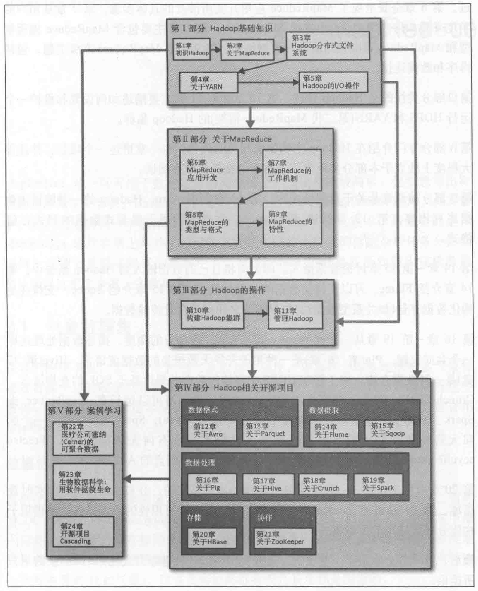

# Hadoop权威指南

## 全书架构图

## 一、Hadoop 基础知识

### 1.初识 Hadoop

### 2.关于 MapReduce

### 3.Hadoop分布式文件系统

### 4.关于YARN

### 5.Hadoop的 I / O 操作

## 二、关于 MapReduce

### 6.MapReduce 应用开发

### 7.MapReduce 的工作机制

### 8.MapReduce 的类型与格式

### 9.MapReduce 的特性

## 三、Hadoop 的操作

### 10.构建 Hadoop 集群

### 11.管理 Hadoop

## 四、Hadoop 相关开源项目

