# 第一期

项目介绍、架构图、业务流程、技术选型、需求分析

前后端项目初始化（包含Ant Design Pro框架最新版本的使用+踩坑)

前后端代码自动生成

[智能 BI 项目教程(一) (yuque.com)](https://bcdh.yuque.com/staff-wpxfif/resource/yfzxxotgubval5de)

## 项目介绍

基于React+Spring Boot+MQ+AIGC的智能数据分析平台。

区别于传统BI,用户只需要导入原始数据集、并输入分析诉求，就能自动生成可视化图表及分析结论，实现数据分析的降本增效。

### 架构图


### 技术栈

#### 前端

1.   React
2.   Umi Ant Design Pro
3.   可视化开发库(Echarts+HighCharts+AntV)
4.   umi openapi代码生成（自动生成后端调用代码）

#### 后端

1.   Spring Boot(万用Java后端项目模板，快速搭建基础框架，避免重复写代码)
2.   MySQL数据库
3.   MyBatis Plus数据访问框架
4.   消息队列(RabbitMQ)
5.   AI能力(Open Al接口开发/星球提供现成的AI接口)

## 前端项目初始化

[Ant Design \- 一套企业级 UI 设计语言和 React 组件库](https://ant.design/index-cn)

### Git初始化

1.   github 新建仓库
2.   git clone
3.   git add .
4.   git commit -m ""
5.   git push origin main

### Ant Design项目初始化

(以下作废，重新弄安装Ant Design Pro，可直接跳到下一章)

[ant\-design/README\-zh\_CN\.md at master · ant\-design/ant\-design](https://github.com/ant-design/ant-design/blob/master/README-zh_CN.md)

```bash
PS E:\github\ChatBI\ChatBI\frontend> npm install antd --save
npm WARN config global `--global`, `--local` are deprecated. Use `--location=global` instead.

added 76 packages, and audited 77 packages in 15s

1 package is looking for funding
  run `npm fund` for details

found 0 vulnerabilities
```


```bash
PS E:\github\ChatBI\ChatBI\frontend> yarn add antd
yarn: The term 'yarn' is not recognized as a name of a cmdlet, function, script file, or executable program.
Check the spelling of the name, or if a path was included, verify that the path is correct and try again.
```

#### yarn 安装

[Installation \| Yarn \- Package Manager](https://yarnpkg.com/getting-started/install)

```bash
PS E:\github\ChatBI\ChatBI\frontend> yarn add antd
yarn add v1.22.15
warning package.json: No license field
info No lockfile found.
warning package-lock.json found. Your project contains lock files generated by tools other than Yarn. It is advised not to mix package managers in order to avoid resolution inconsistencies caused by unsynchronized lock files. To clear this warning, remove package-lock.json.
warning No license field
[1/4] Resolving packages...
[2/4] Fetching packages...
[3/4] Linking dependencies...
warning "antd > @rc-component/mutate-observer@1.1.0" has unmet peer dependency "react@>=16.9.0". 
warning "antd > @rc-component/mutate-observer@1.1.0" has unmet peer dependency "react-dom@>=16.9.0".
.........
warning "antd > rc-table > @rc-component/context@1.3.0" has unmet peer dependency "react@>=16.9.0".
warning "antd > rc-table > @rc-component/context@1.3.0" has unmet peer dependency "react-dom@>=16.9.0".
warning "antd > rc-tree > rc-virtual-list@3.5.3" has unmet peer dependency "react@*".
warning "antd > rc-tree > rc-virtual-list@3.5.3" has unmet peer dependency "react-dom@*".        
warning " > antd@5.8.2" has unmet peer dependency "react@>=16.9.0".
warning " > antd@5.8.2" has unmet peer dependency "react-dom@>=16.9.0".
[4/4] Building fresh packages...
success Saved lockfile.
warning No license field
success Saved 56 new dependencies.
info Direct dependencies
└─ antd@5.8.2
info All dependencies
├─ @ant-design/cssinjs@1.16.2
├─ @ant-design/icons-svg@4.3.0
├─ @ant-design/icons@5.2.5
├─ string-convert@0.2.1
├─ stylis@4.3.0
└─ toggle-selection@1.0.6
Done in 83.83s.
```

### Ant Design Pro 项目初始化

[ant\-design/ant\-design\-pro: 👨🏻‍💻👩🏻‍💻 Use Ant Design like a Pro\!](https://github.com/ant-design/ant-design-pro)

[开始使用 \- Ant Design Pro](https://pro.ant.design/zh-CN/docs/getting-started/)

#### 安装脚手架

```powershell
PS E:\github\ChatBI\ChatBI> npm i @ant-design/pro-cli -g
npm WARN config global `--global`, `--local` are deprecated. Use `--location=global` instead.
npm WARN config global `--global`, `--local` are deprecated. Use `--location=global` instead.
npm WARN deprecated @npmcli/move-file@1.1.2: This functionality has been moved to @npmcli/fs
npm WARN deprecated readdir-scoped-modules@1.1.0: This functionality has been moved to @npmcli/fs
npm WARN deprecated debuglog@1.0.1: Package no longer supported. Contact Support at https://www.npmjs.com/support for more info.  
npm WARN deprecated @npmcli/move-file@2.0.1: This functionality has been moved to @npmcli/fs
npm WARN deprecated @stylelint/postcss-markdown@0.36.2: Use the original unforked package instead: postcss-markdown
npm WARN deprecated har-validator@5.1.5: this library is no longer supported
npm WARN deprecated date-format@0.0.0: 0.x is no longer supported. Please upgrade to 4.x or higher.
npm WARN deprecated streamroller@0.4.1: 0.x is no longer supported. Please upgrade to 3.x or higher.
npm WARN deprecated uuid@3.4.0: Please upgrade  to version 7 or higher.  Older versions may use Math.random() in certain circumstances, which is known to be problematic.  See https://v8.dev/blog/math-random for details.
npm WARN deprecated request@2.88.2: request has been deprecated, see https://github.com/request/request/issues/3142
npm WARN deprecated @stylelint/postcss-css-in-js@0.37.3: Package no longer supported. Contact Support at https://www.npmjs.com/support for more info.
npm WARN deprecated log4js@1.1.1: 1.x is no longer supported. Please upgrade to 6.x or higher.
npm WARN deprecated core-js@2.6.12: core-js@<3.23.3 is no longer maintained and not recommended for usage due to the number of issues. Because of the V8 engine whims, feature detection in old core-js versions could cause a slowdown up to 100x even if nothing is polyfilled. Some versions have web compatibility issues. Please, upgrade your dependencies to the actual version of core-js.    

changed 1180 packages, and audited 1181 packages in 3m

200 packages are looking for funding
  run `npm fund` for details

11 vulnerabilities (2 moderate, 5 high, 4 critical)

To address issues that do not require attention, run:
  npm audit fix

To address all issues (including breaking changes), run:
  npm audit fix --force

Run `npm audit` for details.


```


##### pro not recognized

```powershell
PS E:\github\ChatBI\ChatBI> pro create myapp
pro: The term 'pro' is not recognized as a name of a cmdlet, function, script file, or executable program.
Check the spelling of the name, or if a path was included, verify that the path is correct and try again.
```


在

```
C:\Users\Administrator\AppData\Roaming\npm
```

中能找到pro系列文件

```bash
youhuangla@DESKTOP-0O633M1:/mnt/c/Users/Administrator/AppData/Roaming/npm$ ls
cnpm      cnpm.ps1      pro      pro.ps1  tsc.cmd  tsserver      tsserver.ps1  vue.cmd
cnpm.cmd  node_modules  pro.cmd  tsc      tsc.ps1  tsserver.cmd  vue           vue.ps1
```

说明未将`C:\Users\Administrator\AppData\Roaming\npm`正确地添加到系统的环境变量中，添加即可

#### 创建前端项目


```powershell
PS E:\github\ChatBI\ChatBI> pro create yubi-frontend
? 🐂 使用 umi@4 还是 umi@3 ? umi@4
🧎🏻全量区块暂时不支持 umi@4       
> clone repo url: https://gitee.com/ant-design/ant-design-pro
Cloning into 'yubi-frontend'...
remote: Enumerating objects: 191, done.
remote: Counting objects: 100% (191/191), done.
remote: Compressing objects: 100% (163/163), done.
remote: Total 191 (delta 39), reused 114 (delta 18), pack-reused 0
Receiving objects: 100% (191/191), 309.24 KiB | 165.00 KiB/s, done.
Resolving deltas: 100% (39/39), done.
> 🚚 clone success
> Clean up...

No change to package.json was detected. No package manager install will be executed.
```

[Create yubi\-frontend with pro\-cli · youhuangla/ChatBI@2a52931](https://github.com/youhuangla/ChatBI/commit/2a52931eb6a050b4886a5366c86f848e84570c76)

#### 安装依赖

```powershell
PS E:\github\ChatBI\ChatBI> cd .\yubi-frontend\

PS E:\github\ChatBI\ChatBI\yubi-frontend> tyarn
tyarn: The term 'tyarn' is not recognized as a name of a cmdlet, function, script file, or executable program.
Check the spelling of the name, or if a path was included, verify that the path is correct and try again.

```


>   Person: 
>
>   - PS E:\github\ChatBI\ChatBI\yubi-frontend> tyarn
>       tyarn: The term 'tyarn' is not recognized as a name of a cmdlet, function, script file, or executable program.
>       Check the spelling of the name, or if a path was included, verify that the path is correct and try again.
>
>   ChatGPT: 
>
>   - 从你的输入中可以看出，你在 PowerShell 中尝试运行 `tyarn` 命令，但是系统提示找不到名为 `tyarn` 的命令。这可能是因为 `tyarn` 并没有在你的系统中正确安装或配置。
>
>   要解决这个问题，你可以尝试以下步骤： 
>
>   1. 确认是否安装了 `tyarn`：首先，确保你已经全局安装了 `tyarn`。你可以运行以下命令来全局安装它：
>
>   ```bash
>   npm install tyarn -g
>   ```
>
>   2. 确认安装路径：确认 `tyarn` 是否被正确地添加到系统的环境变量中。通常情况下，全局安装的 npm 包的执行文件会被添加到环境变量的路径中，从而可以在任何位置执行相关命令。 
>   3. 尝试使用完整路径：如果确认 `tyarn` 已经被安装且环境变量配置正确，但仍然无法使用，你可以尝试使用完整的执行路径来运行 `tyarn` 命令。全局安装的 npm 包的执行路径通常类似于 `C:\Users\<username>\AppData\Roaming\npm`。
>
>   你可以在命令行中输入以下命令，将 `<username>` 替换为你的实际用户名：
>
>   ```bash
>   C:\Users\<username>\AppData\Roaming\npm\tyarn
>   ```
>
>   或者使用 PowerShell 的方式：
>
>   ```powershell
>   & "C:\Users\<username>\AppData\Roaming\npm\tyarn"
>   ```
>
>   如果你仍然遇到问题，可以提供更多详细信息，我会尽力帮助你解决。

```powershell
PS E:\github\ChatBI\ChatBI\yubi-frontend> npm install tyarn -g
npm WARN config global `--global`, `--local` are deprecated. Use `--location=global` instead.
npm WARN config global `--global`, `--local` are deprecated. Use `--location=global` instead.

added 10 packages, and audited 11 packages in 6s

found 0 vulnerabilities

PS E:\github\ChatBI\ChatBI\yubi-frontend> tyarn
yarn install v1.22.15
info No lockfile found.
[1/5] Validating package.json...
[2/5] Resolving packages...
warning react-dev-inspector > querystring@0.2.1: The querystring API is considered Legacy. new code should use the URLSearchParams API instead.
warning react-dev-inspector > react-dev-utils > fork-ts-checker-webpack-plugin > memfs@3.6.0: this will be v4
warning @ant-design/pro-cli > pngjs-image > request@2.88.2: request has been deprecated, see https://github.com/request/request/issues/3142
warning @ant-design/pro-cli > babel-types > babel-runtime > core-js@2.6.12: core-js@<3.23.3 is no longer maintained and not recommended for usage due to the number of issues. Because of the V8 engine whims, feature detection in old core-js versions could cause a slowdown up to 100x even if nothing is polyfilled. Some versions have web compatibility issues. Please, upgrade your dependencies to the actual version of core-js.
warning @ant-design/pro-cli > @umijs/fabric > stylelint > @stylelint/postcss-markdown@0.36.2: Use the original unforked package instead: postcss-markdown
warning @ant-design/pro-cli > @umijs/fabric > stylelint > @stylelint/postcss-css-in-js@0.37.3: Package no longer supported. Contact Support at https://www.npmjs.com/support for more info.
warning @ant-design/pro-cli > blink-diff > preceptor-core > log4js@1.1.1: 1.x is no longer supported. Please upgrade to 6.x or higher.
warning @ant-design/pro-cli > pngjs-image > request > har-validator@5.1.5: this library is no longer supported
warning @ant-design/pro-cli > pngjs-image > request > uuid@3.4.0: Please upgrade  to version 7 or higher.  Older versions may use 
Math.random() in certain circumstances, which is known to be problematic.  See https://v8.dev/blog/math-random for details.       
warning @ant-design/pro-cli > blink-diff > preceptor-core > log4js > streamroller@0.4.1: 0.x is no longer supported. Please upgrade to 3.x or higher.
warning @ant-design/pro-cli > blink-diff > preceptor-core > log4js > streamroller > date-format@0.0.0: 0.x is no longer supported. Please upgrade to 4.x or higher.
warning @types/classnames@2.3.1: This is a stub types definition. classnames provides its own type definitions, so you do not need this installed.
warning @umijs/lint > @stylelint/postcss-css-in-js@0.38.0: Package no longer supported. Contact Support at https://www.npmjs.com/support for more info.
warning @umijs/max > umi > @umijs/bundler-webpack > fork-ts-checker-webpack-plugin > memfs@3.6.0: this will be v4
warning @umijs/max > @umijs/plugins > dva-core > flatten@1.0.3: flatten is deprecated in favor of utility frameworks such as lodash.
warning @umijs/max > @umijs/plugins > react-intl > @formatjs/intl-unified-numberformat@3.3.7: We have renamed the package to @formatjs/intl-numberformat
warning @umijs/max > @umijs/plugins > react-intl > @formatjs/intl-utils@2.3.0: the package is rather renamed to @formatjs/ecma-abstract with some changes in functionality (primarily selectUnit is removed and we don't plan to make any further changes to this package
warning @umijs/max > @umijs/plugins > react-intl > @formatjs/intl-displaynames > @formatjs/intl-utils@2.3.0: the package is rather renamed to @formatjs/ecma-abstract with some changes in functionality (primarily selectUnit is removed and we don't plan to make 
any further changes to this package
warning @umijs/max > @umijs/plugins > react-intl > @formatjs/intl-listformat > @formatjs/intl-utils@2.3.0: the package is rather renamed to @formatjs/ecma-abstract with some changes in functionality (primarily selectUnit is removed and we don't plan to make any further changes to this package
warning @umijs/max > @umijs/plugins > react-intl > @formatjs/intl-unified-numberformat > @formatjs/intl-utils@2.3.0: the package is rather renamed to @formatjs/ecma-abstract with some changes in functionality (primarily selectUnit is removed and we don't plan 
to make any further changes to this package
warning @umijs/max > @umijs/plugins > react-intl > @formatjs/intl-relativetimeformat > @formatjs/intl-utils@2.3.0: the package is 
rather renamed to @formatjs/ecma-abstract with some changes in functionality (primarily selectUnit is removed and we don't plan to make any further changes to this package
warning @umijs/max > @umijs/plugins > react-intl > intl-messageformat-parser@3.6.4: We've written a new parser that's 6x faster and is backwards compatible. Please use @formatjs/icu-messageformat-parser
warning @umijs/max > @umijs/plugins > react-intl > intl-messageformat > intl-messageformat-parser@3.6.4: We've written a new parser that's 6x faster and is backwards compatible. Please use @formatjs/icu-messageformat-parser
warning @umijs/max > @umijs/plugins > react-intl > intl-messageformat-parser > @formatjs/intl-unified-numberformat@3.3.7: We have 
renamed the package to @formatjs/intl-numberformat
warning @umijs/max > umi > @umijs/preset-umi > click-to-react-component > @floating-ui/react-dom-interactions@0.3.1: Package renamed to @floating-ui/react
warning @umijs/max > umi > @umijs/bundler-webpack > @svgr/plugin-svgo > svgo > stable@0.1.8: Modern JS already guarantees Array#sort() is a stable sort, so this library is deprecated. See the compatibility table on MDN: https://developer.mozilla.org/en-US/docs/Web/JavaScript/Reference/Global_Objects/Array/sort#browser_compatibility
warning umi-presets-pro > @alita/plugins > antd-mobile-alita > rc-swipeout > react-native-swipeout@2.3.6: Package no longer supported. Use at your own risk or consider using https://github.com/software-mansion/react-native-gesture-handler
warning umi-presets-pro > @alita/plugins > antd-mobile-alita > rmc-list-view > fbjs > core-js@1.2.7: core-js@<3.23.3 is no longer 
maintained and not recommended for usage due to the number of issues. Because of the V8 engine whims, feature detection in old core-js versions could cause a slowdown up to 100x even if nothing is polyfilled. Some versions have web compatibility issues. Please, upgrade your dependencies to the actual version of core-js.
[3/5] Fetching packages...
info fsevents@2.3.2: The platform "win32" is incompatible with this module.
info "fsevents@2.3.2" is an optional dependency and failed compatibility check. Excluding it from installation.
info @esbuild/android-arm@0.17.19: The platform "win32" is incompatible with this module.
info "@esbuild/android-arm@0.17.19" is an optional dependency and failed compatibility check. Excluding it from installation.     
info @esbuild/android-arm@0.17.19: The CPU architecture "x64" is incompatible with this module.
info @esbuild/android-x64@0.17.19: The platform "win32" is incompatible with this module.
info "@esbuild/android-x64@0.17.19" is an optional dependency and failed compatibility check. Excluding it from installation.     
info @esbuild/darwin-arm64@0.17.19: The platform "win32" is incompatible with this module.
info "@esbuild/darwin-arm64@0.17.19" is an optional dependency and failed compatibility check. Excluding it from installation.    
info @esbuild/darwin-arm64@0.17.19: The CPU architecture "x64" is incompatible with this module.
info @esbuild/android-arm64@0.17.19: The platform "win32" is incompatible with this module.
info "@esbuild/android-arm64@0.17.19" is an optional dependency and failed compatibility check. Excluding it from installation.   
info @esbuild/android-arm64@0.17.19: The CPU architecture "x64" is incompatible with this module.
info @esbuild/freebsd-x64@0.17.19: The platform "win32" is incompatible with this module.
info "@esbuild/freebsd-x64@0.17.19" is an optional dependency and failed compatibility check. Excluding it from installation.     
info @esbuild/linux-arm@0.17.19: The platform "win32" is incompatible with this module.
info "@esbuild/linux-arm@0.17.19" is an optional dependency and failed compatibility check. Excluding it from installation.       
info @esbuild/linux-arm@0.17.19: The CPU architecture "x64" is incompatible with this module.
info @esbuild/freebsd-arm64@0.17.19: The platform "win32" is incompatible with this module.
info "@esbuild/freebsd-arm64@0.17.19" is an optional dependency and failed compatibility check. Excluding it from installation.   
info @esbuild/freebsd-arm64@0.17.19: The CPU architecture "x64" is incompatible with this module.
info @esbuild/darwin-x64@0.17.19: The platform "win32" is incompatible with this module.
info "@esbuild/darwin-x64@0.17.19" is an optional dependency and failed compatibility check. Excluding it from installation.      
info @esbuild/linux-ia32@0.17.19: The platform "win32" is incompatible with this module.
info "@esbuild/linux-ia32@0.17.19" is an optional dependency and failed compatibility check. Excluding it from installation.      
info @esbuild/linux-ia32@0.17.19: The CPU architecture "x64" is incompatible with this module.
info @esbuild/linux-loong64@0.17.19: The platform "win32" is incompatible with this module.
info "@esbuild/linux-loong64@0.17.19" is an optional dependency and failed compatibility check. Excluding it from installation.   
info @esbuild/linux-loong64@0.17.19: The CPU architecture "x64" is incompatible with this module.
info @esbuild/linux-mips64el@0.17.19: The platform "win32" is incompatible with this module.
info "@esbuild/linux-mips64el@0.17.19" is an optional dependency and failed compatibility check. Excluding it from installation.  
info @esbuild/linux-mips64el@0.17.19: The CPU architecture "x64" is incompatible with this module.
info @esbuild/linux-ppc64@0.17.19: The platform "win32" is incompatible with this module.
info "@esbuild/linux-ppc64@0.17.19" is an optional dependency and failed compatibility check. Excluding it from installation.     
info @esbuild/linux-ppc64@0.17.19: The CPU architecture "x64" is incompatible with this module.
info @esbuild/linux-riscv64@0.17.19: The platform "win32" is incompatible with this module.
info "@esbuild/linux-riscv64@0.17.19" is an optional dependency and failed compatibility check. Excluding it from installation.   
info @esbuild/linux-riscv64@0.17.19: The CPU architecture "x64" is incompatible with this module.
info @esbuild/linux-s390x@0.17.19: The platform "win32" is incompatible with this module.
info "@esbuild/linux-s390x@0.17.19" is an optional dependency and failed compatibility check. Excluding it from installation.     
info @esbuild/linux-s390x@0.17.19: The CPU architecture "x64" is incompatible with this module.
info @esbuild/linux-arm64@0.17.19: The platform "win32" is incompatible with this module.
info "@esbuild/linux-arm64@0.17.19" is an optional dependency and failed compatibility check. Excluding it from installation.     
info @esbuild/linux-arm64@0.17.19: The CPU architecture "x64" is incompatible with this module.
info @esbuild/netbsd-x64@0.17.19: The platform "win32" is incompatible with this module.
info "@esbuild/netbsd-x64@0.17.19" is an optional dependency and failed compatibility check. Excluding it from installation.      
info @esbuild/linux-x64@0.17.19: The platform "win32" is incompatible with this module.
info "@esbuild/linux-x64@0.17.19" is an optional dependency and failed compatibility check. Excluding it from installation.       
info @esbuild/openbsd-x64@0.17.19: The platform "win32" is incompatible with this module.
info "@esbuild/openbsd-x64@0.17.19" is an optional dependency and failed compatibility check. Excluding it from installation.     
info @esbuild/win32-arm64@0.17.19: The CPU architecture "x64" is incompatible with this module.
info "@esbuild/win32-arm64@0.17.19" is an optional dependency and failed compatibility check. Excluding it from installation.     
info @esbuild/sunos-x64@0.17.19: The platform "win32" is incompatible with this module.
info "@esbuild/sunos-x64@0.17.19" is an optional dependency and failed compatibility check. Excluding it from installation.       
info @esbuild/win32-ia32@0.17.19: The CPU architecture "x64" is incompatible with this module.
info "@esbuild/win32-ia32@0.17.19" is an optional dependency and failed compatibility check. Excluding it from installation.      
info lightningcss-darwin-x64@1.19.0: The platform "win32" is incompatible with this module.
info "lightningcss-darwin-x64@1.19.0" is an optional dependency and failed compatibility check. Excluding it from installation.   
info lightningcss-linux-x64-gnu@1.19.0: The platform "win32" is incompatible with this module.
info "lightningcss-linux-x64-gnu@1.19.0" is an optional dependency and failed compatibility check. Excluding it from installation.info lightningcss-linux-arm64-musl@1.19.0: The platform "win32" is incompatible with this module.
info "lightningcss-linux-arm64-musl@1.19.0" is an optional dependency and failed compatibility check. Excluding it from installation.
info lightningcss-linux-arm64-musl@1.19.0: The CPU architecture "x64" is incompatible with this module.
info lightningcss-linux-arm64-gnu@1.19.0: The platform "win32" is incompatible with this module.
info "lightningcss-linux-arm64-gnu@1.19.0" is an optional dependency and failed compatibility check. Excluding it from installation.
info lightningcss-linux-arm64-gnu@1.19.0: The CPU architecture "x64" is incompatible with this module.
info lightningcss-darwin-arm64@1.19.0: The platform "win32" is incompatible with this module.
info "lightningcss-darwin-arm64@1.19.0" is an optional dependency and failed compatibility check. Excluding it from installation. 
info lightningcss-darwin-arm64@1.19.0: The CPU architecture "x64" is incompatible with this module.
info lightningcss-linux-arm-gnueabihf@1.19.0: The platform "win32" is incompatible with this module.
info "lightningcss-linux-arm-gnueabihf@1.19.0" is an optional dependency and failed compatibility check. Excluding it from installation.
info lightningcss-linux-arm-gnueabihf@1.19.0: The CPU architecture "x64" is incompatible with this module.
info lightningcss-linux-x64-musl@1.19.0: The platform "win32" is incompatible with this module.
info "lightningcss-linux-x64-musl@1.19.0" is an optional dependency and failed compatibility check. Excluding it from installation.
info @umijs/es-module-parser-linux-arm64-gnu@0.0.7: The platform "win32" is incompatible with this module.
info "@umijs/es-module-parser-linux-arm64-gnu@0.0.7" is an optional dependency and failed compatibility check. Excluding it from installation.
info @umijs/es-module-parser-linux-arm64-gnu@0.0.7: The CPU architecture "x64" is incompatible with this module.
info @umijs/es-module-parser-win32-arm64-msvc@0.0.7: The CPU architecture "x64" is incompatible with this module.
info "@umijs/es-module-parser-win32-arm64-msvc@0.0.7" is an optional dependency and failed compatibility check. Excluding it from 
installation.
info @umijs/es-module-parser-linux-x64-gnu@0.0.7: The platform "win32" is incompatible with this module.
info "@umijs/es-module-parser-linux-x64-gnu@0.0.7" is an optional dependency and failed compatibility check. Excluding it from installation.
info @umijs/es-module-parser-darwin-arm64@0.0.7: The platform "win32" is incompatible with this module.
info "@umijs/es-module-parser-darwin-arm64@0.0.7" is an optional dependency and failed compatibility check. Excluding it from installation.
info @umijs/es-module-parser-darwin-arm64@0.0.7: The CPU architecture "x64" is incompatible with this module.
info @umijs/es-module-parser-darwin-x64@0.0.7: The platform "win32" is incompatible with this module.
info "@umijs/es-module-parser-darwin-x64@0.0.7" is an optional dependency and failed compatibility check. Excluding it from installation.
info @umijs/es-module-parser-linux-arm-gnueabihf@0.0.7: The platform "win32" is incompatible with this module.
info "@umijs/es-module-parser-linux-arm-gnueabihf@0.0.7" is an optional dependency and failed compatibility check. Excluding it from installation.
info @umijs/es-module-parser-linux-arm-gnueabihf@0.0.7: The CPU architecture "x64" is incompatible with this module.
info @umijs/es-module-parser-linux-arm64-musl@0.0.7: The platform "win32" is incompatible with this module.
info "@umijs/es-module-parser-linux-arm64-musl@0.0.7" is an optional dependency and failed compatibility check. Excluding it from 
installation.
info @umijs/es-module-parser-linux-arm64-musl@0.0.7: The CPU architecture "x64" is incompatible with this module.
info @umijs/es-module-parser-linux-x64-musl@0.0.7: The platform "win32" is incompatible with this module.
info "@umijs/es-module-parser-linux-x64-musl@0.0.7" is an optional dependency and failed compatibility check. Excluding it from installation.
[4/5] Linking dependencies...
warning "@ant-design/pro-components > @ant-design/pro-form@2.18.0" has unmet peer dependency "rc-field-form@^1.22.0".
warning "@ant-design/pro-components > @ant-design/pro-table@3.10.6" has unmet peer dependency "rc-field-form@^1.22.0".
warning "react-dev-inspector > react-dev-utils > fork-ts-checker-webpack-plugin@6.5.3" has unmet peer dependency "webpack@>= 4".
warning "@umijs/lint > stylelint-config-standard@25.0.0" has unmet peer dependency "stylelint@^14.4.0".
warning "@umijs/lint > stylelint-config-standard > stylelint-config-recommended@7.0.0" has unmet peer dependency "stylelint@^14.4.0".
warning "@umijs/lint > @umijs/babel-preset-umi > babel-plugin-styled-components@2.1.1" has unmet peer dependency "styled-components@>= 2".
warning "@umijs/max > @umijs/plugins > @ahooksjs/use-request@2.8.15" has incorrect peer dependency "react@^16.8.0 || ^17.0.0".    
warning "@umijs/max > @umijs/plugins > dva-loading@3.0.24" has incorrect peer dependency "dva-core@^1.1.0 || ^1.5.0-0 || ^1.6.0-0".
warning "@umijs/max > @umijs/plugins > dva-immer@1.0.1" has unmet peer dependency "dva@^2.5.0-0".
warning "@umijs/max > @umijs/plugins > react-intl@3.12.1" has incorrect peer dependency "react@^16.3.0".
warning "@umijs/max > umi > @umijs/bundler-webpack > fork-ts-checker-webpack-plugin@8.0.0" has unmet peer dependency "webpack@^5.11.0".
warning "@umijs/max > umi > @umijs/test > @babel/plugin-transform-modules-commonjs@7.21.2" has unmet peer dependency "@babel/core@^7.0.0-0".
warning "@umijs/max > umi > @umijs/bundler-webpack > @pmmmwh/react-refresh-webpack-plugin@0.5.10" has unmet peer dependency "webpack@>=4.43.0 <6.0.0".
warning "@umijs/max > umi > @umijs/bundler-webpack > css-loader@6.7.1" has unmet peer dependency "webpack@^5.0.0".
warning "@umijs/max > umi > @umijs/preset-umi > postcss-prefix-selector@1.16.0" has unmet peer dependency "postcss@>4 <9".        
warning "@umijs/max > umi > @umijs/preset-umi > html-webpack-plugin@5.5.0" has unmet peer dependency "webpack@^5.20.0".
warning "@umijs/max > umi > @umijs/test > babel-jest@29.6.2" has unmet peer dependency "@babel/core@^7.8.0".
warning "@umijs/max > umi > @umijs/test > babel-jest > babel-preset-jest@29.5.0" has unmet peer dependency "@babel/core@^7.0.0".  
warning "@umijs/max > umi > @umijs/test > babel-jest > babel-preset-jest > babel-preset-current-node-syntax > @babel/plugin-syntax-bigint@7.8.3" has unmet peer dependency "@babel/core@^7.0.0-0".
warning " > ts-node@10.9.1" has unmet peer dependency "@types/node@*".
warning "umi-presets-pro > @umijs/request-record@1.1.4" has unmet peer dependency "umi@>=3".
warning Workspaces can only be enabled in private projects.
warning Workspaces can only be enabled in private projects.
[5/5] Building fresh packages...
success Saved lockfile.
$ max setup
😄 Hello PRO
info  - [你知道吗？] 如果想预览构建后产物, 可尝试 max preview，详见 https://umijs.org/docs/api/commands#preview
Using openapi Plugin
info  - generate files
info  - Preparing...
$ husky install
.git can't be found (see https://git.io/Jc3F9)
error Command failed with exit code 1.
info Visit https://yarnpkg.com/en/docs/cli/install for documentation about this command.
```

#### PRO，启动！

```powershell
PS E:\github\ChatBI\ChatBI\yubi-frontend> npm run start
npm WARN config global `--global`, `--local` are deprecated. Use `--location=global` instead.

> ant-design-pro@6.0.0 start
> cross-env UMI_ENV=dev max dev

😄 Hello PRO
info  - [你知道吗？] 页面加载慢、产物体积大怎么办？试试做代码拆分，详见 https://umijs.org/blog/code-splitting
Using openapi Plugin
info  - Umi v4.0.75
info  - Preparing...
warn  - GET /api/rule is duplicated in E:\github\ChatBI\ChatBI\yubi-frontend\mock\requestRecord.mock.js and E:\github\ChatBI\ChatBI\yubi-frontend\mock\listTableList.ts
warn  - GET /api/currentUser is duplicated in E:\github\ChatBI\ChatBI\yubi-frontend\mock\user.ts and E:\github\ChatBI\ChatBI\yubi-frontend\mock\requestRecord.mock.js
warn  - POST /api/login/account is duplicated in E:\github\ChatBI\ChatBI\yubi-frontend\mock\user.ts and E:\github\ChatBI\ChatBI\yubi-frontend\mock\requestRecord.mock.js
warn  - POST /api/login/outLogin is duplicated in E:\github\ChatBI\ChatBI\yubi-frontend\mock\user.ts and E:\github\ChatBI\ChatBI\yubi-frontend\mock\requestRecord.mock.js
        ╔════════════════════════════════════════════════════╗
        ║ App listening at:                                  ║
        ║  >   Local: http://localhost:8000                  ║
ready - ║  > Network: http://169.254.114.161:8000            ║
        ║                                                    ║
        ║ Now you can open browser with the above addresses↑ ║
        ╚════════════════════════════════════════════════════╝
Browserslist: caniuse-lite is outdated. Please run:
  npx update-browserslist-db@latest
  Why you should do it regularly: https://github.com/browserslist/update-db#readme
event - [Webpack] Compiled in 9092 ms (504 modules)
info  - [MFSU] buildDeps since cacheDependency has changed
wait  - [Webpack] Compiling...
event - [Webpack] Compiled in 671 ms (478 modules)
wait  - [Webpack] Compiling...
event - [Webpack] Compiled in 367 ms (478 modules)
event - [Webpack] Compiled in 45660 ms (10126 modules)
info  - [MFSU] write cache
info  - [MFSU] buildDepsAgain
info  - [MFSU] skip buildDeps
```

账号：admin

ant.design


dev 命令本质就是 start 命令加上了一个 dev 参数，见`yubi-frontend\package.json` ，该命令不会执行 mock 代码，不会模拟数据，受到影响

```json
    "start:dev": "cross-env REACT_APP_ENV=dev MOCK=none UMI_ENV=dev max dev",

```

VC 中点 Debug 然后选择也可以 start 

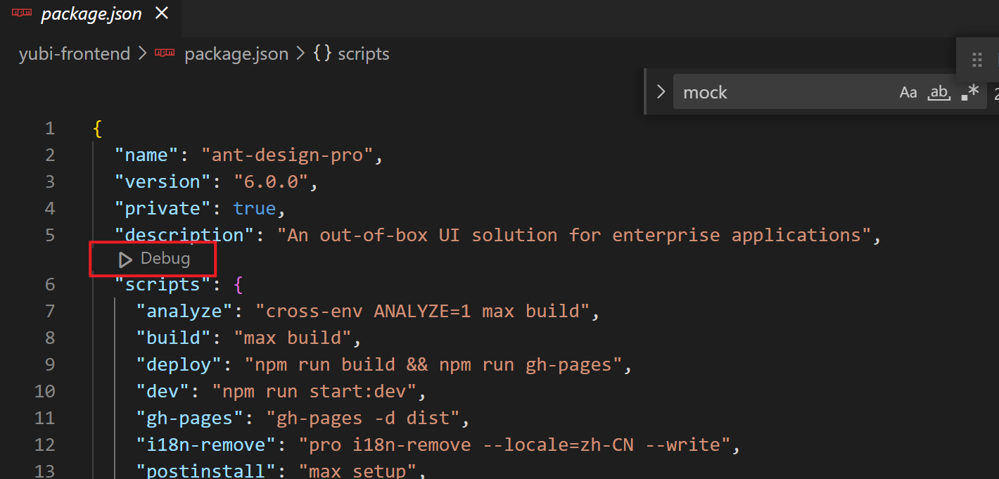


### 删除不需要的部分

#### 删除国际化

`yubi-frontend\src\locales`

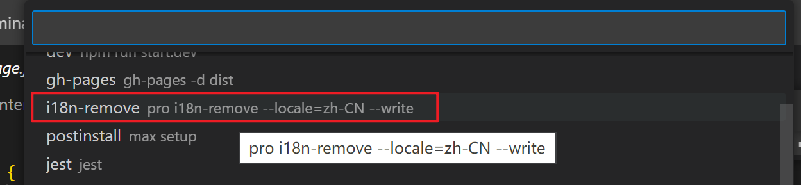

```powershell
PS E:\github\ChatBI\ChatBI\yubi-frontend> npm run i18n-remove
npm WARN config global `--global`, `--local` are deprecated. Use `--location=global` instead.
Debugger attached.

> ant-design-pro@6.0.0 i18n-remove      
> pro i18n-remove --locale=zh-CN --write

Debugger attached.
Waiting for the debugger to disconnect...
E:\github\ChatBI\ChatBI\yubi-frontend\node_modules\@ant-design\pro-cli\node_modules\@eslint\eslintrc\lib\config-array-factory.js:784
            throw error;
            ^

Error: Failed to load config "prettier" to extend from.
Referenced from: BaseConfig
    at configInvalidError (E:\github\ChatBI\ChatBI\yubi-frontend\node_modules\@ant-design\pro-cli\node_modules\@eslint\eslintrc\lib\config-array-factory.js:290:9)
    at ConfigArrayFactory._loadExtendedShareableConfig (E:\github\ChatBI\ChatBI\yubi-frontend\node_modules\@ant-design\pro-cli\node_modules\@eslint\eslintrc\lib\config-array-factory.js:883:23)        
    at ConfigArrayFactory._loadExtends (E:\github\ChatBI\ChatBI\yubi-frontend\node_modules\@ant-design\pro-cli\node_modules\@eslint\eslintrc\lib\config-array-factory.js:781:25)
    at ConfigArrayFactory._normalizeObjectConfigDataBody (E:\github\ChatBI\ChatBI\yubi-frontend\node_modules\@ant-design\pro-cli\node_modules\@eslint\eslintrc\lib\config-array-factory.js:720:25)      
    at _normalizeObjectConfigDataBody.next (<anonymous>)
    at ConfigArrayFactory._normalizeObjectConfigData (E:\github\ChatBI\ChatBI\yubi-frontend\node_modules\@ant-design\pro-cli\node_modules\@eslint\eslintrc\lib\config-array-factory.js:665:20)
    at _normalizeObjectConfigData.next (<anonymous>)
    at ConfigArrayFactory.create (E:\github\ChatBI\ChatBI\yubi-frontend\node_modules\@ant-design\pro-cli\node_modules\@eslint\eslintrc\lib\config-array-factory.js:460:16)
    at createBaseConfigArray (E:\github\ChatBI\ChatBI\yubi-frontend\node_modules\@ant-design\pro-cli\node_modules\@eslint\eslintrc\lib\cascading-config-array-factory.js:98:48)
    at new CascadingConfigArrayFactory (E:\github\ChatBI\ChatBI\yubi-frontend\node_modules\@ant-design\pro-cli\node_modules\@eslint\eslintrc\lib\cascading-config-array-factory.js:234:30) {
  messageTemplate: 'extend-config-missing',
  messageData: { configName: 'prettier', importerName: '' }
}
Waiting for the debugger to disconnect...
PS E:\github\ChatBI\ChatBI\yubi-frontend> npm run i18n-remove
npm WARN config global `--global`, `--local` are deprecated. Use `--location=global` instead.
Debugger attached.

> ant-design-pro@6.0.0 i18n-remove
> pro i18n-remove --locale=zh-CN --write

Debugger attached.
Waiting for the debugger to disconnect...
E:\github\ChatBI\ChatBI\yubi-frontend\node_modules\@ant-design\pro-cli\node_modules\@eslint\eslintrc\lib\config-array-factory.js:784
            throw error;
            ^

Error: Failed to load config "prettier" to extend from.
Referenced from: BaseConfig
    at configInvalidError (E:\github\ChatBI\ChatBI\yubi-frontend\node_modules\@ant-design\pro-cli\node_modules\@eslint\eslintrc\lib\config-array-factory.js:290:9)
    at ConfigArrayFactory._loadExtendedShareableConfig (E:\github\ChatBI\ChatBI\yubi-frontend\node_modules\@ant-design\pro-cli\node_modules\@eslint\eslintrc\lib\config-array-factory.js:883:23)        
    at ConfigArrayFactory._loadExtends (E:\github\ChatBI\ChatBI\yubi-frontend\node_modules\@ant-design\pro-cli\node_modules\@eslint\eslintrc\lib\config-array-factory.js:781:25)
    at ConfigArrayFactory._normalizeObjectConfigDataBody (E:\github\ChatBI\ChatBI\yubi-frontend\node_modules\@ant-design\pro-cli\node_modules\@eslint\eslintrc\lib\config-array-factory.js:720:25)      
    at _normalizeObjectConfigDataBody.next (<anonymous>)
    at ConfigArrayFactory._normalizeObjectConfigData (E:\github\ChatBI\ChatBI\yubi-frontend\node_modules\@ant-design\pro-cli\node_modules\@eslint\eslintrc\lib\config-array-factory.js:665:20)
    at _normalizeObjectConfigData.next (<anonymous>)
    at ConfigArrayFactory.create (E:\github\ChatBI\ChatBI\yubi-frontend\node_modules\@ant-design\pro-cli\node_modules\@eslint\eslintrc\lib\config-array-factory.js:460:16)
    at createBaseConfigArray (E:\github\ChatBI\ChatBI\yubi-frontend\node_modules\@ant-design\pro-cli\node_modules\@eslint\eslintrc\lib\cascading-config-array-factory.js:98:48)
    at new CascadingConfigArrayFactory (E:\github\ChatBI\ChatBI\yubi-frontend\node_modules\@ant-design\pro-cli\node_modules\@eslint\eslintrc\lib\cascading-config-array-factory.js:234:30) {
  messageTemplate: 'extend-config-missing',
  messageData: { configName: 'prettier', importerName: '' }
}
Waiting for the debugger to disconnect...

```

解决方案 

[🐛BUG npm run i18n\-remove 报错 · Issue \#10497 · ant\-design/ant\-design\-pro](https://github.com/ant-design/ant-design-pro/issues/10497)

```powershell
PS E:\github\ChatBI\ChatBI\yubi-frontend> npm i --save-dev prettier eslint-config-prettier eslint-plugin-prettier
npm WARN config global `--global`, `--local` are deprecated. Use `--location=global` instead.
Debugger attached.
npm ERR! code ERESOLVE
npm ERR! ERESOLVE unable to resolve dependency tree
npm ERR!
npm ERR! While resolving: ant-design-pro@6.0.0
npm ERR! Found: prettier@2.8.8
npm ERR! node_modules/prettier
npm ERR!   dev prettier@"^2.8.4" from the root project
npm ERR!
npm ERR! Could not resolve dependency:
npm ERR! peer prettier@">=3.0.0" from eslint-plugin-prettier@5.0.0
npm ERR! node_modules/eslint-plugin-prettier
npm ERR!   dev eslint-plugin-prettier@"*" from the root project
npm ERR!
npm ERR! Fix the upstream dependency conflict, or retry
npm ERR! this command with --force, or --legacy-peer-deps
npm ERR! to accept an incorrect (and potentially broken) dependency resolution.
npm ERR!
npm ERR! See C:\Users\Administrator\AppData\Local\npm-cache\eresolve-report.txt for a full report.  

npm ERR! A complete log of this run can be found in:
npm ERR!     C:\Users\Administrator\AppData\Local\npm-cache\_logs\2023-08-14T07_16_39_181Z-debug-0.log
Waiting for the debugger to disconnect...


PS E:\github\ChatBI\ChatBI\yubi-frontend> npm install --save-dev --save-exact prettier
npm WARN config global `--global`, `--local` are deprecated. Use `--location=global` instead.
Debugger attached.
npm WARN ERESOLVE overriding peer dependency
npm WARN While resolving: @ahooksjs/use-request@2.8.15
npm WARN Found: react@18.2.0
npm WARN node_modules/react
npm WARN   peer react@"^16.8.0 || ^17.0.0 || ^18.0.0" from ahooks@3.7.8
npm WARN   node_modules/ahooks
npm WARN     ahooks@"^3.0.8" from @alita/plugins@3.3.4
npm WARN     node_modules/@alita/plugins
npm WARN   131 more (antd, rc-dialog, rc-menu, rc-dropdown, rc-select, ...)
npm WARN
npm WARN Could not resolve dependency:
npm WARN peer react@"^16.8.0 || ^17.0.0" from @ahooksjs/use-request@2.8.15
npm WARN node_modules/@ahooksjs/use-request
npm WARN   @ahooksjs/use-request@"^2.0.0" from @umijs/plugins@4.0.70
npm WARN   node_modules/@alita/plugins/node_modules/@umijs/plugins
npm WARN   1 more (@umijs/plugins)
npm WARN
npm WARN Conflicting peer dependency: react@17.0.2
npm WARN node_modules/react
npm WARN   peer react@"^16.8.0 || ^17.0.0" from @ahooksjs/use-request@2.8.15
npm WARN   node_modules/@ahooksjs/use-request
npm WARN     @ahooksjs/use-request@"^2.0.0" from @umijs/plugins@4.0.70
npm WARN     node_modules/@alita/plugins/node_modules/@umijs/plugins
npm WARN     1 more (@umijs/plugins)
npm WARN ERESOLVE overriding peer dependency
npm WARN While resolving: @babel/eslint-parser@7.22.10
npm WARN Found: eslint@7.32.0
npm WARN node_modules/@babel/eslint-parser/node_modules/eslint
npm WARN
npm WARN Could not resolve dependency:
npm WARN peer eslint@"^7.5.0 || ^8.0.0" from @babel/eslint-parser@7.22.10
npm WARN node_modules/@babel/eslint-parser
npm WARN   @babel/eslint-parser@"^7.12.1" from @umijs/fabric@2.14.1
npm WARN   node_modules/@umijs/fabric
npm WARN   1 more (eslint-template-visitor)
npm WARN ERESOLVE overriding peer dependency
npm WARN ERESOLVE overriding peer dependency
npm WARN ERESOLVE overriding peer dependency
npm WARN ERESOLVE overriding peer dependency
npm WARN While resolving: react-intl@3.12.1
npm WARN Found: react@18.2.0
npm WARN node_modules/react
npm WARN   peer react@"^16.8.0 || ^17.0.0 || ^18.0.0" from ahooks@3.7.8
npm WARN   node_modules/ahooks
npm WARN     ahooks@"^3.0.8" from @alita/plugins@3.3.4
npm WARN     node_modules/@alita/plugins
npm WARN   131 more (antd, rc-dialog, rc-menu, rc-dropdown, rc-select, ...)
npm WARN
npm WARN Could not resolve dependency:
npm WARN peer react@"^16.3.0" from react-intl@3.12.1
npm WARN node_modules/react-intl
npm WARN   react-intl@"3.12.1" from @umijs/plugins@4.0.70
npm WARN   node_modules/@alita/plugins/node_modules/@umijs/plugins
npm WARN   1 more (@umijs/plugins)
npm WARN
npm WARN Conflicting peer dependency: react@16.14.0
npm WARN node_modules/react
npm WARN   peer react@"^16.3.0" from react-intl@3.12.1
npm WARN   node_modules/react-intl
npm WARN     react-intl@"3.12.1" from @umijs/plugins@4.0.70
npm WARN     node_modules/@alita/plugins/node_modules/@umijs/plugins
npm WARN     1 more (@umijs/plugins)
npm WARN ERESOLVE overriding peer dependency
npm WARN While resolving: eslint-utils@3.0.0
npm WARN Found: eslint@8.35.0
npm WARN node_modules/@umijs/fabric/node_modules/@typescript-eslint/experimental-utils/node_modules/eslint-utils/node_modules/eslint
npm WARN
npm WARN Could not resolve dependency:
npm WARN peer eslint@">=5" from eslint-utils@3.0.0
npm WARN node_modules/@umijs/fabric/node_modules/@typescript-eslint/experimental-utils/node_modules/eslint-utils
npm WARN   eslint-utils@"^3.0.0" from @typescript-eslint/experimental-utils@4.33.0
npm WARN   node_modules/@umijs/fabric/node_modules/@typescript-eslint/experimental-utils
npm WARN   1 more (eslint)
npm WARN deprecated @stylelint/postcss-markdown@0.36.2: Use the original unforked package instead: postcss-markdown
npm WARN deprecated react-router-redux@5.0.0-alpha.9: This project is no longer maintained.
npm WARN deprecated @stylelint/postcss-css-in-js@0.37.3: Package no longer supported. Contact Support at https://www.npmjs.com/support for more info.

added 81 packages, removed 42 packages, changed 129 packages, and audited 2085 packages in 53s      

356 packages are looking for funding

29 vulnerabilities (4 moderate, 21 high, 4 critical)

To address issues that do not require attention, run:
  npm audit fix

To address all issues possible (including breaking changes), run:
  npm audit fix --force

Some issues need review, and may require choosing
a different dependency.

Run `npm audit` for details.
Waiting for the debugger to disconnect...
```

>   Person: 
>   - npm install , yarn install 这种命令都是下载一个 node_modules 文件夹吗
>
>   ChatGPT: 
>   - 是的，`npm install` 和 `yarn install` 这两个命令都是用于下载和安装项目所需的依赖项，这些依赖项会被安装到 `node_modules` 文件夹中。
>
>   `npm` 和 `yarn` 都是流行的包管理工具，用于管理Node.js项目的依赖。虽然它们的工作方式略有不同，但最终目的都是将定义在`package.json`文件中的依赖项安装到`node_modules`文件夹中，以便项目可以访问和使用这些依赖库和工具。
>
>   Person: 
>   - tyarn 和 yarn 安装的东西会重复吗？
>
>   ChatGPT: 
>   - `tyarn` 是由淘宝团队维护的一个与 `yarn` 兼容的包管理工具。它与 `yarn` 在功能上基本相同，但可能有一些区别或特殊优化。
>
>   `tyarn` 和 `yarn` 安装的依赖应该是一样的，因为它们都使用相同的 `package.json` 文件来确定项目所需的依赖。但是，如果你在同一个项目中交替使用这两个工具，可能会遇到问题，因为它们可能使用不同的锁定文件机制或依赖解析策略。
>
>   一般来说，如果你选择使用 `tyarn`，最好始终在项目中使用它来确保一致性。同样，如果选择使用 `yarn`，也应该坚持使用它。混合使用可能会导致不可预测的行为或依赖冲突。
>
>   在你提供的日志中，可以看到关于 `package-lock.json` 的警告，这是 `npm` 的锁定文件，与 `yarn` 使用的锁定文件不同。这就是一个例子，显示了混合使用不同的包管理工具可能导致的问题。所以最好在项目中选择并坚持使用其中的一个工具。


>   Person:
>
>   npm install , yarn install 这种命令都是下载一个 node_modules 文件夹吗 
>
>   
>
>   ChatGPT: 
>
>   是的，`npm install` 和 `yarn install` 这两个命令都是用于下载和安装项目所需的依赖项，这些依赖项会被安装到 `node_modules` 文件夹中。
>
>   `npm` 和 `yarn` 都是流行的包管理工具，用于管理Node.js项目的依赖。虽然它们的工作方式略有不同，但最终目的都是将定义在`package.json`文件中的依赖项安装到`node_modules`文件夹中，以便项目可以访问和使用这些依赖库和工具。

##### VsCode全局搜索问题

>   Person: 
>   - 使用 VsCode 全局搜索，yubi-frontend\node_modules 像这个文件夹中的文件未被索引可能是什么问题？
>
>   ChatGPT: 
>   - 在 VS Code 中，某些文件夹可能被排除在全局搜索之外，这可能是因为设置了一些搜索排除规则或文件夹特定的设置。对于 `node_modules` 文件夹，这个问题尤为常见，因为它通常包含大量的库代码，不需要被索引。以下是一些可能的解决方法： 
>   1. **检查搜索排除设置** ：打开 VS Code 设置，查看 `files.exclude` 和 `search.exclude` 设置。确保 `node_modules` 文件夹没有被排除在外。 
>   2. **使用搜索选项** ：在搜索框旁边，有一个 `...` 按钮，点击它并确保 "排除设置和忽略文件" 的选项没有被选中。 
>   3. **重新建立索引** ：关闭并重新打开 VS Code，或重新加载窗口（通过命令面板并输入 "Reload Window"），以便 VS Code 可以重新索引项目文件。 
>   4. ** 文件** ：如果你的项目使用了 Git，并且 `node_modules` 被添加到了 `.gitignore` 文件中，VS Code 默认可能会跳过这些文件。你可以在设置中通过修改 `search.useIgnoreFiles` 选项来改变这个行为。 
>   5. **检查工作区设置** ：在你的工作区或项目文件夹中查找 `.vscode` 文件夹，并查看其中的 `settings.json` 文件，确认是否有任何特定的排除规则。
>
>   如果以上方法都无法解决问题，你可能需要考虑清除 VS Code 的缓存或重置其设置，但这样做可能会丢失一些个性化配置。
>
>   有时候，这个问题可能还与 VS Code 的特定版本或某些插件有关。确保你的 VS Code 更新到最新版本，并尝试禁用任何可能干扰搜索功能的插件，看看是否可以解决问题。

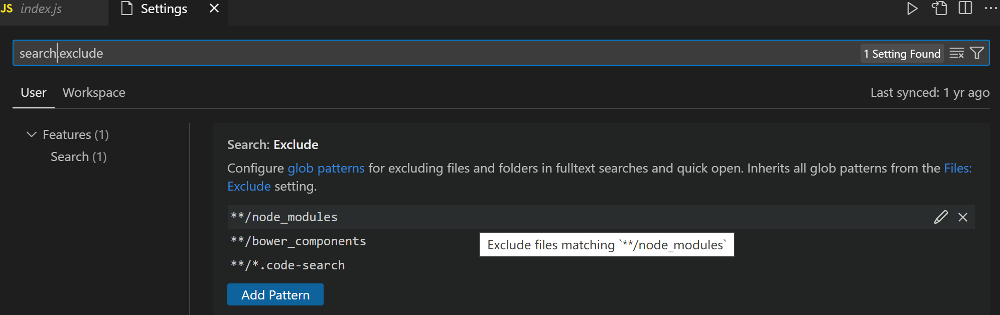

按照[🐛 BUG 执行删除国际化命令报错 · Issue \#10452 · ant\-design/ant\-design\-pro](https://github.com/ant-design/ant-design-pro/issues/10452#issuecomment-1359714910)注释

```json
  env: {
    browser: true,
    node: true,
    //es2022: true,
    jest: true
  },
```

##### Bug之消失的菜单

[🐛 BUG npm run i18n\-remove移除国际化，左侧导航栏消失 · Issue \#10602 · ant\-design/ant\-design\-pro 代码](https://github.com/ant-design/ant-design-pro/issues/10602#issuecomment-1463605324)


## 后端项目初始化

使用后端项目模板

### 修改配置文件

#### 连接数据库

密码改成对应的, 并连接上本地的mysql

打开 create_table.sql ，选 target database 后，执行sql

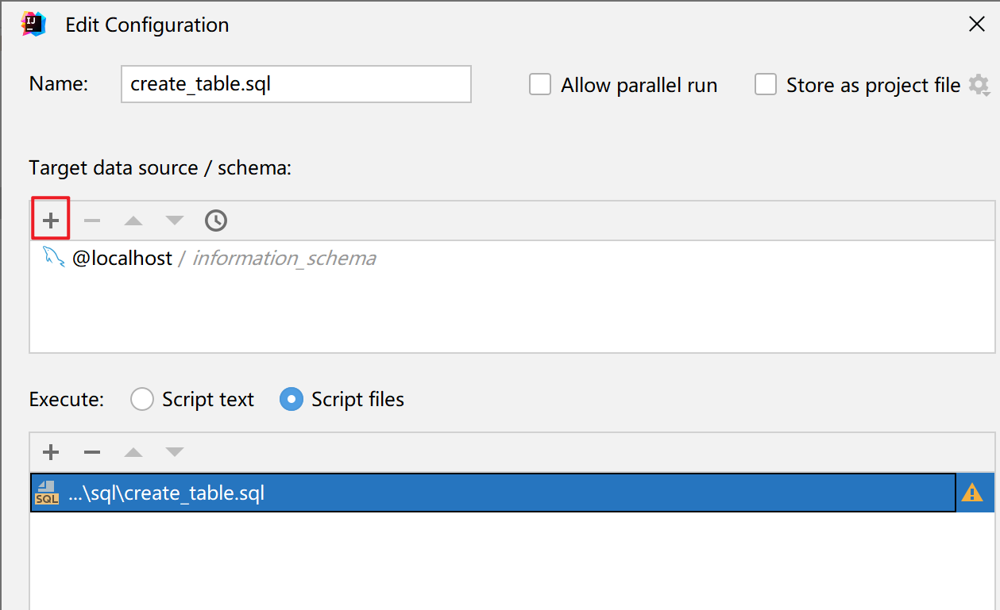

##### IDEA右侧数据库栏不显示数据库

可能是没打勾

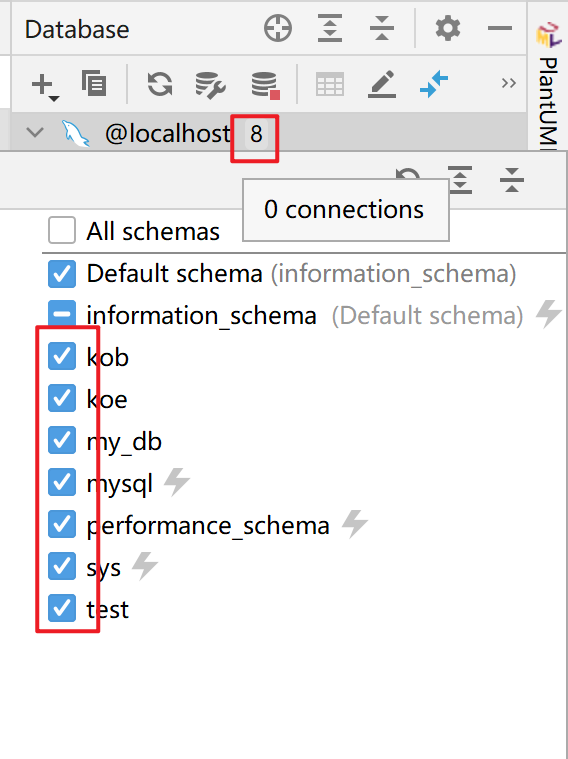

#### 运行

com/yupi/springbootinit/MainApplication.java

运行报错？


暂时不管会怎么样？

[接口文档](http://localhost:8101/api/doc.html#/home)

>   Person: 
>   - 我听后端课的时候听到Spring项目接口文档是knife4j加上swagger生成的，能分别介绍一下吗
>
>   ChatGPT: 
>   - 当然，下面我将分别介绍Swagger和knife4j，它们常用于Spring项目中生成和管理API文档。
>   ### Swagger
>
>   Swagger是一款流行的API开发工具，它可以用于API的设计、构建、文档化和测试。 
>   1. **文档化** ：Swagger通过解析代码中的注解，自动生成可视化的API文档。这些文档描述了每个API的路径、请求方法、参数、返回值等。 
>   2. **可视化界面** ：Swagger提供了一套可视化界面，使开发人员和使用者能够在浏览器中直接与API进行交互和测试。 
>   3. **兼容性** ：Swagger文档遵循OpenAPI规范，因此与许多其他工具兼容。 
>   4. **集成** ：在Spring项目中，可以通过集成Swagger库（例如`springfox-swagger2`）来快速启用Swagger文档支持。
>   ### knife4j
>
>   knife4j是一款提供了比Swagger-UI更丰富特性和更友好用户体验的API文档生成工具，专为Spring Boot项目定制。 
>   1. **更友好的界面** ：knife4j提供了一套更现代、更友好的API文档界面。 
>   2. **文档离线化** ：knife4j支持将API文档导出为离线HTML文档，方便在没有网络的环境下查看。 
>   3. **增强功能** ：与Swagger相比，knife4j提供了一些增强功能，如自定义全局参数、请求参数前置设置等。 
>   4. **兼容性** ：knife4j与Swagger的注解完全兼容，因此可以轻松地从Swagger迁移到knife4j，或者同时使用两者。
>
>   总体来说，Swagger是API开发和文档化的通用解决方案，而knife4j则是为Spring Boot项目提供的更加专业和友好的API文档工具。两者可以单独使用，也可以结合使用，以提供更强大和灵活的API文档支持。

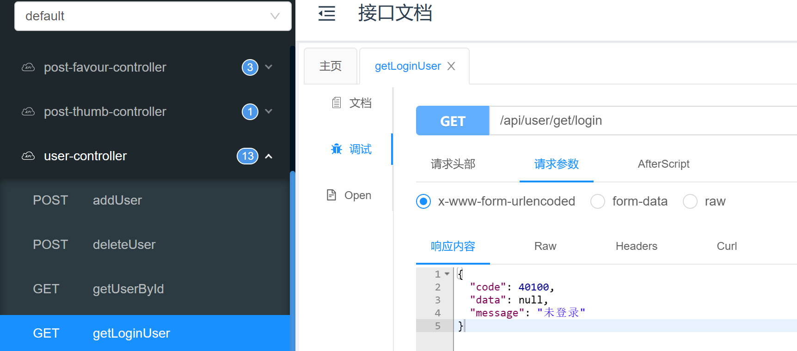

提示接口报错，需注册一个新用户

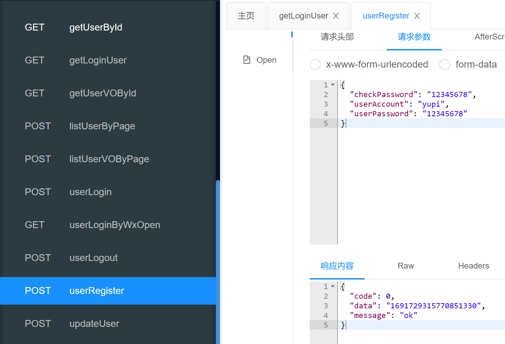

返回的

```
  "data": "1691729315770851330",
```

是新用户的ID

在 userLogin 登录

```json
{
  "code": 0,
  "data": {
    "id": "1691729315770851330",
    "userName": null,
    "userAvatar": null,
    "userProfile": null,
    "userRole": "user",
    "createTime": "2023-08-16T08:31:14.000+00:00",
    "updateTime": "2023-08-16T08:31:14.000+00:00"
  },
  "message": "ok"
}
```

还可以通过api 创建、接受帖子

### 系统的库表设计

#### 用户表

```json
-- 用户表
create table if not exists user
(
    id           bigint auto_increment comment 'id' primary key,
    userAccount  varchar(256)                           not null comment '账号',
    userPassword varchar(512)                           not null comment '密码',
    userName     varchar(256)                           null comment '用户昵称',
    userAvatar   varchar(1024)                          null comment '用户头像',
    userRole     varchar(256) default 'user'            not null comment '用户角色：user/admin/ban',
    createTime   datetime     default CURRENT_TIMESTAMP not null comment '创建时间',
    updateTime   datetime     default CURRENT_TIMESTAMP not null on update CURRENT_TIMESTAMP comment '更新时间',
    isDelete     tinyint      default 0                 not null comment '是否删除',
    index idx_userAccount (userAccount)
) comment '用户' collate = utf8mb4_unicode_ci;
```


#### 图表信息表

```json
-- 图表信息表chart
create table if not exists chart
(
    id					bigint auto_increment comment 'id' primary key,
    goal				text null comment '分析目标',
    chartData			text null comment '图表数据',
    charType			varchar(128) null comment '图表类型',
    genChart			text null comment '生成的图表数据',
    genResult			text null comment '生成的分析结论',
    createTime   datetime     default CURRENT_TIMESTAMP not null comment '创建时间',
    updateTime   datetime     default CURRENT_TIMESTAMP not null on update CURRENT_TIMESTAMP comment '更新时间',
    isDelete     tinyint      default 0                 not null comment '是否删除'
) comment '图表信息表' collate = utf8mb4_unicode_ci;

```


数据库可能小写比较好，但是这里使用驼峰式，方便开发，可以直接根据表名生成CRUD代码


这里记得上下改一下

```sql
-- 创建库
create database if not exists yubi;

-- 切换库
use yubi;
```

最后重新执行sql脚本

[Init backend and change sql script · youhuangla/ChatBI@a395952](https://github.com/youhuangla/ChatBI/commit/a395952fddf90f1f2552091b5a81a3d3813eb703)

脚本中数据库表名写错了，同步一下

[Change 'charts' in sql script to 'chart' · youhuangla/ChatBI@a8a629b](https://github.com/youhuangla/ChatBI/commit/a8a629b4ead896141056f7df0a55ffe41bb5b1bc)


src/main/resources/application.yml 中datasource 的名字也要改为yubi

```
  datasource:
    driver-class-name: com.mysql.cj.jdbc.Driver
    url: jdbc:mysql://localhost:3306/yubi
    username: root
    password: 123456

```

[Change url of Datasource to 'yubi' in application\.yml · youhuangla/ChatBI@a2fce01](https://github.com/youhuangla/ChatBI/commit/a2fce01982ca8a5b8f48542edbaa0bacac8806a7)


#### 自动生成后端CRUD代码

安装 MyBatisX 扩展插件

1.   建表
2.   mybatisX插件生成代码
3.   迁移生成的代码
4.   复制老的增删改查模板，根据自己的表重构
5.   根据接口文档来测试

##### mybatisX插件生成代码

右键选中 yubi 数据库中的两个表，选择该插件 mybatisX-Generater

重构项目名

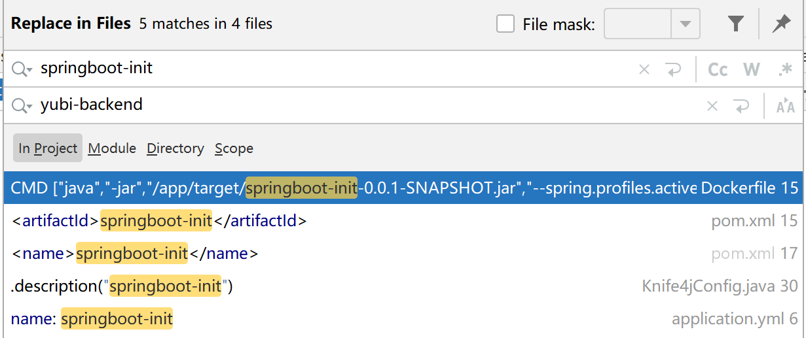

在 pom.xml 中找到`<name>` 全局查找并全部替换

[Refract name of project from 'spring\-init' to 'yubi\-backend' in 5 places · youhuangla/ChatBI@ff2d262](https://github.com/youhuangla/ChatBI/commit/ff2d2626b53aa3622433fd85a52715b0027db01b)

暂时不替换包名，因为影响比较大

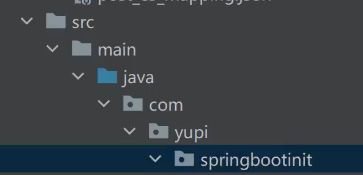

>   Person: 
>   - 在idea中右键表，选择mybatisX-Generater然后里面的generate options的module path的作用
>
>   ChatGPT: 
>   - 在 IntelliJ IDEA 中使用 MyBatisX-Generater 插件时，"generate options" 中的 "module path" 选项通常用于指定生成的代码应放置的模块路径。
>
>   以下是这个选项的一些详细解释： 
>   1. **模块化的项目结构** ：在一个包含多个模块的项目中，你可能想要为特定模块生成代码。通过设置 "module path"，你可以确保生成的代码被放置在正确的模块目录中。 
>   2. **生成路径定位** ：此选项有助于插件精确地确定生成的代码应放置在哪里。这使得代码结构更加清晰，也方便你在项目中找到新生成的代码。 
>   3. **依赖管理** ：在某些情况下，将生成的代码放置在特定的模块中有助于更好地管理项目的依赖关系。例如，你可能希望将所有与数据库交互的代码放在一个单独的模块中，以便更好地控制与其他项目部分的耦合。
>
>   总的来说，"module path" 选项在 MyBatisX-Generater 插件中主要用于精确控制代码生成的位置，有助于更好地组织和管理你的项目结构。

module path 最后选择了`E:/github/ChatBI/ChatBI/yubi-backend`

新版插件没有bug，但是options多了Model，一开始保险起见没选，但是——

这里要选Model！！！否则generator的文件夹中没有domain！

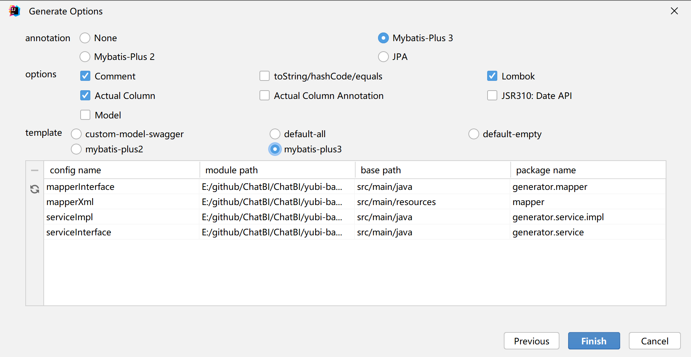

生成了 src/main/java/generator 

下面的步骤都是在左侧目录直接拖动，否则粘贴的话IDE无法重构

并将yubi-backend/src/main/java/generator/mapper 中两个文件粘贴到 src/main/java/com/yupi/springbootinit/mapper 里，然后Refractor（里面有重名文件会导致移不过去，先删了原来的yubi-backend/src/main/java/com/yupi/springbootinit/mapper/UserMapper.java）

yubi-backend/src/main/java/generator/service/ChartService.java 移到 yubi-backend/src/main/java/com/yupi/springbootinit/service 中


将yubi-backend/src/main/java/generator/domain中的Chart和User

移到 yubi-backend/src/main/java/com/yupi/springbootinit/model/entity  


总之将所有生成的model移入对应的文件夹，并替换原来的文件


如不明白可以看星球用户中心项目

##### 更改entity中的User, Chart.java

@TableId 注解中 AUTO 不安全，递增数列(1, 2, 3 ,......)，改成ASSIGN_ID


`@TableLogic` 加在isDelete前

两个文件都要改，改完报错

```bash
E:\github\ChatBI\ChatBI\yubi-backend\src\main\java\com\yupi\springbootinit\service\impl\UserServiceImpl.java:129:21
java: 找不到符号
  符号:   方法 setUnionId(java.lang.String)
  位置: 类型为com.yupi.springbootinit.model.entity.User的变量 user
```

[Change User,Chart\.java in entity dir · youhuangla/ChatBI@d9e51f0](https://github.com/youhuangla/ChatBI/commit/d9e51f081f16dab451722e0fe2e66ab44439b108)

yubi-backend/src/main/java/com/yupi/springbootinit/service/impl/UserServiceImpl.java集成的第三方登录用不掉可以删除

```java
    @Override
    public LoginUserVO userLoginByMpOpen(WxOAuth2UserInfo wxOAuth2UserInfo, HttpServletRequest request) {
......
        }
    }

```

之后记得删除yubi-backend/src/main/java/com/yupi/springbootinit/service/UserService.java中对应的接口

删除wxmp，微信公众号开发包，把报错解决（删除）

跑通

[Delete userLoginByMpOpen and wxmp, run succeed · youhuangla/ChatBI@e3caf6e](https://github.com/youhuangla/ChatBI/commit/e3caf6e8e0876227669df63070bd95bcb8d1a4f2)

2:40 上面的都不用自己手动搞，下播之后可以直接拉模板


把 yubi-backend/src/main/java/com/yupi/springbootinit/controller/PostController.java 复制为同目录下的 ChartController，并更改文件名

增加 userId

```sql
-- 图表信息表chart
create table if not exists chart
(
    id					bigint auto_increment comment 'id' primary key,
    goal				text null comment '分析目标',
    chartData			text null comment '图表数据',
    charType			varchar(128) null comment '图表类型',
    genChart			text null comment '生成的图表数据',
    genChart			text null comment '生成的分析结论',
    userId				bigint null comment '创建用户 id',
    createTime   datetime     default CURRENT_TIMESTAMP not null comment '创建时间',
    updateTime   datetime     default CURRENT_TIMESTAMP not null on update CURRENT_TIMESTAMP comment '更新时间',
    isDelete     tinyint      default 0                 not null comment '是否删除',
) comment '图表信息表' collate = utf8mb4_unicode_ci;

```

使用 [Generate All Getter And Setter \- IntelliJ IDEs Plugin \| Marketplace](https://plugins.jetbrains.com/plugin/18969-generate-all-getter-and-setter) 获取get方法

```
{
  "charType": "[{\"月份\": 6}]",
  "chartData": "柱状图",
  "goal": "我想要分析网站近一年的用户增长趋势"
}
```


[Finish initialize backend · youhuangla/ChatBI@9544e99](https://github.com/youhuangla/ChatBI/commit/9544e9944a5ad357d266639314d8737c2fc61baa)

## 前端调用后端


前端生成接口文档代码

http://localhost:8101/api/doc.html


yubi-frontend\config\config.ts 中改成接口文档地址（这里是错的，下面还要改）

```
      schemaPath: "http://localhost:8101/api/doc.html",
```


openAPI 是 ant-design-pro 提供根据后端的接口文档自动生成前端CRUD代码的工具

yubi-frontend\package.json 中安装 openAPI

```
        const { info } = openAPIData;
                ^

TypeError: Cannot destructure property 'info' of 'openAPIData' as it is null.
    at new ServiceGenerator (E:\github\ChatBI\ChatBI\yubi-frontend\node_modules\@umijs\openapi\dist\serviceGenerator.js:196:17)
    at E:\github\ChatBI\ChatBI\yubi-frontend\node_modules\@umijs\openapi\dist\index.js:71:30
    at Generator.next (<anonymous>)
    at fulfilled (E:\github\ChatBI\ChatBI\yubi-frontend\node_modules\tslib\tslib.js:166:62)
    at processTicksAndRejections (node:internal/process/task_queues:96:5)
Waiting for the debugger to disconnect...
```

不是这个地址，应该是一个json格式的数据，swagger模型的地址

>   Person: 
>   - 前端中swagger模型的地址指的是什么？
>
>   ChatGPT: 
>   - Swagger 是一个用于构建、描述、和文档化 RESTful API 的工具集。在前端与后端交互的过程中，Swagger 能够提供一个清晰、结构化的界面来展示 API 的细节。
>
>   在 Swagger 中，"模型的地址"通常指的是一个特定模型的引用或定位。模型（Model）在 Swagger 中代表了 API 操作中使用的数据结构，如请求体和响应体的格式。模型的地址可以指向一个特定的模型定义，让开发者和使用者更容易理解 API 的工作方式。
>
>   这个地址可能是一个 URI，指向模型的具体定义，或者是一个 JSON 引用，连接到特定的模型结构。通过这个地址，可以快速查看和理解该模型的详细信息，如属性、类型、必需字段等。
>
>   总体来说，模型的地址有助于提供一种组织和引用 API 中使用的各种数据结构的方式，使得开发、测试和维护工作更加便捷和高效。

在开发人员工具中选择网络

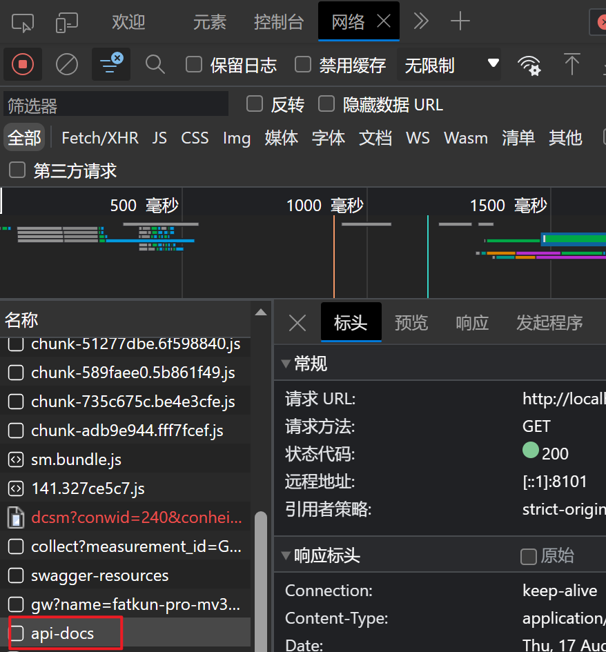

找到api-docs选项，网址打开后头为

```
{"swagger":"2.0","info":{"description":"springboot-init","version":"1.0","title":"接口文档"},"host":"localhost:8101","tags":[{"name":"file-controller","description":"File Controller"},
```

http://localhost:8101/api/v2/api-docs

```powershell
PS E:\github\ChatBI\ChatBI\yubi-frontend> npm run openapi
npm WARN config global `--global`, `--local` are deprecated. Use `--location=global` instead.
Debugger attached.

> ant-design-pro@6.0.0 openapi
> max openapi

Debugger attached.
😄 Hello PRO
info  - [你知道吗？] 需要添加全局 React Context 吗？在 src/app.(ts|tsx) 运行时配置中轻
松解决，详见 https://umijs.org/docs/api/runtime-config
Using openapi Plugin
[openAPI]: 💺 将 Swagger 转化为 openAPI
[openAPI]: ✅ 成功生成 service 文件
info  - [plugin: @umijs/max-plugin-openapi] [openAPI]: execution complete
Waiting for the debugger to disconnect...
```

[Change path in config\\\.js to api\\\-docs json path and choose 'openapi'… · youhuangla/ChatBI@59f7370](https://github.com/youhuangla/ChatBI/commit/59f7370156616137639f4af24813dfc693462c7f)

以 start:dev 启动，有默认的端口

后端：我这里用8000端口，视频中使用8182端口

yubi-frontend\src\app.tsx中,前端更改对应的请求地址，修改request.baseURL：

```typescript
export const request = {
  baseURL: 'http://localhost:8101',
  ...errorConfig,
};
```

[Change path in config\\\.js to api\\\-docs json path and choose 'openapi'… · youhuangla/ChatBI@59f7370](https://github.com/youhuangla/ChatBI/commit/59f7370156616137639f4af24813dfc693462c7f)

。。。之前几次push好像没`add .`,前几个commit好像少了文件


```

```


第二期
。
前端模板优化
·
前端登录功能开发
·智能分析业务流程讲解
·智能分析接口开发(Ecel数据处理、AI网站、玩法技巧分享)
程导防知