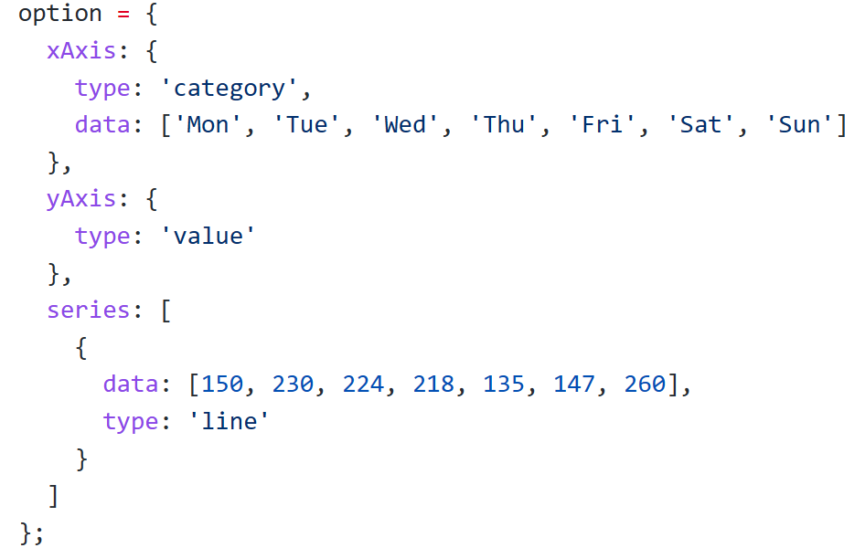
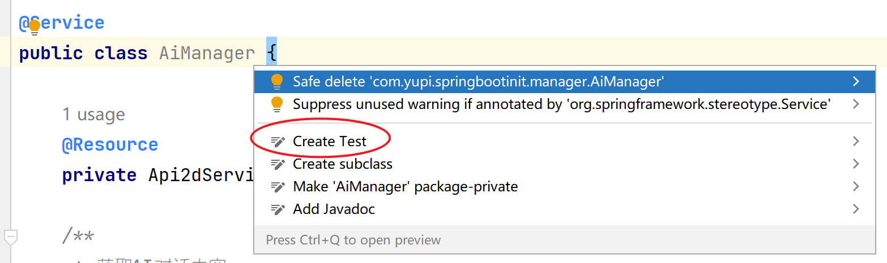
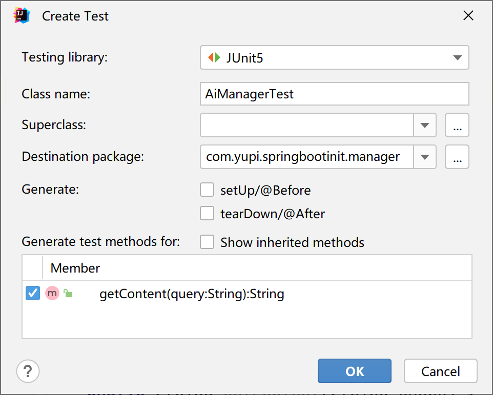
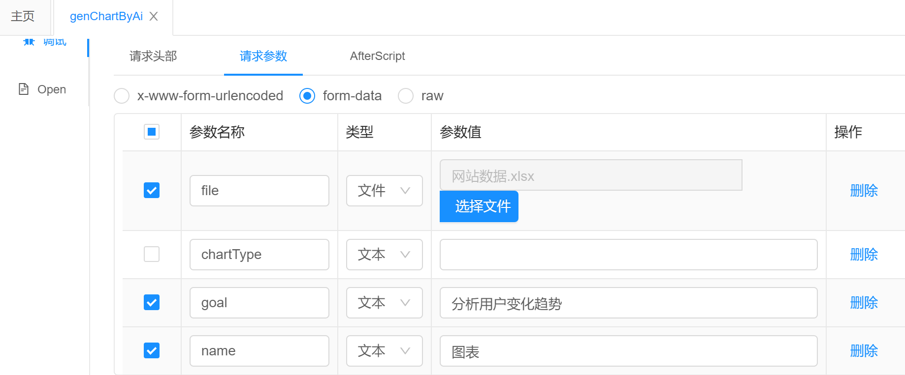
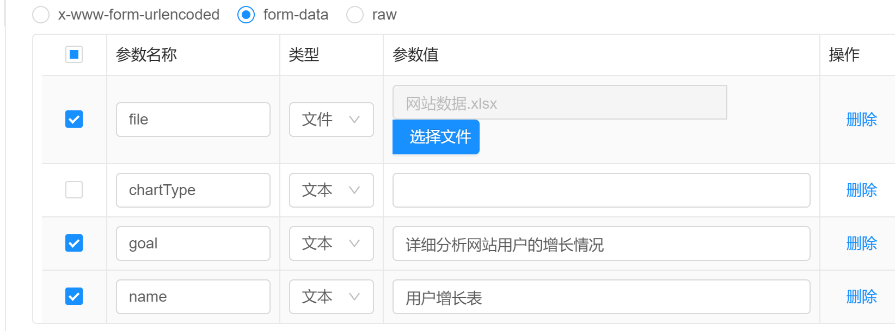
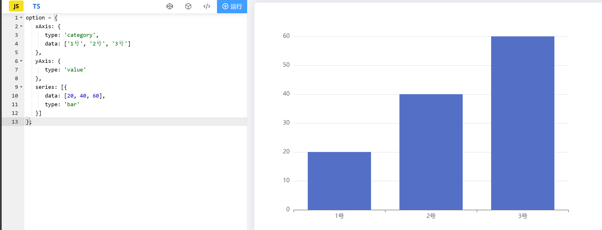
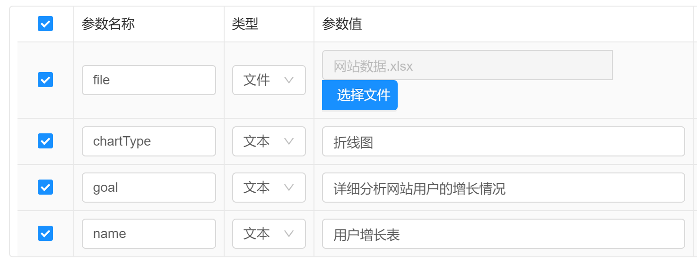
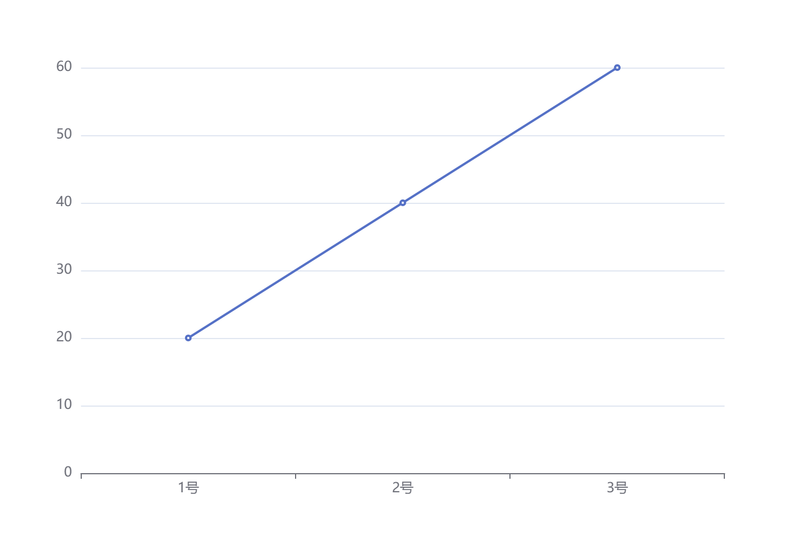
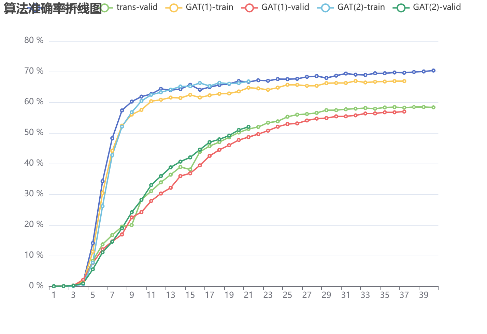
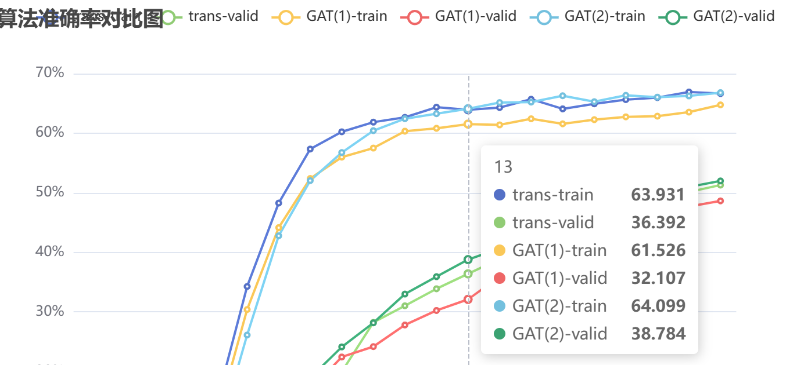

# 第三期

## 计划

1.   跑通整个智能分析功能的业务流程30min
     1.   后端
     2.   前端
2.   开发图表管理功能30min
3.   系统优化30min

## 生成图表

A!无法直接生成现成的图表，但是A!可以生成图表代码=>可以把代码利用前端的组件库(Echarts)在网页进行展示

echarts支持在线调试：[Examples - Apache ECharts](https://echarts.apache.org/examples/zh/editor.html?c=line-simple)

预期生成的图表代码：




## AI 提问技巧

如果想要让A!更好地理解我们的输入，给我们预期的、精确格式的输出，我们就需要严格控制咱们的提问词。

1.   使用系统预设
2.   控制输入格式（便于A!精确地理解我们的需求）
3.   控制输出格式（便于A!返回的内容能够更加方便地为我们所用）
4.   指定一个示例问答，one-shot（一轮问答）或者few-shot（多轮）

### 使用系统预设


### 控制输入格式

比如：

```
你是一个数据分析师和前端开发专家，接下来我会按照以下固定格式给你提供内容：

分析需求：

{数据分析的需求或者目标}

原始数据：

{csv格式的原始数据，用，作为分隔符}

请根据以上内容，帮我生成数据分析结论和可视化图表代码
```


```
你是一个数据分析师和前端开发专家，接下来我会按照以下固定格式给你提供内容：
分析需求：
{数据分析的需求或者目标}
原始数据：
{csv格式的原始数据，用，作为分隔符}
请根据这两部分内容，按照以下指定格式生成内容（此外不要输出任何多余的开头、结尾、注释）
【【【【【
{前端Echarts V5的option配置对象js代码，合理地将数据进行可视化，不要生成任何多余的内容，比如注释}
【【【【【
{明确的数据分析结论、越详细越好，不要生成多余的注释}
```


## 调用AI的方式

### 1、直接调用OpenAl或者其他AI原始大模型官网的接口

官方文档：[API Reference \- OpenAI API](https://platform.openai.com/docs/api-reference)

优点：不经封装，最灵活，最原始

缺点：要钱、要魔法

本质上OpenAl就是提供了HTTP接口，我们可以用任何语言去调用

1.在请求头中指定OPENAI API KEY

`Authorization: Bearer OPENAI_API_KEY`

2.找到你要使用的接口，比如Al对话接口：https://api.openai.com/v1/chat/completions

[Create chat completion](https://platform.openai.com/docs/api-reference/chat/create)


3.按照接口文档的示例，构造HTTP请求，比如用Hutool工具类、或者HTTPClient

[聊天接口 /v1/chat/completions \- API2D](https://api2d-doc.apifox.cn/)

[Imply a GPT demo using api2d · youhuangla/ChatBI@eb8ba63](https://github.com/youhuangla/ChatBI/commit/eb8ba63f2b4f77b3580baba8d96cef6b28b2a0e1)

```
PS C:\Users\Administrator\Desktop> setx API2D_api_key "fk......"

成功: 指定的值已得到保存。
```


[Imply api2d demo 's extract content · youhuangla/ChatBI@aff9768](https://github.com/youhuangla/ChatBI/commit/aff976820c0a5a81beb8a3c8230228a58ae79284)


```
Extracted content: 当年有个富豪，生意做得风生水起，但是他每天都感到很郁闷。于是他找了各种心理医生、心理咨询师来帮助他，可是都不见效果。

最后，有一位特别有名的心理咨询师说可以帮助他。那位咨询师对他说：“你需要一个橙子。”那个富豪觉得很奇怪，但是他还是去买了一个橙子回来。

心理咨询师告诉他：“你需要把那个橙子挂在门把上。”富豪觉得更加奇怪了，但还是按照咨询师的指示挂上。然后咨询师对他说：“你需要大声喊道：‘给我一块布！’”

这个时候，富豪已经完全摸不着头脑了，但是他还是照着做。摇了一下门把，大声喊着：“给我一块布！”

橙子在风中摇晃，但是什么也没有发生。

咨询师看着富豪说：“你看，就是这么简单，你现在已经不郁闷了吧。”

富豪瞪大眼睛：“你这是什么玩意儿？请问这个橙子挂在门把上有什么用？大声喊‘给我一块布！’又有什么用？”

心理咨询师笑着说：“你看，你已经不郁闷了，所以这个方法是有效的。我只是想告诉你，有时候解决问题并不一定非要用理性的思考和复杂的方法，有时候，简单而愚蠢的方法可能会效果更好。”
```


### 2、使用云服务商提供的，封装后的AI接口

比如：Azure云

优点：本地都能用

缺点：依然要钱，而且可能比直接调用原始的接口更贵


### 使用api2d

### 生成测试方法



与原视频不同



[Imply service and interface of api and test successfully · youhuangla/ChatBI@0fa2d38](https://github.com/youhuangla/ChatBI/commit/0fa2d38e8a222c7fb2276140f091319c5c08a8ea)

```
邓紫棋是一位来自中国的流行歌手和词曲创作人。她的真名是邓诗颖，出生于1991年5月16日，来自广东深圳。邓紫棋在2010年通过音乐节目《中国好声音》出道，并以独特的音乐风格和深情的演唱方式赢得了众多粉丝的喜爱。她的音乐作品跨越多种流派，包括流行、R&B、摇滚等，深受年轻人的喜爱。邓紫棋曾多次获得各种音乐奖项，包括亚洲音乐节最佳歌手、最佳专辑等。她的代表歌曲包括《泡沫》、《光年之外》、《倒数》等。邓紫棋不仅在中国乐坛有很高的知名度，也在国际舞台上活跃，与多位国际音乐人合作，展现了她的音乐才华和国际影响力。

```

### 加入角色设定功能

**You:**

Request body
model
string
Required
ID of the model to use. See the model endpoint compatibility table for details on which models work with the Chat API.

messages
array
Required
A list of messages comprising the conversation so far. Example Python code.


Hide Properties
role
string
Required
The role of the messages author. One of system, user, assistant, or function.

content
string or null
Required
The contents of the message. content is required for all messages, and may be null for assistant messages with function calls.

name
string
Optional
The name of the author of this message. name is required if role is function, and it should be the name of the function whose response is in the content. May contain a-z, A-Z, 0-9, and underscores, with a maximum length of 64 characters.

function_call
object
Optional
The name and arguments of a function that should be called, as generated by the model. 结合上文解释这段话

* * *

**ChatGPT:**

好的，这段文档描述了 OpenAI GPT-3 API 的请求体的结构和所需字段。以下是对这段话的解释：

* **model (string, 必须)**：用于指定要使用的模型的ID。文档提到了一个“模型端点兼容性表”，这可能是一个表格，列出了哪些模型与 Chat API 兼容。
  
* **messages (数组, 必须)**：这是一个消息数组，它记录了到目前为止的对话内容。这里提到了一个Python代码示例，但在您给出的内容中未给出具体代码。
  
    每个消息对象都有以下属性：
    
    * **role (string, 必须)**：消息作者的角色。可以是以下之一：
      
        * `system`：通常用于给定对话的上下文或说明助手的行为。
        * `user`：用户发送的消息。
        * `assistant`：助手的回复。
        * `function`：用于特定功能的调用。
    * **content (string 或 null, 必须)**：消息的内容。对于所有消息，`content` 字段都是必须的。但如果是助手的函数调用消息，则 `content` 可以为null。
      
    * **name (string, 可选)**：消息作者的名字。如果 `role` 是 `function`，则 `name` 字段是必须的，并且应该是函数的名称，函数的响应将在 `content` 中。名字可以包含字母、数字和下划线，最大长度为64个字符。
      
    * **function_call (对象, 可选)**：模型生成的应该被调用的函数的名称和参数。这可能是一个高级功能，让模型可以生成并调用特定的函数。
      

结合上文，这意味着您可以通过这个 API 与模型进行对话，并根据需要在对话中插入系统、用户、助手或函数的消息。您可以使用这些消息来引导模型的行为，获取特定的回复，或调用模型生成的函数。

* * *

**You:**

我想设定
```
你是一个数据分析师和前端开发专家，接下来我会按照以下固定格式给你提供内容：
分析需求：
{数据分析的需求或者目标}
原始数据：
{csv格式的原始数据，用，作为分隔符}
请根据这两部分内容，按照以下指定格式生成内容（此外不要输出任何多余的开头、结尾、注释）
【【【【【
{前端Echarts V5的option配置对象js代码，合理地将数据进行可视化，不要生成任何多余的内容，比如注释}
【【【【I
{明确的数据分析结论、越详细越好，不要生成多余的注释}
``` 该如何填写各个字段？

* * *

**ChatGPT:**

按照您提供的固定格式，我们可以使用以下方式来配置OpenAI GPT-3的请求体：

```json
{
    "model": "gpt-3.5-turbo",
    "messages": [
        {
            "role": "system",
            "content": "你是一个数据分析师和前端开发专家。"
        },
        {
            "role": "user",
            "content": "分析需求：\n{数据分析的需求或者目标}\n原始数据：\n{csv格式的原始数据，用，作为分隔符}"
        }
    ]
}
```

当您在实际应用中使用时，需要替换 `{数据分析的需求或者目标}` 和 `{csv格式的原始数据，用，作为分隔符}` 这两个占位符为实际的内容。

模型的返回内容应该符合您所期望的格式，但请注意，由于这是一个自由文本生成模型，可能需要对生成的内容进行后处理或验证，以确保其满足您的确切需求。

此外，考虑到GPT-3模型可能对Echarts V5的具体API细节不太熟悉，您可能需要在使用模型生成的代码之前进行一些调整。如果您需要更为精确的代码生成，建议您使用一个专门为此目的训练的代码生成模型或者使用专门的工具/库来辅助生成前端的Echarts配置。

* * *

**You:**

```

package com.yupi.springbootinit.api;

import cn.hutool.http.HttpRequest;
import cn.hutool.http.HttpResponse;
import cn.hutool.json.JSONUtil;
import cn.hutool.json.JSONObject;
import com.yupi.springbootinit.service.ApiService;
import org.springframework.stereotype.Service;

import java.util.HashMap;
import java.util.Map;

@Service
public class Api2dServiceImpl implements ApiService {

    private static final String URL = "https://oa.api2d.net/v1/chat/completions";
    
    public String getContentFromApi(String contentQuery) {
        // 创建请求体
        Map&lt;String, Object&gt; bodyMap = new HashMap&lt;&gt;();
        bodyMap.put("model", "gpt-3.5-turbo");
        Map&lt;String, String&gt; message = new HashMap&lt;&gt;();
        message.put("role", "user");
        message.put("content", contentQuery);
        bodyMap.put("messages", new Map[]{message});
        bodyMap.put("safe_mode", false);
    
        String jsonBody = JSONUtil.toJsonStr(bodyMap);
        String api2d_api_key = System.getenv("API2D_API_KEY");
    
        // 发送请求
        HttpResponse response = HttpRequest.post(URL)
                .header("Authorization", "Bearer " + api2d_api_key)
                .header("User-Agent", "Apifox/1.0.0 (https://apifox.com)")
                .header("Content-Type", "application/json")
                .body(jsonBody)
                .timeout(0)  // 设置超时时间为无限
                .execute();
    
        if (response.isOk()) {
            JSONObject jsonObject = JSONUtil.parseObj(response.body());
            return jsonObject.getJSONArray("choices").getJSONObject(0).getJSONObject("message").getStr("content");
        } else {
            return "请求失败，状态码：" + response.getStatus();
        }
    }
}

```

如何更改这段代码使得我能使api作为数据分析师？

* * *

**ChatGPT:**

您想将这段代码调整为按照您提供的数据分析师的格式与API进行交互。以下是一些建议的修改：

1. 在请求体中加入“system”消息，用于设置模型的身份为数据分析师和前端开发专家。
2. 适当调整请求体结构以适应上述格式。

下面是修改后的代码：

```java
package com.yupi.springbootinit.api;

import cn.hutool.http.HttpRequest;
import cn.hutool.http.HttpResponse;
import cn.hutool.json.JSONUtil;
import cn.hutool.json.JSONObject;
import com.yupi.springbootinit.service.ApiService;
import org.springframework.stereotype.Service;

import java.util.HashMap;
import java.util.Map;

@Service
public class Api2dServiceImpl implements ApiService {

    private static final String URL = "https://oa.api2d.net/v1/chat/completions";

    public String getContentFromApi(String analysisRequirement, String csvData) {
        // 创建请求体
        Map<String, Object> bodyMap = new HashMap<>();
        bodyMap.put("model", "gpt-3.5-turbo");

        Map<String, String> systemMessage = new HashMap<>();
        systemMessage.put("role", "system");
        systemMessage.put("content", "你是一个数据分析师和前端开发专家。");

        Map<String, String> userMessage = new HashMap<>();
        userMessage.put("role", "user");
        userMessage.put("content", "分析需求：\n" + analysisRequirement + "\n原始数据：\n" + csvData);

        bodyMap.put("messages", new Map[]{systemMessage, userMessage});
        bodyMap.put("safe_mode", false);

        String jsonBody = JSONUtil.toJsonStr(bodyMap);
        String api2d_api_key = System.getenv("API2D_API_KEY");

        // 发送请求
        HttpResponse response = HttpRequest.post(URL)
                .header("Authorization", "Bearer " + api2d_api_key)
                .header("User-Agent", "Apifox/1.0.0 (https://apifox.com)")
                .header("Content-Type", "application/json")
                .body(jsonBody)
                .timeout(0)  // 设置超时时间为无限
                .execute();

        if (response.isOk()) {
            JSONObject jsonObject = JSONUtil.parseObj(response.body());
            return jsonObject.getJSONArray("choices").getJSONObject(0).getJSONObject("message").getStr("content");
        } else {
            return "请求失败，状态码：" + response.getStatus();
        }
    }
}
```

在上面的代码中，我已经根据您的要求进行了调整。现在，当您调用 `getContentFromApi` 函数并提供 `analysisRequirement` (分析需求) 和 `csvData` (CSV格式的原始数据)，它将构造适当的请求体并与API进行交互。

注意：您可能还需要进行其他调整，以确保代码与您的其他应用组件无缝集成。

* * *

[Imply api role to 'Data Analyst' and refract to 'Api2dDataAnalystServ… · youhuangla/ChatBI@bf8c5cb](https://github.com/youhuangla/ChatBI/commit/bf8c5cb032c2088e0a47f9dc970771adafb5cd38)

```java
class AiManagerTest {
    @Resource
    private AiManager aiManager;

    @Test
    void doChat() {
        String answer = aiManager.doChat("你是？");
        System.out.println(answer);
    }
}
```


```
我是一个数据分析师和前端开发专家。根据你提供的原始数据字段是csvData。
```

TODO: 传递csvData


[接口文档](http://localhost:8101/api/doc.html#/home)

[BUG: csvData not sent · youhuangla/ChatBI@c35b962](https://github.com/youhuangla/ChatBI/commit/c35b96246d9fe24146e366393a8242d283b168b9)



api接口文档网站：

```json
{
  "code": 0,
  "data": {
    "genChart": "\n{\n  title: {\n    text: '用户变化趋势',\n    x: 'center'\n  },\n  xAxis: {\n    type: 'category',\n    data: ['1号', '2号', '3号']\n  },\n  yAxis: {\n    type: 'value'\n  },\n  series: [{\n    data: [20, 40, 60],\n    type: 'line'\n  }]\n}\n",
    "genResult": "\n根据数据分析，用户数的变化趋势为逐日增长。从1号到3号，用户数分别为20、40和60。可以看出用户数呈现较为稳定的增长趋势。"
  },
  "message": "ok"
}
```

控制台print调试：

```bash
User: 
分析需求：
分析用户变化趋势
原始数据：
日期,用户数
1号,20
2号,40
3号,60


ChatGPT: 
【【【【【
{
  title: {
    text: '用户变化趋势',
    x: 'center'
  },
  xAxis: {
    type: 'category',
    data: ['1号', '2号', '3号']
  },
  yAxis: {
    type: 'value'
  },
  series: [{
    data: [20, 40, 60],
    type: 'line'
  }]
}
【【【【【
根据数据分析，用户数的变化趋势为逐日增长。从1号到3号，用户数分别为20、40和60。可以看出用户数呈现较为稳定的增长趋势。
```

[Imply get csvData\. TODO: set chartType · youhuangla/ChatBI@01abfe7](https://github.com/youhuangla/ChatBI/commit/01abfe7b312f850684de89681bbe64672dac70b1)

## 智能接口实现

1.   构造用户请求（用户消息、csv数据、图表类型）
2.   调用鱼聪明sdk,得到A|响应结果
3.   从AI响应结果中，取出需要的信息
4.   保存图表到数据库


### 实现登录访问，拼接分析目标，保存csvData到数据库

#### 测试未登录，未填写图表类型



由于没有填写chartType，报错

```json
{
  "code": 50000,
  "data": null,
  "message": "AI 生成错误"
}
```

```
User: 
分析需求：
详细分析网站用户的增长情况
原始数据：
日期,用户数
1号,20
2号,40
3号,60


ChatGPT: 
【【【【【
{
   xAxis: {
      type: 'category',
      data: ['1号', '2号', '3号']
   },
   yAxis: {
      type: 'value'
   },
   series: [{
      data: [20, 40, 60],
      type: 'bar'
   }]
}
】】】】】
用户数随着日期的增加呈线性增长趋势，从1号到3号用户数分别为20、40和60，即每天增加20个用户。
2023-09-12 11:08:00.947 ERROR 3588 --- [0.0-8101-exec-1] c.y.s.exception.GlobalExceptionHandler   : BusinessException

com.yupi.springbootinit.exception.BusinessException: AI 生成错误
```

这里“AI 生成错误”报错，原因是由于中文“【【【【【”变成了“】】】】】”

可以在[Examples - Apache ECharts](https://echarts.apache.org/examples/zh/editor.html?c=line-simple)中用

```
{
   xAxis: {
      type: 'category',
      data: ['1号', '2号', '3号']
   },
   yAxis: {
      type: 'value'
   },
   series: [{
      data: [20, 40, 60],
      type: 'bar'
   }]
}
```

替换对应的部分。



#### 改进人设，测试登录且填写图表类型

com/yupi/springbootinit/service/impl/Api2dDataAnalystServiceImpl.java 中修改人设，加入"严格"

```
                "请根据这两部分内容，严格按照以下指定格式生成内容（此外不要输出任何多余的开头、结尾、注释）\n" 
```




```bash
User: 
分析需求：
详细分析网站用户的增长情况请使用折线图
原始数据：
日期,用户数
1号,20
2号,40
3号,60


ChatGPT: 
【【【【【
{
  xAxis: {
    type: 'category',
    data: ['1号', '2号', '3号']
  },
  yAxis: {
    type: 'value'
  },
  series: [
    {
      data: [20, 40, 60],
      type: 'line'
    }
  ]
}
【【【【【

根据数据分析，网站用户在1号时有20人，2号时增加到40人，3号时再增加到60人。根据用户数的增长趋势，用户数量呈现出逐渐增加的趋势。
```



数据库表中

```
1701436812001718273,详细分析网站用户的增长情况,"日期,用户数
1号,20
2号,40
3号,60
",折线图,"{
  xAxis: {
    type: 'category',
    data: ['1号', '2号', '3号']
  },
  yAxis: {
    type: 'value'
  },
  series: [
    {
      data: [20, 40, 60],
      type: 'line'
    }
  ]
}",根据数据分析，网站用户在1号时有20人，2号时增加到40人，3号时再增加到60人。根据用户数的增长趋势，用户数量呈现出逐渐增加的趋势。,1692461671838269441,2023-09-12 11:25:21,2023-09-12 11:25:21,0,用户增长表

```

实现登录访问，拼接分析目标，保存csvData到数据库 [Modify role ,test succeed · youhuangla/ChatBI@9ba598a](https://github.com/youhuangla/ChatBI/commit/9ba598a94f83171731132e7ab4b5fbfe9cd65e14)

```
以第一列“索引”为x轴，其余列为算法，准确率（百分比）为y轴，单位为“百分比”，详细分析实验数据的准确率
```


试了很多次，下面这段比较准确

```js
option = 
{
  title: {
    text: '算法准确率折线图'
  },
  tooltip: {
    trigger: 'axis'
  },
  legend: {
    data: ['trans-train', 'trans-valid', 'GAT(1)-train', 'GAT(1)-valid', 'GAT(2)-train', 'GAT(2)-valid']
  },
  xAxis: {
    type: 'category',
    data: [1,2,3,4,5,6,7,8,9,10,11,12,13,14,15,16,17,18,19,20,21,22,23,24,25,26,27,28,29,30,31,32,33,34,35,36,37,38,39,40]
  },
  yAxis: {
    type: 'value',
    axisLabel: {
      formatter: '{value} %'
    }
  },
  series: [
    {
      name: 'trans-train',
      type: 'line',
      data: [0.033,0.041,0.135,1.265,14.096,34.267,48.277,57.341,60.232,61.846,62.661,64.356,63.931,64.289,65.704,64.077,64.924,65.631,65.962,66.914,66.635,67.169,66.999,67.557,67.523,67.633,68.29,68.518,67.921,68.662,69.358,69,68.899,69.453,69.456,69.706,69.609,69.872,70.035,70.347]
    },
    {
      name: 'trans-valid',
      type: 'line',
      data: [0.034,0.076,0.231,1.781,8.299,13.667,16.705,19.472,19.98,28.235,31.032,33.89,36.392,38.886,38.084,43.823,45.715,47.02,48.568,50.133,51.293,51.932,53.333,53.781,55.267,55.954,56.173,56.534,57.41,57.41,57.711,57.916,58.106,57.9,58.295,58.404,58.241,58.434,58.434,58.333]
    },
    {
      name: 'GAT(1)-train',
      type: 'line',
      data: [0.03,0.04,0.174,1.362,11.243,30.402,44.148,52.394,55.978,57.496,60.335,60.819,61.526,61.388,62.41,61.56,62.263,62.739,62.854,63.533,64.746,64.513,64.066,64.766,65.69,65.66,65.353,65.368,66.22,66.264,66.272,66.921,66.444,66.676,66.75,66.885,66.893]
    },
    {
      name: 'GAT(1)-valid',
      type: 'line',
      data: [0.034,0.042,0.25,2.081,7.599,12.062,14.629,16.907,22.442,24.183,27.815,30.248,32.107,35.942,36.823,39.425,42.496,44.468,45.998,47.688,48.635,49.607,50.726,52.016,52.879,53.095,54.054,54.663,54.841,55.399,55.409,55.724,56.335,56.371,56.722,56.718,56.958]
    },
    {
      name: 'GAT(2)-train',
      type: 'line',
      data: [0.029,0.039,0.124,0.688,7.708,26.126,42.775,52.044,56.742,60.42,62.423,63.27,64.099,65.139,65.209,66.276,65.287,66.348,66.049,66.249,66.799]
    },
    {
      name: 'GAT(2)-valid',
      type: 'line',
      data: [0.026,0.042,0.224,0.938,5.522,11.095,14.538,18.942,24.129,28.169,33,35.917,38.784,40.645,42.014,44.54,46.992,47.903,49.123,50.978,51.994]
    }
  ]
}
;
```



和 GPT4 分析结果比较：还是少了一个数据。。。

 


### 如何解决LLM的幻觉？

1.   多次迭代，对比提取出的数据，多次相同则解决?
2.   调整“temperature”是否可以改善?
3.   使用 Langchain？
3.   额外增加对比，让gpt自己对比csv和生成的js？

#### Temperature

[API Reference \- OpenAI API](https://platform.openai.com/docs/api-reference/audio/createTranscription#temperature)

>   [Why are model outputs inconsistent?](https://platform.openai.com/docs/guides/gpt/why-are-model-outputs-inconsistent)
>
>   The API is non-deterministic by default. This means that you might get a slightly different completion every time you call it, even if your prompt stays the same. Setting temperature to 0 will make the outputs mostly deterministic, but a small amount of variability will remain.


>   temperature
>
>   number or null
>
>   Optional
>
>   Defaults to 1
>
>   What sampling temperature to use, between 0 and 2. Higher values like 0.8 will make the output more random, while lower values like 0.2 will make it more focused and deterministic.
>
>   We generally recommend altering this or `top_p` but not both.
>
>   [create temperature - OpenAI Platform](https://platform.openai.com/docs/api-reference/chat/create#temperature)该链接跳转可能有问题

将 temperature 设置为 0 后，输出的稳定性显著增加，但是输出的数据全部增加了三个单元格。

[Imply setting temperature to 0 in Api2d\.\.\.ServiceImpl\.java · youhuangla/ChatBI@203d978](https://github.com/youhuangla/ChatBI/commit/203d978ce703f451ef26f78f78976771876f2ca4)

更改了一下问题，生成对应的图的可视化效果更好

```
以第一列“索引”为x轴，其余列为算法，准确率（百分比）为y轴，单位为“百分比”，生成前端Echarts V5的option配置对象js代码对应的title、tooltip、legend，详细分析实验数据的准确率
```

通过提示词title、tooltip、legend 稳定该效果



总结：如果 excel 不是“填满的”， GPT 可能会产生“幻觉”，多填入额外的数据、


#### Langchain

[Chat GPT accuracy of answer and memory \- API \- OpenAI Developer Forum](https://community.openai.com/t/chat-gpt-accuracy-of-answer-and-memory/314280/2)

