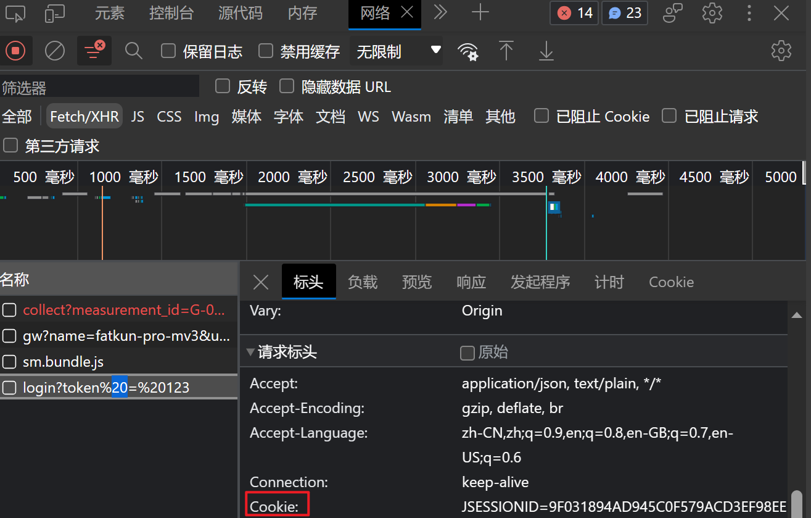
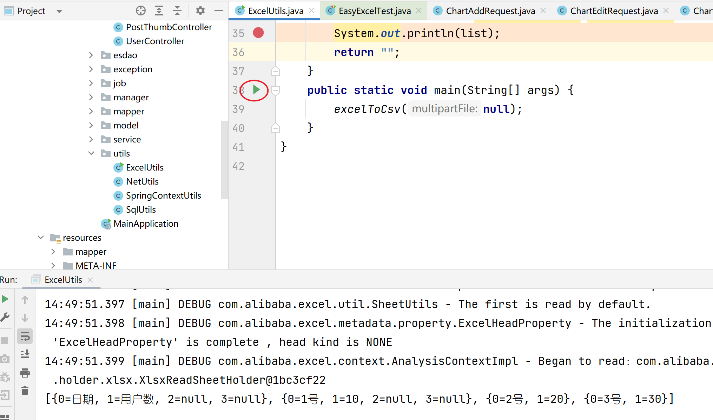
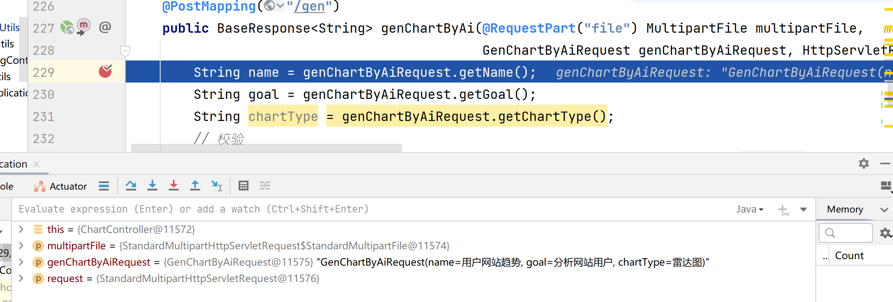
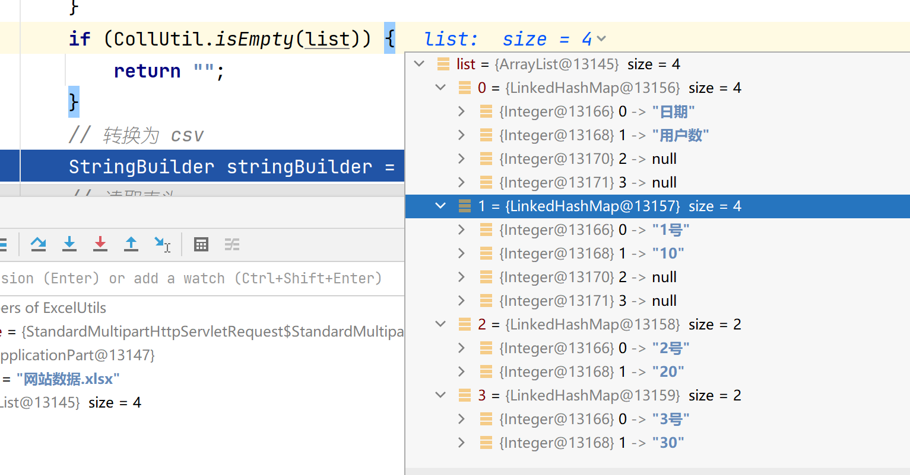
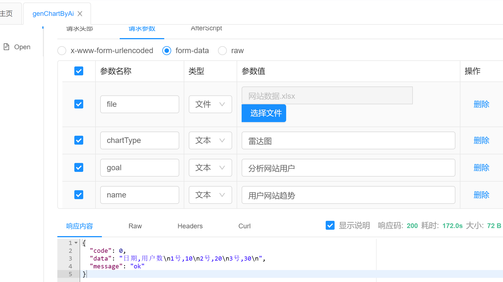

# 第二期

## 上次直播问题


### 端口占用

>   windows查询端口占用
>
>   ChatGPT: 在Windows操作系统中，你可以使用命令提示符来查询端口的占用情况。以下是一些常用的方法：
>
>   1. **使用`netstat`命令**：
>      打开命令提示符（CMD），然后输入以下命令：
>      ```cmd
>      netstat -ano
>      ```
>      这个命令会显示所有活动的TCP和UDP连接，以及每个连接的进程ID（PID）。如果你想查找特定端口的占用情况，可以使用：
>      ```cmd
>      netstat -ano | findstr "端口号"
>      ```
>
>   2. **使用`tasklist`命令查找进程详情**：
>      如果你已经知道了进程ID（PID），并想知道哪个应用程序占用了该端口，可以使用以下命令：
>      ```cmd
>      tasklist | findstr "进程ID"
>      ```
>
>   3. **使用TCPView工具**：
>      TCPView是一个图形界面工具，可以提供更直观的端口占用情况查看。你可以从微软官方网站免费下载并使用。
>
>   4. **使用资源监视器**：
>      通过按下`Ctrl + Shift + Esc`打开任务管理器，然后点击“性能”选项卡，再点击下方的“打开资源监视器”链接。在资源监视器中，你可以在“网络”选项卡下看到端口的详细占用情况。
>
>   以上方法可以帮助你在Windows系统中查询端口占用情况。如果有任何问题或需要进一步的解释，请随时提问！在Windows操作系统中，你可以使用命令提示符来查询端口的占用情况。以下是一些常用的方法：
>
>   1. **使用`netstat`命令**：
>      打开命令提示符（CMD），然后输入以下命令：
>      ```cmd
>      netstat -ano
>      ```
>      这个命令会显示所有活动的TCP和UDP连接，以及每个连接的进程ID（PID）。如果你想查找特定端口的占用情况，可以使用：
>      ```cmd
>      netstat -ano | findstr "端口号"
>      ```
>
>   2. **使用`tasklist`命令查找进程详情**：
>      如果你已经知道了进程ID（PID），并想知道哪个应用程序占用了该端口，可以使用以下命令：
>      ```cmd
>      tasklist | findstr "进程ID"
>      ```
>
>   3. **使用TCPView工具**：
>      TCPView是一个图形界面工具，可以提供更直观的端口占用情况查看。你可以从微软官方网站免费下载并使用。
>
>   4. **使用资源监视器**：
>      通过按下`Ctrl + Shift + Esc`打开任务管理器，然后点击“性能”选项卡，再点击下方的“打开资源监视器”链接。在资源监视器中，你可以在“网络”选项卡下看到端口的详细占用情况。
>
>   以上方法可以帮助你在Windows系统中查询端口占用情况。如果有任何问题或需要进一步的解释，请随时提问！


>   netsh interface ipv4 show excludedportrange protocol=tcp
>
>   ChatGPT: 您提到的命令 `netsh interface ipv4 show excludedportrange protocol=tcp` 是用于在Windows系统中查询被排除的TCP端口范围。这些端口通常由系统或某些特定的服务占用，并且不可用于常规应用程序。
>
>   当你在命令提示符（CMD）中执行这个命令时，它会返回一个列表，显示所有被排除的TCP端口范围。这个列表可以帮助你了解哪些端口是被系统保留的，从而避免在配置应用程序或服务时使用这些端口。
>
>   如果您在执行这个命令时遇到任何问题或有任何疑问，请随时告诉我！


## 总体步骤

1.   修改端口
2.   删除mock数据（因为本地有后端）
3.   替换Logo,去[iconfont-阿里巴巴矢量图标库](https://www.iconfont.cn/)搜索，替换favicon,使用[制作ico图标 | ico在线转换| 制作favicon.ico (libowen.com)](http://libowen.com/tool/ico/)生成
4.   删除国际化locales目录
5.   删除测试相关目录
6.   prettier、eslint、editorConfig、stylelint,需要开启prettier美化配置
7.   替换网站标题名称：全局替换Ant Design Pro和Ant Design


## 修改端口

yubi-backend\src\main\resources\application.yml

```
server:
  address: 0.0.0.0
  port: 8101
  servlet:
```

## 前端初始化的优化

前端运行 `dev`


## 代码格式化配置

>   ## USER
>
>   webstorm中的prettier设置在VSCode中怎么调整？
>
>   ## ChatGPT: 
>
>   在VSCode中调整Prettier设置与在WebStorm中设置类似，但需要使用VSCode的设置界面。以下是在VSCode中调整Prettier设置的步骤：
>
>   1. 打开VSCode。
>   2. 确保已经安装了 "Prettier - Code formatter" 扩展。
>   3. 点击左下角的设置图标（齿轮图标），然后选择 "设置"。
>   4. 在搜索栏中输入 "Prettier"，找到 "Prettier: Options" 设置项。
>   5. 点击 "编辑 in settings.json"，这将会打开您的项目或用户设置的 JSON 文件。
>   6. 在 "settings.json" 文件中，您可以添加或修改与Prettier相关的设置。
>
>   以下是一些常见的Prettier设置示例，您可以根据需要进行调整：
>
>   ```json
>   {
>     "editor.defaultFormatter": "esbenp.prettier-vscode", // 设置Prettier为默认的格式化工具
>     "prettier.singleQuote": true, // 使用单引号而不是双引号
>     "prettier.trailingComma": "all", // 添加尾随逗号
>     "prettier.tabWidth": 2 // 设置缩进为2个空格
>   }
>   ```
>
>   请注意，您可以根据自己的喜好和项目要求进行设置。完成设置后，保存文件即可生效。
>
>   总之，通过上述步骤，您可以在VSCode中调整Prettier的设置，与在WebStorm中设置类似。
>
>   ## USER
>   "Prettier - Code formatter" 扩展 如何使项目中.prettier.js文件生效？
>
>   ## ChatGPT:  
>
>   在使用 "Prettier - Code formatter" 扩展时，可以通过使用 `.prettier.js` 文件来配置Prettier。要使项目中的 `.prettier.js` 文件生效，您需要进行以下步骤：
>
>   1. 确保您的项目根目录下存在一个名为 `.prettier.js` 的文件，其中包含您想要的Prettier配置。
>
>   2. 打开您的项目中的任意一个JavaScript或TypeScript文件。
>
>   3. 使用快捷键 `Shift + Option + F`（在Mac上）或 `Shift + Alt + F`（在Windows上）来触发格式化操作。或者，您也可以右键点击编辑器中的代码，然后选择 "Format Document" 选项。
>
>   4. 此时， "Prettier - Code formatter" 扩展会检测到项目中的 `.prettier.js` 文件，并根据其中的配置对代码进行格式化。
>
>   请注意，如果您使用的是 `.prettier.js` 文件而不是 `.prettierrc` 文件，确保您的配置是通过导出一个JavaScript对象来定义的，例如：
>
>   ```javascript
>   module.exports = {
>     semi: true,
>     singleQuote: true,
>     trailingComma: 'all',
>     tabWidth: 2,
>     // 其他配置...
>   };
>   ```
>
>   通过这样的配置， "Prettier - Code formatter" 扩展会根据您的 `.prettier.js` 文件中的设置来格式化您的代码。

## 替换网站标题名称

全局替换 `Ant Design pro` 和 `Ant Design` 改成 yubi

如果登录后还是没法进入主页，修改全局请求配置app.tsx:

```tsx
export const request = {
  baseURL: 'http://localhost:8101',
  withCredentials: true,
  ...errorConfig,
};
```


## 开发登录注册页面

先删掉不需要的，然后和后端进行联调

[Login but cannot stay login state \(maybe need cookie\) · youhuangla/ChatBI@2b7ab61](https://github.com/youhuangla/ChatBI/commit/2b7ab6144f06c7f16ef7c95f6edfaaed4740fefd)

### 刷新无法保持登录

登录加上cookie

[Using cookie to keep login state after refresh · youhuangla/ChatBI@5fae076](https://github.com/youhuangla/ChatBI/commit/5fae076752a3d970e5955eabc60e94a2ead39bb5)



修改 requestErrorConfig 文件，可以自定义全局请求响应拦截器

注册去看用户中心项目


### 头像问题

[Solve loading avater bug · youhuangla/ChatBI@3833d8a](https://github.com/youhuangla/ChatBI/commit/3833d8aac366cb9a21faeb8d7f05e2a5c337b47b)


## 智能分析业务开发

### 业务流程

1.   用户输入
     1.   分析目标
     2.   上传原始数据(excel)
     3.   更精细话地控制图表：比如图表类型、图表名称等
2.   后端校验
     1.   校验用户的输入是否合法（比如长度）
     2.   成本控制（次数统计和校验、鉴权等）
3.   把处理后的数据输入给A!模型（调用A!接口），让A!模型给我们提供图表信息、结论文本
4.   图表信息（一段Json配置，一段代码）、结论文本在前端进行展示

## 开发接口

根据用户的输入（文本和文件），最后返回图表信息和结论文本

给chart表补充name字段

### 原始数据压缩

A!接口普遍都有输入字数限制，尽可能压缩数据，能够允许多传一些数据

如何向Al提词(prompt)?

AI提词技巧1：持续输入，持续优化

AI提词技巧2：数据压缩

#### 使用csv对excel文件的数据进行提取和压缩

开源库：https:/easyexcel..opensource.alibaba.com/docs/current/

一步一步来，先读取出数据：

[读Excel | Easy Excel (alibaba.com)](https://easyexcel.opensource.alibaba.com/docs/current/quickstart/read)

省时间直接复制，如不理解看“伙伴匹配系统"

>   list.get(0); 
>
>   Map<Integer, String> integerStringMap = list.get(0); 
>
>   第一行代码在IDEA中如何通过快捷键变为第二行
>
>   ChatGPT: 在IntelliJ IDEA中，你可以使用以下步骤将 `list.get(0);` 变为 `Map<Integer, String> integerStringMap = list.get(0);`：
>
>   1. 将光标放在 `list.get(0);` 这一行。
>
>   2. 按下 `Alt + Enter`，这将打开一个上下文菜单。
>
>   3. 选择 `Introduce Local Variable`，然后输入变量名 `integerStringMap`。
>
>   这样，`list.get(0);` 就会变为 `Map<Integer, String> integerStringMap = list.get(0);`。
>
>   注意：这个操作会自动推断变量的类型，如果 `list.get(0)` 的类型是 `Map<Integer, String>`，那么就会生成 `Map<Integer, String> integerStringMap = list.get(0);`，如果类型是其他的，那么就会生成对应的类型。

[Test ExcelUtils\.java to read excel · youhuangla/ChatBI@73cdd4a](https://github.com/youhuangla/ChatBI/commit/73cdd4af3b995130619159e35fd78fe82b04c1f2)




[Deduplication in excel · youhuangla/ChatBI@911cc68](https://github.com/youhuangla/ChatBI/commit/911cc6817b51fd3d6f1f60270d725159b72291c2)

```
11:12:26.198 [main] DEBUG com.alibaba.excel.context.AnalysisContextImpl - Began to read：com.alibaba.excel.read.metadata.holder.xlsx.XlsxReadSheetHolder@1bc3cf22
日期,用户数
1号,10
2号,20
3号,30
[{0=日期, 1=用户数, 2=null, 3=null}, {0=1号, 1=10, 2=null, 3=null}, {0=2号, 1=20}, {0=3号, 1=30}]
```


[Update ExcelUtils to imply excel2csv · youhuangla/ChatBI@9fd9ddd](https://github.com/youhuangla/ChatBI/commit/9fd9ddd7a77e5a68441dfbc806097e04af31de4b)

>   **You:**
>
>   StringUtils 在Apache,Spring, Hutool中的区别和联系
>
>   * * *
>
>   **ChatGPT:**
>
>   `StringUtils` 是一个常见的类名，在不同的框架和工具库中可能会有不同的实现和功能。在Apache Commons Lang、Spring Framework 和 Hutool 这三个工具库中，都有一个名为 `StringUtils` 的类，用于处理字符串操作。下面是它们之间的区别和联系：
>
>   1. **Apache Commons Lang:**
>      
>       * `StringUtils` 类位于 Apache Commons Lang 库中，提供了许多字符串处理和操作的工具方法。
>       * 它包含了各种用于检查、处理、拼接、分割、替换字符串等常见操作的方法。
>       * 用于编写 Java 应用程序，可以方便地导入 Apache Commons Lang 库来使用这些字符串工具方法。
>   2. **Spring Framework:**
>      
>       * `StringUtils` 类位于 Spring Framework 中，专门用于处理字符串的实用方法。
>       * Spring 的 `StringUtils` 提供了一些与字符串处理相关的方法，如处理空字符串、去除空格、判断字符串为空等。
>       * Spring Framework 是一个广泛使用的 Java 框架，除了字符串处理外，它还提供了许多其他功能，如依赖注入、AOP、事务管理等。
>   3. **Hutool:**
>      
>       * `StringUtils` 类位于 Hutool 这个开源 Java 工具库中，目标是提供丰富的工具方法来简化 Java 开发。
>       * Hutool 的 `StringUtils` 扩展了许多字符串处理方法，包括字符串格式化、正则匹配、Unicode 转换等。
>       * Hutool 还提供了其他许多实用工具类，不仅仅局限于字符串处理，还包括日期时间、加密解密、文件操作等功能。
>
>   在这三个工具库中，`StringUtils` 类的主要目标都是简化字符串处理操作，提供更方便的方法来处理各种字符串操作，使开发人员能够更快速地编写高质量的代码。虽然它们之间可能存在重叠的功能，但各自也有一些特定的方法和用途。根据项目的需求和使用的框架，可以选择合适的库来处理字符串操作。


测试

打断点debug







[Upload excel to backend · youhuangla/ChatBI@cfcd28d](https://github.com/youhuangla/ChatBI/commit/cfcd28d81ffef3b15b6573fec73bbfd8e1e34f50)

## 调用AI

输入：

系统预设（提前告诉他职责、功能、回复格式要求）+ 分析目标 + 压缩后的数据

### 在输入中追加数据

最简单的系统预设：你是一个数据分析师，接下来我会给你我的分析目标和原始数据，请告诉我分析结论。


```
{
  "code": 0,
  "data": "你是一个数据分析师，接下来我会给你我的分析目标和原始数据，请告诉我分析结论。\n分析目标：分析网站用户\n数据：日期,用户数\n1号,10\n2号,20\n3号,30\n\n",
  "message": "ok"
}
```

```
你是一个数据分析师，接下来我会给你我的分析目标和原始数据，请告诉我分析结论。

分析目标：分析网站用户的增长

数据：日期,用户数

1号,10

2号,20

3号,30


```

[Fix bug in Append data in userInput · youhuangla/ChatBI@12af5cf](https://github.com/youhuangla/ChatBI/commit/12af5cfc53caeb1b33b139bb878a8176023be2dd)

A!提词技巧3：在系统（模型）层面做预设效果一般来说，会比直接拼接在用户消息里效果更好一些。

A!提词技巧4：除了系统预设外，额外关联一问一答两条消息，相当于给A!一个提示。

