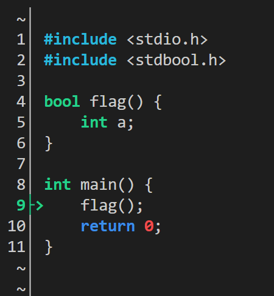
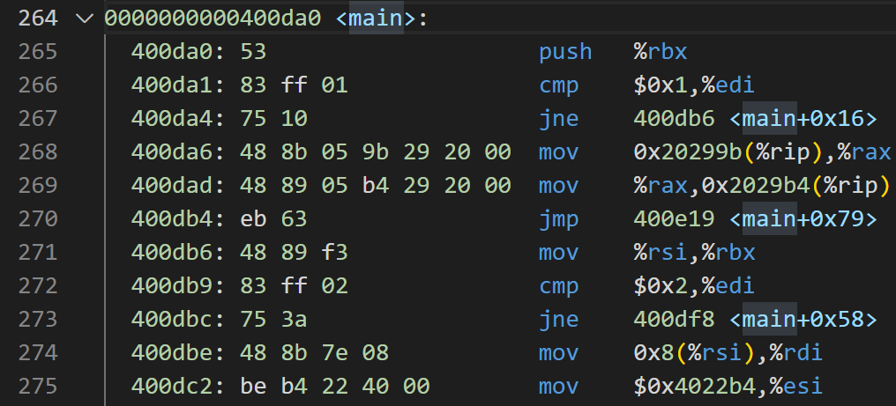
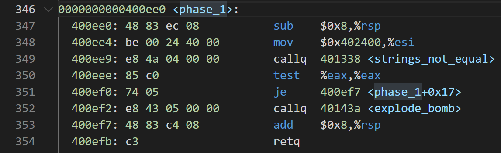

# Bomb lab

```shell
youhuangla@Ubuntu bomb % ./bomb                                                                              [0]
Welcome to my fiendish little bomb. You have 6 phases with
which to blow yourself up. Have a nice day!
jdfjd

BOOM!!!
The bomb has blown up.
```

> Please look at the **hints** section for some tips and ideas. The best way is to use your favorite debugger to step through the disassembled binary.
>
> The first four phases are worth 10 points each. Phases 5 and 6 are a little more difficult, so they are worth 15 points each. So the maximum score you can get is 70 points.
>
> Although phases get progressively harder to defuse, the expertise you gain as you move from phase to phase
> should offset this difficulty. However, the last phase will challenge even the best students, so please don’t wait until the last minute to start.
>
> The bomb ignores blank input lines. If you run your bomb with a command line argument, for example,
>
> ```shell
> linux> ./bomb psol.txt
> ```
>
> then it will read the input lines from psol.txt until it reaches EOF (end of file), and then switch over to stdin. In a moment of weakness, Dr. Evil added this feature so you don’t have to keep retyping the solutions to phases you have already defused.
>
> To avoid accidentally detonating the bomb, you will need to learn how to **single-step through the assembly**
> **code** and how to **set breakpoints**. Y ou will also need to learn how to **inspect both the registers and the**
> **memory states**. One of the nice side-effects of doing the lab is that you will get very good at using a
> **debugger**. This is a crucial skill that will pay big dividends the rest of your career.
>
> You can also **run it under a debugger**, watch what it does step by step, and use this information to defuse it. This is probably the fastest way of defusing it.
>
> bomblab.pdf

## Tools

There are many tools which are designed to help you figure out both how programs work, and what is wrong when they don’t work. Here is a list of some of the tools you may find useful in analyzing your bomb, and hints on how to use them.

- gdb

The GNU debugger, this is a command line debugger tool available on virtually every platform. You can trace through a program line by line, examine memory and registers, look at both the **source code** and **assembly code** (we are not giving you the source code for most of your bomb), **set breakpoints**,**set memory watch points**, and **write scripts**

The CS:APP web site [CS:APP2e, Bryant and O'Hallaron](http://csapp.cs.cmu.edu/public/students.html) has a very handy single-page gdb summary that you can print out and use as a reference. Here are some other tips for using gdb.

– To keep the bomb from blowing up every time you type in a wrong input, you’ll want to learn
how to set breakpoints.

– For online documentation, type “help” at the gdb command prompt, or type “man gdb”,
or “info gdb” at a Unix prompt. Some people also like to run gdb under gdb-mode in
emacs.

- objdump -t

  This will print out the bomb’s **symbol table**. The symbol table includes the **names of all functions and global variables** in the bomb, the names of all the functions the bomb calls, and their **addresses**. You may learn something by looking at the function names!

- objdump -d

  Use this to **disassemble** all of the code in the bomb. You can also just look at individual functions.Reading the assembler code can tell you how the bomb works.

  Although objdump -d gives you a lot of information, it doesn’t tell you the whole story. Calls to system-level functions are displayed in a cryptic form. For example, a call to sscanf might appear as:

```nasm
8048c36: e8 99 fc ff ff call 80488d4 <_init+0x1a0>
```

​		To determine that the call was to sscanf, you would need to disassemble within gdb.

- strings

  This utility will display the printable strings in your bomb.

Looking for a particular tool? How about documentation? Don’t forget, the commands **apropos**, **man**, and **info** are your friends. In particular, **man ascii** might come in useful. **info gas** will give you more than you ever wanted to know about the GNU Assembler. Also, the web may also be a treasure trove of information. If you get stumped, feel free to ask your instructor for help.

### Gas

```shell
youhuangla@Ubuntu bomb % info as                                                                             [0]
youhuangla@Ubuntu bomb % man as #same ,but man seems colorful
AS(1)                                        GNU Development Tools                                       AS(1)

NAME
       AS - the portable GNU assembler.
       
```

### Aporos

```shell
youhuangla@Ubuntu bomb % man apropos 
APROPOS(1)                                    Manual pager utils                                    APROPOS(1)   
NAME
       apropos - search the manual page names and descriptions
youhuangla@Ubuntu bomb % apropos objdump                                                                     [0]
apropos: can't set the locale; make sure $LC_* and $LANG are correct
llvm-objdump (1)     - manual page for llvm-objdump 6.0
llvm-objdump-6.0 (1) - manual page for llvm-objdump 6.0
objdump (1)          - display information from object files.
x86_64-linux-gnu-objdump (1) - display information from object files.
```

### Objdump

```shell
youhuangla@Ubuntu bomb % man objdump  
SYNOPSIS
       objdump [-a|--archive-headers]
               [-b bfdname|--target=bfdname]
               [-C|--demangle[=style] ]
               [-d|--disassemble]
```

[CSAPP: Bomb Lab 详细实验解析 \- 掘金](https://juejin.cn/post/6874568541229334541)

### Vim

Search function name quickly

[How to search for selected text in Vim? \- Super User](https://superuser.com/questions/41378/how-to-search-for-selected-text-in-vim)

> you can simply yank the selected text with **y** and go to search mode **/**, then you can paste the last yanked text with **Ctrl+R 0**
>
> [viemu \- Search for selection in Vim \- Stack Overflow](https://stackoverflow.com/questions/363111/search-for-selection-in-vim)

### CGDB

在[《深入理解计算机系统》配套实验：Bomblab - 知乎 (zhihu.com)](https://zhuanlan.zhihu.com/p/31269514)找了个貌似更好用的cgdb，可视化支持更方便。

#### 简介

[cgdb/cgdb: Console front\-end to the GNU debugger](https://github.com/cgdb/cgdb)

CGDB是GNU调试器的一个非常轻量级的控制台前端。它提供了一个分屏界面，显示下面的GDB会话和上面的程序源代码。这个界面是模仿vim的，所以vim用户使用它应该感觉很舒服。

#### 安装

```shell
sudo apt install cgdb
```

但是读上文时卡在了

> 在最新版本的cgdb中，在cgdb模式下输入
>
> ```text
> ：set disasm
> ```

没啥反应。。

在[macos \- How to make cgdb show assembly code? \- Stack Overflow](https://stackoverflow.com/questions/9142889/how-to-make-cgdb-show-assembly-code)发现 cgdb 的机制类似于 vim，要先按esc，但是

还是没用，但在 stackoverflow 中发现

> You will need cgdb version 0.7.0 or newer.

会不会是版本问题？

##### 再次安装0.0.8版本

```shell
youhuangla@Ubuntu Software_Source_Code % ls                                                                         [0]
cgdb-0.8.0
youhuangla@Ubuntu Software_Source_Code % cd cgdb-0.8.0/                                                             [0]
youhuangla@Ubuntu cgdb-0.8.0 % ls                                                                                   [0]
AUTHORS          ChangeLog  Makefile.am  autogen.sh      cgdb_custom_config.h.in  doc       release-todo.txt
CONTRIBUTING.md  FAQ        NEWS         autorelease.sh  config                   lib       roadmap.txt
COPYING          INSTALL    README.md    cgdb            configure.ac             packages  test
```

考虑到以后可能还要放源代码，新建一个目录。

官网上有一堆包要装

> sh
> autoconf
> automake
> aclocal
> autoheader
> libtool
> flex
> bison
> gcc/g++ (c11/c++11 support)

关于 autogen\.sh 可看 [What is the job of autogen\.sh when building a c\+\+ package on Linux \- Stack Overflow](https://stackoverflow.com/questions/50044091/what-is-the-job-of-autogen-sh-when-building-a-c-package-on-linux)

```shell
# sh是啥子？可能就是shell脚本？apt没找到
sudo apt install automake
sudo apt install autoconf 
# 一堆没找到
sudo apt install flex
sudo apt install bison
```

仍然无法直接执行，算了，用sh执行。

```shell
youhuangla@Ubuntu cgdb-0.8.0 % sudo sh ./autogen.sh                                                                 [1]
[sudo] password for youhuangla: 
fatal: not a git repository (or any of the parent directories): .git
-- Running aclocal
perl: warning: Setting locale failed.
perl: warning: Please check that your locale settings:
        LANGUAGE = (unset),
        LC_ALL = "",
        LANG = "zh_CN.GBK"
    are supported and installed on your system.
perl: warning: Falling back to the standard locale ("C").
.....
youhuangla@Ubuntu cgdb-0.8.0 % mkdir ../build                                                                       [0]
cd ../build
# same as README
youhuangla@Ubuntu build % ../cgdb-0.8.0/configure  --prefix=$PWD/../prefix
# add version name to cgdb
......
checking for makeinfo... no
configure: error: Please install makeinfo before installing
```

Learn from [ubuntu \- What is makeinfo, and how do I get it? \- Stack Overflow](https://stackoverflow.com/questions/338317/what-is-makeinfo-and-how-do-i-get-it)

```shell
youhuangla@Ubuntu build % sudo apt-get install texinfo
......
youhuangla@Ubuntu build % ls                                                                                        [0]
Makefile  cgdb  cgdb_custom_config.h  config.h  config.log  config.status  doc  lib  stamp-h1  test
youhuangla@Ubuntu build % make -srj4 
# a lot of warning
```



界面变好看了，但是命令好像还不行。。`cgdb -v`也没变

## Begin

```shell
youhuangla@Ubuntu bomb % ./bomb                                                                              [2]
Welcome to my fiendish little bomb. You have 6 phases with
which to blow yourself up. Have a nice day!
^CSo you think you can stop the bomb with ctrl-c, do you?
^CWell...OK. :-)
youhuangla@Ubuntu bomb % objdump -d ./bomb > bomb.asm
```

Right side maybe is orignal address? We can see every address gap 8 bytes.

```asm
0000000000400ad0 <.plt>:
  400ad0:	ff 35 1a 25 20 00    	pushq  0x20251a(%rip)        # 602ff0 <_GLOBAL_OFFSET_TABLE_+0x8>
  400ad6:	ff 25 1c 25 20 00    	jmpq   *0x20251c(%rip)        # 602ff8 <_GLOBAL_OFFSET_TABLE_+0x10>
  400adc:	0f 1f 40 00          	nopl   0x0(%rax)
```

### main

We can find two function with main.

```asm
0000000000400b70 <__libc_start_main@plt>:

0000000000400da0 <main>:
```

> The `__libc_start_main()` function shall perform any necessary initialization of the execution environment, call the `*main*` function with appropriate arguments, and handle the return from `main()`. If the `main()` function returns, the return value shall be passed to the `exit()` function.
>
> [\_\_libc\_start\_main](https://refspecs.linuxbase.org/LSB_3.1.0/LSB-generic/LSB-generic/baselib---libc-start-main-.html)

So , the second one .




### phase_1

```c
    input = read_line();             /* Get input                   */
    phase_1(input);                  /* Run the phase               */
    phase_defused();                 /* Drat!  They figured it out!
```

Search for phase_1 in main function.


So it calls:



```asm
0000000000400ee0 <phase_1>:
  400ee0:	48 83 ec 08          	sub    $0x8,%rsp
  400ee4:	be 00 24 40 00       	mov    $0x402400,%esi
  400ee9:	e8 4a 04 00 00       	callq  401338 <strings_not_equal>
  400eee:	85 c0                	test   %eax,%eax
  400ef0:	74 05                	je     400ef7 <phase_1+0x17>
  400ef2:	e8 43 05 00 00       	callq  40143a <explode_bomb>
  400ef7:	48 83 c4 08          	add    $0x8,%rsp
  400efb:	c3                   	retq   
```

What's 0x402400?

### read_line

```asm
  400e32:	e8 67 06 00 00       	callq  40149e <read_line>
```


[【深入理解计算机系统 实验2 CSAPP】bomb lab 炸弹实验 CMU bomblab_哔哩哔哩_bilibili](https://www.bilibili.com/video/BV1vu411o7QP?spm_id_from=333.337.search-card.all.click)

[【彻底搞懂C指针】Malloc 和 Free 的具体实现_哔哩哔哩_bilibili](https://www.bilibili.com/video/BV1aZ4y1P7fs?spm_id_from=333.999.0.0)


