# Bomb lab

```shell
youhuangla@Ubuntu bomb % ./bomb                                                                              [0]
Welcome to my fiendish little bomb. You have 6 phases with
which to blow yourself up. Have a nice day!
jdfjd

BOOM!!!
The bomb has blown up.
```

> Please look at the **hints** section for some tips and ideas. The best way is to use your favorite debugger to step through the disassembled binary.
>
> The first four phases are worth 10 points each. Phases 5 and 6 are a little more difficult, so they are worth 15 points each. So the maximum score you can get is 70 points.
>
> Although phases get progressively harder to defuse, the expertise you gain as you move from phase to phase
> should offset this difficulty. However, the last phase will challenge even the best students, so please don’t wait until the last minute to start.
>
> The bomb ignores blank input lines. If you run your bomb with a command line argument, for example,
>
> ```shell
> linux> ./bomb psol.txt
> ```
>
> then it will read the input lines from psol.txt until it reaches EOF (end of file), and then switch over to stdin. In a moment of weakness, Dr. Evil added this feature so you don’t have to keep retyping the solutions to phases you have already defused.
>
> To avoid accidentally detonating the bomb, you will need to learn how to **single-step through the assembly**
> **code** and how to **set breakpoints**. Y ou will also need to learn how to **inspect both the registers and the**
> **memory states**. One of the nice side-effects of doing the lab is that you will get very good at using a
> **debugger**. This is a crucial skill that will pay big dividends the rest of your career.
>
> You can also **run it under a debugger**, watch what it does step by step, and use this information to defuse it. This is probably the fastest way of defusing it.
>
> bomblab.pdf

## Tools

There are many tools which are designed to help you figure out both how programs work, and what is wrong when they don’t work. Here is a list of some of the tools you may find useful in analyzing your bomb, and hints on how to use them.

- gdb

The GNU debugger, this is a command line debugger tool available on virtually every platform. You can trace through a program line by line, examine memory and registers, look at both the **source code** and **assembly code** (we are not giving you the source code for most of your bomb), **set breakpoints**,**set memory watch points**, and **write scripts**

The CS:APP web site [CS:APP2e, Bryant and O'Hallaron](http://csapp.cs.cmu.edu/public/students.html) has a very handy single-page gdb summary that you can print out and use as a reference. Here are some other tips for using gdb.

– To keep the bomb from blowing up every time you type in a wrong input, you’ll want to learn
how to set breakpoints.

– For online documentation, type “help” at the gdb command prompt, or type “man gdb”,
or “info gdb” at a Unix prompt. Some people also like to run gdb under gdb-mode in
emacs.

- objdump -t

  This will print out the bomb’s **symbol table**. The symbol table includes the **names of all functions and global variables** in the bomb, the names of all the functions the bomb calls, and their **addresses**. You may learn something by looking at the function names!

- objdump -d

  Use this to **disassemble** all of the code in the bomb. You can also just look at individual functions.Reading the assembler code can tell you how the bomb works.

  Although objdump -d gives you a lot of information, it doesn’t tell you the whole story. Calls to system-level functions are displayed in a cryptic form. For example, a call to sscanf might appear as:

```nasm
8048c36: e8 99 fc ff ff call 80488d4 <_init+0x1a0>
```

​		To determine that the call was to sscanf, you would need to disassemble within gdb.

- strings

  This utility will display the printable strings in your bomb.

Looking for a particular tool? How about documentation? Don’t forget, the commands **apropos**, **man**, and **info** are your friends. In particular, **man ascii** might come in useful. **info gas** will give you more than you ever wanted to know about the GNU Assembler. Also, the web may also be a treasure trove of information. If you get stumped, feel free to ask your instructor for help.

### Gas

```shell
youhuangla@Ubuntu bomb % info as                                                                             [0]
youhuangla@Ubuntu bomb % man as #same ,but man seems colorful
AS(1)                                        GNU Development Tools                                       AS(1)

NAME
       AS - the portable GNU assembler.
       
```

### Aporos

```shell
youhuangla@Ubuntu bomb % man apropos 
APROPOS(1)                                    Manual pager utils                                    APROPOS(1)   
NAME
       apropos - search the manual page names and descriptions
youhuangla@Ubuntu bomb % apropos objdump                                                                     [0]
apropos: can't set the locale; make sure $LC_* and $LANG are correct
llvm-objdump (1)     - manual page for llvm-objdump 6.0
llvm-objdump-6.0 (1) - manual page for llvm-objdump 6.0
objdump (1)          - display information from object files.
x86_64-linux-gnu-objdump (1) - display information from object files.
```

### Objdump

```shell
youhuangla@Ubuntu bomb % man objdump  
SYNOPSIS
       objdump [-a|--archive-headers]
               [-b bfdname|--target=bfdname]
               [-C|--demangle[=style] ]
               [-d|--disassemble]
```

[CSAPP: Bomb Lab 详细实验解析 \- 掘金](https://juejin.cn/post/6874568541229334541)

### Vim

Search function name quickly

[How to search for selected text in Vim? \- Super User](https://superuser.com/questions/41378/how-to-search-for-selected-text-in-vim)

> you can simply yank the selected text with **y** and go to search mode **/**, then you can paste the last yanked text with **Ctrl+R 0**
>
> [viemu \- Search for selection in Vim \- Stack Overflow](https://stackoverflow.com/questions/363111/search-for-selection-in-vim)

### CGDB

在[《深入理解计算机系统》配套实验：Bomblab - 知乎 (zhihu.com)](https://zhuanlan.zhihu.com/p/31269514)找了个貌似更好用的cgdb，可视化支持更方便。

#### 简介

[cgdb/cgdb: Console front\-end to the GNU debugger](https://github.com/cgdb/cgdb)

CGDB是GNU调试器的一个非常轻量级的控制台前端。它提供了一个分屏界面，显示下面的GDB会话和上面的程序源代码。这个界面是模仿vim的，所以vim用户使用它应该感觉很舒服。

#### 安装

```shell
sudo apt install cgdb
```

但是读上文时卡在了

> 在最新版本的cgdb中，在cgdb模式下输入
>
> ```text
> ：set disasm
> ```

没啥反应。。

在[macos \- How to make cgdb show assembly code? \- Stack Overflow](https://stackoverflow.com/questions/9142889/how-to-make-cgdb-show-assembly-code)发现 cgdb 的机制类似于 vim，要先按esc，但是

还是没用，但在 stackoverflow 中发现

> You will need cgdb version 0.7.0 or newer.

会不会是版本问题？

##### 再次安装0.0.8版本

```shell
youhuangla@Ubuntu Software_Source_Code % ls                                                                         [0]
cgdb-0.8.0
youhuangla@Ubuntu Software_Source_Code % cd cgdb-0.8.0/                                                             [0]
youhuangla@Ubuntu cgdb-0.8.0 % ls                                                                                   [0]
AUTHORS          ChangeLog  Makefile.am  autogen.sh      cgdb_custom_config.h.in  doc       release-todo.txt
CONTRIBUTING.md  FAQ        NEWS         autorelease.sh  config                   lib       roadmap.txt
COPYING          INSTALL    README.md    cgdb            configure.ac             packages  test
```

考虑到以后可能还要放源代码，新建一个目录。

官网上有一堆包要装

> sh
> autoconf
> automake
> aclocal
> autoheader
> libtool
> flex
> bison
> gcc/g++ (c11/c++11 support)

关于 autogen\.sh 可看 [What is the job of autogen\.sh when building a c\+\+ package on Linux \- Stack Overflow](https://stackoverflow.com/questions/50044091/what-is-the-job-of-autogen-sh-when-building-a-c-package-on-linux)

```shell
# sh是啥子？可能就是shell脚本？apt没找到
sudo apt install automake
sudo apt install autoconf 
# 一堆没找到
sudo apt install flex
sudo apt install bison
```

仍然无法直接执行，算了，用sh执行。

```shell
youhuangla@Ubuntu cgdb-0.8.0 % sudo sh ./autogen.sh                                                                 [1]
[sudo] password for youhuangla: 
fatal: not a git repository (or any of the parent directories): .git
-- Running aclocal
perl: warning: Setting locale failed.
perl: warning: Please check that your locale settings:
        LANGUAGE = (unset),
        LC_ALL = "",
        LANG = "zh_CN.GBK"
    are supported and installed on your system.
perl: warning: Falling back to the standard locale ("C").
.....
youhuangla@Ubuntu cgdb-0.8.0 % mkdir ../build                                                                       [0]
cd ../build
# same as README
youhuangla@Ubuntu build % ../cgdb-0.8.0/configure  --prefix=$PWD/../prefix
# add version name to cgdb
......
checking for makeinfo... no
configure: error: Please install makeinfo before installing
```

Learn from [ubuntu \- What is makeinfo, and how do I get it? \- Stack Overflow](https://stackoverflow.com/questions/338317/what-is-makeinfo-and-how-do-i-get-it)

```shell
youhuangla@Ubuntu build % sudo apt-get install texinfo
......
youhuangla@Ubuntu build % ls                                                                                        [0]
Makefile  cgdb  cgdb_custom_config.h  config.h  config.log  config.status  doc  lib  stamp-h1  test
youhuangla@Ubuntu build % make -srj4 
# a lot of warning
youhuangla@Ubuntu build % make install 
```


界面变好看了，但是命令好像还不行。。`cgdb -v`也没变

另外就是scanf没法输入

> 
> Hi,
>
> Please try the new-ui branch. The inferior pty is no longer set and I believe your issue may be resolved. Let me know.
>
> [Ctrl \- T doesn't seem to work \(cgdb 0\.7\.0\) · Issue \#193 · cgdb/cgdb](https://github.com/cgdb/cgdb/issues/193)

尝试换一个branch(new issue)构建

注意，要attach 的话使用 sudo！

受到[我的cgdb无法通过在CGDB模式下键入I T两个命令打开tty窗口进行i/o输入 · Issue \#22 · leeyiw/cgdb\-manual\-in\-chinese](https://github.com/leeyiw/cgdb-manual-in-chinese/issues/22)启发可以了！


CGDB模式同 vim 的normal模式，要esc返回，然后大写的`I`就可以到 `pty` 了，里面可以正常输入，大写`T`将该终端 pty 折叠。

服了，最后发现其实根本没装上

```shell
youhuangla@Ubuntu bin % sudo mv ~/Software_Source_Code/cgdb/build/cgdb/cgdb ./  
```

装上后

```shell
:set dis# show assembly
```

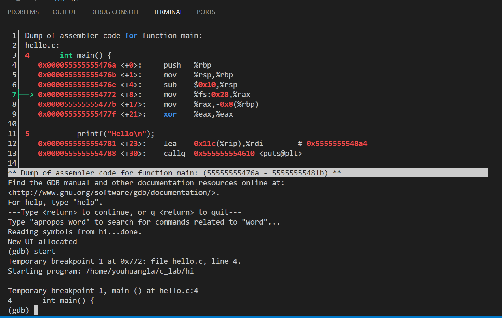

但是这样 pty 就没用了。


## Begin

```shell
youhuangla@Ubuntu bomb % ./bomb                                                                              [2]
Welcome to my fiendish little bomb. You have 6 phases with
which to blow yourself up. Have a nice day!
^CSo you think you can stop the bomb with ctrl-c, do you?
^CWell...OK. :-)
youhuangla@Ubuntu bomb % objdump -d ./bomb > bomb.asm
```

Use two signal(^C) to stop bomb.(why?)

Right side maybe is orignal address? We can see every address gap 8 bytes.

```asm
0000000000400ad0 <.plt>:
  400ad0:	ff 35 1a 25 20 00    	pushq  0x20251a(%rip)        # 602ff0 <_GLOBAL_OFFSET_TABLE_+0x8>
  400ad6:	ff 25 1c 25 20 00    	jmpq   *0x20251c(%rip)        # 602ff8 <_GLOBAL_OFFSET_TABLE_+0x10>
  400adc:	0f 1f 40 00          	nopl   0x0(%rax)
```

### main

We can find two function with main.

```asm
0000000000400b70 <__libc_start_main@plt>:

0000000000400da0 <main>:
```

> The `__libc_start_main()` function shall perform any necessary initialization of the execution environment, call the `*main*` function with appropriate arguments, and handle the return from `main()`. If the `main()` function returns, the return value shall be passed to the `exit()` function.
>
> [\_\_libc\_start\_main](https://refspecs.linuxbase.org/LSB_3.1.0/LSB-generic/LSB-generic/baselib---libc-start-main-.html)

So , the second one .


### phase_1

```c
    input = read_line();             /* Get input                   */
    phase_1(input);                  /* Run the phase               */
    phase_defused();                 /* Drat!  They figured it out!
```

Search for phase_1 in main function.


So it calls:


```asm
0000000000400ee0 <phase_1>:
  400ee0:	48 83 ec 08          	sub    $0x8,%rsp
  400ee4:	be 00 24 40 00       	mov    $0x402400,%esi
  400ee9:	e8 4a 04 00 00       	callq  401338 <strings_not_equal>
  400eee:	85 c0                	test   %eax,%eax
  400ef0:	74 05                	je     400ef7 <phase_1+0x17>
  400ef2:	e8 43 05 00 00       	callq  40143a <explode_bomb>
  400ef7:	48 83 c4 08          	add    $0x8,%rsp
  400efb:	c3                   	retq   
```

What's 0x402400?

这样调试有点慢了，还要一个个搜函数名字，不是很方便。

故使用 cgdb。

[【深入理解计算机系统 实验2 CSAPP】bomb lab 炸弹实验 CMU bomblab_哔哩哔哩_bilibili](https://www.bilibili.com/video/BV1vu411o7QP?spm_id_from=333.337.search-card.all.click)

[【彻底搞懂C指针】Malloc 和 Free 的具体实现_哔哩哔哩_bilibili](https://www.bilibili.com/video/BV1aZ4y1P7fs?spm_id_from=333.999.0.0)TODO

按照[《深入理解计算机系统》配套实验：Bomblab - 知乎 (zhihu.com)](https://zhuanlan.zhihu.com/p/31269514)使 cgdb 显示反汇编。

gdb 先`start`，再不断 `n`，在输入时随便输一个字符串 "123"，直到进入phase_1函数前，使用`:set dis`打开汇编窗口。

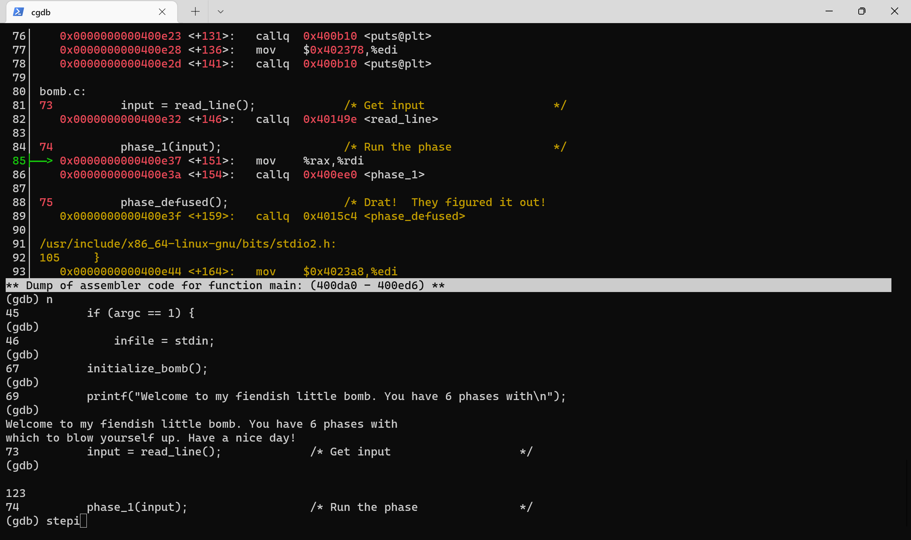

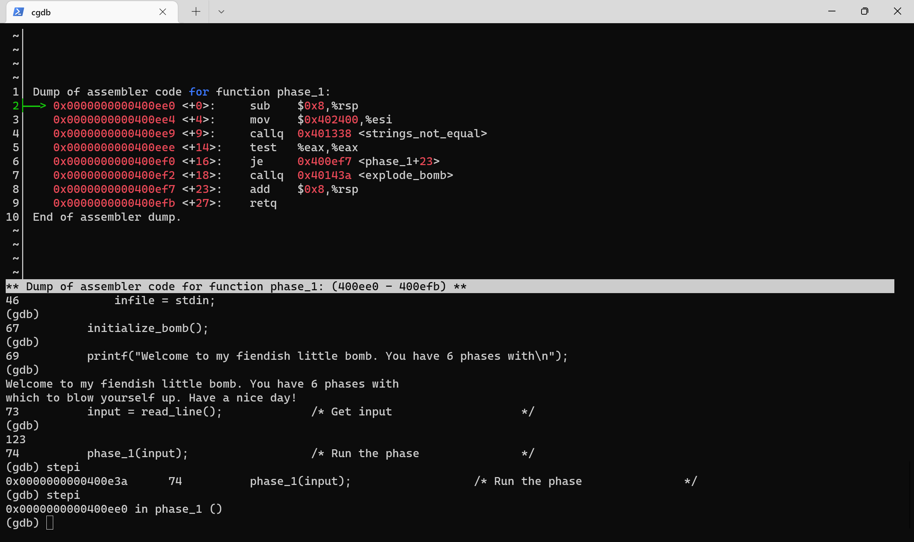

执行到`line74: phase_1(input)`后，逐步 `stepi`(`si`) ，不能用`n`或者`s`(`step`)。

[Continuing and Stepping \(Debugging with GDB\)](https://sourceware.org/gdb/download/onlinedocs/gdb/Continuing-and-Stepping.html)

一直`s`，则在下图5行中，爆炸。

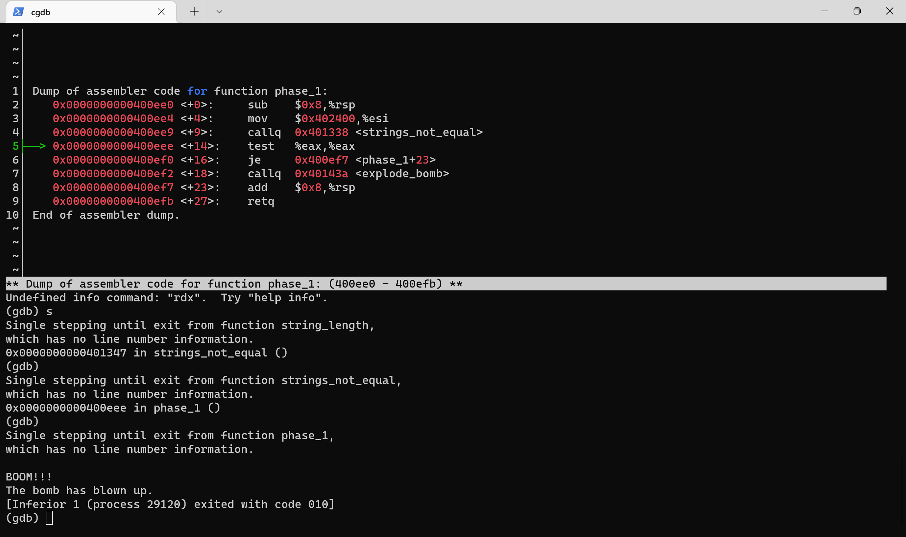

重新来，step into phase_1函数

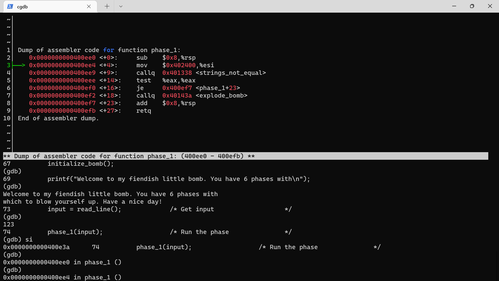

好，现在逐语句分析，%esi 是什么呢？如果还没记住寄存器，可以翻 CSAPP Figure 3.2(English p180/pdf p216, Chinese p120)，可知 esi 是 rsi 的32位

>  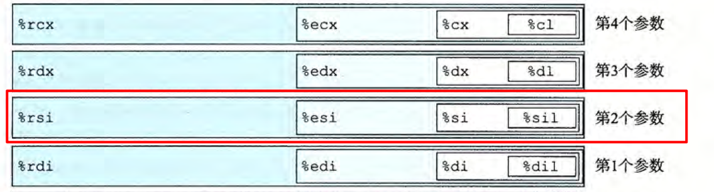
>
> 《CSAPP》 3.4 访问信息

故

```assembly
 3├──> 0x0000000000400ee4 <+4>:     mov    $0x402400,%esi
```

将 0x402400 传入 %esi，即传入 %rsi ，即作为第 2 个参数传入函数 `strings_not_equal`。

#### strings_not_equal

既然要传第2个参数，那么第1个参数 %rdi 是否已经存入了我们的输入值？继续`si`进入`strings_not_equal`函数，并重点关注 %rsi 和 %rdi。可以看到在  `strings_not_equal` 函数中也有两寄存器的 mov 指令。故确定两个寄存器都是传入函数 `strings_not_equal`的两个存 string 首地址的寄存器。

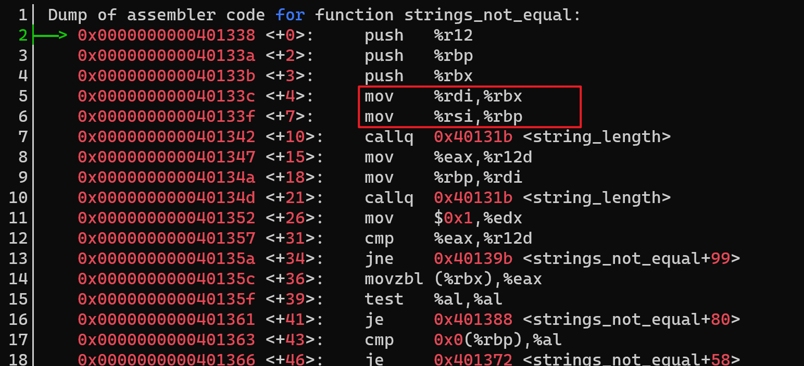

通过`info register`查看寄存器内的值

```gdb
rsi            0x402400 4203520
rdi            0x603780 6305664
```

根据

> x/s 0xbffff890 Examine a string stored at 0xbffff890
>
> ——《gdb-notes-x86-64》

显示字符串

```shell
(gdb) x/s 0x402400
0x402400:       "Border relations with Canada have never been better."
(gdb) x/s 0x603780
0x603780 <input_strings>:       "123" # I type 123
```

所以很明显，地址 0x402400 里存的就是第一个谜题的答案！

```shell
youhuangla@Ubuntu bomb % ./bomb                                                                            [0]
Welcome to my fiendish little bomb. You have 6 phases with
which to blow yourself up. Have a nice day!
Border relations with Canada have never been better.
Phase 1 defused. How about the next one?
```

#### Answer

```shell
Border relations with Canada have never been better.
```

### phase_2

照葫芦画瓢，先输入第一个谜题答案后，输入"456"

有了上一题的经验，单步执行到这里，发现有寄存器 rsi，也就是说是函数的第二个参数。

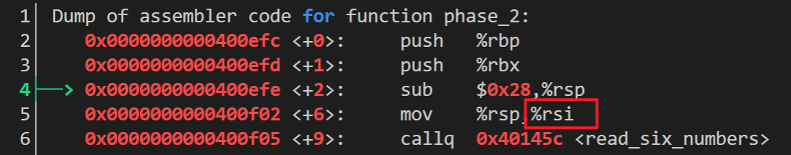

```shell
(gdb) x/s 0x6037d0
0x6037d0 <input_strings+80>:    "456"
```

#### read_six_numbers

` 6│    0x0000000000400f05 <+9>:     callq  0x40145c <read_six_numbers>`

```assembly
000000000040145c <read_six_numbers>:;从一个长的字符串(可视作字符数组)中读入 6 个 int，传入的只能是该字符串的首地址
  40145c:	48 83 ec 18          	sub    $0x18,%rsp; 24 byte
  401460:	48 89 f2             	mov    %rsi,%rdx ; rsi中应该是字符串input的首地址，rdx是sscanf的第3个参数，即第一个读入的
  401463:	48 8d 4e 04          	lea    0x4(%rsi),%rcx; rcx = *(rsi + 4) rcx第4个参数
  401467:	48 8d 46 14          	lea    0x14(%rsi),%rax; rax = *(rsi + 20) 
  40146b:	48 89 44 24 08       	mov    %rax,0x8(%rsp); *(rsp + 8) = *(rsi + 20)
  401470:	48 8d 46 10          	lea    0x10(%rsi),%rax; rax = *(rsi + 16)
  401474:	48 89 04 24          	mov    %rax,(%rsp); *(rsp) = *(rsi + 16)
  401478:	4c 8d 4e 0c          	lea    0xc(%rsi),%r9; r9 = *(rsi + 13) r9第6个参数
  40147c:	4c 8d 46 08          	lea    0x8(%rsi),%r8; r8 = *(rsi + 8) r8第5个参数
  401480:	be c3 25 40 00       	mov    $0x4025c3,%esi; esi = 0x4025c3   等价于rsi，第2个参数。(gdb) x/s 0x4025c3 => 0x4025c3:       "%d %d %d %d %d %d"
  401485:	b8 00 00 00 00       	mov    $0x0,%eax; eax = 0x0
  40148a:	e8 61 f7 ff ff       	callq  400bf0 <__isoc99_sscanf@plt>
  40148f:	83 f8 05             	cmp    $0x5,%eax; eax存储返回值，从0到5，代表sscanf读出的数字个数 - 1 
  401492:	7f 05                	jg     401499 <read_six_numbers+0x3d>;if (%eax > 0x5) {goto 401499 <read_six_numbers+0x3d>} else explode_bomb
  401494:	e8 a1 ff ff ff       	callq  40143a <explode_bomb>
  401499:	48 83 c4 18          	add    $0x18,%rsp ;24 byte = 6 * (4 byte) //sscanf从左到右依次读入6个数字并将数字压入栈，所以现在栈指针加回24
  40149d:	c3                   	retq   
```

> 有些时候，局部数据必须存放在内存中，常见的情况包括：
>
> - 寄存器不足够存放所有的本地数据。 
> - 对一个局部变量使用地址运算符`&`，因此必须能够为它产生一个地址。 
> - 某些局部变量是数组或结构，因此必须能够通过数组或结构引用被访问到。 # 例如这里的 read_six_numbers
>
> 3.7.4 栈上的局部存储

```assembly
  40145c:	48 83 ec 18          	sub    $0x18,%rsp; 24 byte
```

这里就是分配栈上的局部内存。

```assembly
  401480:	be c3 25 40 00       	mov    $0x4025c3,%esi; esi = 0x4025c3   等价于rsi，第2个参数。(gdb) x/s 0x4025c3 0x4025c3:       "%d %d %d %d %d %d"
```

[Bomb\-Lab/Phase2 at master · sc2225/Bomb\-Lab](https://github.com/sc2225/Bomb-Lab/blob/master/Phase2#L52)

由 ssanf 函数的格式我们可以推测这确实是要我们读入 6 个 int 。

##### sscanf

继续`si`，进入一个（也许）叫`sscanf`的函数，明显我们想起了C标准库中的同名函数。

```gdb
1│ Dump of assembler code for function __isoc99_sscanf@plt:
2├──> 0x0000000000400bf0 <+0>:     jmpq   *0x202492(%rip)        # 0x603088 <
3│    0x0000000000400bf6 <+6>:     pushq  $0x11
4│    0x0000000000400bfb <+11>:    jmpq   0x400ad0
5│ End of assembler dump.
~│
```

> | (3)                                                          |             |
> | ------------------------------------------------------------ | ----------- |
> | int sscanf( const char      *buffer, const char      *format, ... ); | (until C99) |
> | int sscanf( const char *restrict buffer, const char *restrict format, ... ); | (since C99) |
>
> 3) reads the data from null-terminated character string `buffer`. Reaching the end of the string is equivalent to reaching the end-of-file condition for `fscanf`

可以看出应该是读入字符串，并转为一个整数。

第二次，输入 "1 2 3 4 5 6 7"，怕输入不满足条件，输入 7 个 int。

```gdb
(gdb) info reg
rsi            0x6037d0 6305744
rdi            0x6037d0 6305744
(gdb) x/s 0x6037d0
0x6037d0 <input_strings+80>:    "1 2 3 4 5 6 7"
```

`si`又进入了无限循环。。。

> 提示：这里如果陷入了一个共享库函数（sscanf之类),可以用finish命令快速退出 
>
> [《深入理解计算机系统》配套实验：Bomblab - 知乎 (zhihu.com)](https://zhuanlan.zhihu.com/p/31269514)

复制第一个答案累了，将测试数据输入test2.txt

```shell
youhuangla@Ubuntu bomb % cat test2.txt                                   [0]
Border relations with Canada have never been better.
1 2 3 4 5 6
```

打断点

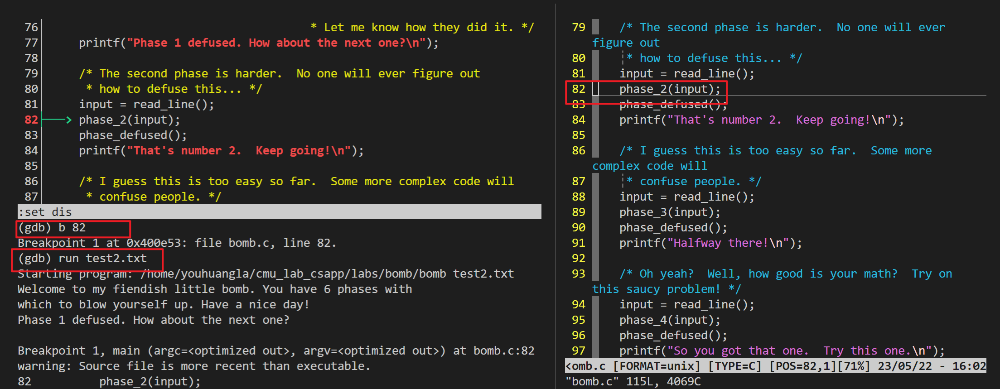

用`finish`跳出`sscanf`共享库函数

```gdb
rax 0x0 -> 0x6
```

说明返回的确实是 6 ，6 > 5 满足 jg 的条件。不会炸

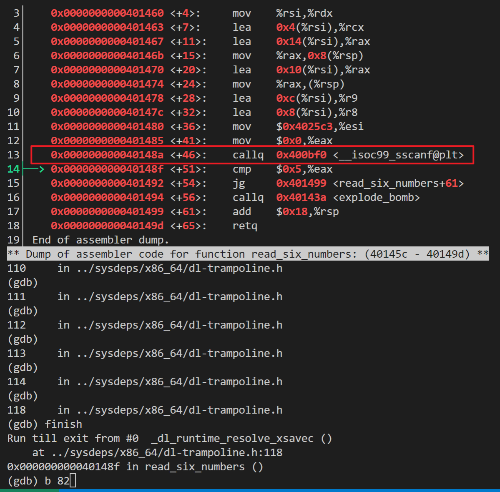

```assembly
  401480:	be c3 25 40 00       	mov    $0x4025c3,%esi; esi = 0x4025c3   等价于rsi，第2个参数。(gdb) x/s 0x4025c3           0x4025c3:       "%d %d %d %d %d %d"
```

finish 后，可以查看 sscanf 中存的第二个参数，即格式字符串，见 [###back to phase_2](###back to phase_2)中的注释。

##### back to read_six_numbers

```assembly
  40148f:	83 f8 05             	cmp    $0x5,%eax; eax存储返回值，从0到5，代表sscanf读出的数字个数 - 1 
  401492:	7f 05                	jg     401499 <read_six_numbers+0x3d>;if (%eax > 0x5) {goto 401499 <read_six_numbers+0x3d>} else explode_bomb
```

如果输入的数字为 6 个及以上，那么炸弹不会爆炸。

`si`直到`retq`

#### back to phase_2

```assembly
0000000000400efc <phase_2>:
  400efc:	55                   	push   %rbp
  400efd:	53                   	push   %rbx
  400efe:	48 83 ec 28          	sub    $0x28,%rsp; %rsp -= 40
  400f02:	48 89 e6             	mov    %rsp,%rsi; %rsi = %rsp 
  400f05:	e8 52 05 00 00       	callq  40145c <read_six_numbers>
  400f0a:	83 3c 24 01          	cmpl   $0x1,(%rsp); %rsp: Register of Stack Pointer 
  400f0e:	74 20                	je     400f30 <phase_2+0x34>; if (*(%rsp) == 1) {goto line20} 
  400f10:	e8 25 05 00 00       	callq  40143a <explode_bomb>
  400f15:	eb 19                	jmp    400f30 <phase_2+0x34>
  400f17:	8b 43 fc             	mov    -0x4(%rbx),%eax; %eax = (%rbx) - 0x4 //(%rbx) store the address of the array
  400f1a:	01 c0                	add    %eax,%eax; %eax += %eax double
  400f1c:	39 03                	cmp    %eax,(%rbx)
  400f1e:	74 05                	je     400f25 <phase_2+0x29>; if (%eax == (%rbx)) {goto line16} else explode_bomb;
  400f20:	e8 15 05 00 00       	callq  40143a <explode_bomb>
  400f25:	48 83 c3 04          	add    $0x4,%rbx; %rbx += 4
  400f29:	48 39 eb             	cmp    %rbp,%rbx
  400f2c:	75 e9                	jne    400f17 <phase_2+0x1b>; if (%rbx != %rbx) {goto line 11}/*loop continue*/ 
  400f2e:	eb 0c                	jmp    400f3c <phase_2+0x40>; else {goto line23}
  400f30:	48 8d 5c 24 04       	lea    0x4(%rsp),%rbx; %rbx = *((%rsp) + 4) //%rbx now store the address of second element of input int array
  400f35:	48 8d 6c 24 18       	lea    0x18(%rsp),%rbp; %rbp = *((%rsp) + 24)
  400f3a:	eb db                	jmp    400f17 <phase_2+0x1b>; goto line11
  400f3c:	48 83 c4 28          	add    $0x28,%rsp; %rsp += 40 // save by caller , see line4
  400f40:	5b                   	pop    %rbx; 
  400f41:	5d                   	pop    %rbp
  400f42:	c3                   	retq   
```

从 `read_six_numbers`函数中出来。

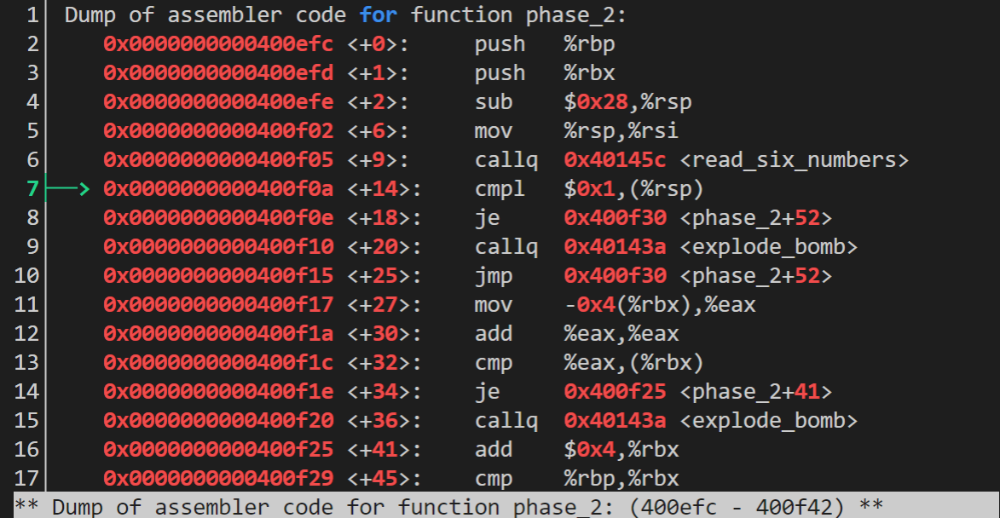

继续`si`，到这条指令

```gdb
22├──> 0x0000000000400f3a <+62>:    jmp    0x400f17 <phase_2+27>
```

跳到

```gdb
11├──> 0x0000000000400f17 <+27>:    mov    -0x4(%rbx),%eax
```

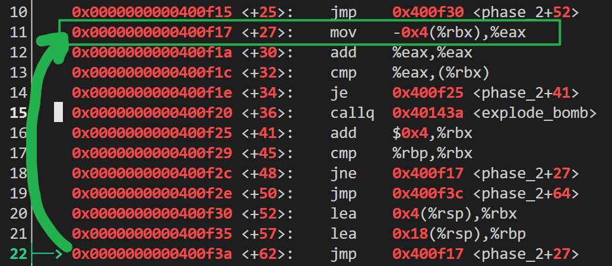

两次大的循环，第三次跳到了`explode bomb`函数，说明头两次“瞎猫碰到死耗子”了。蒙对了？回想一下，我们输入的是

```shell
1 2 3 4 5 6 7
```

也就是 1 和 2 满足条件，不会爆炸。

鉴于`si`老是按的太快，学习反向调试`reverse-stepi`

[GDB 反向調試（Reverse Debugging） \| Jason note](https://jasonblog.github.io/note/gdb/gdb_fan_xiang_diao_shi_ff08_reverse_debugging.html)

```gdb
(gdb) reverse-stepi
Target native does not support this command.
```

貌似不支持。。。

慢慢单步调试(我sb了，可以打断点的`b explode_bomb`)，分析到底是什么条件？

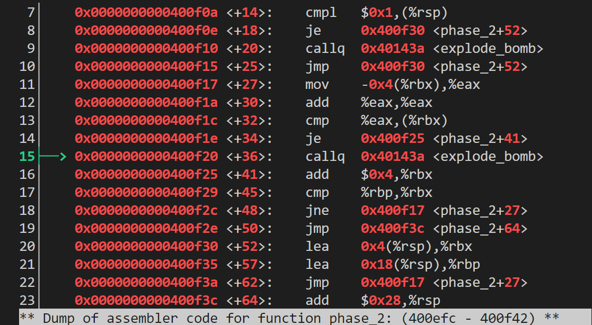

```gdb
13│    0x0000000000400f1c <+32>:    cmp    %eax,(%rbx)
14│    0x0000000000400f1e <+34>:    je     0x400f25 <phase_2+41>
15├──> 0x0000000000400f20 <+36>:    callq  0x40143a <explode_bomb>
```

见汇编中的注释

##### cmp

```gdb
13│    0x0000000000400f1c <+32>:    cmp    %eax,(%rbx)
```

> ZF: 零标志。最近的操作得出的结果为0。
>
> 除了只设置条件码而不更新目的寄存器之外，CMP 指令与SUB 指令的行为是一样的。
>
> 《CSAPP》Eng p201 -> 3.6 控制 -> 3.6.1 状态码

##### je

```gdb
14│    0x0000000000400f1e <+34>:    je     0x400f25 <phase_2+41>
```

> 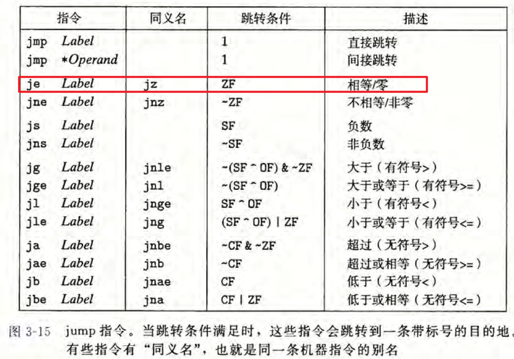
>
> 《CSAPP》Eng p201 -> 3.6 控制 -> 3.6.3 跳转指令 Figure 3.15

也就是 %eax 和 (%rbx) 相等

> print /x $rax 				Print contents of %rax in hex
>
> 《gdb-notes》

```gdb
(gdb) print /x $eax
$2 = 0x4
```

(%rbx) 说明取的寄存器 rbx 存的是一个指针的地址，(%rbx) 取该指针所指向的地址值。


原图中有 rbx 是64位，没截全。但是存的应该只有 32 位的 4 字节 int 型。

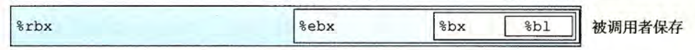

> print *(int *) ($rsp+8) 		Print integer at address %rsp + 8
>
> 《gdb-notes》

```gdb
(gdb) print *(int *)($rbx)
$4 = 3
```

左边的`$`表示 print 的变量个数

```gdb
(gdb) print $rbx  
$1 = 140737488347064
(gdb) print x $eax
No symbol "x" in current context.
(gdb) print /x $eax
$2 = 0x4
(gdb) print /x ($rbx)
$3 = 0x7fffffffdfb8
(gdb) print *(int *)($rbx)
$4 = 3
```

可以看到这就是我输入的 3，那么比较的数

```gdb
(gdb) print $eax
$10 = 4
```

$eax 中存的才是正确答案 4

那么，前三个数分别是 1 2 4，即如果你耐心点一个个跑，在`explode bomb`打断点，跑六次即可。

#### 循环分析

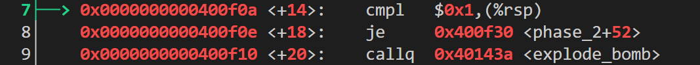

```gdb
 7├──> 0x0000000000400f0a <+14>:    cmpl   $0x1,(%rsp)
```

说明第 (%rsp) 所存的数一定是 1，不然爆炸。

其实在`strings_not_equal`函数中就有了 rsp 寄存器的出现。

在[strings_not_equal](###strings_not_equal)的图片中，我们可以发现


```gdb
line 4: sub $0x28,%rsp
```

这条指令中，寄存器 %rsp 用作栈指针，去分配栈上的内存。

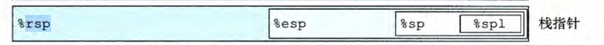

并自减了 40 个字节（其实也没啥用，只是想起来）

我们仔细分析循环就行，见 [###back to phase_2](###back to phase_2)中的注释。

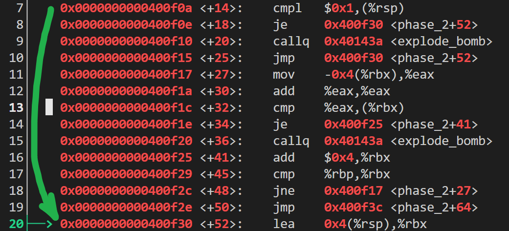

可以发现每次要对比的数都变为原来的两倍，而要求输入六个数字，故得出答案。

##### lea

```gdb
 20├──> 0x0000000000400f30 <+52>:    lea    0x4(%rsp),%rbx
```

这是一个加载有效地址(csapp 3.5.1)指令

> 加载有效地址（load effective address)指令leaq 实际上是movq 指令的变形。它的指令形式是从内存读数据到寄存器，但实际上它根本就没有引用内存。它的第一个操作数看上去是一个内存引用，但该指令并不是从指定的位置读人数据，而是将有效地址写入到目的操作数。

将 0x4(%rsp) (基址 + 偏移地址寻址)寻到的地址写入到 %rbx 中，这样

##### jmp 

> jmp 指令是无条件跳转。它可以是直接跳转，即跳转目标是作为指令的一部分编码的；也可以是间接跳转，即跳转目标是从寄存器或内存位置中读出的。汇编语言中，直接跳转是给出一个标号作为跳转目标的，例如上面所示代码中的标号 “.L1” 。
>
> 间接跳转的写法是`*`后面跟一个操作数指示符，使用图3-3 中描述的内存操作数格式中的一种。举个例子，指令
>
> `jmp * %rax`
>
> 用寄存器 %rax 中的值作为跳转目标，而指令
>
> `jmp *(%rax)`
>
> 以 %rax 中的值作为读地址，从内存中读出跳转目标。
>
> 《CSAPP》Eng p201 -> 3.6 控制 -> 3.6.3 跳转指令

#### Answer

```shell
Border relations with Canada have never been better.
1 2 4 8 16 32
```

### phase_3

```assembly
0000000000400f43 <phase_3>:
  400f43:	48 83 ec 18          	sub    $0x18,%rsp; %rsp -= 18
  400f47:	48 8d 4c 24 0c       	lea    0xc(%rsp),%rcx; %rcx = *((%rsp) + 12)
  400f4c:	48 8d 54 24 08       	lea    0x8(%rsp),%rdx; %rdx = *((%rsp) + 8)
  400f51:	be cf 25 40 00       	mov    $0x4025cf,%esi; %esi = $0x4025cf
  400f56:	b8 00 00 00 00       	mov    $0x0,%eax; %eax = 0
  400f5b:	e8 90 fc ff ff       	callq  400bf0 <__isoc99_sscanf@plt>
  400f60:	83 f8 01             	cmp    $0x1,%eax; 
  400f63:	7f 05                	jg     400f6a <phase_3+0x27>; if (%eax > 1) {goto line11} else explode_bomb //input must have at least 2 number,else bomb
  400f65:	e8 d0 04 00 00       	callq  40143a <explode_bomb>
  400f6a:	83 7c 24 08 07       	cmpl   $0x7,0x8(%rsp); 
  400f6f:	77 3c                	ja     400fad <phase_3+0x6a>; if (7 > *((%rsp) + 8)) {bomb} 7 must be greater than input number to explode, so input a number less or qual to 7
  400f71:	8b 44 24 08          	mov    0x8(%rsp),%eax; %eax = *((%rsp) + 8) assign first number to %eax
  400f75:	ff 24 c5 70 24 40 00 	jmpq   *0x402470(,%rax,8); goto *M[0x402470 + 0 + R[%rax] * 8] , that is *M[0x402470 + R[%rax] * 8], as %rax include %eax, -> *M[0x402470 + R[%eax] * 8] -> *M[0x402470 + fir_num * 8]
  400f7c:	b8 cf 00 00 00       	mov    $0xcf,%eax
  400f81:	eb 3b                	jmp    400fbe <phase_3+0x7b>
  400f83:	b8 c3 02 00 00       	mov    $0x2c3,%eax; 6 false
  400f88:	eb 34                	jmp    400fbe <phase_3+0x7b>
  400f8a:	b8 00 01 00 00       	mov    $0x100,%eax
  400f8f:	eb 2d                	jmp    400fbe <phase_3+0x7b>
  400f91:	b8 85 01 00 00       	mov    $0x185,%eax
  400f96:	eb 26                	jmp    400fbe <phase_3+0x7b>
  400f98:	b8 ce 00 00 00       	mov    $0xce,%eax
  400f9d:	eb 1f                	jmp    400fbe <phase_3+0x7b>
  400f9f:	b8 aa 02 00 00       	mov    $0x2aa,%eax; 6 true
  400fa4:	eb 18                	jmp    400fbe <phase_3+0x7b>; goto line33
  400fa6:	b8 47 01 00 00       	mov    $0x147,%eax
  400fab:	eb 11                	jmp    400fbe <phase_3+0x7b>
  400fad:	e8 88 04 00 00       	callq  40143a <explode_bomb>
  400fb2:	b8 00 00 00 00       	mov    $0x0,%eax
  400fb7:	eb 05                	jmp    400fbe <phase_3+0x7b>
  400fb9:	b8 37 01 00 00       	mov    $0x137,%eax
  400fbe:	3b 44 24 0c          	cmp    0xc(%rsp),%eax;
  400fc2:	74 05                	je     400fc9 <phase_3+0x86>; if (%eax > *(%rsp) + 12) // 0xc == 12. {goto }
  400fc4:	e8 71 04 00 00       	callq  40143a <explode_bomb>
  400fc9:	48 83 c4 18          	add    $0x18,%rsp
  400fcd:	c3                   	retq   

```

```gdb
(gdb) b explode_bomb
Breakpoint 1 at 0x40143a
(gdb) b phase_3
Breakpoint 2 at 0x400f43
(gdb) run test3.txt
Starting program: /home/youhuangla/cmu_lab_csapp/labs/bomb/bomb test3.txt
Welcome to my fiendish little bomb. You have 6 phases with
which to blow yourself up. Have a nice day!
Phase 1 defused. How about the next one?
That's number 2.  Keep going!
1 2 3 4

Breakpoint 2, 0x0000000000400f43 in phase_3 ()
```

`si` 直到 `sscanf`

```gdb
(gdb) finish
Run till exit from #0  __isoc99_sscanf (s=0x603820 <input_strings+160> "121 144 169 196",
    format=0x4025cf "%d %d") at isoc99_sscanf.c:26
0x0000000000400f60 in phase_3 ()
Value returned is $2 = 2
```

sscanf 返回了一个 2，即参数个数为 2 ，可猜测应读入两个 int。

和前面一样，`sscanf`函数前应该先传入一个格式化字符串给 %esi （存第二个参数的寄存器的 32 位名称）。

所以第 5 行即将被存入 %esi 的地址即为格式化字符串的地址。

```gdb
 1│ Dump of assembler code for function phase_3:
 2│    0x0000000000400f43 <+0>:     sub    $0x18,%rsp
 3│    0x0000000000400f47 <+4>:     lea    0xc(%rsp),%rcx
 4│    0x0000000000400f4c <+9>:     lea    0x8(%rsp),%rdx
 5│    0x0000000000400f51 <+14>:    mov    $0x4025cf,%esi
 6│    0x0000000000400f56 <+19>:    mov    $0x0,%eax
 7│    0x0000000000400f5b <+24>:    callq  0x400bf0 <__isoc99_sscanf@plt>
 8├──> 0x0000000000400f60 <+29>:    cmp    $0x1,%eax
 
 (gdb) x/s 0x4025cf
0x4025cf:       "%d %d"
```

然后 si 在这里爆了

```gdb
  400f6a:	83 7c 24 08 07       	cmpl   $0x7,0x8(%rsp); 
  400f6f:	77 3c                	ja     400fad <phase_3+0x6a>; if (*((%rsp) + 8) > 7) {bomb} 

(gdb) print /x *(int *)($rsp+8)
$4 = 0xffffe0d8
```

所以试着改成 6 ？

```shell
1 6#1 7

BOOM!!!
```

看来不是那么简单，这次输入 1 再次来到生死关

```gdb
 6│    0x0000000000400f56 <+19>:    mov    $0x0,%eax
 7│    0x0000000000400f5b <+24>:    callq  0x400bf0 <__isoc99_sscanf@plt>
 8│    0x0000000000400f60 <+29>:    cmp    $0x1,%eax
 9│    0x0000000000400f63 <+32>:    jg     0x400f6a <phase_3+39>
10│    0x0000000000400f65 <+34>:    callq  0x40143a <explode_bomb>
11├──> 0x0000000000400f6a <+39>:    cmpl   $0x7,0x8(%rsp)
12│    0x0000000000400f6f <+44>:    ja     0x400fad <phase_3+106>

(gdb) print /x *(int *)($rsp+8)
$5 = 0x1
```

爆炸。

```assembly
  400f60:	83 f8 01             	cmp    $0x1,%eax; 
  400f63:	7f 05                	jg     400f6a <phase_3+0x27>; if (%eax > 1) {goto line11} else explode_bomb //input must have at least 2 number,else bomb
```

我们要输入两个数字。输入 22 33 ，再次来到这里

```gdb
 4│    0x0000000000400f4c <+9>:     lea    0x8(%rsp),%rdx
 5│    0x0000000000400f51 <+14>:    mov    $0x4025cf,%esi
 6│    0x0000000000400f56 <+19>:    mov    $0x0,%eax
 7│    0x0000000000400f5b <+24>:    callq  0x400bf0 <__isoc99_sscanf@plt>
 8│    0x0000000000400f60 <+29>:    cmp    $0x1,%eax
 9│    0x0000000000400f63 <+32>:    jg     0x400f6a <phase_3+39>
10│    0x0000000000400f65 <+34>:    callq  0x40143a <explode_bomb>
11├──> 0x0000000000400f6a <+39>:    cmpl   $0x7,0x8(%rsp)
12│    0x0000000000400f6f <+44>:    ja     0x400fad <phase_3+106>

(gdb) print /x *(int *)($rsp+8) 
$7 = 0x16
```

0x16 即 22，由

```assembly
  400f6a:	83 7c 24 08 07       	cmpl   $0x7,0x8(%rsp); 
  400f6f:	77 3c                	ja     400fad <phase_3+0x6a>; if (7 > *((%rsp) + 8)) {bomb} 7 must be greater than input number to explode, so input a number less or qual to 7
```

所以这个第一个输入的数字必须小于等于 7， 22 > 7 故爆炸。

cmp 等价于 sub，

```gdb
29├──> 0x0000000000400fad <+106>:   callq  0x40143a <explode_bomb>
```

[x86 \- Difference between JA and JG in assembly \- Stack Overflow](https://stackoverflow.com/questions/20906639/difference-between-ja-and-jg-in-assembly) 注意，so中的回答里，寄存器顺序不一样

>  注意cmpq 指令的比较顺序（第2 行）。虽然参数列出的顺序先是％rsi(b)再是％rdi(a),实际上比较的是a 和b
>
> p173 3.6.2

再来，输入6 22，在这炸了

```gdb
32│    0x0000000000400fb9 <+118>:   mov    $0x137,%eax
33├──> 0x0000000000400fbe <+123>:   cmp    0xc(%rsp),%eax
34│    0x0000000000400fc2 <+127>:   je     0x400fc9 <phase_3+134>
35│    0x0000000000400fc4 <+129>:   callq  0x40143a <explode_bomb>
36│    0x0000000000400fc9 <+134>:   add    $0x18,%rsp
37│    0x0000000000400fcd <+138>:   retq
```

从

```assembly
  400f75:	ff 24 c5 70 24 40 00 	jmpq   *0x402470(,%rax,8); goto *M[0x402470 + 0 + R[%rax] * 8] , that is *M[0x402470 + R[%rax] * 8], as %rax include %eax, -> *M[0x402470 + R[%eax] * 8] -> *M[0x402470 + fir_num * 8]
```

这是个 比例变址寻址 指令。


开始分析，这个jmpq，[assembly \- What does this Intel jmpq instruction do? \- Stack Overflow](https://stackoverflow.com/questions/20251097/what-does-this-intel-jmpq-instruction-do)可知等价于 jmp

```gdb
13├──> 0x0000000000400f71 <+46>:    mov    0x8(%rsp),%eax
14|    0x0000000000400f75 <+50>:    jmpq   *0x402470(,%rax,8)

(gdb) print /x *(0x402470 + $rax * 8)
$14 = 0x400f83
```

所以跳到这里

```assembly
  400f83:	b8 c3 02 00 00       	mov    $0x2c3,%eax; %eax = 0x2c3
  400f88:	eb 34                	jmp    400fbe <phase_3+0x7b>
```

个锤子，过早打印了`*(0x402470 + $rax * 8)`的值，导致

```assembly
  400f71:	8b 44 24 08          	mov    0x8(%rsp),%eax; %eax = *((%rsp) + 8) assign first number to %eax
```

还没有执行，而该指令执行后改变了后面的 rax 中存的值

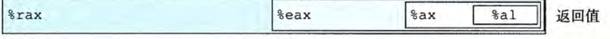

```assembly
  400f71:	8b 44 24 08          	mov    0x8(%rsp),%eax; %eax = *((%rsp) + 8) assign first number to %eax
  400f75:	ff 24 c5 70 24 40 00 	jmpq   *0x402470(,%rax,8); goto *M[0x402470 + 0 + R[%rax] * 8] , that is *M[0x402470 + R[%rax] * 8], as %rax include %eax, -> *M[0x402470 + R[%eax] * 8] -> *M[0x402470 + fir_num * 8]
```

#### Bug

上一步中过早打印了，要到这里才能打印

```gdb
13│    0x0000000000400f71 <+46>:    mov    0x8(%rsp),%eax
14├──> 0x0000000000400f75 <+50>:    jmpq   *0x402470(,%rax,8)

(gdb) print /x *(0x402470 + $rax * 8)
$4 = 0x400f9f
```

故应该跳到这里

```assembly
  400f9f:	b8 aa 02 00 00       	mov    $0x2aa,%eax; 6 true 
  400fa4:	eb 18                	jmp    400fbe <phase_3+0x7b>; goto line33
```

$eax ==  0x2aa == 682

查看汇编可知有很多个`  400f88:	eb 34                	jmp    400fbe <phase_3+0x7b>`语句，但是前一个`mov`语句却不相同。

所以我们来到这里后都有这样两条指令：

```assembly
  400fbe:	3b 44 24 0c          	cmp    0xc(%rsp),%eax; 
  400fc2:	74 05                	je     400fc9 <phase_3+0x86>; if (%eax == *(%rsp) + 12) // 0xc == 12. {goto ...}
```

```gdb
33├──> 0x0000000000400fbe <+123>:   cmp    0xc(%rsp),%eax
34│    0x0000000000400fc2 <+127>:   je     0x400fc9 <phase_3+134>

(gdb) print $eax
$21 = 682
(gdb) print /x $eax
$22 = 0x2aa
(gdb) print *(int *)($rsp+0xc)
$23 = 22
```

这里 0xc(%rsp) 是 （基址+偏移量）寻址

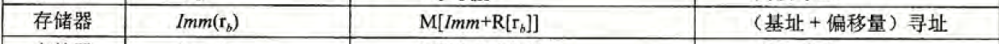

%eax == 682

*(%rsp + 0xc) : 22 ，即我们输入的第二个值！

if (%eax == *(%rsp) + 12)	goto :

```assembly
  400fc9:	48 83 c4 18          	add    $0x18,%rsp
  400fcd:	c3                   	retq   
```

正常返回，故原本的 22 应该写 682 。

> 这段代码的后面有很多的jmp语句，而且极其的有规律，估计是个跳转表即switch语句，要跳转过去的地址是0x402470+%rax+8,而eax就是我们输入的第一个数，然后每一个jmp可以看做是一个case语句，每一个case语句我们看到都是在将一个参数赋值给eax,比如0xcf、0x2c3等，然后所有case统一跳转到0x400fbe(#这里可以等价于做break)，而在这个地方则是将我们输入的第二个数和eax中的值比较，相等就跳过炸弹否则爆炸，而刚才分析了eax的值是根据第一个值跳转到不同的case得到的。那么有多少个case就应该有多少个解题的答案，我们只需要确定第一个数然后顺着挑战到其中一个case，然后看这个case中的常量值是多少即为我们输入的第二个值。
>
>
> 作者：编程指北
> 链接：https://juejin.cn/post/6874568541229334541
> 来源：稀土掘金
> 著作权归作者所有。商业转载请联系作者获得授权，非商业转载请注明出处。

#### Answer

```shell
youhuangla@Ubuntu bomb % ./bomb test3.txt                                                         [0]
Welcome to my fiendish little bomb. You have 6 phases with
which to blow yourself up. Have a nice day!
Phase 1 defused. How about the next one?
That's number 2.  Keep going!
6 682
Halfway there!
```


### phase_4

```assembly
000000000040100c <phase_4>:
  40100c:	48 83 ec 18          	sub    $0x18,%rsp
  401010:	48 8d 4c 24 0c       	lea    0xc(%rsp),%rcx
  401015:	48 8d 54 24 08       	lea    0x8(%rsp),%rdx
  40101a:	be cf 25 40 00       	mov    $0x4025cf,%esi
  40101f:	b8 00 00 00 00       	mov    $0x0,%eax; $eax = 0
  401024:	e8 c7 fb ff ff       	callq  400bf0 <__isoc99_sscanf@plt>
  401029:	83 f8 02             	cmp    $0x2,%eax; 
  40102c:	75 07                	jne    401035 <phase_4+0x29>; if ($eax != 2) {goto explode} else continue
  40102e:	83 7c 24 08 0e       	cmpl   $0xe,0x8(%rsp)
  401033:	76 05                	jbe    40103a <phase_4+0x2e>; if (*(int *)($rsp+8) <= 0xe) {goto line13} else explode
  401035:	e8 00 04 00 00       	callq  40143a <explode_bomb>
  40103a:	ba 0e 00 00 00       	mov    $0xe,%edx; $edx = e
  40103f:	be 00 00 00 00       	mov    $0x0,%esi; $esi = 0
  401044:	8b 7c 24 08          	mov    0x8(%rsp),%edi; $edi = *(int *)($rsp + 8) = 1
  401048:	e8 81 ff ff ff       	callq  400fce <func4>
  40104d:	85 c0                	test   %eax,%eax
  40104f:	75 07                	jne    401058 <phase_4+0x4c>; if fir_num = 4, jump from here to explode. if ($eax != 0) {explode}
  401051:	83 7c 24 0c 00       	cmpl   $0x0,0xc(%rsp);
  401056:	74 05                	je     40105d <phase_4+0x51>; if (*(int *)($rsp + 8) == 0) {not explode} else {explode}
  401058:	e8 dd 03 00 00       	callq  40143a <explode_bomb>; if fir_num = 4, explode here.
  40105d:	48 83 c4 18          	add    $0x18,%rsp
  401061:	c3                   	retq   
```

由汇编中

```assembly
  401029:	83 f8 02             	cmp    $0x2,%eax
  40102c:	75 07                	jne    401035 <phase_4+0x29>
```

和

```gdb
 2│    0x000000000040100c <+0>:     sub    $0x18,%rsp
 3│    0x0000000000401010 <+4>:     lea    0xc(%rsp),%rcx
 4│    0x0000000000401015 <+9>:     lea    0x8(%rsp),%rdx
 5├──> 0x000000000040101a <+14>:    mov    $0x4025cf,%esi
 
 
(gdb) x/s 0x4025cf
0x4025cf:       "%d %d"
```

得知要输入两个数字，如果输入数字个数错了就炸，我们输入数字 1 2 。

```gdb
 8│    0x0000000000401029 <+29>:    cmp    $0x2,%eax
 9│    0x000000000040102c <+32>:    jne    0x401035 <phase_4+41>
10├──> 0x000000000040102e <+34>:    cmpl   $0xe,0x8(%rsp)
```

第一关过

```gdb
10├──> 0x000000000040102e <+34>:    cmpl   $0xe,0x8(%rsp)
11│    0x0000000000401033 <+39>:    jbe    0x40103a <phase_4+46>

(gdb) print *(int *)($rsp+8)
$1 = 1
(gdb) print *(int *)($rsp+12)
$2 = 2
```

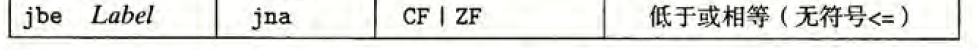

那么这里，jbe 的作用：输入的第一个数一定要小于等于 14 。

```assembly
  40102e:	83 7c 24 08 0e       	cmpl   $0xe,0x8(%rsp)
  401033:	76 05                	jbe    40103a <phase_4+0x2e>; if (*(int *)($rsp+8) <= 0xe) {goto line13} else explode
; ......
  40103a:	ba 0e 00 00 00       	mov    $0xe,%edx ; line13, jump to here
```

继续 si 后在 func4 返回 phase_4 然后在这里爆炸

```gdb
0x0000000000401058 in phase_4 ()                                                         
(gdb) 
Breakpoint 2, 0x000000000040143a in explode_bomb ()
(gdb)
```

即在这里条件跳转不符合拆弹条件

```assembly
  401051:	83 7c 24 0c 00       	cmpl   $0x0,0xc(%rsp)
  401056:	74 05                	je     40105d <phase_4+0x51>
  401058:	e8 dd 03 00 00       	callq  40143a <explode_bomb>
```

逆向分析

```assembly
  401051:	83 7c 24 0c 00       	cmpl   $0x0,0xc(%rsp);
  401056:	74 05                	je     40105d <phase_4+0x51>; if (*(int *)($rsp + 8) == 0) {not explode} else {explode}
```

*(int *)($rsp + 8) 要等于 0 。再逆向走到 40104f，分析跳转条件。

```assembly
  40104d:	85 c0                	test   %eax,%eax;
  40104f:	75 07                	jne    401058 <phase_4+0x4c>; if ($eax & $eax != 0/*$eax != 0*/) {goto explode} else continue
  401051:	83 7c 24 0c 00       	cmpl   $0x0,0xc(%rsp);
  401056:	74 05                	je     40105d <phase_4+0x51>; if (*(int *)($rsp + 8) == 0) {not explode} else {explode}
```

> CF: 进位标志。最近的操作使最高位产生了进位。可用来检査无符号操作的溢出。
> ZF: 零标志。最近的操作得出的结果为0。
> SF: 符号标志。最近的操作得到的结果为负数。
> OF: 溢出标志。最近的操作导致一个补码溢出—— 正溢出或负溢出。
>
> TEST 指令的行为与AND 指令一样，除了它们只设置条件码而不改变目的寄存器的值。
> 典型的用法是，两个操作数是一样的（例如，testq %rax, %rax 用来检查 %rax 是负数、零，还是正数）， 或其中的一个操作数是一个掩码，用来指示哪些位应该被测试。
>
> CSAPP 3.6.1


所以为了不 explode ，

```assembly
  40104d:	85 c0                	test   %eax,%eax; $eax should be 0
```

$eax == 0

综上，炸弹要不炸

```shell
*(int *)($rsp + 8) == 0 && $eax == 0
```

故逆向分析

```assembly
  40103a:	ba 0e 00 00 00       	mov    $0xe,%edx
  40103f:	be 00 00 00 00       	mov    $0x0,%esi
  401044:	8b 7c 24 08          	mov    0x8(%rsp),%edi
  401048:	e8 81 ff ff ff       	callq  400fce <func4>
```

时，应抓住 $eax 和`*(int *)($rsp + 8)` 的变化，也等价于 `$rax` 和 `$esp` 的变化。

由

```assembly
  401044:	8b 7c 24 08          	mov    0x8(%rsp),%edi; 
```

得知`*(int *)($rsp + 8)` 的变化等价于 `*(int *)($edi + 8)`的变化。


所以等价于 `*(int *)($rdi + 8)`

#### func4

即将进入 func4 的寄存器`i r` 。

```gdb
16├──> 0x0000000000401048 <+60>:    callq  0x400fce <func4>

rax            0x2      2
rbx            0x7fffffffe0d8   140737488347352
rcx            0x0      0
rdx            0xe      14
rsi            0x0      0
rdi            0x1      1
rbp            0x402210 0x402210 <__libc_csu_init>
rsp            0x7fffffffdfd0   0x7fffffffdfd0
r8             0x0      0
```

进入 func4 分析

```assembly
0000000000400fce <func4>:
  400fce:	48 83 ec 08          	sub    $0x8,%rsp; $rsp -= 8
  400fd2:	89 d0                	mov    %edx,%eax; $eax = $edx = $rdx = 0xe = 14
  400fd4:	29 f0                	sub    %esi,%eax; $eax -= $esi -> $eax -= $rsi -> %eax = 14
  400fd6:	89 c1                	mov    %eax,%ecx; $ecx = 14
  400fd8:	c1 e9 1f             	shr    $0x1f,%ecx; shift logic right 31; $ecx = 0
  400fdb:	01 c8                	add    %ecx,%eax; $eax += $ecx -> $eax = 14
  400fdd:	d1 f8                	sar    %eax; shift arithmetic right $eax = 7
  400fdf:	8d 0c 30             	lea    (%rax,%rsi,1),%ecx; $ecx = $rax + $rsi * 1
  400fe2:	39 f9                	cmp    %edi,%ecx; edi
  400fe4:	7e 0c                	jle    400ff2 <func4+0x24>; if ($ecx <= $edi(first_num) ) {goto line 16} else continue;
  400fe6:	8d 51 ff             	lea    -0x1(%rcx),%edx; $edx = $rcx - 1
  400fe9:	e8 e0 ff ff ff       	callq  400fce <func4>; back to the beginning of func4
  400fee:	01 c0                	add    %eax,%eax
  400ff0:	eb 15                	jmp    401007 <func4+0x39>; maybe
  400ff2:	b8 00 00 00 00       	mov    $0x0,%eax
  400ff7:	39 f9                	cmp    %edi,%ecx; edi
  400ff9:	7d 0c                	jge    401007 <func4+0x39>; maybe
  400ffb:	8d 71 01             	lea    0x1(%rcx),%esi
  400ffe:	e8 cb ff ff ff       	callq  400fce <func4>
  401003:	8d 44 00 01          	lea    0x1(%rax,%rax,1),%eax; $eax = ($rax + $rax * 1) + 1 = 2 * $rax + 1
  401007:	48 83 c4 08          	add    $0x8,%rsp; rsp
  40100b:	c3                   	retq   
```

在 line 2, 22 有两处 rsp 的变化，两处 edi (lnie 10, 17) 变化，没有 rdi

但有多处 eax

```assembly
  400fd8:	c1 e9 1f             	shr    $0x1f,%ecx; logic right shift 31
```

> 左移指令有两个名字：SAL 和SHL 两者的效果是一样的，都是将右边填上 0 。
>
> 右移指令不同，SAR 执行算术移位（填上符号位）, 而SHR 执行逻辑移位（填上 0 ）。
>
> 移位操作的目的操作数可以是一个寄存器或是一个内存位置。图 3-10 中用 $>>_a$ （算术）和$>>_d$（逻辑）来表示这两种不同的右移运算。
>
> 3.5.3

[assembly \- Which operators use sal, shl, sar or shr \- Reverse Engineering Stack Exchange](https://reverseengineering.stackexchange.com/questions/20513/which-operators-use-sal-shl-sar-or-shr#:~:text=In%20C%20the%20operator%20for,arithmetic%20or%20a%20logical%20shift.)

可知 shr 代表 C语言中的`>>`，csapp里在哪讲过来着？

```assembly
 5│    0x0000000000400fd6 <+8>:     mov    %eax,%ecx
 6│    0x0000000000400fd8 <+10>:    shr    $0x1f,%ecx
 7├──> 0x0000000000400fdb <+13>:    add    %ecx,%eax
 
(gdb) print $ecx
$14 = 0
```

迷惑汇编，没有第一个操作数的算数右移。

```assembly
  400fdd:	d1 f8                	sar    %eax; shift arithmetic right
```

```gdb
 7│    0x0000000000400fdb <+13>:    add    %ecx,%eax
 8│    0x0000000000400fdd <+15>:    sar    %eax
 9├──> 0x0000000000400fdf <+17>:    lea    (%rax,%rsi,1),%ecx

0x0000000000400fdd in func4 ()
(gdb) print $eax
$15 = 14
(gdb) si    
0x0000000000400fdf in func4 ()
(gdb) print $eax
$16 = 7
```

> Looks like the dissembler used short-hand for `SAR EAX,1` which has an opcode of `0xD1F8`.
>
> [SAR command in X86 assembly with one parameter \- Stack Overflow](https://stackoverflow.com/questions/12813962/sar-command-in-x86-assembly-with-one-parameter)

> ### IA32 and x86-64 Documentation
>
> The definitive [Intel 64 and IA-32 Architectures Software Developer's Manuals](http://www.intel.com/products/processor/manuals/) are available online. These include:
>
> - *Volume 1: Basic Architecture*
> - *Volume 2a: Instruction Set Reference, A-M*
> - *Volume 2b: Instruction Set Reference, N-Z*
> - *Volume 3a: System Programming Guide, Part 1*
> - *Volume 3b: System Programming Guide, Part 2*
>
> [CS:APP2e, Bryant and O'Hallaron](http://csapp.cs.cmu.edu/public/students.html)

在 CSAPP 官网的提供的[Intel 64 and IA-32 Architectures Software Developer's Manuals](http://www.intel.com/products/processor/manuals/) 上能下载到 SO 第一个回答的文档

> [Intel® 64 and IA-32 Architectures Software Developer's Manual Combined Volumes 2A, 2B, 2C, and 2D: Instruction Set Reference, A- Z 英特尔64和 ia-32架构软件开发人员手册合并卷2a，2B，2C 和2d: 指令集参考，a-z](https://cdrdv2.intel.com/v1/dl/getContent/671110)
>
> [Intel® 64 and IA\-32 Architectures Software Developer Manuals](https://www.intel.com/content/www/us/en/developer/articles/technical/intel-sdm.html)

 [325383-sdm-vol-2abcd.pdf](materia\csapp\325383-sdm-vol-2abcd.pdf) 

我也没找到。按 SO 的回答理解，与 gdb 的 print 结果来看，应该是算数右移了一位，即 `$eax /= 2` 。


```assembly
  400fdf:	8d 0c 30             	lea    (%rax,%rsi,1),%ecx; 
```

比例变址寻址

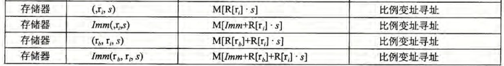

3.4.1

```gdb
 9├──> 0x0000000000400fdf <+17>:    lea    (%rax,%rsi,1),%ecx

(gdb) i r
rax            0x7      7
......
rsi            0x0      0
......
(gdb) print ($rax + $rsi * 1)
$18 = 7
```

```assembly
  400fe2:	39 f9                	cmp    %edi,%ecx; edi
  400fe4:	7e 0c                	jle    400ff2 <func4+0x24>; if ($ecx <= $edi(first_num) ) {goto line 16} else continue;
```

```gdb
 9├──> 0x0000000000400fdf <+17>:    lea    (%rax,%rsi,1),%ecx
10│    0x0000000000400fe2 <+20>:    cmp    %edi,%ecx
11│    0x0000000000400fe4 <+22>:    jle    0x400ff2 <func4+36>

(gdb) print $edi
$19 = 1
```

所以第一个输入的是 1 放在 $edi 中，在这里与 7 比较。

现对该 lea 语句分析

```assembly
  400fe6:	8d 51 ff             	lea    -0x1(%rcx),%edx
```

```gdb
10│    0x0000000000400fe2 <+20>:    cmp    %edi,%ecx
11│    0x0000000000400fe4 <+22>:    jle    0x400ff2 <func4+36>
12├──> 0x0000000000400fe6 <+24>:    lea    -0x1(%rcx),%edx
13│    0x0000000000400fe9 <+27>:    callq  0x400fce <func4>

0x0000000000400fe6 in func4 ()
(gdb) print ($rcx - 1)
$24 = 6
(gdb) print $edx
$25 = 14

10│    0x0000000000400fe2 <+20>:    cmp    %edi,%ecx
11│    0x0000000000400fe4 <+22>:    jle    0x400ff2 <func4+36>
12│    0x0000000000400fe6 <+24>:    lea    -0x1(%rcx),%edx
13├──> 0x0000000000400fe9 <+27>:    callq  0x400fce <func4>

0x0000000000400fe9 in func4 ()
(gdb) print ($rcx - 1)
$27 = 6
(gdb) print $edx
$28 = 6
```

[assembly \- What is the difference between MOV and LEA? \- Stack Overflow](https://stackoverflow.com/questions/1699748/what-is-the-difference-between-mov-and-lea/58981392#58981392)

所以这里等价于`$edx = $rcx - 1`

所以想要打破循环，唯一的方法就是在下面第 2 行跳出去。

```assembly
  400fe2:	39 f9                	cmp    %edi,%ecx; edi
  400fe4:	7e 0c                	jle    400ff2 <func4+0x24>; if ($ecx <= $edi(first_num) ) {goto line 16} else continue;
  400fe6:	8d 51 ff             	lea    -0x1(%rcx),%edx; $edx = $rcx - 1
  400fe9:	e8 e0 ff ff ff       	callq  400fce <func4>; back to the beginning of func4
```

条件是

`$ecx > $edi(first_num)`

#### reverse and back to phase_4

寄了，回看想到，第二个数字由 phase_3 中的

```assembly
  400fbe:	3b 44 24 0c          	cmp    0xc(%rsp),%eax;
  400fc2:	74 05                	je     400fc9 <phase_3+0x86>; if (%eax > *(%rsp) + 12) // 0xc == 12. {goto }
```

可知，只要第二个数字为 0 即可。

第一个数字填入 3 ，居然可以

```shell
youhuangla@Ubuntu bomb % ./bomb test4.txt                                                                                         [8]
Welcome to my fiendish little bomb. You have 6 phases with
which to blow yourself up. Have a nice day!
Phase 1 defused. How about the next one?
That's number 2.  Keep going!
Halfway there!
3 0
So you got that one.  Try this one.
^CSo you think you can stop the bomb with ctrl-c, do you?
Well...OK. :-)
```

我只能说瞎猫了，这里第一个数字只能为 3 。

输入 4 0 试试，在这里炸了

```gdb
0x000000000040100b in func4 ()
(gdb) 
0x000000000040104d in phase_4 ()
(gdb) 
0x000000000040104f in phase_4 ()
(gdb) 
0x0000000000401058 in phase_4 ()
(gdb) 

Breakpoint 2, 0x000000000040143a in explode_bomb ()
```

phase_4()

```assembly
  40104d:	85 c0                	test   %eax,%eax
  40104f:	75 07                	jne    401058 <phase_4+0x4c>; if fir_num = 4, jump from here to explode. if ($eax & $eax != 0 /*$eax < 0*/) {goto explode}

  401058:	e8 dd 03 00 00       	callq  40143a <explode_bomb>; if fir_num = 4, explode here.
```

which return from func4()

```assembly
  40100b:	c3                   	retq   
```

这个 test 语句后面的 jne 很关键，要想不寄， `$eax == 0`。

所以在这里打断点

```assembly
  40104f:	75 07                	jne    401058 <phase_4+0x4c>; if fir_num = 4, jump from here to explode.
```

```gdb
(gdb) b *0x40104f
Breakpoint 3 at 0x40104f
```

看看输入 3 和 4 时有什么区别。

输入 4 。

```gdb
Welcome to my fiendish little bomb. You have 6 phases with
which to blow yourself up. Have a nice day!
Phase 1 defused. How about the next one?
That's number 2.  Keep going!
Halfway there!
4 0

Breakpoint 1, 0x000000000040100c in phase_4 ()
(gdb) continue
Continuing.

Breakpoint 3, 0x000000000040104f in phase_4 ()
(gdb) print $eax
$32 = 2
```

输入 3 。到相同断点

```gdb
Breakpoint 3, 0x000000000040104f in phase_4 ()
(gdb) print $eax
$33 = 0
```

所以关键是 `$eax` ，即 `$rax` 。逆向可知

```assembly
  401048:	e8 81 ff ff ff       	callq  400fce <func4>
  40104d:	85 c0                	test   %eax,%eax
  40104f:	75 07                	jne    401058 <phase_4+0x4c>; if fir_num = 4, jump from here to explode. if ($eax != 0) {explode}
```

出 func4 后的 `$eax == 0`.

#### reverse back to func4

观察最后四条指令

```assembly
  400ffe:	e8 cb ff ff ff       	callq  400fce <func4>
  401003:	8d 44 00 01          	lea    0x1(%rax,%rax,1),%eax; $eax = ($rax + $rax * 1) + 1 = 2 * $rax + 1
  401007:	48 83 c4 08          	add    $0x8,%rsp; rsp
  40100b:	c3                   	retq  
```

如果执行了第一条，又返回 func4 ，故只能找一个跳转到第二条或者第三条的指令逆向

观察发现，只有 15 ， 18 两行可以

```assembly
;line15
  400ff0:	eb 15                	jmp    401007 <func4+0x39>

;line18
  400ff9:	7d 0c                	jge    401007 <func4+0x39>
```

##### line 18

18 这里如果通过第一条指令，`$eax == 0`，满足。

第二条和第三条指令均没有直接跳转的。

```assembly
  400ff2:	b8 00 00 00 00       	mov    $0x0,%eax
  400ff7:	39 f9                	cmp    %edi,%ecx; edi
  400ff9:	7d 0c                	jge    401007 <func4+0x39>; maybe
```

第一条指令

```assembly
  400ff2:	b8 00 00 00 00       	mov    $0x0,%eax
```

只能从 line 11 条件跳转

```assembly
  400fe4:	7e 0c                	jle    400ff2 <func4+0x24>; if ($ecx <= $edi(first_num) ) {goto line 16} else continue;
```

也就是要达成 11 行的条件

```assembly
```

即 `$ecx <= $edi`，设现在的 ecx 为 x ，edi 为 y 。x <= y 。

现在只需要关注 ecx 和 edi 。

```c
//reverse fake code
x = rax + rsi;// l 9
rax = eax;
eax *= 2;// 8
eax -= ecx;     // 7
```

观察发现这样的分析复杂度过高了，放弃。

#### disassembly

查看 [CSAPP: Bomb Lab 详细实验解析 \- 掘金](https://juejin.cn/post/6874568541229334541#heading-6) 可以发现反汇编是可行的，自己也察觉到是一个递归函数，所以用C语言模拟汇编，编程实现输出。

屏蔽外部细节，尝试反汇编

```assembly
0000000000400fce <func4>:
  400fce:	48 83 ec 08          	sub    $0x8,%rsp; 创建栈帧
  400fd2:	89 d0                	mov    %edx,%eax; r = c
  400fd4:	29 f0                	sub    %esi,%eax; r -= b
  400fd6:	89 c1                	mov    %eax,%ecx; d = r;
  400fd8:	c1 e9 1f             	shr    $0x1f,%ecx; d >>= 31;
  400fdb:	01 c8                	add    %ecx,%eax; r += d;
  400fdd:	d1 f8                	sar    %eax; r /= 2;
  400fdf:	8d 0c 30             	lea    (%rax,%rsi,1),%ecx; d = r + b;
  400fe2:	39 f9                	cmp    %edi,%ecx;
  400fe4:	7e 0c                	jle    400ff2 <func4+0x24>; if (d <= a ) {goto line 16} else continue;
  400fe6:	8d 51 ff             	lea    -0x1(%rcx),%edx; $edx = $rcx - 1
  400fe9:	e8 e0 ff ff ff       	callq  400fce <func4>; back to the beginning of func4
  400fee:	01 c0                	add    %eax,%eax
  400ff0:	eb 15                	jmp    401007 <func4+0x39>; maybe
  400ff2:	b8 00 00 00 00       	mov    $0x0,%eax
  400ff7:	39 f9                	cmp    %edi,%ecx; edi
  400ff9:	7d 0c                	jge    401007 <func4+0x39>; maybe
  400ffb:	8d 71 01             	lea    0x1(%rcx),%esi
  400ffe:	e8 cb ff ff ff       	callq  400fce <func4>
  401003:	8d 44 00 01          	lea    0x1(%rax,%rax,1),%eax; $eax = ($rax + $rax * 1) + 1 = 2 * $rax + 1
  401007:	48 83 c4 08          	add    $0x8,%rsp;
  40100b:	c3                   	retq   
```

要注意的是

1. 根据寄存器的名字看出在<u>**函数内声明**</u>变量个数。
2. 根据汇编指令看出<u>**声明但不初始化**</u>的变量个数。
3. 注意递归地调用函数后， <u>**递归函数返回的值**</u> 也要赋给虚拟的返回值 r 。

```c
#include <stdio.h>

int func4(int a, int b, int c) {//第二行可看出桟帧上至少三个变量（为参数？）存在。第五行可以看出有第四个，但第四个可以没有初始值。
    //建立桟帧
    int r;
    int d;
    r = c;
    r -= b;
    d = r;//这里看出第四个可以没有初始值
    d >>= 31;
    r += d;
    r /= 2;
    d = r + b;
line11:
    if (d <= a) {
        goto line16;
    }
line12:
    c = d - 1;
    r = func4(a, b, c);//每次的%eax仍保留着，所以返回给一个变量r
    r *= 2;
    goto line22;
line16:
    r = 0;
    if (d >= a) {
        goto line22;
    }
    b = d + 1;
    r = func4(a, b, c);
    r = 2 * r + 1;
line22:
    //恢复栈帧
    return r;// 前面已经分析，eax == 0才能满足，所以最后应该 r == 0 后返回
}

int main() {

    for (int i = 0; i <= 14; i++) {//有phase_2中得出范围
        int a = i;
        int b = 0;
        int c = 14;
        int res = func4(a, b, c);
        if (res == 0) {
            printf("%d\n", i);
        }
    }

    return 0;
}
```

```shell
0
1
3
7
```

所以第一个数为上述C语言的输出，第二个数为 0 。

经验证上述四个都可行。

```shell
youhuangla@Ubuntu bomb % ./bomb test4.txt                                                                                         [0]
Welcome to my fiendish little bomb. You have 6 phases with
which to blow yourself up. Have a nice day!
Phase 1 defused. How about the next one?
That's number 2.  Keep going!
Halfway there!
0 0
So you got that one.  Try this one.
^CSo you think you can stop the bomb with ctrl-c, do you?
Well...OK. :-)
youhuangla@Ubuntu bomb % ./bomb test4.txt                                                                                        [16]
Welcome to my fiendish little bomb. You have 6 phases with
which to blow yourself up. Have a nice day!
Phase 1 defused. How about the next one?
That's number 2.  Keep going!
Halfway there!
1 0
So you got that one.  Try this one.
^CSo you think you can stop the bomb with ctrl-c, do you?
Well...OK. :-)
youhuangla@Ubuntu bomb % ./bomb test4.txt                                                                                        [16]
Welcome to my fiendish little bomb. You have 6 phases with
which to blow yourself up. Have a nice day!
Phase 1 defused. How about the next one?
That's number 2.  Keep going!
Halfway there!
3 0
So you got that one.  Try this one.
^CSo you think you can stop the bomb with ctrl-c, do you?
Well...OK. :-)
youhuangla@Ubuntu bomb % ./bomb test4.txt                                                                                        [16]
Welcome to my fiendish little bomb. You have 6 phases with
which to blow yourself up. Have a nice day!
Phase 1 defused. How about the next one?
That's number 2.  Keep going!
Halfway there!
7 0
So you got that one.  Try this one.
^CSo you think you can stop the bomb with ctrl-c, do you?
Well...OK. :-)
```

代码可简化为

```c
#include <stdio.h>

int func4_2(int a, int b, int c) { //第二行可看出桟帧上至少三个变量（为参数？）存在。第五行可以看出有第四个，但第四个可以没有初始值。
    //建立桟帧
    int r;
    int d;
    r = c;
    r -= b;
    d = r; //这里看出第四个可以没有初始值
    d >>= 31;
    r += d;
    r /= 2;
    d = r + b;
    if (d <= a) {
        r = 0;
        if (d >= a) {
            return r;
        }
        b = d + 1;
        r = func4_2(a, b, c);
        r = 2 * r + 1;
        return r; // 前面已经分析，eax == 0才能满足，所以最后应该 r == 0 后返回
    }
    c = d - 1;
    r = func4_2(a, b, c); //每次的%eax仍保留着，所以返回给一个变量r
    r *= 2;
    return r;
}

int main() {
    for (int i = 0; i <= 14; i++) { //有phase_2中得出范围
        int a = i;
        int b = 0;
        int c = 14;
        int res = func4_2(a, b, c);
        if (res == 0) {
            printf("%d\n", i);
        }
    }

    return 0;
}
```

#### Answer

其中一个为

```shell
Border relations with Canada have never been better.
1 2 4 8 16 32
6 682
0 0
```

### phase_5

