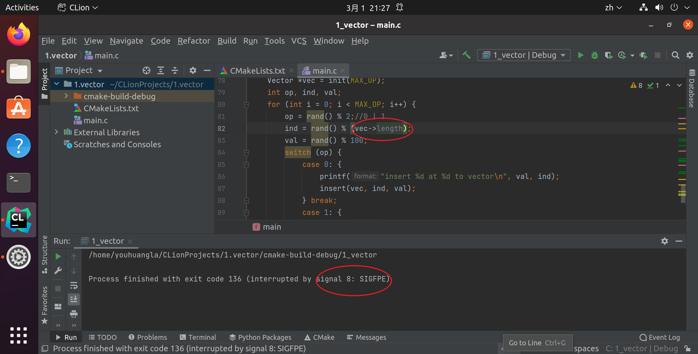

# s1. 顺序表

## 代码

```c
/*************************************************************************
        > File Name: 1.vector.c
        > Author:
        > Mail:
        > Created Time: Mon 28 Feb 2022 10:42:45 PM CST
 ************************************************************************/

#include <stdio.h>
#include <stdlib.h>
#include <time.h>

typedef struct Vector {
    int *data;
    int size, length;//数据结构定义
} Vector;

Vector *init(int n) {
    //初始化一个存储n个元素的顺序表
    Vector *vec = (Vector *)malloc(sizeof(Vector));
    vec->data = (int *)malloc(sizeof(int) * n);
    vec->size = n;
    vec->length = 0;
    return vec;
}

void clear(Vector *vec) {
    if (vec == NULL) return ;
    free(vec->data);
    free(vec);
    return ;
}

//顺序表两大操作：插入和删除

int expand(Vector *vec);

int insert(Vector *vec, int ind, int val) {
    if (vec == NULL) return 0;//合法性判断,0 illegall
    if (vec->length == vec->size) {
        if (!expand(vec)) {
            return 0;
        }
        printf("expand vector size to %d success\n", vec->size);
    }
    if (ind < 0 || ind > vec->length) return 0;
#if 0
    for (int i = ind; i < vec->length; i++) {
        vec->data[i + 1] = vec->data[i];//会覆盖后面的元素
    }
#endif
    for (int i = vec->length; i > ind; i--) {
        vec->data[i] = vec->data[i - 1];
    }
    vec->data[ind] = val;
    vec->length += 1;
    return 1;
}

int erase(Vector *vec, int ind) {
    if (vec == NULL) return 0;
    if (vec->length == 0) return 0;//无元素
    if (ind < 0 || ind >= vec->length) return 0;//>=
    for (int i = ind + 1; i < vec->length; i++) {
        vec->data[i - 1] = vec->data[i];
    }
    vec->length -= 1;
    return 1;//legal
}

void output(Vector *vec) {
    printf("Vector(%d) = [", vec->length);
    for (int i = 0; i < vec->length; i++) {
        if (i != 0) printf(", ");
        printf("%d", vec->data[i]);
    }
    printf("]\n");
    return ;
}

int expand(Vector *vec) {
# if 0
    vec->size *= 2;
    vec->data = (int *)realloc(vec->data, sizeof(int) * vec->size);//realloc 如果无法在原先的vec->data 后面分配空间，会直接调用malloc，再不行，会返回NULL，覆盖掉原来vec->data的地址，造成内存泄露
#endif
    int new_size = vec->size * 2;
    int *p = (int *)realloc(vec->data, sizeof(int) * new_size);
    if (p == NULL) {
        return 0;
    } else {
        vec->size = new_size;
        vec->data = p;
    }
    return 1;
}

int main() {
    srand(time(0));
    #define MAX_OP 20
    Vector *vec = init(1);
    int op, ind, val;
    for (int i = 0; i < MAX_OP; i++) {
        op = rand() % 4;//0, 1, 2, 3
        ind = rand() % (vec->length + 3);
        val = rand() % 100;
        switch (op) {
            case 2:
            case 3://2, 3, 0 75% insert
            case 0: {
                printf("insert %d at %d to vector\n", val, ind);
                insert(vec, ind, val);
            } break;
            case 1: {
                printf("erase item at %d from vector\n", ind);
                erase(vec, ind);
            } break;
        }
        output(vec);
    }
    return 0;
}
```

## structure

```clike
vector structure {
    data, size, length
}
```

## init and clear

### init

```clike
Vector *init(int size) {
    Vector *vec = malloc;
    vec->data = malloc;
    vec->size;
    vec->length;
    return vec;
}
```

### clear

```clike
void clear(Vector *vec) {
    if (vec == NULL) return ;
    free vec->data;
    //vec->size;
    //vec->length;
    free vec;
    return ;
}
```

## insert and erase

### insert

```clike
int insert(Vector *vec, int ind, int val) {
    if (vec == NULL) return 0;
    if (ind < 0 || ind > vec->length) return 0;
    if (vec->length == vec->size ) return 0;//扩容操作实现后删除
    for (从最后一个元素位置 + 1到要插入元素的位置 + 1) {
        元素后移;//如何保证有位置？vec->length < vec->size
    }
    vec->data[ind];
    vec->length;
    return 1;
}
```

```c
int insert(Vector *vec, int ind, int val) {
    if (vec == NULL) return 0;//合法性判断,0 illegall
    if (vec->length == vec->size) return 0;
    if (ind < 0 || ind > vec->length) return 0;
#if 0
    for (int i = ind; i < vec->length; i++) {
        vec->data[i + 1] = vec->data[i];//会覆盖后面的元素
    }
#endif
    for (int i = vec->length; i > ind; i--) {
        vec->data[i] = vec->data[i - 1];
    }
    vec->data[ind] = val;
    vec->length += 1;
    return 1;
}
```

### erase

```c
int erase(Vector *vec, int ind) {
    //删除ind后的元素
    if (vec == NULL);
    if (vec->length);
    if (ind || ind);
    for (从ind + 1开始到vec->length - 1) {
        将i - 1位置的元素替换为i位置的元素;
    }
    vec->length;
    return 1;
}
```

## expand

### double expand

```c
int expand(Vector *vec) {
# if 0
    vec->size *= 2;
    vec->data = (int *)realloc(vec->data, sizeof(int) * vec->size);//realloc 如果无法在原先的vec->data 后面分配空间，会直接调用malloc，再不行，会返回NULL，覆盖掉原来vec->data的地址，造成内存泄露
#endif
    int new_size = vec->size * 2;
    int *p = (int *)realloc(vec->data, sizeof(int) * new_size);
    if (p == NULL) {
        return 0;
    } else {
        vec->size = new_size;
        vec->data = p;
    }
    return 1;
}
```

### expand one only


## main

```c
int main() {
    srand(time(0));
    #define MAX_OP 20
    Vector *vec = init(1);
    int op, ind, val;
    for (int i = 0; i < MAX_OP; i++) {
        op = rand() % 4;//0, 1, 2, 3
        ind = rand() % (vec->length + 3);
        val = rand() % 100;
        switch (op) {
            case 2:
            case 3://2, 3, 0 75% insert
            case 0: {
                printf("insert %d at %d to vector\n", val, ind);
                insert(vec, ind, val);
            } break;
            case 1: {
                printf("erase item at %d from vector\n", ind);
                erase(vec, ind);
            } break;
        }
        output(vec);
    }
    return 0;
}
```

将`ind = rand() % (vec->length + 1)改为(vec->length)，报错



```shell
youhuangla@Ubuntu huchuanzhang % ./1.vector                                                                         [0]
[1]    3952 floating point exception  ./1.vector
```

原因是% 0

```c
/*************************************************************************
        > File Name: test.c
        > Author:
        > Mail:
        > Created Time: Tue 01 Mar 2022 10:20:21 PM CST
 ************************************************************************/

#include <stdio.h>
#include <time.h>
#include <stdlib.h>
int main() {
    srand(time(0));
    //int op = rand() % 0;
    int op = 24 % 0;
    return 0;
}
```

```shell
youhuangla@Ubuntu huchuanzhang % gcc test.c                                                                         [0]
test.c: In function ‘main’:
test.c:14:17: warning: division by zero [-Wdiv-by-zero]
     int op = 24 % 0;
                 ^
youhuangla@Ubuntu huchuanzhang % ./a.out                                                                            [0]
[1]    4709 floating point exception  ./a.out
```

```shell
insert 48 at 0 to vector
expand vector size to 2 success
Vector(1) = [48]
insert 42 at 0 to vector
Vector(2) = [42, 48]
insert 50 at 2 to vector
Vector(2) = [42, 48]
erase item at 0 from vector
Vector(1) = [48]
insert 47 at 3 to vector
expand vector size to 4 success
Vector(2) = [48, 48]
insert 56 at 1 to vector
Vector(3) = [48, 56, 48]
insert 62 at 3 to vector
expand vector size to 8 success
Vector(4) = [48, 56, 48, 62]
insert 81 at 4 to vector
expand vector size to 16 success
Vector(5) = [48, 56, 48, 62, 81]
insert 81 at 1 to vector
Vector(6) = [48, 81, 56, 48, 62, 81]
erase item at 5 from vector
Vector(5) = [48, 81, 56, 48, 62]
erase item at 2 from vector
Vector(4) = [48, 81, 48, 62]
erase item at 4 from vector
Vector(4) = [48, 81, 48, 62]
insert 76 at 0 to vector
Vector(5) = [76, 48, 81, 48, 62]
insert 66 at 5 to vector
expand vector size to 32 success
Vector(6) = [76, 48, 81, 48, 62, 66]
insert 13 at 2 to vector
Vector(7) = [76, 48, 13, 81, 48, 62, 66]
insert 62 at 9 to vector
expand vector size to 64 success
Vector(8) = [76, 48, 13, 81, 48, 62, 66, 0]
insert 23 at 6 to vector
Vector(9) = [76, 48, 13, 81, 48, 62, 23, 66, 0]
insert 60 at 0 to vector
Vector(10) = [60, 76, 48, 13, 81, 48, 62, 23, 66, 0]
insert 17 at 8 to vector
Vector(11) = [60, 76, 48, 13, 81, 48, 62, 23, 17, 66, 0]
insert 77 at 4 to vector
Vector(12) = [60, 76, 48, 13, 77, 81, 48, 62, 23, 17, 66, 0]
```