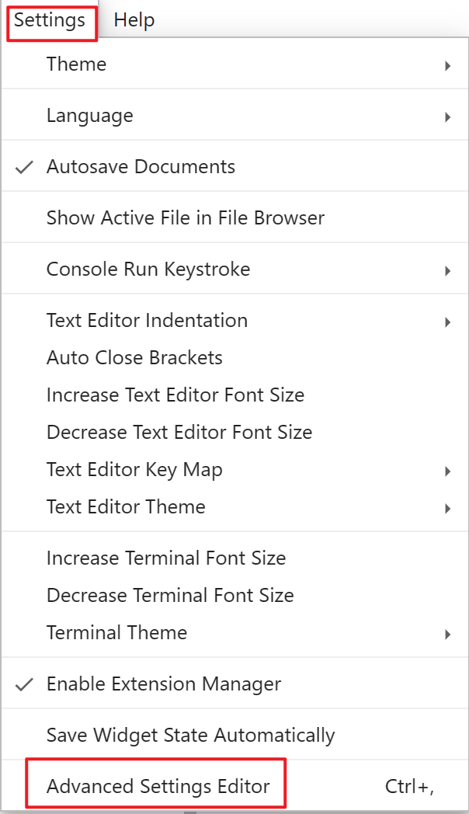

# Jupyter notebook

## Start

```powershell
PS C:\ProgramData\Microsoft\Windows\Start Menu\Programs\Anaconda3 (64-bit)> ls


    目录: C:\ProgramData\Microsoft\Windows\Start Menu\Programs\Anaconda3 (64-bit)


Mode                 LastWriteTime         Length Name
----                 -------------         ------ ----
-a----          2023/1/6     21:47           1199 Anaconda Navigator (Anaconda3).lnk
-a----          2023/1/6     21:47           2512 Anaconda Powershell Prompt (Anaconda3).lnk
-a----          2023/1/6     21:47           2038 Anaconda Prompt (Anaconda3).lnk
-a----          2023/1/6     21:47           1168 Jupyter Notebook (Anaconda3).lnk
-a----          2023/1/6     21:47           1180 Reset Spyder Settings (Anaconda3).lnk
-a----          2023/1/6     21:47           1163 Spyder (Anaconda3).lnk
```

Open  Anaconda Powershell Prompt 

Use cd to Enter a dir

```powershell
(base) PS C:\Users\Administrator> cd E:\Study\数学\程序员数学\源代码文件\Math-for-Programmers-master
(base) PS E:\Study\数学\程序员数学\源代码文件\Math-for-Programmers-master> jupyter notebook
```

## Bug

jupyter连接不到内核

>   # 3、jupyter连接不到内核
>
>   如果遇到jupyter连接不到内核等其他问题，升级下jupyter。升级命令：pip install -U jupyter，然后升级notebook，升级命令：pip install -U notebook --upgrade。如果还是不行的话，就重启下jupyter或者电脑，也许有惊喜噢，重启大法好！
>
>   
>
>   作者：Python进阶者
>   链接：https://juejin.cn/post/7107131869216374820
>   来源：稀土掘金
>   著作权归作者所有。商业转载请联系作者获得授权，非商业转载请注明出处。

## Jupyter Lab相关

### 启动

>   Person: 
>   - 安装anaconda后，我只能在anaconda prompt中运行jupyter lab，而且只能看c盘上的文件，如何用jupyter lab看其他盘的文件？
>
>   ChatGPT: 
>   - 默认情况下，Anaconda Prompt打开的JupyterLab只能看到当前所在的文件夹以及其子文件夹中的文件。要在JupyterLab中访问其他盘符上的文件，可以通过设置JupyterLab的工作目录来实现。
>
>   请按照以下步骤进行操作： 
>   1. 打开Anaconda Prompt。 
>   2. 在Anaconda Prompt中，使用以下命令打开JupyterLab，并设置工作目录：
>
>   ```python
>   jupyter lab --notebook-dir="D:\your_folder"
>   ```
>
>   
>
>   将`D:\your_folder`替换为你希望作为JupyterLab工作目录的目标文件夹路径。 
>   3. 这将在默认的Web浏览器中打开JupyterLab，并且你将能够在指定的目标文件夹中创建和编辑Jupyter笔记本以及运行代码。
>
>   通过设置`--notebook-dir`选项，你可以指定JupyterLab的工作目录为其他盘符上的文件夹。这样，你就可以在JupyterLab中访问指定目录以及其子文件夹中的文件了。

```powershell
jupyter lab --notebook-dir="E:\github"
```

### 快捷键



中搜索keybord