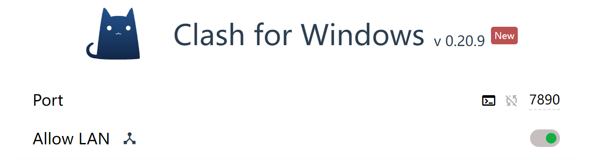
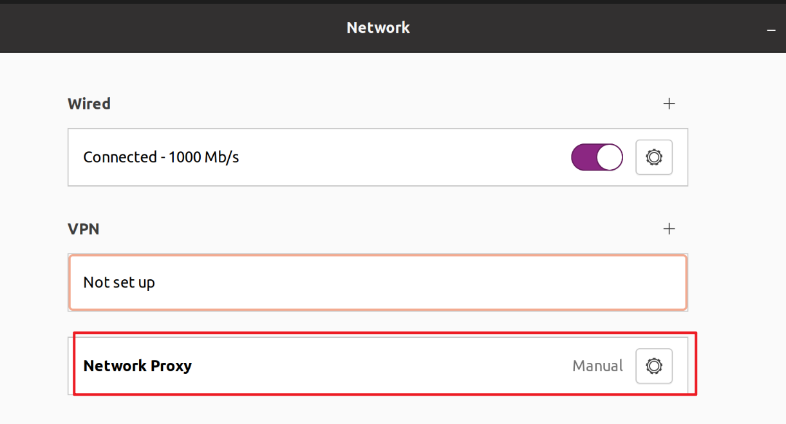
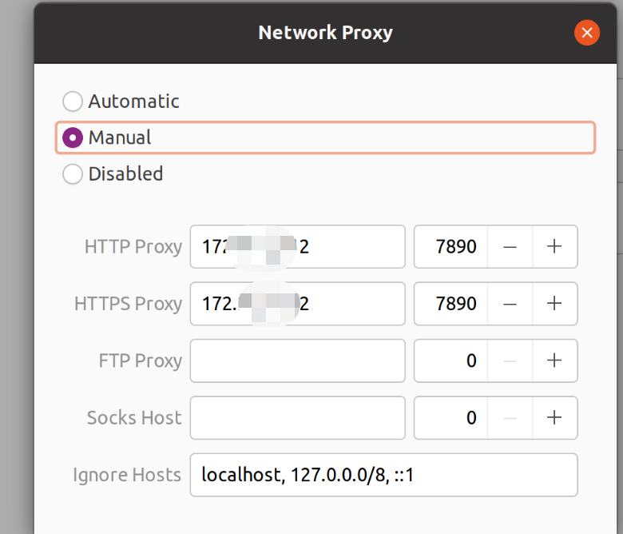

# Env

## 虚拟机

主机





输入ipconfig中的无线局域网适配器ipv4地址

 

### 更新apt

[Fix The "The Repository No Longer Has A Release File" Error On Ubuntu](https://azdigi.com/blog/en/linux-server-en/fix-the-the-repository-no-longer-has-a-release-file-error-on-ubuntu/)

```
mysql账号root，密码
123qwe!@#
redis配置文件里面配置密码为123456

创建一个超级管理员
python3 manage.py createsuperuser

admin
123456
```

