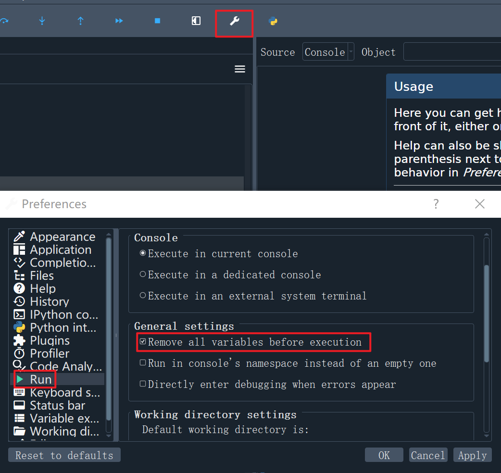

```python
Python 3.10.9 | packaged by Anaconda, Inc. | (main, Mar  1 2023, 18:18:15) [MSC v.1916 64 bit (AMD64)]
Type "copyright", "credits" or "license" for more information.

IPython 8.10.0 -- An enhanced Interactive Python.

test_list_tour = [1, 2, 3, 4, 5]

test_dict_tour = {'a': 1, 'b': 2}

3 * 5
Out[3]: 15

6 + 4 * 10
Out[4]: 46

(6 + 4) * 10
Out[5]: 100

math.cos(3.4) ** 2 + math.sin(3.4) ** 2
Traceback (most recent call last):

  Cell In[6], line 1
    math.cos(3.4) ** 2 + math.sin(3.4) ** 2

NameError: name 'math' is not defined


import math

math.cos(3.4) ** 2 + math.sin(3.4) ** 2
Out[8]: 1.0

```

```python
import numpy

import matplotlib

```

