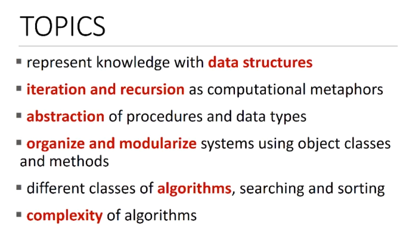
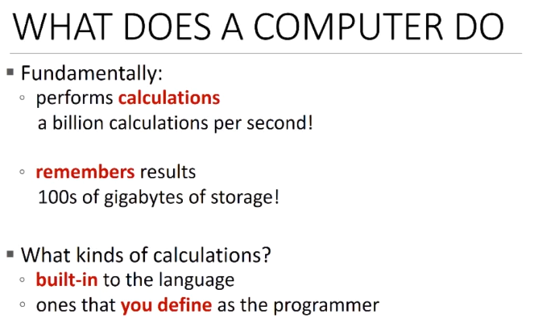
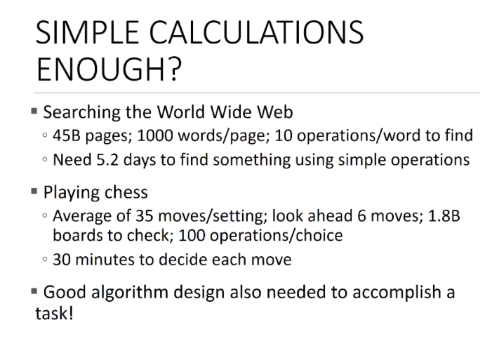
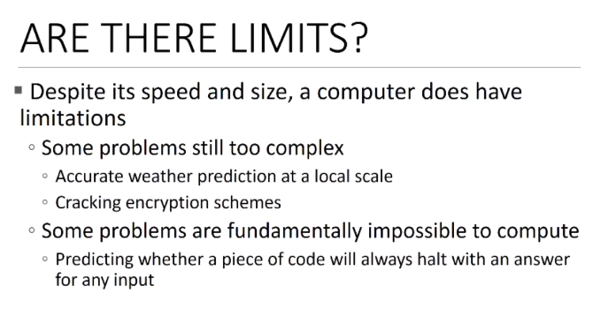

# Unit 1 Python Basics

>   How can I describe the stages I want to use to get this done in such a manner that I don't have to do it.
>   I can get the computer to do it.
>
>   That's the notion of computational thinking, of algorithmic thinking, and that's what we're going to try and teach you about in this course.

>   Person: 
>   - True or False? A stored program computer is designed to compute precisely one computation, such as a square root, or the trajectory of a missile.用中文解释
>
>   ChatGPT: 
>   - True or False? A stored program computer is designed to compute precisely one computation, such as a square root, or the trajectory of a missile.
>
>   中文解释：真或假？存储程序计算机被设计用于精确计算一个特定的计算，比如平方根或导弹的轨迹。
>
>   回答：False。存储程序计算机并非只能执行一个特定的计算，例如计算平方根或导弹的轨迹。存储程序计算机是一种通用计算机，可以根据指令集执行各种不同的计算任务。它能够根据存储在内存中的程序进行灵活的计算，并可以执行各种算法、处理不同类型的数据和解决多个计算问题。因此，存储程序计算机具有广泛的应用领域，不仅局限于执行特定的计算。