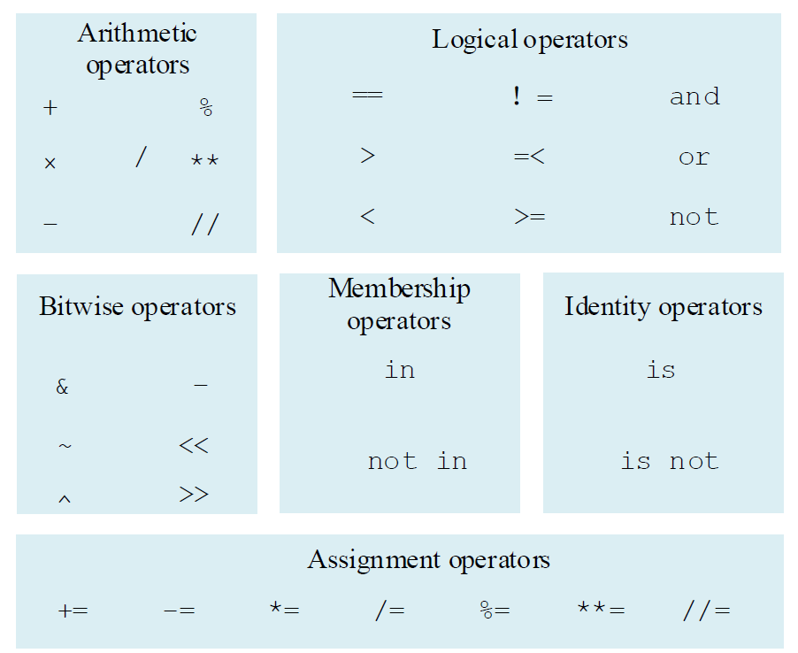

# 6.Python 常见运算

## 6.1 几类运算符

Python 中的运算符可以分为以下几类：

► 算术运算符：用于数学运算，例如加法 (+)、减法 (-)、乘法 (*)、除法 (/)、取余数(%)、乘幂 (`**`) 等。

► 比较运算符：用于比较两个值之间的关系，例如等于 (==)、不等于 (!=)、大于 (>)、小于 (<)、大于等于 (>=)、小于等于 (<=) 等。

► 逻辑运算符：用于处理布尔型数据，例如与 (and)、或 (or)、非 (not) 等。

► 赋值运算符：用于给变量赋值，例如等号 (=)、自加运算 (+=)、自减运算 (-=)、自乘运算 (`*=`)、自除运算 (/=)。

► 成员运算符：用于检查一个值是否为另一个值的成员，例如in、not in 等。

► 身份运算符：用于检查两个变量是否引用同一个对象，例如is、is not 等。

### 成员运算符

Python 中成员运算符用于测试是否存在于序列中。共有两个成员运算符：a) in：如果在序列中找到值，返回True，否则返回False。b) not in：如果在序列中没有找到值，返回True，否则返回False。

### 身份运算符

Python 身份运算符包括is 和is not，用于判断两个对象是否引用同一个内存地址。请大家回顾上一章介绍的视图、浅复制、深复制这三个概念。简单来说，浅复制只复制对象的一层内容，不涉及到嵌套的可变对象。深复制创建一个全新的对象，并递归地复制原始对象及其嵌套的可变对象。每个对象的副本都是独立的，修改原始对象或其嵌套对象不会影响深复制的对象。深复制涉及到多层嵌套的可变对象，确保每个对象都被复制。

>   Person: 
>   - import copy
>   a = [1, 2, 3]
>   b = a
>
>   c = [1, 2, 3]
>   d = a.copy()
>
>   print(a is b)
>   print(a is not c)
>   print(a == c)
>   print(a == d)
>
>   a_2_layers = [1, 2, [3, 4]]
>   d_2_layers = a_2_layers.copy()
>   e_2_layers = copy.deepcopy(a_2_layers)
>
>   print(a_2_layers is d_2_layers)
>   print(a_2_layers[2] is d_2_layers[2])
>
>   print(a_2_layers is e_2_layers)
>   print(a_2_layers[2] is e_2_layers[2])   """print(a_2_layers[2] is d_2_layers[2])
>   这行为什么输出True？
>
>   ChatGPT: 
>   - 这行代码输出 True 是因为在浅拷贝（shallow copy）中，只有最外层的对象被复制，而内部嵌套的对象仍然是同一个对象的引用。
>
>   在这段代码中，`a_2_layers` 是一个包含了一个嵌套列表的列表。当你使用 `d_2_layers = a_2_layers.copy()` 进行浅拷贝时，最外层的列表 `a_2_layers` 被复制到了 `d_2_layers`，但是内部嵌套的列表 `[3, 4]` 并没有被复制，而是仍然引用着同一个对象。
>
>   因此，`a_2_layers[2] is d_2_layers[2]` 返回 True，表示两个变量引用的是相同的内部列表对象。
>
>   如果你想要进行深拷贝（deep copy），即复制所有嵌套对象的新副本，你可以使用 `e_2_layers = copy.deepcopy(a_2_layers)`。在这种情况下，`e_2_layers` 将包含与 `a_2_layers` 完全独立的副本，包括内部嵌套的列表。
>
>   总结起来，浅拷贝只复制最外层的对象，而深拷贝会递归复制所有嵌套对象，确保完全独立的副本。