# SM

注意：SuperMemo简写

[【重新发布】SuperMemo 18 中文懒人包 - 知乎 (zhihu.com)](https://zhuanlan.zhihu.com/p/444110498)

## 界面

界面：

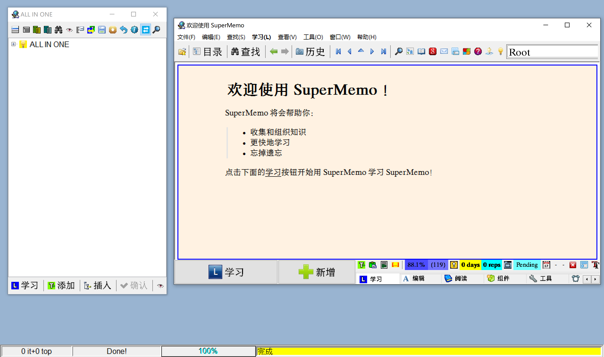

### 优化

[SuperMemo 18 字体有锯齿，怎么解决？ - 知乎 (zhihu.com)](https://www.zhihu.com/question/528480997/answer/2443975582)

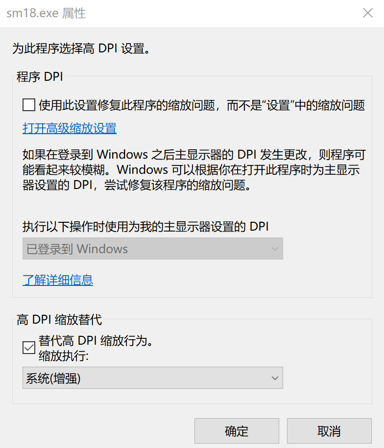


## 备份

### 坑

叶xx大佬的教程由于使用的似乎是相对路径，但是如果生成了一次，之后移动就不会生成？所以在这里文件夹不能改名为SM_Backup（猜测如果用叶佬的动作“统一格式”就没事）

然后，动作“云端备份”的设置也要改。

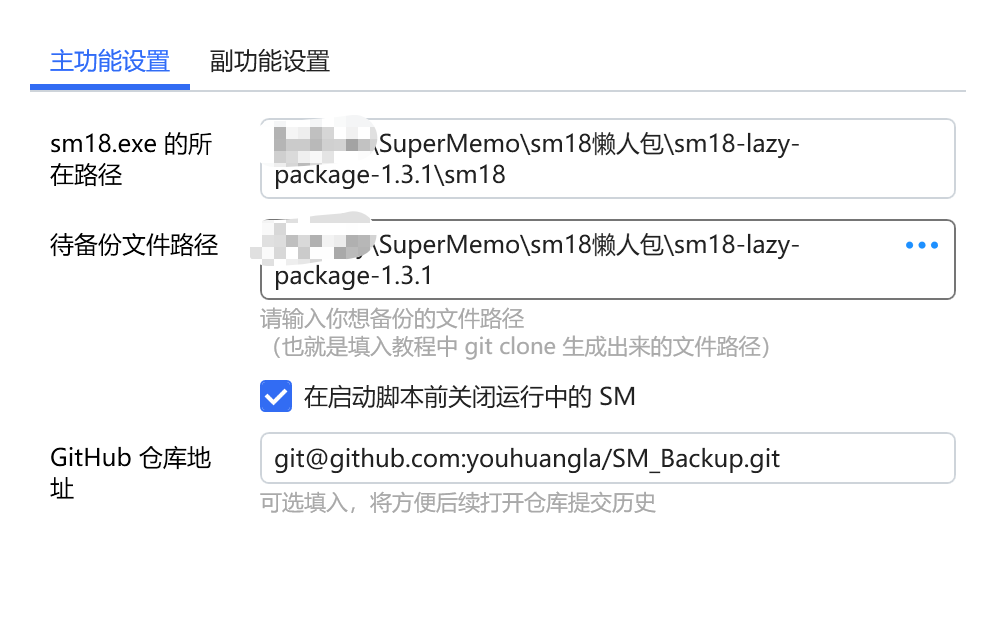

迷惑之处：有时候第一次备份似乎会失败，失败时窗口不会自动关闭

### Git

[SuperMemo 永无忧数据安全方案 \- 支持跨设备同步 （Git \+ Bitshelter） \- 知乎](https://zhuanlan.zhihu.com/p/472295202)

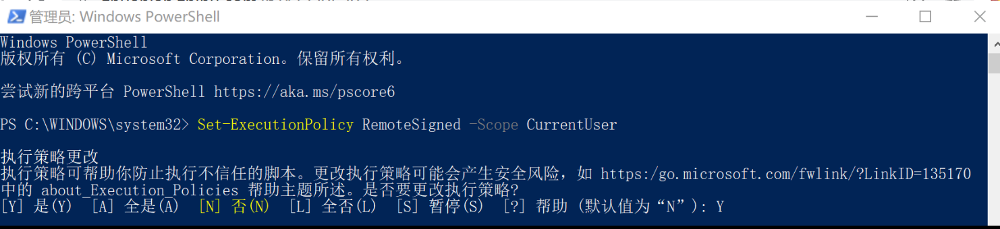

#### 生成密钥

```powershell
C:\Users\Administrator>ssh-keygen
Generating public/private rsa key pair.
Enter file in which to save the key (C:\Users\Administrator/.ssh/id_rsa):
C:\Users\Administrator/.ssh/id_rsa already exists.
Overwrite (y/n)? n
```

#### 自报家门

```powershell
git config --global user.name "你随便输自己的英文名字"
git config --global user.email "你随便输自己的邮箱@qq.com"
```

由于我之前做过了

```powershell
C:\Users\Administrator>git config user.name
xxxxx

C:\Users\Administrator>git config user.email
xxxxx@qq.com
```

#### 复制并上传密钥

打开路径： c盘\用户\用户名\.ssh ，用记事本打开里面的 id_rsa.pub 文件，复制全部的内容

[SSH and GPG keys](https://github.com/settings/keys)中生成ssh key粘贴

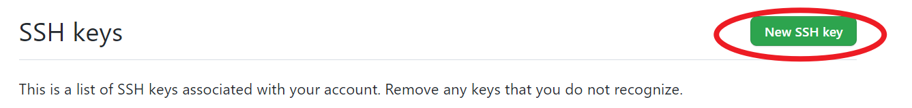

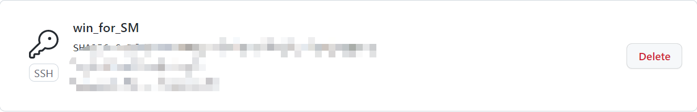

#### 新建仓库

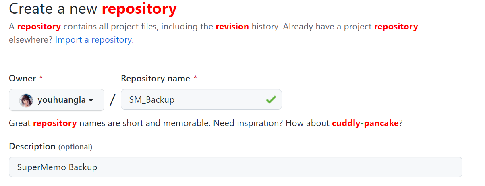

#### 复制SSH key

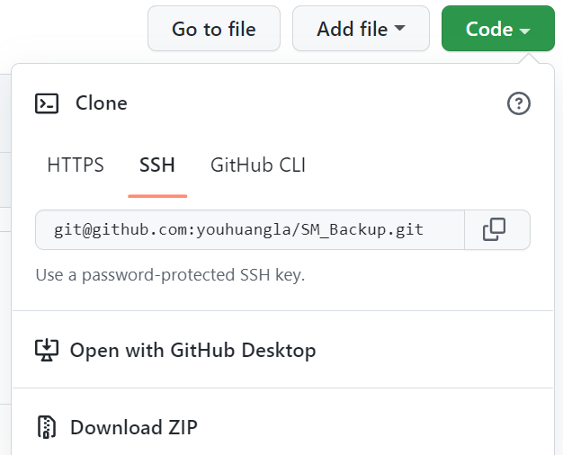

#### git clone

在资源管理器中，打开到 sm18 文件夹的同目录（即打开到显示 sm18 文件夹这一层），在地址栏中输入 cmd 并按 enter，打开该目录下的 cmd，输入以下代码，等待执行完成。

```powershell
E:\Study\SuperMemo\sm18-lazy-package-1.3.1>git clone git@github.com:youhuangla/SM_Backup.git
Cloning into 'SM_Backup'...
remote: Enumerating objects: 3, done.
Receiving objects: 100% (3/3), done.
remote: Counting objects: 100% (3/3), done.
remote: Total 3 (delta 0), reused 0 (delta 0), pack-reused 0
```

执行完成后你会发现生成出了一个新的文件夹在该目录

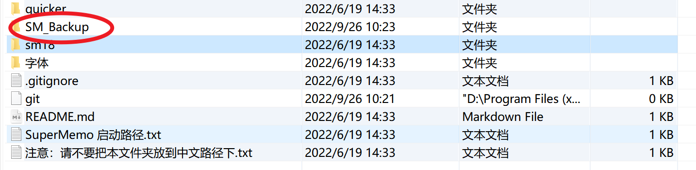

 git clone 后将 sm 根目录移动到新生成的文件夹里边去

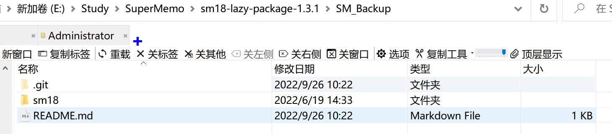

#### git版本回退

[版本回退 \- 廖雪峰的官方网站](https://www.liaoxuefeng.com/wiki/896043488029600/897013573512192)

##### Linux

```shell
$ git reset --hard HEAD^
```

##### Win

[windows 10 下面git reset 报错-讨论 \- 廖雪峰的官方网站](https://www.liaoxuefeng.com/discuss/969956160874304/1253947768433280)

Win 出现报错

```powershell
E:\Study\SuperMemo\sm18懒人包\sm18-lazy-package-1.3.1>git reset --hard HEAD^
More?
More?
fatal: ambiguous argument 'HEAD
': unknown revision or path not in the working tree.
Use '--' to separate paths from revisions, like this:
'git <command> [<revision>...] -- [<file>...]'

```

因为cmd中`^`是转义符号，相当于linux的`\`，当出现在行尾的时候含义是这行还没写完，无视行尾的换行符，下行的内容实际执行的时候理解为直接接在上一行尾上。所以你`^`结尾会提示你More，就是让你输入下一行的内容。解决方法有用双引号括上强行指定为字符串内容`"^"`，或者用两个`^`，即`^^`，前一个转义后一个，代表一个没有特殊含义的字符`^`本身。如果你要用n个`^`，就要写2n个`^`。cmd中是这样,所以Git cmd也是这样，Git Bash是Unix风格，应该就没有这个问题。

替代：

```powershell
git reset --hard HEAD~1
git reset --hard HEAD"^"
```

廖雪峰官方网站下的评论值得一看！

### 配置 quicker 脚本

个人的quicker打开方式是Ctr + 右键

#### quicker踩坑记录

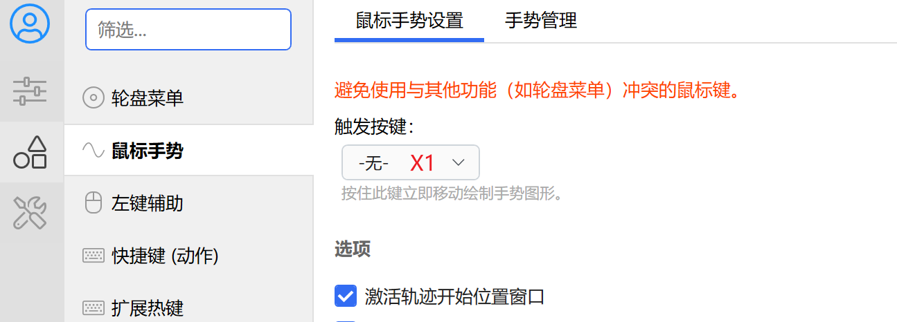

这里原先的X1就是后退键，容易影响到正常网页后退的使用

#### 安装脚本

[云端备份 \- 动作信息 \- Quicker](https://getquicker.net/Sharedaction?code=2ac19a37-740f-4bcc-adcb-08da6e569e28)

应该先为sm18添加场景设置，然后在里面粘贴安装

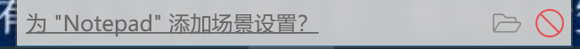


##### 配置脚本


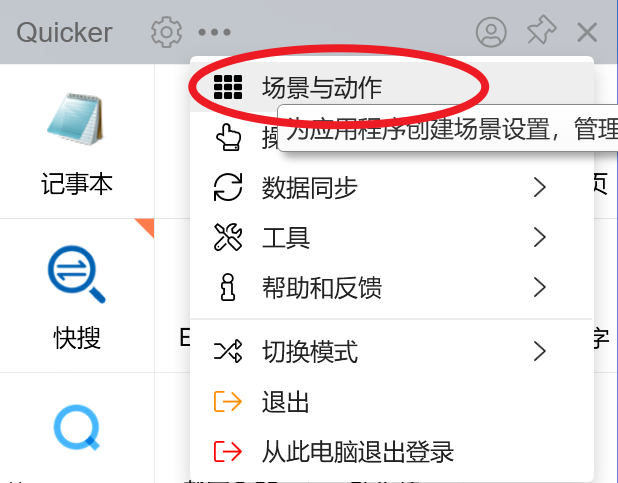

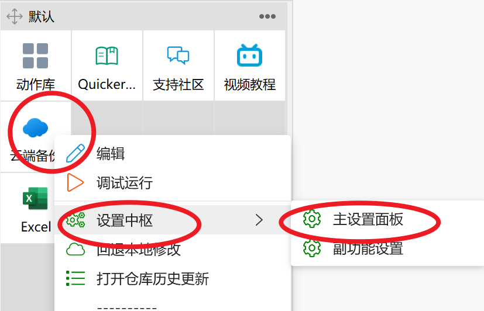

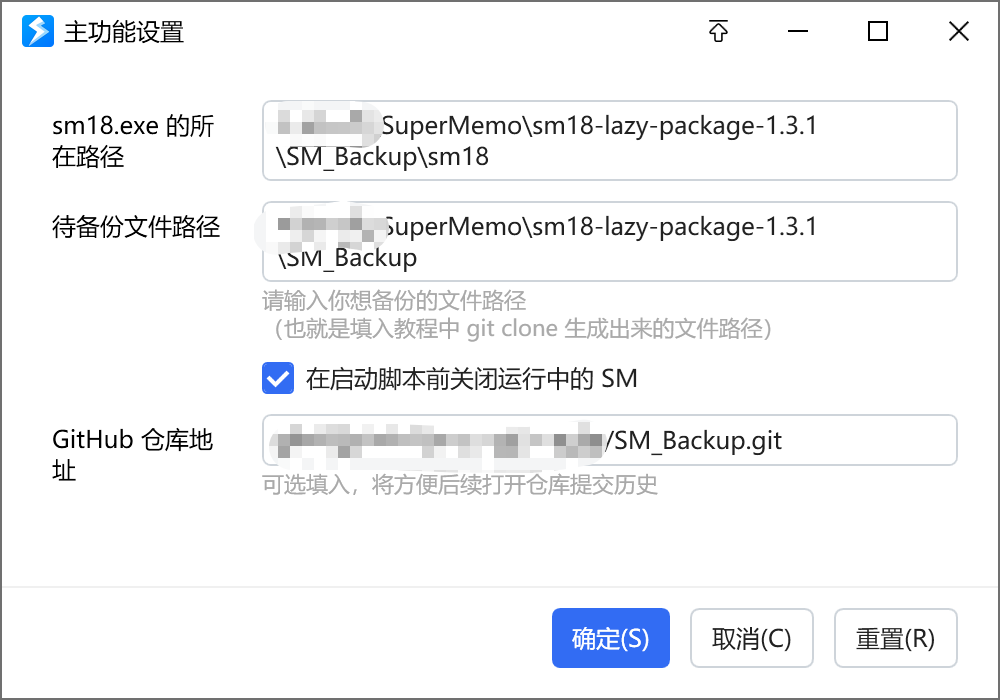

#### 在sm界面运行Quicker脚本

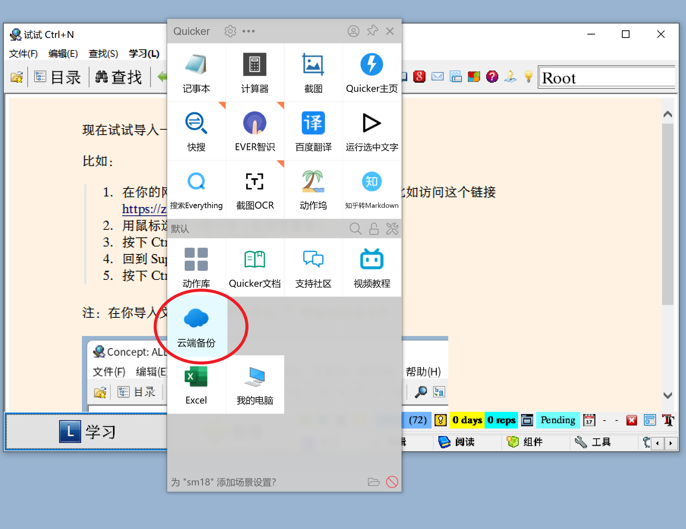

第一次的没复制，以下是第二次的

```powershell
从服务器拉取同步状态...
Already up to date.
git 同步：本地与云端版本有以下文件不同（若一致则显示空白）

 M "sm18/systems/ALL IN ONE/collection.ini"
 M "sm18/systems/ALL IN ONE/stats/time.dat"
 M "sm18/systems/ALL IN ONE/stats/time.tim"
 M "sm18/systems/ALL IN ONE/stats/time.~ti"
 M "sm18/systems/ALL IN ONE/subsets/last_browser.sub"
?? sm18/systems/ALL IN ONE/subsets/prev_browser.sub

请检查以上文件变动列表，确认保持同步连贯
现在，按下 Enter 后将开启 SuperMemo 终身学习之旅 :
```

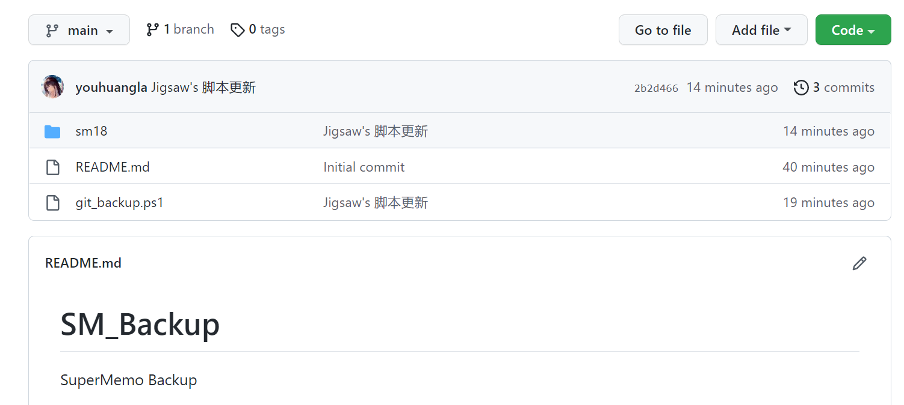

## 思路

### 总纲

[SuperMemo增量阅读流程（老强制作v1.01)中英文版 - 知乎 (zhihu.com)](https://zhuanlan.zhihu.com/p/342417663)

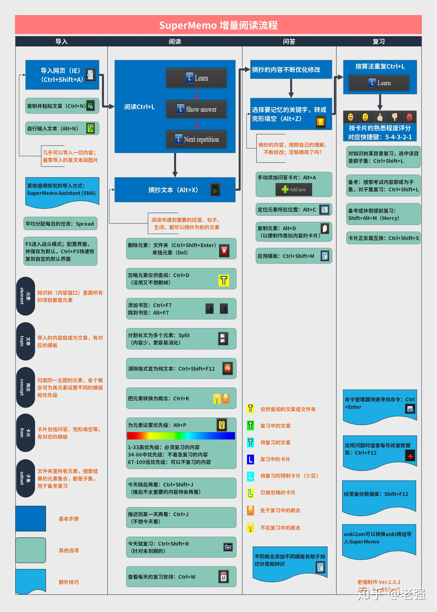

### 计划

优先文字，从政治开始熟悉，穿插加入数学

## 导入

### web文件

[导入材料 · SuperMemo 渐进学习大型指北 · 看云](https://www.kancloud.cn/ankigaokao/incremental_learning/2450595)

只能用IE。。。

>   生成的网页中图片默认是用base64编码展示的,SM软件不支持这些图片的导入,所以增量阅读时图片区域会显示出一个**叉号**,所以我建议在增量阅读到这个图片时,如果**不需要这个图片则可以直接删除这个叉号**,如果**需要则可以直接从网页或PDF源文件中复制或截图**过来
>
>   [实践\-SuperMemo\-PDF文档网页增量\(三\) \- 知乎](https://zhuanlan.zhihu.com/p/348245515)

[supermemo中如何进行一卡多空的设置？ - 知乎 (zhihu.com)](https://www.zhihu.com/question/466593418/answer/1955066929)

### pdf

目前计划用Xodo打开

#### 文本

typora复制文本（TODO:obesidian？）

#### 图片

[关于Supermemo18里的图片保存路径的几个疑惑？ - 叶峻峣的回答 - 知乎](https://www.zhihu.com/question/519610917/answer/2371762689)

图片直接复制后，全选用quicker动作“统一格式”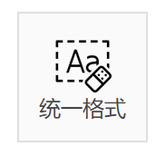

[统一格式 - 动作信息 - Quicker (getquicker.net)](https://getquicker.net/Sharedaction?code=859bda04-fe78-4385-1b37-08d88a0dba1c)

单选图片，用动作“图片宽度适应”调整宽度，需要在 supermemo.css 中加入代码：

[图片宽度适应 - 动作信息 - Quicker (getquicker.net)](https://getquicker.net/Sharedaction?code=7b8c9f53-a904-427a-be0c-08da1974d5e0)

挖空试着用Snipaste

>   如果是网页，本地化图片就行了。如果是 wps、word 等软件复制过去，由于这种复制所带的图片路径是其他软件自己的路径，所以换电脑、删文件后，图片就会丢失。目前没有什么好的解决方案，我只能建议一张一张复制。

所以还是先md转网页，再试着本地化图片？

##### 本地化图片

#### 公式

公式用PandaOCR公式识别，导入后只导入latex公式。

如果要挖空，在sm的回答中粘贴对应公式的图片

##### 公式与图片相互转换

###### 公式转图片

用动作[公式转图片 - 动作信息 - Quicker (getquicker.net)](https://getquicker.net/Sharedaction?code=8df5d7a2-e1c9-4d21-c7fc-08d91b37df64)写公式。

动作输入公式不需要额外标识，只需要纯公式即可。本动作原理是将 LaTeX 公式先调用网站服务下载图片，再将图片转换为 base64 格式，并包装为网页图片写入剪贴板并粘贴。

注意：

不能加注解

不能多添回车

###### 图片转公式

用动作[图片转公式 - 动作信息 - Quicker (getquicker.net)](https://getquicker.net/sharedaction?code=4f135bca-abdd-4e5a-3a06-08d92e62ae35)编辑公式。

可以将转换后的图片再转回公式，方便编辑。使用方法：选中你想要转回公式的图片，然后运行动作即可，公式文本会自动粘贴回窗口。

#### pdf导入sm

转html？

最后用IE打开

#### 反馈

用sm学习后，反馈回md笔记

## 优先级

动作[高优先级 - 动作信息 - Quicker (getquicker.net)](https://getquicker.net/Sharedaction?code=bf30d743-a249-4c7f-295f-08d891a6372a)设置卡片的优先级为 1