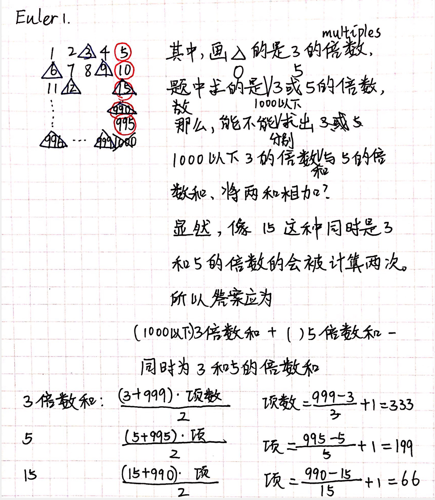

# Euler

## P1.3或5的倍数

- Multiples of 3 and 5

If we list all the natural numbers below 10 that are multiples of 3 or 5, we get 3, 5, 6 and 9. The sum of these multiples is 23.

Find the sum of all the multiples of 3 or 5 below 1000.

- 3或5的倍数

在小于10的自然数中，3或5的倍数有3、5、6和9，这些数之和是23。

求小于1000的自然数中所有3或5的倍数之和。

### Sol1

```c++
/*************************************************************************
        > File Name: euler-1_my.cpp
        > Author:
        > Mail:
        > Created Time: Mon 21 Mar 2022 01:39:01 PM CST
 ************************************************************************/

#include <iostream>
using namespace std;
int ans;
int main() {
    for (int i = 0; i < 1000; i++) {
        if (i % 3 == 0 || i % 5 == 0) {
            ans += i;
        }
    }
    cout << ans << endl;
    return 0;
}
```

```shell
youhuangla@Ubuntu s01 % ./a.out                                                                                                [0]
233168
```


### Sol2



```c++
/*************************************************************************
        > File Name: euler-1_my.cpp
        > Author:
        > Mail:
        > Created Time: Mon 21 Mar 2022 01:39:01 PM CST
 ************************************************************************/

#include <iostream>
using namespace std;
int ans;
int main() {
    int three_sum = (3 + 999) * 333 / 2;
    int five_sum = (5 + 995) * 199 / 2;
    int fifteen_sum = (15 + 990) * 66 / 2;
    ans = three_sum + five_sum - fifteen_sum;
    cout << ans << endl;
    return 0;
}
```

```zsh
youhuangla@Ubuntu s01 % ./a.out                                                                                                [0]
233168
```

### 时间复杂度大O

定义：在数据规模变化时，算法执行时间如何变化

注：不是执行时间

Sol1计算了$1000$次，数据规模为n时，时间复杂度为$O(n)$，又可以称作线性级复杂度

Sol2的时间复杂度为$O(1)$，又称常数级

| 时间复杂度O | 类别     | 应用        |
| ----------- | -------- | ----------- |
| $O(1)$      | 常数     | 几条语句    |
| $O(logn)$   | 对数     | 二分查找    |
| $O(n)$      | 线性     | for循环     |
| $O(nlogn)$  | 线性对数 | 快排        |
| $O(n^2)$    | 平方     | 双层for循环 |
| $O(n^3)$    | 次方     | 三层for循环 |
| $O(n!)$     | 阶乘     | 排列问题    |
| $O(2^n)$    |          | 组合问题    |

### 时间复杂度的计算

a、b、c都是常数时，$O(an^2 + bn + c) = O(n^2)$

1.   删除常数和较小的项
2.   保留最大项

#### ex1

求 $O$

```c
int x = 0, s = 0, n;
cin >> n;
while (s < n) {
    x++;
    s += x;
}
```

$$
1 + 2 + ...... + x < n \\
\frac {(1 + x) \times x}  2 < n \\
x < n ^ {\frac 1 2} \\
\therefore O(n ^ {\frac 1 2}) \\
$$

#### ex2

## P2.偶斐波那契数

- Even Fibonacci numbers

Each new term in the Fibonacci sequence is generated by adding the previous two terms. By starting with 1 and 2, the first 10 terms will be:

1,2,3,5,8,13,21,34,55,89,…

By considering the terms in the Fibonacci sequence whose values do not exceed four million, find the sum of the even-valued terms.

- 偶斐波那契数

斐波那契数列中的每一项都是前两项的和。由1和2开始生成的斐波那契数列的前10项为：

1,2,3,5,8,13,21,34,55,89,…

考虑该斐波那契数列中不超过四百万的项，求其中为偶数的项之和。

### Sol1

```c++
/*************************************************************************
        > File Name: my_euler-2.cpp
        > Author:
        > Mail:
        > Created Time: Mon 21 Mar 2022 04:10:34 PM CST
 ************************************************************************/

#include <iostream>
using namespace std;
int sum;
int num[4000005];
int main() {
    for (int i = 0; ; i++) {
#if 0 
        //BUG:如果这段if语句放在这里，会出现segment fault
        //CAUSE:每次到这里，num[i]未赋值，仍是在全局变量的初始值0，所以每次判断都是false，循环不会终止
        //DEBUG:出现死循环不方便debug时，可以在每次循环时最后sleep一会
        if (num[i] > 4000000) {
            break;
        }
#endif     
        if (i == 0) {
            num[i] = 1;
            sum = 0;
        } else if (i == 1) {
            num[i] = 2;
            sum = 2;
        } else {
            num[i] = num[i - 1] + num[i - 2];
        }
        if (num[i] > 4000000) {
            break;
        }
        if (num[i] % 2 == 0) {
            sum += num[i];
        }
    }
    cout << sum << endl;
    return 0;
}
```

```zsh
youhuangla@Ubuntu s01 % ./a.out                                                                                                [0]
4613734
```

### Sol2

```c
/*************************************************************************
	> File Name: 2.c
	> Author: 
	> Mail: 
	> Created Time: Thu Jul 14 14:44:52 2022
 ************************************************************************/

#include <stdio.h>

int main() {
	int a = 1, b = 1, ans = 0;
	while (b < 4000000)	{
		if (b % 2 == 0) {
			ans += b;
		}
		b += a;
		a = b - a;
	}
	printf("%d\n", ans);
	return 0;
}
```

如果看不懂，在纸上模拟执行。

空间复杂度由$O(n)$变为$O(1)$。

### 空间复杂度

使用的内存空间大小。

| 常见空间复杂度 | 级别   | 常见     |
| -------------- | ------ | -------- |
| $O(1)$         | 常数级 | 几个变量 |
| $O(n)$         | 线性级 | 一维数组 |
| $O(n ^ 2)$     | 平方级 | 二维数组 |
| $O(\log n)$    | 对数级 | 递归深度 |

1:45

