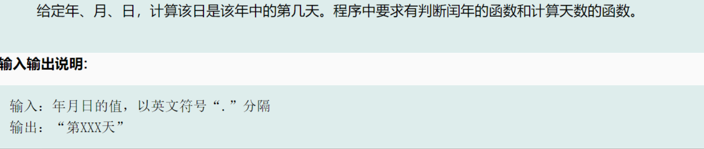

# leap year

## day of year



```c
#include <stdio.h>
int main() {
    int y, m, d;
    scanf("%d.%d.%d", &y, &m, &d);
    //printf("%d.%d.%d", y, m, d);
    int leap;
    //judge leap year
    if (y % 400 == 0 || (y % 4 == 0 && y % 100 != 0)) {
        leap = 1;
    } else {
        leap = 0;
    }

    //day of month
    int month[13] = {0,/*skip 0 month*/
        31, 28, 31, 30, 31, 30,
        31, 31, 30, 31, 30, 31
    };

    //if you forget that the febrary of leap year should be 29,you should remenber the joke that somebody
    //only have a birthday every four years.

    //leap year impact day of month 
    if (leap == 1) {
        month[2] += 1;
    }

    //count the day of year according to month
    int day_of_year = 0;
    for (int i = 1; i < m; i++) {//bug: january will not plus month[1]!
        day_of_year += month[i];
    }

    //plus day of the month
    day_of_year += d;
    printf("第%d天", day_of_year); 

    return 0;
}
```

```output
2008.10.3
第277天
```

