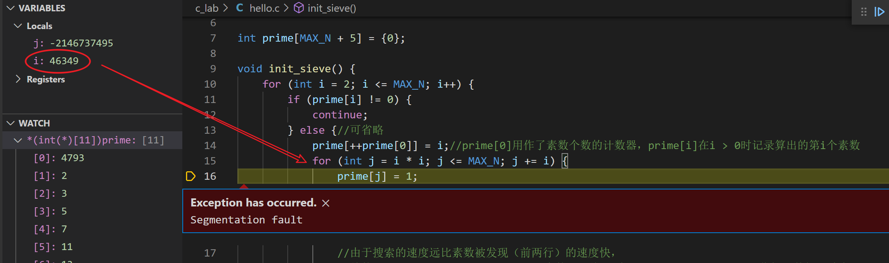
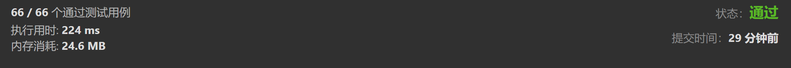
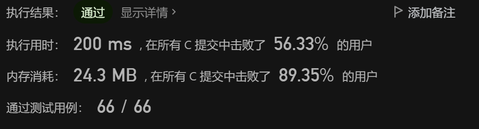
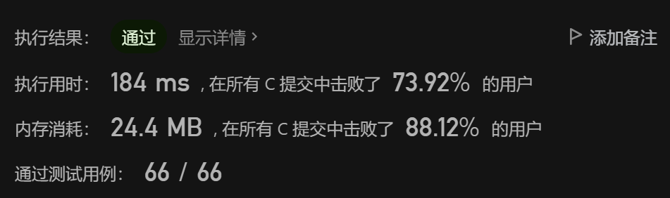
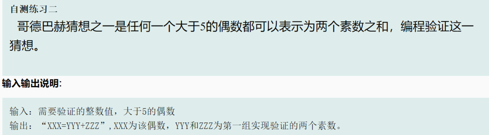

# Prime number

## 循环优化For loop

```c
/*************************************************************************
	> File Name: 7.is_prime.c
	> Author: 
	> Mail: 
	> Created Time: Tue 16 Mar 2021 06:31:54 PM CST
 ************************************************************************/
 
#include <stdio.h>

int is_prime(int n) {
    for (int i = 2; i * i <= n; i++) {
        if (n % i == 0) {
            return 0;
        }
    }
    return 1;
}

int main() {
    int n;
    while (~scanf("%d", &n)) {
        printf("%s\n", is_prime(n) ? "YES" : "NO");
    }

    return 0;
}

```

### 时间复杂度

#### 优化前

判断n个数之中的素数的时间复杂度$O(n ^ 2)$

#### 优化后

第11行，for循环的条件表达式中，条件由

```c
i <= n;
```

优化为

```c
i * i <= n;//size
```

为什么？
$$
设有数m的因子为a和b, a = min(a, b), b = max(a, b)\\
\Rightarrow {a \times b}\le n \\
\Rightarrow if(a \le \sqrt{n}) 
then (b \ge \sqrt{n}) \\
\Rightarrow 当a > \sqrt{n}时，b < \sqrt{n} \\
\Rightarrow 与假设冲突,故不可能找到a > \sqrt{n},使得a能帮我们排除下一个合数 \\
\Rightarrow 条件表达式中，只需a \times a \le n即可
$$


判断n个数之中的素数的时间复杂度$O(n \log n)$。

## 素数筛Prime sieve

```c
//素数筛法
//输入一个数，输出这个数内的所有素数
#include <stdio.h>
#include <stdlib.h>
#include <string.h>

void init_sieve(int *prime, int size) {
    for (int i = 2; i * i < size; i++) {//由i改成i * i。<= 改成 <，因为若=，则能作为因子标记的合数肯定已经被标记过了
        if (prime[i] == 0) {//若索引为素数
            for (int j = i * i; j <= size; j += i) {//原2 *i 优化为 i * i,去除重复标记j < i * i内的数字
                prime[j] = 1;//则标记所有索引为当前i的倍数的索引为偶数
            }
        }
        //若索引为合数，则不用标记，因为当前合数的倍数都已经被当前合数的最小因数标记过了
    }
}

int main() {
    int max;
    scanf("%d", &max);

    int *prime = (int *)malloc(sizeof(int) * (max + 1));//初始化标记数组，分配标记数组max + 1个sizeof(int)的内存，
    //为了让标记数组的索引与实际的数字一一对应，所以跳过0，多分配一个sizeof(int)的空间
    //memset(prime, 0, sizeof(prime));//标记数组赋值为全0,error,sizeof(prime) == sizeof(int)
    memset(prime, 0, sizeof(int) * (max + 1));

    init_sieve(prime, max + 1);
    //标记数组中索引为素数的元素为0，合数的元素为1

    for (int i = 2; i < max; i++) {
        if (prime[i] == 0) {
            printf("%d ", i);
        }
    }
    return 0;
}
```

```shell
100
2 3 5 7 11 13 17 19 23 29 31 37 41 43 47 53 59 61 67 71 73 79 83 89 97 
```

### 算法思想

用素数标记合数

1. 用`prime[i]`来标记i是否是合数
2. 标记为1的数字为合数，否则为素数
3. 第一次知道2是素数，则将2的倍数标记为1
4. 向后找到第一个没有被标记的数字`i`
5. 将`i`的倍数全部标记为合数
6. 重复4-6步，直到标记完范围内的所有数字

### 时间复杂度

#### 优化前

判断n个数之中的素数的时间复杂度$O(n \log n)$

#### 优化后

第11行，for循环的条件表达式中，条件由

```c
i <= n;
```

优化为

```c
i * i <= n;//size
```

为什么？

首先，我们来思考我们的目的：找出所有小于等于n的合数并标记。所以我们创建了第一层循环，目的是遍历所有可能为合数因子的素数，并利用这些数标记合数。
$$
设有数m的因子为a和b, a = min(a, b), b = max(a, b)\\
\Rightarrow {a \times b}\le n \\
\Rightarrow if(a \le \sqrt{n}) 
then (b \ge \sqrt{n}) \\
\Rightarrow 当a > \sqrt{n}时，b < \sqrt{n} \\
\Rightarrow 与假设冲突,故不可能找到a > \sqrt{n},使得a能帮我们标记下一个合数 \\
\Rightarrow 条件表达式中，只需要a \times a \le n即可
$$
判断n个数之中的素数的时间复杂度为$O(n\log (\log n))$。

[这个大概是唯一一个证明了时间复杂度的题解了！~ \- 计数质数 \- 力扣（LeetCode）](https://leetcode-cn.com/problems/count-primes/solution/zhe-ge-da-gai-shi-wei-yi-yi-ge-zheng-ming-liao-shi/)

### 空间复杂度

$O(n)$

### 计数并快速遍历素数

上面我们用prime数组作为标记索引的数是否为素数的一个标记数组，其实该数组更好的写法应该是is_prime。有没有方法把素数计数，并直接从小到大存在一个顺序的数组中？这样遍历素数就不用遍历合数并判断是否为质数，而是直接一个个遍历素数了。

```c
//素数筛法
//输入一个数，输出这个数内的所有素数
#include <stdio.h>
#include <stdlib.h>
#define MAX_N 10

int prime[MAX_N + 5] = {0};

void init_sieve() {
    for (int i = 2; i <= MAX_N; i++) {//不能用i * i，why？
        if (prime[i] != 0) {
            continue;
        } else {//可优化
            prime[++prime[0]] = i;//prime[0]用作了素数个数的计数器，prime[i]在i > 0时记录算出的第i个素数
            for (int j = i * i; j <= MAX_N; j += i) {
                prime[j] = 1;
                //由于搜索的速度远比素数被发现（前两行）的速度快，
                //故使用prime[i](i < prime[0])记录素数，和将后面prime[j](j >= i * i)用作标记数组不冲突
                //这样就充分利用了数组的空间
            }
        }
    }
}

int main() {
    init_sieve();
    printf("number of prime under %d = %d\n", MAX_N, prime[0]);
    for (int i = 1; i <= prime[0]; i++) {
        printf("%d\n", prime[i]);
    }
}
```

```shell
number of prime under 10 = 4
2
3
5
7
```

但是请注意，如果MAX_N被改为一个很大的数例如`100 0000`时，一个很大的素数个数可能被放到prime[0]中，造成`segment fault`



这里j被赋予了`i * i`，$46349 ^ 2$，大于int的32byte存储范围。显然的，将变量`i,j`改为`long long int`的64位byte存储可以解决问题。

```shell
number of prime under 100000 = 9592
```

`long long int`计算的耗时显然大于`int`，那么有没有别的方法呢？

```c
//素数筛法
//输入一个数，输出这个数内的所有素数
#include <stdio.h>
#include <stdlib.h>
#define MAX_N 100000

int prime[MAX_N + 5] = {0};

void init_sieve() {
    for (int i = 2; i <= MAX_N; i++) {
        if (prime[i] != 0) {
            continue;
        } else {//可省略
            prime[++prime[0]] = i;//prime[0]用作了素数个数的计数器，prime[i]在i > 0时记录算出的第i个素数
            for (int j = i; j <= MAX_N / i; j++) {
                prime[j * i] = 1;
                //由于搜索的速度远比素数被发现（前两行）的速度快，
                //故使用prime[i](i < prime[0])记录素数，和将后面prime[j](j >= i * i)用作标记数组不冲突
                //这样就充分利用了数组的空间
            }
        }
    }
}

int main() {
    init_sieve();
    printf("number of prime under %d = %d\n", MAX_N, prime[0]);
    for (int i = 1; i <= prime[0]; i++) {
        //printf("%d\n", prime[i]);
    }
}
```

仔细观察第15~16行，这里把乘法变为除法，循环范围由``i * i < j < MAX_N`变为`i < j < MAX_N / i`，`j += i`变为`j++`，明显循环的所有变量都除了一个`i`。输出同上。

#### 优化？

```c
    for (int i = 2; i <= MAX_N; i++) {//不能用i * i，why？10行
```

若这样优化，输出变为

```shell
number of prime under 10 = 2
2
3
```

原因：虽然标记仍然正常，但是由于`prime[0]`（存放素数个数）未正常自增，而是优化掉了重复标记，但是这样大于$\sqrt {MAXN}$的素数不会被计数，导致`prime[0]`变的比实际少，故不能这样优化。

## 例题

### 输出素数

[OJ - Online Judge (haizeix.com)](http://oj.haizeix.com/problem/79)

```c
/*************************************************************************
	> File Name: 78_hz.c
	> Author: 
	> Mail: 
	> Created Time: Fri Apr 22 11:07:00 2022
 ************************************************************************/

#include <stdio.h>
int a, b;
int prime[10000005];  // all 0, is prime

void init_sieve() {
	prime[1] = 1;
	for (int i = 2; i * i < b; i++) {//无论什么时候都从2开始，因为要完整的因数标记，本题目中不能从a开始
		if (prime[i] == 0) {
			for (int j = i * i; j <= b; j += i) {
				prime[j] = 1;
			}
		}
	}
	return ;
}

int main() {
    scanf("%d %d", &a, &b);
    init_sieve();
    for (int i = a; i <= b; i++) {
		if (prime[i] == 0) {
			printf("%d\n", i);
		}
	}
    return 0;
}
```

### 计数素数count-primes

[204. 计数质数 - 力扣（LeetCode） (leetcode-cn.com)](https://leetcode-cn.com/problems/count-primes/submissions/)

```c
int prime[5000005];//素数初始化为0
int countPrimes(int n){
    int count = 0;
    for (int i = 2; i < n; i++) {
        if (prime[i] == 0) {
            count++;
            for (int j = 2 * i; j < n; j += i) {
                prime[j] = 1;
            }
        }
    }
    return count;
}
```



显然，这是未优化的素数筛，能否简单地将4行中

```c
    for (int i = 2; i < n; i++) {
```

改为

```c
    for (int i = 2; i * i < n; i++) {
```

?

不行，若是这样改，只遍历了$\log n$的数组，后面$n - \log n$的数组未遍历。

只能再遍历一遍。

```c
int prime[5000005];//素数初始化为0
int countPrimes(int n){
    int count = 0;
    for (int i = 2; i * i < n; i++) {
        if (prime[i] == 0) {
            for (int j = 2 * i; j < n; j += i) {
                prime[j] = 1;
            }
        }
    }
    for (int i = 2; i < n; i++) {
        if (prime[i] == 0) {
            count++;
        }
    }
    return count;
}
```



```c
            for (int j = 2 * i; j < n; j += i) {//6行       
```

改为

```c
            for (int j = i * i; j < n; j += i) {//6行
```



### 哥德巴赫猜想

#### 哥德巴赫猜想的循环解法



##### 思路

素数筛肯定是可以的，尝试用循环解题。

分解问题，先循环出小于 x 的所有素数 i ，判断 $x - i$ 记为 j 是否为素数。

```c
#include <stdio.h>
//O pan to be n^3
int main() {
    int x;//even
    scanf("%d", &x);

    //find prime less than x
    for (int i = 2; i < x; i++) {
        int flag = 1;//1 prime, 0 composite
        for (int j = 2; j * j < i; j++) {
            if (i % j == 0) {
                flag = 0;
                break;
            }
        }
        if (flag == 1) {
            printf("%d ", i);//todo
        }
    }

    return 0;
}
```

```shell
20
2 3 4 5 7 9 11 13 17 19 
```

要求两次素数，故将其封装为函数

```c
#include <stdio.h>
//n^3
int is_prime_loop(int n) {
    int flag = 1;  // 1 prime, 0 composite
    for (int i = 2; i * i < n; i++) {
        if (n % i == 0) {
            flag = 0;
            return 0;
        }
    }
    if (flag == 1) {
        return 1;
    }
}


int main() {
    int x;//even
    scanf("%d", &x);

    //find prime less than x
    int flag = 0;
    int i;
    int j;
    for (i = 2; i < x / 2; i++) {
        if (is_prime_loop(i)) {
            j = x - i;
            if (is_prime_loop(j)) {
                flag = 1;
                break;
            }
        }
    }
    if (flag) {
        printf("%d=%d+%d", x, i, j);
    }
    return 0;
}
```

```shell
20
20=3+17
```

##### time complexity

for 循环，两个求素数函数中两次 for 循环。

$O(n ^ 3)$

#### 路飞的猜想

[OJ - Online Judge (haizeix.com)](http://oj.haizeix.com/problem/190)

##### 题目描述

 有一天路飞突发奇想，他有一个猜想，任意一个大于 `2` 的偶数好像总能写成 `2` 个质数的和。路飞查了资料，发现这个猜想很早就被一个叫哥德巴赫的人提出来了，称为哥德巴赫猜想。目前还没有证明这个猜想的正确性。路飞告诉你一个整数 `n` ，让你用这个数去验证。

 **注意 11 不是质数**。

------

##### 输入

输入一个偶数 `n(2≤n≤8000000)`。

##### 输出

输出一个整数表示有多少对 (x,y) 满足 `x+y=n(x≤y)` 且x,y 均为质数。

------

##### 样例

###### 样例输入1

```C++
10
```

###### 样例输出1

```c++
2
```

##### Solve

```c
/*************************************************************************
	> File Name: 190_hz.c
	> Author: 
	> Mail: 
	> Created Time: Fri Apr 22 11:37:55 2022
 ************************************************************************/

#include <stdio.h>

int prime[8000005];//0 is prime

void init_sieve(int n) {
	prime[1] = 1;
	for (int i = 2; i * i < n; i++) {
		if (prime[i] == 0) {
			for (int j = i * i; j <= n; j += i) {
				prime[j] = 1;
			}
		}
	}
	return ;
}

int main() {
	int n;
	scanf("%d", &n);
	
	init_sieve(n);

	//哥德巴赫
	int count = 0;
	for (int i = 2; i <= n / 2; i++) {//i < n改为i <= n / 2，避免(3, 7)(7, 3)重复
		if (prime[i] == 0) {
			int j = n - i;
			if (j < n && prime[j] == 0) {
				count++;
			}
		}
	}
	printf("%d\n", count);
	return 0;
}
```

### 回文素数prime-palindrome

[866. 回文素数 - 力扣（LeetCode） (leetcode-cn.com)](https://leetcode-cn.com/problems/prime-palindrome/)

[\(1条消息\) \[解题报告\]【第36题】给定一个数，判断这个数是不是素数\_XingleiGao的博客\-CSDN博客](https://blog.csdn.net/qq_17593855/article/details/121760681)

### 求最小和最大素因子

```c
/*************************************************************************
	> File Name: factor.c
	> Author: 
	> Mail: 
	> Created Time: Tue 16 Mar 2021 08:17:11 PM CST
 ************************************************************************/

#include <stdio.h>
#define MAX_N 100

int prime[MAX_N + 5] = {0};

void init_sieve_mini_fac() {
    for (int i = 2; i <= MAX_N; i++) {
        if (prime[i]) {
            continue;
        }
        for (int j = i; j <= MAX_N; j += i) {
            if (prime[j]) {
                continue;  //如果已经被标记为合数，循环继续
            }
            prime[j] = i;  //不是素数，在标记数组中存用来标记该数为合数的素数
        }
    }
    return;
}

int main() {
    init_sieve_mini_fac();
    for (int i = 2; i <= MAX_N; i++) {
        printf("min_fac[%d] = %d\n", i, prime[i]);
    }
    return 0;
}

```

```shell
min_fac[2] = 2
min_fac[3] = 3
min_fac[4] = 2
min_fac[5] = 5
min_fac[6] = 2
min_fac[7] = 7
min_fac[8] = 2
min_fac[9] = 3
min_fac[10] = 2
...
```

19行的if语句十分重要。在合数已经被标记过的情况下继续循环，避免了重复标记。

[mini_factor.c](code_prime_number\mini_factor.c) 

对应地，去掉19行的if，可以使数组中存的元素变为最大素因子。

 [max_factor.c](code_prime_number\max_factor.c) 

```shell
max_fac[2] = 2
max_fac[3] = 3
max_fac[4] = 2
max_fac[5] = 5
max_fac[6] = 3#仔细观察变化
max_fac[7] = 7
max_fac[8] = 2
max_fac[9] = 3
max_fac[10] = 5
...
```


[867. 分解质因数 - AcWing题库](https://www.acwing.com/problem/content/description/869/)

[1142 -- Smith Numbers (poj.org)](http://poj.org/problem?id=1142)类似hz310. 阶乘分解

### 素数距离

[OJ - Online Judge (haizeix.com)](http://oj.haizeix.com/problem/191)191

#### 题目描述

路飞请你求出区间 [l,r][l,r] 上距离最近的相邻的素数对和距离最远的相邻的素数对。 3,53,5 是相邻的素数，2,52,5 不是相邻的素数。距离定义为 22 个素数的差的绝对值。比如 5,75,7 距离为 22 。

------

#### 输入

输入 22 个整数 `l,r(1≤l≤r≤8000000)`。

#### 输出

如果 `a,b(a<b)`是距离最近的素数对，`c,d(c<d) `是距离最远的素数对，按照如下格式输出 `a,b are closest, c,d are most distant.` 。如果最近或者最远有多对，输出 aa 和 cc 最小的。如果没有相邻是素数对，输出 `There are no adjacent primes.`

------

#### 样例

##### 样例输入1

```
3 10
```

##### 样例输出1

```
3,5 are closest, 3,5 are most distant.
```

##### 样例输入2

```
14 17
```

##### 样例输出2

```
There are no adjacent primes.
```

#### Solve

[计数并快速遍历素数](###计数并快速遍历素数)思想

```c
/*************************************************************************
    > File Name: 191_hz.c
    > Author:
    > Mail:
    > Created Time: Sat Apr 23 22:40:31 2022
 ************************************************************************/

#include <stdio.h>
#define MAX_N 8000005

int prime[MAX_N] = {0};

void init_sieve() {
    for (int i = 2; i * i < MAX_N; i++) {
        if (prime[i] == 0) {
            prime[0]++;
            prime[prime[0]] = i;
            for (int j = i; j <= MAX_N / i; j++) {
                prime[j * i] = 1;
            }
        }
    }
}

int main() {
    int l, r;
    scanf("%d %d", &l, &r);
    init_sieve();

    int max_prime[2] = {0}, min_prime[2] = {0};
    int max = 0, min = MAX_N;
    int distance;

    for (int i = 1; i <= prime[0] && prime[i + 1] <= r /*若为14 17则后者不成立*/; i++) {  // i现在限制的是范围，j是素数的索引
        if (prime[i] >= l) {
            distance = prime[i + 1] - prime[i];
            if (distance < min) {
                min = distance;
                min_prime[0] = prime[i];
                min_prime[1] = prime[i + 1];
            }
            if (distance > max) {
                max = distance;
                max_prime[0] = prime[i];
                max_prime[1] = prime[i + 1];
            }
        }
    }
    if (min_prime[0] == 0 && min_prime[0] == 0) {
        printf("There are no adjacent primes.");
    } else {
        printf("%d,%d are closest, %d,%d are most distant.", min_prime[0], min_prime[1], max_prime[0], max_prime[1]);
    }

    return 0;
}
```

