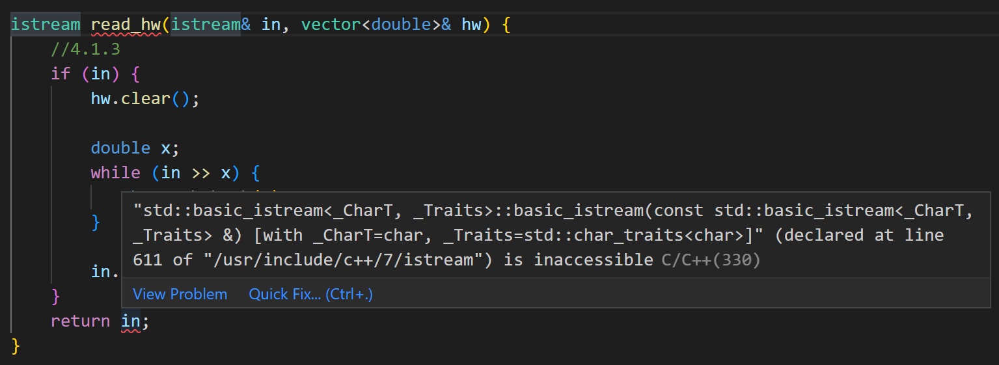

# 4

## 4-0

### bug1



return type not the same with declaration.

### cmake

[c\+\+ \- How do I add several \.cpp files into a single CMakeLists\.txt \- Stack Overflow](https://stackoverflow.com/questions/44381543/how-do-i-add-several-cpp-files-into-a-single-cmakelists-txt)

```shell
youhuangla@Ubuntu 4-0 % mkdir build                                                                          [0]
youhuangla@Ubuntu 4-0 % cd build/                                                                            [0]
youhuangla@Ubuntu build % cmake ../                                                                          [0]
-- The C compiler identification is GNU 7.5.0
-- The CXX compiler identification is GNU 7.5.0
-- Check for working C compiler: /usr/bin/cc
-- Check for working C compiler: /usr/bin/cc -- works
-- Detecting C compiler ABI info
-- Detecting C compiler ABI info - done
-- Detecting C compile features
-- Detecting C compile features - done
-- Check for working CXX compiler: /usr/bin/c++
-- Check for working CXX compiler: /usr/bin/c++ -- works
-- Detecting CXX compiler ABI info
-- Detecting CXX compiler ABI info - done
-- Detecting CXX compile features
-- Detecting CXX compile features - done
-- Configuring done
-- Generating done
-- Build files have been written to: /home/youhuangla/accelerated_cpp/4/4-0/build
youhuangla@Ubuntu build % make                                                                               [0]
Scanning dependencies of target a.out
[ 20%] Building CXX object CMakeFiles/a.out.dir/4-0_ac.cpp.o
[ 40%] Building CXX object CMakeFiles/a.out.dir/grade.cpp.o
[ 60%] Building CXX object CMakeFiles/a.out.dir/median.cpp.o
[ 80%] Building CXX object CMakeFiles/a.out.dir/Student_info.cpp.o
[100%] Linking CXX executable a.out
[100%] Built target a.out
youhuangla@Ubuntu build % ls                                                                                 [0]
CMakeCache.txt  CMakeFiles  Makefile  a.out  cmake_install.cmake
youhuangla@Ubuntu build % ./a.out                                                                          [130]
Johnny 70 80 50 60 30 Fred 95 90 100 100 100 Joe 40 40 50 60 50 70 70 50
Fred   95
Joe    46
Johnny 66
youhuangla@Ubuntu build % ./a.out                                                                            [0]
Johnny 70 80 50 60 30
Leon 100 100
Fred 95 90 100 100 100
Simon 90 90
Joe 40 40 50 60 50 70 70 50
Fred   95
Joe    46
Johnny 66
Leon   strudent has done no homework
Simon  strudent has done no homework
```

cmake的使用[远程开发C++_4.Linux下如何打造C++完美开发IDE：clangd_哔哩哔哩_bilibili](https://www.bilibili.com/video/BV16g411N77i?spm_id_from=333.337.search-card.all.click)

Example from : [Accelerated C\+\+ Solution to Exercise 4\-0 \| Mathalope](http://mathalope.co.uk/2014/07/23/accelerated-c-solution-to-exercise-4-0/#studentinfocpp).

## 4-1

有问题，max 的形式参数的类型不同。

the argument types in a call to `max` match exactly

```cpp
size_t maxlen;
Student_info s;
max(s.name.size(), maxlen);
```

## 4-2

```cpp
/*************************************************************************
	> File Name: 4-2_ac.cpp
	> Author: 
	> Mail: 
	> Created Time: Tue May 10 16:28:30 2022
 ************************************************************************/

#include <iostream>
#include <iomanip>

using std::cout;
using std::setw;
using std::endl;

int main() {
	for (int i = 1; i <= 100; i++) {
		cout << setw(3) << i << setw(6) << i * i << endl;
	}
	return 0;
}
```

```shell
  1     1
  2     4
  3     9
  4    16
  5    25
  6    36
  ......
 96  9216
 97  9409
 98  9604
 99  9801
100 10000
```

## 4-3

```cpp
/*************************************************************************
        > File Name: 4-2_ac.cpp
        > Author:
        > Mail:
        > Created Time: Tue May 10 16:28:30 2022
 ************************************************************************/

#include <iomanip>
#include <iostream>

using std::cout;
using std::endl;
using std::setw;

int get_max_column(int x) {
    int max = 0;
    while (x != 0) {
        x /= 10;
        max++;
    }
    return max;
}

int main() {
    int max = 999;
    for (int i = 1; i <= max; i++) {
        cout << setw(get_max_column(max) + 1) << i << setw(get_max_column(max * max) + 1) << i * i << endl;
    }
    return 0;
}
```

```output
   1      1
   2      4
   3      9
   4     16
   5     25
   6     36
   7     49
   8     64
   9     81
  10    100
  11    121
  12    144
  13    169
  14    196
  15    225
  16    256
  17    289
  18    324
  19    361
  20    400
  21    441
  22    484
  ......
 995 990025
 996 992016
 997 994009
 998 996004
 999 998001
```

## 4-4

```cpp
/*************************************************************************
	> File Name: 4-4_ac.cpp
	> Author: 
	> Mail: 
	> Created Time: Thu May 12 08:39:16 2022
 ************************************************************************/

#include <iomanip>
#include <iostream>

using std::cout;
using std::endl;
using std::setw;

int get_max_column(double x) {
    int max = 0;
    while (x > 1) {//difference
        x /= 10;
        max++;
    }
    return max;
}

int main() {
    double max = 999;
    for (double i = 1; i <= max; i++) {
        cout << setw(get_max_column(max) + 1) << i << setw(get_max_column(max * max) + 1) << i * i << endl;
    }
    return 0;
}
```

```output
...
 996 992016
 997 994009
 998 996004
 999 998001
```

## 4-5

```cpp
/*************************************************************************
	> File Name: 4-5_ac.cpp
	> Author: 
	> Mail: 
	> Created Time: Thu May 12 08:46:34 2022
 ************************************************************************/

#include <ios>
#include <iostream>
#include <istream>
#include <vector>
#include <string>
#include <algorithm>

using std::cin;
using std::cout;
using std::endl;
using std::vector;
//using std::streamsize;
using std::istream;
using std::string;
using std::sort;

void read_cin(istream &is, vector<string> &vec_str) {
	string word;
	while (cin >> word) {
		vec_str.push_back(word);
	}
	return ;
}

struct word_info {
	string word;
	int count;	
};


int main() {
	vector<string> vec_str;
	read_cin(cin, vec_str);
	cout << "The number of words is: " << vec_str.size() << endl;
	sort(vec_str.begin(), vec_str.end());
	
	vector<word_info> vec_info;
	int dic = 0;//like store in a dictionary, dic is the index of different word
	for (int i = 0; i < vec_str.size(); i++) {
		struct word_info info;
		if (i == 0) {
			info.word = vec_str[i];
			info.count = 1;
			vec_info.push_back(info);
		} else if (vec_str[i - 1] != vec_str[i]) {
			dic++;
			info.word = vec_str[i];
			info.count = 1;
			vec_info.push_back(info);
		} else {
			vec_info[dic].count++;
		}
	}
	for (int i = 0; i < vec_info.size(); i++) {
		cout << vec_info[i].word << " : " << vec_info[i].count << endl;
	}
	return 0;
}

```

```output
youhuangla@Ubuntu 4 % ./a.out                                                                                [0]
aaa aaa aaa
The number of words is: 3
aaa : 3
youhuangla@Ubuntu 4 % ./a.out                                                                                [0]
aaa bbb ccc ddd aaa bbb aaa
The number of words is: 7
aaa : 3
bbb : 2
ccc : 1
ddd : 1
```

## 4-6

[book\-exercises/4\-6\.cpp at master · bitsai/book\-exercises](https://github.com/bitsai/book-exercises/blob/master/Accelerated%20C%2B%2B/chapter04/4-6.cpp)

```cpp
/*************************************************************************
	> File Name: 4-7_ac.cpp
	> Author: 
	> Mail: 
	> Created Time: Thu May 12 11:08:43 2022
 ************************************************************************/

#include <iostream>
#include <vector>

using std::vector;
using std::cin;
using std::cout;
using std::endl;

int main() {
	double x;
	vector<double> vec_dou;
	while (cin >> x) {
		vec_dou.push_back(x);
	}
	double sum = 0;
	for (auto i : vec_dou) {
		sum += i;
	}
	cout << "The average: " << sum / vec_dou.size() << endl;
	return 0;
}
```

```output
1 2 3 4
The average: 2.5
```

## 4-8

```cpp
double d = f () [n]
```

`f()` return a pointer that points to a double array's number n - 1 element.

[c\+\+ \- Is this notation possible?  \| DaniWeb](https://www.daniweb.com/programming/software-development/threads/39569/is-this-notation-possible)
