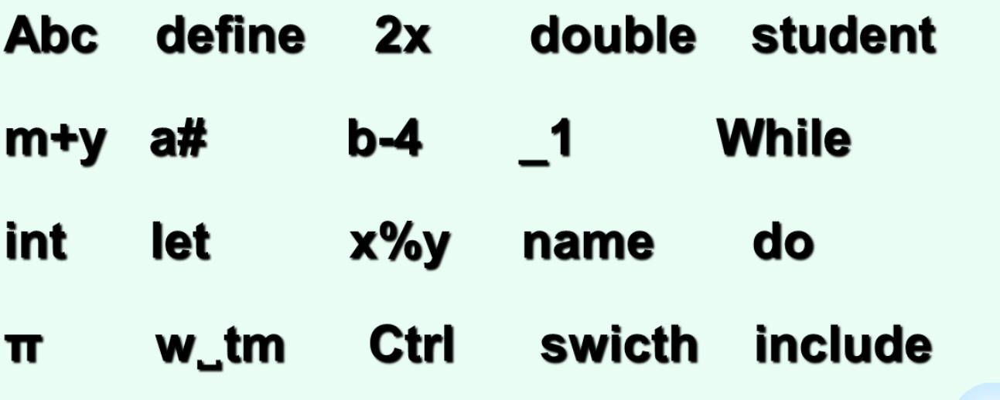
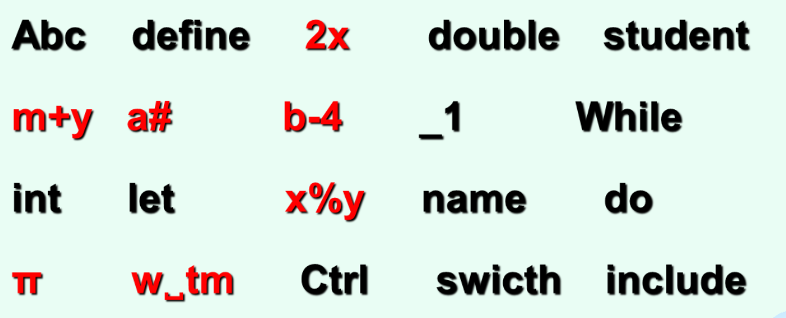
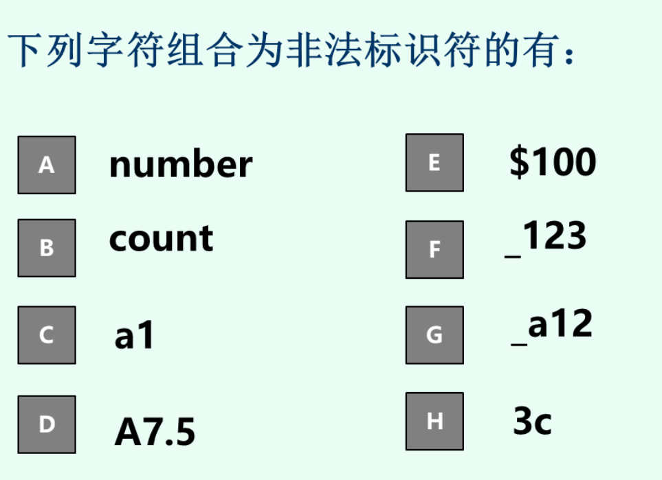
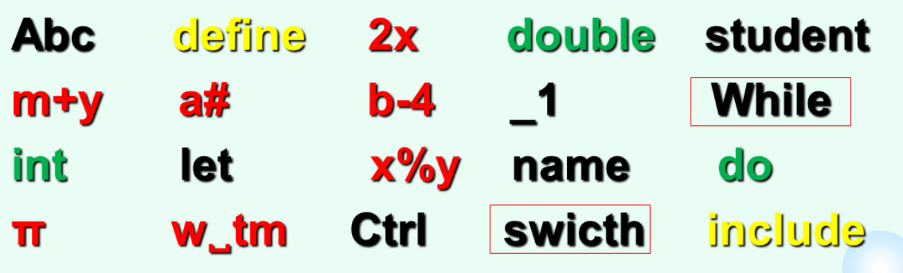

# C语言基本概念

## 简单程序的一般形式

- 有且仅有一个主函数（main）
- 从main开始，从main结束

### 指令

### [函数](./函数.md)

### 语句

包括说明性语句、可执行语句

规定每条语句以分号结尾（除复合语句外）

#### 函数调用语句

#### 控制语句

9种，可分成以下三类：

##### 条件判断语句

- if
- switch

##### 循环执行语句

- do while
- while
- for

##### 转向语句

- break
- continue
- return
- goto

## 注释

可以出现在程序的任何位置

## 变量和赋值

### 声明

在使用变量之前必须对其进行声明

注意：不可以用未声明的变量声明一个变量

```c
int a = b = 0;
/*❌ 
error: ‘b’ undeclared here (not in a function)
 int a = b = 1;
         ^
*/
```

### 赋值

```c
int i, int j;//wrong
```

```c
ch2 = 66;//'B', 'A' == 65
ch3 = '\142';// 'b','a' = 97 
```

```c
int a=b=c=0;//是错的，但是下面这样就对：
```

```c
int a,b,c;
a=b=c=0;
```


下面这样也对：

```c
int a=0,b=0,c=0;
```

因为变量定义语句的一个逗号只能定义一个变量，不能同时定义多个，而赋值语句是可以的。

## 标识符

可以含有字母、下划线和数字，但必须<u>以字母或者下划线开头</u>。

区分大小写。

用于对变量、符号常量、数组、函数、数据类型、宏等操作对象进行命名

### 标识符类型

#### 系统定义标识符

具有固定名字和特定含义的标识符

##### 关键字

必须用小写字母

C89(C90)和KR.C中一共有<u>32个</u>关键字，下面的分类只包括以上标准的关键字

###### 数据类型

int、char、float、double、short、long、void、signed、unsigned、enum、struct、union、const、typedef、volatile 

###### 存储类别

auto、static、register、extern 

###### 语句命令字

break、case、continue、default、do、else、for、goto、if、return、switch、while 

###### 运算符

sizeof

##### 预定义标识符

> 预定义标识符是C语言中系统预先定义的标识符，如系统类库名、系统常量名、系统函数名。预定义标识符具有见字明义的特点，如函数**“**格式输出”（英语全称加缩写：[printf](https://baike.baidu.com/item/printf)）、“格式输入”（英语全称加缩写：[scanf](https://baike.baidu.com/item/scanf)）、sin、[isalnum](https://baike.baidu.com/item/isalnum)等等。预定义标识符可以作为用户标识符使用，只是这样会失去系统规定的原意，使用不当还会使程序出错。——百度百科

如：

1. 系统标准库函数：scanf、printf、putchar、getchar、strcpy、strcmp、sqrt等，这些系统标准库函数的名字只能包含小写字母。
2. 编译预备处理命令：include、define 等

#### 用户定义标识符

用于对用户使用的变量、数组、函数等操作对象进行命名

### 标识符练习

#### 正确区分标识符

1. 非标识符用红标出

2. DEH

#### 区分关键字、预定义标识符、用户定义标识符

其中合法标识符中哪些是关键字（黄），娜些是预定义标识符（绿），哪些是用户定义标识符（黑）。框中易与关键字搞混。



