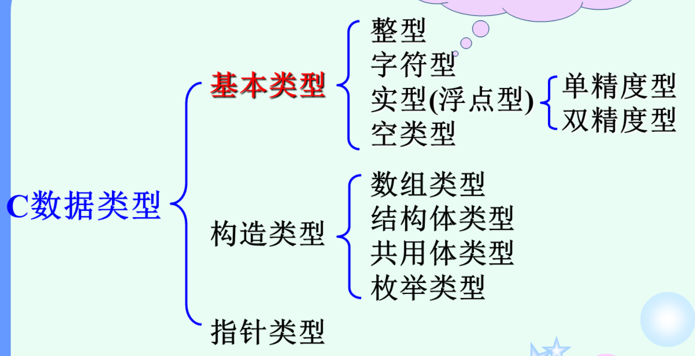

# 基本类型

## 整数类型

| 类型     | 类型指定符的组合 | 分配空间(Byte) |
| -------- | ---------------- | -------------- |
| 基本整型 | int              | 4              |
| 短整型   | short int        | 2              |
| 长整型   | long int         | 4              |

均以二进制补码形式存储

### 补码

CSAPP

最常见的有符号数的计算机表示方式就是补码（Two’s-complement) 形式。在这个定义中，将字的最高有效位解释为负权（negative weight)

 我们用函数$B2T_w$(Binary to Two’s-complement)的缩写，长度为w)来表示：

**原理**：补码编码的定义
对向量$\vec{x} = [ x _ { w - 1 } , x _ { w - 2 } , \cdots , x _ { 0 } ]$:
$$
B 2 T _ { w } ( \vec {x} ) = - x _ { w - 1 } 2 ^ { w - 1 } + \sum _ { i = 0 } ^ { w - 2 } x _ { i } 2 ^ { i }
$$

### 反码

CSAPP

反码（One's Complement): 除了最高有效位的权是$-( 2^{w - 1} - 1)$ 而不是$-2^{w - 1}$，它和补码是一样的：
$$
B 2 O _ { w } ( \vec {x} ) = - x _ { w - 1 } ( 2 ^ { w - 1 } - 1 ) + \sum _ { i = 0 } ^ { w - 2 } x _ { i } 2 ^ { i }
$$

### 原码

原码(Sign-Magnitude): 最高有效位是符号位，用来确定剩下的位应该取负权还是正权：
$$
B 2 S _ { w } ( \vec {x} ) = ( - 1 ) ^ { x _ { w - 1 } } \cdot ( \sum _ { i = 0 } ^ { w - 2 } x _ { i } 2 ^ { i })
$$

### 反码与原码

这两种表示方法都有一个奇怪的属性，那就是对于数字0有两种不同的编码方式。这两种表示方法，把[00...0]都解释为+0,而值-0 在原码中表示为[10...0]，在反码中表示为[11...1]。 虽然过去生产过基于反码表示的机器，但是几乎所有的现代机器都使用补码。我们将看到在浮点数中有使用原码编码。

请注意补码（Two’s complement)和反码（One’s complement)中撇号的位置是不同的。术语补码来源于这样一个情况，对于非负数x, 我们用$2^w - x$(这里只有一个2)来计算$-x$的$w$位表示。术语反码来源于这样一个属性，我们用[111⋯1]-x(这里有很多个1)来计算$-x$的反码表示。

## 浮点类型

## 字符类型

## 类型转换

## 类型定义

## sizeof运算符