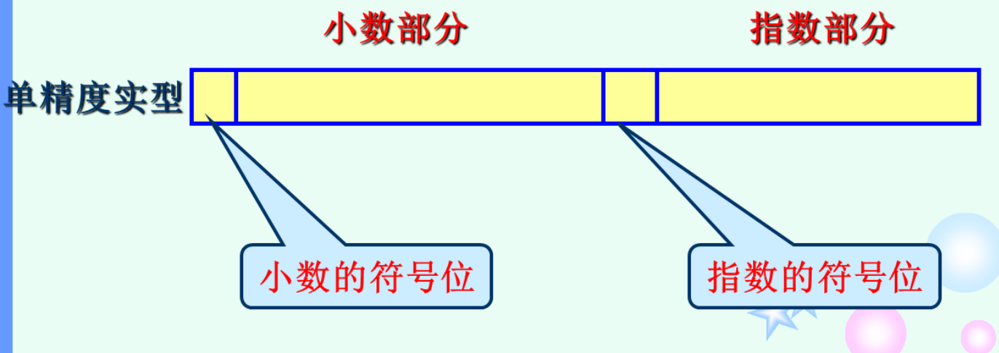
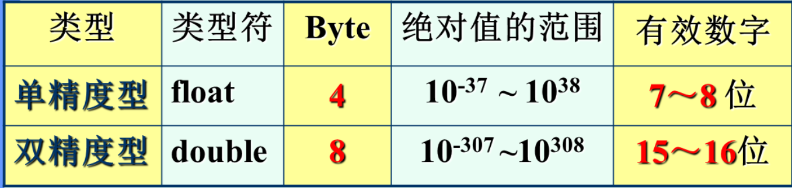

# 基本类型

## 整数类型

### 类型指定符与分配的空间

| 类型     | 类型指定符的组合 | 分配空间(Byte) |
| -------- | ---------------- | -------------- |
| 基本整型 | int              | 4              |
| 短整型   | short int        | 2              |
| 长整型   | long int         | 4              |

### 存储

均以二进制补码形式存储

#### 补码

CSAPP

最常见的有符号数的计算机表示方式就是补码（Two’s-complement) 形式。在这个定义中，将字的最高有效位解释为负权（negative weight)

 我们用函数$B2T_w$(Binary to Two’s-complement)的缩写，长度为w)来表示：

**原理**：补码编码的定义
对向量$\vec{x} = [ x _ { w - 1 } , x _ { w - 2 } , \cdots , x _ { 0 } ]$:
$$
B 2 T _ { w } ( \vec {x} ) = - x _ { w - 1 } 2 ^ { w - 1 } + \sum _ { i = 0 } ^ { w - 2 } x _ { i } 2 ^ { i }
$$

#### 反码

CSAPP

反码（One's Complement): 除了最高有效位的权是$-( 2^{w - 1} - 1)$ 而不是$-2^{w - 1}$，它和补码是一样的：
$$
B 2 O _ { w } ( \vec {x} ) = - x _ { w - 1 } ( 2 ^ { w - 1 } - 1 ) + \sum _ { i = 0 } ^ { w - 2 } x _ { i } 2 ^ { i }
$$

#### 原码

CSAPP

原码(Sign-Magnitude): 最高有效位是符号位，用来确定剩下的位应该取负权还是正权：
$$
B 2 S _ { w } ( \vec {x} ) = ( - 1 ) ^ { x _ { w - 1 } } \cdot ( \sum _ { i = 0 } ^ { w - 2 } x _ { i } 2 ^ { i })
$$

#### 反码与原码

这两种表示方法都有一个奇怪的属性，那就是对于数字0有两种不同的编码方式。这两种表示方法，把[00...0]都解释为+0,而值-0 在原码中表示为[10...0]，在反码中表示为[11...1]。 虽然过去生产过基于反码表示的机器，但是几乎所有的现代机器都使用补码。我们将看到在浮点数中有使用原码编码。

请注意补码（Two’s complement)和反码（One’s complement)中撇号的位置是不同的。术语补码来源于这样一个情况，对于非负数x, 我们用$2^w - x$(这里只有一个2)来计算$-x$的$w$位表示。术语反码来源于这样一个属性，我们用[111⋯1]-x(这里有很多个1)来计算$-x$的反码表示。

### 整型常量的进制表示

| 进制     | 表示          | 开头            |
| -------- | ------------- | --------------- |
| 十进制   | 0~9           | 一定不能以0开头 |
| 八进制   | 0~7           | 必须以0开头     |
| 十六进制 | 0~9和a~f(A~F) | 总是以0x开头    |

### 整型常量的结尾

| 强制编译器把常量作为 | 结尾加上 |
| -------------------- | -------- |
| 长整数               | L/l      |
| 无符号               | U/u      |

两者可结合使用，表示常量是无符号的长整型

## 浮点类型

### 类型

(实型)

| 类型   | 类型指定符 | 分配空间(Byte) |
| ------ | ---------- | -------------- |
| 单精度 | float      | 4              |
| 双精度 | double     | 8              |

### 存储

### 精度与范围

- 这里的有效数字指的是十进制的位数

CSAPP(待深入理解)

#### 精度

  > - [Single precision](https://en.wikipedia.org/wiki/Single-precision_floating-point_format) (binary32), usually used to represent the "float" type in the C language family (though this is [not guaranteed](https://en.wikipedia.org/wiki/C_data_types#Basic_types)). This is a binary format that occupies 32 bits (4 bytes) and its significand has a precision of 24 bits (about 7 decimal digits).
  > - [Double precision](https://en.wikipedia.org/wiki/Double-precision_floating-point_format) (binary64), usually used to represent the "double" type in the C language family (though this is [not guaranteed](https://en.wikipedia.org/wiki/C_data_types#Basic_types)). This is a binary format that occupies 64 bits (8 bytes) and its significand has a precision of 53 bits (about 16 decimal digits).
  >
  > https://en.wikipedia.org/wiki/Floating-point_arithmetic#Accuracy_problems

##### float在printf中默认保留位数

> *精度*指定小数点字符后出现的准确数位数。 默认精度是 6 。 在*替用实现*中即使没有小数点后数位也写小数点。 无穷大和非数的转换样式见注意。
>
> ——cppreference.zh->printf

##### 小数的数值修约

> [奇进偶舍](https://zh.wikipedia.org/wiki/%E5%A5%87%E9%80%B2%E5%81%B6%E6%8D%A8)
>
> 奇进偶舍，是一种计数保留法，是一种[数值修约](https://zh.wikipedia.org/wiki/數值簡化)规则。从[统计学](https://zh.wikipedia.org/wiki/統計學)的角度，“奇进偶舍”比“[四舍五入](https://zh.wikipedia.org/wiki/四捨五入)”更为精确：在大量运算时，因为舍入后的结果有的变大，有的变小，更使舍入后的结果误差均值趋于零。而不是像四舍五入那样逢五就进位，导致结果偏向大数，使得误差产生积累进而产生系统误差。“奇进偶舍”使测量结果受到舍入误差的影响降到最低。

## 字符类型

(char类型)

作用：表示字母、数字、各种符号等（通常用ASCII码表示）的字符

类型指定符：char

分配空间：1Byte，本质上存储为8位二进制

用字符常量赋值时，将字符常量用单引号括起来

字符集：ASCII(由美国规定)是最常用的字符集，它用7位代码表示128个字符，常被扩展成8位用于表示256个字符。

- 其中，'a'的值***<u>97</u>***，'A'的值为***<u>65</u>***，这两个值十分重要！对应的：
  - $小写英文字母第n个字母的ASCII值 = 97 + n - 1$
  - $大写字母的ASCII值 = 小写字母的ASCII值 - 32$
- 要注意的是小写字母的ASCII值大于大写字母

### 字符操作

C语言把字符当作小整数进行处理

### 转义序列

作用：处理字符集中的每一个特殊符号（不可见或无法从键盘输入）的字符，可用于表示字符常量，也可以用于表示字符串常量（字符串字面量）中的字符

根据组成的分类：字符转义序列、数字转义序列

#### 字符转义序列

组成：`\` `+` `字符` 

缺点： 

1. 没有包含所有无法打印的的ASCII字符，只包含了最常用的字符
2. 无法用于表示除最基本的128个ASCII字符以外的字符

#### 数字转义序列

组成：`\ + 数字`

优点：可以表示任何字符

用法：在ASCII表中查找字符的八进制或十六进制，用作字符常量时也要用单引号括起来

##### 八进制转义序列

组成：`\ + 最多含有三位数字的八进制`

注意：转义序列中的八进制不一定要用0开头

##### 十六进制转义序列

组成：`\ + 十六进制数`

## 类型转换

## 类型定义

## sizeof运算符