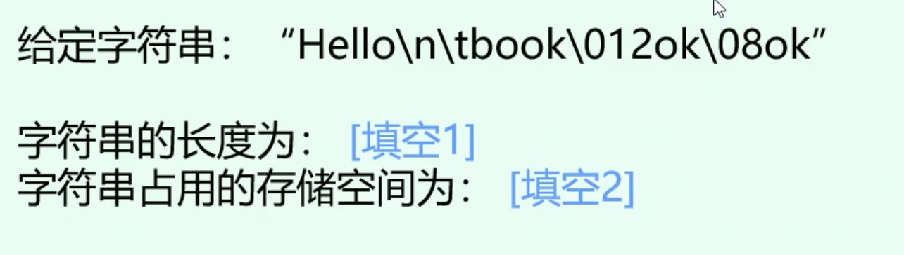

# 字符串

定义： 字符序列

## 字符串常量(字面量)

(string literal)字面串

定义：一对双引号括起来的字符序列

长度：所包含的字符个数，见[使用C语言的字符串库](#使用C语言的字符串库)中的`strlen`(todo)

### 字面量(literal)

> 在计算机科学中，字面量（literal）是用于表达[源代码](https://baike.baidu.com/item/源代码/3969)中一个固定值的表示法（notation）。几乎所有[计算机编程语言](https://baike.baidu.com/item/计算机编程语言/5581937)都具有对基本值的字面量表示，诸如：[整数](https://baike.baidu.com/item/整数/1293937)、[浮点数](https://baike.baidu.com/item/浮点数/6162520)以及[字符串](https://baike.baidu.com/item/字符串/1017763)；而有很多也对[布尔类型](https://baike.baidu.com/item/布尔类型/9517367)和[字符](https://baike.baidu.com/item/字符/4768913)类型的值也支持字面量表示；还有一些甚至对[枚举类型](https://baike.baidu.com/item/枚举类型/2978296)的元素以及像[数组](https://baike.baidu.com/item/数组/3794097)、[记录](https://baike.baidu.com/item/记录/14312145)和对象等复合类型的值也支持字面量表示法。
>
> [字面量_百度百科 (baidu.com)](https://baike.baidu.com/item/字面量#reference-[1]-1208327-wrap)

字面量在C中：

1. 字面串，即字符串字面量，字符串常量，写作string literal(本节)
2. 符合字面量（见函数一章(todo)）

### 如何存储字符串常量

从本质而言，C语言把字符串常量作为字符数组来处理。当C语言编译器在程序中遇到长度为`n`的字符串常量时，它会为字符串字面量分配长度为`n + 1`的内存空间。这块内存空间将用来存储字符串常中的字符，以及一个用来标志字符串末尾的额外字符（空字符）。空字符是一个所有位都为0的字节，因此用转义序列\0 来表示。

- 不要混淆空字符（`'\0'` ）和零字符（`'0'` ）。空字符的码值为0，而零字符则有不同的码值（ASCII中为48）。
- 字符串常量"`abc`"作为有4个字符的数组存储，如下

| a    | b    | c    | \0   |
| ---- | ---- | ---- | ---- |

#### 混沌字符串



- `'\n', '\t', '\012'`各自为一个转义序列，各算一个字符，`'\'`后面可接0开头的三位（去掉0两位）数字来表示八进制
- `'\08'`：`'\0'`后面可以是一个二位八进制，但是由于八进制数中最大数为7，故`'\08'`中的`8`不符合，只能拆分成`'\0'`和`'8'`，前面是一个字符串
- 1：14
- 2：19
- <https://baike.baidu.com/item/%E8%BD%AC%E4%B9%89%E5%AD%97%E7%AC%A6/86397>

#### 优美的字符串遍历技巧

如何在不计算字符串长度的情况下，遍历字符串的每一位呢？程序设计要求是，读入一个字符串，然后在不计算字符串长度的情况下，输出字符串中的每一个字符，每个字符占一行。其中所谓计算字符串长度的方法，包括但不限于 strlen，sprintf，先行 for 循环遍历统计等。

```c
#include <stdio.h>
int main() {
    char str[1000];
    scanf("%s", str);
    for (int i = 0; str[i]; i++) {//str[i] != NULL or str[i] != '\0'
        printf("%c\n", str[i]);
    }
    return 0;
}
```

```c
123456
1
2
3
4
5
6
```


## 字符串变量

### 字符数组与字符指针

#### Bug

> 《现代方法》p221

一起来比较一下下面这两个看起来很相似的声明：

```c
char date[] = "June 14";
char *date = "June 14";
```

前者声明date 是一个数组 ，后者声明date 是一个指针 。正因为有了数组和指针之间的紧密关系，才使上面这两个声明中的date 都可以用作字符串。尤其是，任何期望传递字符数组或字符指针的函数都能够接收这两种声明的date 作为参数。

然而，需要注意，不能错误地认为上面这两种date 可以互换。两者之间有很大的差异：

- 在声明为数组时，就像任意数组元素一样，可以修改存储在 date 中的字符。在声明为指针时，date 指向字符串字面量，在13.1 节我们已经看到字符串字面量是不可以修改的。
- 在声明为数组时，date 是数组名。在声明为指针时，date 是变量，这个变量可以在程序执行期间指向其他字符串。

如果希望可以修改字符串，那么就要建立字符数组来存储字符串，声明指针变量就不够的。下面的声明使编译器为指针变量分配了足够的内存空间：

```c
char *p;
```

可惜的是，它不能为字符串分配空间。（怎么会这样呢？因为我们没有指明字符串的长度。）在使用 p 作为字符串之前，必须把 p 指向字符数组。一种可能是把p 指向已经存在的字符串变量：

```c
char str[STR_LEN+1], *p;
p = str;
```

现在 p 指向了str 的第一个字符，所以可以把 p 作为字符串使用了。另一种可能是让 p 指向一个动态分配的字符串（➤17.2节）。

使用未初始化的指针变量作为字符串是非常严重的错误。

考虑下面的例子，它试图创建字符串"abc" ：

```c
char *p;
p[0] = 'a'; /*** WRONG ***/
p[1] = 'b'; /*** WRONG ***/
p[2] = 'c'; /*** WRONG ***/
p[3] = '\0'; /*** WRONG ***/
```


因为p没有被初始化，所以我们不知道它指向哪里。用指针 p 把字符a 、b 、c 和\0 写入内存会导致未定义的行为。

## 字符串的读和写

编写一个程序，从键盘输入一个数字字符串，将每一位数字转换为英文单词

输入：9815#

输出：nine,eight,one,five。

注意：输入的数字以“#”’结束。
输入输出说明：
输入：数字，以“#”结束，如“9815#”输出：对应的单词序列， 中间用英文字符“,”隔开

```c
#include <stdio.h>
#include <string.h>
char str[100];
char input_str[100];
int main() {
    scanf("%s", input_str);
    for (char *ch = input_str; *ch != '\0'; ch++) {//这里input_str不能写input_str[0]，由于这里是给指针赋值
        switch (*ch - '0') {
        case 1:
            strcpy(str, "one");
            break;
        case 2:
            strcpy(str, "two");
            break;
        case 3:
            strcpy(str, "three");
            break;
        case 4:
            strcpy(str, "four");
            break;
        case 5:
            strcpy(str, "five");
            break;
        case 6:
            strcpy(str, "six");
            break;
        case 7:
            strcpy(str, "seven");
            break;
        case 8:
            strcpy(str, "eight");
            break;
        case 9:
            strcpy(str, "nine");
            break;
        case 0:
            strcpy(str, "zero");
            break;
        default:
            break;
        }
        if (*(ch + 1) != '#') {
            printf("%s,", str);
        } else {
            printf("%s\n", str);
            return 0;
        }
    }
    return 0;
}
```


## 访问字符串中的字符

## 使用C语言的字符串库

### strcpy函数

### strlen函数

### strcat函数

```c
#include <stdio.h>
#include <string.h>

int main() {
    void scat(char str1[], char str2[]);
    char s1[50], s2[50];
    printf("请输入第一个字符串: ");
    gets(s1);
    printf("请输入第二个字符串: ");
    gets(s2);
    scat(s1, s2);
    printf("字符串连接后的结果是: %s\n", s1);
    return 0;
}

void scat(char str1[], char str2[]) {
    int i;
    for (i = 0; str1[i] != '\0'; i++) {
        ;   
    }
    for (int j = 0; str2[j] != '\0'; j++) {
        str1[i] = str2[j];
        i++;
    }
    str1[i] = '\0';
}
```

```shell
youhuangla@Ubuntu c_lab % ./a.out                                                                      [0]
请输入第一个字符串: hello
请输入第二个字符串: world
字符串连接后的结果是: helloworld
```


## 字符串惯用法

