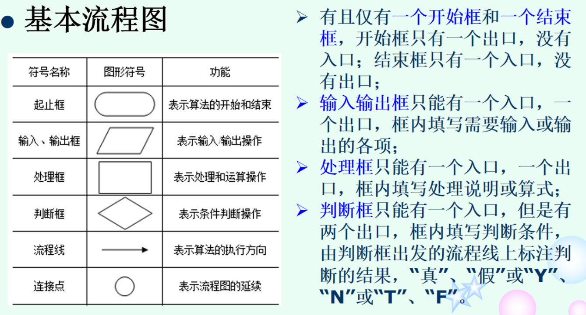
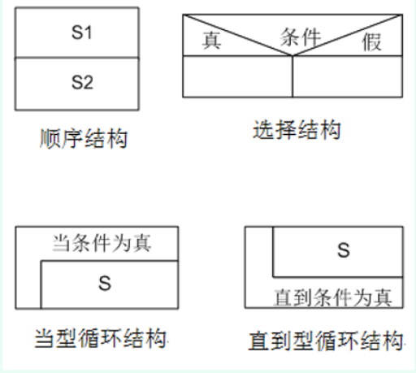

# ✨程序基础

## 程序设计基础

### 计算机语言

- 机器语言
- 汇编语言
  - 汇编->连接->运行
- 高级语言
  - 编译：编译->连接->运行
  - 解释：解释执行

### 计算机程序

- 程序 = 数据结构 + 算法
- 程序设计方法
  - 结构化程序设计：描述问题的解决过程
  - 面向对象程序设计：描述对象及对象之间的解决关系

### 结构化程序设计

[结构化程序设计-百度百科](https://baike.baidu.com/item/%E7%BB%93%E6%9E%84%E5%8C%96%E7%A8%8B%E5%BA%8F%E8%AE%BE%E8%AE%A1/3295904)

#### 设计方法

##### 自顶向下

- 程序设计时，应先考虑总体，后考虑细节；先考虑全局目标，后考虑局部目标。不要一开始就过多追求众多的细节，先从最上层总目标开始设计，逐步使问题具体化。

##### 逐步细化

- 对复杂问题，应设计一些子目标作为过渡，逐步细化。

##### 模块化

- 一个复杂问题，肯定是由若干稍简单的问题构成。[模块](https://baike.baidu.com/item/模块)化是把程序要解决的总目标分解为子目标，再进一步分解为具体的小目标，把每一个小目标称为一个模块。
- 限制使用goto语句（牺牲程序的可读性）

#### 基本结构

##### 顺序

##### 选择

##### 循环

## 算法

### 特征

(fideo)

#### 有穷性

（Finiteness）

算法的有穷性是指算法必须能在执行有限个步骤之后终止；

#### 确切性

(Definiteness)

算法的每一步骤必须有确切的定义；

#### 输入项

(Input)

一个算法有0个或多个输入，以刻画运算对象的初始情况，所谓0个输入是指算法本身定出了初始条件；

#### 输出项

(Output)

一个算法有一个或多个输出，以反映对输入数据加工后的结果。没有输出的算法是毫无意义的；

#### 🎁可行性

(Effectiveness)

算法中执行的任何计算步骤都是可以被分解为基本的可执行的操作步骤，即每个计算[步骤](https://baike.baidu.com/item/步骤/7066340)都可以在有限时间内完成（也称之为有效性）。

### 描述

#### 自然语言

#### 流程图

#### N-S图

### C语言程序的基本结构

