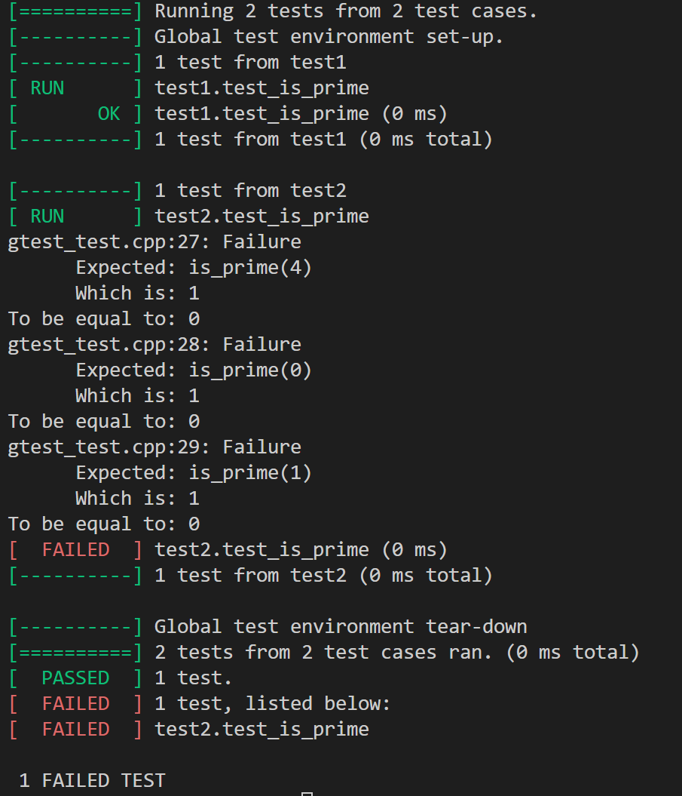
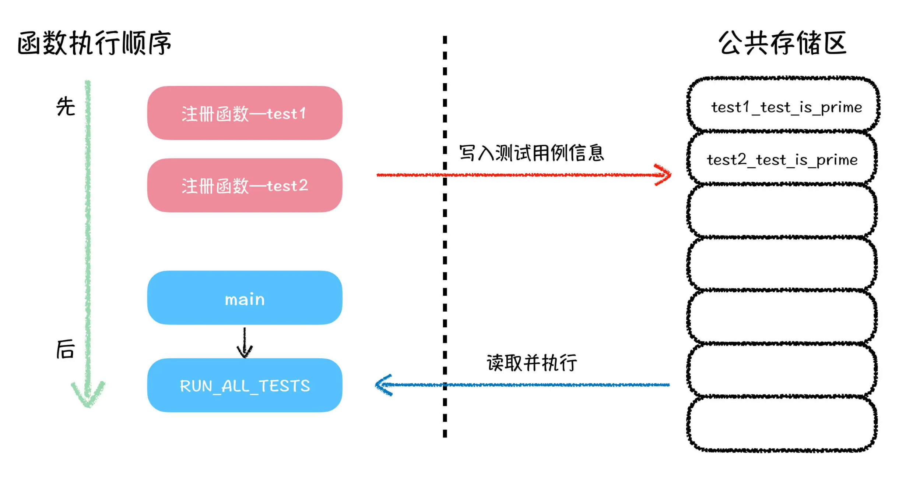
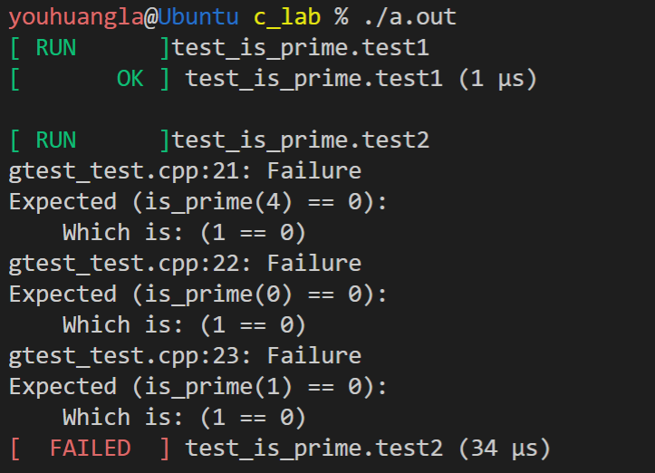

# My gtest

## 软件开发流程

在开始做项目之前呢，让我们先来了解下一般的项目开发流程。

拿传统的软件工程开发流程来说，一个软件的项目开发流程，包括：需求分析、概要设计、详细设计、编码、测试、软件交付、验收和维护。虽然包括了 8 个阶段，可总的来说，你可以把它总结为软件开发的前中后三个部分。

软件开发的前期，由产品经理、项目经理跟进需求，做需求分析，然后是概要设计，出一份系统的详细设计。这是项目的头部阶段，主要是从理论上验证需求可行，并且最终产出一份切实可行的软件系统的详细设计。就像我在咱们每节课中，给你留思考题，此时我的角色就是项目经理和产品经理，我首先需要分析给你留的思考题是否可做，以及跟你说明白，大致怎么做。

软件开发的中期，是由技术人员负责，主要是根据系统的详细设计，进行编码和测试，把图纸上的系统实现出来。你也可以认为这是一个施工的过程。这个过程，类比到咱们的思考题上，就是你根据我的提示，具体完成每一道思考题的程序，并且对完成的程序做简单测试，以保证程序的正确性。

软件开发的后期，由项目经理带领技术支持人员做软件交付、验收及后期维护的相关工作。这一部分，你可以理解为，是你交作业的过程，客户就是老师，你的作业要是不合格，老师就会给你退回去并提出修改建议。从这个过程中，你可以看到作为技术人员，与我们相关的，就是软件开发的中期阶段，也就是编码和测试。在之前的学习中，我们把学习任务主要放在了编码阶段，一直没有提测试阶段的事情，下面我们就来说说测试阶段主要做的事情。

### 黑盒测试与白盒测试

关于测试阶段的测试方法，可以大致分为五种：白盒测试，黑盒测试，灰盒测试，静态测试与动态测试。看着这些测试方法的名称，你可能有点儿懵，其实你完全没有必要掌握全部的测试方法，只需要了解其中的黑盒测试和白盒测试就行，知道了这两种测试方法，就可以满足你对项目开发流程的概念认知。

我们先来说说白盒测试与黑盒测试都是什么意思。首先名字里面的“盒”，其实指的就是项目中的系统，你可以理解成为是我们写的程序，它也是被测试的对象。至于这个白与黑呢，意思就是在测试过程中，是否关注代码实现逻辑。

白盒测试，就是关注代码实现逻辑，从而产生的测试行为。这种行为就像你把一个盒子打开，仔细检查其内部有无错误一样。而不关注代码实现逻辑，而产生的测试行为，就是黑盒测试。在这个测试过程中，我们只关注系统的输出是否满足我们的要求。

下面我来举几个具体的例子，你来分析一下哪一种是白盒测试，哪一种是黑盒测试。

场景一：你写完了一个程序，运行以后输入数据，测试程序的输出结果是否符合预期。

场景二：当你发现，程序的结果不符合预期的时候，开始检查你程序的代码逻辑，并且针对于每一个函数功能做测试。

在场景一中，虽然程序是你写的，可你在做测试的时候，并没有关心程序内部的代码逻辑，而是关注整体程序的功能是否符合预期，所以这个属于黑盒测试。而在场景二中，你在测试程序的时候，关注到了程序内部的代码逻辑是否正确，并且针对代码中的函数，开始做针对性测试。由于这个测试过程关注到了代码本身的逻辑，而不单单是程序功能本身，所以，这属于白盒测试。

通过这两个日常写程序的场景，你会发现，其实测试行为对于我们来说并不陌生，测试就是为了保证程序功能的正确性的，而所谓的黑盒测试或者白盒测试，并没有优劣之分。在实际工作中，我们也会经常综合运用这两种测试，来查找程序中存在的潜在问题。总

的来说，想要保证程序的正确性，必然会涉及到运用相关的测试方法。所以请你记住，测试并不是测试人员的专属，很多时候也是开发人员需要掌握的技能。

对于开发人员来说，最基本的测试方法，就是针对自己程序中的每一个功能模块，编写对应的单元测试，而单元测试中的单元，是程序中最小的测试单位。

例如 C 语言中，一个单元就是一个函数，C++ 中的一个单元，就是一个类。

所以，我们说到 C 语言的单元测试，指的是对每一个函数，编写一段测试程序。而可以辅助开发人员编写这些单元测试的程序，我们叫做“单元测试框架”，也可以简称为“测试框架”。

## 初识：Google 测试框架

咱们要完成的第一个项目，就是编写一个简易的 C 语言测试框架。不过在写这个 C 语言测试框架之前，咱们先看看之前的大厂或大牛们是怎么做的，这样，我们在写自己的测试框架的时候，也能有所借鉴。

今天，我要带你认识的是一个由 Google 开发的单元测试框架 Google Test，我们一般称它为 gtest。关于如何安装 Google 测试框架呢，由于大家的编程环境不同，所以，你可以按照网上其他资料中给出的安装教程，结合自己的编程环境，准备好 gtest 的相关环境。gtest 是一个 C++ 的单元测试框架，如果你不方便准备 gtest 相关环境，也不碍事儿，你可以看我下面的讲解。我的环境中，已经安装好了 gtest 的相关模块，为了简单说明 gtest 的使用与运行效果，给你准备了如下代码：

```c
#include <stdio.h>
#include <gtest/gtest.h>

// 判断一个数字 x 是否是素数
int is_prime(int x) {
    for (int i = 2; i * i < x; i++) {
        if (x % i == 0) return 0;
    }
    return 1;
}

// 第一个测试用例
TEST(test1, test_is_prime) {
    EXPECT_EQ(is_prime(3), 1);
    EXPECT_EQ(is_prime(5), 1);
    EXPECT_EQ(is_prime(7), 1);
}

// 第二个测试用例
TEST(test2, test_is_prime) {
    EXPECT_EQ(is_prime(4), 0);
    EXPECT_EQ(is_prime(0), 0);
    EXPECT_EQ(is_prime(1), 0);
}

int main(int argc, char *argv[]) {
    testing::InitGoogleTest(&argc, argv);
    return RUN_ALL_TESTS();
}
```

```shell
youhuangla@Ubuntu c_lab % g++  gtest_test.cpp   -lgtest -lpthread                                                   [0]
youhuangla@Ubuntu c_lab % ./a.out                                                                                   [0]
```

```shell
[==========] Running 2 tests from 2 test cases.
[----------] Global test environment set-up.
[----------] 1 test from test1
[ RUN      ] test1.test_is_prime
[       OK ] test1.test_is_prime (0 ms)
[----------] 1 test from test1 (0 ms total)

[----------] 1 test from test2
[ RUN      ] test2.test_is_prime
gtest_test.cpp:21: Failure
      Expected: is_prime(4)
      Which is: 1
To be equal to: 0
gtest_test.cpp:22: Failure
      Expected: is_prime(0)
      Which is: 1
To be equal to: 0
gtest_test.cpp:23: Failure
      Expected: is_prime(1)
      Which is: 1
To be equal to: 0
[  FAILED  ] test2.test_is_prime (0 ms)
[----------] 1 test from test2 (0 ms total)

[----------] Global test environment tear-down
[==========] 2 tests from 2 test cases ran. (0 ms total)
[  PASSED  ] 1 test.
[  FAILED  ] 1 test, listed below:
[  FAILED  ] test2.test_is_prime

 1 FAILED TEST
```



先看输出内容的第 4 行和第 6 行，意思是说，执行测试用例 test_is_prime.test1 和 test_is_prime.test2，这不就是上面两个以 TEST 开头的两段代码相关的输出内容么？

接下来从第 7 行到第 21 行是一段报错信息，意思就是说 is_prime(4)，is_prime(0) 与 is_prime(1) 函数返回值错误，也就意味着 is_prime 函数实现有错误，这段错误所涉及的信息，在源代码中的第二个测试用例中有涉及。

以上就是我们对 gtest 单元测试框架的一个感性认识，从这些感性认知，我们逐渐走向理性层面，逐步展开属于我们自己的思考。

## 对于 gtest 的三个思考

面对刚才的演示代码和输出内容，你可能会产生如下三个问题：

1. 源代码中的 EXPECT_EQ 是做什么的？

2. 以 TEST 开头的代码段，和我们学习的函数很不一样，那它究竟是什么？

3. 主函数中只调用了 RUN_ALL_TESTS 函数，为什么好像是执行了程序中所有的 TEST 代码段？这个功能是怎么实现的？


第一个问题不难，查看相关 gtest 的文档资料，你就可以知道，EXPECT_EQ 是 gtest 里面自带的宏，主要作用是判断传入的两部分的值是否相等。如果不相等，就会产生类似于输出内容中第 7 行到第 21 行的输出内容。

第二个问题，以 TEST 开头的这段代码，明显不符合我们对 C 语言的语法认知，我们确实没有见过不用规定返回值类型，也不用规定参数类型的函数定义方式。关于 TEST 究竟是个什么的问题，更加合理的猜测，就是 TEST 实际上是一个宏。

我们来回顾一下宏的作用，宏就是做简单的替换。正是因为 TEST(test_is_prime, test1) 这段代码实际上是一个宏，所以展开以后，和后面的大括号中的内容一起组成了一段合法的代码内容，这样理解，原本的代码内容也就解释得通了。

而 TEST 宏展开以后会被替换成什么内容呢？关于这个问题，我留下充足的时间请你去思考，同时，包括第三个问题的答案，都留作今天的思考题。

下面这段代码，就是作为我们后续的项目测试代码，对于这份源代码，我们不会对它做任何的改动，所以我建议你把代码内容保存下来，以备咱们后面课程练习使用。

```c
#include <stdio.h>
#include "geek_test.h" // 替换掉原 gtest/gtest.h 头文件

// 判断一个数字 x 是否是素数
int is_prime(int x) {
    for (int i = 2; i * i < x; i++) {
        if (x % i == 0) return 0;
    }
    return 1;
}

// 第一个测试用例
TEST(test1, test_is_prime) {
    EXPECT_EQ(is_prime(3), 1);
    EXPECT_EQ(is_prime(5), 1);
    EXPECT_EQ(is_prime(7), 1);
}

// 第二个测试用例
TEST(test2, test_is_prime) {
    EXPECT_EQ(is_prime(4), 0);
    EXPECT_EQ(is_prime(0), 0);
    EXPECT_EQ(is_prime(1), 0);
}

int main() {
    return RUN_ALL_TESTS();
}
```

## 初步实现 TEST 宏

今天我们实现的所有代码呢，都会写在一个名字为 geek_test.h 的头文件中。当然我们也知道，将声明和定义写在一起，在大型工程中是会出现严重的编译错误，在实际的工程开发中，我们并不会这么做。

今天把声明和定义写在一起，只是为了课程内容的讲解需要，而你也完全没有必要担心，这不会影响你对主要内容的学习。

我们的目的，是在不改变这份源代码的前提下，通过在 geek_test.h 中添加一些源码，使得这份代码的运行效果，能够类似于 gtest 的运行效果。

想要完成这个目标，我们就要先来思考 TEST 宏这里的内容，请你仔细观察这段由 TEST 宏定义的测试用例的相关代码：

```c
TEST(test1, test_is_prime) {
    EXPECT_EQ(is_prime(3), 1);
    EXPECT_EQ(is_prime(5), 1);
    EXPECT_EQ(is_prime(7), 1);
}
```

TEST(test1, test_is_prime) 这部分应该是在调用 TEST 宏，而这部分被预处理器展开以后的内容，只有和后面大括号里的代码组合在一起，才是一段合法的 C 语言代码，也只有这样，这份代码才能通过编译。

既然如此，我们就不难想到，TEST 宏展开以后，它应该是一个函数定义的头部，后面大括号里的代码，就是这个展开以后的函数头部的函数体部分，这样一切就都说得通了。

在实现 TEST 宏之前，我们还需要想清楚一个问题：由于程序中可以定义多个 TEST 测试用例，如果每一个 TEST 宏展开都是一个函数头部的话，那这个展开的函数的名字是什么呢？如果每一个 TEST 宏展开的函数名字都一样，那程序一定无法通过编译，编译器会报与函数名重复相关的错误，所以， TEST 宏是如何确定展开函数的名字呢？

不知道你有没有注意到，TEST 宏需要传入两个参数，这两个参数在输出信息中与测试用例的名字有关。那我们就该想到，可以使用这两个参数拼接出一个函数名，只要 TEST 传入的这两个参数不一样，那扩展出来的函数名就不同。最后，我们就可以初步得到如下的 TEST 宏的一个实现：

```c
#define TEST(test_name, func_name) \
void test_name##_##func_name()
```

如代码所示的 TEST 宏实现，我们将 TEST 宏的两个参数内容使用 ## 连接在一起，中间用一个额外的下划线连接，组成一个函数名字，这个函数的返回值类型是 void，无传入参数。

根据这个实现，预处理器会将源代码中两处 TEST 宏的内容，替换成如下代码所示内容：

```c
void test1_test_is_prime() {
    EXPECT_EQ(is_prime(3), 1);
    EXPECT_EQ(is_prime(5), 1);
    EXPECT_EQ(is_prime(7), 1);
}

void test2_test_is_prime() {
    EXPECT_EQ(is_prime(4), 0);
    EXPECT_EQ(is_prime(0), 0);
    EXPECT_EQ(is_prime(1), 0);
}
```

这样，也就把原来看似不合理的 TEST 宏，转换成了合法的 C 语言代码了。

## `__attribute__`：让其它函数先于主函数执行

在继续讲测试框架的设计之前，我们来补充一个知识点。

之前，我们所学习到的程序执行过程，既是从主函数开始，也是从主函数结束。也就是说，在常规的程序执行过程中，其它函数都是在主函数执行之后，才被直接或者间接调用执行。接下来，我就要给你讲一种能够让函数在主函数执行之前就执行的编程技巧。

首先，我们先来看如下代码：

```c
#include <stdio.h>

void pre_output() {
    printf("hello geek!\n");
    return ;
}

int main() {
    printf("hello main!");
    return 0;
}
```

代码运行以后，会输出一行字符串 “hello main!”。接下来呢，我们对上述代码稍微修改，在 pre_output 函数前面加上`__attribute__((constructor)) `。这样，pre_output 函数就会先于主函数执行，代码如下：

```c
#include <stdio.h>

__attribute__((constructor))
void pre_output() {
    printf("hello geek!\n");
    return ;
}

int main() {
    printf("hello main!");
    return 0;
}
```

```shell
hello geek!
hello main!
```

从输出内容可以看出，加了__attribute__((constructor)) 以后，pre_output 函数会先于 main 主函数执行，这种有趣的特性，在接下来的操作中我们还会用得上，你要理解并记住。

其实 `__attribute__ `的作用还很多，你可以上网搜搜，会让你的程序性质变得特别有意思。

## RUN_ALL_TESTS 函数设计

接下来让我们来思考一下 RUN_ALL_TESTS 函数要完成的事情，以及完成这些事情所需要的条件。

从主函数中调用 RUN_ALL_TESTS 函数的方式来看，RUN_ALL_TESTS 函数应该是一个返回值为整型的函数。这样，我们可以得到这样的函数声明形式：

```c
int RUN_ALL_TESTS();
```

从测试框架的执行输出结果中看，RUN_ALL_TESTS 函数可以依次性地执行每一个 TEST 宏扩展出来的测试用例函数，这是怎么做到的呢？

我们可以这样认为：在主函数执行 RUN_ALL_TESTS 函数之前，有一些函数过程，就已经把测试用例函数的相关信息，记录在了一个 RUN_ALL_TESTS 函数可以访问到的地方，等到 RUN_ALL_TESTS 函数执行的时候，就可以根据这些记录的信息，依次性地执行这些测试用例函数。整个过程，如下图所示：



图中红色部分，就是我们推测的，某些完成测试用例函数信息注册的函数，它们先于主函数执行，将测试用例的信息，写入到一个公共存储区中。

接下来，我们需要考虑的就是这些注册函数，究竟将什么信息存储到了公共存储区中，才能使得 RUN_ALL_TESTS 函数可以调用到这些测试用例？你自己也可以想想是什么。答案就是这个信息是测试用例函数的**函数地址**，因为只有把函数地址存储到这个存储区中，才能保证 RUN_ALL_TESTS 函数可以调用它们。所以，这片公共存储区，就应该是一个函数指针数组。

那如何解决注册函数问题呢？最简单直接的设计方法，就是每多一个由 TEST 宏定义的测试用例，就配套一个注册函数，所以这个注册函数的逻辑，可以设计在 TEST 宏展开的内容中。这就需要我们对 TEST 宏进行重新设计，这里我一会儿再给你进行说明。

我们先来完成 RUN_ALL_TESTS 函数从存储区中，读取并执行测试用例的过程：

```c
typedef void (*test_function_t)();

test_function_t test_function_arr[100];
int test_function_cnt = 0;

int RUN_ALL_TESTS() {
    for (int i = 0; i < test_function_cnt; i++) {
        printf("RUN TEST : %d\n", i + 1);
        test_function_arr[i]();
        printf("RUN TEST DONE\n\n");
    }
    return 0;
}
```

代码中用到了函数指针相关的技巧，其中 test_function_t 是我们定义的**函数指针类型**，这种函数指针类型的变量，可以用来指向返回值是 void，传入参数为空的函数。

之后，定义了一个有 100 位的函数指针数组 test_function_arr，数组中的每个位置，都可以存储一个函数地址，数组中元素数量，记录在整型变量 test_function_cnt 中。这样，RUN_ALL_TESTS 函数中的逻辑就很简单了，就是依次遍历函数指针数组中的每个函数，然后依次执行这些函数，这些函数每一个都是一个测试用例。

## 重新设计：TEST 宏

根据前面的分析，TEST 扩展出来的内容，不仅要有测试用例的函数头部，还需要有先于主函数执行的注册函数，主要用于注册 TEST 扩展出来的测试用例函数。由此，我们可以得出如下示例代码：

```c
#define TEST(test_name, func_name) \
void test_name##_##func_name(); \
__attribute__((constructor)) \
void register_##test_name##_##func_name() { \
    test_function_arr[test_function_cnt] = test_name##_##func_name; \
    test_function_cnt++; \
} \
void test_name##_##func_name()
```

这个新设计的 TEST 宏，除了末尾保留了原 TEST 宏内容以外，在扩展的测试用例函数头部添加了一段扩展内容，这段新添加的扩展内容，会扩展出来一个函数声明，以及一个以 register 开头<声明变量具有register 存储类型就要求编译器把变量存储在寄存器中，而不是像其他变量一样保留在内存中。>的会在主函数执行之前执行的注册函数；注册函数内部的逻辑很简单，就是将测试函数的函数地址，存储在函数指针数组 test_function_arr 中，这部分区域中的数据，后续会被 RUN_ALL_TESTS 函数使用。

如果以如上 TEST 宏作为实现，原程序中的两个测试用例代码，会被展开成如下样子：

```c
void test1_test_is_prime();

__attribute__((constructor))
void register_test1_test_is_prime() {
    test_function_arr[test_function_cnt] = test1_test_is_prime; 
    test_function_cnt++;
}

void test1_test_is_prime() {
    EXPECT_EQ(is_prime(3), 1);
    EXPECT_EQ(is_prime(5), 1);
    EXPECT_EQ(is_prime(7), 1);
}

void test2_test_is_prime();

__attribute__((constructor))
void register_test2_test_is_prime() { 
    test_function_arr[test_function_cnt] = test2_test_is_prime; 
    test_function_cnt++;
}

void test2_test_is_prime() {
    EXPECT_EQ(is_prime(4), 0);
    EXPECT_EQ(is_prime(0), 0);
    EXPECT_EQ(is_prime(1), 0);
}
```

这个展开内容，是我给你做完代码格式整理以后的样子，实际展开结果会比这个格式乱一点儿，不过代码逻辑都一样。

从展开内容中你可以看到，在展开代码的第 4 行和第 18 行分别就是两个测试用例函数的注册函数。至此，我们就算是初步完成了测试框架中关键的两个部分的设计：一个是 TEST 宏，另外一个就是 RUN_ALL_TESTS 函数。它们同时也是串起测试框架流程最重要的两部分。

关于 EXPECT_EQ 是如何实现的，我就留作思考题吧。这个实现答案肯定不唯一，你只需要尽量做到最好即可。

## 温故知新，gtest 的输出结果

我们先来回顾一下 gtest 的输出结果，gtest 的输出内容大体可以分成三个部分。

第一部分，一套单元测试的相关信息：

```shell
[==========] Running 2 tests from 1 test suite.
[----------] Global test environment set-up.
[----------] 2 tests from test_is_prime
```

这段信息说明这套单元测试中，包含了 2 个测试用例。

第二部分，是每个单元测试运行信息的输出：

```shell

[ RUN      ] test_is_prime.test1
[       OK ] test_is_prime.test1 (1 ms)
[ RUN      ] test_is_prime.test2
gtest_test.cpp:25: Failure
Expected equality of these values:
  is_prime(4)
    Which is: 1
  0
gtest_test.cpp:26: Failure
Expected equality of these values:
  is_prime(0)
    Which is: 1
  0
gtest_test.cpp:27: Failure
Expected equality of these values:
  is_prime(1)
    Which is: 1
  0
[  FAILED  ] test_is_prime.test2 (0 ms)
```

如上所示，第一个单元测试 test_is_prime.test1 运行结果正确，所用时间是 1ms；第二个单元测试 test_is_prime.test2 中，有三个判等 EXPECT 断言的结果是错误的，也就是 is_prime 函数的返回值，和测试用例中期望的返回值不符，这说明 is_prime 函数存在 Bug。

第三部分，就是这套单元测试的总结信息，以及整个程序单元测试结果的汇总信息。这段信息，有兴趣的小伙伴可以自己理解着看一下，由于不是咱们今天课程的重点，就不展开介绍了。

```shell
[----------] 2 tests from test_is_prime (1 ms total)

[----------] Global test environment tear-down
[==========] 2 tests from 1 test suite ran. (1 ms total)
[  PASSED  ] 1 test.
[  FAILED  ] 1 test, listed below:
[  FAILED  ] test_is_prime.test2

 1 FAILED
```

好了，关于 gtest 的输出内容，我大致说清楚了。

今天呢，我们先忽略 gtest 输出内容的第一部分和第三部分，主要关注 gtest 输出内容的第二部分，也就是每个单元测试运行信息的输出部分。通过第二部分的输出内容，你能想出我们应该从哪些方面来完善测试框架？

这里呢，我给出我的想法：通过观察第二部分的输出，我们基本要从三个方面完善测试框架的输出信息。

1. 在每个测试用例运行之前，要先行输出相关测试用例的名字；
2. 每个测试用例运行结束以后，要输出测试用例的运行时间与运行结果（OK 或者 FAILED）；
3. 若测试用例中的 EXPECT 断言出错，需要输出错误提示信息。

好了，优化的方向找到了，那么接下来，我们就开始测试框架改装行动吧！

## 测试用例的名字输出

首先是如何输出测试用例的名字。我们先回忆一下上节课设计的注册函数，如下所示：

```c
#define TEST(test_name, func_name) \
void test_name##_##func_name(); \
__attribute__((constructor)) \
void register_##test_name##_##func_name() { \
    test_function_arr[test_function_cnt] = test_name##_##func_name; \
    test_function_cnt++; \
} \
void test_name##_##func_name()
```

注册函数是随着 TEST 展开的，从展开的代码逻辑中可以看到，它只是将测试用例的函数地址记录在了函数指针数组中。要想 RUN_ALL_TESTS 函数后续能够输出测试用例的函数名称的话，我们只需要修改注册函数的功能逻辑即可，也就是让注册函数在记录函数信息的时候，增加记录对应测试用例的名称。

而这个名称信息，应该记录在哪里呢？有两种代码实现方式：

1. 另外开辟一个记录测试用例名称的字符串数组；
2. 修改 test_function_arr 数组中的元素类型，将新增的测试用例名称以及函数地址信息打包成一个数据元素。

显然，相较于第一种实现方式，第二种代码实现方式会使程序具有更好的封装特性。我们采用之前学习的结构体相关知识，就可以完成这种多种数据类型打包成一种新的数据类型的功能需求。

下面就是我们将函数指针信息和测试用例名称信息，封装成的一个新的结构体类型：

```c
struct test_function_info_t {
    test_function_t func;  // 测试用例函数指针，指向测试用例函数
    const char *name; // 指向测试用例名称
} test_function_arr[100];
int test_function_cnt = 0;
```

如代码所示，我们定义了一种新的数据类型，叫做 test_function_info_t。这种结构体类型包含了指向测试用例的函数指针 func 字段， 与指向测试用例名称的字符串指针 name 字段，并且我们将这种结构体类型，作为 test_function_arr 数组新的元素类型。

既然测试用例信息的存储区 test_function_arr 的数据类型发生了改变，那么负责存储信息的注册函数，与使用信息的 RUN_ALL_TESTS 函数的相关逻辑都需要作出改变。

首先，我们来看注册函数的改变。想要修改注册函数的逻辑，就是修改 TEST 宏，从功能上来说，注册函数中需要额外记录一个测试用例名称信息，示例代码如下：

```c
#define TEST(test_name, func_name) \
void test_name##_##func_name(); \
__attribute__((constructor)) \
void register_##test_name##_##func_name() { \
    test_function_arr[test_function_cnt].func = test_name##_##func_name; \
    test_function_arr[test_function_cnt].name = #func_name "." #test_name; \
    test_function_cnt++; \
} \
void test_name##_##func_name()
```

代码中主要是增加了第 6 行的逻辑，这一行的代码将 TEST 宏参数的两部分，拼成一个字符串，中间用点 (.) 连接，例如 TEST(test1, test_is_prime) 宏调用中，拼凑的字符串就是 test_is_prime.test1，和 gtest 中的输出的测试用例名称信息格式是一致的。

改完了注册函数的逻辑以后，最后调整一下 RUN_ALL_TESTS 中使用 test_function_arr 数组的逻辑代码即可：

```c
int RUN_ALL_TESTS() {
    for (int i = 0; i < test_function_cnt; i++) {
        printf("[ RUN      ] %s\n", test_function_arr[i].name);
        test_function_arr[i].func();
        printf("RUN TEST DONE\n\n");
    }
    return 0;
}
```

代码中的第 3 行，是仿照 gtest 的输出格式进行调整的，在输出测试用例名称之前，先输出一段包含 RUN 英文的标志信息。

至此，我们就完成了输出测试用例名字的框架功能改造。

## 输出测试用例的运行结果信息

接下来，就让我们进行第二个功能改造：输出测试用例的运行结果信息。

以下是我们示例代码中的 2 个测试用例，在 gtest 框架下的运行结果信息输出：

```shell
[     OK ] test_is_prime.test1 (1 ms)
[ FAILED ] test_is_prime.test2 (0 ms)
```

根据输出的信息，我们可知 gtest 会统计每个测试用例运行的时间，并以毫秒为计量单位，输出此时间信息。不仅如此，gtest 还会输出与测试用例是否正确相关的信息，如果测试用例运行正确，就会输出一行包含 OK 的标志信息，否则就输出一行包含 FAILED 的标志信息。

根据我们自己测试框架的设计，这行信息只有可能是在 RUN_ALL_TESTS 函数的 for 循环中，执行完每一个测试用例函数以后输出的信息。

由此，我们面临的是两个需要解决的问题：

1. 如何统计函数过程的运行时间？
2. 如何确定获得每一个测试用例函数的测试结果是否正确？

说到如何统计函数过程的运行时间，我这里就需要介绍两个新的知识点，一个是函数 clock() ，另 一个是宏 CLOCKS_PER_SEC。下面我会对它们详细讲解。

我们先说函数 clock() 。它的返回值代表了：从运行程序开始，到调用 clock() 函数时，经过的 CPU 时钟计时单元。并且，这个 clock() 函数的返回值，实际上反映的是我们程序的运行时间。那这个 CPU 时钟计时单元究竟是什么呢？你可以把 1 个 CPU 时钟计时单元，简单的理解成是一个单位时间长度，只不过这个单位时间长度，不是我们常说的 1 秒钟。

接下来，我们再说说宏 CLOCKS_PER_SEC 。它实际上是一个整型值，代表多少个 CPU 时钟计时单元是 1 秒。这个值在不同环境中会有所不同，在早年我的 Windows 电脑上，这个值是 1000，也就是 1000 个 CPU 时钟计时单位等于 1 秒。而现在我的 Mac 电脑上，这个值是 1000000，也就是 1000000 个 CPU 时钟计时单位等于 1 秒钟。显然，这个数字越大，统计粒度就越精细。

有了上面这两个工具，我们就可以轻松地统计一个函数的运行时间。在函数运行之前，记录一个 clock() 值，函数运行结束以后，再记录一个 clock() 值，用两个记录值的差值除以 CLOCKS_PER_SEC ，得到的就是以秒为单位的函数运行时间，再乘以 1000，即为毫秒单位。

这样呢，我们就解决了刚刚提的第一个问题：统计函数过程的运行时间。

至于如何获得每一个测试用例的测试结果，我们可以采用一个简单的解决办法，那就是记录一个全局变量，代表测试用例结果正确与否。当测试用例中的 EXPECT_EQ 断言发生错误时，就修改这个全局变量的值，这样我们的 RUN_ALL_TESTS 函数，就可以在测试用例函数执行结束以后，得知执行过程是否有错。

综合以上所有信息，我们可以重新设计 RUN_ALL_TESTS 函数如下：

```c
int test_run_flag;
#define EXPECT_EQ(a, b) test_run_flag &= ((a) == (b))

int RUN_ALL_TESTS() {
    for (int i = 0; i < test_function_cnt; i++) {
        printf("[ RUN      ] %s\n", test_function_arr[i].name);
        test_run_flag = 1;
        long long t1 = clock();
        test_function_arr[i].func();
        long long t2 = clock();
        if (test_run_flag) {
            printf("[       OK ] ");
        } else {
            printf("[  FAILED  ] ");
        }
        printf("%s", test_function_arr[i].name);
        printf(" (%.0lf ms)\n\n", 1.0 * (t2 - t1) / CLOCKS_PER_SEC * 1000);
    }
    return 0;
}
```

代码中的第 8 行是在测试用例运行之前，记录一个开始时间值 t1；代码中的第 10 行是在测试用例函数执行完后，记录一个结束时间值 t2；在代码的第 17 行，根据 t1 、t2 以及 CLOCKS_PER_SEC 的值，计算得到测试用例函数实际运行的时间，并输出得到的结果。

这段代码中增加了一个全局变量“test_run_flag”，这个变量每次在测试用例执行之前，都会被初始化为 1，当测试用例结束执行以后，RUN_ALL_TESTS 函数中，根据 test_run_flag 变量的值，选择输出 OK 或者 FAILED 的标志信息。同时，我们可以看到，test_run_flag 变量的值只有在 EXPECT_EQ 断言中，才可能被修改。

## EXPECT_EQ 断言的实现

最后呢，我们还剩下一个 EXPECT_EQ 断言的实现，这个就给你留作思考题，请你基于我上述所讲的内容，试试自己实现这个带错误提示输出的 EXPECT_EQ 断言吧。也欢迎你把你的答案写在留言区，我们一起讨论。

首先，EXPECT_EQ(a, b) 在 a，b 两部分值相等的时候，不会产生额外的输出信息，而当 a，b 两部分不相等的时候，就会输出相应的提示信息。如下所示：

```shell
gtest_test.cpp:25: Failure
Expected equality of these values:
  is_prime(4)
    Which is: 1
  0
```

这段输出信息，对应的是源代码中的 “EXPECT_EQ(is_prime(4), 0); ”的输出。如你所见，第 1 行的输出内容包含了源文件名（gtest_test.cpp），EXPECT_EQ 宏所在的代码位置（25），以及一个提示结果（Failure）。

接下来的信息，你自己就可以看懂了，就是关于 EXPECT_EQ 传入两部分的值。对于函数调用部分，EXPECE_EQ 会输出这个函数的调用形式及返回值信息，也就是输出中的 “is_prime(4)”“Which is: 1” 这段内容。而对于数值信息，只会输出数值信息本身，也就是输出信息中第 5 行的那个 0。

实际上，要想在宏中实现类似于这种根据传入参数类型，选择输出形式的功能，对于现在的你来说可能有点困难。所以，我们可以重新设计一种输出形式，只要能够清晰地展示错误信息就可以。

重新设计的输出提示，如下所示：

```shell
gtest_test.cpp:25: Failure
Expected (is_prime(4) == 0):
    Which is: (1 == 0)
```

修改完以后的输出信息，你可以看到，第 2 行就是传入 EXPECT_EQ 宏两部分的比较，第 3 行是这两部分实际输出值的比较。

重新设计了输出信息以后，就可以来看看 EXPECT_EQ 宏的实现了：

```c
#define EXPECT(a, b, comp) { \
    __typeof(a) val_a = (a), val_b = (b); \
    if (!(val_a comp val_b)) { \
        printf("%s:%d: Failure\n", __FILE__, __LINE__); \
        printf("Expected (%s %s %s):\n", #a, #comp, #b); \
        printf("    Which is: (%d %s %d)\n", val_a, #comp, val_b); \
        test_run_flag = 0; \
    } \
}
#define EXPECT_EQ(a, b) EXPECT(a, b, ==)
#define EXPECT_LT(a, b) EXPECT(a, b, <)
#define EXPECT_GT(a, b) EXPECT(a, b, >)
#define EXPECT_NE(a, b) EXPECT(a, b, !=)
```

在这段实现中，你会发现，我们不仅实现了 EXPECT_EQ，还额外实现了 EXPECT_LT、EXPECT_GT、EXPECT_NE 等用于比较的宏。其中，LT 是英文 little 的缩写，是判断小于关系的；GT 是 great 的缩写，是判断大于关系的；NE 是 not equal 的缩写，是判断不等于关系的。而这些所有的宏，都是基于 EXPECT 宏实现的。

我们将用于比较的运算符，当作参数传递给 EXPECT 宏。有了 EXPECT 宏以后，你就可以参考代码中的第 10～13 行的内容，轻松地扩展出用于小于等于或者大于等于的宏了。由于 EXPECT 宏的实现，全都是我们之前学习过的知识点，所以在这里我就不再赘述了，你可以自行阅读文稿中的代码。

[geek_test_array.h](./geek_test_array.h) 

## 用链表存储测试用例

看完了 EXPECT 宏的参考实现以后，整个测试框架的基础功能，就算是彻底搭建完成了。 

接下来，我们再重新审视下面这段函数指针数组 test_function_arr 的代码设计，来思考一下这个测试框架中还有没有可以优化的地方。

```c
struct test_function_info_t {
    test_function_t func;  // 测试用例函数指针，指向测试用例函数
    const char *name; // 指向测试用例名称
} test_function_arr[100];
int test_function_cnt = 0;
```

这段代码中，我们使用了数组来定义存储测试函数信息的存储区，这个数组的大小有 100 位，也就是说，最多可以存储 100 个测试用例函数信息。

那我们来思考一个问题：要是有程序中定义了 1000 个测试用例，怎么办呢？毕竟，对于中型项目开发来说，定义 1000 个测试用例，可不是什么难事儿。这个时候，你可能会说，那简单啊，数组大小设置成 10000 不就行了。

但是你要明白，这种设计尽管简单粗暴且有效，可它一点儿程序设计的美感都没有。什么意思呢？就是当我们为测试用例准备了 10000 个数组空间的时候，可能在真正的开发过程中，只定义了 2 个测试用例，这就会浪费掉 9998 个数组空间。

更形象地描述这种行为的话，这种设计方式很像计划经济，计划多少用多少。同时，它的弊端也很明显，一旦计划不好，要不是造成空间浪费，要不就是资源紧张。

所以，我们应该尝试着从“计划经济”向“市场经济”转变一下，可不可以转变成想用多少就生产多少。那应该怎么做呢？

我们知道，在程序中数组的空间大小，是需要提前计划出来的。但是有一种结构的空间，是可以动态增加或减少的，那就是我们之前讲过的“链表”结构。你想一下，如果我们把一个一个的测试函数信息，封装成一个一个的链表节点，每当增加一个测试用例的时候，就相当于向整个链表中插入一个新的节点。此时，用链表实现的存储测试函数信息的结构，它所占空间大小就和实际测试用例的数量成正比了。这就是我说的用多少，就生产多少。

下面，我们就来说说具体怎么做。

第一步，我们需要改变 test_function_info_t 的结构定义，也就是把原先存储测试用例函数信息的结构体类型，改装成链表结构。最简单的方法，就是在结构体的定义中，增加一个指针字段，指向下一个 test_function_info_t 类型的数据，代码如下所示：

```c
struct test_function_info_t {
    test_function_t func;  // 测试用例函数指针，指向测试用例函数
    const char *name; // 指向测试用例名称
    struct test_function_info_t *next;
};
struct test_function_info_t head, *tail = &head;
```

可以看到，我们给 test_function_info_t 结构体类型增加了一个链表中的 next 字段，除此之外，我们还定义了一个虚拟头节点 head 和一个指针变量 tail。这里你需要注意，head 是虚拟头节点，后续我们会向 head 所指向链表中插入链表节点，tail 指针则指向了整个链表的最后一个节点的地址。

第二步，在准备好了数据存储结构以后，需要改写的就是函数注册的逻辑了。在改写 TEST 宏中的注册函数逻辑之前呢，我们先准备一个工具函数 add_test_function，这个工具函数的作用，就是根据传入的参数，新建一个链表节点，并且插入到整个链表的末尾：

```c
void add_test_function(const char *name, test_function_t func) {
    struct test_function_info_t *node;
    node = (struct test_function_info_t *)malloc(sizeof(struct test_function_info_t));
    node->func = func;
    node->name = name;
    node->next = NULL;
    tail->next = node;
    tail = node;
    return ;
}
```

好了， add_test_function 工具函数准备好之后，我们正式来改写 TEST 宏中注册函数的逻辑。其实难度也不大，也就是要求注册函数调用 add_test_function 函数，并且传入相关的测试用例的函数信息即可：

```c
#define TEST(test_name, func_name) \
void test_name##_##func_name(); \
__attribute__((constructor)) \
void register_##test_name##_##func_name() { \
    add_test_function(#func_name "." #test_name, \
                      test_name##_##func_name); \
} \
void test_name##_##func_name()
```

最后一步，处理完了数据写入的过程以后，来让我们修改一下使用这份数据的代码逻辑，那就是 RUN_ALL_TESTS 函数中的相关逻辑。之前，RUN_ALL_TESTS 函数中，循环遍历数组中的每一个测试用例，并且执行相关的测试用例函数，对这一部分，修改成针对于链表结构的遍历方式即可，代码如下所示：

```c
int RUN_ALL_TESTS() {
    struct test_function_info_t *p = head.next;
    for (; p; p = p->next) {
        printf("[ RUN      ] %s\n", p->name);
        test_run_flag = 1;
        long long t1 = clock();
        p->func();
        long long t2 = clock();
        if (test_run_flag) {
            printf("[       OK ] ");
        } else {
            printf("[  FAILED  ] ");
        }
        printf("%s", p->name);
        printf(" (%.0lf ms)\n\n", 1.0 * (t2 - t1) / CLOCKS_PER_SEC * 1000);
    }
    return 0;
}
```

这样，我们就彻底完成了测试用例函数信息存储部分的“链表”改造过程。

对于上面的这份代码实现，你会发现，链表节点空间是通过 malloc 函数动态申请出来的，可在我们的程序中，并没有对这些空间使用 free 进行释放，如果你想让这个程序对空间的申请与回收做到有始有终，变得更加干净，那应该怎么办呢？

这里你可以借助 `__attribute__((destructor)) `的功能，之前我们介绍了一个`__attribute__((constructor)) `的作用是让函数先于主函数执行，而 destructor 就是使函数在主函数结束以后才执行的函数特性设置。有了这个特性设置，你可以实现一个函数，专门用来销毁测试函数链表所占存储空间，这样在逻辑上，你的程序会变得更完美。当然，你即使不这么做，也不会影响到原有的程序功能的正确性。

完整实现可以看代码

 [geek_test_linked_list.h](./geek_test_linked_list.h) 

## 小修饰

### 来点颜色

```c
#define COLOR(a, b) "\033[" #b "m" a "\033[0m"
#define GREEN(a) COLOR(a, 32)
#define RED(a) COLOR(a, 31)
```

这里运用宏，将终端中的字符优雅地输出为彩色。

由于在宏定义中，`#`运算符将宏的一个参数转换为字符串，所以（加上上面的宏定义后的）下面两条语句是等价的

```c
printf(GREEN("hello color"));//GREEN，输出绿色字符
printf("\033[1;4;32mhello color\033[0m");//GREEN，输出绿色字符
```

故添加了颜色宏定义后，修改RUN_ALL_TESTS函数：

```c
int RUN_ALL_TESTS() {
    struct test_function_info_t *p = head.next;
    for (; p; p = p->next) {
        //printf("[ RUN      ] %s\n", p->name);
        printf(GREEN("[ RUN      ]"));
        printf("%s\n", p->name);
        test_run_flag = 1;
        long long t1 = clock();
        p->func();
        long long t2 = clock();
        if (test_run_flag) {
            printf(GREEN("[       OK ] "));
        } else {
            printf(RED("[  FAILED  ] "));
        }
        printf("%s", p->name);
        printf(" (%.0lf ms)\n\n", 1.0 * (t2 - t1) / CLOCKS_PER_SEC * 1000);
    }
    return 0;
}
```

 [geek_test_color.h](./geek_test_color.h) 

### 用时单位

实际操作过程中，可能会出现0ms的情况，这是可以将时间单位由毫秒改成微秒（17行）

```c
        printf(" (%.0lf μs)\n\n", 1.0 * (t2 - t1) / CLOCKS_PER_SEC * 1000 * 1000);//加一个* 1000，单位改成微秒
```

## 善始善终，释放内存

valgrind查看内存情况

```shell
youhuangla@Ubuntu c_lab % valgrind ./a.out                                                                     [0]
==8156== Memcheck, a memory error detector
==8156== Copyright (C) 2002-2017, and GNU GPL'd, by Julian Seward et al.
==8156== Using Valgrind-3.13.0 and LibVEX; rerun with -h for copyright info
==8156== Command: ./a.out
==8156== 
[ RUN      ]test_is_prime.test1
[       OK ] test_is_prime.test1 (1052 μs)

[ RUN      ]test_is_prime.test2
gtest_test.cpp:21: Failure
Expected (is_prime(4) == 0):
    Which is: (1 == 0)
gtest_test.cpp:22: Failure
Expected (is_prime(0) == 0):
    Which is: (1 == 0)
gtest_test.cpp:23: Failure
Expected (is_prime(1) == 0):
    Which is: (1 == 0)
[  FAILED  ] test_is_prime.test2 (3380 μs)

==8156== 
==8156== HEAP SUMMARY:
==8156==     in use at exit: 48 bytes in 2 blocks
==8156==   total heap usage: 3 allocs, 1 frees, 1,072 bytes allocated
==8156== 
==8156== LEAK SUMMARY:
==8156==    definitely lost: 0 bytes in 0 blocks
==8156==    indirectly lost: 0 bytes in 0 blocks
==8156==      possibly lost: 0 bytes in 0 blocks
==8156==    still reachable: 48 bytes in 2 blocks
==8156==         suppressed: 0 bytes in 0 blocks
==8156== Rerun with --leak-check=full to see details of leaked memory
==8156== 
==8156== For counts of detected and suppressed errors, rerun with: -v
==8156== ERROR SUMMARY: 0 errors from 0 contexts (suppressed: 0 from 0)
```

思考可以发现，这里有`1 frees`，为什么？

参照链表的释放方法：

```c
void clear_node(struct test_function_info_t *node) {
    if (node == NULL) {
        return ;
    }
    free(node);
    return ;
}
void clear(struct test_function_info_t *head) {
    if (head == NULL) return ;
    struct test_function_info_t *p = head->next, *q;
    while (p != NULL) {
        q = p->next;
        clear_node(p);
        p = q;
    }
    free(p);
    return ;
}
```

最后我们在92行执行clear函数：

```c
clear(&head);
```

```shell
youhuangla@Ubuntu c_lab % valgrind ./a.out                                                                     [0]
==8625== Memcheck, a memory error detector
==8625== Copyright (C) 2002-2017, and GNU GPL'd, by Julian Seward et al.
==8625== Using Valgrind-3.13.0 and LibVEX; rerun with -h for copyright info
==8625== Command: ./a.out
==8625== 
[ RUN      ]test_is_prime.test1
[       OK ] test_is_prime.test1 (1061 μs)

[ RUN      ]test_is_prime.test2
gtest_test.cpp:21: Failure
Expected (is_prime(4) == 0):
    Which is: (1 == 0)
gtest_test.cpp:22: Failure
Expected (is_prime(0) == 0):
    Which is: (1 == 0)
gtest_test.cpp:23: Failure
Expected (is_prime(1) == 0):
    Which is: (1 == 0)
[  FAILED  ] test_is_prime.test2 (3429 μs)

==8625== 
==8625== HEAP SUMMARY:
==8625==     in use at exit: 0 bytes in 0 blocks
==8625==   total heap usage: 3 allocs, 3 frees, 1,072 bytes allocated
==8625== 
==8625== All heap blocks were freed -- no leaks are possible
==8625== 
==8625== For counts of detected and suppressed errors, rerun with: -v
==8625== ERROR SUMMARY: 0 errors from 0 contexts (suppressed: 0 from 0)
```

虽然有点不明白第一次为什么会释放一次内存（是否是自动释放？），但是从valgrind 的输出上看内存应该释放完毕。

## 最终效果

 [gtest_test.cpp](./gtest_test.cpp) 

 [geek_test_free.h](geek_test_free.h) 


