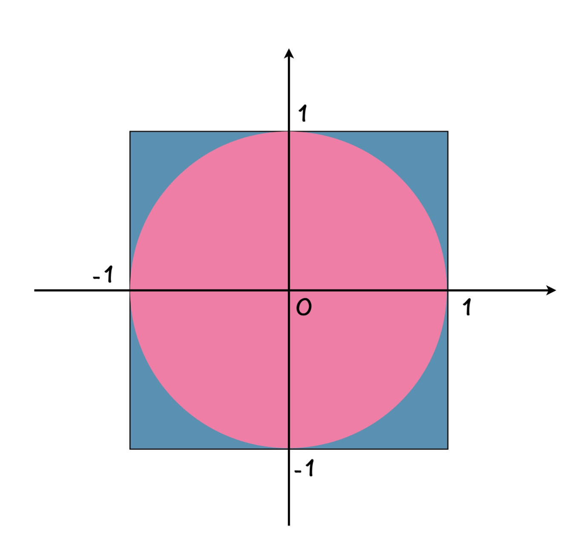
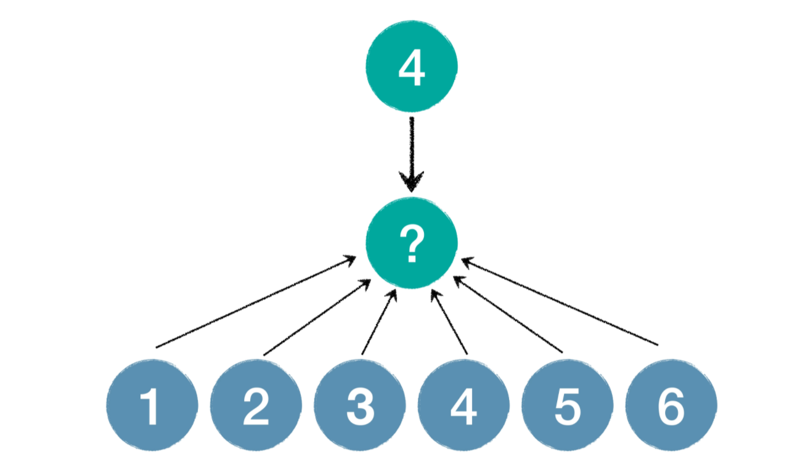
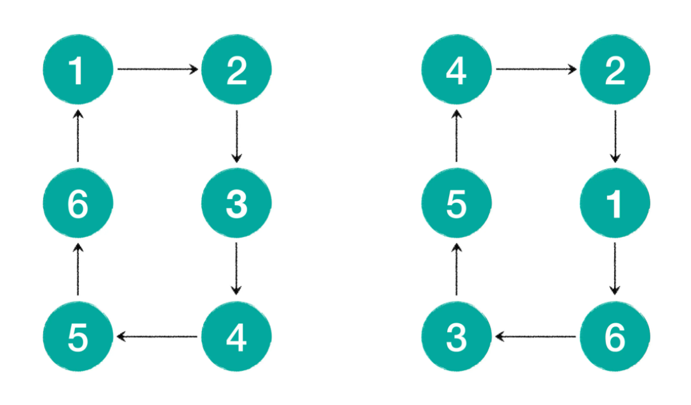

# 其他库函数

## <stdlib.h>：通用的实用工具

### 伪随机序列生成函数

#### 计算 π 值

圆周率 π 对你来说肯定不是一个陌生的概念，它指的是圆的周长与直径的比值。在古代，数学家们为了计算 π 的精确值想尽方法，可能穷尽一生也不过精确到小数点后几位而已。但到了现在，你可能不相信，只要你知道 π 的定义，就可以利用编程轻易计算出 π 的值。那究竟怎么做到呢？我们先来看一个用蒙特卡罗法计算 π 的示意图：



图1：蒙特卡罗法示意图通过

观察图 1，请你思考一个问题，如果你随机地在正方形区域中选择一个点，那么这个被选择的点，也恰巧落在圆形红色区域的概率是多大？这个问题很简单，就是圆面积和正方形面积的比值，简单计算就可以得到这个概率值，应该是 π/4。

也就是说，如果我们做大量的随机实验，最终落在圆内部的次数除以总次数再乘以 4 得到的值，应该接近圆周率 π。随机次数越多，所得到的数值越接近 π。

##### 1.真随机与伪随机

说到随机，就需要说一下真随机与伪随机的概念了。所谓真随机其实并不难理解，我们以掷骰子为例，掷出 1～6 点的概率均为 1/6，如果我问你，上一次掷出的点数是 4，那么下一次掷出 6 点的概率是多大？你会发现，依然是 1/6，我们称这两次掷骰子的事件是相互独立的，上一次的结果和下一次之间没有必然联系。



图2：真随机示意图

通过上面这个示意图，你就很容易看出，所谓真随机，就是我们通常意义下的随机。那么什么又是伪随机呢？从名字上面来看，伪随机，带个伪字，说明本质上不是随机，可看起来是随机。下面请你注意观察下图的两个数字循环序列：



图3：显然规则与非显然规则

你观察上面这两个数字序列，会发现，第一个序列是 123456，这是一个有明显规律的序列，你一定不会觉得这个序列是随机生成的。另一个序列是 421635，好像没有什么明显的规律，相比于第一个序列，你是不是更偏向于相信第二个序列是随机生成的序列呢？

第二个序列就是我刚刚所说的伪随机，看起来像是随机序列，可实际上，4 后面一定会出现 2，2 后面一定是 1，1 后面一定是 6，也就是说前一个数字决定了后一个数字。计算机中究竟如何制造出来这样一个伪随机序列呢，这个问题留到后面，我会使用一行简单的数学公式，制造一个包含 100 个数字的伪随机数字序列，类似于上图中第二个序列的加大版。最后你会发现，所谓计算机中的伪随机数序列，就是类似第二个序列那样的，没有什么明显规律的一个规模更大的循环序列。现在你知道为什么叫做伪随机了吧，那是因为，一旦要是上一个随机函数的值确定了，下一个数字也就确定了，而纯正意义上的真随机，应该是前后两次出现的数字是两次独立事件，没有任何关系。

##### 2.程序中的随机函数

现在我们所接触到的语言中，没有真随机，全是伪随机。也就是说，语言中给我们准备好了一个随机函数，这个随机函数会根据上一个随机值和一个固定的计算规则，得到下一个随机值。而你在其他资料中可能会看到随机种子这个概念，设置随机种子就是在设置随机函数中记录的上一个随机值。例如，上面我们自己做出来的 6 个长度的伪随机序列，如果随机种子设置为值 1，我们得到的值依次是 635421，如果设置为值 3，那么我们将依次得到 542163。

下面就看看 C 语言中的随机函数的用法吧：

```c

#include <stdio.h>
#include <stdlib.h>
#include <time.h>

int main() {
    printf("%d\n", rand() % 1000); // 永远输出固定值
    srand(time(0));
    printf("%d\n", rand() % 1000); // 每次运行都不同
    return 0;
} 
```

上面代码中，我们用 rand() 函数，获得一个随机值，这个就是我们前面讲的随机函数，它将依次的返回随机序列中的每一个值。

而 srand() 函数就是设置随机种子的函数，也就是设置随机函数上一次的状态值。time(0) 将返回一个时间戳，你就可以把他当成和当前时间相关的一个整型数字。

你会发现，上面这段程序中，在第 6 行代码里，我们虽然使用了 rand() 函数，可每次运行都将输出同样的值，这是因为我们没有设置随机种子，每次运行时 rand() 函数所记录的起始值都相同，所以每次运行输出的随机值也都相同。

而第 8 行代码中，由于我们根据程序运行时的当前时间设置了随机种子，每次运行程序，第 8 行都将输出不同的值。事实上，如果你在 srand() 函数里面设置一个固定值，每次运行程序，结果也都将是一样的，这个你可以自行尝试。

###### 思考题：设计迷你随机函数

设计一个循环过程，循环 100 次，以不太明显的规律输出 1～100 中的每个数字。要求 1：规律尽量不明显。要求 2：只能使用循环和最基本的运算，不允许超前使用数组。下表是我的程序输出的序列，以供你做参考：

```null
 5 15 45 34  1  3  9 27 81 41 
22 66 97 89 65 94 80 38 13 39 
16 48 43 28 84 50 49 46 37 10 
30 90 68  2  6 18 54 61 82 44 
31 93 77 29 87 59 76 26 78 32 
96 86 56 67 100 98 92 74 20 60 
79 35  4 12 36  7 21 63 88 62 
85 53 58 73 17 51 52 55 64 91 
71 11 33 99 95 83 47 40 19 57 
70  8 24 72 14 42 25 75 23 69 
```

```c

#include <stdio.h>
int main() {
    int n = 5;
    for (int i = 1; i <= 100; i++) {
        printf("%2d ", n);
        if (i % 10 == 0) printf("\n");
        n = (n * 3) % 101;
    }
    return 0;
}
```

当你运行这个程序的时候，就会看到程序的输出，正如原文中我给你的样例输出一样。要是想理解这段程序，你需要一些数论方面的基础知识，其中包括：欧拉函数，欧拉定理、费马小定理、取余循环节等知识。在这里，我要再次因为设置这个你可能做不出来这个题，而向你道歉。不过，当你看到上面的那些知识以后，你会发现，这是一道初学者很大概率不可能完成的题目，尽管代码很简单，可背后的原理却看似不简单。其实，我就是想跟你说明，程序的灵魂在算法，算法的灵魂在数学。

##### 代码实现

首先我们需要有一个循环，循环每一次，让计算机帮我们做一次实验。每次实验呢，让计算机模拟随机选择点的这个过程，然后我们需要判断一下随机选择的点，是否在圆内部；如果在，我们就记录一次。最后用落在圆里的次数比上总实验次数再乘以 4，就得到了 π 的近似值。

```c
double x = 1.0 * rand() / RAND_MAX;
```

上述代码中的 rand() 随机函数，返回值的范围是[0, RAND_MAX]，通过上述表达式计算，我们就得到了一个[0.0, 1.0] 之间的随机值了。

```c
#include <stdio.h>
#include <stdlib.h>
#include <time.h>

int main() {
    int n = 0, m = 0;
    for (int i = 0; i < 1000000; i++) {
        double x = 1.0 * rand() / RAND_MAX;
        double y = 1.0 * rand() / RAND_MAX;
        if (x * x + y * y <= 1.0) {
            m += 1;
        }
        n += 1;
    }
    printf("%lf\n", 4.0 * m / n);    
    return 0;
}
```

```shell
3.141664
```

上述代码中，我让计算机重复 10 万次实验，每次在坐标轴的第一象限中的 1 * 1 的区域中随机选择一个点，变量 m 记录的是落在圆内部的次数，变量 n 记录的是总实验次数。运行这个程序，在我的环境中，输出的是 3.142096，你可以试一下在你的环境中的运行结果，以及加大实验次数以后，对结果的影响。