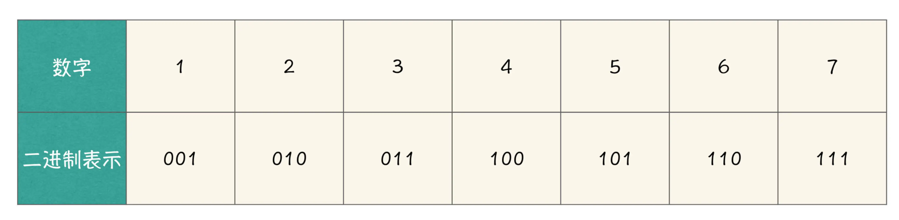
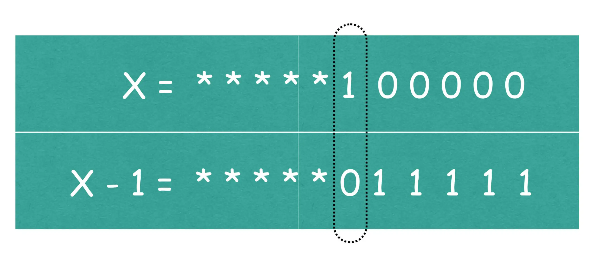

# 底层程序设计

## 位运算符

### 二进制数中1的个数

#### Question

程序中读入一个整数 n，假设 n 不会大于 1000，请输出 1 到 n 的每一个数字二进制表示中的 1 的个数。

我举个例子哈，当 n 等于 7 的时候，我们把 1 到 7 的每个数字的二进制表示罗列出来，会得到下表所示内容：



表1：1到7的二进制表示

根据表 1 中的内容，如果你的程序编写成功的话，程序应该分别输出 1、1、2、1、2、2、3，这些输出内容分别代表每个数字二进制表示中 1 的数量。

#### Solution

##### 简单循环$O(logn)$

对于这个任务，你想写出来一个可行的程序不难，例如：我们可以循环 n 次，每次计算一个数字二进制中 1 的数量。怎么计算一个数字二进制中 1 的数量呢？这个问题，你可能想采用如下程序来进行实现：

```c

int cnt = 0;//1的数量
while (n != 0) {
    if (n % 2 == 1) {//末尾有一个1
        cnt += 1; 
    }
    n /= 2; //二进制数去掉最后一位后的二进制数表示
}
```

它每次都会判断 n 的二进制末尾是不是 1，如果是 1，计数量 cnt 就加 1，然后将 n 对 2 取余，相当于去掉 n 的二进制表示的最后一位，这样就可以用 $O(logn)$ 的时间复杂度计算一个数字 n 二进制中 1 的数量。整个算法的时间复杂度为$O(nlogn)$。

如果你的方法像上面这么做的话，确实是一种可行的方法，可是效率不是很高。今天这个任务的要求是，对每一个数字，请用$ O(1) $的时间复杂度计算得到其二进制表示中 1 的个数。O(1) 也就是 1 次，或者是与问题规模 n 无关的有限次，例如：2 次、3 次均可。下面就让我们来看看如何完成这个任务吧。

##### 用数组，做递推$O(1)$

```c
y = x & (x - 1)
```

我们看到，我们将 x 与 x - 1 这两个数字做按位与，按位与以后的结果再赋值给 y 变量，下面我们着重来讨论 y 变量与 x 变量之间的关系。

既然是位运算，我们就需要从二进制的角度来思考这个问题。首先思考 x - 1 的二进制表示与 x 二进制表示之间的关系，当 x 二进制表示的最后一位是 1 的时候，x - 1 就相当于将 x 最后的一位 1 变成了 0，如果 x 二进制表示最后一位是 0 呢，计算 x - 1 的时候，就会试图向前借位，应该是找到最近的一位不为 0 的位置，将这一位变成 0，原先后面的 0 都变成 1，如下图所示：



图5：x 与 x-1 的二进制表示

图中打 * 的部分，代表了 x 与 x - 1 二进制表示中完全相同的部分。根据按位与操作的规则，相应位置都为 1，结果位就为 1，那么 x 与上 x - 1 实际效果等效于去掉 x 二进制表示中的最后一位 1，从而我们发现原来 y 变量与 x 变量在二进制表示中，只差一个 1。

回到原任务，如果我们用一个数组 f 记录相应数字二进制表示中 1 的数量，那么 f[i] 就代表 i 这个数字二进制表示中 1 的数量，从而我们可以推导得到 f[i] = f[i & (i - 1)] + 1，也就是说 i 比 i & (i - 1) 这个数字的二进制表示中的 1 的数量要多一个，这样我们通过一步计算就得到 f[i] 的结果。

```c

#include <stdio.h>
int f[1001];
int main() {
    int n;
    scanf("%d", &n);
    f[0] = 0;
    for (int i = 1; i <= n; i++) {
        f[i] = f[i & (i - 1)] + 1;
    }
    for (int i = 1; i <= n; i++) {
        if (i != 1) printf(" ");
        printf("%d", f[i]);
    }
    printf("\n");
    return 0;
}
```

```shell
7
1 1 2 1 2 2 3
```

！这里其实还用到了算法题目中一种常见的方法：记忆化。将前一个数的二进制表示中所含的1的个数存在数组中，就可以根据数组求当前数的二进制中所含1的个数。
