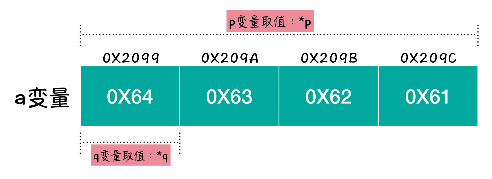

# 指针

## 指针变量

### 指针变量的大小

只要是变量，就占据一定的存储空间，那一个指针变量占多少个字节的存储空间呢？

在回答这个问题之前，我先问你另一个问题，请你思考一下：是整型指针变量占用的存储空间大，还是字符型指针变量占用的存储空间大？我们想想啊，一种数据类型占用多少存储空间跟什么有关系？和存储的值有关系啊。当你想存储一个 32 位整数的时候，就必须要用 4 个字节，不能用 2 个字节，也不能用 3 个字节，这都是不够的。

究竟是哪一种类型的指针占的存储空间大呢？答案是：一样大。为什么呢？就是因为，无论是什么类型的指针，存储的值都是某个字节的地址，而在一个系统中，无论是哪个字节的地址，二进制数据长度都是一样的。所以，无论什么类型的指针，所需要存储的值的底层表示长度是一样的，那么所占用的存储空间也当然是一样的了！

有句话描述的非常形象“类型就是指针变量的职业，所占的空间就是指针变量的生理结构”。什么意思呢？我们知道现实生活中，有些人做保安，有些人做工程师，还有些人当艺术家，可不管你做什么，你无法改变的是你作为人的生理结构。所以放到指针变量的概念里，那就是不管什么类型的指针，指针所改变不了的是其占用空间的存储大小，因为不管是什么类型的指针，存储的都是无差别的地址信息。

### 指针变量的声明

对指针变量的声明与对普通变量的声明基本一样，唯一的不同就是必须在指针变量名字前放置星号：

```c 
int *p;
```

语句中的 * 代表 p 变量是一个指针变量，而 int 的作用是什么呢？只是用来说明 p 是一个指向整型存储区的指针变量么？其实 int 更大的作用，就是用来解决我们上面提到的那个问题，根据 p 变量中的内容，我们可以找到一个存储区的首地址，然后再根据 p 的类型，就可以确定要取几个字节中的内容了。

下面这段代码中，p 和 q 同时指向了 a 变量的存储区。而取值 p 和取值 q 的结果，却截然不同。这是因为，取值 p 时，程序会从 p 所指向的首地址开始，取 4 个字节的内容作为数据内容进行解析，而取值 q 的时候，则是取 1 个字节的内容，作为数据内容进行解析。

```c
#include <stdio.h>

int main(int argc, char *argv[]) {
    int a = 0x61626364;
    int *p = &a;
    char *q = (char *)&a;
    printf("%x %c\n", *p, *q);
    return 0;
}
```

你如果运行上述代码，大概率你会看到输出内容是：

```shell
61626364 d
```

 小概率会看到输出内容是：

```shell
61626364 a
```

这个原因和“大端机”“小端机”有关，下面的图中呢，就是以“小端机”为例，说明的 p 和 q 取值的问题：



如图所示，p 变量对应了 a 变量整个存储区中的内容，所以输出取值 p 和 a 原本存储内容相同。而 q 变量由于是字符型指针变量，只能从首地址取到 1 个字节的内容，取到的就是 64，这里的 64 注意可是 16 进制的数字，对应到 10 进制数字就是 100，而 %c 是输出一个字符，数字 100 对应的字符就是英文小写字母 ‘d’。

#### 声明习惯

>  As far as C goes they both do the same thing. It is a matter of preference. `int* i` shows clearly that it is an int pointer type. `int *i` shows the fact that the asterisk only affects a single variable. So `int *i, j` and `int* i, j` would both create `i` as an int pointer and `j` as an int.
>
>  [c \- difference between int\* i and int \*i \- Stack Overflow](https://stackoverflow.com/questions/3770187/difference-between-int-i-and-int-i)

```c
int *i, j;//create `i` as an int pointer and `j` as an int
```

故推荐`*`这样写`int *i`	。

这里可以解释为：`*`是一个表达式中的一元运算符，故先求出`(*i)`的值。

## 练习

### 交换两个数

#### 三数排序

该程序的目的是比较三个数的大小，并将三个数由小到大输出。

##### Bug

在 swap 函数中，下面这样可以。

```c
void swap(float *a, float *b) {
    float t;
    t = *a;
    *a = *b;
    *b = t;
    return ;
}
```

但是如果这样就不行

```c
void swap(float *a, float *b) {
    float *t;
    *t = *a;
    *a = *b;
    *b = *t;
    return ;
}
```

原因：在栈中声明的指针变量 t ，在函数结束后被销毁（即 pop 出栈），所以我们可以在将堆上的内存动态分配给 t ，使得函数结束后该变量仍然不会被销毁。

```c
#include <stdio.h>
#include <stdlib.h>

void swap(float *a, float *b) {
    float *t = (float *)malloc(sizeof(float));
    *t = *a;
    *a = *b;
    *b = *t;
    return ;
}

int main() {
    float *pa, *pb, *pc;
    if (pa = (float *)malloc(sizeof(float))) {
        scanf("%f", pa);
    } else {
        printf("malloc for pa is failed!\n");
    }
    
    if (pb = (float *)malloc(sizeof(float))) {
        scanf("%f", pb);
    } else {
        printf("malloc for pb is failed!\n");
    }

    if (pc = (float *)malloc(sizeof(float))) {
        scanf("%f", pc);
    } else {
        printf("malloc for pc is failed!\n");
    }
    if (*pa > *pb) {
        swap(pa, pb);
    }
    if (*pa > *pc) {
        swap(pa, pc);
    }
    if (*pb > *pc) {
        swap(pb, pc);
    }
    printf("%.2f %.2f %.2f", *pa, *pb, *pc);
    return 0;
}

```

```shell
youhuangla@Ubuntu c_lab % ./a.out                                                               [0]
3 1 2
1.00 2.00 3.00
```

#### n数冒泡排序

注意这里的swap

```c
/*************************************************************************
	> File Name: hello.c
	> Author: 
	> Mail: 
	> Created Time: Sat May 28 11:50:22 2022
 ************************************************************************/

#include <stdio.h>
#include <stdlib.h>

void swap(float *a, float *b) {
    float t;
    t = *a;
    *a = *b;
    *b = t;
    return ;
}

float *bubble_sort(float *a, int len) {
    int in_order = 1;
    do {
        for (int i = 0; i < len - 1; i++) {
            in_order = 1;
            if (a[i] > a[i + 1]) {
                in_order = 0;
                swap(&a[i], &a[i + 1]);
            }
        }
    } while (in_order != 1);
    return a;
}

int main() {
    int n;
    scanf("%d", &n);
    float *a = (float *)malloc(sizeof(float) * n);
    for (int i = 0; i < n; i++) {
        scanf("%f", &a[i]);
    }
    bubble_sort(a, n);
    for (int i = 0; i < n; i++) {
        printf("%.2f ", a[i]);
    }
    return 0;
}
```

```shell
5
5 3 1 2 4
1.00 2.00 3.00 4.00 5.00 
```

