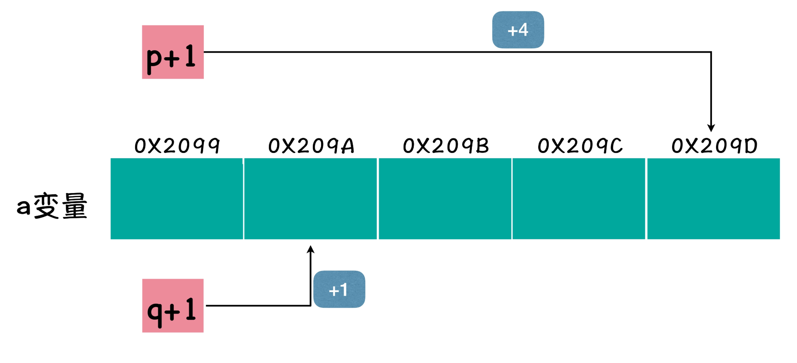
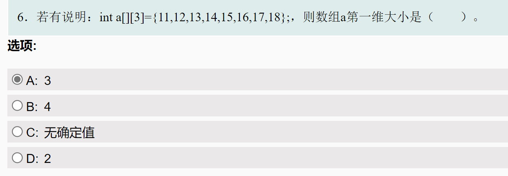
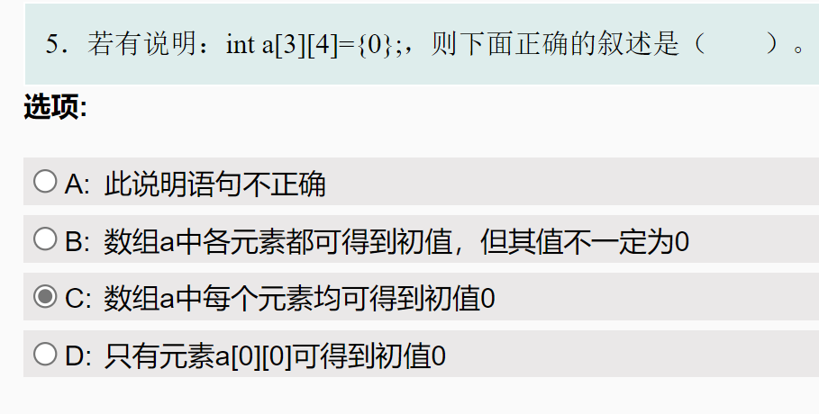
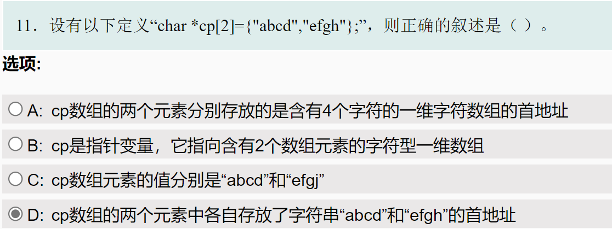
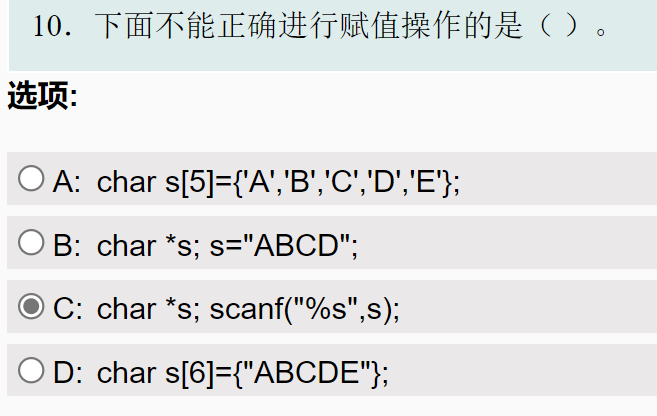
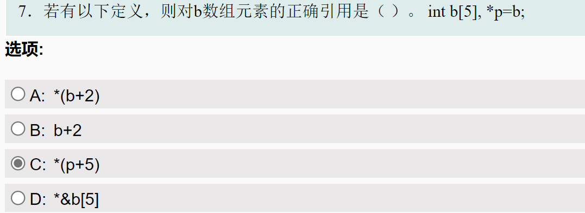

# 指针和数组

## 指针的算数运算

想一想，整型支持加减乘除操作，而我们所谓的地址类型的值，也可以在其上面做加减的操作，你可以试着运行下面的代码：

```c
#include <stdio.h>

int main() {
    int a, *p = &a;
    char *q = &a;
    printf("%p %p\n", p, q);
    printf("%p %p\n", p + 1, q + 1);
}
```

```shell
0x7fffffffe044 0x7fffffffe044
0x7fffffffe048 0x7fffffffe045
```

代码中，定义了三个变量，其中一个整型变量 a，两个指针变量 p 和 q，其中 p 是整型指针变量，q 是字符型指针变量。然后分别输出 p 和 q，以及 p + 1 和 q + 1 的值以作对比。

如果你运行上面的程序，你会看到，p 和 q 的值是相同的，都是 a 变量的首地址，但是 p + 1 和 q + 1 的值却不同。如果你仔细观察会发现，p + 1 的地址值与 a 的地址之间差了 4 个字节，而 q + 1 的地址值与 a 的地址之间只差了 1 个字节。



通过上图，你就可以更清晰的看到，由于 p 是整型指针，所以 p + 1 的计算结果，是向后跳了一个整型，相当于从第一个整型的首地址，跳到第二个整型的首地址；而由于 q 是字符型指针，所以 q + 1 的计算结果，就是向后跳了一个字符型。

这样，你就可以明白了吧？如果一个浮点型的指针变量加 1，就会向后跳一个浮点型。这就是指针变量类型的第二个作用：在加法或者减法时，确定增加或者减少的地址长度。

如果那一对方括号代表了运算符，而运算符本质上是作用在值上面，也就是说，当我们写 arr[1] 的时候，方括号运算符前面看似放着一个数组名，实际上放了一个地址，放了一个数组的首地址，因为 arr 就是数组的首地址，还是那句话：地址才是参与运算的值。也就是说，当我们把数组的首地址，存储在一个指针变量中以后，这个指针变量配合上方括号运算符，也可以达到相同的效果！

！注意：声明数组变量时，数组不能等价于指针

```c
int a[10];
int *(a + 10);//wrong
```


## 指针用于数组处理

```c
struct Data {
    int x, y;
} a[2];
struct Data *p = a;
printf("%p", &a[1].x);
```

请用尽可能多的形式，替换下面代码中 &a[1].x 的部分，使得代码效果不变：

> 1. a 是一个数组，每个元素都是一个结构 
>
> 2. p是一个指向结构体的指针，存放了数组a的首地址 
>
> 3. 对于&a[1].x，运算符优先级为`[] > . > &`即下标引用大于访问结构成员大于求地址 
>
> 4. 根据第3条里的运算规则，运算会得到是数组a中第二个结构x的地址
>
> 综上，对应答案和解释如下 
>
> - p+1: p是a[0]的地址，p+1是a[1]的地址，同时a[1]的第一个元素是x，p+1也就是a[1].x的地址 
> - `&(*(p+1)).x`: 先用`*`取值得到a[1]，然后获取地址 
> - &(p+1)->x: *+.的操作可以用 ->代替 
> - &p[1].x: 可以把p当作a来操作 

```c
#include <stdio.h>
//顶部答案

int main(int argc, char *argv[]) {
	struct Data{
		int x,y;
	}a[2];

	struct Data *p = a;
	a[1].x = 1;
    a[1].y = 2;

	printf("%p\n", &a[1].x);//结构体的成员
    
    printf("%p\n", &((a + 1)->x));
    printf("%p\n", &(a[0].y) + 1);
    
    
	printf("%p\n", p+1);//结构体
	printf("%p\n", &(*(p+1)).x);//结构体的成员的解引用
	printf("%p\n", &(p+1)->x);//结构体的成员
	printf("%p\n", &p[1]);
	printf("%p\n", &p[1].x);
    
}
```


## Example

```c
// Type your code here, or load an example.
#include <stdio.h>
int main() {
    int a[3][4];
    int (*num)[4] = a;
    num[1] = &a[1][3];
    printf("1");
    return 0;
}
```


9952



9951




11548




11547



11544



```c
/*************************************************************************
	> File Name: 11544.c
	> Author: 
	> Mail: 
	> Created Time: Wed Jun 22 17:26:15 2022
 ************************************************************************/

#include <stdio.h>

int main() {
	int b[5] = {1, 2, 3, 4, 5}, *p = b;
	printf("%d\n", *(b + 2));

	printf("%d\n", *(p + 5));//rubbbish
	printf("%d\n", *(p + 4));


	return 0;
}
```

```shell
youhuangla@Ubuntu 6 % gcc 11544.c                                                                   [0]
youhuangla@Ubuntu 6 % ./a.out                                                                       [0]
3
32764#rubbish
5
```

11541

```c
/*************************************************************************
	> File Name: 11541.c
	> Author: 
	> Mail: 
	> Created Time: Wed Jun 22 17:40:36 2022
 ************************************************************************/

#include <stdio.h>

int main() {
	int a = 20, *p, *q = &a; *p = *q;
	printf("%d\n", *q);
	printf("%d\n", *p);
	return 0;
}
```

```shell
20
20
```

