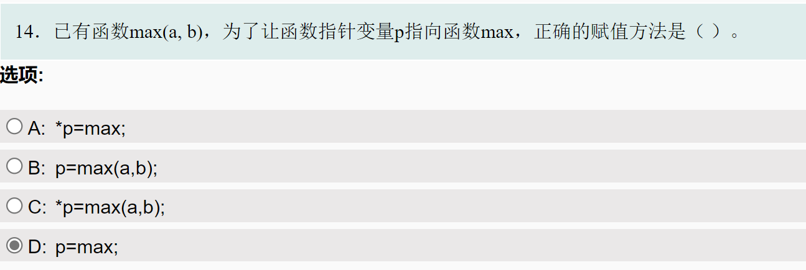

# 指针的高级应用

## 指向函数的指针

### qsort函数

> 无关乎名称， C++、 C 及 POSIX 都不要求此函数用[快速排序](https://en.wikipedia.org/wiki/Quicksort)实现或作出任何复杂度和稳定性保证。
>
> [std::qsort \- cppreference\.com](https://zh.cppreference.com/w/cpp/algorithm/qsort)

#### qsort从大到小

设整型变量a、b、c分别存放从键盘输入的3个整数。编写C程序，按从大到小排列这3个数，使成为最大值，c成为最小值，并且按序输出这3个数。用`if`不难，用qsort熟悉一下该函数。

输入输出说明：

输入：三个整数，以英文符号“，”分开

输出：从大到小输出三个整数，以英文符号“，”分开

```c
#include <stdio.h>
#include <stdlib.h>

int compare_parts(const void *p, const void *q) {
    //return *(int *)q - *(int *)p;
    int p1 = *(int *)p;
    int q1 = *(int *)q;
    if (p1 < q1) {
        return 1;
    } else if (p1 > q1) {
        return -1;
    } else {
        return 0;
    }
}
int main() {
    int a[3];
    scanf("%d,%d,%d", &a[0], &a[1], &a[2]);//scanf得到的值存入数组中的某个元素记得用&
    qsort(a, 3, sizeof(int), compare_parts);//原本的qsort排序后是从小到大，故compare函数中, if (val_p > val_q) return 1;
    printf("%d,%d,%d\n", a[0], a[1], a[2]);
    return 0;
}
```

```shell
1,3,2
3,2,1
```


11551


