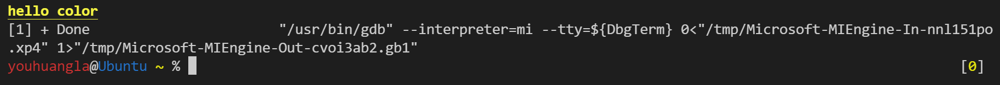

# 格式化输入输出

## printf函数

### 转换说明

printf 函数的返回值，代表向屏幕上打印了多少个字符。

### 转义序列

思考题（1）：位数输出计算一个输入整数的十进制表示的位数？

条件 1：允许有多余输出的情况下，怎么实现？

条件 2：只允许输出数字位数的时候，又该怎么实现？请单纯考虑使用 printf 一族函数方法实现。

```c

#include <stdio.h>

int main() {
    int n;
    scanf("%d", &n);
    printf(" has %d digits\n", printf("%d", n)); // 有多余输出，利用了printf的返回值是
    char output[50];
    int ret = sprintf(output, "%d", n);
    printf("%d\n", ret); // 无多余输出
    return 0;
}
```

```shell
31415#input
31415 has 5 digits
5
```

> 从给定位置加载数据，转换为字符串等价物，并写结果到各种池。
>
> 1)写结果到 [stdout](https://zh.cppreference.com/w/c/io) 。
>
> 2)写结果到文件流 `stream` 。
>
> ### 返回值
>
> 1,2) 传输到输出流的字符数，或若出现输出错误或编码错误（对于字符串和字符转换说明符）则为负值。
>
> [printf, fprintf, sprintf, snprintf, printf\_s, fprintf\_s, sprintf\_s, snprintf\_s \- cppreference\.com](https://zh.cppreference.com/w/c/io/fprintf)

思考题（2）：读入一行字符串请大家自行实现一个读入一行字符串，并且输出相关内容的程序，思考如下：

条件 1：如果字符串中没有空格，怎么实现？

条件 2：如果字符串中有空格，又该怎么实现？请单纯考虑用 scanf 一族函数方法实现。

```c

#include <stdio.h>
char str[100];
int main() {
    scanf("%[^\n]s", str);//有空格，若没有空格可直接%s
    printf("%s\n", str);
    return 0;
}
```

```shell
abc123 456
abc123 456
```

这段代码展现了如何使用 scanf 读入一行包含空格的字符串信息。其中，要读入字符串，就需要使用 %s 格式占位符。可是这道题目中，在 % 和 s 中间有一对中括号[]，这个[] 代表了一个集合，用来控制 %s 在读入过程中可以读入的字符集合的，例如：%[a-z]s，是可以输入小写字母 a 到 z，那么一旦遇到了非小写字母，就会停止。

而上述代码中的 ^ 上尖号，读作非，“^\n” 就是非换行符，也就是说，只要不是换行符，就可以继续读入。这也就达到了我们想要用 scanf 读入一行的功能要求。你可以自己试一下换成 %[a-z]s，然后输入 “abcd12efeee”，看看程序的输出，你就能明白了。

```c

#include <stdio.h>
char str[100];
int main() {
    scanf("%[a-z]s", str);
    printf("%s\n", str);
    return 0;
}
```

```shell
abcd12efeee
abcd
```

> `[`*集合*`]`  
>
> 若集合的首字符是 `^` ，则匹配所有不在集合中的字符。若集合以 `]` 或 `^]` 开始，则 `]` 字符亦被包含入集合。在扫描集合的非最初位置的字符 `-` 是否可以指示范围，如 `[0-9]` ，是实现定义的。若使用宽度说明符，则最多匹配到*宽度*。总是在匹配的字符后存储一个空字符（故参数数组必须有至少*宽度 +1* 个字符的空间）。
>
> [scanf, fscanf, sscanf, scanf\_s, fscanf\_s, sscanf\_s \- cppreference\.com](https://zh.cppreference.com/w/c/io/fscanf)

#### 设置字符颜色

```none
格式：\033[属性代码{;属性代码...}m输出内容\033[0m
```

属性代码：

0 代表关闭所有属性

1 代表高亮 / 粗体

4 代表下划线

33 代表黄色

```c
#include <stdio.h>

int main() {
    printf("\033[1;4;33mhello color\033[0m");
    return 0;  
}
```



[bash \- How to change the output color of echo in Linux \- Stack Overflow](https://stackoverflow.com/questions/5947742/how-to-change-the-output-color-of-echo-in-linux)

[python - How to print colored text to the terminal - Stack Overflow](https://stackoverflow.com/questions/287871/how-to-print-colored-text-to-the-terminal/287944#287944)

## scanf函数

scanf 函数的返回值，代表成功给多少个变量赋了值（后续再展开讲）。

### 练习

编写一个程序,从键盘输入圆锥体的半径r和高度h,计算其体积,输出2位小数。
提示请注意数据类型，圆周率取3.14

输入输出说明:

输入:连续输入2半径和高度,以英文符号“,”分割。如"5,10”

输出: “体积为:XXX”,XXX为结果,保留2位小数

```c
#include <stdio.h>
#define PI 3.14
int main() {
    int r;
    int h;
    scanf("%d,%d", &r, &h);
    float v = (float)1 / (float)3 * PI * r * r * h;//不能直接写1 / 3,那样永远是0,(int)1 / (int)3提升后类型为整数，结果为代数商并向0截断
    printf("体积为:%.2f\n", v);
    return 0;
}
#if 0
#include <stdio.h>
#define PI 3.14
int main() {
    float r;
    float h;
    scanf("%f,%f", &r, &h);
    float v = 1.0 / 3.0 * PI * r * r * h;
    printf("体积为:%.2f\n", v);
    return 0;
}
#endif
```

```shell
5,10
体积为:261.67
```

> 除法
>
> 二元运算符 / 遵循通常的算术定义，将第一操作数除以第二操作数（在通常算术转换后），除了
>
> - 通常算术提升后的类型为整数类型时，结果为代数商（非分数），以实现定义方向取整 (C99 前)向零截断 (C99 起)
>
>   [算术运算符 \- cppreference\.com](https://zh.cppreference.com/w/c/language/operator_arithmetic)

```c
#include <stdio.h>
int main() {
    int x, y, z1, z2, z3;
    float z4;
    scanf("%d,%d", &x, &y);
    z1 = x + y;
    z2 = x - y;
    z3 = x * y;
    z4 = (float)x / (float)y;
    printf("x+y=%d\nx-y=%d\n", z1, z2);
    printf("x*y=%d\nx/y=%.2f\n", z3, z4);
    return 0;
}
```

去掉倍数

设计一个去掉倍数的程序，要求如下：首先读入两个数字 n 和 m，n 的大小不会超过 10，m 的大小都不会超过 10000；

接下来读入 n 个各不相同的正整数，输出 1 到 m 中，有哪些数字无法被这 n 个正整数中任意的一个整除。

下面给出一组输入和输出的样例，以供你来参考。

输入如下：

```shell
3 12
4 5 6
```

输出如下：

```shell
1 2 3 7 9 11
```

```c
#include <stdio.h>
int check[1005] = {0};
int main() {
    int n, m, num;
    scanf("%d%d", &n, &m);
    for (int i = 0; i < n; i++) {
        scanf("%d", &num);
        for (int j = num; j <= m; j += num) {
            check[j] = 1;//标记j这个数可以被整除
        }
    }
    for (int i = 1; i <= m; i++) {
        if (check[i] == 1) continue;
        printf("%d ", i);
    }
    return 0;
}
```

