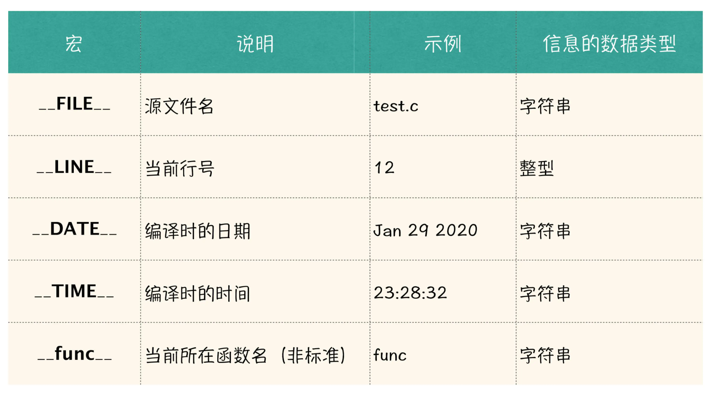

# 预处理器

## 宏定义

### 没有 Bug 的 MAX 宏

请你完善下面代码中的 MAX 宏，MAX 宏的作用，就是接受两个元素，选择出两个元素中的最大值。完善以后的 MAX 宏，输出需要与如下给出的输出样例一致，注意，只能修改 MAX 宏的定义内容，不可以修改主函数中的内容。

```c
#include <stdio.h>
#define P(item) printf("%s = %d\n", #item, item);
#define MAX(a, b) // TODO

int main() {
    int a = 6;
    P(MAX(2, 3));
    P(5 + MAX(2, 3));
    P(MAX(2, MAX(3, 4)));
    P(MAX(2, 3 > 4 ? 3 : 4));
    P(MAX(a++, 5));
    P(a);
    return 0;
}
```

```shell
MAX(2, 3) = 3
5 + MAX(2, 3) = 8
MAX(2, MAX(3, 4)) = 4
MAX(2, 3 > 4 ? 3 : 4) = 4
MAX(a++, 5) = 6
a = 7
```

#### Solution

```c
#define MAX(a, b) ({ \
    __typeof(a) __a = (a), __b = (b); \
    __a > __b ? __a : __b; \
})
```

### 输出漂亮的日志格式

首先我们来思考，要实现一个和 printf 使用方式一样的 log 方法， printf 函数是一个变参函数，那么 log 也需要支持变参，而 log 方法又比 printf 输出的更人性化一些，其中包括了可以输出所在的函数信息，以及所在的代码位置信息。这里，我们选择使用宏定义来实现所谓的 log 方法。

```c
#define log(frm, args...) 
```

如上代码所示，在最后一个参数后面，加上三个点，就代表，这个宏除了第一个 frm 参数以外，后面接收的参数个数是可变的，那么后面的参数内容，统一存放在参数 args 中。这样，我们就可以设计如下代码，使得 log 方法的使用方式与 printf 类似了：

此时，log 方法的输出内容，只是和 printf 方法的输出内容是一致的，还无法输出所在函数以及所在代码位置的相关信息。

下面，我们来补充最后一个知识点，就是编译器会预设一些宏，这些宏会为我们提供很多与代码相关的有用信息，具体如下表所示：



我们看到表中有两个宏，是我们这个任务所需要的，一个是 __func__代表了当前所在的函数名，另一个是__LINE__代表了当前行号。

其中宏__func__后面的说明中，注明了是“非标准”，什么叫做非标准呢，也就是说，在不同的编译器中，这个宏的名称可能是不同的，甚至某些编译器不提供这个宏，也是有可能的。例如在 VC 6.0 的环境中就没有__func__宏，因为这个宏不是 C 语言标准里面的东西。

通过这个__func__宏，我想让你初步认识到什么是代码的 “可移植性”，也就是说，你写了一份代码，当你的运行环境发生改变时，你的代码到底要不要做修改？如果要做修改，到底要做多少修改？这是代码的可移植性所讨论的问题。

放到今天这个例子中，就是说，如果你在你的代码中，不做任何处理的，直接使用__func__宏，那么就会影响你代码的可移植性。

```c
#include <stdio.h>
#define log(frm, args...) ({\
    printf("[%s : %d] ",__func__,__LINE__); \
    printf(frm, ##args); \
})
//"##"的作用是对token进行连接，这里的args就是token,如果token为空，那么不进行连接，所以允许省略可变参数
//tokens 在C语言中是记号，见C程序设计语言
int main() {
    log("hello world\n");
    return 0;
}
```

```shell
[main : 8] hello world
```

## 查看宏展开

[c preprocessor \- Seeing expanded C macros \- Stack Overflow](https://stackoverflow.com/questions/985403/seeing-expanded-c-macros)

