# C++介绍

李伟《C++模板元编程》

截图[Lightshot — Mac和Win的截图工具](https://app.prntscr.com/zh-cn/thankyou_desktop.html#install_source=default)

## 目录

1. 什么是C++
2. C++的开发环境与相关工具
3. C++的编译/链接模型

## 什么是C++

- 一门比较流行的编程语言

  https://www.tiobe.com/tiobe-index//

- C 语言的扩展 

  - 关注性能
    - 与底层硬件紧密结合

    - 对象生命周期的精确控制

    - Zero-overhead Abstraction

  - 引入大量特性，便于工程实践
    - 三种编程范式：面向过程、面向对象、泛型

    - 函数重载、异常处理、引用

- 一系列不断衍进的标准集合

  C++98/03 ， C++11 ， C++14 ， C++17 ， C++20 ，C++23 ？

  - 语言本身的改进
    - Memory Model
    - Lambda Expression
  - 标准库的改进
    - type_traits / ranges
    - auto_ptr

- C++标准的工业界实现
  - MSVC / GCC / Clang…
  - 每个编译器可能并不完全遵照标准
    https://godbolt.org/z/cKMjK3
  - 不同的实现存在差异
    https://godbolt.org/z/6hnPhY

- 不能脱离具体的语境讨论C++
- 编写程序时要注重
  - 性能
  - 标准

### 与底层硬件紧密结合

#### 字节序

https://godbolt.org/z/xPq6e9

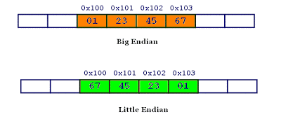

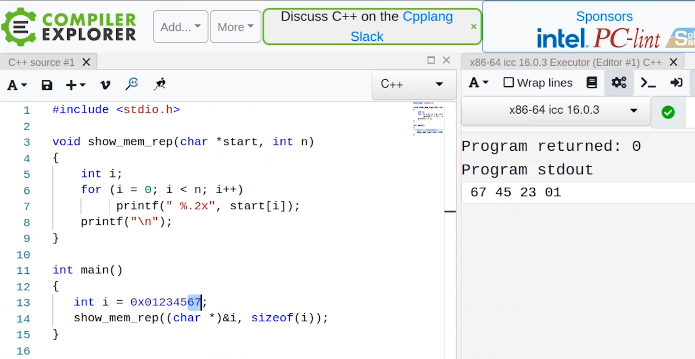

```cpp
#include <stdio.h> 
  
void show_mem_rep(char *start, int n)  
{ 
    int i; 
    for (i = 0; i < n; i++) 
         printf(" %.2x", start[i]); 
    printf("\n"); 
} 
  
int main() 
{ 
   int i = 0x01234567; 
   show_mem_rep((char *)&i, sizeof(i)); 
} 

```

Java则会规定字节序：大端，更多考虑易用性与兼容性。C与底层硬件精密结合，更关注性能。

### 对象生命周期的精确控制

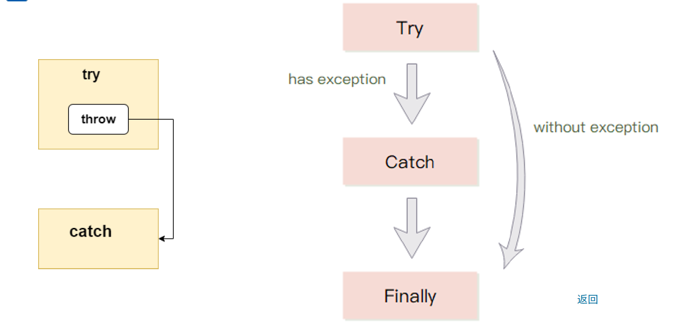

左：C++，对象生命周期的精确控制，try catch 构造对象，抛出异常后，对象显式销毁

右：C#，抛出异常对象后，对象可能不被销毁，在 Finally 处销毁

### Zero-overhead Abstraction

- 不需要为没有使用的语言特性付出成本

  - 虚函数
    https://godbolt.org/z/fq66hM

    如果类中没有虚函数，则不需要付出成本。C#则没有虚函数，因为类中的所有函数都是虚函数，无论用不用都要付出成本。

  - 堆与栈

    ```cpp
    int fun1()
    {
        int* x = new int(3);//堆上开辟
        return *x;
    }
    
    int fun2()
    {
        int x = 3;//栈上开辟
        return x;
    }
    
    
    ```

    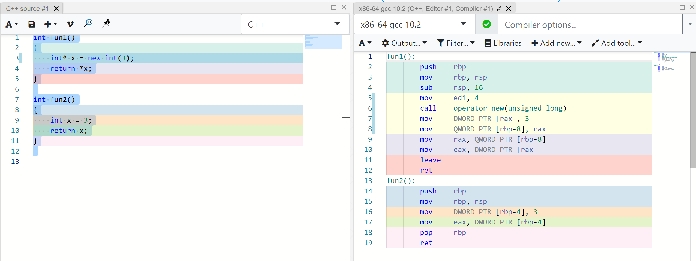可以看到 fun1 比 fun2 的语句多，fun2 不用堆的成本。C# 的对象则都在堆上构造。


- 使用了一些语言特性不等于付出运行期成本
  https://godbolt.org/z/Pv9bWj

```cpp
consteval auto fun(unsigned input)
{
    unsigned res = 0;
    for (unsigned i = 0; i < input; ++i)
    {
        res += i;
    }
    return res;
}

int main()
{
    return fun(3);//0 + 1 + 2 = 3
}
```

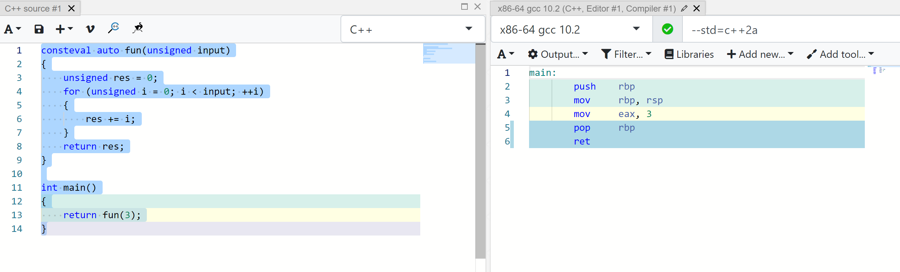

使用了函数，但是没有付出运行期成本，是因为我们付出了编译期成本。

这里用了 C++20 的一个新特性`consteval`，使得该函数只能在编译期执行。由于只需要编译一次，降低了运行期成本。

### 语言本身的改进

增加一些新特性，删除了一些旧特性。

### 标准库的改进

标准库的变化。加入了一些，减少了一些。


deprecated in C++11 在 C++11 中过时，这就是标准库的改进。如果编译warning。

removed in C++17 在17中移除。编译不通过。

### 每个编译器可能并不完全遵照标准

C++2a 即 20

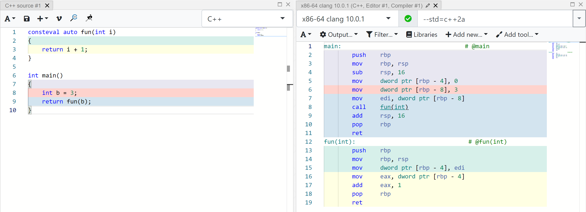

clang 10.0.0不遵从编译器要求。C++20 要求`consteval`函数在编译期执行，该函数由于`int b = 3`，则在运行期执行了。

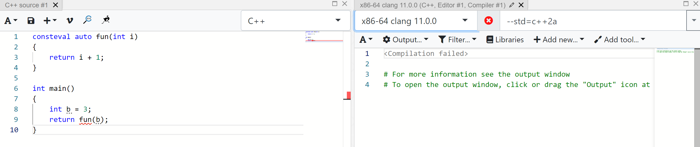

```cpp
consteval auto fun(int i)
{
    return i + 1;
}

int main()
{
    return fun(3);//改成这样即可
}
```

#### 不同的实现存在差异

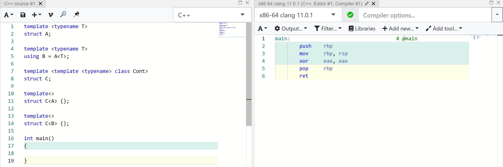

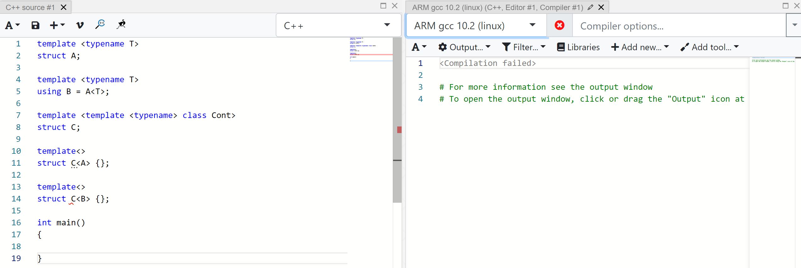

以上两个编译器的行为都正确。

这里定义了一个模板的别名，模板的别名和模板原来的名称是否能相等？

该问题在标准中没有规定。

### 不能脱离具体的语境讨论C++

标准与工具。

课上讨论：C++17以及之前，不会讨论遗弃的特性，讨论 20 特性会额外指出。

编译环境：linux，以clang、gcc为主

如果使用win、linux系统库，就会影响可移植性，所以我们只用标准库开发。

## C++ 的开发环境与相关工具

Visual C++ / GCC (G++) / Clang (Clang++)…

集成开发环境：Visual Studio / CodeLite / Code::blocks / Eclipse…

工具

- /usr/bin/time

- valgrind

- [cppreference\.com](https://en.cppreference.com/w/)

-  [Compiler Explorer](https://godbolt.org/)

- [C\+\+ Insights](https://cppinsights.io/)
- Youtube:[CppCon \- YouTube](https://www.youtube.com/user/CppCon)

### Compiler explorer

 [Compiler Explorer](https://godbolt.org/)

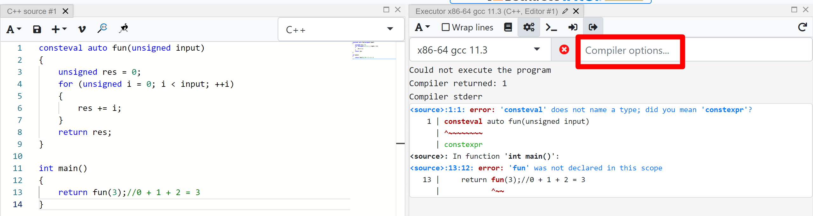

这里是因为没有编译选项`--std=c++2a`

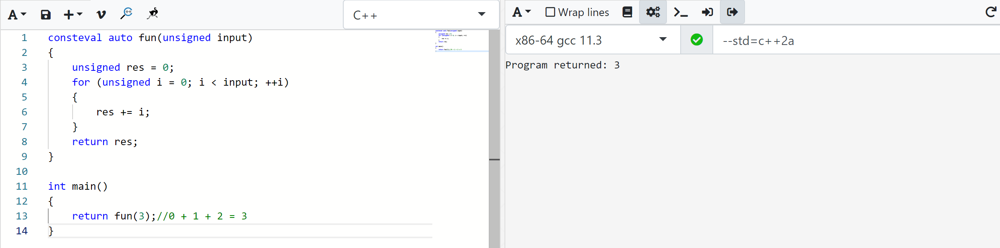

Compiler explorer 缺点：只能包含一段代码，无法运行多文件程序。

### C++ insights

[C\+\+ Insights](https://cppinsights.io/)

C++ 标准发展，新标准中C++引入的新语法一定能被老标准中的语法表示。

```cpp
#include <cstdio>

int main()
{
    const char arr[10]{2,4,6,8};

    for(const char& c : arr)
    {
      printf("c=%c\n", c);
    }
}
```

```cpp
#include <cstdio>

int main()
{
  const char arr[10] = {2, 4, 6, 8, '\0', '\0', '\0', '\0', '\0', '\0'};
  {
    char const (&__range1)[10] = arr;
    const char * __begin1 = __range1;
    const char * __end1 = __range1 + 10L;
    for(; __begin1 != __end1; ++__begin1) {
      const char & c = *__begin1;
      printf("c=%c\n", static_cast<int>(c));
    }
    
  }
  return 0;
}

```

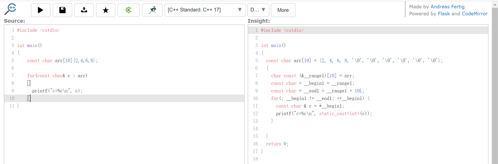

## C++的编译/链接模型

### 简单的加工模型


问题：无法处理大型程序

- 加工耗时较长

- 即使少量修改，也需要全部重新加工

### 解决方案：分块处理

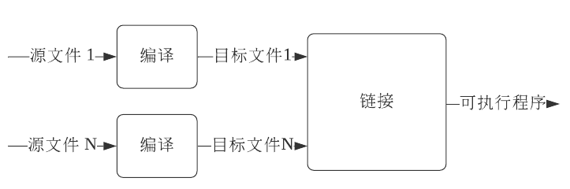

好处

- 编译耗资源但一次处理输入较少
- 链接输入较多但处理速度较快
- 便于程序修改升级

​		修改源文件1后其他源文件为改变的不用重新编译。

### 由“分块处理”衍生出的概念“分块处理”衍生出的概念

#### 定义 / 声明

​	定义：（变量的/函数的？）定义，在源文件 1 和 2 中可能重复定义。

​	声明：声明源文件中有这个定义。在链接时查找。

#### 头文件 / 源文件

​	头文件：可以包含声明、定义。

​	源文件：展开头文件。

#### 翻译单元

>  翻译单元由实现文件及其直接或间接包含的所有标头组成。 实现文件通常具有文件扩展名 *`.cpp`* 或 *`.cxx`*。头文件通常扩展名 *`.h`* 为或 *`.hpp`*. 每个转换单元由编译器独立编译。
>
> [翻译单元和链接 \(C\+\+\) \| Microsoft Docs](https://docs.microsoft.com/zh-cn/cpp/cpp/program-and-linkage-cpp?view=msvc-170)

- 源文件 + 相关头文件（直接/ 间接）- 应忽略的预处理语句

- 一处定义原则：

  通常可执行程序的所有翻译单元中，对于一个东西只能有一处定义。

  - 程序级：一般函数
  - 翻译单元级：内连函数、类、模板


```shell
youhuangla@Ubuntu compile_model % gcc -E main.cpp -o main.i                                                  [0]
youhuangla@Ubuntu compile_model % ll                                                                         [0]
total 656K
-rw-rw-r-- 1 youhuangla youhuangla   96 May  6 11:04 main.cpp
-rw-rw-r-- 1 youhuangla youhuangla 651K May  6 11:05 main.i
```

main.i 中以 # 开头的都是注释。

```shell
youhuangla@Ubuntu compile_model % g++ main.i -S -o main.s 
```

-S 生成汇编代码

```shell
youhuangla@Ubuntu compile_model % g++ main.cpp  
```

包含了上述四个步骤


#### 预处理

- 将源文件转换为翻译单元的过程
- 防止头文件被循环展开
  - #ifdef 解决方案
  - #pragma once 解决方案

##### 循环展开

头文件循环展开

```shell
youhuangla@Ubuntu header_loop % g++ main.cpp                                                                 [0]
In file included from header2.h:1:0,
                 from header1.h:1,
                 from header2.h:1,
                 from header1.h:1,
                 ......
                 from main.cpp:1:
header1.h:1:21: error: #include nested too deeply
 #include "header2.h"
                     ^
```

##### ifdef 解决方案

同C语言

##### pragma once 解决方案

> 该方法使用预处理器宏定义来防止多次包含文件内容。 它还有助于防止违反 *单个定义规则*：要求所有模板、类型、函数和对象在代码中都不能有多个定义。
>
> [曾经 pragma \| Microsoft Docs](https://docs.microsoft.com/zh-cn/cpp/preprocessor/once?view=msvc-170)

#### 编译

将翻译单元转换为相应的汇编语言表示
编译优化
https://godbolt.org/z/zh9aqx

- 增量编译 V.S. 全部编译

##### 编译优化

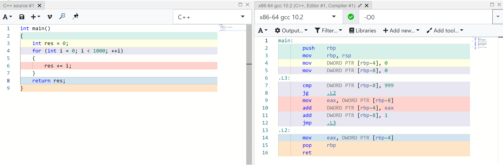

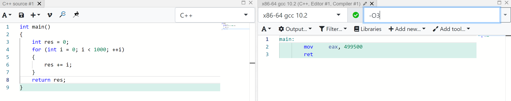

 O1 、O2 同理。分析代码，并生成等价的汇编代码。优化加快了运行速度，不利于调试。

这时无法打断点、debug。

通常使用 debug 进行开发，优化程度小，release编译，优化程度大。

###### 增量编译 V.S. 全部编译

增量编译：

> **增量編譯器**是一種應用於[編譯器](https://zh.wikipedia.org/wiki/編譯器)領域的[增量計算](https://zh.wikipedia.org/wiki/增量计算)。一般而言普通的編譯器會進行所謂的**乾淨構建**，即（重新）構建所有程式模組，而增量編譯器只重新編譯程式修改過的那部分[[1\]](https://zh.wikipedia.org/zh-hk/增量编译器#cite_note-1)代碼。對於大多數增量編譯器來說，只編譯原始碼被修改過的程式部分通常很快就能完成。
>
> [增量編譯器 \- 維基百科，自由的百科全書](https://zh.wikipedia.org/zh-hk/%E5%A2%9E%E9%87%8F%E7%BC%96%E8%AF%91%E5%99%A8)

编译器编译了源文件生成了目标文件。编译器可以查看源文件修改的时间，哪个源文件比目标文件新，就编译哪个源文件。

如果修改了头文件，编译器会发现源文件比目标文件旧，但是源文件引用了一个头文件，这个头文件比目标文件新。有些开发环境可以解决这个问题，但是一些较老的编译环境会有这个问题，这时候只能全部编译。

对应到 IDE 中就是 Build Project 和 Rebuild Project。

#### 链接

- 合并多个目标文件，关联声明与定义 
- 连接（Linkage ）种类：内部连接、外部连接、无连接
- 链接常见错误：找不到定义 

###### 找不到定义

```cpp
#include <iostream>
using namespace std;

extern int x;

int main() {
	cout << x << endl;
	return 0;
}
```

```shell
/tmp/cczIhFoc.o: In function `main':
main.cpp:(.text+0x6): undefined reference to `x'
collect2: error: ld returned 1 exit status
```

C++ 的编译 / 链接过程是复杂的，预处理、编译与链接都可能出错
编译可能产生警告、错误，都要重视

## 小结

- C++ 是一门注重性能的程序设计语言
- C++ 的标准经历类一系列的衍化，还在不断发展
- 标准与具体实现之间存在差距
- C++ 源程序转换成可执行文件是相对复杂的过程，主要包含预处理、编译、链接等阶段，每一阶段
  都可能引入错误

