# C++初探

## 目录

1. 从Hello World谈起
2. 系统I/O
3. 猜数字与控制流
4. 结构体与自定义数据类型

## 从Hello World 谈起

- 函数：一段能被反复<u>调用</u>的代码，可以接收输入，进行处理并（或）产生输出
  - 返回类型：表示了函数返回结果的类型，可以为void
  - 函数名：用于函数调用
  - 形参列表：表示函数接收的参数类型，可以为空，可以为void ，可以无形参
  - 函数体：具体的执行逻辑
-  main 函数：特殊的函数，作为整个程序的入口
  - 返回类型为int ，表示程序的返回值，通常使用0 来表示正常返回
  - 形参列表可以为空

- （内建）类型：为一段存储空间赋予实际的意义

  

- 语句：表明了需要执行的操作

  - 表达式+ 分号的语句
  - 语句块
  - if/while 等语句

- 注释：会被编译器忽略的内容
  - 用于编写说明或去除不使用的语句
  - 两种注释形式：/**/ 与//

### 函数

省略形参名后，不能通过形参获取实参的值，但可以保证接口不变。

```cpp
#include <iostream>
using namespace std;

void func(const string str, int) {
	cout << str << endl;
}

int main() {
	func("Hello World!", 1);
	return 0;
}
```

### main 函数

main 函数由系统调用，调用完程序后，操作系统可以获取返回值。

```shell
youhuangla@Ubuntu function % echo $?                                                                         [0]
0
```

通常使用 0 表示正常返回。如果 main 函数没有返回语句，系统默认返回 0 ，同C语言。它也是唯一一个：返回值非空却可以省略返回语句的函数。

形式参数只能为两种形式

1. ()或(void)
2. `(int argc, char *argv)`名字不重要，重要的是类型

### 注释

最早在 C 语言中只有块注释，没有行注释。但是块注释可能导致注释的嵌套，所以 C++ 引入了行注释。

## 系统IO

### 头文件

"header.h" 从当前目录开始找。

c++ 标准库名称没有 .h。

#### iostream

iostream：标准库所提供的IO接口，用于与用户交互

- 输入流：cin；输出流：cout / cerr / clog 
- 输出流的区别：1. 输出目标；2. 是否立即刷新缓冲区
- 缓冲区与缓冲区刷新：
  - std::flush
  - std::endl

c : character

##### 输出流的区别

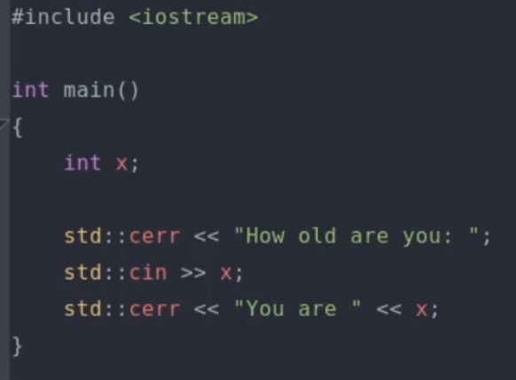

可以将 cin 和 cout 分别重定向到不同的文件中：

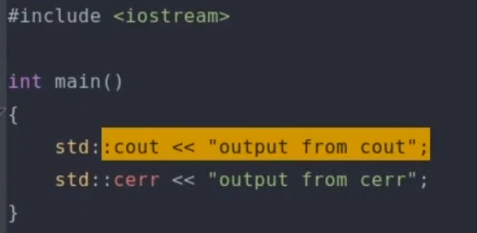

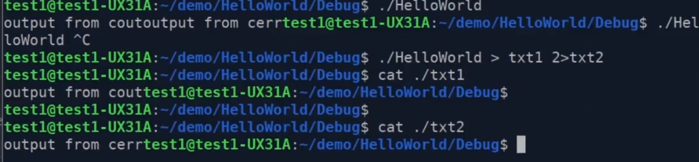

clog 和 cerr 相似

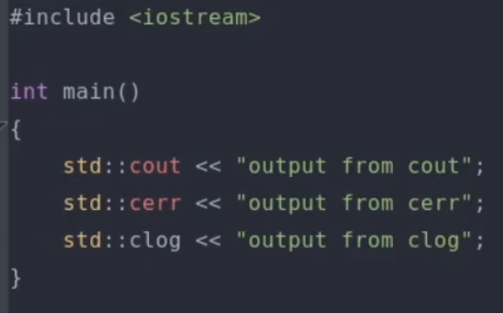

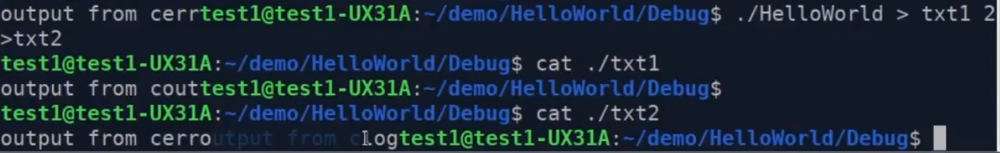

txt2 中包含 clog 和 cerr

clog 和 cerr 两者的区别：是否立刻刷新缓冲区。clog 有，输出比较快，但若是出现程序崩溃，则无法定位问题，是一个日志信息。cerr 比较重要，输出的是 error 一类较为严重的问题。

缓冲区满后立刻输出缓冲区中的所有内容。

##### 缓冲区刷新

```cpp
std::cout << "hello";
```

程序结束后才刷新缓冲区

- std::flush 与 std::endl 区别：std::endl 不仅能刷新缓冲区， 还换行了，#这其实是一个函数。

大量刷新缓冲区，程序会变慢。

\n 换行但不刷新缓冲区。

#### 名字空间

用于防止名称冲突

- std 名字空间
- 访问名字空间中元素的3种方式: 
  - 域解析符`::`
  - using语句
  - 名字空间别名
- 名字空间与名称改编（name mangling）

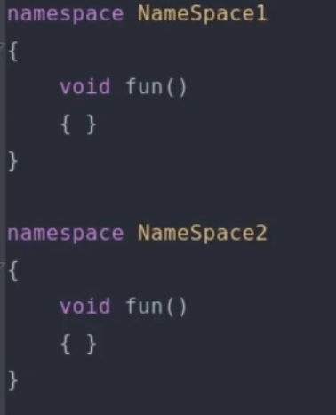

可用于函数和变量。

使用不同名字空间的同名函数不报错。

若没有名字空间，则使用默认的全局的名字空间。

##### 访问名字空间中元素的方式

###### 域解析符`::`

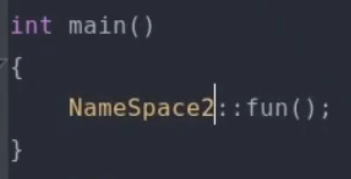

这也是最安全的写法。

###### using语句

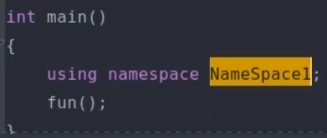

using ...可以放到函数外，但不推荐。例如：

```cpp
using namespace std;
```

将名字空间暴露给外部，引发名字冲突。

放到函数内也有冲突的可能


###### 名字空间别名

delete pic

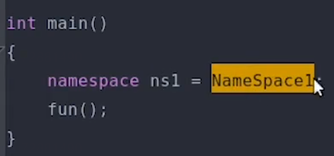

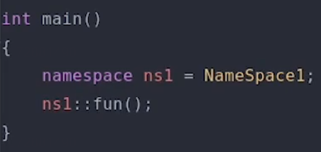

#### std 名字空间

C++ 标准库所定义的名字空间。

#### 名字空间与名称改编（name mangling）

链接：列出了main.cpp 中的所有外部链接。如果有一个


注意图中两行 NameSpace1、2，由于 fun 函数有两个不同名字空间的定义，而`::`可能对链接的过程产生困扰，所以C++对不同的名字空间的函数有一个变换，即 name mangling 。

demangling：将变换还原。虽然每个编译器都有 demangling，但具体行为可能不同。可以发现 name mangling 没改变 main ，由于main 是唯一的，所以不需要改变，其他函数由于可能有冲突，所以会改变。

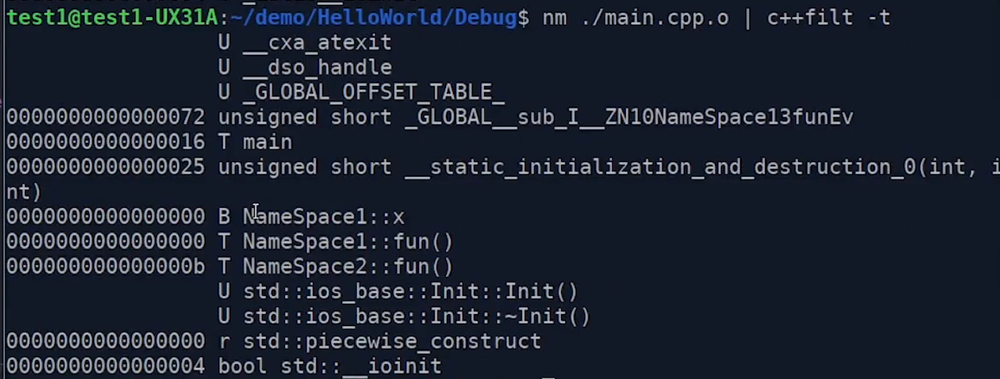

#### C / C++ 系统IO比较

- printf: 使用直观，但容易出错
- cout: 不容易出错，但书写冗长
- C++ 20格式化库：新的解决方案

printf 和 scanf 是 C语言的 IO ，需要引入 `<cstdio>`。

两种方式各有优缺点：

- printf 比较直观，cout 则有多个 <。
- #cout 可以？智能识别变量的类型，printf如果转换格式指定符 Conversion Specifier 错了就会引发错误。

C++ 20格式化库 目前编译器支持还不是很好。

## 猜数字与控制流

### == 与= 操作

- = 操作：用于赋值，将数值保存在变量所对应的内存中
- == 操作：用于判断两个值是否相等
- 可以将常量放在 == 左边以防止误用，或是把常量用 const 声明

## 结构体与自定义数据类型

### 结构体：将相关的数据放置在一起

- 可以通过点操作符（. ）访问内部元素
- 可以作为函数的输入参数或返回类型
- 可以引入成员函数，更好地表示函数与数据的相关性（C语言不支持）