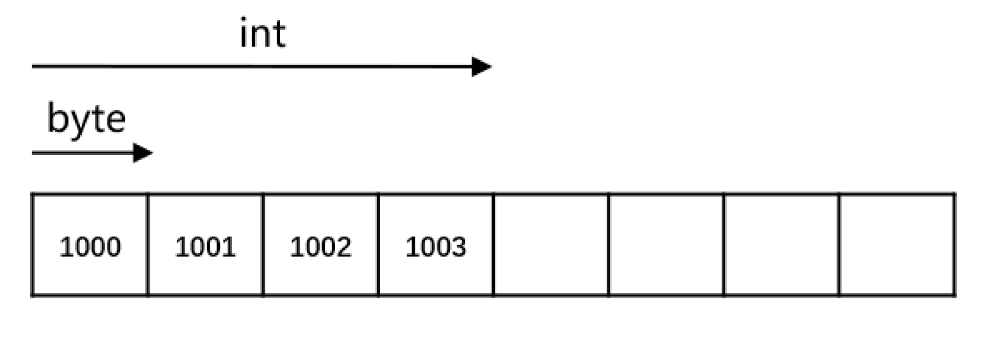

# C++初探

## 目录

1. 从Hello World谈起
2. 系统I/O
3. 猜数字与控制流
4. 结构体与自定义数据类型

## 从Hello World 谈起

- 函数：一段能被反复<u>调用</u>的代码，可以接收输入，进行处理并（或）产生输出
  - 返回类型：表示了函数返回结果的类型，可以为void
  - 函数名：用于函数调用
  - 形参列表：表示函数接收的参数类型，可以为空，可以为void ，可以无形参
  - 函数体：具体的执行逻辑
-  main 函数：特殊的函数，作为整个程序的入口
  - 返回类型为int ，表示程序的返回值，通常使用0 来表示正常返回
  - 形参列表可以为空

- （内建）类型：为一段存储空间赋予实际的意义

  

- 语句：表明了需要执行的操作

  - 表达式+ 分号的语句
  - 语句块
  - if/while 等语句

- 注释：会被编译器忽略的内容
  - 用于编写说明或去除不使用的语句
  - 两种注释形式：/**/ 与//

### 函数

省略形参名后，不能通过形参获取实参的值，但可以保证接口不变。

```cpp
#include <iostream>
using namespace std;

void func(const string str, int) {
	cout << str << endl;
}

int main() {
	func("Hello World!", 1);
	return 0;
}
```

### main 函数

main 函数由系统调用，调用完程序后，操作系统可以获取返回值。

```shell
youhuangla@Ubuntu function % echo $?                                                                         [0]
0
```

通常使用 0 表示正常返回。如果 main 函数没有返回语句，系统默认返回 0 ，同C语言。它也是唯一一个：返回值非空却可以省略返回语句的函数。

形式参数只能为两种形式

1. ()或(void)
2. `(int argc, char *argv)`名字不重要，重要的是类型

### 注释

最早在 C 语言中只有块注释，没有行注释。但是块注释可能导致注释的嵌套，所以 C++ 引入了行注释。