# A* Search

## Intro

Welcome to the lesson on A* Search.

In this lesson, you'll learn an algorithm that will allow you to quickly and efficiently <u>find a path between two points in your grid</u>.

Essentially, you're learning a maze solving algorithm.The `A*` Search algorithm is an algorithm that is frequently used for path finding when working with <u>graphs</u>.In this context, you can think of a graph as just a collection of nodes with edges connecting some of the nodes.`A*` Search allows you to efficiently find a path,if one exists, between any two nodes in the graph.

In the code that you've been working on up until now,it might not seem like you've been working with a graph that you could apply `A*`Search to.

In fact, up until now you've been working with a two-dimensional grid that has obstacles.
However, you can think of the grid as a graph with edges connecting each pair of nodes that aren't separated by an obstacle.
Viewed from this perspective,you can see why `A*`Search is an excellent algorithm for finding a path through your grid.

The steps that you'll take in this lesson to learn `A*` are as follows.

We'll start out with an introduction to Search,and Sebastian Thrun will explain the `A*`Search algorithm.
We'll move on to programming `A*`Search,in which the algorithm will be broken down into several different exercises that you'll perform.

Then you'll look at an algorithm summary and the structure of the code for these exercises.

Next, we'll look at some features of C++ that are relevant to `A*`Search,including pass-by-reference, const and constexpr, and arrays.

By the time you finish this lesson,you'll be able to print the path connecting the starting and ending points,
and that will complete your program.Along the way, you'll also add a few more special characters to clearly indicate the start point,end point, and path steps.

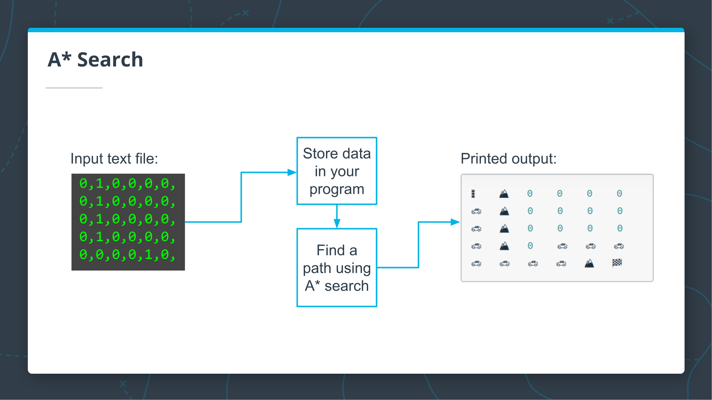

## Motion Planning

Let's talk about motion planning.

This same problem occurs for a self driving car that might live in a city near a highway on a network of streets.

The process of finding a path from a start location to a goal location is called "planning."

For robots, it's often called "robot motion planning.
Today I'm going to talk about discrete methods for planning in which the world chopped into small bins.

In the next class we're going to talk about continuous motion using those plans.

What's the planning problem?

We're given a map of the world.
We're given a starting location.
We're given a goal location.
Usually, we're given some sort of a cost function.

The simplest way to think of cost is just the time it takes to drive a certain route.
The goal is find the minimum cost path.

Before we program anything, let me see if I can ask you a couple of questions for minimum cost paths.

## Maze

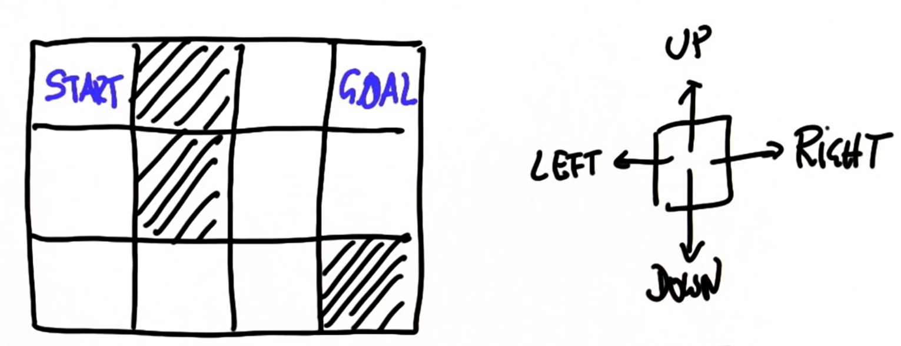

Suppose we start over here, and our goal is to go into this corner over here.There are multiple blocked cells along the way.

In this case, we have a robot that can go up, down, left, or right.

How many steps does it take for the robot that starts over here to reach the goal position?Please enter your number over here.

My answer is: 7.

### Solution

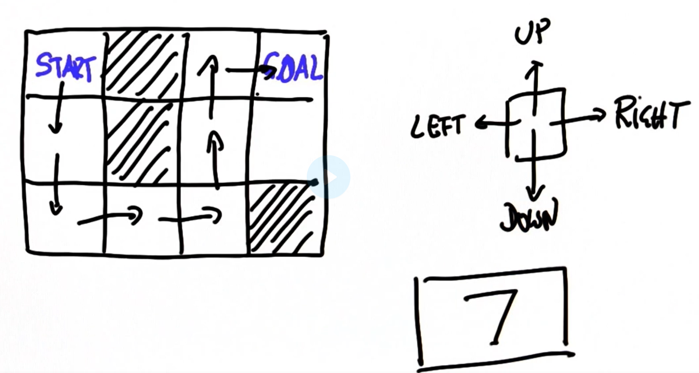

## Maze2

Let's look at the path planning problem as a search problem.

Let's start with a little grid world of size 6 x 5 where our start location is in the top left corner, our goal in the bottom right corner.

I block off a few cells so there is still a safe path to the goal.This could be a search through a city graph, through a parking lot,or through a maze of streets for a mobile robot.

Just for simplicity, in this example let's assume the robot is given 4 actions.
It can go up, down, left, or right.

Also for simplicity, let's assume every action succeeds with absolute certainty.We don't model uncertainty in this example.

The path planning or search problem is to find the shortest sequence of actions that leads our robot from the start state to the goal state.

Just to check, tell me how many you think these are.

How many action are required to go from start to goal?

My answer is: 13.

## Coding the Shortest Path Algorithm

In the previous videos, Sebastian talked about the motion planning problem, and you worked through a couple of exercises using a grid-based version of this problem. In this next video, Sebastian will describe how a general path search works in a grid.

### Grid

The big question now is,can we write a program that finds the shortest path from starts to goal.

To do so, let's give the grid cell names.

We have six columns named from zero to five and five rows from zero to four,and the basic idea I'll pursue is,that I keep a list of nodes that I wish to investigate further or as we call it,a search  expand.

Let's call this list open.

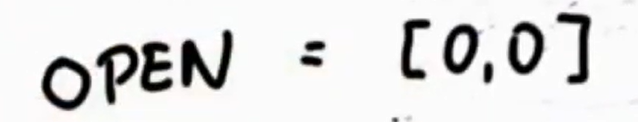

So beginning, we have only one state on this list.It's (0,0), my initial state.
Just to make sure I never pick this state again,I don't want any cycles in my path.
Let me just check mark,the state with a little red check.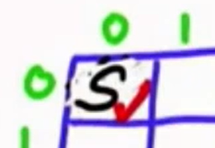

I now can test whether this state is my final goal state. Obviously, it's not.I'm not done with planning yet.

So what I do next, I expand the state.

So take it off my open list and look at all the successors of which there are two over here,(1,0) and (0,1), those two are now expanded.

So I'll check them. 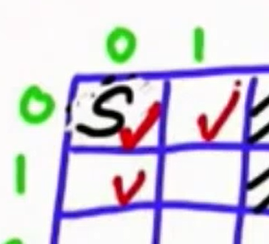

One last thing,I maintain for each of these states in the open list,how many expansions it took to get there.

So this was zero over here.It's one for these two states, in red.That's called my <u>g value</u>.

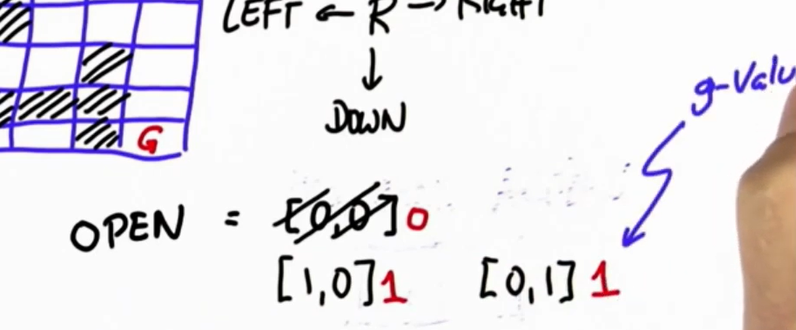

When I'm done with planning,this will be the length of the optimal paths.

Let's now go further and expand one of the two.

We always expand the one with the smallest g value but these are equivalent.

They both have a g value of one,so it doesn't make a difference.
So let me expand the first one.It's this one over here.

This one has three neighbors,(0,0), (1,1), and (2,0).

But because (0,0) is already closed with the check mark,we don't consider it anymore,
which gives me, (2,0) and (1,1)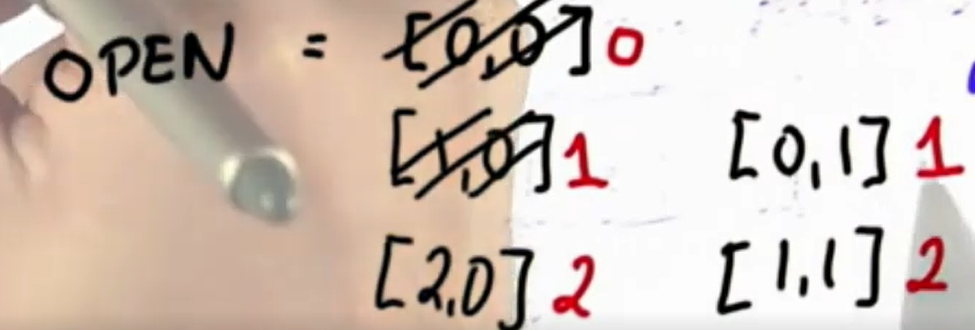,both now with a g value of two and we check those over here.

I now pick the node on the open list with the smallest g value which happens to be this one over here. There's really no choice.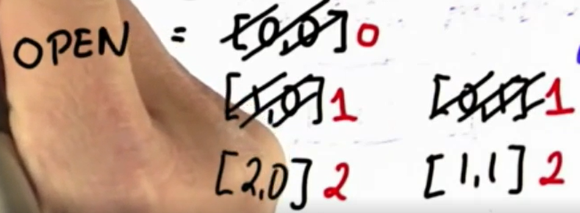
It's the node over here and this has two neighbors,(0,0) and (1,1), but both already checked.
So therefore, there's no expansion that takes place.

I only expand if I find an unchecked node.
So the new open list are these two nodes over here and our recurse.
What's going to happen is, my nodes will expand gradually into the free space until I eventually hit the goal node and without proof,the g value of when I hit the goal node,will be exactly the number of steps it takes to go from the start state to the goal node.

The secret here for that to be the case lies in the fact they'll always expand the node with the smallest g value,but we won't worry about this.

What I want you to do is, to implement a piece of code that implements what I just did.

## A* Overview

In the previous lesson, Sebastian described how a general path search worked between two cells on a board, and you wrote C++ code to implement the board. In the next video, Sebastian will describe an improved way of searching, using an algorithm called A* search. This is the algorithm you will use for the implementation of your project.

After the video, there is an additional pseudocode outline of the A* algorithm that you will be following as you work through each exercise. Don't worry about remembering it all now, as the exercises will guide you through each step!

### A* - Artificial Intelligence for Robotics

Now I want to come with you to the absolute meat of this class, which is called A-star.

A-star was invented by Nels Nelson at Stanford many years ago,and is a variant of the search algorithm that's more efficient than expanding every node.

If you've gotten so far, and you understand the mechanism for searching by gradually expanding nodes in the open list, A-star is almost the same thing but not quite.

To illustrate A-star I'm going to use the same grid as before but with a different obstacle configuration.
This is oine way A-star performs really well.

Obviously we are forced to go down to here,but in here we still have to search for the optimal path for the goal.

Here is the same in problem code; you can see all the ones over here.Start set is over here, goal set is over here.

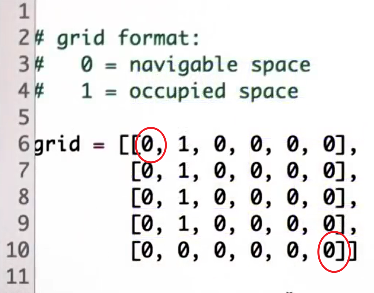

If I run this code and give you my expand list, the ones you programmed before,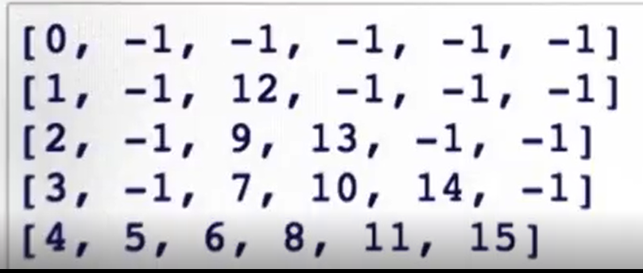you'll find that the expansion goes down from here,0,1,2,3,4,5,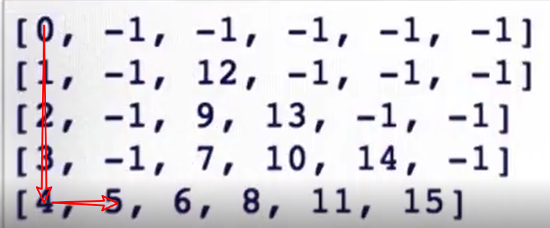but then it expands into the open space,6,7, ... ,10,11.

Diagonally it expands into the open space and until it finally hits the goal node <u>15</u>.
This took <u>16 expansions</u> to get to this point.
Let me now switch on A-star and run the code again.

What we now find it only takes <u>10 expansions</u> to get to this point, zero to nine over here.
So it expands down to <u>four</u>, but <u>then it expands straight toward the goal never touching this area over here</u>, somehow magically knowing that up here the path to the goal will be longer than going straight.

Now I didn't cheat.I didn't tell it that there's a straight path over here.So let me put an obstacle right here next to the goal and run A-star again.
What you'll find it does expand up to <u>seven</u> over here but then moves to the second line over here,
expands up here, and then hits the goal again.

So it kind of does the minimum amount of work necessary to make maximum progress to the goal.That's A-star, and now we look into A-star in more detail.

A-star uses a so called <u>heuristic function</u>, which is a function that has to be set up.If it(thr heuristic function) is all zeros then A-star resorts back to the search algorithm already implemented.
If we call the heuristic function <u>h</u>, then for each cell it results into a value.

So let me give you some values.

Here is one: Its number of steps it takes to the goal if there was no obstacle.Clearly the number I'm putting in right now , 1, 2, 3, 4, 5, and so on,are not reflective of the actual distance to the goal because they don't consider the obstacles.

In a world without obstacles the heuristic function that I'm giving you would actually measure the distance to the goal.
So the heuristic function has to be an optimistic guess how far we are from the goal.So put differently, for any cell x y the heuristic function has to be an optimistic guess,which means a smaller equal to the actual goal distance from the coordinate x and y.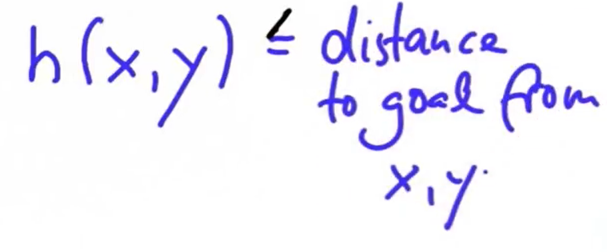
Now that sounds a little bit ad hoc,but very often you can give good heuristic functions really easily
like in this case over here.

If we just know that the agent can move left, right, up, or down,it's really easy to say what is the number of steps it would take the agent with no obstacles to get to the goal location, and that's this table over here.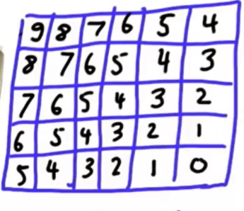That is easily generated automatically.

Now in reality this is an underestimate.

If obstacles, for example, look like this then from here it takes you more than 9 steps
to get to the goal.
It takes you 13 steps to over the hump over here.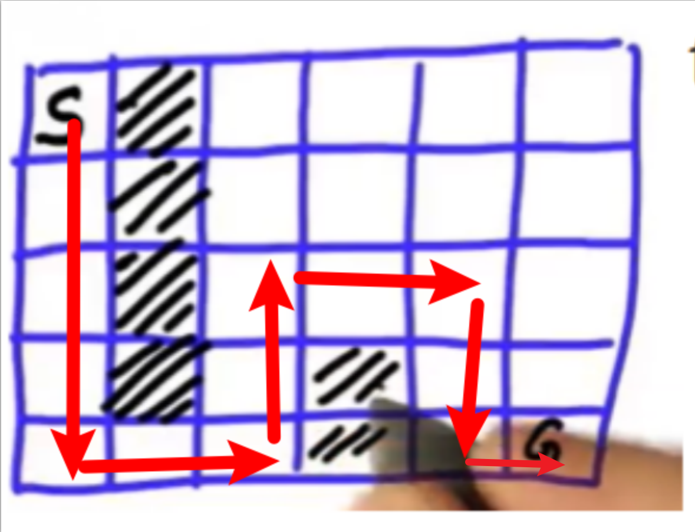
Therein lies the beauty of the heuristic function.
<u>It doesn't have to be accurate.</u>If it was accurate you probably already solved the planning problem.

There has to be a function that helps you understand where to search next in the case of ties,and <u>it has to be just so that it underestimates or at best equals the true distance from the goal.</u>

Many, many problems have functions like these in our self-driving car.We use a function just like this; in fact the function I was just showing you,we are using in our software for free-form navigation.It boils down much to the number of which cell steps but for the Euclidean distance to a target location.

I hope you understand how heuristic function might look like.

It has many, many value heuristic function including setting everything to zero,which would not really help me.

So let's work with this one heuristic function.Here is the heuristic function in the code.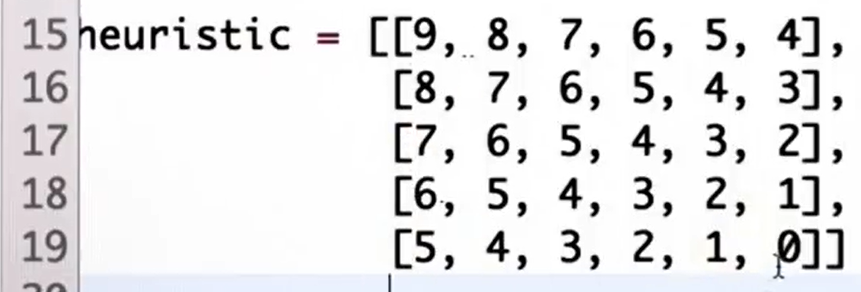
You can see the same heuristic function.

The key modification now for our search algorithm is really, really simple.
We again have an open list, and we add our state, we write down the g-value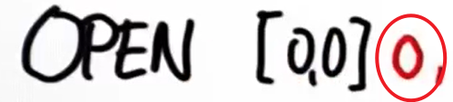,but we also write down the g-value plus the heuristic value.

G-value here is zero; heuristic value is 9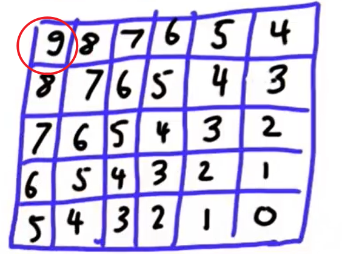.
So the sum of the two is 9, and I call this the f-value.

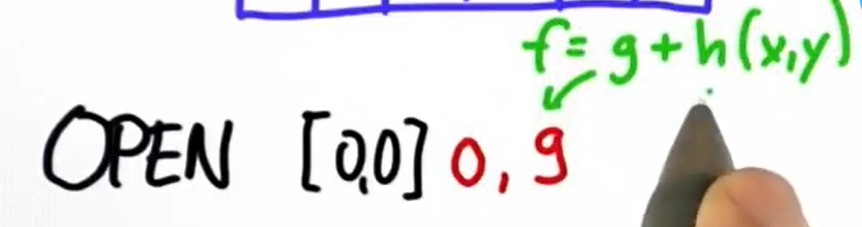

$f = g + h(x, y)$

This is the cumulative g-value plus the heuristic value as looked up in the table over here.

<u>If I now expand I remove the element with the lowest f-value and not the lowest g-value.</u>That's all there is to A-star.

Let me give you an example.

Say we went to the open list all the way down here.
That is we expanded all these states over here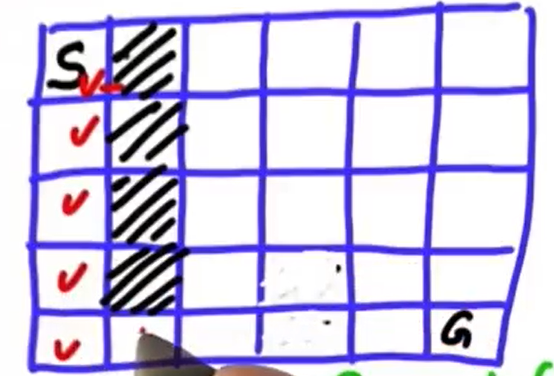,and this is the one present here on the open list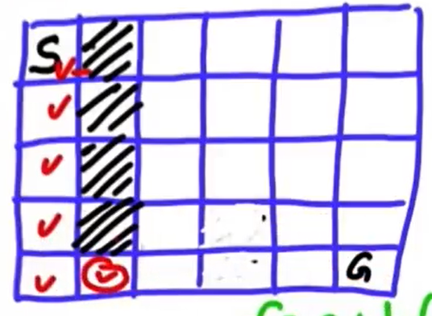.
Our g-value will be 5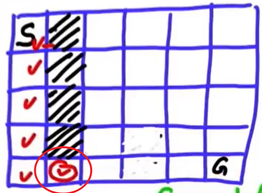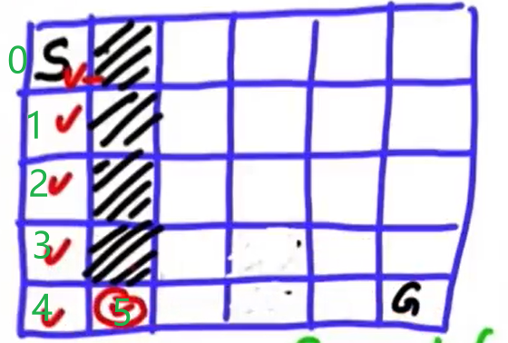.
Our heuristic will be 4, and the sum is 9 as before.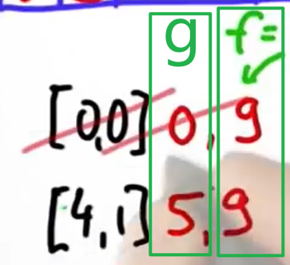
Let's now expand this node.We get to this one over here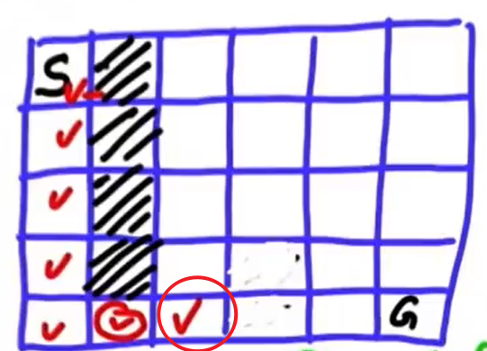, the g-value increases to 6.
G plus heuristic is still 9.
Now let's expand it more, and there's now two options finally:This state over here and this state over here.The one up here is called 3 2, the one on the right is called 4 3.

The g-value over here in both cases is 7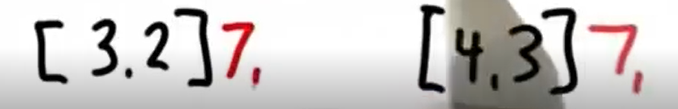,but when we add the h-value we get a difference.Up here we find the h-value to be 4.We kind of moved a little bit away from the goal according to the heuristic.That gives us a total of 11.
Whereas for the feed over here we find the h-value to be 2, 7 + 2 equals 9.

Here is the first time that A-star makes an actual difference.It has a preference to expand this node over here over the node over here.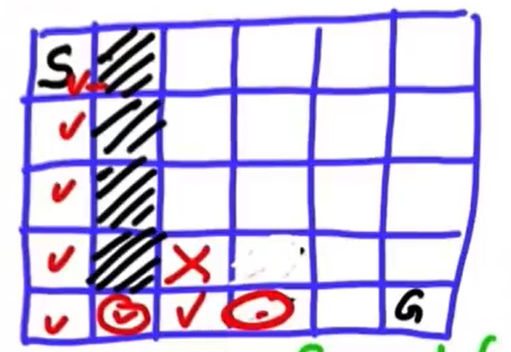
To see why the f-value, the sum of g and h, over here is 9 but over here is 11.

What this reflects is that, according to the heuristic,this guy is actually 2 steps closer to the goal than this guy over here.

This guy, according to the heuristic, may be 2 steps away from the goal,and the guy over here is at least 4 steps away.

A-star now will expand this node over here because its f-value is 9 versus 11.So let's do this.

In expanding this node we find there is two valid neighbors:the guy up here and the guy on the right.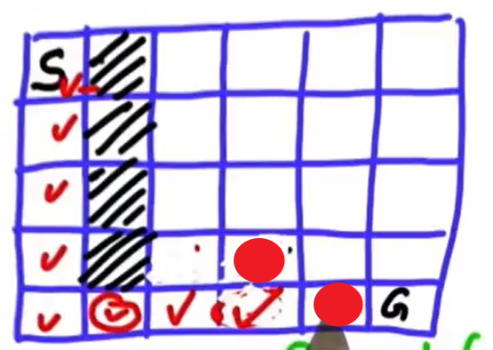
The first guy's coordinate are 3 3.The second guy is 4 4.

As before we increment the g-value by one.It was eight in both cases.

Now we add the heuristic to the g-value, which for the first one over here is 3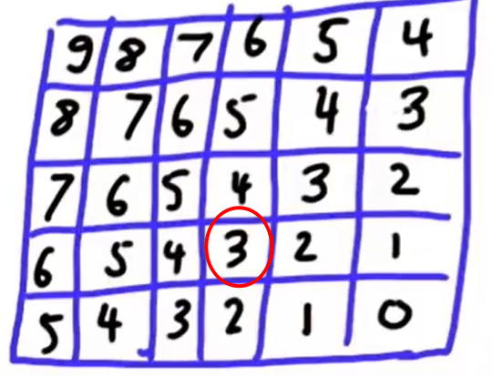; 3 + 8 = 11.
Whereas for the one on the right we get one as the heuristic, 1 + 8 = 9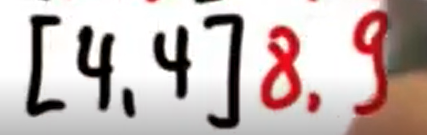.
That's the result of expanding the node over here.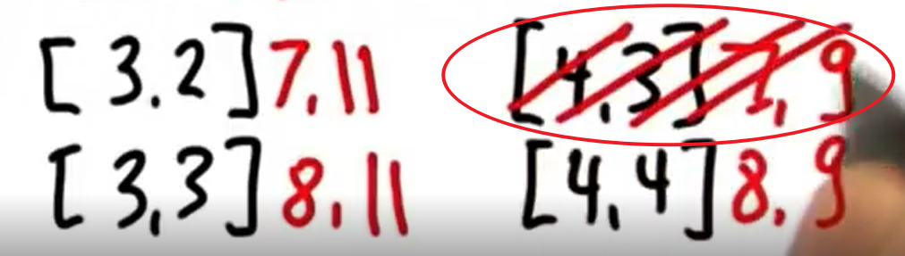
Here is our new open list, and again we have a preference.
On the open list are these three states, and we prefer the one on the right
because its f-value is smaller than the other two f-values.The one over here is 9; the ones over here have an f-value of 11.

So once again we expand, and in the expansion will be the goal state,and then we find the goal set and we're done without ever expanding anything in the maze up here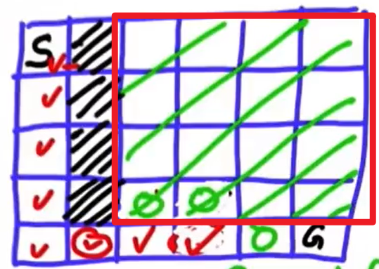.

That feels like magic, but the key thing here is by providing additional information,the so called heuristic function, we can guide the search.When we have an impasse we can pick a node that looks closer to the goal state.As a result we will likely make more progress towards the goal.

## A* Pseudocode

This algorithm described by Sebastian is very similar to other search algorithms you may have seen before, such as [breadth-first search](https://en.wikipedia.org/wiki/Breadth-first_search), except for the additional step of computing a heuristic and using that heuristic (in addition to the cost) to find the next node.

The following is pseudocode for the algorithm described in the video above. Although the pseudocode shows the complete algorithm in a single function, we will split parts of the algorithm into separate functions in this lesson so you can implement them step-by-step in a sequence of exercises:

 **Search**( *grid*, *initial_point*, *goal_point* ) :

 1. Initialize an empty list of open nodes.

 2. Initialize a starting node with the following:

    - x and y values given by *initial_point*.
    - g = 0, where g is the cost for each move.
    - h given by the heuristic function (a function of the current coordinates and the goal).

 3. Add the new node to the list of open nodes.

 4. **while** the list of open nodes is nonempty:

    1. Sort the open list by f-value
    2. Pop the optimal cell (called the *current* cell).
    3. Mark the cell's coordinates in the grid as part of the path.
    4. **if** the *current* cell is the goal cell:

    - return the *grid*.

    1. **else**, expand the search to the *current* node's neighbors. This includes the following steps:

    - Check each neighbor cell in the *grid* to ensure that the cell is empty: it hasn't been closed and is not an obstacle.
    - If the cell is empty, compute the cost (g value) and the heuristic, and add to the list of open nodes.
    - Mark the cell as closed.

 5. If you exit the while loop because the list of open nodes is empty, you have run out of new nodes to explore and haven't found a path.

### Summary

The A* algorithm finds a path from the start node to the end node by checking for open neighbors of the current node, computing a heuristic for each of the neighbors, and adding those neighbors to the list of open nodes to explore next. The next node to explore is the one with the lowest total cost + heuristic (g + h). This process is repeated until the end is found, as long as there are still open nodes to explore.

## Lesson Code Structure

### Ascii A Star First Take

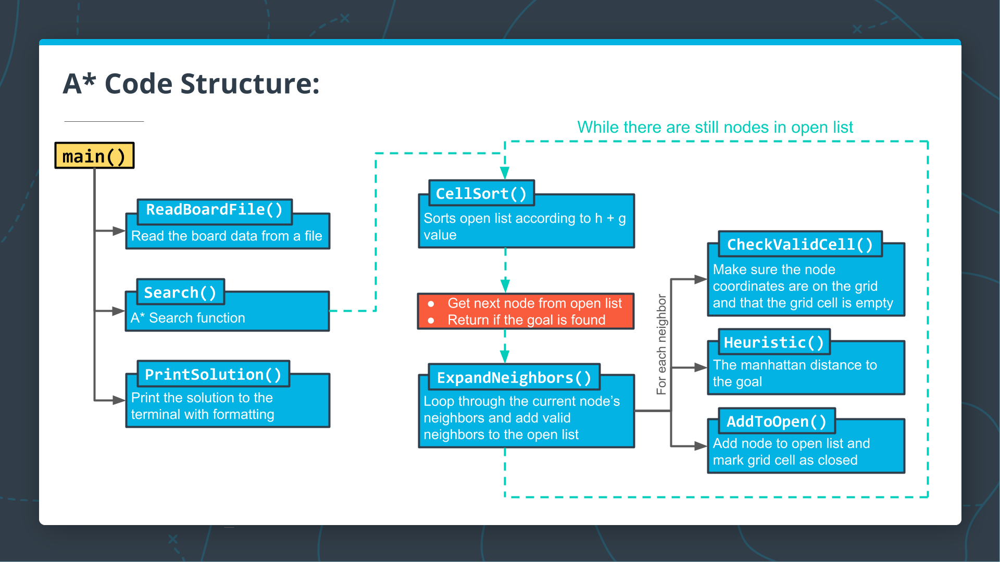

### Quiz

Below are the steps from the `while` loop in the A* pseudocode you saw previously:

 **while** the list of open nodes is nonempty:

  1. Sort the open list by f-value

  2. Pop the optimal cell (called the *current* cell).

  3. Mark the cell's coordinates in the grid as part of the path.

  4. if the current cell is the goal cell:

     - return the *grid*.

  5. else, expand the search to the current node's neighbors. This includes the following steps:

     - Check each neighbor cell in the *grid* to ensure that the cell is empty: it hasn't been closed and is not an obstacle.
     - If the cell is empty, compute the cost (g value) and the heuristic, and add to the list of open nodes.
     - Mark the cell as closed.

In the quiz below, match the steps to the appropriate function from the A* code structure diagram.

#### QUIZ QUESTION

Match the steps in the `while` loop of the pseudocode above to the functions in the code structure diagram where the code would be implemented.

Choose from pseudocode : 1,2,3,4,5

| Functions           | Steps |
| ------------------- | ----- |
| `CellSort()`        |       |
| `ExpandNeighbors()` |       |
| `Search()`          |       |

### Solution

| Functions           | Steps |
| ------------------- | ----- |
| `CellSort()`        | 1     |
| `ExpandNeighbors()` | 5     |
| `Search()`          | 4     |

### Summary

The code for the A* search algorithm has been broken down into the following functions:

- `CellSort()` - sorts the open list according to the sum of h + g
- `ExpandNeighbors()` - loops through the current node's neighbors and calls appropriate functions to add neighbors to the open list
- `CheckValidCell()` - ensures that the potential neighbor coordinates are on the grid and that the cell is open
- `Heuristic()` - computes the distance to the goal
- `AddToOpen()` - adds the node to the open list and marks the grid cell as closed

You will be implementing these functions along with a few other small helper functions throughout the rest of this lesson to complete the ASCII A* search program.