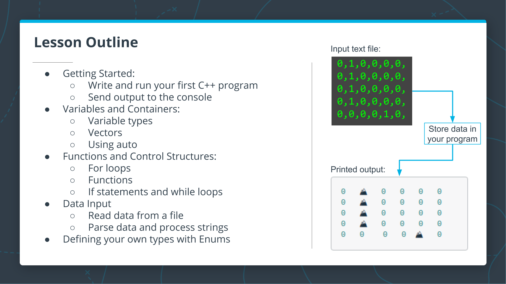

# Introduction to the C++ Language

## Intro

### Lesson Outline



Welcome to the first coding lesson,an introduction to the C++ language.

The goal of this lesson is to get you up and running with the basics of C++ including how to compile and run a simple C++ program and how to write code with correct C++ language syntax.

In this lesson, you'll see the following concepts.

To get started, you will write and run your first C++ program and you'll also learn how to send output to the console.Then you'll learn about variables and containers including different variable types,vectors, using the auto keyword,and then we'll move to functions and control structures.So you'll learn about for loops,
how to write your own C++ functions,you'll learn about if statements and while loops,and then last we'll learn about data input,where you will read data from a file and parse data and process strings.There's one more thing, which is to define your own types with enums.

By the end of this lesson,you'll be able to read a text file representing a maze into your program and you'll be able to store the maze data.You'll also be able to output a basic map of the maze with nice formatting and ASCII characters to represent obstacles.

## Compiled Languages vs Scripted Languages

In the previous exercise, you compiled your C++ program before running it. If this is the first time you've worked with a compiled language, you might be wondering why one might use a compiled language. What are the advantages and disadvantages?

In the next couple of videos, Bjarne compares compiled and scripted languages and discusses some of the advantages and disadvantages of each.

### Advantages and Disadvantages of Compiled Languages

If you want to build software that is <u>stable and as close to error-free</u> as you can get it,<u>the compiler is your best friend</u>,because the compiler is a program that checks that you have followed your own rules and the languages rule even when that's very tedious and difficult.

With a <u>dynamically</u> checked language,you have to rely on having <u>completely tested your program</u> and that never happens.So last bulk is an old joke.

I mean you never get it but if you have a systematic set of rules which is what a language is,then you're going to have a machine shake it for you.It doesn't ball and it's much faster.

That comes together with the idea of the abstraction mechanisms in C++.If everything you do is sort of hardware level, pointers, arrays,built-in types like integers and floating point,it limits what a compiler can do for you except for generating code.If you abstract so that you have hash tables and complex numbers in dimensional matrices or whatever,graphical shapes with manipulation of the graphics and things like that,then the compiler can start helping you to avoid stupid things.

In a runtime, check language at an empty check language <!--？-->.You have an IO stream,a stream that goes out and imagery and you try to rotate it with an operation that is meant to rotate the shapes on your screen.

In a dynamically type language,it will find the problem and gives you an error and since you are into the debug.

In a compiled language it will say this program will never run, you have an error.This is important because a lot of the application I'm thinking a lot about is going to run places where there won't be a programmer.So sending something into an error,hand low or debug it's not going to help at all.There won't be a programmer in the house.I mean if that camera decided that the program was wrong and it's done something bad,the only thing you could do was to stop.You don't want to telephone switch to stop just because there's not a programmer in the house or the engine of your plane or something like that.So the first reason the compiler is your best friend is that it catches errors systematically and early.This by the way means that you have to think a little bit harder when you write the code.Because you really have to <u>get it correct</u>.You can't just be sloppy and it works most of the time,that's not what a compiled language does.

The second thing is it <u>generates much better code</u>.So something like C++ it's not uncommon to find it runs 10 or 50 times <u>faster</u> than alternatives.

To put the first level of defense in the compiler is simply to get the code correct.

### Advantages of a Dynamically Scripted Language

Well, the advanced future of dynamic language is exactly the mirror image of the advantage of a compiled language.You can get to <u>run quickly</u>,and you can run all kinds of things even if they're <u>not completely correct</u>.
So say, if you're doing a series of experiments with some data,generate some data, display it, generate data,change the algorithm, run it with a smaller dataset;it doesn't matter if it's 10 times or 50 times slower.

But it is really nice that you don't have to go through the compiler step and wait 30 seconds or half an hour to get the optimal code completely checked.

So if you're doing sort of interactive experimental stuff;a dynamically checked language,JavaScript or Python or something like that,has an obvious and simple advantage.On the other hand, implement something like JavaScript.You want to write a JavaScript engine,where do you write it in? C++ of course.

So you don't actually ever use a system that only uses one language.For big systems, that time went 30 or 40 years ago.You use combinations of languages,and professionals know more than one language so they can pick the right one for the task.Trend is getting hard,but as you get older,you pick them up anyway.
But let's start out with 3-5 and then you may feel that you can do something.

## C++ Output and Language Basics

```cpp
#include <iostream>
using std::cout;

int main() {
    cout << "Hello!" << "\n";   
}

/* Review

#include <iostream>

- The #include is a preprocessor command which is executed before the code is compiled. It searches for the iostream header file and pastes its contents into the program. iostream contains the declarations for the input/output stream objects.


using std::cout;

- Namespaces are a way in C++ to group identifiers (names) together. They provide context for identifiers to avoid naming collisions. The std namespace is the namespace used for the standard library.
- The using command adds std::cout to the global scope of the program. This way you can use cout in your code instead of having to write std::cout.
- cout is an output stream you will use to send output to the notebook or to a terminal, if you are using one.
- Note that the second two lines in the example end with a semicolon ;. Coding statements end with a semicolon in C++. The #include statement is a preprocessor command, so it doesn't need one.


cout << "Hello!" << "\n";

- In this line, the code is using cout to send output to the notebook. The << operator is the stream insertion operator, and it writes what's on the right side of the operator to the left side. So in this case, "Message here" is written to the output stream cout.

*/
```

## Send Output to the Console

Previously, you wrote the most basic program that will compile in C++: a simple `main()`. In this exercise, you will modify that program to print output to the terminal. Don't forget that you can compile and run your program with the following two steps from the command line:

1. `g++ main.cpp`
2. `./a.out`

### To Complete This Exercise:

- Add code to the main.cpp file below to print "Hello!" using `cout`.

## Bjarne Introduces C++ Types

You saw that a language is <u>strongly typed</u> if <u>an object can only be used according to its definition</u>.
By that definition, C++ is mostly strongly statically typed.

However, to deal with <u>hardware</u>,sometimes you have to <u>weaken the type checking</u> because a lot of hardware is just a bag of <u>bits</u>.You want to allocate memory,it's just memory till you save what type it is.
In this in-between time where you grab some memory say from the operating system or straight from the hardware until you make it of a given type.

Well, it's a bag of bits and we wouldn't call that strongly typed.Similarly, there are ways of suppressing the type checking in C++.For instance, you have an integer and you want to make it into a pointer to a device register.

```cpp
/* Primitive types
C++ has several "primitive" variable types, which are things like ints (integers), strings, floats, and others. These should be similar to variable types in other programming languages you have used.
*/

#include <iostream>
#include <string>
using std::cout;

int main() {
    // Declaring and initializing an int variable.
    int a = 9;
    
    // Declaring a string variable without initializing right away.
    std::string b;
    
    // Initializing the string b.
    b = "Here is a string";
    
    cout << a << "\n";
    cout << b << "\n";
}

```

## Vector

The core of most applications are some datatypes,and you start with a really simple one.

The default one C++ is the vector.It's simply a <u>linear sequence</u> of <u>contiguously allocated memory</u>.(<u>Vector</u>)That's most useful data structure there is.There are <u>linked lists</u> which people overuse.Sometimes they are necessary.Then, you have the <u>hash tables</u> and the <u>maps</u> for collections of data that's kept sorted,so that lookup is much faster than lookup in other data structures.


In the notebook below, you will learn how to declare and store a vector containing primitive types, and you will also get some practice with 2D vectors, which you will be using in A* search.

```cpp
/* Vector Containers

- 1D Vectors

C++ also has several container types that can be used for storing data.
We will start with vectors, as these will be used throughout this lesson,
but we will also introduce other container types as needed.

Vectors are a sequence of elements of a single type, and have useful methods for getting the size,
testing if the vector is empty, and adding elements to the vector.

- 2D Vectors

Unfortunately, there isn't a built-in way to print vectors in C++ using cout. You will learn how to access vector elements and you will write your own function to print vectors later. For now, you can see how vectors are created and stored. Below, you can see how to nest vectors to create 2D containers.

*/

#include <iostream>
#include <vector>
using std::cout;
using std::vector;

int main() {
    // 1d
    vector<int> v1{0, 1, 2};
    vector<int> v2 = {3, 4, 5};
    vector<int> v3;
    v3 = {6, 7, 8};
    cout << "1d initial ok"
         << "\n";
    cout << v1[2] << "\n";
    cout << v2[0] << "\n";
    cout << v3[1] << "\n";

    // 2d
    vector<vector<int>> v2d{{1, 2}, {7, 8}};
    cout << "2d initial ok"
         << "\n";
    cout << v2d[1][1] << "\n";
}

```

```shell
1d initial ok
2
3
7
2d initial ok
8
```

## Comments

Comments should be used to say things that you cannot do well in code.Obviously, the code tells you how something is done.It doesn't tell you what at a high level it's been done,or why it's being done.

So you have some code and it does a sort,you'd like a comment that says,"This is supposed to be a Shellsort."Now, you can look it up in the book and see,and check the code to see if it really does a Shellsort.
But without that comment,you don't really know what the code is supposed to do.

So for things that you can't say well in code,if there's a complicated piece of code,explain what it's supposed to do.


You may have noticed comments in some of the code up until this point. C++ provides two kinds of comments:

```cpp
// You can use two forward slashes for single line comments.

/*
For longer comments, you can enclose the text with an opening
slash-star and closing star-slash.
*/ 
```

## Using Auto

You have now seen how to store basic types and vectors containing those types. As you practiced declaring variables, in each case you indicated the type of the variable. It is possible for C++ to do automatic type inference, using the `auto` keyword.

Have a look at the notebook below to see how this works.

```cpp
/* Using auto
In your previous code, the type for each variable was explicitly declared.
In general, this is not necessary, and the compiler can determine the type based on the value being assigned.
To have the type automatically determined, use the auto keyword. You can test this by executing the cell below:
*/

#include <iostream>
#include <vector>
using std::cout;
using std::vector;

int main() {
    auto i = 5;
    auto v_6 = {1, 2, 3, 7, 8, 9};
    cout << "Variables declared and initialized without explicitly stating type!"
         << "\n";

    for (auto i : v_6) {
        cout << i << " ";
    }
    cout << "\n";
}

/*
It is helpful to manually declare the type of a variable if you want the variable type to be clear for reader of your code,
or if you want to be explicit about the number precision being used;
C++ has several number types with different levels of precision,
and this precision might not be clear from the value being assigned.
*/

```

```shell
Variables declared and initialized without explicitly stating type!
1 2 3 7 8 9 
```

In order to write the A* search algorithm, you will need a grid or "board" to search through. We'll be working with this board throughout the remaining exercises, and we'll start by storing a hard-coded board in the main function. In later exercises, you will write code to read the board from a file.

## Store a Grid in Your Program

### To Complete This Exercise:

  1. In the `main` function, declare a variable `board` as a vector of vectors of ints: `vector<vector<int>>`.
 2. Assign this data to the board variable:

```
{{0, 1, 0, 0, 0, 0},
 {0, 1, 0, 0, 0, 0},
 {0, 1, 0, 0, 0, 0},
 {0, 1, 0, 0, 0, 0},
 {0, 0, 0, 0, 1, 0}}
```

**Note:** you will need to include the `vector` library, just as `iostream` is included. You will also need to use the namespace `std::vector` if you want to write `vector` rather than `std::vector` in your code.

This exercise will be ungraded, but if you get stuck, you can find the solution in `solution.cpp`. 

```cpp
#include <iostream>
#include <vector>

using std::cout;
using std::vector;

int main() {
    // TODO: Declare a "board" variable here, and store
    // the data provided above.

    vector<vector<int>> board{{0, 1, 0, 0, 0, 0},
                              {0, 1, 0, 0, 0, 0},
                              {0, 1, 0, 0, 0, 0},
                              {0, 1, 0, 0, 0, 0},
                              {0, 0, 0, 0, 1, 0}};
}
```

## Getting Ready for Printing

Excellent work! In the next part of the mini-project, you will write a function to print out the board that you have stored. Before you can do that, you will need to learn more about several important parts of the C++ language.

In the next exercises, you will learn how to <u>access elements in the vectors</u> you stored previously. Additionally, you will learn to write <u>loops</u> in C++. Finally, you will learn how to write C++ <u>functions</u> so you can begin expanding your project.

## Working with Vectors

You declared and initialized vectors in a previous notebook, but in order for the vector to be useful, you will need to be able to <u>retrieve the vector elements</u>. You will learn about <u>vector access</u> in this notebook, along with some other <u>useful vector features</u>.

```cpp

#include <iostream>
#include <vector>
using std::cout;
using std::vector;

int main() {
    //////////////////////
    // 1D Vector Access
    /////////////////////
    vector<int> a = {0, 1, 2, 3, 4};
    cout << a[0];
    cout << a[1];
    cout << a[2];
    cout << "\n";
    // Getting a Vector's Length
    cout << a.size() << "\n";

    ////////////////////////
    // 2D Vector Access
    ///////////////////////
    vector<vector<int>> b = {{1, 1, 2, 3},
                             {2, 1, 2, 3},
                             {3, 1, 2, 3}};

    cout << b[2][1];
    cout << "\n";
    // Getting a Vector's Length
    cout << b.size() << "x" << b[0].size() << "\n";
}

```

```shell
012
5
1
3x4
```

## For Loops

Just as in other languages you've worked with, C++ has both <u>`for` loops and `while` loops</u>. You will learn about `for` loops in the notebook below, and you will see `while` loops later in the course.

```cpp
#include <iostream>
#include <vector>
using std::cout;
using std::vector;

int main() {
    /* For Loop with an Index Variable */
    for (int i = 0; i < 5; i++) {
        cout << i << "\n";
    }

    /* The Increment Operator */
    auto i = 1;

    // Post-increment assigns i to c and then increments i.
    auto c = i++;

    cout << "Post-increment example:"
         << "\n";
    cout << "The value of c is: " << c << "\n";
    cout << "The value of i is: " << i << "\n";
    cout << "\n";

    // Reset i to 1.
    i = 1;

    // Pre-increment increments i, then assigns to c.
    c = ++i;

    cout << "Pre-increment example:"
         << "\n";
    cout << "The value of c is: " << c << "\n";
    cout << "The value of i is: " << i << "\n";
    cout << "\n";

    // Decrement i;
    i--;
    cout << "Decrement example:"
         << "\n";
    cout << "The value of i is: " << i << "\n";

    /* For Loop with a Container */
    // C++ offers several ways to iterate over containers.
    // One way is to use an index-based loop as above.
    // Another way is using a "range-based loop", which you will see frequently in the rest of this course.
    vector<int> a{1, 2, 3, 4, 5};
    for (int i : a) {
        cout << i << "\n";
    }
}

```

```shell
The value of i is: 2

Pre-increment example:
The value of c is: 2
The value of i is: 2

Decrement example:
The value of i is: 1
1
2
3
4
5
```

## Functions

The last thing you will need to learn in order to complete the next exercise is how to write a function. Fortunately, you have seen a function before when you wrote `main()`!

When a function is declared and defined in a single C++ file, the basic syntax is as follows:

```
return_type FunctionName(parameter_list) {
  // Body of function here.
}
```

See the following notebook for examples:

```cpp
#include <iostream>
using std::cout;

// Function declared and defined here.
int AdditionFunction(int i, int j) {
    return i + j;
}

int main() {
    auto d = 3;
    auto f = 7;
    cout << AdditionFunction(d, f) << "\n";
}
```

```cpp
#include <iostream>
#include <vector>
using std::cout;
using std::vector;

// Define a function "AdditionFunction" here.
// Instead of just two ints, this function should accept a vector<int>
// as the argument, and it should return the sum of all the ints in the vector.

int AdditionFunction(vector<int> v) {
    int sum = 0;
    for (int num : v) {
        sum += num;
    }

    return sum;
}

int main() {
    vector<int> v{1, 2, 3};

    // Uncomment the following line to call your function:
    cout << AdditionFunction(v) << "\n";
}
```

```cpp
#include <iostream>
#include <vector>
using std::cout;
using std::vector;

// Define a function "AdditionFunction" here.
// Instead of just two ints, this function should accept a vector<int>
// as the argument, and it should return the sum of all the ints in the vector.

int AdditionFunction(vector<int> v) {
    int sum = 0;
    for (int num : v) {
        sum += num;
    }

    return sum;
}

int main() {
    vector<int> v{1, 2, 3};

    // Uncomment the following line to call your function:
    cout << AdditionFunction(v) << "\n";
}
```

## On to the Exercise

Excellent work! You have learned quite a lot in the last few concepts, including:

- <u>Accessing elements</u> of a vector and getting the <u>vector's size</u>.
- How `for` loops work in C++, using <u>iterators</u> and <u>range-based loops</u>.
- Increment (and decrement) operators.
- How to write your own functions.

In the next exercise, you will write two `for` loops to print the contents of a 2D vector so you will be able to print the grid in your project!

## Print the Board

Now that you have a board stored in your program, you'll need a way to print it out so you can display the results of your project. In this exercise, you will add a `PrintBoard` function to print the board one row at a time. When you are done, the printed output should look like:

```
010000
010000
010000
010000
000010
```

### To Complete This Exercise:

> - Write a `void PrintBoard` function. The function should accept the board as an argument. The function should print each row of the board with a newline `"\n"`.
> - When you have written your `PrintBoard` function, call it from within `main()` to print the board.

[Udacity\_C\_Plus\_Plus\_Nanodegree\_Chapters/main\.cpp at 5afd52a628f5e869fc8251408768c70555b3f48d · burakbicer/Udacity\_C\_Plus\_Plus\_Nanodegree\_Chapters](https://github.com/burakbicer/Udacity_C_Plus_Plus_Nanodegree_Chapters/blob/5afd52a628f5e869fc8251408768c70555b3f48d/Lesson2_Introduction_to_C%2B%2B/6_Functions/Print_the_Board/main.cpp#L19)

```cpp
#include <iostream>
#include <vector>
using std::cout;
using std::endl;
using std::vector;


// TODO: Add PrintBoard function here.
void PrintBoard(vector<vector<int>> board){
    for (vector<int> vec_vec : board) {
        for (int i : vec_vec) {
            cout << i << " ";
        }
        cout << endl;
    }
}


int main(){
    vector<vector<int>> board{{0, 1, 0, 0, 0, 0},
                              {0, 1, 0, 0, 0, 0},
                              {0, 1, 0, 0, 0, 0},
                              {0, 1, 0, 0, 0, 0},
                              {0, 0, 0, 0, 1, 0}};

    PrintBoard(board);
}
```

```shell]
0 1 0 0 0 0 
0 1 0 0 0 0 
0 1 0 0 0 0 
0 1 0 0 0 0 
0 0 0 0 1 0 
```

## If Statements and While Loops

Now that you are able to print the board in your program, you will make the program more flexible by <u>reading the board from a file</u>. This will allow you to run your program with different board files to see the results.

Before you can read the contents of a file into your program, you'll need to learn the syntax for just a couple more parts of the C++ language: <u>`if` statements and `while` loops</u>.

```cpp
/*
C++ if statements work very similarly to if statements in other languages. In C++, the boolean condition is contained in parentheses ( and ), and the body of the statement is enclosed in curly brackets { and }.
*/

#include <iostream>
using std::cout;

int main() {
    // Set a equal to true here.
    bool a = true;

    if (a) {
        cout << "Hooray! You made it into the if statement!"
             << "\n";
    }
}

```

```cpp
/*
The syntax for a while loop looks very similar to the syntax for the if statement.
*/

#include <iostream>
using std::cout;

int main() {
    auto i = 0;

    while (i < 5) {
        cout << i << "\n";
        i++;
    }
}
```

```cpp
/* Practice
In the following code cell, you will combine a while loop with an if statement to print every other number. 
Write a while loop to iterate over the integers from 1 to 10. If the integer is even, print it out.

Hint: you can tell if an integer is even by looking at its remainder after dividing by two. 
In C++, the remainder operator is %. 
In other words, for a given int i, you have remainder = i % 2. 
If remainder equals 0, the number is even.
*/

#include <iostream>

using std::cout;
using std::endl;

int main() {
    int i = 1;
    while (i <= 10) {
        if (i % 2 == 0) {
            cout << i << endl;
        }
        i++;
    }
    return 0;
}
```

```shell
2 
4 
6 
8 
10 
```

## Reading from a File

Great! Now that you have some practice with `if` and `while` statements, you are ready to read data from a file into your C++ program. In the following notebook and the next exercise, you are going to write code to read a file, line by line. Have a look below for step-by-step instructions on how to do this.

```cpp
#include <iostream>
#include <string>

// add this for file
#include <fstream>

void file_open_testing() {
    // initial a fstream object
    // std::fstream my_file;
    // my_file.open(path)

    // or initial in one line
    // std::ifstream my_file(path);
    std::fstream my_file;
    my_file.open("files/1.board");

    // this instance my_file can use as boolean to check is the file exist or not
    if (my_file) {
        std::cout << "we have this file"
                  << "\n";
    } else {
        std::cout << "we DON'T have this file"
                  << "\n";
    }
}

void reading_data_from_stream() {
    std::fstream my_file("files/1.board");
    if (my_file) {
        std::cout << "The file stream has been created!"
                  << "\n";
        std::string line;
        while (getline(my_file, line)) {
            std::cout << line << "\n";
        }
    }
}

/*
Four steps to reading a file:

1.#include <fstream>
2.Create a std::ifstream object using the path to your file.
3.Evaluate the std::ifstream object as a bool to ensure that the stream
    creation did not fail.
4.Use a while loop with getline to write file lines to a string.
*/

int main() {
    file_open_testing();
    reading_data_from_stream();
}

```

## Reading the Board from a File

Until now, the board has been declared and initialized in the `main()` function. As discussed in the previous notebook, you will need a function to read the board in from another file in order to make the program a little more flexible and user-friendly.

The first step in this process will be to write a `ReadBoardFile` function that reads in the file and prints each line to `cout`. The output should look like the `1.board` file, which can be opened in the editor below:

```
0,1,0,0,0,0,
0,1,0,0,0,0,
0,1,0,0,0,0,
0,1,0,0,0,0,
0,0,0,0,1,0,
```

### To Complete This Exercise:

 1. Write a function `void ReadBoardFile` which reads lines from a file. Write each line to `cout`, followed by a newline character `"\n"`. The function should accept a string argument, which represents the path to the file. For now, since `ReadBoardFile` does not need to return anything, you can use a `void` return type.
 2. Call `ReadBoardFile` from main using the argument `"1.board"`.

**Note:** you will need to include the `fstream` class, and you may want to have `using std::ifstream` to use the `ifstream` object without having to write `std::` in the rest of your code.

```cpp
#include <iostream>
#include <string>
#include <vector>
using std::cout;
using std::string;
using std::vector;

#include <fstream>
using std::fstream;

// TODO: Add the ReadBoardFile function here.
void ReadBoardFile(string file_path) {
    fstream my_file(file_path);
    if (my_file) {
        cout << "The file stream has been created!" << "\n";
    }
    string line;
    while (getline(my_file, line)) {
        cout << line << "\n";
    }
}

// PrintBoard not used in this exercise
void PrintBoard(const vector<vector<int>> board) {
    for (int i = 0; i < board.size(); i++) {
        for (int j = 0; j < board[i].size(); j++) {
            cout << board[i][j];
        }
        cout << "\n";
    }
}

int main() {
    // TODO: Call the ReadBoardFile function here.
    string file_path = "files/1.board";
    ReadBoardFile(file_path);
    // Leave the following line commented out.
    // PrintBoard(board);
}

```

```shell
The file stream has been created!
0,1,0,0,0,0,
0,1,0,0,0,0,
0,1,0,0,0,0,
0,1,0,0,0,0,
0,0,0,0,1,0,
```

## Processing Strings

Now that the board is being read into your program line by line, you will want to <u>process each line and store the data</u>, rather than just streaming it to `cout`. There are many ways to do this in C++, but we will focus on <u>`istringstream` from the `<sstream>` header file</u>.

```cpp
/* Streaming ints from a string with istringstream

In C++ strings can be streamed into temporary variables,
similarly to how files can be streamed into strings.
Streaming a string allows us to work with each character individually.

One way to stream a string is to use an input string stream object
istringstream from the <sstream> header.

Once an istringstream object has been created, parts of the string
can be streamed and stored using the "extraction operator": >>.
The extraction operator will read until whitespace is reached or until the stream fails.
Execute the following code to see how this works:

*/

/////////////////////////
// Read int from file string
// 1. #include<sstream>
// 2. using std::istringstream
// can read string and stop only hit space or error(end)
/////////////////////////

#include <iostream>
#include <sstream>
#include <string>

using std::cout;
using std::istringstream;
using std::string;

/*
myreader is a pointer, which point to the contain of string.
if the current pointer READ(>>) the non-number or error or endoffile
the myreader will return error or 0 or false

every time you extract a contain, the myrerader will move right to next contain.
*/

void istringstream_test() {
    cout << __func__ << "\n";

    string a("1 2 3");

    istringstream my_stream(a);

    int n;
    my_stream >> n;
    cout << n << "\n";
}

void use_isstringstream_as_boolen_read_all() {
    cout << __func__ << "\n";

    string a("1 2 3");

    istringstream my_stream(a);

    int n;

    // Testing to see if the stream was successful and printing results.
    while (my_stream) {
        my_stream >> n;
        if (my_stream) {
            cout << "That stream was successful: " << n << "\n";
        } else {
            cout << "That stream was NOT successful!"
                 << "\n";
        }
    }
}

void common_way_to_use_istringstream_in_while() {
    cout << __func__ << "\n";

    istringstream myreader("1 2 3");
    int n;
    while (myreader >> n) {
        cout << "read: " << n << "\n";
    }
    cout << "The stream has failed or ended."
         << "\n";
}

void string_with_MIX_types_not_space() {
    /*
    In the stream example above, the string contained only whitespaces
    and characters which could be converted to ints.

    If the string has mixed types, more care is needed to process the string.
    In the following example,
    the type char is used, which is a type that can hold only a single ASCII character.
    */
    cout << __func__ << "\n";

    string b("1,2,3,4,6q7p8o9");

    istringstream mixstring(b);

    // need two type of tmp value
    char c;
    int n;

    /*
        !! notice that the 9 was not printed

        mixstring >> n >> c

        tried to stream an int followed by a char.
        Since there was no char after the 9, the stream
        failed and the while loop exited.
    */
    while (mixstring >> n >> c) {
        cout << "read int: " << n << ", read char: " << c << "\n";
    }
    cout << "The stream has failed or ended."
         << "\n";
}

int main() {
    // stream with all INT type
    istringstream_test();
    use_isstringstream_as_boolen_read_all();
    common_way_to_use_istringstream_in_while();

    // stream with MIX type
    // the INT spreated by only one char not space
    string_with_MIX_types_not_space();
}

```

```shell
istringstream_test
1
use_isstringstream_as_boolen_read_all
That stream was successful: 1
That stream was successful: 2
That stream was successful: 3
That stream was NOT successful!
common_way_to_use_istringstream_in_while
read: 1
read: 2
read: 3
The stream has failed or ended.
string_with_MIX_types_not_space
read int: 1, read char: ,
read int: 2, read char: ,
read int: 3, read char: ,
read int: 4, read char: ,
read int: 6, read char: q
read int: 7, read char: p
read int: 8, read char: o
The stream has failed or ended.
```

### Reading Source Code

#### istringstream_test

`man std::istringstream` or [std::basic\_istringstream \- cppreference\.com](https://zh.cppreference.com/w/cpp/io/basic_istringstream)

a is "1 2 3", so `my_stream` (type: `istringstream`) will read until whitespace is reached or until the stream fails, that is, read until "1" before meet whitespace, and the string  "1" can be streamed and stored using the "extraction operator": >>.

