# A* Search

## Intro

Welcome to the lesson on A* Search.

In this lesson, you'll learn an algorithm that will allow you to quickly and efficiently <u>find a path between two points in your grid</u>.

Essentially, you're learning a maze solving algorithm.The `A*` Search algorithm is an algorithm that is frequently used for path finding when working with <u>graphs</u>.In this context, you can think of a graph as just a collection of nodes with edges connecting some of the nodes.`A*` Search allows you to efficiently find a path,if one exists, between any two nodes in the graph.

In the code that you've been working on up until now,it might not seem like you've been working with a graph that you could apply `A*`Search to.

In fact, up until now you've been working with a two-dimensional grid that has obstacles.
However, you can think of the grid as a graph with edges connecting each pair of nodes that aren't separated by an obstacle.
Viewed from this perspective,you can see why `A*`Search is an excellent algorithm for finding a path through your grid.

The steps that you'll take in this lesson to learn `A*` are as follows.

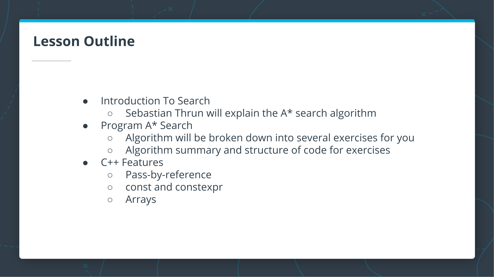

We'll start out with an introduction to Search,and Sebastian Thrun will explain the `A*`Search algorithm.
We'll move on to programming `A*`Search,in which the algorithm will be broken down into several different exercises that you'll perform.

Then you'll look at an algorithm summary and the structure of the code for these exercises.

Next, we'll look at some features of C++ that are relevant to `A*`Search,including pass-by-reference, const and constexpr, and arrays.

By the time you finish this lesson,you'll be able to print the path connecting the starting and ending points,
and that will complete your program.Along the way, you'll also add a few more special characters to clearly indicate the start point,end point, and path steps.

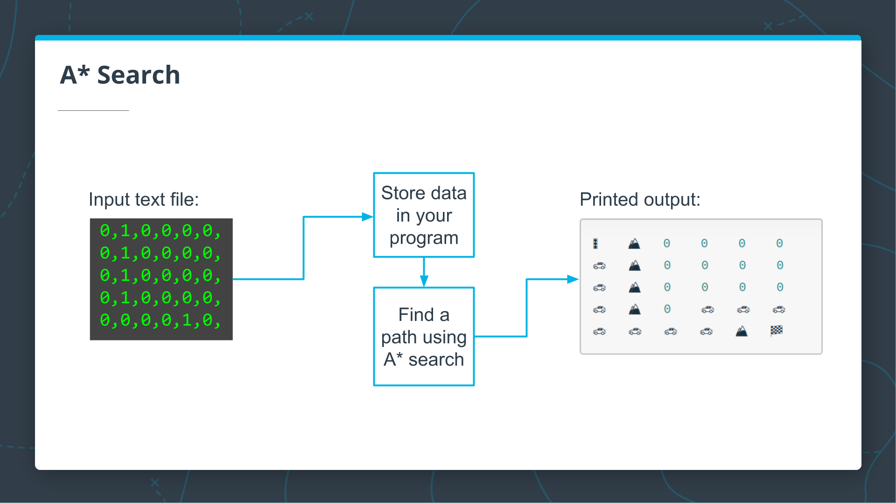

## Motion Planning

Let's talk about motion planning.

This same problem occurs for a self driving car that might live in a city near a highway on a network of streets.

The process of finding a path from a start location to a goal location is called "planning."

For robots, it's often called "robot motion planning.
Today I'm going to talk about discrete methods for planning in which the world chopped into small bins.

In the next class we're going to talk about continuous motion using those plans.

What's the planning problem?

We're given a map of the world.
We're given a starting location.
We're given a goal location.
Usually, we're given some sort of a cost function.

The simplest way to think of cost is just the time it takes to drive a certain route.
The goal is find the minimum cost path.

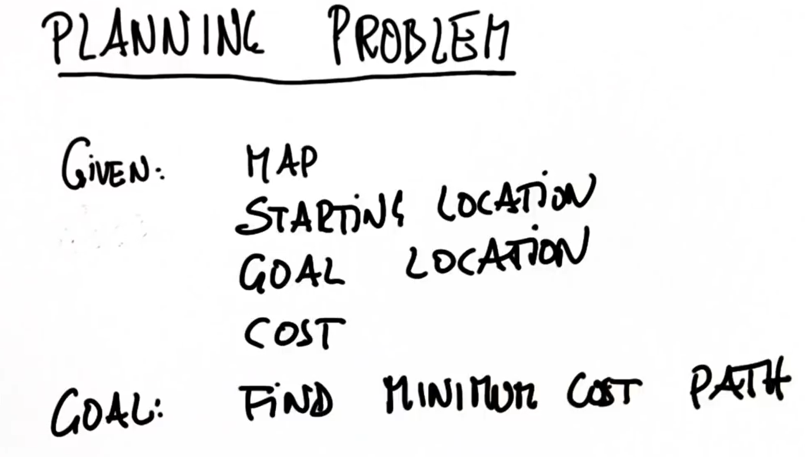

Before we program anything, let me see if I can ask you a couple of questions for minimum cost paths.

## Maze

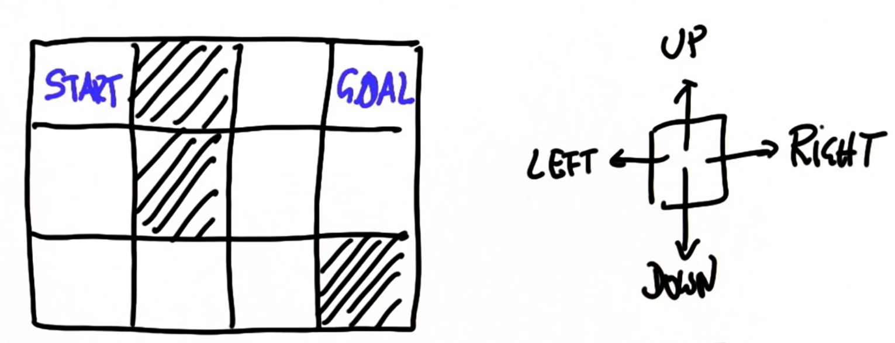


Suppose we start over here, and our goal is to go into this corner over here.There are multiple blocked cells along the way.

In this case, we have a robot that can go up, down, left, or right.

How many steps does it take for the robot that starts over here to reach the goal position?Please enter your number over here.

My answer is: 7.

### Solution

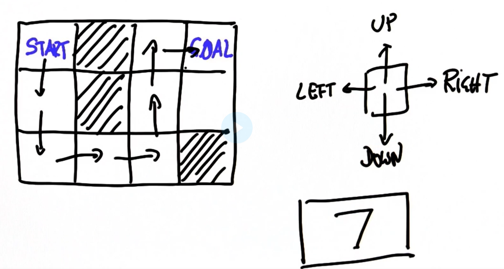

## Maze2

Let's look at the path planning problem as a search problem.

Let's start with a little grid world of size 6 x 5 where our start location is in the top left corner, our goal in the bottom right corner.

I block off a few cells so there is still a safe path to the goal.This could be a search through a city graph, through a parking lot,or through a maze of streets for a mobile robot.

Just for simplicity, in this example let's assume the robot is given 4 actions.It can go up, down, left, or right.

Also for simplicity, let's assume every action succeeds with absolute certainty.We don't model uncertainty in this example.

The path planning or search problem is to find the shortest sequence of actions that leads our robot from the start state to the goal state.

Just to check, tell me how many you think these are.

How many action are required to go from start to goal?

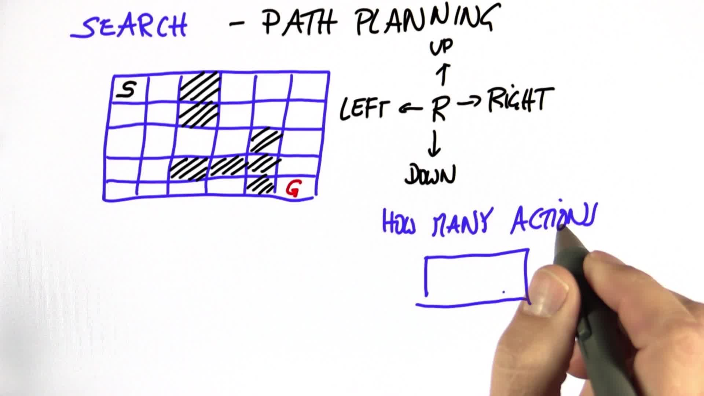

My answer is: 13.

## Coding the Shortest Path Algorithm

In the previous videos, Sebastian talked about the motion planning problem, and you worked through a couple of exercises using a grid-based version of this problem. In this next video, Sebastian will describe how a general path search works in a grid.

### Grid

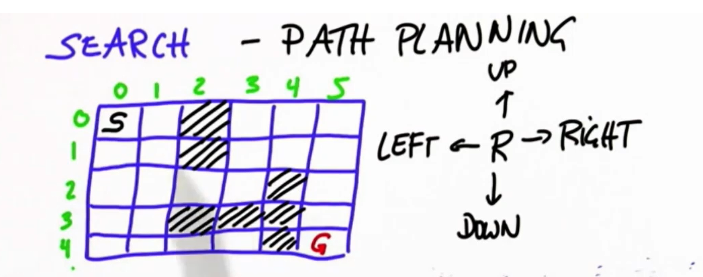

The big question now is,can we write a program that finds the shortest path from starts to goal.

To do so, let's give the grid cell names.

We have six columns named from zero to five and five rows from zero to four,and the basic idea I'll pursue is,that I keep a list of nodes that I wish to investigate further or as we call it,a search  expand.

Let's call this list open.

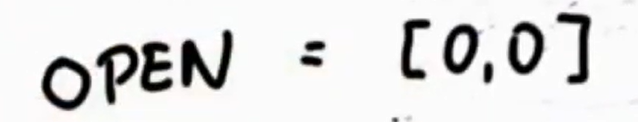

So beginning, we have only one state on this list.It's (0,0), my initial state.
Just to make sure I never pick this state again,I don't want any cycles in my path.
Let me just check mark,the state with a little red check.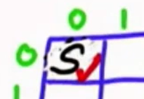

I now can test whether this state is my final goal state. Obviously, it's not.I'm not done with planning yet.

So what I do next, I expand the state.

So take it off my open list 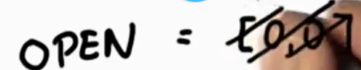and look at all the successors of which there are two over here,(1,0) and (0,1)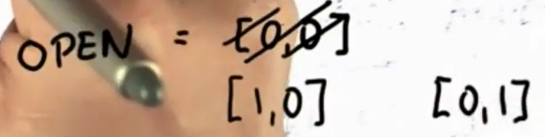, those two are now expanded.

So I'll check them. 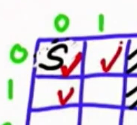

One last thing,I maintain for each of these states in the open list,how many expansions it took to get there.

So this was zero over here.It's one for these two states, in red.That's called my <u>g value</u>.

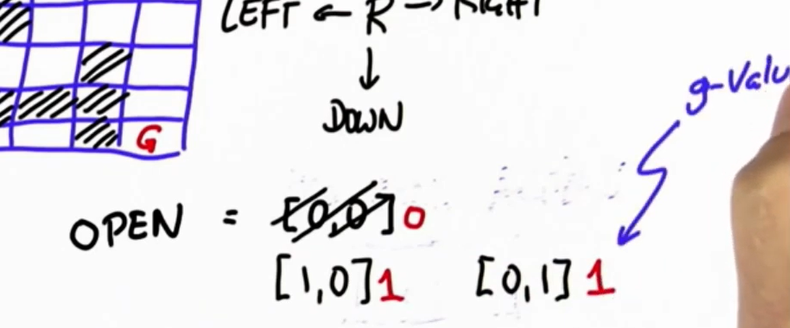

When I'm done with planning,this will be the length of the optimal paths.

Let's now go further and expand one of the two.

We always expand the one with the smallest g value but these are equivalent.

They both have a g value of one,so it doesn't make a difference.So let me expand the first one.It's this one over here.

This one has three neighbors,(0,0), (1,1), and (2,0).

But because (0,0) is already closed with the check mark,we don't consider it anymore,
which gives me, (2,0) and (1,1)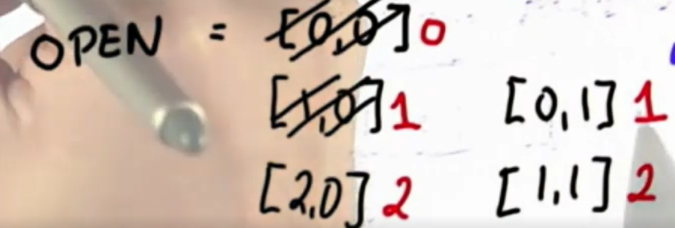,both now with a g value of two and we check those over here.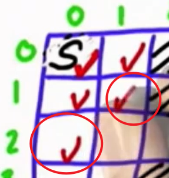

I now pick the node on the open list with the smallest g value which happens to be this one over here.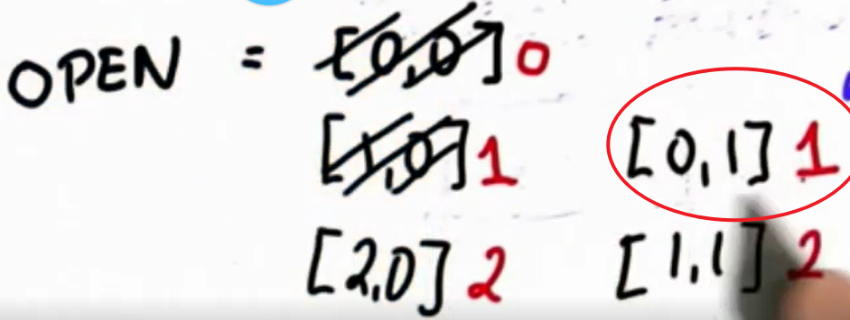 There's really no choice.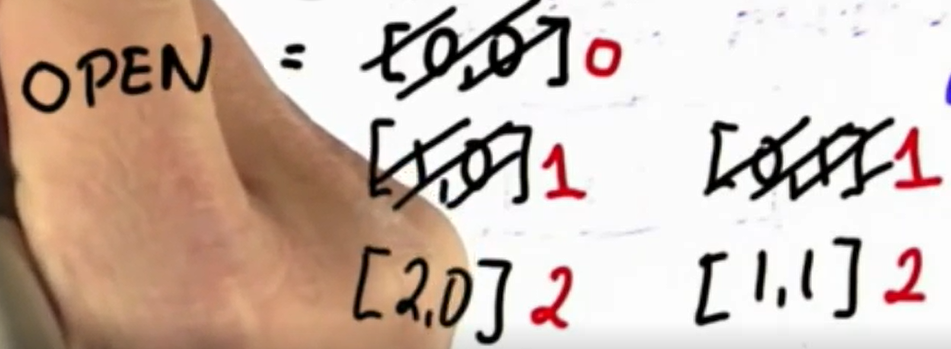
It's the node over here and this has two neighbors,(0,0) and (1,1), but both already checked.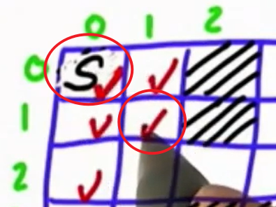
So therefore, there's no expansion that takes place.

I only expand if I find an unchecked node.
So the new open list are these two nodes over here and our recurse.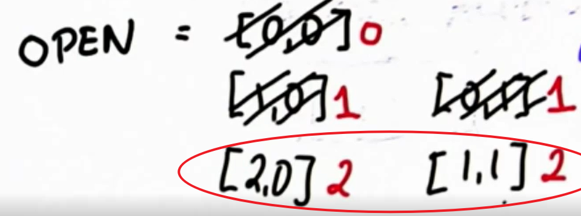
What's going to happen is, my nodes will expand gradually into the free space until I eventually hit the goal node and without proof,the g value of when I hit the goal node,will be exactly the number of steps it takes to go from the start state to the goal node.

The secret here for that to be the case lies in the fact they'll always expand the node with the smallest g value,but we won't worry about this.

What I want you to do is, to implement a piece of code that implements what I just did.

## A* Overview

In the previous lesson, Sebastian described how a general path search worked between two cells on a board, and you wrote C++ code to implement the board. In the next video, Sebastian will describe an improved way of searching, using an algorithm called A* search. This is the algorithm you will use for the implementation of your project.

After the video, there is an additional pseudocode outline of the A* algorithm that you will be following as you work through each exercise. Don't worry about remembering it all now, as the exercises will guide you through each step!

### A* - Artificial Intelligence for Robotics

Now I want to come with you to the absolute meat of this class, which is called A-star.

A-star was invented by Nels Nelson at Stanford many years ago,and is a variant of the search algorithm that's more efficient than expanding every node.

If you've gotten so far, and you understand the mechanism for searching by gradually expanding nodes in the open list, A-star is almost the same thing but not quite.

To illustrate A-star I'm going to use the same grid as before but with a different obstacle configuration.
This is oine way A-star performs really well.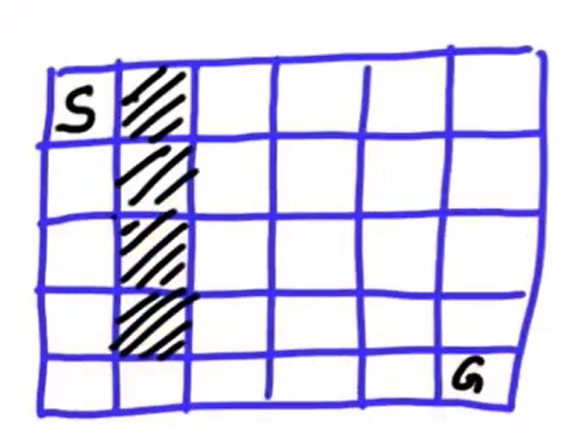

Obviously we are forced to go down to here,but in here we still have to search for the optimal path for the goal.

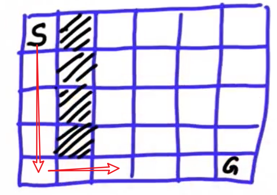

Here is the same in problem code; you can see all the ones over here.Start set is over here, goal set is over here.

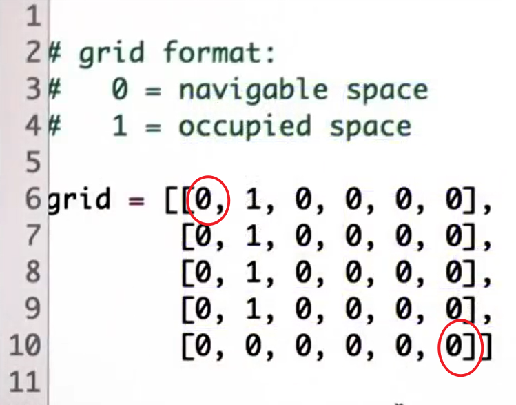

If I run this code and give you my expand list, the ones you programmed before,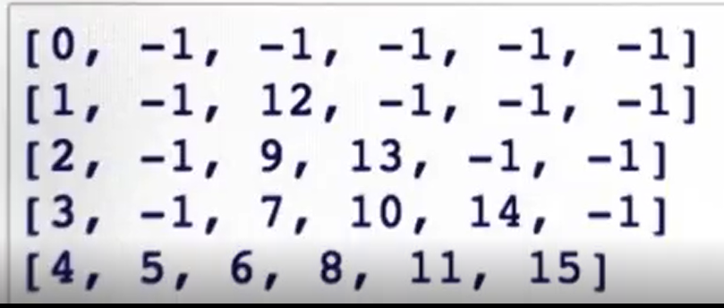you'll find that the expansion goes down from here,0,1,2,3,4,5,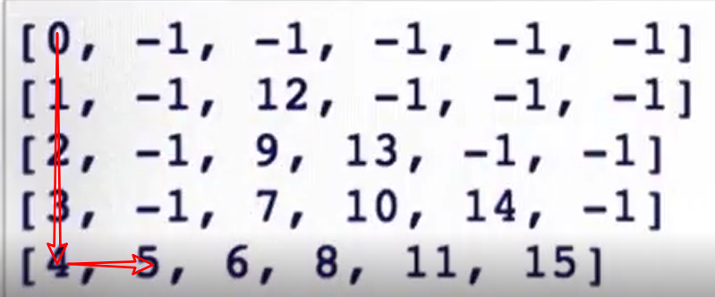but then it expands into the open space,6,7, ... ,10,11.

Diagonally it expands into the open space and until it finally hits the goal node <u>15</u>.
This took <u>16 expansions</u> to get to this point.
Let me now switch on A-star and run the code again.

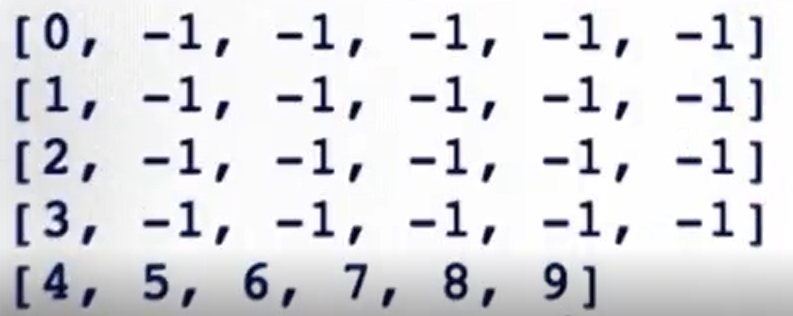

What we now find it only takes <u>10 expansions</u> to get to this point, zero to nine over here.
So it expands down to <u>four</u>, but <u>then it expands straight toward the goal never touching this area over here</u>, somehow magically knowing that up here the path to the goal will be longer than going straight.

Now I didn't cheat.I didn't tell it that there's a straight path over here.So let me put an obstacle right here 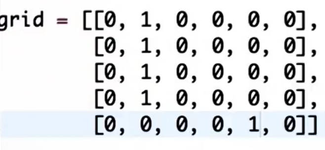next to the goal and run A-star again.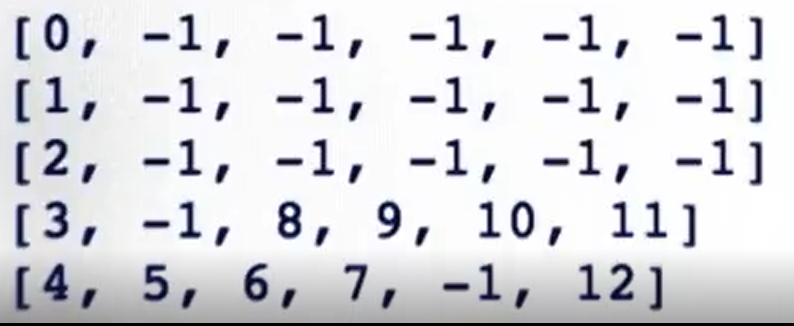
What you'll find it does expand up to <u>seven</u> over here but then moves to the second line over here,
expands up here, and then hits the goal again.

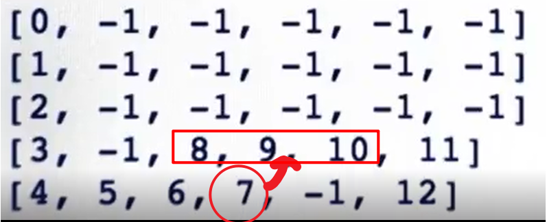

So it kind of does the minimum amount of work necessary to make maximum progress to the goal.That's A-star, and now we look into A-star in more detail.

A-star uses a so called <u>heuristic function</u>, which is a function that has to be set up.If it(thr heuristic function) is all zeros then A-star resorts back to the search algorithm already implemented.

If we call the heuristic function <u>h</u>, then for each cell it results into a value.

So let me give you some values.

Here is one: Its number of steps it takes to the goal if there was no obstacle.Clearly the number I'm putting in right now , 1, 2, 3, 4, 5, and so on,are not reflective of the actual distance to the goal because they don't consider the obstacles.

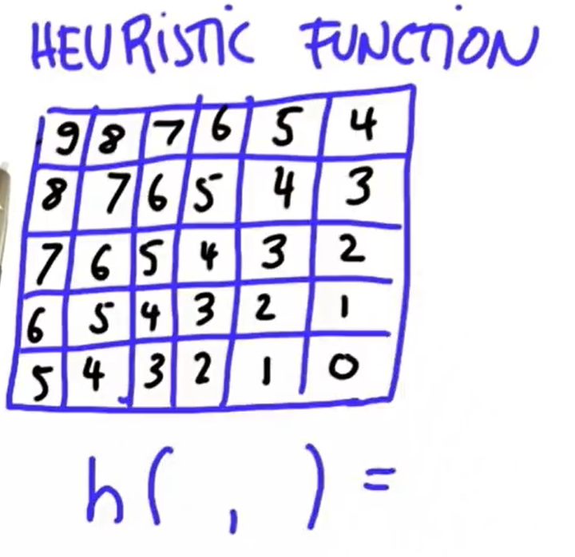

In a world without obstacles the heuristic function that I'm giving you would actually measure the distance to the goal.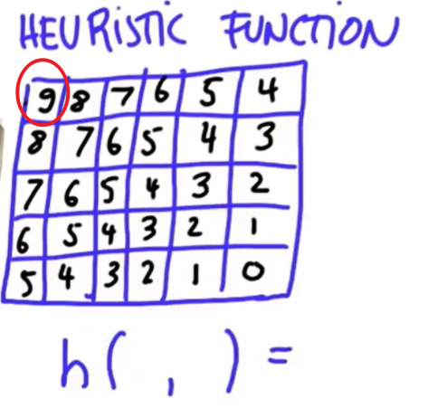
So the heuristic function has to be an optimistic guess how far we are from the goal.So put differently, for any cell x y the heuristic function has to be an optimistic guess,which means a smaller equal to the actual goal distance from the coordinate x and y.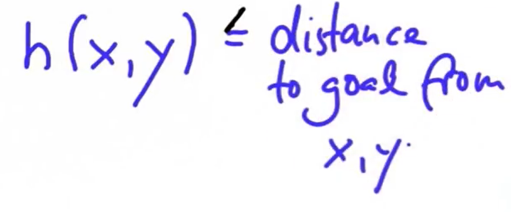
Now that sounds a little bit ad hoc,but very often you can give good heuristic functions really easily like in this case over here.

If we just know that the agent can move left, right, up, or down,it's really easy to say what is the number of steps it would take the agent with no obstacles to get to the goal location, and that's this table over here.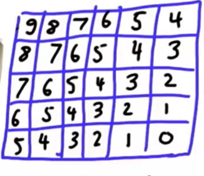That is easily generated automatically.

Now in reality this is an underestimate.

If obstacles, for example, look like this 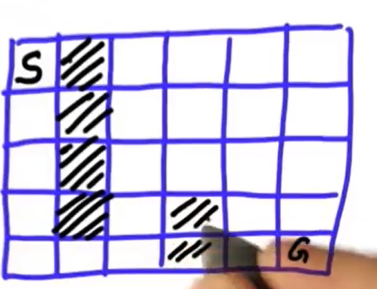then from here it takes you more than 9 steps
to get to the goal.
It takes you 13 steps to over the hump over here.

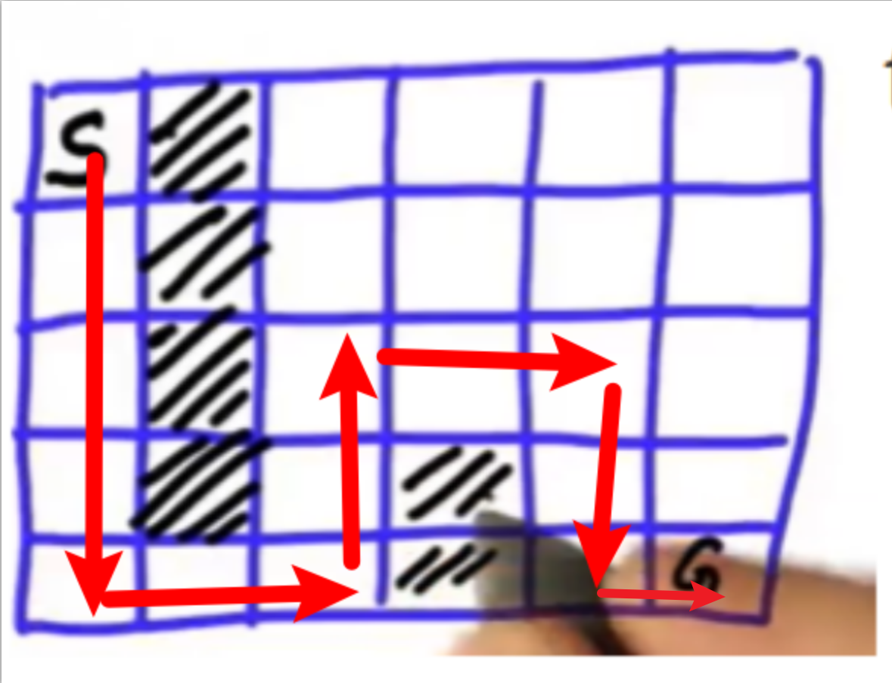
Therein lies the beauty of the heuristic function.<u>It doesn't have to be accurate.</u>If it was accurate you probably already solved the planning problem.

There has to be a function that helps you understand where to search next in the case of ties,and <u>it has to be just so that it underestimates or at best equals the true distance from the goal.</u>

Many, many problems have functions like these in our self-driving car.We use a function just like this; in fact the function I was just showing you,we are using in our software for free-form navigation.It boils down much to the number of which cell steps but for the Euclidean distance to a target location.

I hope you understand how heuristic function might look like.

It has many, many value heuristic function including setting everything to zero,which would not really help me.

So let's work with this one heuristic function.Here is the heuristic function in the code.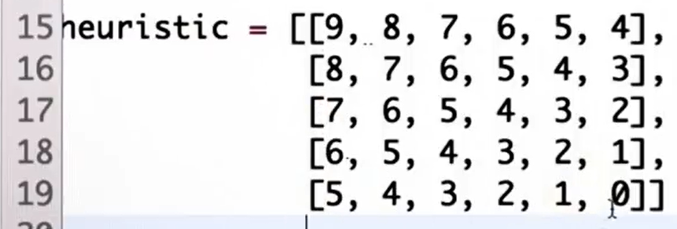
You can see the same heuristic function.

The key modification now for our search algorithm is really, really simple.
We again have an open list, and we add our state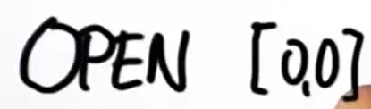, we write down the g-value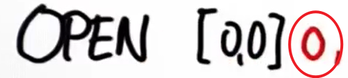,but we also write down the g-value plus the heuristic value.

G-value here is zero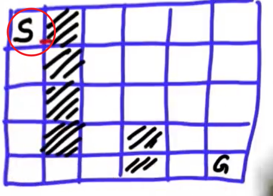; heuristic value is 9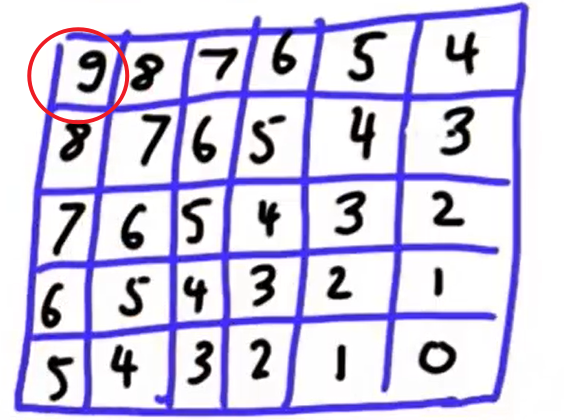.
So the sum of the two is 9, and I call this the f-value.

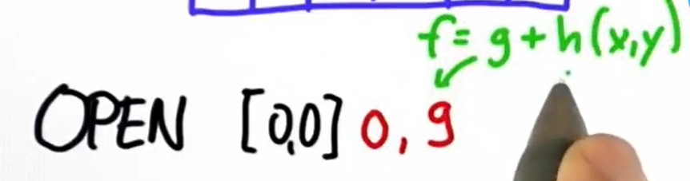

$f = g + h(x, y)$

This is the cumulative g-value plus the heuristic value as looked up in the table over here.

<u>If I now expand I remove the element with the lowest f-value and not the lowest g-value.</u>That's all there is to A-star.

Let me give you an example.

Say we went to the open list all the way down here.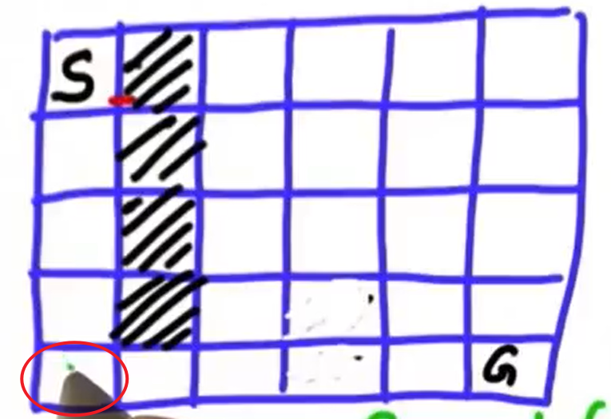
That is we expanded all these states over here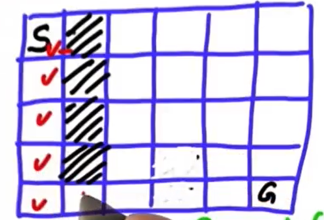,and this is the one present here on the open list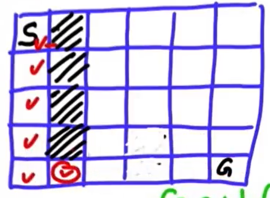.
Our g-value will be 5.

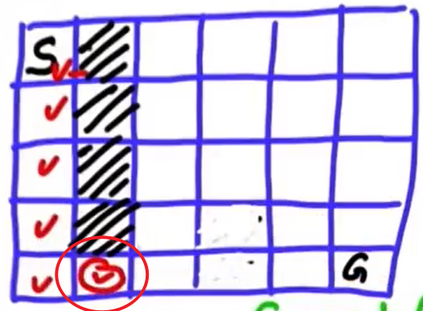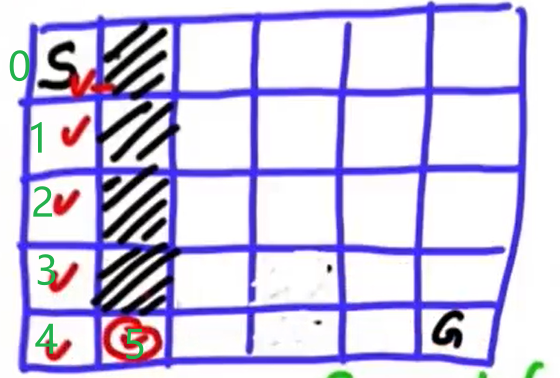.
Our heuristic will be 4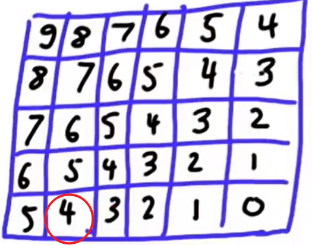, and the sum is 9 as before.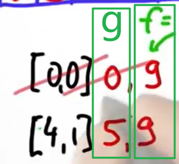
Let's now expand this node.We get to this one over here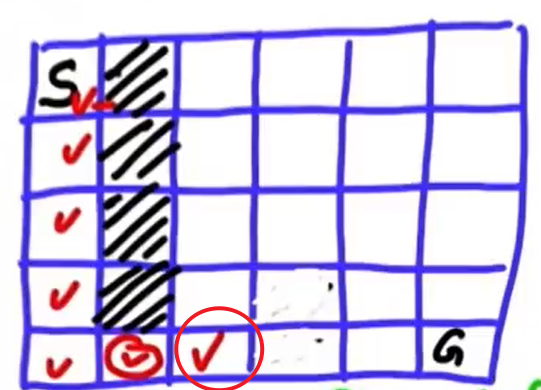, the g-value increases to 6.
G plus heuristic is still 9.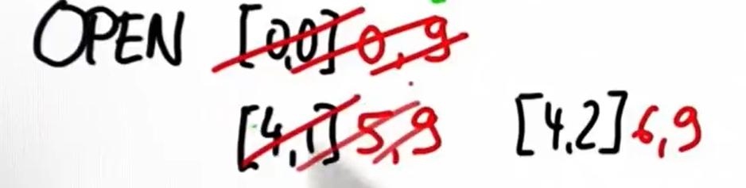
Now let's expand it more, and there's now two options finally:This state over here and this state over here.The one up here is called 3 2, the one on the right is called 4 3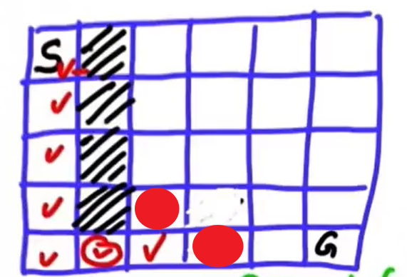.

The g-value over here in both cases is 7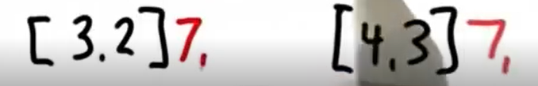,but when we add the h-value we get a difference.Up here we find the h-value to be 4.We kind of moved a little bit away from the goal according to the heuristic.That gives us a total of 11.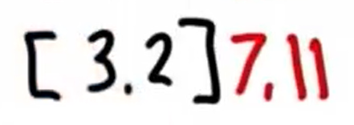
Whereas for the feed over here we find the h-value to be 2, 7 + 2 equals 9.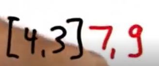

Here is the first time that A-star makes an actual difference.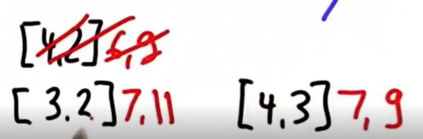It has a preference to expand this node over here over the node over here.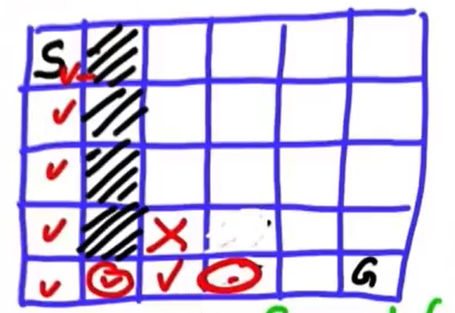
To see why the f-value, the sum of g and h, over here is 9 but over here is 11.

What this reflects is that, according to the heuristic,this guy is actually 2 steps closer to the goal than this guy over here.

This guy, according to the heuristic, may be 2 steps away from the goal,and the guy over here is at least 4 steps away.

A-star now will expand this node over here because its f-value is 9 versus 11.So let's do this.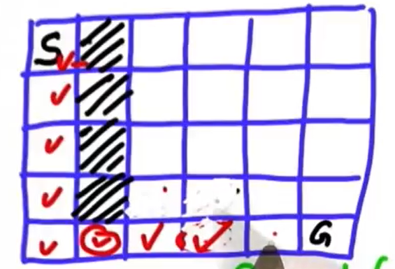

In expanding this node we find there is two valid neighbors:the guy up here and the guy on the right.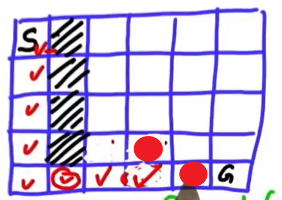
The first guy's coordinate are 3 3.The second guy is 4 4.

As before we increment the g-value by one.It was eight in both cases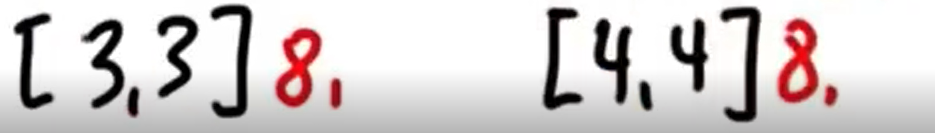.

Now we add the heuristic to the g-value, which for the first one over here is 3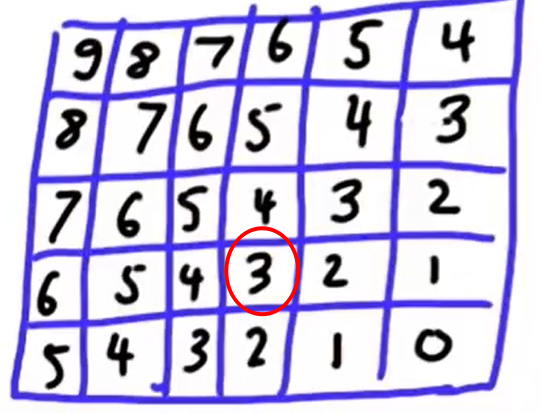; 3 + 8 = 11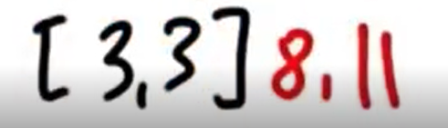.
Whereas for the one on the right we get one as the heuristic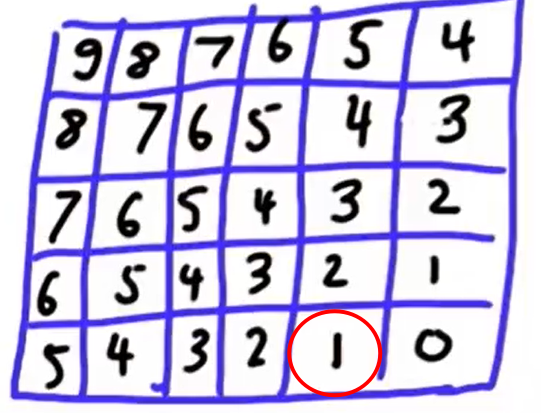, 1 + 8 = 9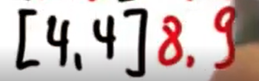.
That's the result of expanding the node over here.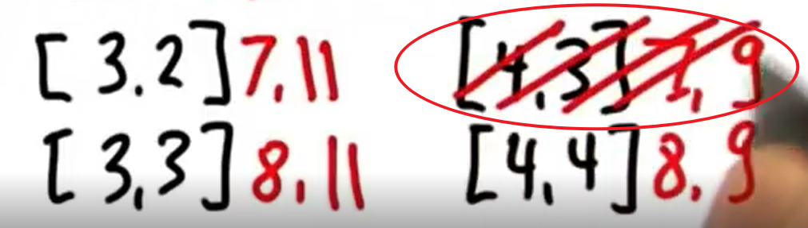
Here is our new open list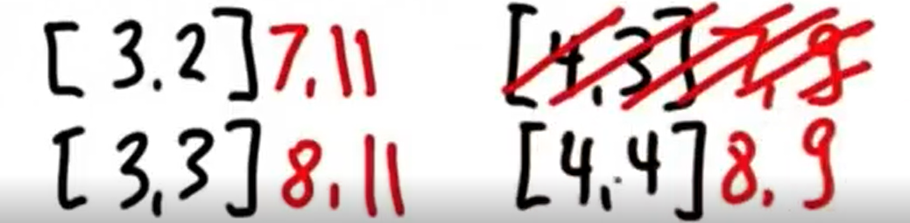, and again we have a preference.
On the open list are these three states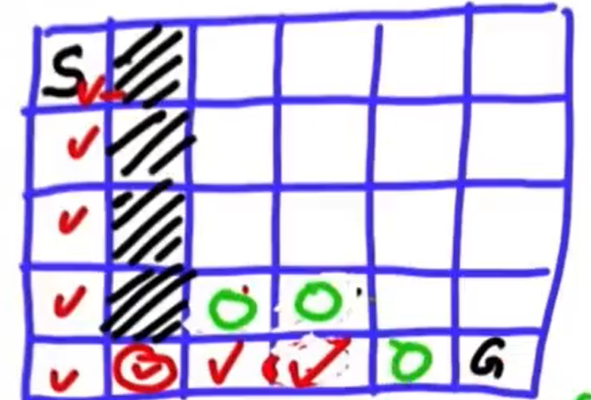, and we prefer the one on the right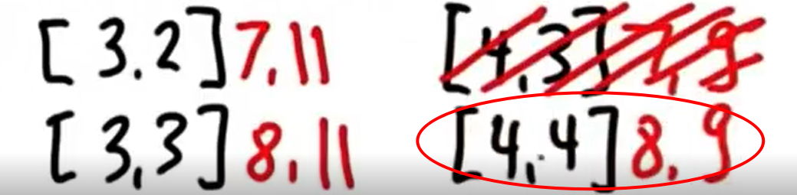
because its f-value is smaller than the other two f-values.The one over here is 9; the ones over here have an f-value of 11.

So once again we expand, and in the expansion will be the goal state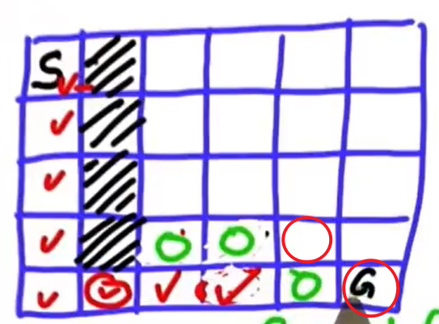,and then we find the goal set and we're done without ever expanding anything in the maze up here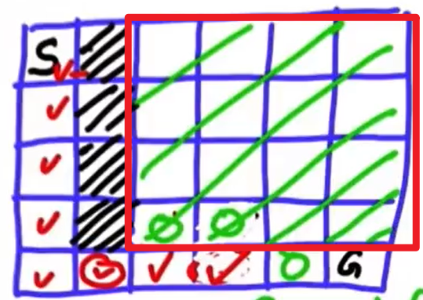.

That feels like magic, but the key thing here is by providing additional information,the so called heuristic function, we can guide the search.When we have an impasse we can pick a node that looks closer to the goal state.As a result we will likely make more progress towards the goal.

## A* Pseudocode

This algorithm described by Sebastian is very similar to other search algorithms you may have seen before, such as [breadth-first search](https://en.wikipedia.org/wiki/Breadth-first_search), except for the additional step of computing a heuristic and using that heuristic (in addition to the cost) to find the next node.

The following is pseudocode for the algorithm described in the video above. Although the pseudocode shows the complete algorithm in a single function, we will split parts of the algorithm into separate functions in this lesson so you can implement them step-by-step in a sequence of exercises:

 **Search**( *grid*, *initial_point*, *goal_point* ) :

 1. Initialize an empty list of open nodes.

 2. Initialize a starting node with the following:

    - x and y values given by *initial_point*.
    - g = 0, where g is the cost for each move.
    - h given by the heuristic function (a function of the current coordinates and the goal).

 3. Add the new node to the list of open nodes.

 4. **while** the list of open nodes is nonempty:

    1. Sort the open list by f-value
    2. Pop the optimal cell (called the *current* cell).
    3. Mark the cell's coordinates in the grid as part of the path.
    4. **if** the *current* cell is the goal cell:

    - return the *grid*.

    1. **else**, expand the search to the *current* node's neighbors. This includes the following steps:

    - Check each neighbor cell in the *grid* to ensure that the cell is empty: it hasn't been closed and is not an obstacle.
    - If the cell is empty, compute the cost (g value) and the heuristic, and add to the list of open nodes.
    - Mark the cell as closed.

 5. If you exit the while loop because the list of open nodes is empty, you have run out of new nodes to explore and haven't found a path.

### Summary

The A* algorithm finds a path from the start node to the end node by checking for open neighbors of the current node, computing a heuristic for each of the neighbors, and adding those neighbors to the list of open nodes to explore next. The next node to explore is the one with the lowest total cost + heuristic (g + h). This process is repeated until the end is found, as long as there are still open nodes to explore.

## Lesson Code Structure

### Ascii A Star First Take


### Quiz

Below are the steps from the `while` loop in the A* pseudocode you saw previously:

 **while** the list of open nodes is nonempty:

  1. Sort the open list by f-value

  2. Pop the optimal cell (called the *current* cell).

  3. Mark the cell's coordinates in the grid as part of the path.

  4. if the current cell is the goal cell:

     - return the *grid*.

  5. else, expand the search to the current node's neighbors. This includes the following steps:

     - Check each neighbor cell in the *grid* to ensure that the cell is empty: it hasn't been closed and is not an obstacle.
     - If the cell is empty, compute the cost (g value) and the heuristic, and add to the list of open nodes.
     - Mark the cell as closed.

In the quiz below, match the steps to the appropriate function from the A* code structure diagram.

#### QUIZ QUESTION

Match the steps in the `while` loop of the pseudocode above to the functions in the code structure diagram where the code would be implemented.

Choose from pseudocode : 1,2,3,4,5

| Functions           | Steps |
| ------------------- | ----- |
| `CellSort()`        |       |
| `ExpandNeighbors()` |       |
| `Search()`          |       |

### Solution

| Functions           | Steps |
| ------------------- | ----- |
| `CellSort()`        | 1     |
| `ExpandNeighbors()` | 5     |
| `Search()`          | 4     |

### Summary

The code for the A* search algorithm has been broken down into the following functions:

- `CellSort()` - sorts the open list according to the sum of h + g
- `ExpandNeighbors()` - loops through the current node's neighbors and calls appropriate functions to add neighbors to the open list
- `CheckValidCell()` - ensures that the potential neighbor coordinates are on the grid and that the cell is open
- `Heuristic()` - computes the distance to the goal
- `AddToOpen()` - adds the node to the open list and marks the grid cell as closed

You will be implementing these functions along with a few other small helper functions throughout the rest of this lesson to complete the ASCII A* search program.

## CODE: Starting A* Search

To get started with writing the A* search algorithm, you will first add a `Search` function stub that accepts and returns the appropriate variable types.


### To Complete This Exercise:

 1. Write a `std::vector<vector<State>> Search` function stub which takes a board grid and two length 2 int arrays as arguments. The int arrays will represent the start and goal coordinates for the search. The function should print ""No path found!" and return an empty `std::vector<vector<State>>`. The function will later return the board with a path from the start to the goal.
 2. In `main()`, call `Search` with a start of `{0, 0}` and a goal of `{4, 5}`. Store the results in the variable `solution`.
 3. Pass `solution` to `PrintBoard`.

### Code

```cpp
//......

// TODO: Write the Search function stub here.
/*
Search( grid, initial_point, goal_point ) :

    1.Initialize an empty list of open nodes.

    2.Initialize a starting node with the following:
        x and y values given by initial_point.
        g = 0, where g is the cost for each move.
        h given by the heuristic function (a function of the current coordinates and the goal).

    3.Add the new node to the list of open nodes.

    4.while the list of open nodes is nonempty:
        4.1 Sort the open list by f-value and pop the optimal cell (called the current cell).
        4.2 Mark the cell's coordinates in the grid as part of the path.
        4.3 if the current cell is the goal cell:
            return the grid.
        else, expand the search to the current node's neighbors. This includes the following steps:
            Check each neighbor cell in the grid to ensure that the cell is empty: it hasn't been closed and is not an obstacle.
            If the cell is empty, compute the cost (g value) and the heuristic, and add to the list of open nodes.
            Mark the cell as closed.

    5.If you exit the while loop because the list of open nodes is empty, you have run out of new nodes to explore and haven't found a path.
*/
vector<vector<State>> Search(vector<vector<State>> grid, int initial_point[2], int goal_point[2]) {
    cout << "No path found!"
         << "\n";
    return vector<vector<State>>{};
}

//......

int main() {
    // TODO: Declare 2D "init" and "goal" arrays with values {0, 0} and {4, 5} respectively.
    int init_point[2] = {0, 0};
    int goal_point[2] = {4, 5};

    auto board = ReadBoardFile("1.board");
    // TODO: Call Search with "board", "init", and "goal". Store the results in the variable "solution".
	auto solution = Search(board, init_point, goal_point);
    // TODO: Change the following line to pass "solution" to PrintBoard.
	PrintBoard(solution);
	
	return 0;
}
```

```shell
youhuangla@Ubuntu 08_Starting_Astar_Search % ./a.out                             [0]
No path found!
```

## CODE: Writing the A* Heuristic

In the next exercise,you'll write the <u>A* heuristic function</u>.This function provides a score for each node that helps A*  decide which node to explore next.In our implementation, the heuristic assigned to each node gets lower as the nodes get closer to the goal.If you choose the next node with the lowest overall cost,the heuristic function ensures that you will be moving towards the goal with this choice.


In this quiz, you will write a `Heuristic` function that will be used to guide the A* search. In general, any [admissible function](https://en.wikipedia.org/wiki/Admissible_heuristic) can be used for the heuristic, but for this project, you will write one that takes a pair of 2D coordinates on the grid and returns the [Manhattan Distance](https://en.wikipedia.org/wiki/Taxicab_geometry) from one coordinate to the other.

### To Complete This Exercise:

1. Write an `int Heuristic` function which takes four `int`s as arguments. The `int`s represent two pairs of 2D coordinates: $(x_1, y_1, x_2, y_2)$. The function should return an `int` which is the Manhattan Distance from one coordinate to the other: $|x_2- x_1| + |y_2 - y_1|$.

### Code

```cpp
// TODO: Write the Heuristic function here.
// Calculate the manhattan distance
int Heuristic(int x1, int y1, int x2, int y2) {
    return abs(x1 - x2) + abs(y1 - y2);
}
```

```shell
youhuangla@Ubuntu 09_Writing_the_Astar_Heuristic % ./a.out                                        [0]
No path found!
----------------------------------------------------------
Heuristic Function Test: passed
----------------------------------------------------------
```

## Pass by Reference in C++

In the previous exercises, you've written functions that accept and return various kinds of objects. However, in all of the functions you've written so far, the objects **returned** by the function are **different from** the objects **provided** to the function. In other words, when the function is called on some data, a copy of that data is made, and the function operates on a copy of the data instead of the original data. This is referred to as <u>pass by value</u>, since only a copy of the values of an object are passed to the function, and not the actual objects itself.

To see how to use a function to operate directly on a given object, have a look at the notebook below.

### Code

```cpp
#include <iostream>
#include <string>
using std::cout;
using std::string;

int MultiplyByTwo_passbyvalue(int i) {
    i = 2 * i;
    return i;
}

int MultiplyByTwo_passreference(int &i) {
    i = 2 * i;
    return i;
}

int MultiplyByTwo_passpointer(int *i) {
    *i = 2 * (*i);
    return *i;
}

void DoubleString(string &value) {
    // Concatentate the string with a space and itself.
    value = value + " " + value;
}

int main() {
    //Passing Values
    int a = 5;
    cout << "The int a equals: " << a << "\n";//5
    int b = MultiplyByTwo_passbyvalue(a);
    cout << "The int b equals: " << b << "\n";//10
    cout << "The int a still equals: " << a << "\n";//5

    //Passing ref
    int c = 5;
    cout << "The int c equals: " << c << "\n";//5
    int d = MultiplyByTwo_passreference(c);
    cout << "The int d equals: " << d << "\n";//10
    cout << "The int c equals: " << c << "\n";//10
    //pass pointer in C code
    int e = 5;
    cout << "The int e equals: " << e << "\n";//5
    int f = MultiplyByTwo_passpointer(&e);
    cout << "The int f equals: " << f << "\n";//10
    cout << "The int e equals: " << e << "\n";//10

    //Passing ref
    string s = "Hello";
    cout << "The string s is: " << s << "\n";//Hello
    DoubleString(s);
    cout << "The string s is now: " << s << "\n";//Hello Hello
}
```

```shell
youhuangla@Ubuntu 10_Pass_by_Reference_in_C++ % ./a.out                                           [0]
The int a equals: 5
The int b equals: 10
The int a still equals: 5
The int c equals: 5
The int d equals: 10
The int c equals: 10
The int e equals: 5
The int f equals: 10
The int e equals: 10
The string s is: Hello
The string s is now: Hello Hello
```

### On to the Exercises!

In the next exercises you will write some functions that require <u>passing variables by reference</u>. This will allow helper functions in the A* search program to modify the state of the board without having to copy the entire board, for instance.

Note that if you've encountered references before in C++, you are aware that they can be used in many other scenarios, aside from just passing variables to functions. In the next lessons, you will learn about references more generally, along with closely related *<u>pointers</u>*. However, you now know enough to finish the mini-project for the first half of the course!

Since you are well prepared with all you need at this point, this will be the last notebook in this half of the course. Good luck!

## CODE: Adding Nodes to the Open Vector


As you've seen from Sebastian's explanation of A* search, the search algorithm keeps a list of potential board cells to search through. In this implementation of A*, we will refer to a board cell along with it's `g` and `h` values as a *<u>node</u>*. In other words, each node will consist of the following values which are needed for the A* algorithm:

- an **x** coordinate,
- a **y** coordinate,
- the **g** value (or *cost*) that has accumulated up to that cell,
- the **h** value for the cell, given by the heuristic function.

In the code, nodes will be implemented with the type `vector<int>`, and should have the form `{x, y, g, h}` for `int`s x, y, g, and h. Also, the open list will be implemented as a C++ vector (of type `vector<vector<int>>`). The goal in this exercise is for you to write a helper function for your A* Search which will add nodes to the open vector and mark them as visited in the grid.

### To Complete This Exercise:

 1. Write a

    ```cpp
    void AddToOpen
    ```
    
    function which accepts the following arguments:

    - Four `int`s, one for each of the `x`, `y`, `g`, and `h` values.
- References to one `vector<vector<int>>` for the vector of open nodes.
    - Reference to one `vector<vector<State>>` for the grid.

 2. The

    ```
    AddToOpen
    ```
    
    function should do two things:

    - Create a `vector<int>` node with the form `{x, y, g, h}` and push the node to the back of the open vector.
- Set the grid value for the `x` and `y` coordinates to the enum value `kClosed`. We have added `kClosed` to the set of enum values.

### Code

```cpp
// TODO: Write the AddToOpen function here.
void AddToOpen(int x, int y, int g, int h, vector<vector<int>>& open, vector<vector<State>>& grid) {
	vector<int> node {x, y, g, h};
	open.push_back(node);
	grid[x][y] = State::kClosed;// the enum needs to study
	return ;
}
```

```shell
youhuangla@Ubuntu 11_Adding_Nodes_to_the_Open_Vector % ./a.out                                                                    [0]
board.size() or i:5, board[0].size() or j:6
No path found!
----------------------------------------------------------
Heuristic Function Test: passed
----------------------------------------------------------
AddToOpen Function Test: passed

Your grid is: 
{ x    ⛰️    0    0    0    0    }
{ x    ⛰️    0    0    0    0    }
{ x    ⛰️    0    0    0    0    }
{ x    ⛰️    0    0    0    0    }
{ 0    0    0    0    ⛰️    0    }

Solution grid is: 
{ x    ⛰️    0    0    0    0    }
{ x    ⛰️    0    0    0    0    }
{ x    ⛰️    0    0    0    0    }
{ x    ⛰️    0    0    0    0    }
{ 0    0    0    0    ⛰️    0    }

----------------------------------------------------------
```

## CODE: Initialize the Open Vector


Fantastic work so far! In the last few coding exercises, you've been writing helper functions that will be used in the A* search. While there are a few more helper functions that still need to be written, in this exercise, you will begin implementing the body of the `Search` function. In particular, you will take the arguments that are passed to the search function, get the x, y, g, and h values for the first node, and then add the first node to the open vector.

We have provided the empty vector of open nodes, `open`, in the `Search` function for you to use.

## To Complete This Exercise:

> 1. Initialize variables with the starting node values as follows:
>
> - `x` and `y` are given by the `init` variable values,
> - Set the initial cost `g` = 0,
> - `h` is given by `Heuristic` function.
>
> 1. Add first node to open vector using the `AddToOpen` function by passing the node values: `x`, `y`, `g`, and `h`, along with the `open` and `grid` vectors.

```cpp
vector<vector<State>> Search(vector<vector<State>> grid, int init[2], int goal[2]) {
    // Create the vector of open nodes.
    vector<vector<int>> open{};

    // TODO: Initialize the starting node.
    int x = init[0];
    int y = init[1];
    int g = 0;
    int h = Heuristic(x, y, goal[0], goal[1]);

    // TODO: Use AddToOpen to add the starting node to the open vector.
    // We immediately treat the init node as the first open node
    AddToOpen(x, y, g, h, open, grid);

    cout << "No path found!"
         << "\n";
    return std::vector<vector<State>>{};
}
```

## CODE: Create a Comparison Function

To choose the next node in the A* search,you want to find the node with the lowest overall cost.This cost, also called the F value,is the <u>sum</u> of two other values;the <u>H value and the G value</u>.The H value or heuristic gets <u>smaller</u> the closer node is to the goal.So incorporating this into your overall cost ensures you're searching in the right direction.The G value or distance cost <u>increases</u> with each step in the search.Incorporating this cost into the overall cost ensures that the search finds the most direct route possible instead of wandering around the grid.

In the next exercise, you'll create a comparison function that will be used to sort nodes in order to choose the next one.

Before you can use the vector of open nodes to expand the A* search, you will first need to be able to sort the vector. Since the vector contains nodes `{x, y, g, h}`, and there is no standard library function to sort these types of vectors, you will begin by writing a function which <u>compares two nodes to determine their order</u>.

This function is a helper function for the `CellSort()` function you will write later, so it is not shown on the code structure diagram.

### To Complete This Exercise:

> Write a function `bool Compare` that accepts two nodes of type `vector<int>` as arguments. It should return a boolean `true` if the f-value of the first argument is greater than the f-value of the second, and it should return `false` otherwise. Recall that the f-value is the sum of the cost and heuristic: `f = g + h`.

```cpp
// TODO: Write function to compare the f-value of two nodes here
//It should return a boolean true if the f-value of the first argument is greater than the f-value of the second,
bool Compare(vector<int> &node1, vector<int> &node2){
    if (node1[2] + node1[3] > node2[2] + node2[3] /*f of node1 >= f of node2*/) {
        return true;
    } else {
        return false;
    }
}
```

```shell
youhuangla@Ubuntu 13_Create_a_Comparison_Function % ./a.out                                       [0]
No path found!
----------------------------------------------------------
Heuristic Function Test: passed
----------------------------------------------------------
AddToOpen Function Test: passed
----------------------------------------------------------
Compare Function Test: passed
----------------------------------------------------------
```

## CODE: Write a While Loop for the A* Algorithm


Great work so far! Now on to some of the core functionality of the A* search algorithm. A* search works by sorting the open list using the f-value, and using the node with the lowest f-value as the next node in the search. This process continues until the goal node has been found or the open list runs out of nodes to use for searching.

In this exercise, you will implement the primary `while` loop in the algorithm which carries out the process described above:

### To Complete This Exercise:

Complete all of the TODOs in the pseudocode below. These are also marked directly in the exercise code.

```cpp
  // TODO: while open vector is non empty {
    // TODO: Sort the open list using `CellSort`, and get the current node.

    // TODO: Get the x and y values from the current node,
    // and set grid[x][y] to kPath.

    // TODO: Check if you've reached the goal. If so, return grid.


    // If we're not done, expand search to current node's neighbors. This step will be completed in a later quiz.
    // ExpandNeighbors

  //} // TODO: End while loop

```

**Note:** We've included a header and a function to sort the open vector:

- `#include <algorithm>`
- `std::sort`
- `CellSort`

The `CellSort` function uses the `Compare` function you wrote previously to determine the sorting order. The `CellSort` function contains two operators that you haven't seen before: `*` and `->`. These operators have to do with C++ pointers, which you will learn about in the next lesson. Don't worry about them for now!

```cpp
	while (open.size() > 0) {
		CellSort(&open);
		vector<int> cur_min_f_node = open.back();// after sorted, the min f node is the back of open node
		open.pop_back();// pop the back node of the open list
		int node_x = cur_min_f_node[0];
		int node_y = cur_min_f_node[1];
		grid[node_x][node_y] = State::kPath;
		if (goal[0] == node_x && goal[1] == node_y) {
			return grid;
		}
	}

```

```shell
youhuangla@Ubuntu 14_Write_a_While_Loop_for_the_Astar_Algorithm % ./a.out                         [0]
No path found!
----------------------------------------------------------
Heuristic Function Test: passed
----------------------------------------------------------
AddToOpen Function Test: passed
----------------------------------------------------------
Compare Function Test: passed
----------------------------------------------------------
Search Function Test (Partial): passed
----------------------------------------------------------
```

## CODE: Check for Valid Neighbors

Great work. You're almost done with A* Search.For the last part of the search, you will be finding valid neighbors to add to the search vector.Valid in this case means that <u>the cell is open</u> and you haven't visited it before.That sounds good.I don't think we'd want to crash into any obstacles.I don't think so. Let's get started.


Nice work, you are almost done with your program! The last part of the A* algorithm to be implemented is the part that adds neighboring nodes to the open vector. In order to expand your A* search from the current node to neighboring nodes, you first will need to check that neighboring grid cells are not closed, and that they are not an obstacle. In this exercise, you will write a function `CheckValidCell` that does exactly this.

## To Complete This Exercise:

> Write a function `bool CheckValidCell` that accepts two `ints` for the x and y coordinates and a reference to the `grid`. The function should do two things:
>
> 1. Check that the (x, y) coordinate pair is on the grid.
> 2. Check that the grid at (x, y) is `kEmpty` (this is the default case if the grid cell is not `kClosed` or a `kObstacle`).
>    If both of these conditions are true, then `CheckValidCell` should return `true`. Otherwise, it should return `false`.

```cpp
// TODO: Write CheckValidCell here. Check that the
// cell is on the grid and not an obstacle (i.e. equals kEmpty).
bool CheckValidCell(int x, int y, vector<vector<State>> &grid) {
/*
1.Check that the (x, y) coordinate pair is on the grid.
2.Check that the grid at (x, y) is kEmpty (this is the default case if the grid cell is not kClosed or a kObstacle).

If both of these conditions are true, then CheckValidCell should return true. Otherwise, it should return false.
*/
	if (x >= 0 && x <= grid.size() && y >= 0 && y <= grid[0].size()) {
		if (grid[x][y] == State::kEmpty) {
			return true;
		}
	}

	return false;

}
```

```shell
youhuangla@Ubuntu 15_Check_for_Valid_Neighbors % ./a.out                                          [0]
No path found!
----------------------------------------------------------
Heuristic Function Test: passed
----------------------------------------------------------
AddToOpen Function Test: passed
----------------------------------------------------------
Compare Function Test: passed
----------------------------------------------------------
Search Function Test (Partial): passed
----------------------------------------------------------
CheckValidCell Function Test: passed
----------------------------------------------------------
```

## Constants

In [*A Tour of C++*](http://www.stroustrup.com/Tour.html), Bjarne Stroustrup writes:

> C++ supports two notions of immutability:
>
> - `const`: meaning roughly " I promise not to change this value."…The compiler enforces the promise made by `const`….
> - `constexpr`: meaning roughly "to be evaluated at compile time." This is used primarily to specify constants…

### Code

```cpp
/* Constants

This example highlights how to use const to promise not to modify a variable, 
even though the variable can only be evaluated at run time.

The example also show how to use constexpr to guarantee that a variable can be evaluated at compile time.
*/

#include <iostream>
#include <vector>


//j can cowork with a non-const i, but k can't
void example1(){
    int i;
    std::cout << "Enter an integer value for i: ";
    std::cin >> i;
    const int j = i * 2;  // "j can only be evaluated at run time."
                          // "But I promise not to change it after it is initialized."

    constexpr int k = 3;  // "k, in contrast, can be evaluated at compile time."

    std::cout << "j = " << j << "\n";
    std::cout << "k = " << k << "\n";
}

#if 0
void example2(){
    const int i = 2; // "I promise not to change this."
    i++;             // "I just broke my promise."

    //will get error
    //main.cpp: In function ‘void example2()’:
    //main.cpp:41:6: error: increment of read-only variable ‘i’
    //     i++;             // "I just broke my promise."
}
#endif

#if 0
void example3(){

    constexpr int i = 2;  // "i can be evaluated at compile time."
    i++;                  // "But changing a constexpr variable triggers an error."


    //main.cpp: In function ‘void example3()’:
    //main.cpp:53:6: error: increment of read-only variable ‘i’
    //     i++;                  // "But changing a constexpr variable triggers an error."

}
#endif

#if 0
void example4(){
    //The compiler will catch a constexpr variable that cannot be evaluated at compile time.
    int i;
    std::cout << "Enter an integer value for i: ";
    std::cin >> i;
    constexpr int j = i * 2;  // "j can only be evaluated at run time, because i will get the value in run time."
                              // "constexpr must be evaluated at compile time."
                              // "So this code will produce a compilation error."

}
#endif

/*
A common usage of const is to guard against accidentally changing a variable,
especially when it is passed-by-reference as a function argument.
*/

int sum(const std::vector<int> &v)
{
    int sum = 0;
    for(int i : v)
        sum += i;
    return sum;
}

/*
The major difference between const and constexpr, is that constexpr must be evaluated at compile time.
*/

int main()
{
    example1();
    //example2();
    //example3();
    //example4();
    std::vector<int> v {0, 1, 2, 3, 4};
    std::cout << sum(v) << "\n";
}

```

```shell
youhuangla@Ubuntu 16_Constants % ./a.out                                                          [0]
Enter an integer value for i: 2
j = 4
k = 3
10
```

## CODE: Expand the A* Search to Neighbors


You have now reached the final step of the A* algorithm! You are ready to expand your A* search to neighboring nodes and add valid neighbors to the open vector. In this exercise, you will write an `ExpandNeighbors` function that takes care of this functionality for you.

### To Complete This Exercise:

> Write a `void ExpandNeighbors` function that accepts references to the following:
>
> - The current node,
> - the open vector,
> - the grid, and
> - an int array for the goal coordinates.
>
> The `ExpandNeighbors` function should implement the functionality given in the pseudocode below:

```cpp
/**
 * Expand current nodes's neighbors and add them to the open list.
 */
// TODO: ExpandNeighbors(arguments) {

// TODO: Get current node's data.

// TODO: Loop through current node's potential neighbors.

// TODO: Check that the potential neighbor's x2 and y2 values are on the grid and not closed.

// TODO: Increment g value, compute h value, and add neighbor to open list.

// } TODO: End the function

/*
input:
reference of ...
    The current node,
    the open vector,
    the grid, and
    an int array for the goal coordinates.
*/

// directional deltas, up,left,down,right
const int delta[4][2]{{-1, 0}, {0, -1}, {1, 0}, {0, 1}};

void ExpandNeighbors(vector<int> &current_node, int *goal, vector<vector<int>> &openlist, vector<vector<State>> &grid) {
	//Get current node's data.
	int curx = current_node[0];
	int cury = current_node[1];
	int curg = current_node[2];
	int curh = current_node[3];
	int newg = curg + 1;
	cout << __func__ << ", cru x:" << curx << ", cur y:" << cury << "\n";
	//Loop through current node's pottential neighbors.
	for (int i = 0; i < 4; i++) {
		int potential_x = curx + delta[i][0];
		int potential_y = curx + delta[i][1];
		//Check that hte potential neigbour's x2 and y2 values are on the grid and not closed
		if (CheckValidCell(potential_x, potential_y, grid)) {
			//Increment g value, compute h value, and add neighbor to open list.
			int newh = Heuristic(potential_x, potential_y, goal[0], goal[1]);
			cout << potential_x << potential_y << goal[0] << goal[1] << newg << newh << "\n";
			AddToOpen(potential_x, potential_y, newg, newh, openlist, grid);
		}
	}
}
```

```shell
youhuangla@Ubuntu 17_Expand_the_Astar_Search_to_Neighbors % ./a.out                               [0]
E   ⛰️   E   E   E   E   
E   ⛰️   E   E   E   E   
E   ⛰️   E   E   E   E   
E   ⛰️   E   E   E   E   
E   E   E   E   ⛰️   E   
ExpandNeighbors, cru x:0, cur y:0
104518
ExpandNeighbors, cru x:1, cur y:0
124526
ExpandNeighbors, cru x:1, cur y:2
No path found!
----------------------------------------------------------
Heuristic Function Test: passed
----------------------------------------------------------
AddToOpen Function Test: passed
----------------------------------------------------------
Compare Function Test: passed
----------------------------------------------------------
Search Function Test: failed
Search(board, {0,0}, {4,5})
Solution board: 
{ ⛰️    ⛰️    E    E    E    E    }
{ ⛰️    ⛰️    E    E    E    E    }
{ ⛰️    ⛰️    E    C    C    C    }
{ ⛰️    ⛰️    C    ⛰️    ⛰️    ⛰️    }
{ ⛰️    ⛰️    ⛰️    ⛰️    ⛰️    ⛰️    }
Your board: 

----------------------------------------------------------
CheckValidCell Function Test: passed
----------------------------------------------------------
ExpandNeighbors Function Test: ExpandNeighbors, cru x:4, cur y:2
344582
434582
454580
failed

Your open list is: 
{ 4 2 7 3 }
{ 3 4 8 2 }
{ 4 3 8 2 }
{ 4 5 8 0 }
Solution open list is: 
{ 3 2 8 4 }
{ 4 2 7 3 }
{ 4 3 8 2 }

----------------------------------------------------------
```

## Arrays

In the previous exercise, we included an array of directional deltas for convenience:

```
// directional deltas
const int delta[4][2]{{-1, 0}, {0, -1}, {1, 0}, {0, 1}};
```

Arrays are a lower level data structure than vectors, and can be slightly more efficient, in terms of memory and element access. However, this efficiency comes with a price. Unlike vectors, which can be extended with more elements, arrays have a fixed length. Additionally, arrays may require careful memory management, depending how they are used.

The example in the project code is a good use case for an array, as it was not intended to be changed during the execution of the program. However, a vector would have worked there as well.

Let's hear what Bjarne has to say about arrays in C++:

### Lecture

An array is a really fundamental data type that represent memory,a fixed size chunk of memory.When you declare an array in almost all contexts,it immediately turns into a pointer and forgets the amount of memory that's allocated.

So you have to keep track of exactly how much memory is there.Experience shows that you don't get it right.That's a bug source.So what I do instead,I wrap the array inside a vector,and the vector operations manages the arrays,it allocates, it deallocates it.

If you set your switches right, it does wrench it.So basically, get the low-level hardware close stuff out of the major uses.
You need that sometimes,like when you build a vector.Can't build a good vector without an array.I don't think it belongs in application code.If you look at C and C++,you're going to see that's a fairly radical statement.

## Adding a Start and End to the Board

Excellent work! Your project is essentially complete, and the A* search algorithm is fully functional. To wrap things up, there is one modification that can be made to the project to make the printout slightly clearer. At this point, your program should print the following:

```shell
🚗   ⛰️   0    0    0    0
🚗   ⛰️   0    0    0    0
🚗   ⛰️   0    0    0    0
🚗   ⛰️   0    🚗   🚗   🚗
🚗   🚗   🚗   🚗   ⛰️   🚗
```

This is fantastic, but it isn't clear where the beginning and end of the path are. In this exercise, you will add a `🚦` for the beginning of the path, and a `🏁` for the end.

### To Complete This Exercise:

1. Add a kStart and kFinish to the `State` enum.
2. Set the grid cell to kStart for the initial coordinates and kFinish for the goal coordinates. This will happen in the `Search` function.
3. In `CellString`, add cases to return `"🚦 "` for kStart and `"🏁 "` for kFinish.

### Code

```cpp
// TODO: Add kStart and KFinish enumerators to the State enum.
enum class State { kStart,
                   kFinish,
                   kEmpty,
                   kObstacle,
                   kClosed,
                   kPath };
//......
vector<vector<State>> Search(vector<vector<State>> grid, int init[2], int goal[2]) {
    // Create the vector of open nodes.
    vector<vector<int>> open{};

    // Initialize the starting node.
    int x = init[0];
    int y = init[1];
    int g = 0;
    int h = Heuristic(x, y, goal[0], goal[1]);
    AddToOpen(x, y, g, h, open, grid);

    while (open.size() > 0) {
        // Get the next node
        CellSort(&open);
        auto current = open.back();
        open.pop_back();
        x = current[0];
        y = current[1];
        grid[x][y] = State::kPath;

        // Check if we're done.
        if (x == goal[0] && y == goal[1]) {
            // TODO: Set the init grid cell to kStart, and
            // set the goal grid cell to kFinish before returning the grid.
            grid[init[0]][init[1]] = State::kStart;
            grid[goal[0]][goal[1]] = State::kFinish;

            return grid;
        }

        // If we're not done, expand search to current node's neighbors.
        ExpandNeighbors(current, goal, open, grid);
    }

    // We've run out of new nodes to explore and haven't found a path.
    cout << "No path found!"
         << "\n";
    return std::vector<vector<State>>{};
}
//......
string CellString(State cell) {
    switch (cell) {
    case State::kObstacle: return "⛰️   ";
    case State::kPath: return "🚗   ";
    case State::kEmpty: return "E   ";
    case State::kClosed: return "C   ";
    case State::kStart: return "🚦   ";
    case State::kFinish: return "🏁   ";
    default:
        return "?   ";
        // TODO: Add cases to return "🚦   " for kStart
        // and "🏁   " for kFinish.
    }
}
```

```shell
youhuangla@Ubuntu 19_Adding_a_Start_and_End_to_the_Board % ./a.out                                [0]
🚦   ⛰️   E   E   E   E   
🚗   ⛰️   E   E   E   E   
🚗   ⛰️   E   C   C   C   
🚗   ⛰️   C   🚗   🚗   🚗   
🚗   🚗   🚗   🚗   ⛰️   🏁   
----------------------------------------------------------
Heuristic Function Test: passed
----------------------------------------------------------
AddToOpen Function Test: passed
----------------------------------------------------------
Compare Function Test: passed
----------------------------------------------------------
Search Function Test: passed
----------------------------------------------------------
CheckValidCell Function Test: passed
----------------------------------------------------------
ExpandNeighbors Function Test: passed
----------------------------------------------------------
```


## Congratulations!!

Excellent work.

You've built a maze solving algorithm that finds the path between the starting and ending points of your maze.You've done this starting from a blank slate in C++.You've implemented nearly every piece of code from start to end using the A-star algorithm.

Let's do a quick review of what you've seen in this lesson.We started out with an introduction to vehicle motion planning.
Sebastian explained the A-star search algorithm,then you wrote your own version of the A-star search algorithm.You broke down different parts of the algorithm over a series of exercises.Then you learned about new C++ language features including passing variables to a function by reference instead of by value,const in const expression,and arrays in C++.

You're now almost ready to start the course project where you'll use what you've learned to find a path between any two points on a real map.

Before you're ready to do the project,you'll need to learn a little bit about how to write larger C++ programs using multiple files.In the next lesson,you'll learn about header files and build tools to help with this.You'll also learn about pointers and references and a tiny little bit about object oriented programming. 

Let's get started.

### Summary

Great work! Here's a summary of what you've covered in this lesson:

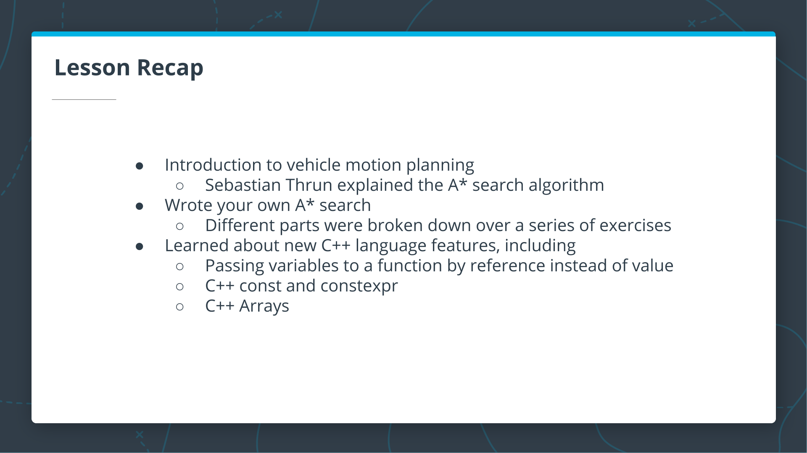

## How to Become More Proficient at C++

A proficient programmer will know the basic of his or her tools,and C++ is one of those.

If you're on C++ you should know your basic libraries,you should know your standard library.You should know the domain-specific library in the domain you're working at.You should know the language at a reasonable good conceptual level.

You should not just go on the web and copy and paste some simple formulas in.That's not programming.
That's not understanding what you are doing.So you actually have to go and read a book and take a course to become a good programmer.
