# Build an OpenStreetMap Route Planner

[toc]


In this project you will extend the IO2D map display code to use A*, so your program will be able to find a path between two points on the map.

## Concept 01: Project Intro

### Lecture

Welcome to the final project.

In this project, you will use everything that you've learned up to now,including writing code in multiple files,pointers, references, and a little bit of OOP. 

You will build a route planner that plots a path between two points on a map.This may sound similar to the project you completed in the first lessons of this course.

This time however, instead of using a simple grid to represent the map,you'll be working with real map data from the OpenStreetMap project to generate a path on a real map.This is similar to other mapping applications you have used,like Google Maps or Apple Maps.To render the map data,the project code we'll be using a 2D rendering library called IO2D.Much of the code for passing OpenStreetMap data and rendering the results comes from the library example and the IO2D code repository.

To get you started on the project,we'll provide you with a slightly modified version of this example code that has all of the classes and methods stubs that you'll need to complete the project.

Your task will be to fill in the methods that are required to make the code perform route planning.The route planner will use the A* algorithm just as you've seen before.So the code structure should seem familiar to you from the first lessons of this course.

However, because of the complexity of the OpenStreetMap data and the IO2D library,the project code will have object-oriented structure.In the rest of this lesson,we'll carefully review the structure of the project code that we provide and we'll clarify what is required to complete the project.

In particular, we'll have an overview of the OpenStreetMap project,including the data format of the OpenStreetMap data and the element types that you'll see on that data.

Then you'll see instructions for building and running the project,and testing your code.

Next, you'll see a project code overview that will include a class diagram,so you can have an understanding of the high-level structure of the code.

Then you look at the project starter repository structure,including all of the files and folders in that project repository.

We'll look at the source directory in that repository in particular.We'll have some code workthroughs so that you understand all of the code that you're starting with.

Next, there'll be some steps that you'll need to follow to complete the project.

Then the last part of this lesson, there'll be project submission instructions and workspace.
This is an extremely exciting project and we can't wait to see your submissions.

### Content

Welcome to the course project! In this project, you will create a route planner that plots a path between two points on a map using real map data from the [OpenStreeMap project](). When you are finished with the project, your output should look like the image below:


A path rendered between two points on a map.


## Concept 02: The OpenStreetMap Project

In the next classroom concepts, you will write a course project in C++ using real map data and A* search to find a path between two points, just as you might see in a desktop or mobile mapping application. The project you will will write will be using data from the [OpenStreetMap project](https://www.openstreetmap.org/).

The OpenStreetMap project is an open source, collaborative endeavor to create free, user-generated maps of every part of the world. These maps are similar to the maps you might use in Google Maps or the Apple Maps app on your phone, but they are completely generated by individuals who volunteer to perform ground surveys of their local environment.

### OpenStreetMap Data

OpenStreetMap data can come in several different formats. The data that is used for this project comes in the form of an OSM XML file (.osm file), and we have provided a sample from the [OpenStreetMap Wiki](https://wiki.openstreetmap.org/wiki/Main_Page) below. Although you may not have worked with this type of data before, have a look at the data below and try to guess which element types from the next quiz are present in the data. We are confident you can figure this out by carefully studying the data!

#### Question

Have a look at the element types in the XML map data below. Which of the following types do you see in the data?

- [ ] node
- [ ] way
- [ ] relation

```xml
<?xml version="1.0" encoding="UTF-8"?>
<osm version="0.6" generator="CGImap 0.0.2">
 <bounds minlat="54.0889580" minlon="12.2487570" maxlat="54.0913900" maxlon="12.2524800"/>
 <node id="298884269" lat="54.0901746" lon="12.2482632" user="SvenHRO" uid="46882" visible="true" version="1" changeset="676636" timestamp="2008-09-21T21:37:45Z"/>
 <node id="261728686" lat="54.0906309" lon="12.2441924" user="PikoWinter" uid="36744" visible="true" version="1" changeset="323878" timestamp="2008-05-03T13:39:23Z"/>
 <node id="1831881213" version="1" changeset="12370172" lat="54.0900666" lon="12.2539381" user="lafkor" uid="75625" visible="true" timestamp="2012-07-20T09:43:19Z">
  <tag k="name" v="Neu Broderstorf"/>
  <tag k="traffic_sign" v="city_limit"/>
 </node>
 ...
 <node id="298884272" lat="54.0901447" lon="12.2516513" user="SvenHRO" uid="46882" visible="true" version="1" changeset="676636" timestamp="2008-09-21T21:37:45Z"/>
 <way id="26659127" user="Masch" uid="55988" visible="true" version="5" changeset="4142606" timestamp="2010-03-16T11:47:08Z">
  <nd ref="292403538"/>
  <nd ref="298884289"/>
  ...
  <nd ref="261728686"/>
  <tag k="highway" v="unclassified"/>
  <tag k="name" v="Pastower Straße"/>
 </way>
 <relation id="56688" user="kmvar" uid="56190" visible="true" version="28" changeset="6947637" timestamp="2011-01-12T14:23:49Z">
  <member type="node" ref="294942404" role=""/>
  ...
  <member type="node" ref="364933006" role=""/>
  <member type="way" ref="4579143" role=""/>
  ...
  <member type="node" ref="249673494" role=""/>
  <tag k="name" v="Küstenbus Linie 123"/>
  <tag k="network" v="VVW"/>
  <tag k="operator" v="Regionalverkehr Küste"/>
  <tag k="ref" v="123"/>
  <tag k="route" v="bus"/>
  <tag k="type" v="route"/>
 </relation>
 ...
</osm>
```

#### Solution

- node
- way
- relation

### Data Types Overview

Excellent work in guessing the types present in the data above! If you look closely at the XML element types in the sample above, you should see the three element types which are important to the code you will be writing: Nodes, Ways, and Relations.

#### Node


A [*node*](https://wiki.openstreetmap.org/wiki/Node) is one of the most basic elements in the OpenStreetMap data model. Each node indicates a single point with an identifier `id`, latitude `lat`, and longitude `lon`. There are other XML attributes in a node element that won't be relevant to this project, such as the `user` id and the `timestamp` when the node was added to the data set. Additionally, a node can have several tags which provide additional information.

#### Way


A [*way*](https://wiki.openstreetmap.org/wiki/Way) is an ordered list of nodes that represents a feature in the map. This feature could be a road, or a boundary of a park, or some other feature in the map. Each way has at least one `tag` which denotes some information about the way, and each way also belongs to at least one relation, which is described below.

#### Relation

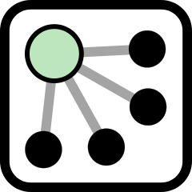

A [*relation*](https://wiki.openstreetmap.org/wiki/Relation) is a data structure which documents a relationship between other data elements. Examples from the [OpenStreetMap wiki](https://wiki.openstreetmap.org/wiki/Relation) include:

> - A route relation which lists the ways that form a major highway, cycle route, or bus route.
> - A multipolygon that describes an area with holes, where the outer and inner boundaries of the area are given by two ways.

#### Example

To help you understand how all these types are used together, consider the following [example from the OpenStreetMap wiki](https://wiki.openstreetmap.org/wiki/Tag:waterway%3Driverbank) of mapping a large river with distinct banks on either side of the river. In the image below, nodes are used to provide the coordinates of points along the banks of the river. Multiple nodes are then connected using ways; there are ways which form closed sections of the river, labeled as "Areas" in the image below. Another way is used to represent the island in the middle of the river. These ways are then grouped together using a relation, which represents the entire river.


**QUIZ QUESTION:**:

Imagine you are going to create a bus route using OpenStreetMap data. Match the OpenStreetMap data type with the part of the bus route it represents.

**ANSWER CHOICES:**

- [ ] Relation
- [ ] Way
- [ ] Node

**Solution**

| Bus Route Part                                           | OSM Data Type |
| -------------------------------------------------------- | ------------- |
| A collection of points that form a road on the bus route | Relation      |
| A single point on the bus route                          | Way           |
| A collection of roads the form the entire route          | Node          |

### Up Next

For your project, you will primarily be working with Nodes, although the code that we provide determines which nodes are neighbors by using the ways and relations those nodes belong to.

Both the code to parse the OSM data and the data structures which are used to store the data in your program have already been written in the [IO2D OpenStreetMap example](https://github.com/cpp-io2d/P0267_RefImpl/tree/master/P0267_RefImpl/Samples/maps). In your project, you won't need to recreate any of this code - you task will be writing code that extends the code in order to plot a path between two points.

Up next, you will learn how to build, run, and test the project code. After that, we'll have an in-depth look at the files in the project starter code so you will be prepared to work on your project.

## Concept 03: Building and Running

To get started with your project, you can download the code from the GitHub repo [here](https://github.com/udacity/CppND-Route-Planning-Project), or you can use the workspace provided below. If you decide to work on this project on your local machine, you will need to install the dependencies outlined in the GitHub [README](https://github.com/udacity/CppND-Route-Planning-Project/blob/master/README.md) for the project.

In this classroom concept, you will see the instructions for building, running, and testing your project. In the next classroom concept, you will see a detailed overview of the project code, so you'll be well prepared to start work on the project.

### Building

This project will use CMake as the build system. Building the project code can be done from the terminal workspace or from the virtual desktop workspace. It is also possible to build this project locally. To do this, you will need to install the project dependencies in your local environment, including the IO2D library, which can be difficult. The complete list of dependencies can be found in the [GitHub README](https://github.com/udacity/CppND-Route-Planning-Project/blob/master/README.md) for the project.

#### Building Using Udacity Workspaces

You can use either of the following ways to build the project using Udacity workspace:

1. Using the terminal workspace.
2. Using the virtual desktop by clicking on the "Desktop" button. If using the virtual desktop, **you will want to use a terminal from within VS Code**, as the correct compiler options have been set up in the VS Code preferences. See the video below for a walkthrough of how to do this.

#### Following Video

```shell
youhuangla@Ubuntu L5_ Build_an_OpenStreetMap_Route_Planner_Project_1_Route_Planning % mkdir build
youhuangla@Ubuntu L5_ Build_an_OpenStreetMap_Route_Planner_Project_1_Route_Planning % cd build/ [0]
youhuangla@Ubuntu build % cmake ../                                                             [0]
CMake Error at CMakeLists.txt:1 (cmake_minimum_required):
  CMake 3.11.3 or higher is required.  You are running version 3.10.2


-- Configuring incomplete, errors occurred!
```

##### Update CMake

[CppND\-Route\-Planning\-Project/README\.md at master · udacity/CppND\-Route\-Planning\-Project](https://github.com/udacity/CppND-Route-Planning-Project/blob/master/README.md)

[Installing \| CMake](https://cmake.org/install/)

[cmake-3.23.2-linux-x86_64.sh](https://github.com/Kitware/CMake/releases/download/v3.23.2/cmake-3.23.2-linux-x86_64.sh)\

```shell
youhuangla@Ubuntu Install_CMake % sudo ./cmake-3.23.2-linux-x86_64.sh                         [126]
[sudo] password for youhuangla: 
sudo: ./cmake-3.23.2-linux-x86_64.sh: command not found
```

[command line \- How do I run \.sh scripts? \- Ask Ubuntu](https://askubuntu.com/questions/38661/how-do-i-run-sh-scripts)

```shell
youhuangla@Ubuntu Install_CMake % chmod -x cmake-3.23.2-linux-x86_64.sh                         [1]
youhuangla@Ubuntu Install_CMake % ./cmake-3.23.2-linux-x86_64.sh                                [0]
zsh: permission denied: ./cmake-3.23.2-linux-x86_64.sh
youhuangla@Ubuntu Install_CMake % sudo ./cmake-3.23.2-linux-x86_64.sh                         [126]
[sudo] password for youhuangla: 
sudo: ./cmake-3.23.2-linux-x86_64.sh: command not found
youhuangla@Ubuntu Install_CMake % sh cmake-3.23.2-linux-x86_64.sh                               [1]
CMake Installer Version: 3.23.2, Copyright (c) Kitware
This is a self-extracting archive.
The archive will be extracted to: /home/youhuangla/Software_Source_Code/Install_CMake

If you want to stop extracting, please press <ctrl-C>.
CMake - Cross Platform Makefile Generator
Copyright 2000-2022 Kitware, Inc. and Contributors
All rights reserved.

Redistribution and use in source and binary forms, with or without
modification, are permitted provided that the following conditions
are met:

* Redistributions of source code must retain the above copyright
  notice, this list of conditions and the following disclaimer.

* Redistributions in binary form must reproduce the above copyright
  notice, this list of conditions and the following disclaimer in the
  documentation and/or other materials provided with the distribution.

* Neither the name of Kitware, Inc. nor the names of Contributors
  may be used to endorse or promote products derived from this
  software without specific prior written permission.

Do you accept the license? [yn]: 
y
By default the CMake will be installed in:
  "/home/youhuangla/Software_Source_Code/Install_CMake/cmake-3.23.2-linux-x86_64"
Do you want to include the subdirectory cmake-3.23.2-linux-x86_64?
Saying no will install in: "/home/youhuangla/Software_Source_Code/Install_CMake" [Yn]: 
y

Using target directory: /home/youhuangla/Software_Source_Code/Install_CMake/cmake-3.23.2-linux-x86_64
Extracting, please wait...

Unpacking finished successfully

```

But still old version:

```shell
youhuangla@Ubuntu Install_CMake % cmake -version                                                [0]
cmake version 3.10.2

CMake suite maintained and supported by Kitware (kitware.com/cmake).
```

[c\+\+ \- Cannot install cmake \- Ask Ubuntu](https://askubuntu.com/questions/1277186/cannot-install-cmake)

```shell
youhuangla@Ubuntu Install_CMake % sudo apt remove --purge cmake    
```

Still not found

[software installation \- How do I install the latest version of cmake from the command line? \- Ask Ubuntu](https://askubuntu.com/questions/355565/how-do-i-install-the-latest-version-of-cmake-from-the-command-line)

> **C-3.** Add the installed binary link to `/usr/local/bin/cmake` by running this:
>
> ```sh
> sudo ln -s /opt/cmake/bin/cmake /usr/local/bin/cmake
> ```

```shell
youhuangla@Ubuntu bin % sudo ln -s ./cmake /usr/local/bin/cmake                                 [0]
youhuangla@Ubuntu bin % cmake -version                                                          [0]
zsh: too many levels of symbolic links: cmake

```

[Solving the “Too many levels of symbolic links” Error \| Baeldung on Linux](https://www.baeldung.com/linux/too-many-levels-of-symlinks#:~:text=The%20Problem%3A%20%E2%80%9CToo%20many%20levels%20of%20symbolic%20links%E2%80%9D%20Error&text=The%20symlink%20was%20created%2C%20but%20it%20is%20actually%20broken.&text=The%20reason%20for%20this%20error,where%20we%20created%20the%20link.)

> The reason for this error is that **symbolic links with relative sources are always relative to the symlink directory, not the directory from where we created the link**.

```shell
youhuangla@Ubuntu bin % sudo ln -s /home/youhuangla/Software_Source_Code/Install_CMake/cmake-3.23.2-linux-x86_64/bin/cmake /usr/local/bin/cmake
ln: failed to create symbolic link '/usr/local/bin/cmake': File exists
youhuangla@Ubuntu bin % ls                                                                      [0]
chardetect  cloud-init      cmake  jsondiff   jsonpointer  n     npm  tldr
cloud-id    cloud-init-p                                                                        [0]
youhuangla@Ubuntu bin % pwd                                                                     [0]
/usr/local/bin
youhuangla@Ubuntu bin % rm cmake                                                                [0]
rm: remove symbolic link 'cmake'? y
rm: cannot remove 'cmake': Permission denied
youhuangla@Ubuntu bin % sudo rm cmake                                                           [1]
youhuangla@Ubuntu bin % ls                                                                      [0]
chardetect  cloud-init      ctags     jsonpatch    jsonschema  node  npx
cloud-id    cloud-init-per  jsondiff  jsonpointer  n           npm   tldr
youhuangla@Ubuntu bin % sudo ln -s /home/youhuangla/Software_Source_Code/Install_CMake/cmake-3.23.2-linux-x86_64/bin/cmake /usr/local/bin/cmake
youhuangla@Ubuntu bin % cmake -version                                                          [0]
cmake version 3.23.2

CMake suite maintained and supported by Kitware (kitware.com/cmake).
youhuangla@Ubuntu bin % cd -                                                                    [0]
~/Software_Source_Code/Install_CMake/cmake-3.23.2-linux-x86_64/bin
youhuangla@Ubuntu bin % cmake -version                                                          [0]
cmake version 3.23.2

CMake suite maintained and supported by Kitware (kitware.com/cmake).
```

##### Continue CMake

```shell
youhuangla@Ubuntu L5_ Build_an_OpenStreetMap_Route_Planner_Project_1_Route_Planning % cd build/ [0]
youhuangla@Ubuntu build % cmake ../                                                             [0]
-- The C compiler identification is GNU 7.5.0
-- The CXX compiler identification is GNU 7.5.0
-- Detecting C compiler ABI info
-- Detecting C compiler ABI info - done
-- Check for working C compiler: /usr/bin/cc - skipped
-- Detecting C compile features
-- Detecting C compile features - done
-- Detecting CXX compiler ABI info
-- Detecting CXX compiler ABI info - done
-- Check for working CXX compiler: /usr/bin/c++ - skipped
-- Detecting CXX compile features
-- Detecting CXX compile features - done
CMake Error at CMakeLists.txt:15 (find_package):
  By not providing "Findio2d.cmake" in CMAKE_MODULE_PATH this project has
  asked CMake to find a package configuration file provided by "io2d", but
  CMake did not find one.

  Could not find a package configuration file provided by "io2d" with any of
  the following names:

    io2dConfig.cmake
    io2d-config.cmake

  Add the installation prefix of "io2d" to CMAKE_PREFIX_PATH or set
  "io2d_DIR" to a directory containing one of the above files.  If "io2d"
  provides a separate development package or SDK, be sure it has been
  installed.


-- Configuring incomplete, errors occurred!
See also "/home/youhuangla/cpp_lab/Cpp_new_code/Part_02_Foundation/L5_ Build_an_OpenStreetMap_Route_Planner_Project_1_Route_Planning/build/CMakeFiles/CMakeOutput.log".
```

[CppND\-Route\-Planning\-Project/README\.md at master · udacity/CppND\-Route\-Planning\-Project](https://github.com/udacity/CppND-Route-Planning-Project/blob/master/README.md)

> - IO2D
>   - Installation instructions for all operating systems can be found [here](https://github.com/cpp-io2d/P0267_RefImpl/blob/master/BUILDING.md)
>   - This library must be built in a place where CMake `find_package` will be able to find it

I start to warry that a cloud server can't show images?

> 1. Install Cairo: `sudo apt install libcairo2-dev`
> 2. Install graphicsmagick: `sudo apt install libgraphicsmagick1-dev`
> 3. Install libpng: `sudo apt install libpng-dev`

> - This library must be built in a place where CMake `find_package` will be able to find it

So how?

##### Install IO2D

[udacity/CppND\-Route\-Planning\-Project](https://github.com/udacity/CppND-Route-Planning-Project)

> - For Ubuntu Linux IO2D installation errors, follow the given steps:
>
>   ```shell
>    sudo apt update
>    sudo apt install build-essential
>    sudo apt install cmake
>    sudo apt install libcairo2-dev
>    sudo apt install libgraphicsmagick1-dev
>    sudo apt install libpng-dev
>                     
>    git clone --recurse-submodules https://github.com/cpp-io2d/P0267_RefImpl
>    cd P0267_RefImpl
>    mkdir Debug
>    cd Debug
>    cmake --config Debug "-DCMAKE_BUILD_TYPE=Debug" ..
>    cmake --build .
>    sudo make install
>   ```


```shell
youhuangla@Ubuntu P0267_RefImpl-master % ls                                                     [0]
 BUILDING.md      CONSUMING.md           LICENSE.md      README.md   appveyor.yml
 CMakeLists.txt  'Design questions.md'   P0267_RefImpl   TODO.md     cmake
youhuangla@Ubuntu P0267_RefImpl-master % mkdir Debug                                            [0]
youhuangla@Ubuntu P0267_RefImpl-master % cd Debug/                                              [0]
youhuangla@Ubuntu Debug %  cmake --config Debug "-DCMAKE_BUILD_TYPE=Debug" ../                  [0]
CMake Warning:
  Ignoring extra path from command line:

   "/home/youhuangla/cpp_lab/Cpp_new_code/Part_02_Foundation/my_L5/P0267_RefImpl-master/Debug/Debug"


CMake Error: Unknown argument --config
CMake Error: Run 'cmake --help' for all supported options.
youhuangla@Ubuntu Debug % pwd                                                                   [1]
/home/youhuangla/cpp_lab/Cpp_new_code/Part_02_Foundation/my_L5/P0267_RefImpl-master/Debug
```

[CMake Error: Unknown argument \-\-config · Issue \#36 · udacity/CppND\-Route\-Planning\-Project](https://github.com/udacity/CppND-Route-Planning-Project/issues/36)

> In the /CppND-Route-Planning-Project/thirdparty/
>
> > git clone --recurse-submodules https://github.com/cpp-io2d/P0267_RefImpl
> > cd P0267_RefImpl
> > mkdir Debug
> > cd Debug
> > cmake ..
> > cmake --build .
> > sudo make install
>
> This worked for me.

[io2d\.h is not copied during install on GNU/Linux · Issue \#80 · cpp\-io2d/P0267\_RefImpl](https://github.com/cpp-io2d/P0267_RefImpl/issues/80)

Well, seems that download from web not work.

> Regarding Catch. Did you make sure to clone the repo with '--recursive'?

Try another way by sh scripts.

[Release P0267R6 · cpp\-io2d/P0267\_RefImpl](https://github.com/cpp-io2d/P0267_RefImpl/releases/tag/P0267R6)

```shell
youhuangla@Ubuntu P0267_RefImpl-P0267R6 % sh run-configure-with-g++-7-and-libstdc++.sh        [127]
Running:
./configure CC="gcc-7" CFLAGS="-g -Og" CXX="g++-7" CXXFLAGS="-g3 -O0 -std=c++1z" CPP="cpp-7" AR="gcc-ar-7" NM="gcc-nm-7" RANLIB="gcc-ranlib-7"

run-configure-with-g++-7-and-libstdc++.sh: 7: run-configure-with-g++-7-and-libstdc++.sh: ./configure: not found
```

[compiling \- Can not run configure command: "No such file or directory" \- Unix & Linux Stack Exchange](https://unix.stackexchange.com/questions/158960/can-not-run-configure-command-no-such-file-or-directory)

```shell
youhuangla@Ubuntu P0267_RefImpl-P0267R6 % autoconf                                              [1]
configure.ac:2: error: possibly undefined macro: AM_INIT_AUTOMAKE
      If this token and others are legitimate, please use m4_pattern_allow.
      See the Autoconf documentation.
......
```

[compiling \- Some M4 macros don't seem to be defined \- Unix & Linux Stack Exchange](https://unix.stackexchange.com/questions/18673/some-m4-macros-dont-seem-to-be-defined)

```shell
youhuangla@Ubuntu P0267_RefImpl-P0267R6 % autoreconf --install                                  [0]

perl: warning: Setting locale failed.
perl: warning: Please check that your locale settings:
......
youhuangla@Ubuntu P0267_RefImpl-P0267R6 % autoconf 
youhuangla@Ubuntu P0267_RefImpl-P0267R6 %        
youhuangla@Ubuntu P0267_RefImpl-P0267R6 % sh run-configure-with-g++-7-and-libstdc++.sh          [0]
Running:
./configure CC="gcc-7" CFLAGS="-g -Og" CXX="g++-7" CXXFLAGS="-g3 -O0 -std=c++1z" CPP="cpp-7" AR="gcc-ar-7" NM="gcc-nm-7" RANLIB="gcc-ranlib-7"
......
./configure: line 421: test: called: integer expression expected
configure: error: libturbojpeg
./configure: line 310: return: called: numeric argument required
./configure: line 320: exit: called: numeric argument required
youhuangla@Ubuntu P0267_RefImpl-P0267R6 % sudo apt install libturbojpeg                         [2]
Reading package lists... Done
Building dependency tree       
Reading state information... Done
......
./configure: line 421: test: called: integer expression expected
configure: error: libturbojpeg
./configure: line 310: return: called: numeric argument required
./configure: line 320: exit: called: numeric argument required
```

[libturbojpeg error after libturbojpeg install · Issue \#11 · Benau/libopenglrecorder](https://github.com/Benau/libopenglrecorder/issues/11)

```shell
youhuangla@Ubuntu P0267_RefImpl-P0267R6 % sudo apt-get install libturbojpeg-dev                 [2]
Reading package lists... Done
Building dependency tree       
Reading state information... Done
youhuangla@Ubuntu P0267_RefImpl-P0267R6 % sh run-configure-with-g++-7-and-libstdc++.sh 
......
config.status: creating Makefile
config.status: creating P0267_RefImpl/Makefile
config.status: creating P0267_RefImpl/P0267_RefImpl/Makefile
config.status: creating P0267_RefImpl/SampleApp/Makefile
config.status: creating config.h
config.status: executing depfiles commands
config.status: executing libtool commands
```

So What next?

`GNU-Linux_build_instructions.txt`

Why is it not a READEME?

```shell
youhuangla@Ubuntu P0267_RefImpl-P0267R6 % ls                                                    [0]
'Design questions.md'               config.log
 GNU-Linux_build_instructions.txt   config.status
 LICENSE.md                         config.sub
 Makefile                           configure
 Makefile.am                        configure.ac
 Makefile.in                        depcomp
 P0267_RefImpl                      install-sh
 README.md                          libtool
 TODO.md                            ltmain.sh
 Ubuntu                             m4
 aclocal.m4                         missing
 ar-lib                             run-configure-with-clang-and-libc++-and-xcb.sh
 autom4te.cache                     run-configure-with-clang-and-libc++.sh
 compile                            run-configure-with-g++-7-and-libstdc++-and-xcb.sh
 config.guess                       run-configure-with-g++-7-and-libstdc++.sh
 config.h                           stamp-h1
 config.h.in
```

After I make, a lot of error......So I give up and just git clone --recurse

As the server cannot connect to github, I download it use git clone in win and upload it.

[CMake Error: Unknown argument \-\-config · Issue \#36 · udacity/CppND\-Route\-Planning\-Project](https://github.com/udacity/CppND-Route-Planning-Project/issues/36)

> In the /CppND-Route-Planning-Project/thirdparty/
>
> > git clone --recurse-submodules https://github.com/cpp-io2d/P0267_RefImpl
> > cd P0267_RefImpl
> > mkdir Debug
> > cd Debug
> > cmake ..
> > cmake --build .
> > sudo make install
>
> This worked for me.

The server is broken.......why?

After reboot, successfully cmake and make install.

##### Back to CMake

```shell
youhuangla@Ubuntu L5_ Build_an_OpenStreetMap_Route_Planner_Project_1_Route_Planning % cd build/ [0]
youhuangla@Ubuntu build % cmake ../                                                             [0]
-- Found PkgConfig: /usr/bin/pkg-config (found version "0.29.1") 
youhuangla@Ubuntu build % make                                                                  [0]
[  4%] Building CXX object thirdparty/pugixml/CMakeFiles/pugixml.dir/src/pugixml.cpp.o
[  9%] Linking CXX static library ../../../lib/libpugixml.a
[  9%] Built target pugixml
......
[ 90%] Built target gmock
[ 95%] Building CXX object thirdparty/googletest/googlemock/CMakeFiles/gmock_main.dir/src/gmock_main.cc.o
[100%] Linking CXX static library ../../../lib/libgmock_main.a
```

if 

```shell
youhuangla@Ubuntu build % cmake -DCMAKE_CXX_FLAGS="-isystem /usr/local/include" ../          [0]
CMake Error: The current CMakeCache.txt directory /home/youhuangla/cpp_lab/L5_ Build_an_OpenStreetMap_Route_Planner_Project_1_Route_Planning/build/CMakeCache.txt is different than the directory /home/youhuangla/cpp_lab/Cpp_new_code/Part_02_Foundation/L5_ Build_an_OpenStreetMap_Route_Planner_Project_1_Route_Planning/build where CMakeCache.txt was created. This may result in binaries being created in the wrong place. If you are not sure, reedit the CMakeCache.txt
CMake Error: The source "/home/youhuangla/cpp_lab/L5_ Build_an_OpenStreetMap_Route_Planner_Project_1_Route_Planning/CMakeLists.txt" does not match the source "/home/youhuangla/cpp_lab/Cpp_new_code/Part_02_Foundation/L5_ Build_an_OpenStreetMap_Route_Planner_Project_1_Route_Planning/CMakeLists.txt" used to generate cache.  Re-run cmake with a different source directory.
```

[cmake \- Editing versus deleting CMakeCache\.txt after moving directory \- Stack Overflow](https://stackoverflow.com/questions/14458805/editing-versus-deleting-cmakecache-txt-after-moving-directory)

delete CMakeCache\.txt

and cmake ../ again

### Running

Running the project must be done from the workspace desktop in order for you to be able to see the mapped output. In the terminal, navigate to the build folder. From the `build` directory, you can run the compiled executable with map data using the following command:

```
youhuangla@Ubuntu build % ./OSM_A_star_search                                 [130]
To specify a map file use the following format:
Usage: [executable] [-f filename.osm]
Reading OpenStreetMap data from the following file: ../map.osm
Distance: 0 meters.
```

Or to specify a map file:

```
./OSM_A_star_search -f ../<your_osm_file.osm>
```

When you run the project for the first time, you should see a blank map like the one below:


### Effect

If you're using a linux server, you can execute it by MobaXterm_Personal_21.5.

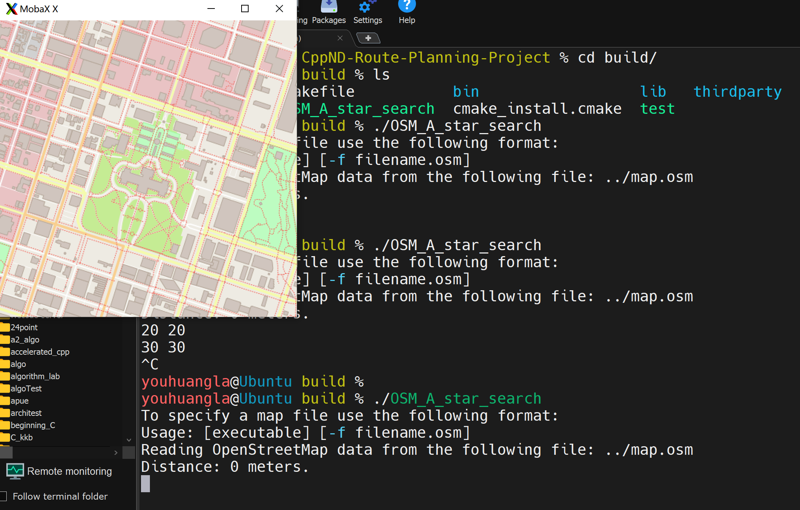

When completed, it will be like this:

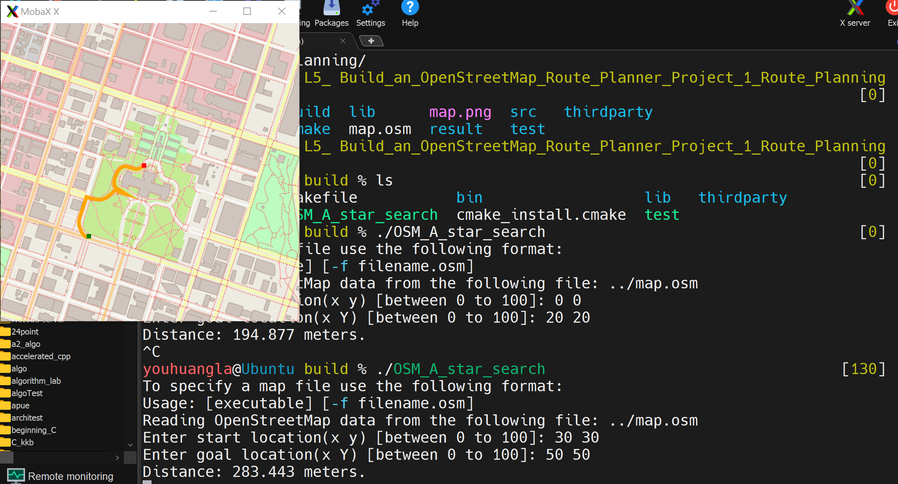

### Task List:

- [x] I have run the project using the workspace above, or I have downloaded the GitHub repo, installed the dependencies, and run the project locally

#### Task Feedback:

Great work! You can now try running the tests for the project in the next concept.

## Concept 04: Testing

```shell
youhuangla@Ubuntu build % ls                                                  [130]
CMakeCache.txt  Makefile           bin                  lib   thirdparty
CMakeFiles      OSM_A_star_search  cmake_install.cmake  test
youhuangla@Ubuntu build % ./test                                                [0]
Running main() from /home/youhuangla/cpp_lab/Cpp_new_code/Part_02_Foundation/my_L5/CppND-Route-Planning-Project/thirdparty/googletest/googletest/src/gtest_main.cc
[==========] Running 4 tests from 1 test case.
[----------] Global test environment set-up.
[----------] 4 tests from RoutePlannerTest
[ RUN      ] RoutePlannerTest.TestCalculateHValue
/home/youhuangla/cpp_lab/Cpp_new_code/Part_02_Foundation/my_L5/CppND-Route-Planning-Project/test/utest_rp_a_star_search.cpp:66: Failure
Expected equality of these values:
  route_planner.CalculateHValue(start_node)
    Which is: 0.031656995
  1.1329799
/home/youhuangla/cpp_lab/Cpp_new_code/Part_02_Foundation/my_L5/CppND-Route-Planning-Project/test/utest_rp_a_star_search.cpp:67: Failure
Expected equality of these values:
  route_planner.CalculateHValue(end_node)
    Which is: 4.6308042e+27
  0.0f
    Which is: 0
/home/youhuangla/cpp_lab/Cpp_new_code/Part_02_Foundation/my_L5/CppND-Route-Planning-Project/test/utest_rp_a_star_search.cpp:68: Failure
Expected equality of these values:
  route_planner.CalculateHValue(mid_node)
    Which is: 4.6308042e+27
  0.58903033
[  FAILED  ] RoutePlannerTest.TestCalculateHValue (116 ms)
[ RUN      ] RoutePlannerTest.TestAddNeighbors
/home/youhuangla/cpp_lab/Cpp_new_code/Part_02_Foundation/my_L5/CppND-Route-Planning-Project/test/utest_rp_a_star_search.cpp:84: Failure
Expected equality of these values:
  neighbors.size()
    Which is: 0
  4
[  FAILED  ] RoutePlannerTest.TestAddNeighbors (106 ms)
[ RUN      ] RoutePlannerTest.TestConstructFinalPath
/home/youhuangla/cpp_lab/Cpp_new_code/Part_02_Foundation/my_L5/CppND-Route-Planning-Project/test/utest_rp_a_star_search.cpp:104: Failure
Expected equality of these values:
  path.size()
    Which is: 0
  3
[1]    17419 segmentation fault  ./test

```

When you have completed the project, the tests should look like the following:


### Task List:

- [x] After building the project, I have run the project tests using the workspace above or on my local machine.

#### Task Feedback:

Great work! in the next concept, we'll start look at the structure of the project code.

## Concept 05: Project Code Overview

Now that you are able to build, run, and test the project starter code, you are ready to have a closer look at the code and its structure.

We've modified the IO2D example code slightly to help you get started with the project. In particular, we included some classes that will help you extend the existing code, and we added a few short plotting functions.

### Lecture

Now that you are able to build,run and test the project starter code,let's have a closer look at the <u>structure of the code</u> and <u>classes</u> you'll be working with.

Much of the project starter code came from an OpenStreetMap demonstration of the lO2D graphics rendering library.C++ doesn't currently have 2D graphics rendering functionality as part of the standard library,and <u>IO2D</u> has been proposed as an addition to the standard library.

This project extends the IO2D OpenStreetMap demo to render a path between two points.Much like the code you were previously for ASCII A star,the main function starts out by reading the map data into the program.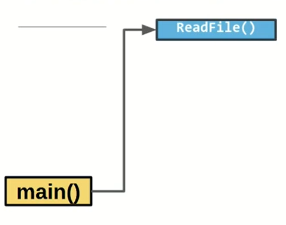After reading the data into the program,main creates a route model object with the data.The route model class is a data structure that holds all of the OpenStreetMap data in a convenient format and provide some methods for using the data.The route model class has a subclass called node which is used frequently.

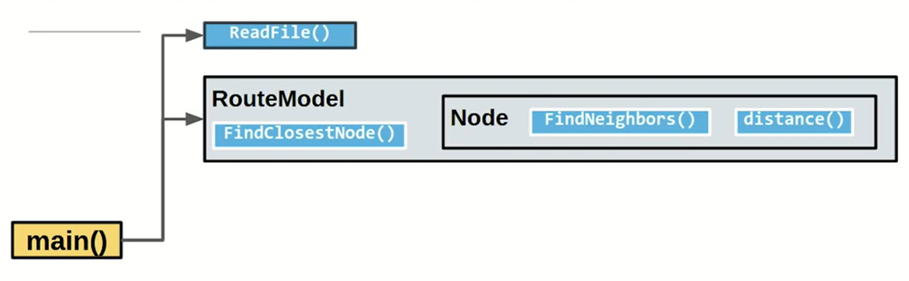

A <u>node</u> represents a single point in the map data.Note that route model provides the method find closest node.When you provide a starting point or ending point to the program, the <u>find closest node method</u> will find the closest node in the store data to the coordinates that you provide.

The node class provides <u>two methods, FindNeighbors and distance</u>.The FindNeighbors method can be used when you want to <u>find the neighbors of the current node to add to the open list</u>, and the distance method provides the <u>distance between two nodes</u>.This can be used when you want to compute <u>the cost to travel to the next node</u>, or when you want to compute <u>the heuristic function</u> as the distance between the current node and the goal.

After main has created a route model,it will create a <u>route planner object</u>.The route planner class provides all of the methods needed to conduct the AStarSearch and **this is the class where you will be writing almost all of your code.**

In particular, the route planner class contains an <u>AStarSearch method</u> which is called by main.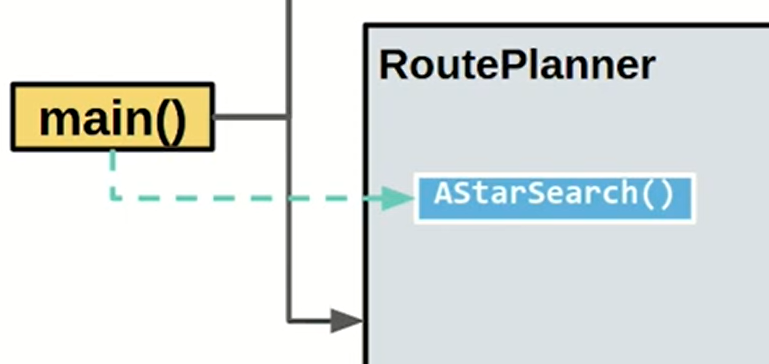
Just as you saw in your ASCII A star project,the AStarSearch method starts the wild loop that continues as long as the list of open nodes is non-empty.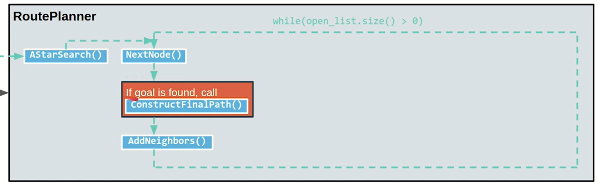

Inside the wild loop,<u>the next node method</u> is called.This method <u>sorts the open list and provides the next node to explore</u>.In the wild loop, the code will then check if the next note is the goal.If the goal has been found,the <u>construct a final path method</u> is called.This method creates a vector of nodes in the path from the beginning node to the end node and this vector can be used to render the final path.If the goal has not been found,the AddNeighbors method will be called.Just as with ASCII A star,this method has several steps.So let's examine them in more detail.

<u>AddNeighbors</u> will start by calling FindNeighbors on the current node.Each node object is created with an empty vector of neighbor nodes,and <u>FindNeighbors</u> will populate the neighbors vector of the current node with all of the valid neighbors.

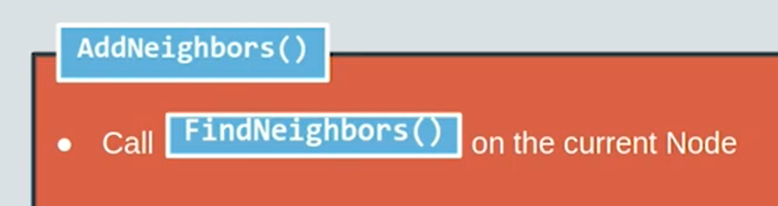

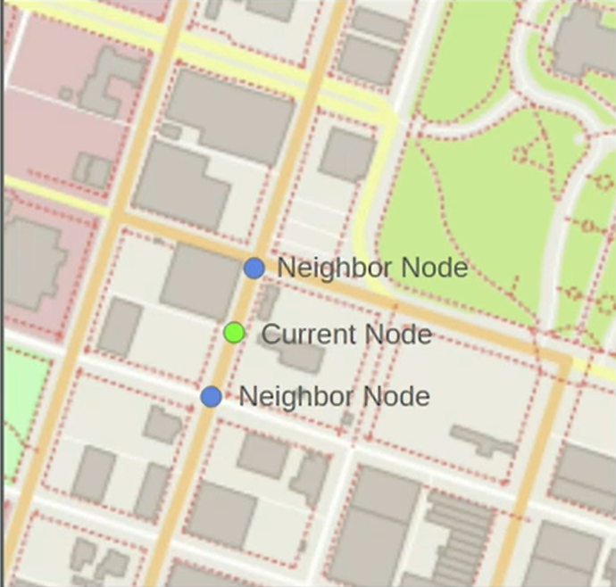

For each neighbor of the current node,the parent of that neighbor is set to the current node.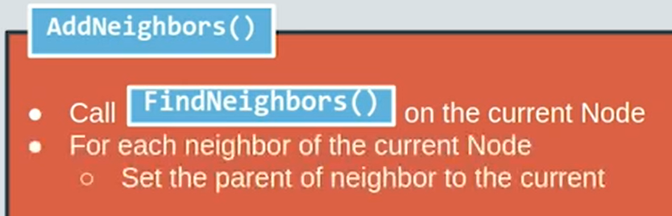So in the diagram over here,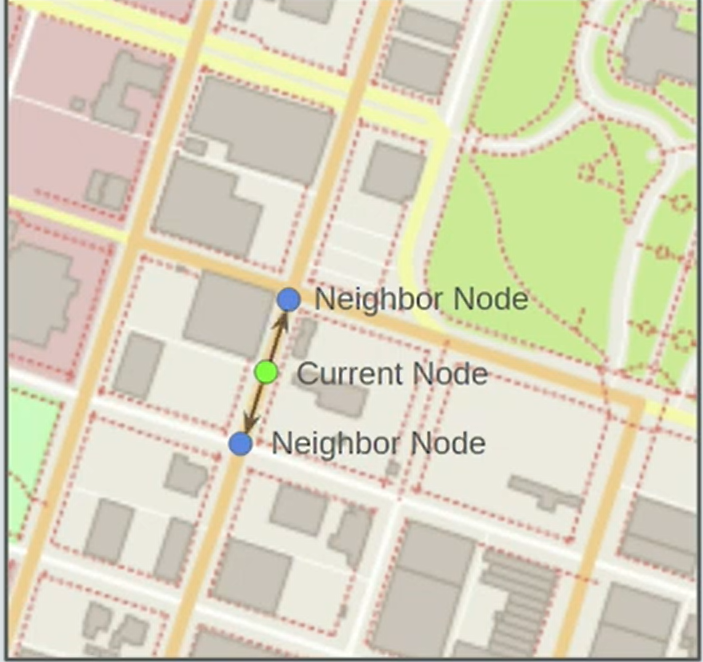we can see that the current node is green,the neighbor node is blue,and the parents of this blue node is the green node.

Keeping track of the parent of each node,allows the path to be reconstructed once we reach the end.That is, if we get to the ending node in our search,we can just step through the parent of each node to find the sequence of nodes from the beginning to the end.

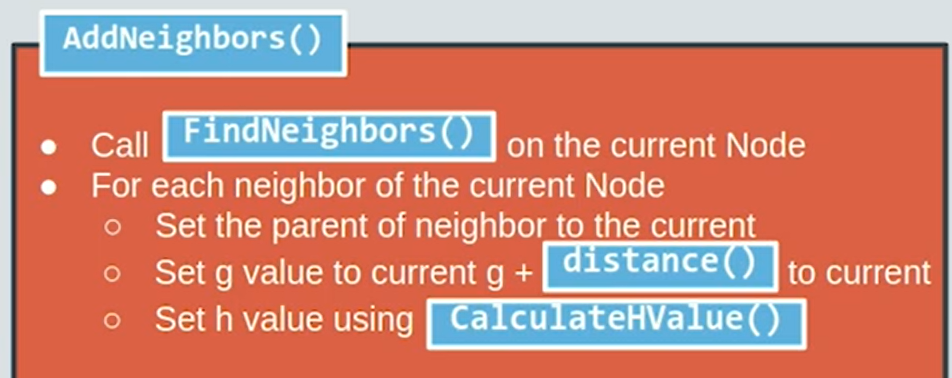

After setting the parent,the g value of the neighbor is set to the current g value plus the distance from the current node to the neighbor.Nodes have different distances between them and we want to record a greater cost to travel longer distances between nodes.This helps to choose the shortest next step when presented with several options.

At this point in the program,the h value of the neighboring node is also set using the <u>CalculateHValue method</u>.

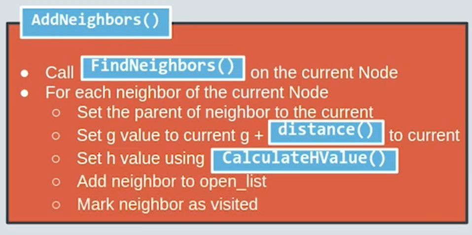

Finally, the neighbor is added to the open list and then the neighbor is also marked as visited.


Back in our original diagram,we can add all of these steps to complete the AStarSearch function in the route planner class.

Once AStarSearch completes execution,main will create a <u>render object</u> and render the map with the results from AStarSearch.

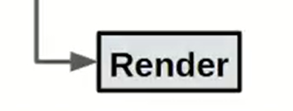

This completes the high level picture of how the code will work in this project.

Next, we'll dive into the source files to examine the code in more detail.

Some of the structure here should seem familiar from the ASCII A star code.But in this project, you'll have the additional challenge of the code being structured using **object oriented techniques**. Good luck.

## Concept 06: Project Starter Repository

In the next video, we'll discuss some of the files and directories you'll find in the top level of the Route Planning starter repo.

### Lecture

If you've downloaded the route planning project for repo or if you are reading through the code on GitHub or in the virtual desktop,you should see the following files on folders at the top level of the repo.

At the top of the repo is a CMake folder.This contains a couple of files that help CMake find the required libraries.These files are provided by those libraries to be included in any CMake project.So you don't really need to worry about them.

Next, you should see the source directory which is where you'll be doing most of your work.This is the contents of the source directory and we'll be exploring each of these files or most of these files in detail later on.

You should see two other directories after CMake and Source,which are the test and third-party directories.The test directory contains a file,utest rp a star search.

This stands for unit test route planner a star search.If you click on that file,you will see all of the unit tests for the project.These tests are implemented with Google Test, which is the testing framework provided by Google.

There are tests here for many of the functions that you will be implementing.
The route planner test class which is right here is on line 42, is what is called a test fixture.

It sets up a data configuration that will be used across multiple tests.As you can see in this fixture, it reads the map data into the program.I'm using read OSM data, and creates a route model, then creates a route planner with the starting co-ordinates 10, 10, 90, 90.This read OSM data is defined above and read OSM data calls readFile, which is defined above that.

There are a few other variables that are set up for testing including a start node,
end node, and a mid node in the path.

Functions marked with test f are the actual tests.These tests all use the route planner test fixture which is defined above, and that's indicated by this first argument.The second argument is the name of the test.The test name tells you which function is being tested, so you can refer back to these tests as you are developing your project.The code written in these tests can also be helpful to see how the different objects and methods in the code work.

So be sure to look over the tests carefully and refer back to them from time to time as you are writing your code.

For example, we can see that a start node has a neighbor's vector and it's accessed using this arrow pointer.Here, we see that the vector is stored as neighbors and then, the size of neighbors is checked to be equal to four.
If that's what expect EQ does here.If the size of the neighbors is not equal to four, this test fails.

You can see here other functions or methods are tested down here.So you can see for example, that a node has a parent and that parent is set to a start node and end node has a parent, that's set to mid node and then, some tests are performed.

Going back to the top level directory, you'll see a third-party directory here.
This directory contains two git submodules, <u>googletests and pugixml</u>.Pugixml is a library for parsing XML that is used to read OpenStreetMap data into your program.

These numbers here to the right of the sub-module name are the commits where these submodules are being pulled from.So we're pulling the googletest code at commit given by this <u>hash</u>.

When you clone this repo using the recurrence submodules flag, the code for a Google test and pugixml will be pulled into your cloned repo so that you can use them in your program.

Back at the top level of this directory, there are few other files that you'll need to know about.

There's the CMakeLists.txt and this is used for building this entire project,and then, a map osm file, which is the OpenStreetMap data for the project.

Let's have a look at CMakeLists.txt.

This CMakeLists is a little bit bigger than CMake lists that you've seen previously so let's go over it line by line.The first line here, CMake minimum required sets the minimum required version of CMake to 3.11.3.Which means you'll need at least that version to compile and run the project.

The next line sets the CMake standard to 17.So we'll be using C++ 17 to build this project.This line sets the CMake module path to the current CMake module path plus the source directory which is where the CMakeLists.txt lives, slash CMake.So if you recall, the current directory slash CMake is where those two files were.We can go back really quick in here, and that helps CMakeLists.txt find these two libraries.

On line nine, we named the project as OSM a star search.So CMakeLists.txt requires you to name each project in the top-level directory.So we just named the project OSM A star search.

Then, we set the library output path to be the source directory slash lib.
So as libraries are built when this code is compiled, they'll all get put in this slash lib folder.

The next lines find required project prerequisites.So you need io2d to run this project.You need Cairo, you need GraphicsMagick, and find package finds each of these packages in your system.Find package uses the CMake module path to find those packages.

As we saw before, we set CMake module path to include the CMake source directory, CMake, which provides those two CMake files for finding Cairo and GraphicsMagick.

In lines 20 and 21, we set io2d to be compiled without samples and without tests to speed up the build process a little bit.

Then, our project contains those third party pugixml and googletests libraries.
So we add those as subdirectories so that CMakeLists.txt is able to find them.
Then finally, we create the executable OSM A star search.So this executable is created with all of these files that follow it.So we're going to use source main.cpp, source model.cpp, source render.cpp, source route model.cpp, and source route planner.cpp to create this executable.

For this executable, we will also link the library's io2d and pugixml.So this is the name of the executable and down here, in the target link libraries,we say that we want to use this target and link the library's io2d and pugixml.

Normally, this would be the end of a CMakeLists.txt file except that we also want to build an executable that allows us to run the unit tests.

So we do this again, test, except this time we're going to have to include the unit test rp a A star search.cpp and the necessary files from our source directory.You'll note that in this executable, we don't include render or main since we don't need those.

We won't need main to accept user input and for the unit tests, we're not doing any rendering.

For this test executable, we've linked the library's gtest main, which is from google Test and pugixml.

Then, these last lines set some options for Linux or Microsoft Visual C++.
If you're using Linux, we target the link libraries for OSM A star search to use pthread and target some compile options for Microsoft Visual C++ down here at the end.

That is an overview of all of the files that you'll need to know about in the top-level directory and next,we'll go over all of the files that you'll need to know about in Source.

### Content

The starter code for the project can be found [here](https://github.com/udacity/CppND-Route-Planning-Project). This code is already loaded into a workspace, and you are not required to download or run the code locally to do the project. However, it may be a good idea to open the repository in a different tab or download the code so you can follow along as you watch the video above or read through the descriptions below. In the repo, you should see the following four directories:

- **`cmake` **

  This directory contains some `.cmake` files that are needed for the project to find necessary libraries. You will not need to work with this directory for this project.

- **`src`**

  The source code for the project is contained here, and this is where you will be doing all of the project work. See the next classroom concepts more information about the contents of this directory.

- **`test`**

  This directory contains unit tests for various exercises, implemented using the Google Test framework. As you are developing your code, *it may be helpful to look at the relevant tests in this directory to see the expected results and corresponding code*. The code written here can be used to understand how different classes and objects in your work. If your code fails a test, the console message will indicate which is the failing test.

- **`thirdparty`**

  This directory contains third party libraries that have been included with this project. You will not need to work directly with this code.

## Concept 07: The src Directory

The `src` directory contains the following files:

- `main.cpp`
- `model.h` and `model.cpp`
- `render.h`and `render.cpp`
- `route_model.h` and `route_model.cpp`
- `route_planner.h` and `route_planner.cpp`

You will be writing all of your code in `main.cpp`and `route_planner.cpp`, so we will cover those files first.

### main.cpp

#### Video

Main.cpp begins with a function ReadFile,which accepts a string which is the path to the file that we'll be using for this program.ReadFile begins by creating an input file stream using ifstream here and this input file stream is called `is` and the `is` is initialized using the path.

Then also, two options here,standard ios binary and standard ios ate.Binary means that we'll be reading the data and as binary data and not converting to any other data type like string.An ate stands for at the end, which means that it will immediately seek to the end of the InputStream.

The reason for doing that is that then we can use input string `tellg` to determine the size of the input stream,and we can create a vector called Contents initialized to that size.

So this is a vector of bytes.Then we can seek back to the beginning of the input stream on line 22.Then on line 23, read all of the input stream into the contents vector.When we're done, we will return the contents vector using the standard move of `contents`.Move is not something that we've covered in this course.
It will be covered later on the another degree.Basically, move allows you to transfer the contents of this vector to another variable without using pointers or references.

Down below in main, we have some code here to parse command-line arguments.So you'll see that there's a possible command line argument of dash f,which allows you to specify the osm datafile that you want to use.If you don't specify an osm datafile,then osm datafile will be set to map.osm,which is the data file we provide.

Then on line 44, there's a vector of bytes called osm data,and lines 46 through 52 use the ReadFile function to read the contents of this osm datafile into the vector osmdata.

Then on line 60, we create a route model object using the osm data.
This route model object is called model.Then we create a route_planner object using that model and the coordinates 10, 10, 90, 90.10, 10 are the x and y coordinates of the starting and 90,90 are the x and y coordinates at the ending point.

After we've created this routeplanner object, main calls routeplanner.AStarSearch, which performs the AStarSearch on the route planner and records the results in the route planner object.

Afterwards, on line 69,there's a random object created using the model.

Then from 71-79 is some IO2D code to display the results.

Here in main is your first to do, which is to accept user input for the start_x,
start_y, end_x, and end_y coordinates.You'll use this user input to replace these coordinates here.

#### Content

The `main.cpp` controls the flow of the program, accomplishing four primary tasks:

- The OSM data is read into the program.
- A `RouteModel` object is created to store the OSM data in usable data structures.
- A `RoutePlanner` object is created using the `RouteModel`. This planner will eventually carry out the A* search on the model data and store the search results in the `RouteModel`.
- The `RouteModel` data is rendered using the IO2D library.

Your first task is to complete **TODO** in `main.cpp`.

```cpp
    // TODO 1: Declare floats `start_x`, `start_y`, `end_x`, and `end_y` and get
    // user input for these values using std::cin. Pass the user input to the
    // RoutePlanner object below in place of 10, 10, 90, 90.
float start_x, start_y, end_x, end_y;
    std::cin >> start_x >> start_y >> end_x >> end_y;

    // Build Model.
    RouteModel model{osm_data};

    // Create RoutePlanner object and perform A* search.
    RoutePlanner route_planner{model, start_x, start_y, end_x, end_y};
```

#### Bug

clangd 

```shell
io2d.h clang(pp_file_not_found)
```

[c\+\+ \- Is there "includePath" option in clangd? \- Stack Overflow](https://stackoverflow.com/questions/61206703/is-there-includepath-option-in-clangd)

In build diretory, 

```shell
youhuangla@Ubuntu src % cmake -DCMAKE_CXX_FLAGS="-isystem /usr/local/include" ../ 
```

> clangd emulates how clang would interpret a file. By default, it behaves roughly as `clang $FILENAME`, but real projects usually require setting the include path (with the `-I` flag), defining preprocessor symbols, configuring warnings etc.
>
> Often, a compilation database specifies these compile commands. clangd searches for `compile_commands.json` in parents of the source file.
>
> This section modifies how the compile command is constructed.
>
> [Configuration](https://clangd.llvm.org/config)

```shell
youhuangla@Ubuntu build % cmake -DCMAKE_EXPORT_COMPILE_COMMANDS=1 ../  
```

[clangd \- Visual Studio Marketplace](https://marketplace.visualstudio.com/items?itemName=llvm-vs-code-extensions.vscode-clangd)

Reload the VsCode.

What if delete the `compile_commands.json` in parent of the source file? 

The `.clangd` will not generate automatically.

Remember that the `compile_commands.json` should be copy to the parent of src, so that .clangd will be generate.

### route_planner.h and route_planner.cpp

These files define the `RoutePlanner` class and methods for the A* search . Your task is to implement the A* search by completing all of the **TODOs** in `route_planner.cpp`.

## Concept 08: The src Directory Additional Files

### model.h

The `model.h` and `model.cpp` files come from the IO2D example code. We provide an overview of only the `model.h` file, as the method implementations in `model.cpp` file are beyond the scope of the course.

These files are used to define the data structures and methods that read in and store OSM data. OSM data is stored in a `Model` class which contains nested structs for Nodes, Ways, Roads, and other OSM objects. Have a look at the video above for an overview of the code in the header file.

### route_model.h and route_model.cpp

These files contain classes which are used to extend the `Model` and `Node` data structures from `model.h` and `model.cpp` using class inheritance. Remember that inheritance in this case will allow you to use all of the *public* methods and attributes of the `Model` class and `Node` struct in the derived `RouteModel` and `RouteModel::Node` classes.

The reason for extending the existing `Model` class and `Node` struct is to include additional methods and variables which are useful for A* search. In particular, the new `RouteModel::Node` class now allows nodes to store the following:

- the h-value,
- the g-value,
- a "visited" flag,
- a vector of pointers to neighboring nodes.

In addition, there are now methods for

- finding neighboring Node objects of a Node,
- getting the distance to other nodes,
- finding the closest node to a given (x, y) coordinate pair.

### render.h

The `render.h` and `render.cpp` files come from the IO2D example code. These take map data that is stored in a `Model` object and render that data as a map. We have modified these files slightly to include three extra methods which render the start point, end point, and path from the A* search. You won't need to work with these files directly, but you can watch the video above for a brief overview of the header file code.

## Concept 09: Steps to Complete the Project

### Completing the Project

To complete this project you will need to:

1. Complete the **TODO** in `main.cpp`
2. Complete the **TODO**s in `route_planner.cpp`
3. Check that all tests are passed when you run the `test` executable in your `build` directory.
4. Check that you have satisfied all of the criteria in the [project rubric](https://review.udacity.com/#!/rubrics/2494/view). If you feel like all the criteria from the rubric are met, you are ready to submit!

### Submitting the Project

You can submit your project using the "SUBMIT PROJECT" button in the terminal in the next classroom concept.

This project can only be submitted through the workspace in the next concept. This is done to ensure that you are able to test your code in an environment similar to what reviewers will use.

If you have developed your project locally, you can upload the project directory to the workspace for submission. Similarly, if you have your code in Github, you can clone your project into the workspace for submission.

## Concept 10: Project Submission and Workspace

Check your project carefully against the rubric [here](https://review.udacity.com/#!/rubrics/2494/view). When you feel like your project meets all of the criteria listed there, you are ready to submit!

You can submit your project directly from the workspace in the previous concept, or if you have developed your code locally, you can submit using a .zip file or Github repo.

## Project Description

### Project Submission Checklist

**Before submitting your project, please review and confirm the following items.**

- [ ]  I am confident all rubric items have been met and my project will pass as submitted. (If not, I will discuss with my mentor prior to submitting.)
- [ ]  Project builds correctly without errors and runs.
- [ ]  All required functionality exists and my project behaves as expected per the project's specifications.

**Once you have checked all these items, you are ready to submit!**

## Project Rubric

## Compiling and Testing

| Criteria                                              | Meet Specification                                           |
| ----------------------------------------------------- | ------------------------------------------------------------ |
| The submission must compile.                          | The project code must compile without errors using `cmake` and `make`. |
| The submission must pass the final set of unit tests. | Code must pass tests that are built with the `./test` executable from the `build` directory of the project. See the project submission instructions for more details on how to run the tests. |

## User Input

| Criteria                                                 | Meet Specification                                           |
| -------------------------------------------------------- | ------------------------------------------------------------ |
| The user should be able to provide inputs to the search. | A user running the project should be able to input values between 0 and 100 for the start x, start y, end x, and end y coordinates of the search, and the project should find a path between the points. |
| The user inputs should correspond with areas on the map. | The coordinate (0, 0) should roughly correspond with the lower left corner of the map, and (100, 100) with the upper right.Note that for some inputs, the nodes might be slightly off the edges of the map, and this is fine. |

## Code Efficiency

| Criteria                                                     | Meet Specification                                           |
| ------------------------------------------------------------ | ------------------------------------------------------------ |
| The methods in the code should avoid unnecessary calculations. | Your code does not need to sacrifice comprehension, stability, or robustness for speed. However, you should maintain good and efficient coding practices when writing your functions.Here are some things to avoid. This is not a complete list, but there are a few examples of inefficiencies.Running the exact same calculation repeatedly when you can run it once, store the value and then reuse the value later.Loops that run too many times.Creating unnecessarily complex data structures when simpler structures work equivalently.Unnecessary control flow checks. |
