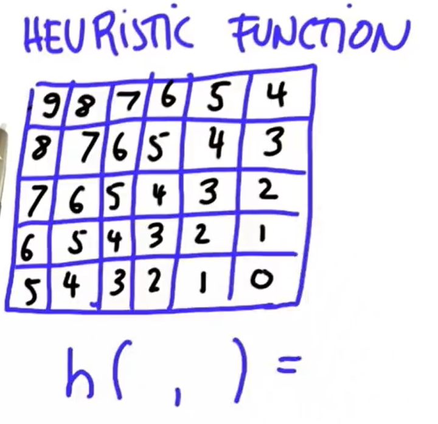

# Understanding A star Search

## 渐进数gradual

 渐近地记录从开始的点到当前点的代价，记作 $g(x, y)$ 。

## 启发值heuristic

乐观的启发我们到目标的代价。

如下图，在一个没有障碍的地图中，以左上角格子为起点，以右下角格子为目标，格子中的数字就是乐观估计的步数，即启发式函数的值。将点 (x, y) 启发式函数记作 $h(x, y)$ ，所有 $h(x, y) \le 从点(x, y)到目标的任意路线的距离$ 。



在一个有障碍的地图中，我们并不需要改变启发值，因为最后寻路靠的是 $f + g$ 的值。


## 算法

### 思路

```clike
有各种状态地图、起点坐标、终点坐标，搜索地图 {
    创建一个“打开”表，将起点加入;
    起点的渐近值为 0 ;
    用(启发式函数)计算起点的启发值;
    while (表中还有点) {
        将表中的点按渐近值从大到小排序;
        将表中渐近值最小的点弹出表;
        关闭该点;
        if (该点为终点) {
            找到路线，结束;
        } else {
            扩张该点的所有邻居到“打开”表中;
            for (遍历方向) {
                if (邻居在地图上且不为“关闭”状态) {
                    当前点的渐近值 = 上一个点的渐近值 + 1;
                    用(启发式函数)计算当前点的启发值;
                    用(入表函数)将当前的点加入“打开”的表;
                }
            }
        }
    }
    如果上述步骤没找到则没有路线;
}				
```


## 伪代码

### 搜索

```c
传入一个有各种状态地图、起点坐标、终点坐标，搜索地图 {
    创建一个“打开”表，将起点加入;
    起点的渐近值为 0 ;
    用(启发式函数)计算起点的启发值;
    while (表中还有点) {
        将表中的点按渐近值从大到小排序;
        将表中渐近值最小的点弹出表;
        将地图上该点的状态标记为“经过”;
        if (该点为终点) {
            将起点状态标记为“开始”;
            将终点状态标记为“结束”;
            返回地图;
        } else {
            用(扩张函数)扩张该点的所有邻居到“打开”表中;
        }
    }
    如果经过以上步骤还找不到，打印“失败”，返回一个空的地图。
}
```

### 扩张函数

```clike
扩张该点的所有邻居到“打开”表中 {
    for (遍历四个方向) {
        if (邻居在地图上且不为“关闭”状态) {
            当前点的渐近值 = 上一个点的渐近值 + 1;
            用(启发式函数)计算当前点的启发值;
            用(入表函数)将当前的点加入“打开”的表;
        }
    }
}
```

### 启发式函数

```
启发式函数 {
	返回该点到终点的启发值;
}
```

### 入表函数

```clike
将点加入“打开”的表 {
    将点加入“打开”的表;
    将地图上该的状态改为“关闭”;
}
```

