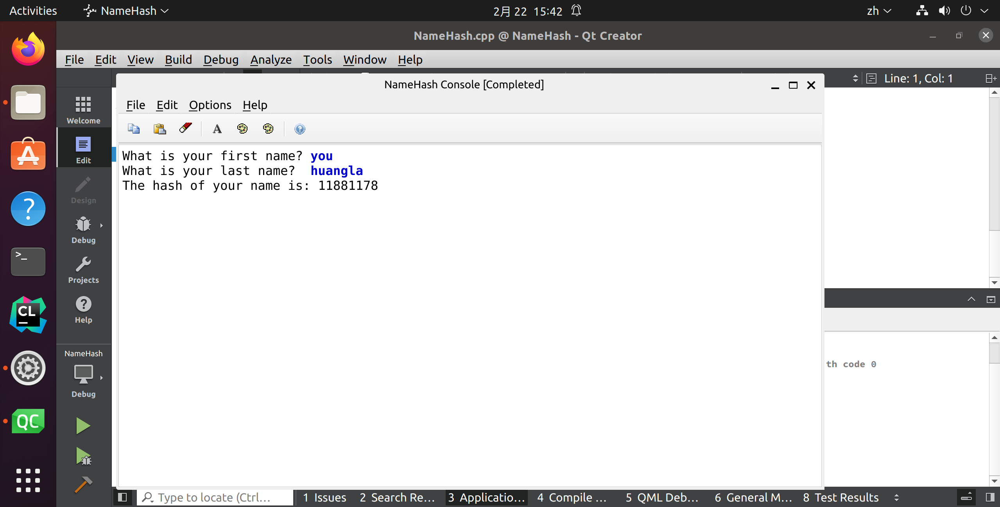
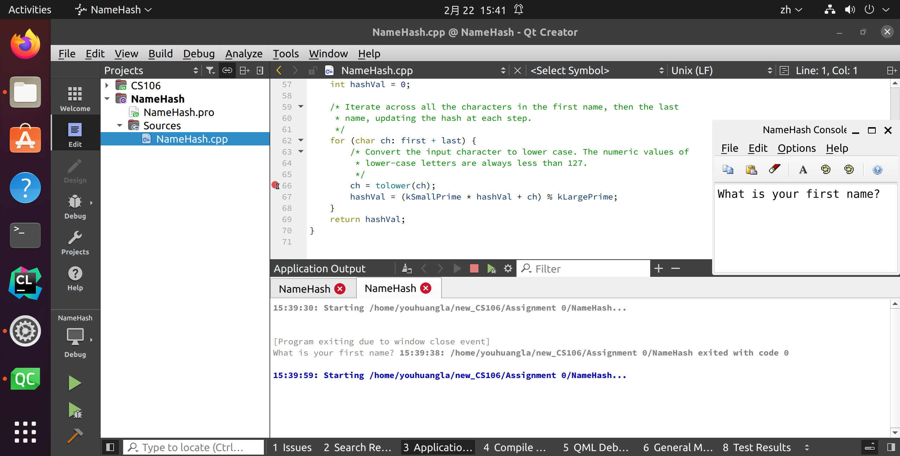
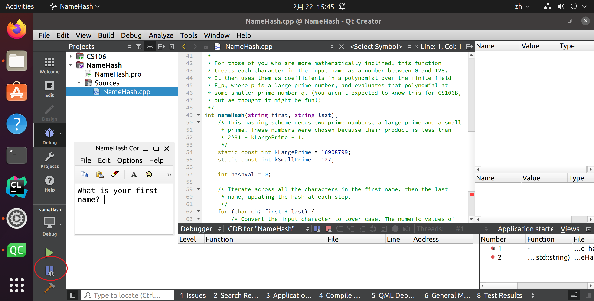
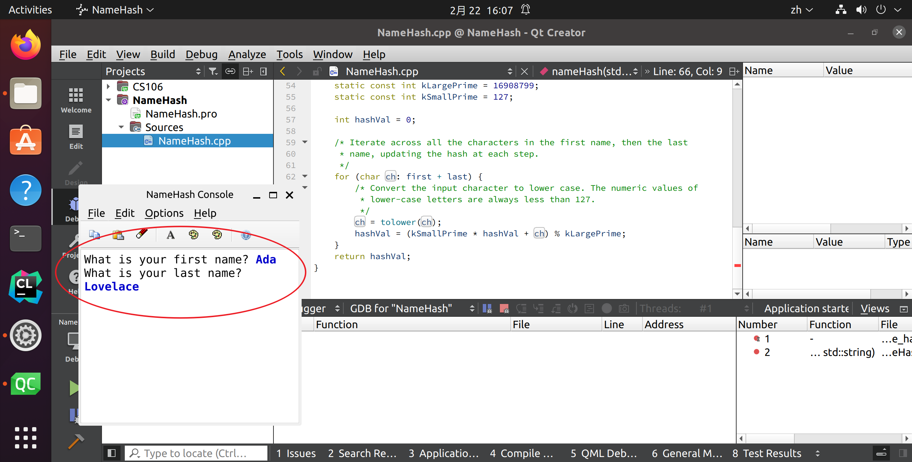
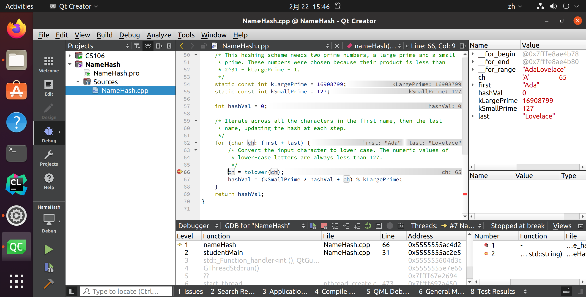
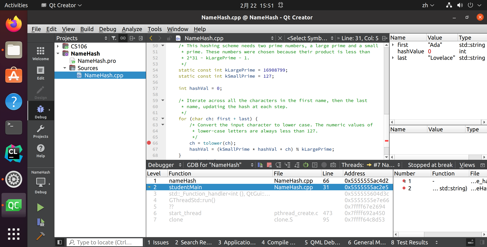
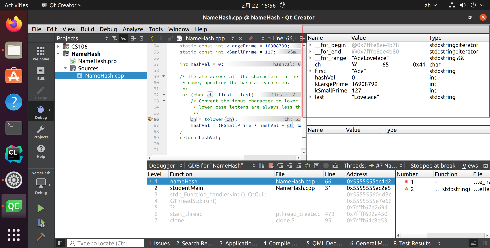
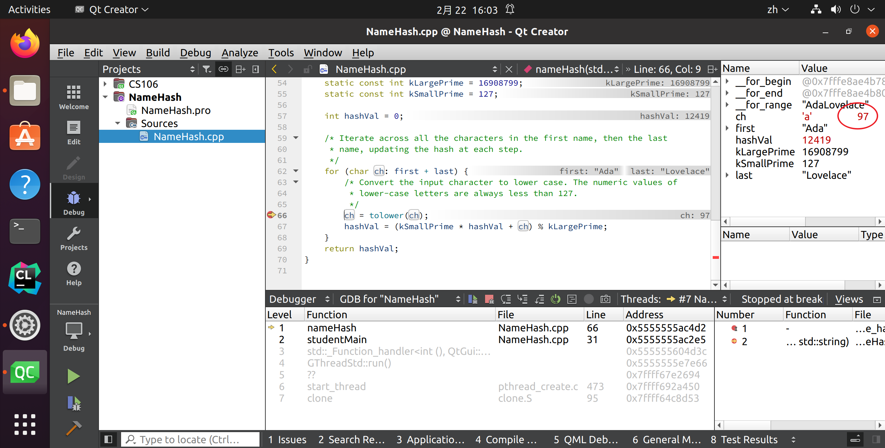
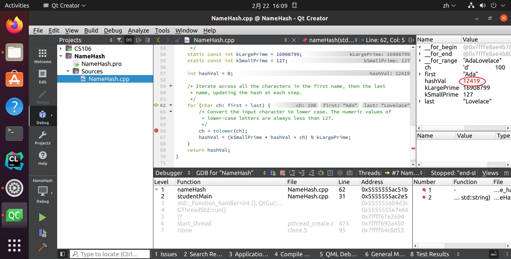
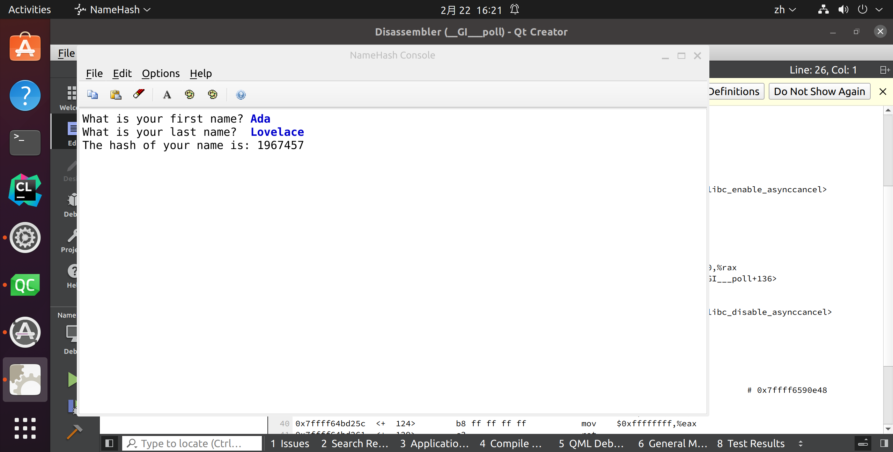

# a0

https://web.stanford.edu/class/cs106b/assignments/a0/

## Step One: Install Qt Creator
## Step Two: Download the Starter Files
## Step Three: Hash Your Name

Compile and run the program you've just downloaded. It will ask you to enter your (preferred) first and last names. When you do, it will give back a hash code, a special number associated with your name. You can think of your hash code as a “fingerprint” associated with your name that's unlikely to be the same as anyone else's fingerprint. ***Write this number down;\*** you'll need it to complete the assignment!

## Step Four: Use the Debugger

Open our handy [debugger tutorial](https://web.stanford.edu/class/cs106b/assignments/a0/DebuggerTutorial.pdf) and follow along step-by-step. At some point, you'll be asked to remember a special value. ***Write this special value down;\*** you'll need it when you submit.

- Enter Ada Lovelace
- 

- These grayed-out functions represent helper functions our libraries automagically call to help get your program set up.
- You don’t need to worry about these. They’ll show up in all the programs you run and you can safely ignore them.

- Now we learn about breakpoint and arrow, call stack
- Now, let's see how we can read the values of the variables in this function.

- Now, let's do something really cool – we're going to run this program one line at a time, watching what happens at each step!
- First, notice that the value stored in hashVal changed to 97. We know that it changed because the value is in red, and we know that nothing else changed because nothing else is in red!

- You'll now be at this point in the program. We've covered up the value of hashVal in this image, because at this point you should be able to see what hashVal is by reading the value in the side pane. This is the special value we want you to tell us when submitting the assignment!

- When you hover over it, it should say “Step Out.”
- Don’t click just yet. But when you do click, it will run the rest of the nameHash function until it finishes and returns.

- We can see that the nameHash function returned 1967457. Thanks, debugger!
- But if we look up over here, we see that hashValue isn’t storing 1967457, even though that’s what was returned.
- What's happened is that we've just returned from nameHash with a value, but since we're going through the program one step at a time, we haven't actually assigned that value to hashValue yet!
- To do this, click on this button. If you hover over it, it says “Continue,” and that button means “unpause the program and let it keep running from here.”

- If you do, you should see something like this. (The program window might not automatically
  pop up. That's okay! Just open it manually.) Our program is now done running!
- And, if you continue to build larger and larger pieces of software, you'll find that knowing how to use a debugger is a surprisingly valuable skill!

