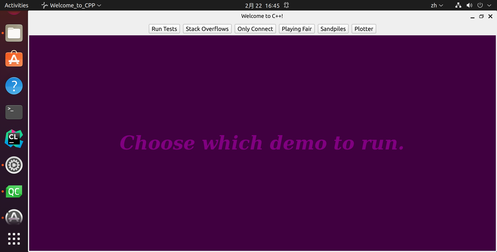
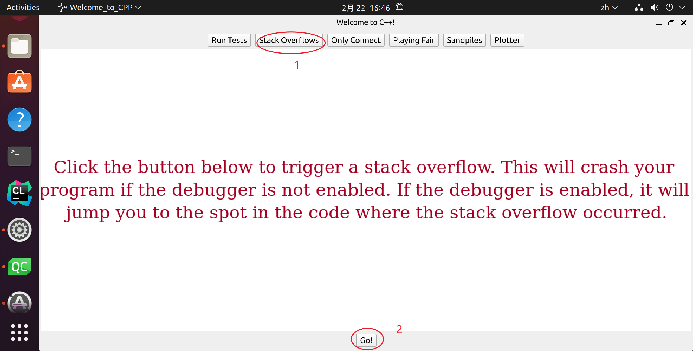
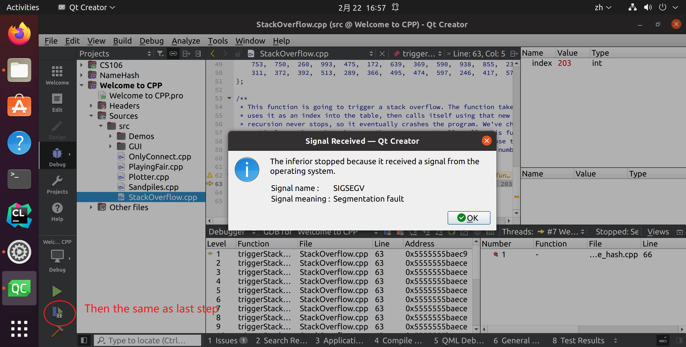
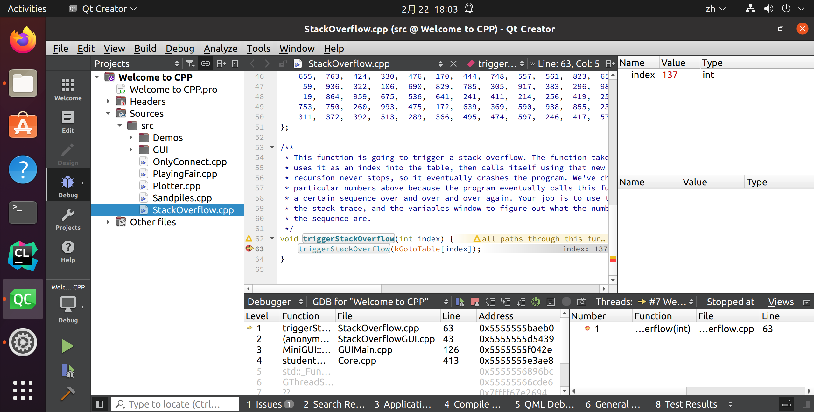

# a1

- [a1](#a1)
  - [Assignment Logistics](#assignment-logistics)
    - [Starter Files](#starter-files)
  - [Part One: Stack Overflows](#part-one-stack-overflows)
    - [Step One: See a Stack Overflow](#step-one-see-a-stack-overflow)
    - [Step Two: Trace a Stack Overflow](#step-two-trace-a-stack-overflow)
    - [Your Task](#your-task)
    - [Notes](#notes)
  - [Part Two: Only Connect](#part-two-only-connect)

<https://web.stanford.edu/class/cs106b/assignments/a1/#notes-1>

## Assignment Logistics

### Starter Files

We provide a ZIP of the starter project. Download the zip, extract the files, and double-click the `.pro` file to open the project in Qt Creator.

> 📦 [Starter code](https://web.stanford.edu/class/cs106b/assignments/a1/Assignment 1.zip)

## Part One: Stack Overflows

Whenever a program calls a function, the computer sets aside memory called a ***stack frame\*** for that function call in a region called the ***call stack\***. Whenever a function is called, it creates a new stack frame, and whenever a function returns the space for that stack frame is recycled.

As you saw on Wednesday, whenever a recursive function makes a recursive call, it creates a new stack frame, which in turn might make more stack frames, which in turn might make even more stack frames, etc. For example, when we computed `factorial(5)`, we ended up creating a net of six stack frames: one for each of `factorial(5)`, `factorial(4)`, `factorial(3)`, `factorial(2)`, `factorial(1)`, and `factorial(0)`. They were automatically cleaned up as soon as those functions returned.

But what would happen if you called `factorial` on a very large number, say, `factorial(7897987)`? This would create a lot of stack frames; specifically, it will make 7,897,988 of them (one for `factorial(7987987)`, one for `factorial(7987986)`, …, and one for `factorial(0)`). This is such a large number of stack frames that the call stack might not have space to store them. When too many stack frames need to be created at the same time, the result is a ***stack overflow\*** and the program will crash.

In the case of `factorial(7987987)`, a stack overflow occurs because we need a large but finite number of stack frames. In other cases, stack overflows arise due to programming errors. For example, consider the following (buggy!) implementation of the digitalRootOf function from Friday’s lecture:

```c++
/* This code is incorrect! Do not use it as a reference. */
int digitalRootOf(int n) {
    return digitalRootOf(sumOfDigitsOf(n));
}
```

Let’s imagine that you try calling `digitalRootOf(7897987)`. The initial stack frame looks like this:

> 

This stack frame calls `digitalRootOf(sumOfDigitsOf(7897987))`. The sum of the digits in the number is 7 + 8 + 9 + 7 + 9 + 8 + 7 = 55, so this fires off a call to `digitalRootOf(55)`, as shown here:

> 

This now calls `digitalRootOf(sumOfDigitsOf(55))`, which ends up calling `digitalRootOf(10)`:

> 

This now calls `digitalRootOf(sumOfDigitsOf(10))`, which ends up calling `digitalRootOf(1)`:

> 

This now calls `digitalRootOf(sumOfDigitsOf(1))`, which ends up calling `digitalRootOf(1)` again, as shown here:

> 

This call makes yet another call to `digitalRootOf(1)` for the same reason:

> 

And *that* call makes yet *another* call to `digitalRootOf(1)`:

> 

As you can see, this recursion is off to the races. It’s like an infinite loop, but with function calls. This code will trigger a stack overflow because at some point it will exhaust the memory in the call stack.

Another place you’ll see stack overflows is when you have a recursive function that, for some reason, misses or skips over its base case. For example, let’s suppose you want to write a function `isEven` that takes as input a number *n* and returns whether it’s an even number. You note that 0 is even (trust us, it is; take CS103 for details!) and, more generally, a number *n* is even precisely if *n* – 2 is even. For example, 2 is even because 2 – 2 = 0 is even, 4 is even because 4 – 2 = 2 is even, and 6 is even because 6 – 2 = 4 is even, etc. Based on this (correct) insight, you decide to write this (incorrect) recursive function:

```c++
/* This code is incorrect! Do not use it as a reference. */
bool isEven(int n) {
    if (n == 0) {
      return true;
    } else {
      return isEven(n - 2);
    }
}
```

Now, what happens if you call `isEven(5)`? This initially looks like this:

> 

This call will call `isEven(3)`, as shown here:

> 

And that call then calls `isEven(1)`:

> 

And here’s where things go wrong. This function now calls `isEven(-1)`, skipping over the base case:

> 

This call then calls `isEven(-3)`:

> 

And we’re off to the Stack Overflow Races – *n* will keep getting more negative until we’re out of space.

### Step One: See a Stack Overflow

There are two different ways that you can run a C++ program through Qt Creator. The first is to run the program normally, which you can do by clicking the large green triangle "run" button. The second is to run the program with the debugger engaged, which you saw how to do in Assignment 0. The behavior of a program that triggers a stack overflow is different based on whether it's running with the debugger on or off.



To see this, run the provided starter files without the debugger engaged (that is, with the green triangle run button). Click the "Stack Overflows" option. You'll see a message and a button at the bottom of the window that will trigger a stack overflow. Click that button and watch what happens. This is what it looks like when a C++ program crashes. What you see will depend on what operating system you're using. ***Write down a description of what you saw happen in the file comments of `StackOverflow.cpp`, up at the top of the file.\*** Now, if you see similar behavior in the future, you'll be able to say "oh yeah, that probably means my program crashed."

- #It just break and return to Qt,then shows:

```bash
16:49:41: The process "/usr/bin/make" exited normally.
16:49:41: Elapsed time: 00:00.
```



Next, run the program again, but this time with the debugger turned on. Follow the same steps as above to trigger the stack overflow. This time, you should see the debugger pop up and point at a line in the program where the stack overflow occurred. You'll also see the call stack, which should be filled with lots and lots of calls to the same function. Now that you've got the debugger engaged, you can investigate which function triggered the stack overflow and, ideally, to work out what went wrong. You don't need to write anything down just yet. For now, hit the red "stop" button to close the program.



Going forward, as you're writing your first recursive functions, keep what you just saw in mind. If you see something that looks like your program crashed with a stack overflow, turn on the debugger and run it again. You'll then be taken to the exact spot where the stack overflow occurred, and from there you can walk the call stack to see what's up. Do you see multiple calls to a recursive function with the same parameters? Or a sequence of negative values getting more negative? That might indicate what's going on.

### Step Two: Trace a Stack Overflow

In this part of the assignment, we’ve included a recursive function that looks like this:

```c++
void triggerStackOverflow(int index) {
    triggerStackOverflow(kGotoTable[index]);
}
```

Here, `kGotoTable` is a giant (1024-element) array of the numbers 0 through 1023 that have been randomly permuted. This function looks up its argument in the table, then makes a recursive call using that argument. As a result, the series of recursive calls made is extremely hard to predict by hand, and since the recursion never stops (do you see why?) this code will always trigger a stack overflow.

Our starter code includes the option to call this function passing in 137 as an initial value. Run the provided starter code in debug mode (you learned how to do that in Assignment 0!) and trigger the stack overflow. You’ll get an error message that depends on your OS (it could be something like “segmentation fault,” “access violation,” “stack overflow,” etc.) and the debugger should pop up. Walk up and down the call stack and inspect the sequence of values passed in as parameters to `triggerStackOverflow`.

We’ve specifically crafted the numbers in `kGotoTable` so that the calls in `triggerStackOverflow` form a cycle. Specifically, `triggerStackOverflow(137)` calls `triggerStackOverflow(x)` for some number *x*, and that calls `triggerStackOverflow(y)` for some number *y*, and that calls `triggerStackOverflow(z)` for some number *z*, etc. until eventually there’s some number *w* where `triggerStackOverflow(w)` calls `triggerStackOverflow(137)`, starting the cycle anew.

Your task in this part of the assignment is to tell us the sequence of the numbers in the cycle. For example, if the sequence was

- `triggerStackOverflow(137)` calls
- `triggerStackOverflow(106)`, which calls
- `triggerStackOverflow(271)`, which calls
- `triggerStackOverflow(137)`, which calls
- `triggerStackOverflow(106)`, which calls
- `triggerStackOverflow(271)`, which calls
- `triggerStackOverflow(137)`, which calls
- `triggerStackOverflow(106)`, which calls

Then you would give us the cycle 137, 106, 271, 137.



- 137,164,685,203.327,549,137,......,137

### Your Task

Below is a quick summary of the deliverables for this part of the assignment. See the above sections for more details.

1. Run the provided program without the debugger engaged and trigger a stack overflow using the menu. Update the file comments at the top of `StackOverflow.cpp` to describe what you saw happen when the stack overflow occurred.
2. Run the provided program a second time with the debugger engaged and trigger a stack overflow using the menu. Walk up and down the call stack in the debugger, inspecting the arguments to the recursive call, to determine what the cycle of recursive calls is. Then, update the file comments at the top of `StackOverflow.cpp` to list the cycle of recursive calls.


### Notes

Some notes on this part of the assignment:

- The topmost entry on the call stack might be corrupted and either not show a value or show the wrong number. Don’t worry if that’s the case – just move down an entry in the stack.
- Remember that if function *A* calls function *B*, then function *B* will appear higher on the call stack than function *A* because function *B* was called more recently than function *A*. Make sure you don’t report the cycle in reverse order!
- When you run the program in Debug mode, Qt Creator will switch to Debug View, which has a bunch of windows and side panels to view information about the running program. That’s great when you’re debugging, and not so great when you’re just trying to write code. You can switch back to the regular code-writing view by clicking the “Edit” button in the left side pane.
- You shouldn’t need to edit `StackOverflow.h` in the course of solving this problem.

## Part Two: Only Connect

The last round of the British quiz show *Only Connect* consists of puzzles of the following form: can you identify these movie titles, given that all characters except consonants have been deleted?

> ```
> BTYNDTHBST`   `MN`   `CTCHMFYCN`   `SRSMN
> ```

The first is "**B**eau**ty** a**nd** **th** **B**ea**st**," the second is "**M**oa**n**a," the third is "**C**a**tch** **M**e I**f** **Y**ou **C**a**n**," and we'll leave the last one as a mystery for you to work out if you're so inclined.

To form a puzzle string like this, you simply delete all characters from the original word or phrase except for consonants`子音`, then convert the remaining letters to ALL-CAPS.

Your task is to write a ***recursive\*** function

```
string onlyConnectize(string phrase);
```

that takes as input a string, then transforms it into an *Only Connect* puzzle. For example:

- `onlyConnectize("Elena Kagan")` returns `"LNKGN"`,
- `onlyConnectize("Antonin Scalia")` returns `"NTNNSCL"`,
- `onlyConnectize("EE 364A")` returns `""`,
- `onlyConnectize("For sale: baby shoes, never worn.")` returns `"FRSLBBYSHSNVRWRN"`,
- `onlyConnectize("I'm the bad guy. (Duh!)")` returns `"MTHBDGYDH"`, and
- `onlyConnectize("Annie Mae, My Sea Anemone Enemy!")` returns `"NNMMYSNMNNMY"`.

Notice that the letter Y isn’t removed from these strings. While you could argue that Y counts as a vowel in English, the actual BBC show leaves the letter Y in.

The starter code that we’ve provided contains code to test your function on certain inputs. These tests check a few sample strings and are not designed to be comprehensive. In addition to implementing the `onlyConnectize` function, you will need to add in at least one new test of your own using the `STUDENT_TEST` macro. To do so, use this syntax:

```
STUDENT_TEST("description of the test") {
    /* Put your testing code here. */
}
```

Take a look at the other tests provided to get a sense of how to write a test case. The `EXPECT_EQUAL` macro takes in two expressions. If those expressions are equal, great! Nothing happens. Otherwise, `EXPECT` reports an error. You can run the tests by choosing the “Run Tests” button from the demo app. You can read more about how these tests work through our [Guide to Testing](https://web.stanford.edu/class/cs106b/resources/testing_guide.html).

Be strategic about the tests you add. What are some tricky cases you might want to confirm work correctly? Are there any edge cases (small cases, unusual cases, etc.) that would be worth testing?

Once you have everything working, run our demo program to play around with your code interactively. Then, leave an *Only Connect* puzzle of your own choosing for your section leader! To do so, edit the file comments at the top of the file with the consonant string, along with a hint.

### Your Task

To summarize, here’s what you need to do:

1. Implement the `onlyConnectize` function in `OnlyConnect.cpp`. This function must be implemented recursively. It takes as input a string. The output should be that same string, in upper case, with all characters except consonants deleted. Feel free to write helper functions if you’d like. As you go, test your code by using the “Run Tests” button in the provided program.
2. Add at least one test case using the `STUDENT_TEST` macro. Your test should go in the file `OnlyConnect.cpp`, preferably with all the other test cases. For full credit, your test case should check some style of input that wasn’t previously addressed by the provided tests.
3. Leave an Only Connect puzzle for your section leader in the comments at the top of the file.

As you’re writing up your solution to this problem, remember that coding style is important. We have a [style guide](https://web.stanford.edu/class/cs106b/resources/style_guide.html) available on the CS106B website. Take a few minutes to read over it, then review your code to make sure it conforms to those style expectations. In particular, *make sure to indent your code!* On Qt Creator, you can automatically indent your code by pressing Command-I or CTRL-I. We recommend that you indent early and indent often to make sure that your code is structured the way you think it is.

### Notes

Some notes on this problem:

- All C++ programs begin inside the `main()` function, and we’ve already written this function for you in one of the starter files. You just need to implement `onlyConnectize` and are not responsible for writing `main()`. (In fact, if you did try to write your own `main()` function here, you’d get an error because there would be two different versions of `main()` and C++ wouldn’t know which one to pick!)
- If one of the test cases crashes with a stack overflow, it will cause the entire program to crash. But not to worry! You've seen how to recognize stack overflows in the first part of this assignment. If you think you're seeing a stack overflow, run the program in debug mode, find where the stack overflow is, and explore the call stack and local variables window to isolate what's going on.
- Your solution must be recursive. You may not use loops (`while`, `for`, `do…while`, or `goto`).
- Make sure that you’re always returning a value from your recursive function. It’s easy to accidentally forget to do this when you’re getting started with recursion.
- You can use `toUpperCase` from the `"strlib.h"` header to convert a single character to upper case. It takes in a `char`, then returns the upper-case version of that letter. If you call `toUpperCase` on a non-letter character like `'$'` or `'*'`, it will return the original character unmodified.
- The `isalpha` function from the `<cctype>` header takes in a character and returns whether it’s a letter. There is no library function that checks if a letter is a consonant or vowel, though.
- You should delete all characters that aren't consonants, including spaces, numbers, digits, etc.
- If you’re coming from Python, note that C++ doesn’t have an in operator like the one in Python and that the and and or operators are denoted by `&&` and `||`, respectively. Check out the [guide to transitioning from Python to C++](https://web.stanford.edu/class/cs106b/resources/python_to_cpp.html) on the course website for more information.
- Remember that C++ treats individual characters differently than strings. Individual characters have type `char`. To talk about a specific single character, you must use single quotes (e.g. `'a'`rather than `"a"`). Strings have type `string`. To talk about a specific string, you *must* use doublequotes (e.g. `"hello"` rather than `'hello'`).
- You can convert a `char` to a `string` by using the `charToString` function from `"strlib.h"`.
- You are welcome to add your own helper functions when solving this problem. Those functions must obey the same rules as the main function (e.g. no loops).
- Just to make sure you didn’t miss this, we are ***not\*** treating the letter `y` as a vowel. This is in line with what the actual BBC show does.
- You shouldn’t need to edit `OnlyConnect.h` in the course of solving this problem.
