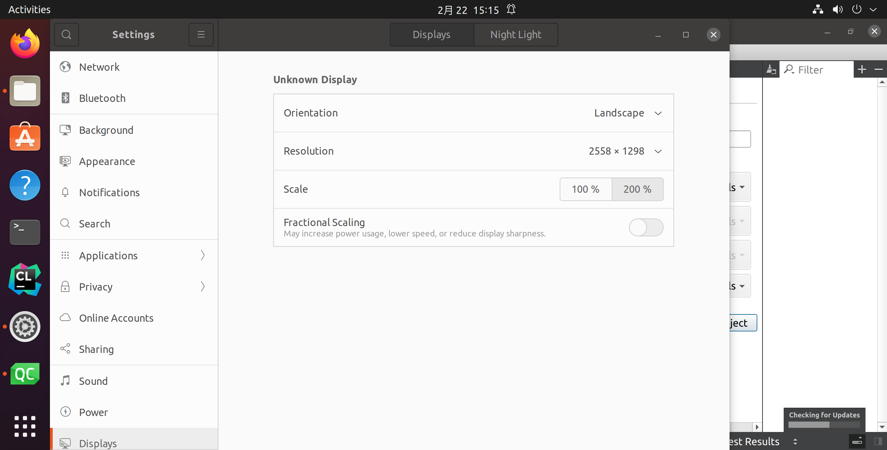
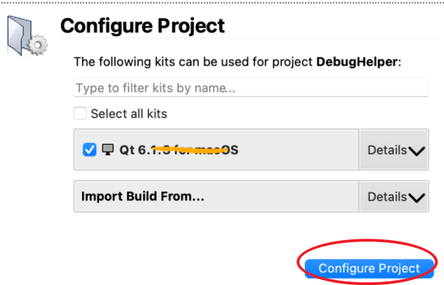
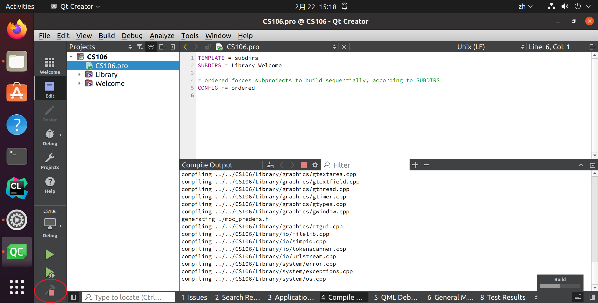

# Install Qt

## Ubuntu config

- Keep the window size or it will become default.

## Download and test in Ubuntu

https://web.stanford.edu/dept/cs_edu/resources/qt/install-linux

- First open the .pro.
- Then configure project.

- Build the program

- Run the program

