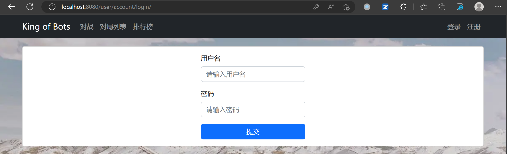
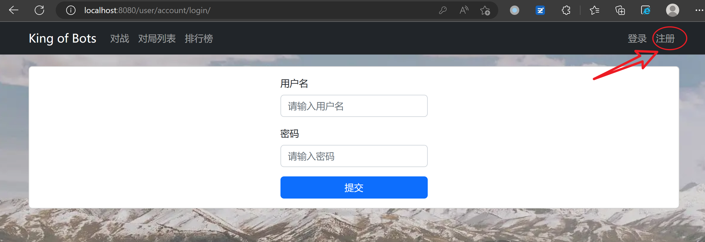

# Kob

## 项目概述

该项目实现了一个在线贪吃蛇游戏对战平台。

项目的后端基于Spring Boot，前端基于Vue.js框架。

后端服务提供Bot管理和User账户管理功能，用户可以通过注册、登录账号，然后授权Bot使用API接口。已授权的Bot可以进行添加、删除和更新操作。

前端游戏界面有游戏地图和两条蛇，地图由若干个格子组成，其中一些是墙壁。用户分为两个玩家，控制蛇在地图上移动，存活比对方时间长的一方获胜。程序使用了Vue.js的路由模块和Vuex的状态管理模块，实现了用户登录、退出、以及权限控制等功能。

## 后端

实现了基于Spring Boot的后端服务，提供Bot管理和User账户管理功能。用户可以通过注册、登录账号，然后授权Bot使用API接口。已授权的Bot可以进行添加、删除和更新操作。

### 功能总结

以下是每个文件的功能总结：

| 文件名                                                    | 功能描述                                  |
| --------------------------------------------------------- | ----------------------------------------- |
| BackendApplication.java                                   | Spring Boot应用程序的入口点；             |
| config\CorsConfig.java                                    | 配置CORS跨域资源共享；                    |
| config\SecurityConfig.java                                | Spring Security安全认证配置；             |
| config\filter\JwtAuthenticationTokenFilter.java           | 基于JWT的认证过滤器；                     |
| controller\pk\BotInfoController.java                      | Bot管理控制器，提供获取单个Bot信息的API； |
| controller\pk\IndexController.java                        | 首页控制器，提供欢迎页面API；             |
| controller\user\account\InfoController.java               | 获取用户信息的控制器；                    |
| controller\user\account\LoginController.java              | 用户登录控制器；                          |
| controller\user\account\RegisterController.java           | 用户注册控制器；                          |
| controller\user\bot\AddController.java                    | 添加Bot的控制器；                         |
| controller\user\bot\GetListController.java                | 获取Bot列表的控制器；                     |
| controller\user\bot\RemoveController.java                 | 移除Bot的控制器；                         |
| controller\user\bot\UpdateController.java                 | 更新Bot信息的控制器；                     |
| mapper\BotMapper.java                                     | Bot实体的数据库操作接口；                 |
| mapper\UserMapper.java                                    | User实体的数据库操作接口；                |
| mapper\service\impl\UserDetailsServiceImpl.java           | 用户登录验证的实现类；                    |
| mapper\service\impl\user\account\InfoServiceImpl.java     | 获取用户信息的实现类；                    |
| mapper\service\impl\user\account\LoginServiceImpl.java    | 用户登录的实现类；                        |
| mapper\service\impl\user\account\RegisterServiceImpl.java | 用户注册的实现类；                        |
| mapper\service\impl\user\bot\AddServiceImpl.java          | 添加Bot的实现类；                         |
| mapper\service\impl\user\bot\GetListServiceImpl.java      | 获取Bot列表的实现类；                     |
| mapper\service\impl\user\bot\RemoveServiceImpl.java       | 移除Bot的实现类；                         |
| mapper\service\impl\user\bot\UpdateServiceImpl.java       | 更新Bot信息的实现类；                     |
| mapper\service\impl\utils\UserDetailsImpl.java            | 用户登录认证的实现类；                    |
| mapper\service\user\account\InfoService.java              | 获取用户信息的服务接口；                  |
| mapper\service\user\account\LoginService.java             | 用户登录的服务接口；                      |
| mapper\service\user\account\RegisterService.java          | 用户注册的服务接口；                      |
| mapper\service\user\bot\AddService.java                   | 添加Bot的服务接口；                       |
| mapper\service\user\bot\GetListService.java               | 获取Bot列表的服务接口；                   |
| mapper\service\user\bot\RemoveService.java                | 移除Bot的服务接口；                       |
| mapper\service\user\bot\UpdateService.java                | 更新Bot信息的服务接口；                   |
| pojo\Bot.java                                             | 定义Bot实体类；                           |
| pojo\User.java                                            | 定义User实体类；                          |
| utils\JwtUtil.java                                        | 生成、解析、验证JWT Token的工具类。       |

### 代码结构

src/main/java/com/example/backend：

-   BackendApplication.java：Spring Boot应用程序的入口点；
-   config：
    -   CorsConfig.java：配置CORS跨域资源共享；
    -   SecurityConfig.java：Spring Security安全认证配置；
    -   filter：
        -   JwtAuthenticationTokenFilter.java：基于JWT的认证过滤器；
-   controller/pk：
    -   BotInfoController.java：Bot管理控制器，提供获取单个Bot信息的API；
    -   IndexController.java：首页控制器，提供欢迎页面API；
-   controller/user/account：
    -   InfoController.java：获取用户信息的控制器；
    -   LoginController.java：用户登录控制器；
    -   RegisterController.java：用户注册控制器；
-   controller/user/bot：
    -   AddController.java：添加Bot的控制器；
    -   GetListController.java：获取Bot列表的控制器；
    -   RemoveController.java：移除Bot的控制器；
    -   UpdateController.java：更新Bot信息的控制器；
-   mapper：
    -   BotMapper.java：Bot实体的数据库操作接口；
    -   UserMapper.java：User实体的数据库操作接口；
    -   service/impl：
        -   UserDetailsServiceImpl.java：用户登录验证的实现类；
        -   user/account：
            -   InfoServiceImpl.java：获取用户信息的实现类；
            -   LoginServiceImpl.java：用户登录的实现类；
            -   RegisterServiceImpl.java：用户注册的实现类；
        -   user/bot：
            -   AddServiceImpl.java：添加Bot的实现类；
            -   GetListServiceImpl.java：获取Bot列表的实现类；
            -   RemoveServiceImpl.java：移除Bot的实现类；
            -   UpdateServiceImpl.java：更新Bot信息的实现类；
    -   service/impl/utils：
        -   UserDetailsImpl.java：用户登录认证的实现类；
    -   service/user/account：
        -   InfoService.java：获取用户信息的服务接口；
        -   LoginService.java：用户登录的服务接口；
        -   RegisterService.java：用户注册的服务接口；
    -   service/user/bot：
        -   AddService.java：添加Bot的服务接口；
        -   GetListService.java：获取Bot列表的服务接口；
        -   RemoveService.java：移除Bot的服务接口；
        -   UpdateService.java：更新Bot信息的服务接口；
-   pojo：
    -   Bot.java：定义Bot实体类；
    -   User.java：定义User实体类；
-   utils：
    -   JwtUtil.java：生成、解析、验证JWT Token的工具类。

### 代码结构图


## 前端

实现了基于Spring Boot的后端服务，提供Bot管理和User账户管理功能。用户可以通过注册、登录账号，然后授权Bot使用API接口。已授权的Bot可以进行添加、删除和更新操作。

前端实现了一个基于Vue.js框架开发的贪吃蛇游戏，采用了模块化的方式组织代码，通过运用Vue.js提供的组件化思想，使得开发者可以方便的扩展和修改程序。游戏分为游戏地图和两条蛇，地图由若干个格子组成，其中一些是墙壁。用户控制蛇在地图上移动，两个玩家每次走一步，控制蛇在地图上移动并存活。蛇的长度会随着时间变化。程序使用了Vue.js的路由模块和Vuex的状态管理模块，实现了用户登录、退出、以及权限控制等功能。

### 功能总结

以下是每个文件的功能表格：

| 文件                           | 功能                                                  |
| ------------------------------ | ----------------------------------------------------- |
| main.js                        | 导入Vue.js及其他模块，创建Vue.js实例，渲染应用程序    |
| assets/scripts/AcGameObject.js | 定义AcGameObject类及相关方法，存储游戏变量            |
| assets/scripts/Cell.js         | 定义Cell类及相关方法，用于创建单元格对象              |
| assets/scripts/GameMap.js      | 定义GameMap类及相关方法，实现游戏地图的实现           |
| assets/scripts/Snake.js        | 定义Snake类及相关方法，存储蛇的基本信息和处理蛇的行为 |
| assets/scripts/Wall.js         | 定义Wall类及相关方法，用于创建墙壁对象                |
| router/index.js                | 定义路由及导出路由器                                  |
| store/index.js                 | 定义Vuex Store模块及相关方法                          |
| store/user.js                  | 定义用户相关的Vuex Store模块及相关方法                |

### 代码结构

前端代码采用了模块化的方式组织，使用Vue.js框架提供的组件化思想，便于扩展和修改。具体代码结构如下：

-   assets：静态资源文件，包含游戏使用的图片、音频等文件；
    -   scripts：JavaScript文件；
        -   AcGameObject.js：定义AcGameObject类及相关方法，存储游戏变量；
        -   Cell.js：定义Cell类及相关方法，用于创建单元格对象；
        -   GameMap.js：定义GameMap类及相关方法，实现游戏地图的实现；
        -   Snake.js：定义Snake类及相关方法，存储蛇的基本信息和处理蛇的行为；
        -   Wall.js：定义Wall类及相关方法，用于创建墙壁对象。
    -   styles：样式文件；
        -   game.css：游戏页面的样式文件。
-   components：Vue组件文件；
    -   Game.vue：游戏组件，实现贪吃蛇游戏的核心逻辑；
    -   Login.vue：登录组件，用于用户登录；
    -   Register.vue：注册组件，用于用户注册；
    -   User.vue：用户信息组件，用于展示用户信息。
-   router：路由文件；
    -   index.js：定义路由及导出路由器。
-   store：状态管理文件；
    -   index.js：定义Vuex Store模块及相关方法；
    -   user.js：定义用户相关的Vuex Store模块及相关方法。
-   App.vue：应用程序组件，是所有Vue组件的父组件；
-   main.js：应用程序入口文件，导入Vue.js及其他模块，创建Vue.js实例，渲染应用程序。

### 代码结构图


## 如何运行

### 后端

1.  下载或克隆项目代码。

2.  进入后端代码目录。

    ```
    cd kob/backend
    ```

3.  使用Maven构建项目。

    ```bash
    mvn clean package
    ```

4.  运行项目。

    ```bash
    java -jar target/backend-0.0.1-SNAPSHOT.jar
    ```

### 前端

1.  进入前端代码目录。

    ```bash
    cd kob/web
    ```

2.  安装依赖。

    ```bash
    npm install --save @babel/core@7.21.0 @babel/eslint-parser@7.19.1 @popperjs/core@2.11.6 @vue/cli-plugin-babel@5.0.8 @vue/cli-plugin-eslint@5.0.8 @vue/cli-service@5.0.8 bootstrap@5.2.3 core-js@3.29.0 eslint-plugin-vue@8.7.1 eslint@7.32.0 jquery@3.6.3 vue-router@4.1.6 vue@3.2.47 vuex@4.1.0
    ```

3.  启动开发服务器。

    ```bash
    npm run serve
    ```

4.  打包项目。

    ```bash
    npm run build
    ```

## 如何使用

1.  在浏览器中访问以下地址，自动跳转到登录页面，表示项目已启动成功。

    ```
    http://localhost:8080
    ```

    

2.  点击菜单栏中的右上角“注册”跳转到注册页面。




3.   输入用户名，和密码，并确认密码，注册一个新用户。若不符合要求，会显示报错信息。


4.   注册成功后，跳转到登录页面，输入用户名和密码后登录。若不符合要求，会显示报错信息。


5.   登录成功后，自动跳转到 pk 页面，游戏开始。地图随机生成并确保联通，初始状态下，蛇分别位于左下角和右上角。

     

6.   开始对战。蓝色方以键盘上的“WASD”控制“上左下右”四个方向，红色方以键盘上的箭头控制“上左下右”四个方向。每次双方都需要输入一个方向，双方都输入后蛇头移动一个单位。蛇的身体随着时间逐渐变长。


7.   当有一条蛇做出了错误的动作，如撞墙、掉头、与另一条蛇相撞、撞到自己的身体，后身体变白色。此时游戏结束，另一条蛇获胜。


8.   当刷新浏览器时，游戏重新开始，地图再次随机生成。


9.   右上角点击用户名的下拉菜单，点击“退出”后退出当前用户。退出后自动跳转到登录页面。


